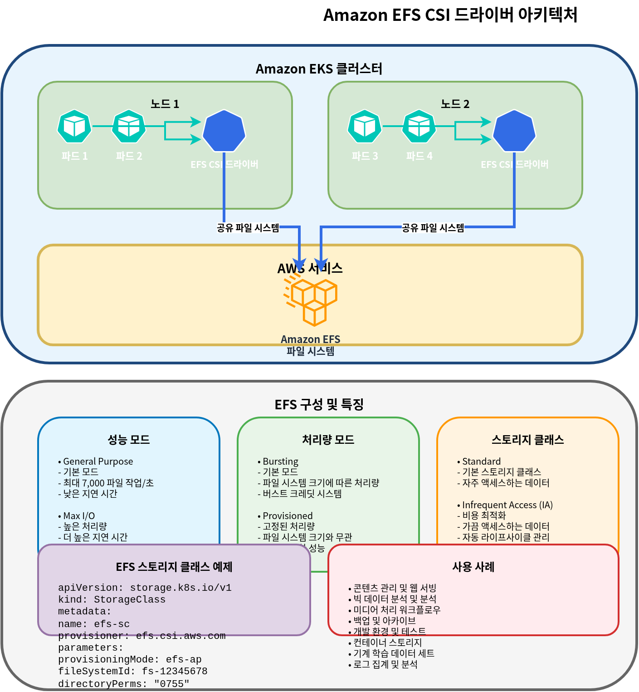

# EKS Storage

> **最終更新**: July 3, 2026

Amazon EKS で applications を実行する際、data の保存と管理にはさまざまな storage options があります。このドキュメントでは、EKS storage の基本概念と、Amazon EBS (Elastic Block Store) および Amazon EFS (Elastic File System) の使用方法について説明します。

## Table of Contents

1. [Kubernetes Storage Basic Concepts](04-eks-storage-part1.md#kubernetes-storage-basic-concepts)
2. [Amazon EKS Storage Options Overview](04-eks-storage-part1.md#amazon-eks-storage-options-overview)
3. [Storage with Amazon EBS](04-eks-storage-part1.md#storage-with-amazon-ebs)
4. [Storage with Amazon EFS](04-eks-storage-part1.md#storage-with-amazon-efs)
5. [Storage Classes and Dynamic Provisioning](04-eks-storage-part1.md#storage-classes-and-dynamic-provisioning)

## Kubernetes Storage Basic Concepts

まず、Kubernetes で storage を管理するための主要な概念を理解しましょう。


### Volume

volume は、pod 内の containers に mount できる directory であり、container が再起動しても data は保持されます。volume の lifetime は pod の lifetime と同じで、pod が削除されると volume も削除されます。

### Persistent Volume (PV)

persistent volume は、administrator によって provision されるか、storage class を通じて動的に provision される cluster storage の一部です。PVs は pods とは独立した lifecycle を持ち、pods が削除されても PVs は保持されます。

### Persistent Volume Claim (PVC)

persistent volume claim は、user による storage の要求です。PVC は特定の size と access mode を持つ storage を要求し、この request は適切な PV に bind されます。

### StorageClass

storage class は、administrator が提供する storage の「class」を記述します。storage classes を使用すると、PVCs が作成されたときに PVs を動的に provision できます。

### Access Modes

Kubernetes は次の access modes をサポートしています。

* **ReadWriteOnce (RWO)**: 単一 node から read/write として mount できます
* **ReadOnlyMany (ROX)**: 複数 nodes から read-only として mount できます
* **ReadWriteMany (RWX)**: 複数 nodes から read/write として mount できます
* **ReadWriteOncePod (RWOP)**: 単一 pod のみから read/write として mount できます (Kubernetes 1.22+)

## Amazon EKS Storage Options Overview

Amazon EKS では、containerized applications に storage を提供するために、さまざまな AWS storage services を活用できます。


### Main Storage Options

1. **Amazon EBS (Elastic Block Store)**
   * Block storage、単一 node に mount 可能 (RWO)
   * 高性能で耐久性のある block storage
   * databases、stateful applications に適しています
2. **Amazon EFS (Elastic File System)**
   * fully managed NFS file system
   * 複数 nodes から同時に mount 可能 (RWX)
   * shared file systems を必要とする workloads に適しています
3. **Amazon FSx for Lustre**
   * 高性能 file system
   * machine learning、HPC、big data analytics に適しています
   * 複数 nodes から同時に mount 可能 (RWX)
4. **Amazon S3 (Simple Storage Service)**
   * Object storage
   * volume として直接 mount することはできませんが、S3 API 経由でアクセスできます
   * large-scale data storage に適しています
5. **EC2 Instance Store (Local NVMe)**
   * EC2 instance に物理的に接続された ephemeral local NVMe storage で、非常に低い latency を提供します
   * EC2 Instance Store CSI Driver は 2026 年 5 月に Amazon EKS add-on として general availability (GA) に到達したため、EKS Console/CLI から標準 add-on として install および管理できるようになりました（以前は community manifests を使用した手動 install が必要でした）。driver は volume lifecycle を自動的に管理し、operational overhead を削減します
   * AI/ML ephemeral data processing、Spark/Hadoop local caching、high-throughput log processing、および database cache tiers に適しています
   * Cost: driver 自体は無料です。instance store を含む基盤となる EC2 instance の料金のみを支払います ([source](https://aws.amazon.com/about-aws/whats-new/2026/05/ec2-csi-eks/))

### Storage Options Comparison

| Storage Option     | Type               | Access Mode    | Performance                   | Use Cases                                                           |
| ------------------ | ------------------ | -------------- | ----------------------------- | ------------------------------------------------------------------- |
| Amazon EBS         | Block              | RWO            | High                          | Databases, stateful applications                                    |
| Amazon EFS         | File               | RWX            | Medium                        | Shared files, web servers, CMS                                      |
| FSx for Lustre     | File               | RWX            | Very High                     | HPC, ML training, big data                                          |
| Amazon S3          | Object             | API Access     | Medium                        | Backup, archive, static content                                     |
| EC2 Instance Store | Block (local NVMe) | RWO, ephemeral | Very High (ultra-low latency) | AI/ML ephemeral data, local caching, high-throughput log processing |

## Storage with Amazon EBS

Amazon EBS は、EC2 instances に attach できる block-level storage volumes を提供します。EKS では、EBS CSI (Container Storage Interface) driver を通じて、EBS volumes を Kubernetes pods に mount できます。


### Installing EBS CSI Driver

EKS で EBS volumes を使用するには、EBS CSI driver を install する必要があります。この driver は Amazon EKS add-on として提供されます。

```bash
# Install EBS CSI driver
eksctl create addon --name aws-ebs-csi-driver --cluster my-cluster --version latest

# Or using AWS CLI
aws eks create-addon --cluster-name my-cluster --addon-name aws-ebs-csi-driver --addon-version latest
```

### Creating EBS Storage Class

EBS volumes の dynamic provisioning 用に storage class を作成します。ここでは gp3 volume type を使用します。

```yaml
apiVersion: storage.k8s.io/v1
kind: StorageClass
metadata:
  name: ebs-gp3
provisioner: ebs.csi.aws.com
volumeBindingMode: WaitForFirstConsumer
parameters:
  type: gp3
  encrypted: "true"
  fsType: ext4
```

### Creating Persistent Volume Claim (PVC)

application で使用する PVC を作成します。

```yaml
apiVersion: v1
kind: PersistentVolumeClaim
metadata:
  name: ebs-claim
spec:
  accessModes:
    - ReadWriteOnce
  storageClassName: ebs-gp3
  resources:
    requests:
      storage: 10Gi
```

### Using PVC in a Pod

作成した PVC を pod に mount します。

```yaml
apiVersion: v1
kind: Pod
metadata:
  name: app-with-ebs
spec:
  containers:
  - name: app
    image: nginx
    volumeMounts:
    - mountPath: "/data"
      name: ebs-volume
  volumes:
  - name: ebs-volume
    persistentVolumeClaim:
      claimName: ebs-claim
```

### EBS Volume Snapshots

EBS volumes の snapshots を作成して data を backup できます。

```yaml
apiVersion: snapshot.storage.k8s.io/v1
kind: VolumeSnapshot
metadata:
  name: ebs-snapshot
spec:
  volumeSnapshotClassName: csi-aws-vsc
  source:
    persistentVolumeClaimName: ebs-claim
```

### EBS Volume Expansion

必要に応じて EBS volumes の size を拡張できます。

```yaml
apiVersion: v1
kind: PersistentVolumeClaim
metadata:
  name: ebs-claim
spec:
  accessModes:
    - ReadWriteOnce
  storageClassName: ebs-gp3
  resources:
    requests:
      storage: 20Gi  # Expanded from 10Gi to 20Gi
```

### EBS Volume Types and Performance

Amazon EBS はさまざまな volume types を提供します。

| Volume Type | Description              | Use Cases                                   |
| ----------- | ------------------------ | ------------------------------------------- |
| gp3         | General Purpose SSD      | Suitable for most workloads, cost-effective |
| io2         | Provisioned IOPS SSD     | High-performance databases                  |
| st1         | Throughput Optimized HDD | Big data, log processing                    |
| sc1         | Cold HDD                 | Infrequently accessed data                  |

EKS では、gp3 volume type が推奨されます。gp3 は consistent performance を提供しながら cost-effective です。

## Storage with Amazon EFS

Amazon EFS は、複数の EC2 instances から同時にアクセスできる fully managed NFS file system です。EKS では、EFS CSI driver を通じて EFS file systems を複数の pods に同時に mount できます。



### Installing EFS CSI Driver

EKS で EFS を使用するには、EFS CSI driver を install する必要があります。

```bash
# Install EFS CSI driver
eksctl create addon --name aws-efs-csi-driver --cluster my-cluster --version latest

# Or using AWS CLI
aws eks create-addon --cluster-name my-cluster --addon-name aws-efs-csi-driver --addon-version latest
```

### Creating EFS File System

AWS Management Console、AWS CLI、または AWS CloudFormation を使用して EFS file system を作成します。

```bash
# Create EFS file system using AWS CLI
aws efs create-file-system \
  --performance-mode generalPurpose \
  --throughput-mode bursting \
  --encrypted \
  --tags Key=Name,Value=MyEFSFileSystem

# Save file system ID
EFS_FS_ID=$(aws efs describe-file-systems --query "FileSystems[?Name=='MyEFSFileSystem'].FileSystemId" --output text)

# Get EKS cluster VPC ID
VPC_ID=$(aws eks describe-cluster --name my-cluster --query "cluster.resourcesVpcConfig.vpcId" --output text)

# Create security group
aws ec2 create-security-group \
  --group-name MyEFSSecurityGroup \
  --description "Security group for EFS mount targets" \
  --vpc-id $VPC_ID

SG_ID=$(aws ec2 describe-security-groups \
  --filters Name=group-name,Values=MyEFSSecurityGroup \
  --query "SecurityGroups[0].GroupId" --output text)

# Allow NFS traffic
aws ec2 authorize-security-group-ingress \
  --group-id $SG_ID \
  --protocol tcp \
  --port 2049 \
  --cidr 10.0.0.0/16

# Get subnet IDs
SUBNET_IDS=$(aws ec2 describe-subnets \
  --filters "Name=vpc-id,Values=$VPC_ID" \
  --query "Subnets[*].SubnetId" --output text)

# Create mount target in each subnet
for SUBNET_ID in $SUBNET_IDS; do
  aws efs create-mount-target \
    --file-system-id $EFS_FS_ID \
    --subnet-id $SUBNET_ID \
    --security-groups $SG_ID
done
```

### Creating EFS Storage Class

EFS を使用するための storage class を作成します。

```yaml
apiVersion: storage.k8s.io/v1
kind: StorageClass
metadata:
  name: efs-sc
provisioner: efs.csi.aws.com
parameters:
  provisioningMode: efs-ap
  fileSystemId: fs-0123456789abcdef0  # Created EFS file system ID
  directoryPerms: "700"
```

### Creating Persistent Volume Claim (PVC)

EFS を使用するための PVC を作成します。

```yaml
apiVersion: v1
kind: PersistentVolumeClaim
metadata:
  name: efs-claim
spec:
  accessModes:
    - ReadWriteMany  # Can read/write simultaneously from multiple nodes
  storageClassName: efs-sc
  resources:
    requests:
      storage: 5Gi
```

### Using EFS PVC in a Pod

作成した PVC を pod に mount します。

```yaml
apiVersion: v1
kind: Pod
metadata:
  name: app-with-efs
spec:
  containers:
  - name: app
    image: nginx
    volumeMounts:
    - mountPath: "/shared-data"
      name: efs-volume
  volumes:
  - name: efs-volume
    persistentVolumeClaim:
      claimName: efs-claim
```

### EFS Access Points

EFS access points を使用すると、特定の directories への access を制限し、user と group permissions を設定できます。

```yaml
apiVersion: v1
kind: PersistentVolume
metadata:
  name: efs-pv
spec:
  capacity:
    storage: 5Gi
  volumeMode: Filesystem
  accessModes:
    - ReadWriteMany
  persistentVolumeReclaimPolicy: Retain
  storageClassName: efs-sc
  csi:
    driver: efs.csi.aws.com
    volumeHandle: fs-0123456789abcdef0::fsap-0123456789abcdef0
    # volumeHandle format: {EFS file system ID}::{EFS access point ID}
```

### EFS Performance Modes and Throughput Modes

Amazon EFS は 2 つの performance modes と 3 つの throughput modes を提供します。

**Performance Modes**:

* **General Purpose**: ほとんどの workloads に推奨されます
* **Max I/O**: 高い parallel processing を必要とする workloads に適しています

**Throughput Modes**:

* **Bursting**: default mode。file system size に基づいて burst credits を提供します
* **Provisioned**: consistent throughput が必要な場合に使用します
* **Elastic**: workload に基づいて throughput を自動的に調整します（推奨）

## Storage Classes and Dynamic Provisioning

Kubernetes storage classes を使用すると、persistent volumes を動的に provision できます。EKS では、さまざまな AWS storage services 用に storage classes を設定できます。


### Volume Binding Modes

storage class の `volumeBindingMode` field は、PVCs が作成されたときに PVs がどのように bind されるかを決定します。

* **Immediate**: PVC が作成されると、PV をすぐに provision して bind します。
* **WaitForFirstConsumer**: pod が PVC を使用しようとするまで PV provisioning を遅延します。

EBS のような node-local storage では、`WaitForFirstConsumer` の使用が推奨されます。これにより、volume は pod が schedule される node と同じ availability zone に作成されます。

### Setting Default Storage Class

特定の storage class を default として設定すると、PVC で storage class が指定されていない場合でも、その storage class を使用できます。

```yaml
apiVersion: storage.k8s.io/v1
kind: StorageClass
metadata:
  name: ebs-gp3
  annotations:
    storageclass.kubernetes.io/is-default-class: "true"
provisioner: ebs.csi.aws.com
volumeBindingMode: WaitForFirstConsumer
parameters:
  type: gp3
  encrypted: "true"
```

### Storage Class Examples

**1. EBS gp3 Storage Class**

```yaml
apiVersion: storage.k8s.io/v1
kind: StorageClass
metadata:
  name: ebs-gp3
provisioner: ebs.csi.aws.com
volumeBindingMode: WaitForFirstConsumer
parameters:
  type: gp3
  encrypted: "true"
  iops: "3000"
  throughput: "125"
```

**2. EFS Storage Class**

```yaml
apiVersion: storage.k8s.io/v1
kind: StorageClass
metadata:
  name: efs-sc
provisioner: efs.csi.aws.com
parameters:
  provisioningMode: efs-ap
  fileSystemId: fs-0123456789abcdef0
  directoryPerms: "700"
```

**3. FSx for Lustre Storage Class**

```yaml
apiVersion: storage.k8s.io/v1
kind: StorageClass
metadata:
  name: fsx-lustre
provisioner: fsx.csi.aws.com
parameters:
  subnetId: subnet-0123456789abcdef0
  securityGroupIds: sg-0123456789abcdef0
  deploymentType: SCRATCH_2
  automaticBackupRetentionDays: "0"
  dailyAutomaticBackupStartTime: "00:00"
  perUnitStorageThroughput: "200"
  dataCompressionType: "NONE"
```

### Reclaim Policies

persistent volume の reclaim policy は、PVC が削除されたときに PV とその data がどのように扱われるかを決定します。

* **Delete**: PVC が削除されると、PV とその data も削除されます。
* **Retain**: PVC が削除されても、PV と data は保持されます。administrator が手動で clean up する必要があります。
* **Recycle**: deprecated policy です。代わりに dynamic provisioning と storage classes を使用してください。

storage class の `persistentVolumeReclaimPolicy` field を使用して reclaim policy を設定できます。

```yaml
apiVersion: storage.k8s.io/v1
kind: StorageClass
metadata:
  name: ebs-gp3-retain
provisioner: ebs.csi.aws.com
volumeBindingMode: WaitForFirstConsumer
reclaimPolicy: Retain
parameters:
  type: gp3
  encrypted: "true"
```

## Conclusion

Amazon EKS では、さまざまな storage options を使用して、application requirements を満たす storage solutions を構成できます。このドキュメントでは、EBS と EFS を中心に、基本概念と configuration methods について説明しました。次のドキュメントでは、FSx for Lustre と S3 を使用した advanced storage configurations について説明します。

## Quiz

この章で学んだ内容を確認するには、[topic quiz](../quizzes/eks/04-eks-storage-part1-quiz.md) に挑戦してください。
