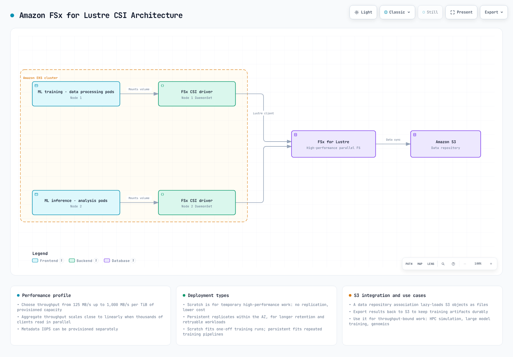
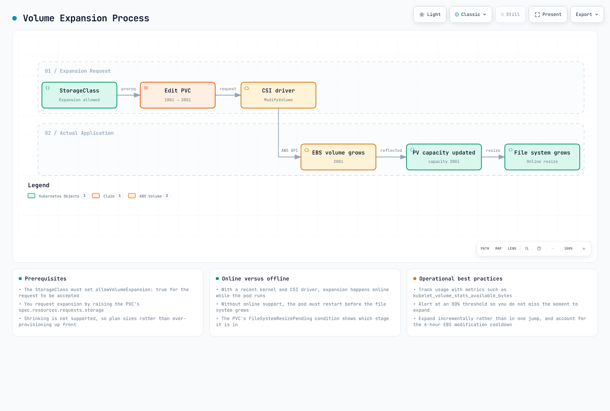
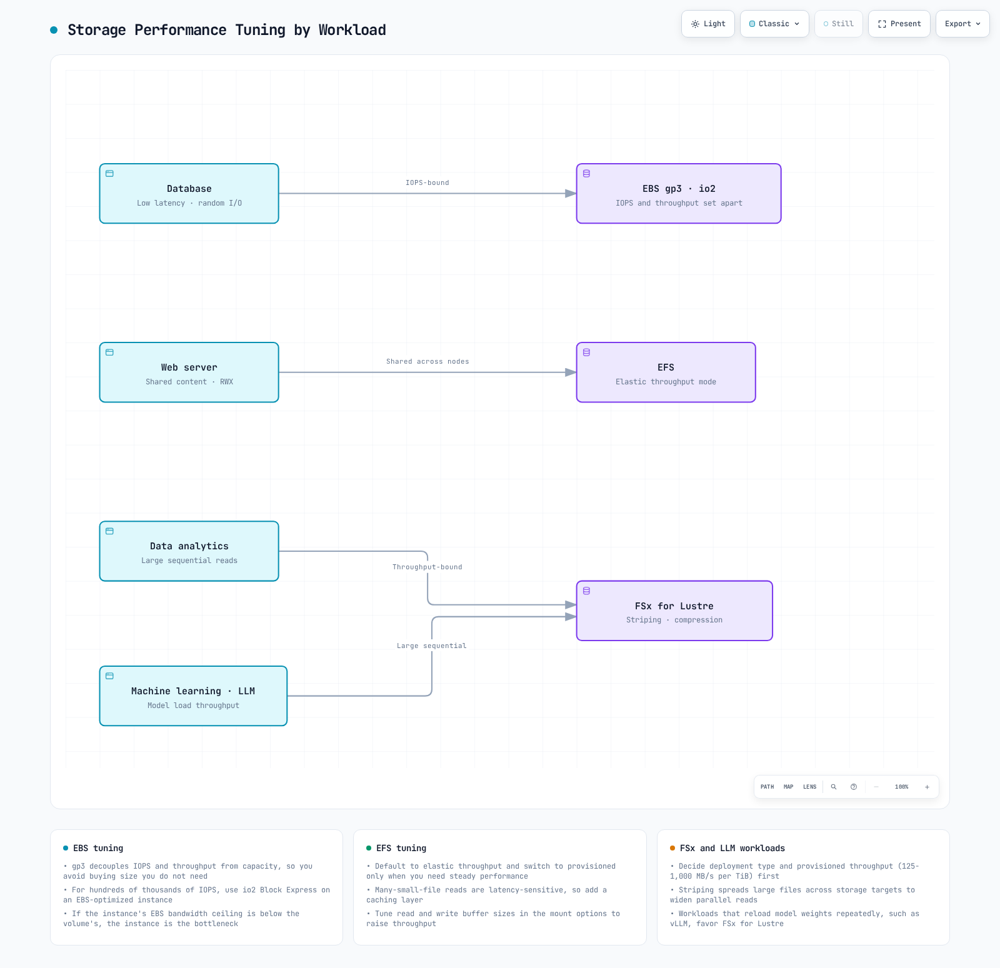

# パート 2: Storage Class

このドキュメントは Amazon EKS ストレージシリーズの第2部であり、FSx for Lustre、Amazon S3、スナップショット、ボリューム拡張、パフォーマンス最適化について扱います。

## 目次

1. [Amazon FSx for Lustre](04-eks-storage-part2.md#amazon-fsx-for-lustre)
2. [Amazon S3 ストレージ統合](04-eks-storage-part2.md#amazon-s3-storage-integration)
3. [スナップショットとバックアップ](04-eks-storage-part2.md#snapshots-and-backups)
4. [ボリュームの拡張とリサイズ](04-eks-storage-part2.md#volume-expansion-and-resizing)
5. [ボリュームクローン](04-eks-storage-part2.md#volume-cloning)
6. [Multi-Attach EBS](04-eks-storage-part2.md#multi-attach-ebs)
7. [Mountpoint for S3 CSI の詳細](04-eks-storage-part2.md#mountpoint-for-s3-csi-deep-dive)
8. [ストレージパフォーマンスの最適化](04-eks-storage-part2.md#storage-performance-optimization)

## Amazon FSx for Lustre

Amazon FSx for Lustre は、High Performance Computing（HPC）、機械学習、ビッグデータ処理などのコンピュート集約型ワークロード向けの高性能ファイルシステムです。Lustre は並列分散ファイルシステムであり、数千のクライアントから同時にアクセス可能な高スループットと低レイテンシーを提供します。



[🔍 インタラクティブ図を表示](https://www.atomai.click/kubernetes-docs/archmaps/en-eks-04-eks-storage-part2-0.html)

### FSx for Lustre CSI Driver のインストール

以下の手順で FSx for Lustre CSI driver をインストールします。

1. IAM role を作成します。

```bash
eksctl create iamserviceaccount \
  --name fsx-csi-controller-sa \
  --namespace kube-system \
  --cluster my-cluster \
  --attach-policy-arn arn:aws:iam::aws:policy/AmazonFSxFullAccess \
  --approve \
  --role-only \
  --role-name AmazonEKS_FSx_Lustre_CSI_DriverRole
```

2. Helm を使用して driver をインストールします。

```bash
helm repo add aws-fsx-csi-driver https://kubernetes-sigs.github.io/aws-fsx-csi-driver/
helm repo update
helm upgrade -i aws-fsx-csi-driver aws-fsx-csi-driver/aws-fsx-csi-driver \
  --namespace kube-system \
  --set controller.serviceAccount.create=false \
  --set controller.serviceAccount.name=fsx-csi-controller-sa
```

### FSx for Lustre ファイルシステムの作成

AWS CLI を使用して FSx for Lustre ファイルシステムを作成できます。

```bash
# Get VPC ID and subnet ID of EKS cluster
VPC_ID=$(aws eks describe-cluster \
  --name my-cluster \
  --query "cluster.resourcesVpcConfig.vpcId" \
  --output text)

SUBNET_ID=$(aws ec2 describe-subnets \
  --filters "Name=vpc-id,Values=$VPC_ID" \
  --query "Subnets[0].SubnetId" \
  --output text)

# Create security group
SECURITY_GROUP_ID=$(aws ec2 create-security-group \
  --group-name FsxLustreSecurityGroup \
  --description "Security group for FSx Lustre file system" \
  --vpc-id $VPC_ID \
  --output text)

# Allow Lustre traffic
aws ec2 authorize-security-group-ingress \
  --group-id $SECURITY_GROUP_ID \
  --protocol tcp \
  --port 988 \
  --cidr $VPC_CIDR

# Create FSx for Lustre file system
FILE_SYSTEM_ID=$(aws fsx create-file-system \
  --file-system-type LUSTRE \
  --storage-capacity 1200 \
  --subnet-ids $SUBNET_ID \
  --lustre-configuration DeploymentType=SCRATCH_2,PerUnitStorageThroughput=125 \
  --security-group-ids $SECURITY_GROUP_ID \
  --tags Key=Name,Value=MyLustreFileSystem \
  --query "FileSystem.FileSystemId" \
  --output text)
```

### FSx for Lustre Storage Class の作成

FSx for Lustre を使用する Storage Class を作成します。

```yaml
apiVersion: storage.k8s.io/v1
kind: StorageClass
metadata:
  name: fsx-lustre-sc
provisioner: fsx.csi.aws.com
parameters:
  deploymentType: SCRATCH_2
  storageCapacity: "1200"
  perUnitStorageThroughput: "125"
  automaticBackupRetentionDays: "0"
  dailyAutomaticBackupStartTime: "00:00"
  copyTagsToBackups: "false"
  dataCompressionType: "NONE"
  driveCacheType: "NONE"
  storageType: "SSD"
  mountName: "fsx-lustre-fs"
```

### PVC の作成と Pod へのマウント

1. PVC を作成します。

```yaml
apiVersion: v1
kind: PersistentVolumeClaim
metadata:
  name: fsx-claim
spec:
  accessModes:
    - ReadWriteMany
  storageClassName: fsx-lustre-sc
  resources:
    requests:
      storage: 1200Gi
```

2. PVC を Pod にマウントします。

```yaml
apiVersion: v1
kind: Pod
metadata:
  name: app-with-fsx
spec:
  containers:
  - name: app
    image: nvidia/cuda:11.6.0-base-ubuntu20.04
    command: ["sleep", "infinity"]
    volumeMounts:
    - mountPath: "/data"
      name: fsx-volume
  volumes:
  - name: fsx-volume
    persistentVolumeClaim:
      claimName: fsx-claim
```

### FSx for Lustre マウントの静的プロビジョニング

すでに作成された FSx for Lustre ファイルシステムを静的にマウントすることもできます。

```yaml
apiVersion: v1
kind: PersistentVolume
metadata:
  name: fsx-lustre-pv
spec:
  capacity:
    storage: 1200Gi
  volumeMode: Filesystem
  accessModes:
    - ReadWriteMany
  persistentVolumeReclaimPolicy: Retain
  storageClassName: fsx-lustre-sc
  csi:
    driver: fsx.csi.aws.com
    volumeHandle: fs-0123456789abcdef0
    volumeAttributes:
      dnsname: fs-0123456789abcdef0.fsx.us-west-2.amazonaws.com
      mountname: fsx
```

### FSx for Lustre のデプロイメントタイプ

FSx for Lustre は、さまざまなワークロード要件に対応する複数のデプロイメントタイプを提供します。

1. **Scratch ファイルシステム**:
   * **Scratch 1**: 短期ストレージおよび処理向けにコスト最適化されたファイルシステム
   * **Scratch 2**: Scratch 1 より高いバーストスループットと優れたデータ耐久性を提供
2. **Persistent ファイルシステム**:
   * **Persistent 1**: 長期ストレージおよびスループットが重要なワークロード向けのファイルシステム
   * **Persistent 2**: Persistent 1 より高いスループットを提供

### vLLM 向け FSx for Lustre 設定

vLLM（Vector Language Model）のような大規模 AI ワークロード向けに FSx for Lustre を最適化するには、次の設定を検討してください。

```yaml
apiVersion: storage.k8s.io/v1
kind: StorageClass
metadata:
  name: fsx-lustre-vllm
provisioner: fsx.csi.aws.com
parameters:
  deploymentType: PERSISTENT_2
  storageCapacity: "4800"  # 4.8TB
  perUnitStorageThroughput: "1000"  # 1000 MB/s per TiB
  dataCompressionType: "LZ4"  # Enable data compression
  mountName: "vllm-models"
```

この設定には次の利点があります。

* 高スループットによりモデルのロード時間を短縮
* データ圧縮によりストレージ効率が向上
* 複数のノードから同じモデルファイルへ同時アクセス

## Amazon S3 ストレージ統合

Amazon S3 は、無制限の量のデータを保存および取得できるオブジェクトストレージサービスです。Kubernetes では S3 をボリュームとして直接マウントできませんが、S3 と統合する方法は複数あります。


[🔍 インタラクティブ図を表示](https://www.atomai.click/kubernetes-docs/archmaps/en-eks-04-eks-storage-part2-1.html)

### S3 アクセス用 IRSA の設定

Pod が S3 にアクセスできるように、IAM Roles for Service Accounts（IRSA）を設定します。

```bash
eksctl create iamserviceaccount \
  --name s3-access-sa \
  --namespace default \
  --cluster my-cluster \
  --attach-policy-arn arn:aws:iam::aws:policy/AmazonS3ReadOnlyAccess \
  --approve
```

### S3 アクセス用 Pod 設定

S3 にアクセスするために service account を使用する Pod:

```yaml
apiVersion: v1
kind: Pod
metadata:
  name: s3-access-pod
spec:
  serviceAccountName: s3-access-sa
  containers:
  - name: app
    image: amazon/aws-cli:latest
    command: ["sleep", "infinity"]
```

### S3A ファイルシステムのマウント

Hadoop S3A ファイルシステムを使用すると、HDFS と同様の方法で S3 にアクセスできます。

```yaml
apiVersion: v1
kind: Pod
metadata:
  name: hadoop-s3a-pod
spec:
  serviceAccountName: s3-access-sa
  containers:
  - name: hadoop
    image: apache/hadoop:3.3.1
    env:
    - name: HADOOP_HOME
      value: /opt/hadoop
    - name: HADOOP_CONF_DIR
      value: /opt/hadoop/etc/hadoop
    - name: AWS_REGION
      value: us-west-2
    command: ["sleep", "infinity"]
    volumeMounts:
    - name: hadoop-config
      mountPath: /opt/hadoop/etc/hadoop
  volumes:
  - name: hadoop-config
    configMap:
      name: hadoop-config
---
apiVersion: v1
kind: ConfigMap
metadata:
  name: hadoop-config
data:
  core-site.xml: |
    <?xml version="1.0" encoding="UTF-8"?>
    <configuration>
      <property>
        <name>fs.s3a.aws.credentials.provider</name>
        <value>com.amazonaws.auth.WebIdentityTokenCredentialsProvider</value>
      </property>
      <property>
        <name>fs.s3a.endpoint</name>
        <value>s3.us-west-2.amazonaws.com</value>
      </property>
    </configuration>
```

### CSI Driver を使用した S3 Bucket のマウント

[AWS S3 CSI driver](https://github.com/awslabs/mountpoint-s3-csi-driver) を使用して、S3 bucket を Kubernetes ボリュームとしてマウントできます。

1. driver をインストールします。

```bash
helm repo add aws-mountpoint-s3-csi-driver https://awslabs.github.io/mountpoint-s3-csi-driver
helm repo update
helm upgrade --install aws-mountpoint-s3-csi-driver aws-mountpoint-s3-csi-driver/aws-mountpoint-s3-csi-driver \
  --namespace kube-system \
  --set controller.serviceAccount.create=false \
  --set controller.serviceAccount.name=s3-csi-controller-sa
```

2. Storage Class を作成します。

```yaml
apiVersion: storage.k8s.io/v1
kind: StorageClass
metadata:
  name: s3-sc
provisioner: s3.csi.aws.com
parameters:
  bucketName: my-eks-bucket
  mountOptions: "--cache-control-max-ttl 0"
```

3. PVC と Pod を作成します。

```yaml
apiVersion: v1
kind: PersistentVolumeClaim
metadata:
  name: s3-claim
spec:
  accessModes:
    - ReadWriteMany
  storageClassName: s3-sc
  resources:
    requests:
      storage: 1Gi
---
apiVersion: v1
kind: Pod
metadata:
  name: app-with-s3
spec:
  serviceAccountName: s3-access-sa
  containers:
  - name: app
    image: nginx
    volumeMounts:
    - mountPath: "/data"
      name: s3-volume
  volumes:
  - name: s3-volume
    persistentVolumeClaim:
      claimName: s3-claim
```

### S3 のユースケース

Amazon S3 は次のユースケースに適しています。

1. **データレイク**: 大規模データ分析のための中央リポジトリ
2. **バックアップとアーカイブ**: 長期的なデータ保持
3. **静的 Web コンテンツ**: 画像、動画、ドキュメントなどの静的コンテンツの配信
4. **ML モデルリポジトリ**: トレーニング済みモデルファイルの保存
5. **ログおよび監査データ**: ログファイルおよび監査データの保存

## スナップショットとバックアップ

Kubernetes では、ボリュームスナップショットを使用して PV データをバックアップおよび復元できます。


[🔍 インタラクティブ図を表示](https://www.atomai.click/kubernetes-docs/archmaps/en-eks-04-eks-storage-part2-2.html)

### Volume Snapshot Controller のインストール

ボリュームスナップショット機能を使用するために、snapshot controller をインストールします。

```bash
kubectl apply -f https://raw.githubusercontent.com/kubernetes-csi/external-snapshotter/master/client/config/crd/snapshot.storage.k8s.io_volumesnapshotclasses.yaml
kubectl apply -f https://raw.githubusercontent.com/kubernetes-csi/external-snapshotter/master/client/config/crd/snapshot.storage.k8s.io_volumesnapshotcontents.yaml
kubectl apply -f https://raw.githubusercontent.com/kubernetes-csi/external-snapshotter/master/client/config/crd/snapshot.storage.k8s.io_volumesnapshots.yaml

kubectl apply -f https://raw.githubusercontent.com/kubernetes-csi/external-snapshotter/master/deploy/kubernetes/snapshot-controller/rbac-snapshot-controller.yaml
kubectl apply -f https://raw.githubusercontent.com/kubernetes-csi/external-snapshotter/master/deploy/kubernetes/snapshot-controller/setup-snapshot-controller.yaml
```

### Volume Snapshot Class の作成

EBS ボリューム用の snapshot class を作成します。

```yaml
apiVersion: snapshot.storage.k8s.io/v1
kind: VolumeSnapshotClass
metadata:
  name: ebs-snapshot-class
driver: ebs.csi.aws.com
deletionPolicy: Delete
parameters:
  csi.storage.k8s.io/snapshotter-secret-name: ""
  csi.storage.k8s.io/snapshotter-secret-namespace: ""
```

### Volume Snapshot の作成

PVC のスナップショットを作成します。

```yaml
apiVersion: snapshot.storage.k8s.io/v1
kind: VolumeSnapshot
metadata:
  name: ebs-volume-snapshot
spec:
  volumeSnapshotClassName: ebs-snapshot-class
  source:
    persistentVolumeClaimName: ebs-claim
```

### スナップショットからの PVC 復元

スナップショットから新しい PVC を作成します。

```yaml
apiVersion: v1
kind: PersistentVolumeClaim
metadata:
  name: ebs-claim-restored
spec:
  accessModes:
    - ReadWriteOnce
  storageClassName: ebs-gp3
  resources:
    requests:
      storage: 10Gi
  dataSource:
    name: ebs-volume-snapshot
    kind: VolumeSnapshot
    apiGroup: snapshot.storage.k8s.io
```

### 定期スナップショットの自動化

[Velero](https://velero.io/) を使用すると、定期的なバックアップと復元を自動化できます。

1. Velero をインストールします。

```bash
# Install Velero CLI
brew install velero

# Install Velero server
velero install \
  --provider aws \
  --plugins velero/velero-plugin-for-aws:v1.5.0 \
  --bucket velero-backup-bucket \
  --backup-location-config region=us-west-2 \
  --snapshot-location-config region=us-west-2 \
  --secret-file ./credentials-velero
```

2. バックアップスケジュールを作成します。

```bash
velero schedule create daily-backup \
  --schedule="0 1 * * *" \
  --include-namespaces=default,app-namespace
```

3. 特定の時点に復元します。

```bash
velero restore create --from-backup daily-backup-20250710010000
```

## ボリュームの拡張とリサイズ

Kubernetes では、PVC サイズを拡張してストレージ容量を増やすことができます。



[🔍 インタラクティブ図を表示](https://www.atomai.click/kubernetes-docs/archmaps/en-eks-04-eks-storage-part2-3.html)

### ボリューム拡張の有効化

Storage Class でボリューム拡張を有効にします。

```yaml
apiVersion: storage.k8s.io/v1
kind: StorageClass
metadata:
  name: ebs-gp3-expandable
provisioner: ebs.csi.aws.com
parameters:
  type: gp3
allowVolumeExpansion: true
```

### PVC サイズの拡張

PVC サイズを拡張します。

```yaml
apiVersion: v1
kind: PersistentVolumeClaim
metadata:
  name: ebs-claim
spec:
  accessModes:
    - ReadWriteOnce
  storageClassName: ebs-gp3-expandable
  resources:
    requests:
      storage: 20Gi  # Expanded from original 10Gi to 20Gi
```

### ファイルシステムの拡張

ボリューム拡張後、ファイルシステムの拡張が必要になる場合があります。

1. オンライン拡張（Pod 実行中の場合）:
   * EBS CSI driver がファイルシステムを自動的に拡張します。
2. オフライン拡張（手動での拡張が必要な場合）:
   * Pod に接続し、ファイルシステム拡張コマンドを実行します。

```bash
# For ext4 file system
resize2fs /dev/xvdf

# For xfs file system
xfs_growfs /data
```

### ボリュームリサイズのベストプラクティス

1. **適切な初期サイズを設定**: 必要なサイズより少し大きめに初期ボリュームサイズを設定する
2. **モニタリングを設定**: ボリューム使用量を監視し、アラートを設定する
3. **段階的に拡張**: 必要に応じてボリュームサイズを段階的に拡張する
4. **ダウンタイムを計画**: 一部のファイルシステム拡張ではダウンタイムが必要になる場合がある
5. **自動化を検討**: 自動拡張ポリシーを実装する

## ボリュームクローン

ボリュームクローンを使用すると、スナップショットプロセスを経ずに既存の PVC から新しい PVC を作成できます。これは、テスト環境の作成、本番データの問題のデバッグ、既存データを使用した新しいワークロードの迅速なプロビジョニングに役立ちます。

### EBS CSI ボリュームクローンの概念

EBS CSI driver は、`dataSource` フィールドを使用した PVC クローンをサポートします。ボリュームをクローンすると、CSI driver はソースボリュームのスナップショットから新しい EBS ボリュームを作成しますが、このプロセスはユーザーから抽象化されます。

ボリュームクローンの主な特性:

* クローンはソース PVC から独立している
* クローンへの変更はソースに影響しない
* 特に指定しない限り、クローンはソースの Storage Class を継承する
* ソースとクローンは同じ namespace 内に存在する必要がある

### dataSource フィールドの使用

クローンを作成するには、`dataSource` フィールドでソース PVC を指定します。

```yaml
apiVersion: v1
kind: PersistentVolumeClaim
metadata:
  name: ebs-clone
spec:
  accessModes:
    - ReadWriteOnce
  storageClassName: ebs-gp3
  resources:
    requests:
      storage: 10Gi
  dataSource:
    kind: PersistentVolumeClaim
    name: ebs-source-pvc
```

### クローンとスナップショットの比較

| 機能          | ボリュームクローン        | ボリュームスナップショット                           |
| ---------------- | ------------------- | ----------------------------------------- |
| 作成速度   | 高速（1ステップ）  | 2ステップ（スナップショットを作成してから復元） |
| ストレージオーバーヘッド | 即時の完全コピー | 増分ストレージ                       |
| namespace 間  | 不可                  | 可（VolumeSnapshotContent を使用）          |
| 特定時点    | クローン作成時   | 保存された任意のスナップショット                        |
| ユースケース         | 迅速な複製   | バックアップとリカバリ                       |

### ボリュームクローン YAML の例

データベースボリュームをクローンする完全な例:

```yaml
# Source PVC (existing)
apiVersion: v1
kind: PersistentVolumeClaim
metadata:
  name: postgres-data
  namespace: production
spec:
  accessModes:
    - ReadWriteOnce
  storageClassName: ebs-gp3
  resources:
    requests:
      storage: 100Gi
---
# Clone for testing
apiVersion: v1
kind: PersistentVolumeClaim
metadata:
  name: postgres-data-test
  namespace: production
spec:
  accessModes:
    - ReadWriteOnce
  storageClassName: ebs-gp3
  resources:
    requests:
      storage: 100Gi
  dataSource:
    kind: PersistentVolumeClaim
    name: postgres-data
---
# Pod using the cloned volume
apiVersion: v1
kind: Pod
metadata:
  name: postgres-test
  namespace: production
spec:
  containers:
  - name: postgres
    image: postgres:15
    volumeMounts:
    - mountPath: /var/lib/postgresql/data
      name: postgres-storage
    env:
    - name: POSTGRES_PASSWORD
      value: testpassword
  volumes:
  - name: postgres-storage
    persistentVolumeClaim:
      claimName: postgres-data-test
```

## Multi-Attach EBS

Multi-Attach を使用すると、単一の EBS ボリュームを複数の EC2 インスタンスに同時にアタッチできます。この機能は io1 および io2 Block Express ボリュームで利用でき、高パフォーマンスな共有ストレージを必要とするクラスタ化アプリケーションで役立ちます。

### io1/io2 Block Express の Multi-Attachment

Multi-Attach は、Provisioned IOPS SSD ボリュームでのみサポートされます。

* **io1**: 最大 16 個の同時アタッチ
* **io2 Block Express**: より高いパフォーマンスで最大 16 個の同時アタッチ

要件:

* インスタンスはボリュームと同じ Availability Zone に存在する必要がある
* インスタンスは Nitro ベースの EC2 インスタンスである必要がある
* ボリュームは Block device モードを使用する必要がある（Filesystem モードではない）

### ReadWriteMany ではない理由

EBS Multi-Attach は、次の理由により従来の意味で `ReadWriteMany` アクセスモードをサポートしません。

1. **Block モードが必要**: Multi-Attach はマウントされたファイルシステムではなく、raw block device でのみ機能する
2. **ファイルシステム調整がない**: EBS はファイルシステムレベルの調整を提供しない
3. **アプリケーションの責任**: アプリケーションが同時アクセスとデータ整合性を処理する必要がある

Multi-Attach EBS の Kubernetes アクセスモードは `ReadWriteOncePod`、またはアプリケーションレベルの調整（クラスタ化データベースや OCFS2/GFS2 など）を伴う Block volumeMode です。

### 制限事項

* **同一 AZ のみ**: アタッチされるすべてのインスタンスは同じ Availability Zone に存在する必要がある
* **Block モードのみ**: クラスター対応ファイルシステムなしで共有ファイルシステムとして使用できない
* **Nitro インスタンス**: Nitro ベースのインスタンスタイプでのみサポートされる
* **オンラインリサイズ不可**: 複数のインスタンスにアタッチされている間はリサイズできない
* **アプリケーションによる調整**: アプリケーションが独自のロック／調整を実装する必要がある

### Multi-Attach のユースケースと YAML の例

一般的なユースケース:

* クラスタ化データベース（Oracle RAC、SQL Server FCI）
* 共有状態を持つ高可用性アプリケーション
* 分散ストレージシステム

```yaml
apiVersion: storage.k8s.io/v1
kind: StorageClass
metadata:
  name: ebs-io2-multi-attach
provisioner: ebs.csi.aws.com
parameters:
  type: io2
  iops: "64000"
  multiAttachEnabled: "true"
volumeBindingMode: WaitForFirstConsumer
---
apiVersion: v1
kind: PersistentVolumeClaim
metadata:
  name: shared-block-pvc
spec:
  accessModes:
    - ReadWriteMany
  volumeMode: Block
  storageClassName: ebs-io2-multi-attach
  resources:
    requests:
      storage: 100Gi
---
apiVersion: apps/v1
kind: StatefulSet
metadata:
  name: clustered-app
spec:
  serviceName: clustered-app
  replicas: 2
  selector:
    matchLabels:
      app: clustered-app
  template:
    metadata:
      labels:
        app: clustered-app
    spec:
      affinity:
        podAntiAffinity:
          requiredDuringSchedulingIgnoredDuringExecution:
          - labelSelector:
              matchLabels:
                app: clustered-app
            topologyKey: kubernetes.io/hostname
      containers:
      - name: app
        image: my-clustered-app:latest
        volumeDevices:
        - name: shared-block
          devicePath: /dev/xvda
      volumes:
      - name: shared-block
        persistentVolumeClaim:
          claimName: shared-block-pvc
```

## Mountpoint for S3 CSI の詳細

Mountpoint for Amazon S3 は、ファイルシステム操作を S3 オブジェクト API 呼び出しに変換するファイルクライアントであり、アプリケーションが POSIX に類似したインターフェースを通じて S3 bucket にアクセスできるようにします。Mountpoint for S3 CSI driver はこの機能を Kubernetes と統合します。

### パフォーマンス特性

Mountpoint for S3 は、特定のアクセスパターン向けに最適化されています。

**シーケンシャル読み取りの最適化**:

* 大きなシーケンシャル読み取りで優れたパフォーマンス
* 予測可能なアクセスパターンに対する自動プリフェッチ
* スループットはオブジェクトサイズに応じて拡張
* データ分析および ML トレーニングワークロードに最適

**ランダム書き込みの制限**:

* S3 はブロックストアではなくオブジェクトストア
* ランダム書き込みではオブジェクト全体の再書き込みが必要
* append 操作では新しいオブジェクトバージョンが作成される
* データベースワークロードやランダム I/O を必要とするアプリケーションには不向き

パフォーマンスベンチマーク（概算）:

| 操作                     | パフォーマンス                      |
| ----------------------------- | -------------------------------- |
| シーケンシャル読み取り（大きなファイル） | 集約で最大 100 Gbps         |
| シーケンシャル書き込み（新規ファイル）  | 集約で最大 50 Gbps          |
| ランダム読み取り（小さなファイル）     | 高いレイテンシー、低いスループット |
| ランダム書き込み                  | 非推奨                  |

### 制限事項

Mountpoint for S3 には、いくつかの POSIX 互換性の制限があります。

* **hard link 非対応**: hard link はサポートされない
* **symbolic link 非対応**: symbolic link はサポートされない
* **chmod/chown 非対応**: 作成後にファイル権限を変更できない
* **ファイルロックなし**: advisory lock および mandatory lock は利用できない
* **sparse file 非対応**: sparse file 操作はサポートされない
* **extended attribute 非対応**: xattr 操作はサポートされない
* **結果整合性**: list 操作では直近の書き込みがすぐに反映されない場合がある
* **ディレクトリ間 rename 非対応**: rename は同じディレクトリ内でのみサポートされる
* **既存ファイルへの append 非対応**: オブジェクト全体を再書き込みする必要がある

### キャッシュ設定

Mountpoint for S3 は、パフォーマンスを向上するキャッシュオプションを提供します。

**メタデータキャッシュ**:

```yaml
parameters:
  mountOptions: "--metadata-ttl 60"  # Cache metadata for 60 seconds
```

**データキャッシュ**（読み取り負荷の高いワークロード向け）:

```yaml
parameters:
  mountOptions: "--cache /tmp/s3-cache --max-cache-size 10737418240"  # 10GB cache
```

完全なキャッシュ設定の例:

```yaml
apiVersion: storage.k8s.io/v1
kind: StorageClass
metadata:
  name: s3-cached
provisioner: s3.csi.aws.com
parameters:
  bucketName: my-ml-data-bucket
  mountOptions: |
    --metadata-ttl 300
    --cache /tmp/mountpoint-cache
    --max-cache-size 53687091200
    --read-part-size 8388608
    --prefetch-bytes 20971520
```

### 大規模データセットトレーニングシナリオの例

Mountpoint for S3 は、大規模データセットを読み取る ML トレーニングワークロードに最適です。

```yaml
apiVersion: storage.k8s.io/v1
kind: StorageClass
metadata:
  name: s3-ml-training
provisioner: s3.csi.aws.com
parameters:
  bucketName: ml-training-datasets
  mountOptions: |
    --read-part-size 8388608
    --prefetch-bytes 52428800
    --metadata-ttl 3600
    --cache /tmp/s3-cache
    --max-cache-size 107374182400
---
apiVersion: v1
kind: PersistentVolumeClaim
metadata:
  name: training-data
spec:
  accessModes:
    - ReadOnlyMany
  storageClassName: s3-ml-training
  resources:
    requests:
      storage: 1Ti
---
apiVersion: batch/v1
kind: Job
metadata:
  name: ml-training-job
spec:
  parallelism: 4
  template:
    spec:
      serviceAccountName: ml-training-sa
      containers:
      - name: trainer
        image: pytorch/pytorch:2.0.1-cuda11.7-cudnn8-runtime
        resources:
          limits:
            nvidia.com/gpu: 1
            memory: 64Gi
          requests:
            memory: 32Gi
        command:
        - python
        - /app/train.py
        - --data-dir=/data
        - --epochs=100
        volumeMounts:
        - name: training-data
          mountPath: /data
          readOnly: true
        - name: model-output
          mountPath: /models
      volumes:
      - name: training-data
        persistentVolumeClaim:
          claimName: training-data
      - name: model-output
        persistentVolumeClaim:
          claimName: model-output-pvc
      restartPolicy: Never
      nodeSelector:
        node.kubernetes.io/instance-type: p4d.24xlarge
```

この例での主な最適化:

* **ReadOnlyMany アクセス**: 複数のトレーニング Pod が同時に読み取り可能
* **大規模プリフェッチ**: 50MB のプリフェッチにより読み取りレイテンシーを削減
* **ローカルキャッシュ**: 頻繁にアクセスするデータ用の 100GB キャッシュ
* **適切なインスタンスタイプ**: 高ネットワーク帯域幅を備えた GPU インスタンス

## ストレージパフォーマンスの最適化

EKS でストレージパフォーマンスを最適化するさまざまな戦略を見ていきましょう。



[🔍 インタラクティブ図を表示](https://www.atomai.click/kubernetes-docs/archmaps/en-eks-04-eks-storage-part2-4.html)

### EBS パフォーマンスの最適化

1. **適切なボリュームタイプを選択**:
   * 一般的なワークロード: gp3
   * 高性能データベース: io2
   * スループット重視のワークロード: st1
2. **gp3 ボリュームのパフォーマンスチューニング**:

```yaml
apiVersion: storage.k8s.io/v1
kind: StorageClass
metadata:
  name: ebs-gp3-high-perf
provisioner: ebs.csi.aws.com
parameters:
  type: gp3
  iops: "16000"  # Up to 16,000 IOPS
  throughput: "1000"  # Up to 1,000 MiB/s
```

3. **インスタンスタイプを検討**:
   * EBS 最適化インスタンスを使用する
   * 十分なネットワーク帯域幅を持つインスタンスを選択する
4. **ボリューム初期化**:
   * 使用前に新しいボリュームを初期化することを検討する:

```bash
dd if=/dev/zero of=/dev/xvdf bs=1M count=1000 oflag=direct
```

### EFS パフォーマンスの最適化

1. **適切なパフォーマンスモードを選択**:
   * ほとんどのワークロード: General Purpose モード
   * 高同時実行ワークロード: Max I/O モード
2. **スループットモードを選択**:
   * 予測可能なワークロード: Provisioned スループット
   * 変動するワークロード: Bursting または Elastic スループット
3. **アクセスパターンを最適化**:
   * 大きなファイル操作: 大きい I/O サイズを使用する
   * 並列アクセス: 複数のスレッドまたはプロセスを使用する
4. **マウントオプションを最適化**:

```yaml
apiVersion: v1
kind: Pod
metadata:
  name: efs-app
spec:
  containers:
  - name: app
    image: nginx
    volumeMounts:
    - mountPath: "/data"
      name: efs-volume
  volumes:
  - name: efs-volume
    persistentVolumeClaim:
      claimName: efs-claim
    mountOptions:
      - nfsvers=4.1
      - rsize=1048576
      - wsize=1048576
      - timeo=600
      - retrans=2
      - noresvport
```

### FSx for Lustre パフォーマンスの最適化

1. **適切なデプロイメントタイプとスループットを選択**:
   * 高スループット要件: PERSISTENT\_2 + 高スループット
   * コスト効率の高い一時的ワークロード: SCRATCH\_2
2. **ストライピングを最適化**:
   * 大きなファイル: 複数の OST（Object Storage Target）にストライピングする
   * 小さなファイル: 単一の OST に保存する
3. **クライアントマウントオプション**:

```yaml
mountOptions:
  - flock
  - noatime
  - relatime
```

4. **データ圧縮を有効化**:

```yaml
parameters:
  dataCompressionType: "LZ4"
```

### vLLM ワークロード向けストレージ最適化

vLLM のような大規模言語モデルワークロード向けのストレージ最適化:

1. **FSx for Lustre を使用**:
   * 高スループットによりモデルのロード時間を短縮
   * 複数のノードから同じモデルファイルへ同時アクセス
2. **最適な設定**:

```yaml
apiVersion: storage.k8s.io/v1
kind: StorageClass
metadata:
  name: fsx-lustre-vllm
provisioner: fsx.csi.aws.com
parameters:
  deploymentType: PERSISTENT_2
  storageCapacity: "4800"  # 4.8TB
  perUnitStorageThroughput: "1000"  # 1000 MB/s per TiB
  dataCompressionType: "LZ4"  # Enable data compression
```

3. **モデルファイルの最適化**:
   * モデルファイルをメモリにプリロードする
   * モデル量子化を検討する
   * モデルシャーディングを実装する
4. **ノードインスタンスタイプの選択**:
   * 十分なメモリとネットワーク帯域幅を持つインスタンスを選択する
   * GPU インスタンスでの EFA（Elastic Fabric Adapter）サポートを検討する

## まとめ

このドキュメントでは、Amazon EKS の FSx for Lustre、S3、スナップショット、ボリューム拡張、パフォーマンス最適化を扱いました。各ストレージオプションには異なる特性とユースケースがあるため、アプリケーション要件に適したストレージソリューションを選択して最適化することが重要です。

次のパートでは、EKS ストレージのモニタリング、トラブルシューティング、コスト最適化、セキュリティについて扱います。

## 参考資料

* [Amazon FSx for Lustre CSI Driver](https://github.com/kubernetes-sigs/aws-fsx-csi-driver)
* [Amazon S3 CSI Driver](https://github.com/awslabs/mountpoint-s3-csi-driver)
* [Kubernetes Volume Snapshots](https://kubernetes.io/docs/concepts/storage/volume-snapshots/)
* [Velero Backup and Restore](https://velero.io/docs/)
* [Amazon EKS Storage Best Practices](https://aws.github.io/aws-eks-best-practices/storage/)

## クイズ

この章で学んだ内容を確認するには、[トピッククイズ](../quizzes/eks/04-eks-storage-part2-quiz.md)に挑戦してください。
