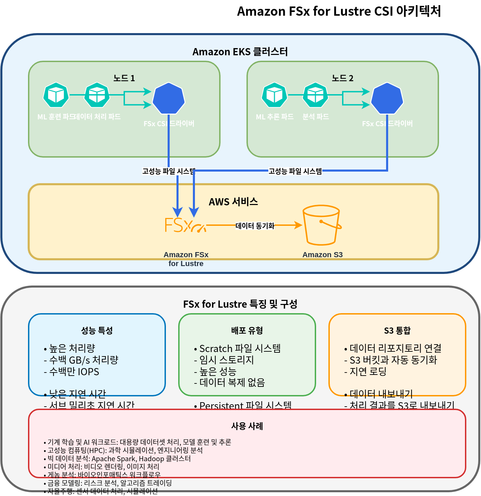

# Part 2: Storage Classes

このドキュメントは Amazon EKS storage series の第 2 部であり、FSx for Lustre、Amazon S3、snapshots、volume expansion、および performance optimization を扱います。

## Table of Contents

1. [Amazon FSx for Lustre](04-eks-storage-part2.md#amazon-fsx-for-lustre)
2. [Amazon S3 Storage Integration](04-eks-storage-part2.md#amazon-s3-storage-integration)
3. [Snapshots and Backups](04-eks-storage-part2.md#snapshots-and-backups)
4. [Volume Expansion and Resizing](04-eks-storage-part2.md#volume-expansion-and-resizing)
5. [Volume Cloning](04-eks-storage-part2.md#volume-cloning)
6. [Multi-Attach EBS](04-eks-storage-part2.md#multi-attach-ebs)
7. [Mountpoint for S3 CSI Deep Dive](04-eks-storage-part2.md#mountpoint-for-s3-csi-deep-dive)
8. [Storage Performance Optimization](04-eks-storage-part2.md#storage-performance-optimization)

## Amazon FSx for Lustre

Amazon FSx for Lustre は、high-performance computing (HPC)、machine learning、big data processing などの compute-intensive workloads 向けの高性能 file system です。Lustre は、数千の clients から同時にアクセス可能な high throughput と low latency を提供する parallel distributed file system です。



### Installing FSx for Lustre CSI Driver

FSx for Lustre CSI driver をインストールするには、次の手順に従います。

1. IAM role を作成します。

```bash
eksctl create iamserviceaccount \
  --name fsx-csi-controller-sa \
  --namespace kube-system \
  --cluster my-cluster \
  --attach-policy-arn arn:aws:iam::aws:policy/AmazonFSxFullAccess \
  --approve \
  --role-only \
  --role-name AmazonEKS_FSx_Lustre_CSI_DriverRole
```

2. Helm を使用して driver をインストールします。

```bash
helm repo add aws-fsx-csi-driver https://kubernetes-sigs.github.io/aws-fsx-csi-driver/
helm repo update
helm upgrade -i aws-fsx-csi-driver aws-fsx-csi-driver/aws-fsx-csi-driver \
  --namespace kube-system \
  --set controller.serviceAccount.create=false \
  --set controller.serviceAccount.name=fsx-csi-controller-sa
```

### Creating FSx for Lustre File System

AWS CLI を使用して FSx for Lustre file system を作成できます。

```bash
# Get VPC ID and subnet ID of EKS cluster
VPC_ID=$(aws eks describe-cluster \
  --name my-cluster \
  --query "cluster.resourcesVpcConfig.vpcId" \
  --output text)

SUBNET_ID=$(aws ec2 describe-subnets \
  --filters "Name=vpc-id,Values=$VPC_ID" \
  --query "Subnets[0].SubnetId" \
  --output text)

# Create security group
SECURITY_GROUP_ID=$(aws ec2 create-security-group \
  --group-name FsxLustreSecurityGroup \
  --description "Security group for FSx Lustre file system" \
  --vpc-id $VPC_ID \
  --output text)

# Allow Lustre traffic
aws ec2 authorize-security-group-ingress \
  --group-id $SECURITY_GROUP_ID \
  --protocol tcp \
  --port 988 \
  --cidr $VPC_CIDR

# Create FSx for Lustre file system
FILE_SYSTEM_ID=$(aws fsx create-file-system \
  --file-system-type LUSTRE \
  --storage-capacity 1200 \
  --subnet-ids $SUBNET_ID \
  --lustre-configuration DeploymentType=SCRATCH_2,PerUnitStorageThroughput=125 \
  --security-group-ids $SECURITY_GROUP_ID \
  --tags Key=Name,Value=MyLustreFileSystem \
  --query "FileSystem.FileSystemId" \
  --output text)
```

### Creating FSx for Lustre Storage Class

FSx for Lustre を使用する storage class を作成します。

```yaml
apiVersion: storage.k8s.io/v1
kind: StorageClass
metadata:
  name: fsx-lustre-sc
provisioner: fsx.csi.aws.com
parameters:
  deploymentType: SCRATCH_2
  storageCapacity: "1200"
  perUnitStorageThroughput: "125"
  automaticBackupRetentionDays: "0"
  dailyAutomaticBackupStartTime: "00:00"
  copyTagsToBackups: "false"
  dataCompressionType: "NONE"
  driveCacheType: "NONE"
  storageType: "SSD"
  mountName: "fsx-lustre-fs"
```

### Creating PVC and Mounting to Pod

1. PVC を作成します。

```yaml
apiVersion: v1
kind: PersistentVolumeClaim
metadata:
  name: fsx-claim
spec:
  accessModes:
    - ReadWriteMany
  storageClassName: fsx-lustre-sc
  resources:
    requests:
      storage: 1200Gi
```

2. PVC を pod に mount します。

```yaml
apiVersion: v1
kind: Pod
metadata:
  name: app-with-fsx
spec:
  containers:
  - name: app
    image: nvidia/cuda:11.6.0-base-ubuntu20.04
    command: ["sleep", "infinity"]
    volumeMounts:
    - mountPath: "/data"
      name: fsx-volume
  volumes:
  - name: fsx-volume
    persistentVolumeClaim:
      claimName: fsx-claim
```

### Static Provisioning for FSx for Lustre Mount

すでに作成済みの FSx for Lustre file system を statically mount することもできます。

```yaml
apiVersion: v1
kind: PersistentVolume
metadata:
  name: fsx-lustre-pv
spec:
  capacity:
    storage: 1200Gi
  volumeMode: Filesystem
  accessModes:
    - ReadWriteMany
  persistentVolumeReclaimPolicy: Retain
  storageClassName: fsx-lustre-sc
  csi:
    driver: fsx.csi.aws.com
    volumeHandle: fs-0123456789abcdef0
    volumeAttributes:
      dnsname: fs-0123456789abcdef0.fsx.us-west-2.amazonaws.com
      mountname: fsx
```

### FSx for Lustre Deployment Types

FSx for Lustre は、さまざまな workload requirements に対応するために複数の deployment types を提供します。

1. **Scratch File Systems**:
   * **Scratch 1**: short-term storage と processing 向けの cost-optimized file system
   * **Scratch 2**: Scratch 1 より高い burst throughput と優れた data durability を提供します
2. **Persistent File Systems**:
   * **Persistent 1**: long-term storage と throughput-critical workloads 向けの file system
   * **Persistent 2**: Persistent 1 より高い throughput を提供します

### FSx for Lustre Configuration for vLLM

vLLM (Vector Language Model) のような large-scale AI workloads 向けに FSx for Lustre を最適化するには、次の configuration を検討してください。

```yaml
apiVersion: storage.k8s.io/v1
kind: StorageClass
metadata:
  name: fsx-lustre-vllm
provisioner: fsx.csi.aws.com
parameters:
  deploymentType: PERSISTENT_2
  storageCapacity: "4800"  # 4.8TB
  perUnitStorageThroughput: "1000"  # 1000 MB/s per TiB
  dataCompressionType: "LZ4"  # Enable data compression
  mountName: "vllm-models"
```

この configuration には次の利点があります。

* High throughput により model loading time が短縮されます
* Data compression により storage efficiency が向上します
* 複数 nodes から同じ model files へ同時にアクセスできます

## Amazon S3 Storage Integration

Amazon S3 は、無制限の量の data を保存および取得できる object storage service です。Kubernetes では、S3 を volume として直接 mount することはできませんが、S3 と統合するさまざまな方法があります。


### IRSA Setup for S3 Access

pods が S3 にアクセスできるように IAM Roles for Service Accounts (IRSA) を設定します。

```bash
eksctl create iamserviceaccount \
  --name s3-access-sa \
  --namespace default \
  --cluster my-cluster \
  --attach-policy-arn arn:aws:iam::aws:policy/AmazonS3ReadOnlyAccess \
  --approve
```

### Pod Configuration for S3 Access

S3 にアクセスするために service account を使用する Pod です。

```yaml
apiVersion: v1
kind: Pod
metadata:
  name: s3-access-pod
spec:
  serviceAccountName: s3-access-sa
  containers:
  - name: app
    image: amazon/aws-cli:latest
    command: ["sleep", "infinity"]
```

### S3A File System Mount

HDFS と同様の方法で S3 にアクセスするために Hadoop S3A file system を使用できます。

```yaml
apiVersion: v1
kind: Pod
metadata:
  name: hadoop-s3a-pod
spec:
  serviceAccountName: s3-access-sa
  containers:
  - name: hadoop
    image: apache/hadoop:3.3.1
    env:
    - name: HADOOP_HOME
      value: /opt/hadoop
    - name: HADOOP_CONF_DIR
      value: /opt/hadoop/etc/hadoop
    - name: AWS_REGION
      value: us-west-2
    command: ["sleep", "infinity"]
    volumeMounts:
    - name: hadoop-config
      mountPath: /opt/hadoop/etc/hadoop
  volumes:
  - name: hadoop-config
    configMap:
      name: hadoop-config
---
apiVersion: v1
kind: ConfigMap
metadata:
  name: hadoop-config
data:
  core-site.xml: |
    <?xml version="1.0" encoding="UTF-8"?>
    <configuration>
      <property>
        <name>fs.s3a.aws.credentials.provider</name>
        <value>com.amazonaws.auth.WebIdentityTokenCredentialsProvider</value>
      </property>
      <property>
        <name>fs.s3a.endpoint</name>
        <value>s3.us-west-2.amazonaws.com</value>
      </property>
    </configuration>
```

### Mounting S3 Bucket with CSI Driver

[AWS S3 CSI driver](https://github.com/awslabs/mountpoint-s3-csi-driver) を使用して、S3 buckets を Kubernetes volumes として mount できます。

1. driver をインストールします。

```bash
helm repo add aws-mountpoint-s3-csi-driver https://awslabs.github.io/mountpoint-s3-csi-driver
helm repo update
helm upgrade --install aws-mountpoint-s3-csi-driver aws-mountpoint-s3-csi-driver/aws-mountpoint-s3-csi-driver \
  --namespace kube-system \
  --set controller.serviceAccount.create=false \
  --set controller.serviceAccount.name=s3-csi-controller-sa
```

2. storage class を作成します。

```yaml
apiVersion: storage.k8s.io/v1
kind: StorageClass
metadata:
  name: s3-sc
provisioner: s3.csi.aws.com
parameters:
  bucketName: my-eks-bucket
  mountOptions: "--cache-control-max-ttl 0"
```

3. PVC と pod を作成します。

```yaml
apiVersion: v1
kind: PersistentVolumeClaim
metadata:
  name: s3-claim
spec:
  accessModes:
    - ReadWriteMany
  storageClassName: s3-sc
  resources:
    requests:
      storage: 1Gi
---
apiVersion: v1
kind: Pod
metadata:
  name: app-with-s3
spec:
  serviceAccountName: s3-access-sa
  containers:
  - name: app
    image: nginx
    volumeMounts:
    - mountPath: "/data"
      name: s3-volume
  volumes:
  - name: s3-volume
    persistentVolumeClaim:
      claimName: s3-claim
```

### S3 Use Cases

Amazon S3 は次の use cases に適しています。

1. **Data Lake**: large-scale data analytics 向けの central repository
2. **Backup and Archive**: long-term data retention
3. **Static Web Content**: images、videos、documents などの static content の配信
4. **ML Model Repository**: trained model files の保存
5. **Logs and Audit Data**: log files と audit data の保存

## Snapshots and Backups

Kubernetes では、volume snapshots を使用して PV data を backup および restore できます。


### Installing Volume Snapshot Controller

volume snapshot functionality を使用するために snapshot controller をインストールします。

```bash
kubectl apply -f https://raw.githubusercontent.com/kubernetes-csi/external-snapshotter/master/client/config/crd/snapshot.storage.k8s.io_volumesnapshotclasses.yaml
kubectl apply -f https://raw.githubusercontent.com/kubernetes-csi/external-snapshotter/master/client/config/crd/snapshot.storage.k8s.io_volumesnapshotcontents.yaml
kubectl apply -f https://raw.githubusercontent.com/kubernetes-csi/external-snapshotter/master/client/config/crd/snapshot.storage.k8s.io_volumesnapshots.yaml

kubectl apply -f https://raw.githubusercontent.com/kubernetes-csi/external-snapshotter/master/deploy/kubernetes/snapshot-controller/rbac-snapshot-controller.yaml
kubectl apply -f https://raw.githubusercontent.com/kubernetes-csi/external-snapshotter/master/deploy/kubernetes/snapshot-controller/setup-snapshot-controller.yaml
```

### Creating Volume Snapshot Class

EBS volumes 用の snapshot class を作成します。

```yaml
apiVersion: snapshot.storage.k8s.io/v1
kind: VolumeSnapshotClass
metadata:
  name: ebs-snapshot-class
driver: ebs.csi.aws.com
deletionPolicy: Delete
parameters:
  csi.storage.k8s.io/snapshotter-secret-name: ""
  csi.storage.k8s.io/snapshotter-secret-namespace: ""
```

### Creating Volume Snapshot

PVC の snapshot を作成します。

```yaml
apiVersion: snapshot.storage.k8s.io/v1
kind: VolumeSnapshot
metadata:
  name: ebs-volume-snapshot
spec:
  volumeSnapshotClassName: ebs-snapshot-class
  source:
    persistentVolumeClaimName: ebs-claim
```

### Restoring PVC from Snapshot

snapshot から新しい PVC を作成します。

```yaml
apiVersion: v1
kind: PersistentVolumeClaim
metadata:
  name: ebs-claim-restored
spec:
  accessModes:
    - ReadWriteOnce
  storageClassName: ebs-gp3
  resources:
    requests:
      storage: 10Gi
  dataSource:
    name: ebs-volume-snapshot
    kind: VolumeSnapshot
    apiGroup: snapshot.storage.k8s.io
```

### Automating Regular Snapshots

[Velero](https://velero.io/) を使用して regular backups と restores を自動化できます。

1. Velero をインストールします。

```bash
# Install Velero CLI
brew install velero

# Install Velero server
velero install \
  --provider aws \
  --plugins velero/velero-plugin-for-aws:v1.5.0 \
  --bucket velero-backup-bucket \
  --backup-location-config region=us-west-2 \
  --snapshot-location-config region=us-west-2 \
  --secret-file ./credentials-velero
```

2. backup schedule を作成します。

```bash
velero schedule create daily-backup \
  --schedule="0 1 * * *" \
  --include-namespaces=default,app-namespace
```

3. 特定の point in time に restore します。

```bash
velero restore create --from-backup daily-backup-20250710010000
```

## Volume Expansion and Resizing

Kubernetes では、PVC size を拡張して storage capacity を増やすことができます。


### Enabling Volume Expansion

storage class で volume expansion を有効にします。

```yaml
apiVersion: storage.k8s.io/v1
kind: StorageClass
metadata:
  name: ebs-gp3-expandable
provisioner: ebs.csi.aws.com
parameters:
  type: gp3
allowVolumeExpansion: true
```

### Expanding PVC Size

PVC size を拡張します。

```yaml
apiVersion: v1
kind: PersistentVolumeClaim
metadata:
  name: ebs-claim
spec:
  accessModes:
    - ReadWriteOnce
  storageClassName: ebs-gp3-expandable
  resources:
    requests:
      storage: 20Gi  # Expanded from original 10Gi to 20Gi
```

### File System Expansion

volume expansion の後、file system の拡張が必要になる場合があります。

1. Online expansion (pod が実行中の場合):
   * EBS CSI driver が file system を自動的に拡張します。
2. Offline expansion (manual expansion が必要な場合):
   * pod に接続して file system expansion command を実行します。

```bash
# For ext4 file system
resize2fs /dev/xvdf

# For xfs file system
xfs_growfs /data
```

### Volume Resizing Best Practices

1. **Set appropriate initial size**: 必要量より少し大きい initial volume size を設定します
2. **Set up monitoring**: volume usage を監視し、alerts を設定します
3. **Gradual expansion**: 必要に応じて volume size を段階的に拡張します
4. **Plan for downtime**: 一部の file system expansions では downtime が必要になる場合があります
5. **Consider automation**: automatic expansion policies を実装します

## Volume Cloning

Volume cloning を使用すると、snapshot process を経由せずに既存の PVC から新しい PVC を作成できます。これは、test environments の作成、production data issues の debugging、または既存 data を使用した新しい workloads の迅速な provisioning に役立ちます。

### EBS CSI Volume Cloning Concept

EBS CSI driver は `dataSource` field を使用した PVC cloning をサポートします。volume を clone すると、CSI driver は source volume の snapshot から新しい EBS volume を作成しますが、この process は user から抽象化されています。

volume cloning の主な characteristics は次のとおりです。

* clone は source PVC から独立しています
* clone への変更は source に影響しません
* 指定しない限り、clone は source の storage class を継承します
* source と clone は同じ namespace 内に存在する必要があります

### Using the dataSource Field

clone を作成するには、`dataSource` field に source PVC を指定します。

```yaml
apiVersion: v1
kind: PersistentVolumeClaim
metadata:
  name: ebs-clone
spec:
  accessModes:
    - ReadWriteOnce
  storageClassName: ebs-gp3
  resources:
    requests:
      storage: 10Gi
  dataSource:
    kind: PersistentVolumeClaim
    name: ebs-source-pvc
```

### Clone vs Snapshot Comparison

| Feature          | Volume Clone        | Volume Snapshot                           |
| ---------------- | ------------------- | ----------------------------------------- |
| Creation Speed   | Fast (single step)  | Two steps (create snapshot, then restore) |
| Storage Overhead | Immediate full copy | Incremental storage                       |
| Cross-Namespace  | No                  | Yes (with VolumeSnapshotContent)          |
| Point-in-Time    | At clone creation   | Any saved snapshot                        |
| Use Case         | Quick duplication   | Backup and recovery                       |

### Volume Clone YAML Example

database volume を cloning する完全な example です。

```yaml
# Source PVC (existing)
apiVersion: v1
kind: PersistentVolumeClaim
metadata:
  name: postgres-data
  namespace: production
spec:
  accessModes:
    - ReadWriteOnce
  storageClassName: ebs-gp3
  resources:
    requests:
      storage: 100Gi
---
# Clone for testing
apiVersion: v1
kind: PersistentVolumeClaim
metadata:
  name: postgres-data-test
  namespace: production
spec:
  accessModes:
    - ReadWriteOnce
  storageClassName: ebs-gp3
  resources:
    requests:
      storage: 100Gi
  dataSource:
    kind: PersistentVolumeClaim
    name: postgres-data
---
# Pod using the cloned volume
apiVersion: v1
kind: Pod
metadata:
  name: postgres-test
  namespace: production
spec:
  containers:
  - name: postgres
    image: postgres:15
    volumeMounts:
    - mountPath: /var/lib/postgresql/data
      name: postgres-storage
    env:
    - name: POSTGRES_PASSWORD
      value: testpassword
  volumes:
  - name: postgres-storage
    persistentVolumeClaim:
      claimName: postgres-data-test
```

## Multi-Attach EBS

Multi-Attach により、単一の EBS volume を複数の EC2 instances に同時に attach できます。この feature は io1 および io2 Block Express volumes で利用でき、high performance な shared storage を必要とする clustered applications に役立ちます。

### io1/io2 Block Express Multi-Attachment

Multi-Attach は Provisioned IOPS SSD volumes でのみサポートされます。

* **io1**: 最大 16 の simultaneous attachments
* **io2 Block Express**: より高い performance で最大 16 の simultaneous attachments

Requirements:

* Instances は volume と同じ Availability Zone 内に存在する必要があります
* Instances は Nitro-based EC2 instances である必要があります
* Volume は Block device mode を使用する必要があります (Filesystem mode ではありません)

### Why Not ReadWriteMany?

EBS Multi-Attach は、従来の意味での `ReadWriteMany` access mode をサポートしません。その理由は次のとおりです。

1. **Block Mode Required**: Multi-Attach は mounted filesystems ではなく raw block devices でのみ動作します
2. **No Filesystem Coordination**: EBS は filesystem-level coordination を提供しません
3. **Application Responsibility**: application が concurrent access と data integrity を処理する必要があります

Multi-Attach EBS の Kubernetes access mode は、`ReadWriteOncePod`、または clustered databases や OCFS2/GFS2 のような application-level coordination を伴う Block volumeMode 経由です。

### Limitations

* **Same AZ Only**: すべての attached instances は同じ Availability Zone 内に存在する必要があります
* **Block Mode Only**: cluster-aware filesystem なしで shared filesystem として使用することはできません
* **Nitro Instances**: Nitro-based instance types でのみサポートされます
* **No Online Resize**: 複数 instances に attach されている間は resize できません
* **Application Coordination**: Applications は独自の locking/coordination を実装する必要があります

### Multi-Attach Use Cases and YAML Example

一般的な use cases は次のとおりです。

* Clustered databases (Oracle RAC, SQL Server FCI)
* shared state を持つ high-availability applications
* Distributed storage systems

```yaml
apiVersion: storage.k8s.io/v1
kind: StorageClass
metadata:
  name: ebs-io2-multi-attach
provisioner: ebs.csi.aws.com
parameters:
  type: io2
  iops: "64000"
  multiAttachEnabled: "true"
volumeBindingMode: WaitForFirstConsumer
---
apiVersion: v1
kind: PersistentVolumeClaim
metadata:
  name: shared-block-pvc
spec:
  accessModes:
    - ReadWriteMany
  volumeMode: Block
  storageClassName: ebs-io2-multi-attach
  resources:
    requests:
      storage: 100Gi
---
apiVersion: apps/v1
kind: StatefulSet
metadata:
  name: clustered-app
spec:
  serviceName: clustered-app
  replicas: 2
  selector:
    matchLabels:
      app: clustered-app
  template:
    metadata:
      labels:
        app: clustered-app
    spec:
      affinity:
        podAntiAffinity:
          requiredDuringSchedulingIgnoredDuringExecution:
          - labelSelector:
              matchLabels:
                app: clustered-app
            topologyKey: kubernetes.io/hostname
      containers:
      - name: app
        image: my-clustered-app:latest
        volumeDevices:
        - name: shared-block
          devicePath: /dev/xvda
      volumes:
      - name: shared-block
        persistentVolumeClaim:
          claimName: shared-block-pvc
```

## Mountpoint for S3 CSI Deep Dive

Mountpoint for Amazon S3 は file system operations を S3 object API calls に変換する file client であり、applications が POSIX-like interface を通じて S3 buckets にアクセスできるようにします。Mountpoint for S3 CSI driver は、この capability を Kubernetes と統合します。

### Performance Characteristics

Mountpoint for S3 は特定の access patterns に最適化されています。

**Sequential Read Optimization**:

* large sequential reads で優れた performance を発揮します
* predictable access patterns 向けの automatic prefetching
* Throughput は object size に応じて scale します
* data analytics と ML training workloads に最適です

**Random Write Limitations**:

* S3 は object store であり、block store ではありません
* Random writes では objects 全体の書き換えが必要です
* Append operations は新しい object versions を作成します
* database workloads や random I/O を必要とする applications には適していません

Performance benchmarks (approximate):

| Operation                     | Performance                      |
| ----------------------------- | -------------------------------- |
| Sequential Read (large files) | Up to 100 Gbps aggregate         |
| Sequential Write (new files)  | Up to 50 Gbps aggregate          |
| Random Read (small files)     | Higher latency, lower throughput |
| Random Write                  | Not recommended                  |

### Limitations

Mountpoint for S3 にはいくつかの POSIX compatibility limitations があります。

* **No hard links**: Hard links はサポートされていません
* **No symbolic links**: Symbolic links はサポートされていません
* **No chmod/chown**: File permissions は creation 後に変更できません
* **No file locking**: Advisory locks と mandatory locks は利用できません
* **No sparse files**: Sparse file operations はサポートされていません
* **No extended attributes**: xattr operations はサポートされていません
* **Eventual consistency**: List operations は recent writes を即座に反映しない場合があります
* **No rename across directories**: Rename は同じ directory 内でのみサポートされます
* **No append to existing files**: object 全体を書き換える必要があります

### Cache Settings

Mountpoint for S3 は performance を向上させるための caching options を提供します。

**Metadata Cache**:

```yaml
parameters:
  mountOptions: "--metadata-ttl 60"  # Cache metadata for 60 seconds
```

**Data Cache** (for read-heavy workloads):

```yaml
parameters:
  mountOptions: "--cache /tmp/s3-cache --max-cache-size 10737418240"  # 10GB cache
```

完全な cache configuration example は次のとおりです。

```yaml
apiVersion: storage.k8s.io/v1
kind: StorageClass
metadata:
  name: s3-cached
provisioner: s3.csi.aws.com
parameters:
  bucketName: my-ml-data-bucket
  mountOptions: |
    --metadata-ttl 300
    --cache /tmp/mountpoint-cache
    --max-cache-size 53687091200
    --read-part-size 8388608
    --prefetch-bytes 20971520
```

### Large Dataset Training Scenario Example

Mountpoint for S3 は、large datasets を読み取る ML training workloads に最適です。

```yaml
apiVersion: storage.k8s.io/v1
kind: StorageClass
metadata:
  name: s3-ml-training
provisioner: s3.csi.aws.com
parameters:
  bucketName: ml-training-datasets
  mountOptions: |
    --read-part-size 8388608
    --prefetch-bytes 52428800
    --metadata-ttl 3600
    --cache /tmp/s3-cache
    --max-cache-size 107374182400
---
apiVersion: v1
kind: PersistentVolumeClaim
metadata:
  name: training-data
spec:
  accessModes:
    - ReadOnlyMany
  storageClassName: s3-ml-training
  resources:
    requests:
      storage: 1Ti
---
apiVersion: batch/v1
kind: Job
metadata:
  name: ml-training-job
spec:
  parallelism: 4
  template:
    spec:
      serviceAccountName: ml-training-sa
      containers:
      - name: trainer
        image: pytorch/pytorch:2.0.1-cuda11.7-cudnn8-runtime
        resources:
          limits:
            nvidia.com/gpu: 1
            memory: 64Gi
          requests:
            memory: 32Gi
        command:
        - python
        - /app/train.py
        - --data-dir=/data
        - --epochs=100
        volumeMounts:
        - name: training-data
          mountPath: /data
          readOnly: true
        - name: model-output
          mountPath: /models
      volumes:
      - name: training-data
        persistentVolumeClaim:
          claimName: training-data
      - name: model-output
        persistentVolumeClaim:
          claimName: model-output-pvc
      restartPolicy: Never
      nodeSelector:
        node.kubernetes.io/instance-type: p4d.24xlarge
```

この example の主な optimizations は次のとおりです。

* **ReadOnlyMany access**: 複数の training pods が同時に読み取れます
* **Large prefetch**: 50MB prefetch により read latency が削減されます
* **Local cache**: frequently accessed data 用の 100GB cache
* **Appropriate instance type**: high network bandwidth を備えた GPU instance

## Storage Performance Optimization

EKS で storage performance を最適化するためのさまざまな strategies を見ていきましょう。


### EBS Performance Optimization

1. **Select appropriate volume type**:
   * General workloads: gp3
   * High-performance databases: io2
   * Throughput-centric workloads: st1
2. **gp3 volume performance tuning**:

```yaml
apiVersion: storage.k8s.io/v1
kind: StorageClass
metadata:
  name: ebs-gp3-high-perf
provisioner: ebs.csi.aws.com
parameters:
  type: gp3
  iops: "16000"  # Up to 16,000 IOPS
  throughput: "1000"  # Up to 1,000 MiB/s
```

3. **Consider instance type**:
   * EBS-optimized instances を使用します
   * 十分な network bandwidth を持つ instances を選択します
4. **Volume initialization**:
   * 使用前に new volumes を初期化することを検討します。

```bash
dd if=/dev/zero of=/dev/xvdf bs=1M count=1000 oflag=direct
```

### EFS Performance Optimization

1. **Select appropriate performance mode**:
   * ほとんどの workloads: General Purpose mode
   * High concurrency workloads: Max I/O mode
2. **Select throughput mode**:
   * Predictable workloads: Provisioned throughput
   * Variable workloads: Bursting or Elastic throughput
3. **Optimize access patterns**:
   * Large file operations: 大きい I/O sizes を使用します
   * Parallel access: 複数の threads または processes を使用します
4. **Optimize mount options**:

```yaml
apiVersion: v1
kind: Pod
metadata:
  name: efs-app
spec:
  containers:
  - name: app
    image: nginx
    volumeMounts:
    - mountPath: "/data"
      name: efs-volume
  volumes:
  - name: efs-volume
    persistentVolumeClaim:
      claimName: efs-claim
    mountOptions:
      - nfsvers=4.1
      - rsize=1048576
      - wsize=1048576
      - timeo=600
      - retrans=2
      - noresvport
```

### FSx for Lustre Performance Optimization

1. **Select appropriate deployment type and throughput**:
   * High throughput requirements: PERSISTENT\_2 + high throughput
   * Cost-effective temporary workloads: SCRATCH\_2
2. **Optimize striping**:
   * Large files: 複数の OSTs (Object Storage Targets) に stripe します
   * Small files: 単一の OST に保存します
3. **Client mount options**:

```yaml
mountOptions:
  - flock
  - noatime
  - relatime
```

4. **Enable data compression**:

```yaml
parameters:
  dataCompressionType: "LZ4"
```

### Storage Optimization for vLLM Workloads

vLLM のような large language model workloads 向けの storage optimization です。

1. **Use FSx for Lustre**:
   * High throughput により model loading time が短縮されます
   * 複数 nodes から同じ model files へ同時にアクセスできます
2. **Optimal configuration**:

```yaml
apiVersion: storage.k8s.io/v1
kind: StorageClass
metadata:
  name: fsx-lustre-vllm
provisioner: fsx.csi.aws.com
parameters:
  deploymentType: PERSISTENT_2
  storageCapacity: "4800"  # 4.8TB
  perUnitStorageThroughput: "1000"  # 1000 MB/s per TiB
  dataCompressionType: "LZ4"  # Enable data compression
```

3. **Model file optimization**:
   * model files を memory に preload します
   * model quantization を検討します
   * model sharding を実装します
4. **Node instance type selection**:
   * 十分な memory と network bandwidth を持つ instances を選択します
   * GPU instances 向けに EFA (Elastic Fabric Adapter) support を検討します

## Conclusion

このドキュメントでは、Amazon EKS における FSx for Lustre、S3、snapshots、volume expansion、および performance optimization について扱いました。各 storage option は異なる characteristics と use cases を持つため、application requirements に適した storage solution を選択して最適化することが重要です。

次の part では、EKS storage の monitoring、troubleshooting、cost optimization、および security を扱います。

## References

* [Amazon FSx for Lustre CSI Driver](https://github.com/kubernetes-sigs/aws-fsx-csi-driver)
* [Amazon S3 CSI Driver](https://github.com/awslabs/mountpoint-s3-csi-driver)
* [Kubernetes Volume Snapshots](https://kubernetes.io/docs/concepts/storage/volume-snapshots/)
* [Velero Backup and Restore](https://velero.io/docs/)
* [Amazon EKS Storage Best Practices](https://aws.github.io/aws-eks-best-practices/storage/)

## Quiz

この章で学んだ内容を確認するには、[topic quiz](../quizzes/eks/04-eks-storage-part2-quiz.md) に挑戦してください。
