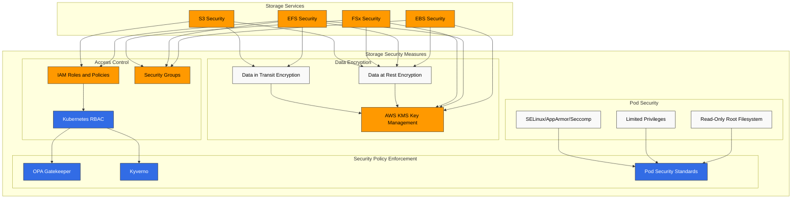
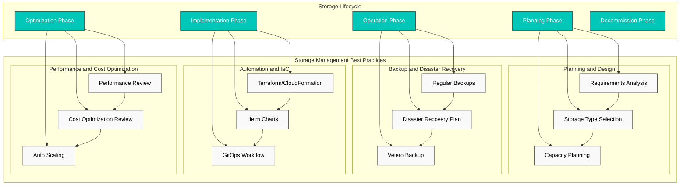

# Amazon EKS Storage - Part 3: Monitoring, Troubleshooting, Cost Optimization, and Security

このドキュメントは Amazon EKS storage series の第 3 部かつ最終部であり、storage monitoring、troubleshooting、cost optimization、および security を扱います。

## Table of Contents

1. [Storage Monitoring](#storage-monitoring)
2. [Storage Troubleshooting](#storage-troubleshooting)
3. [Storage Cost Optimization](#storage-cost-optimization)
4. [Storage Security](#storage-security)
5. [Storage Management Best Practices](#storage-management-best-practices)

## Storage Monitoring

EKS cluster 内の storage resources を効果的に monitoring することは、performance issues を早期に検出し、capacity planning を確立するために重要です。

```mermaid
flowchart TD
    subgraph Monitoring_Solutions ["Storage Monitoring Solutions"]
        subgraph AWS_CloudWatch ["AWS CloudWatch"]
            EBS_Metrics[EBS Volume Metrics]
            EFS_Metrics[EFS File System Metrics]
            FSx_Metrics[FSx for Lustre Metrics]
            CW_Alarms[CloudWatch Alarms]
            CW_Dashboard[CloudWatch Dashboard]
        end

        subgraph K8s_Monitoring ["Kubernetes Monitoring"]
            Prometheus[Prometheus]
            Grafana[Grafana Dashboard]
            ServiceMonitor[ServiceMonitor]
            PodMonitor[PodMonitor]
            PrometheusRule[Alert Rules]
        end

        subgraph Custom_Solutions ["Custom Solutions"]
            Usage_Exporter[Volume Usage Exporter]
            Custom_Metrics[Custom Metrics]
            Custom_Alerts[Custom Alerts]
        end
    end

    subgraph Key_Metrics ["Key Monitoring Metrics"]
        Volume_Usage[Volume Usage]
        IOPS[IOPS Usage]
        Throughput[Throughput]
        Latency[Latency]
        Queue_Length[Queue Length]
        Burst_Credits[Burst Credits]
    end

    %% Connection relationships
    EBS_Metrics --> Volume_Usage
    EBS_Metrics --> IOPS
    EBS_Metrics --> Throughput
    EBS_Metrics --> Latency
    EBS_Metrics --> Queue_Length
    EBS_Metrics --> Burst_Credits

    EFS_Metrics --> Volume_Usage
    EFS_Metrics --> Throughput
    EFS_Metrics --> Burst_Credits

    FSx_Metrics --> Volume_Usage
    FSx_Metrics --> IOPS
    FSx_Metrics --> Throughput

    Volume_Usage --> CW_Alarms
    IOPS --> CW_Alarms
    Throughput --> CW_Alarms
    Latency --> CW_Alarms
    Queue_Length --> CW_Alarms
    Burst_Credits --> CW_Alarms

    CW_Alarms --> CW_Dashboard

    Prometheus --> ServiceMonitor
    Prometheus --> PodMonitor
    ServiceMonitor --> Grafana
    PodMonitor --> Grafana
    Prometheus --> PrometheusRule

    Usage_Exporter --> Custom_Metrics
    Custom_Metrics --> Custom_Alerts

    %% Class definitions
    classDef awsService fill:#FF9900,stroke:#333,stroke-width:1px,color:black;
    classDef k8sComponent fill:#326CE5,stroke:#333,stroke-width:1px,color:white;
    classDef userApp fill:#00C7B7,stroke:#333,stroke-width:1px,color:white;
    classDef dataStore fill:#3B48CC,stroke:#333,stroke-width:1px,color:white;
    classDef default fill:#f9f9f9,stroke:#333,stroke-width:1px,color:black;

    %% Class application
    class EBS_Metrics,EFS_Metrics,FSx_Metrics,CW_Alarms,CW_Dashboard awsService;
    class Prometheus,Grafana,ServiceMonitor,PodMonitor,PrometheusRule k8sComponent;
    class Usage_Exporter,Custom_Metrics,Custom_Alerts userApp;
    class Volume_Usage,IOPS,Throughput,Latency,Queue_Length,Burst_Credits default;
```



### Monitoring with CloudWatch

AWS CloudWatch を使用して、EBS、EFS、および FSx for Lustre volumes の performance metrics を monitoring できます。

#### EBS Volume Metrics

主要な EBS metrics:
- VolumeReadBytes/VolumeWriteBytes: 読み取り/書き込み throughput
- VolumeReadOps/VolumeWriteOps: 読み取り/書き込み operations の数
- VolumeTotalReadTime/VolumeTotalWriteTime: 読み取り/書き込み latency
- VolumeQueueLength: 保留中の I/O requests の数
- BurstBalance: Burst credit balance (gp2 volumes)

CloudWatch dashboard の例:

```bash
aws cloudwatch get-dashboard --dashboard-name EBSVolumeMonitoring
```

#### EFS File System Metrics

主要な EFS metrics:
- TotalIOBytes: 合計 I/O bytes
- DataReadIOBytes/DataWriteIOBytes: 読み取り/書き込み throughput
- ClientConnections: 接続中の clients の数
- PermittedThroughput: 許可された throughput
- BurstCreditBalance: Burst credit balance

#### FSx for Lustre Metrics

主要な FSx for Lustre metrics:
- DataReadBytes/DataWriteBytes: 読み取り/書き込み throughput
- DataReadOperations/DataWriteOperations: 読み取り/書き込み operations の数
- FreeDataStorageCapacity: 利用可能な storage capacity
- NetworkThroughputUtilization: Network throughput utilization

### Monitoring with Prometheus and Grafana

Prometheus と Grafana を使用して、Kubernetes level で storage resources を monitoring できます。

1. Prometheus と Grafana をインストールします。

```bash
helm repo add prometheus-community https://prometheus-community.github.io/helm-charts
helm repo update
helm install prometheus prometheus-community/kube-prometheus-stack \
  --namespace monitoring \
  --create-namespace
```

2. storage 関連 metrics collection のために ServiceMonitor を設定します。

```yaml
apiVersion: monitoring.coreos.com/v1
kind: ServiceMonitor
metadata:
  name: csi-metrics
  namespace: monitoring
spec:
  selector:
    matchLabels:
      app: ebs-csi-controller
  endpoints:
  - port: metrics
    interval: 30s
```

3. Grafana dashboard を設定します。

以下の metrics を含む dashboard を Grafana で作成します。
- PVC usage と capacity
- Volume provisioning status
- CSI driver operation latency
- Volume mount/unmount operations

### Custom Monitoring Solutions

特定の要件に合わせて custom monitoring solutions を実装できます。

1. Volume usage monitoring pod:

```yaml
apiVersion: apps/v1
kind: DaemonSet
metadata:
  name: volume-usage-exporter
  namespace: monitoring
spec:
  selector:
    matchLabels:
      app: volume-usage-exporter
  template:
    metadata:
      labels:
        app: volume-usage-exporter
    spec:
      containers:
      - name: exporter
        image: quay.io/prometheus/node-exporter:v1.3.1
        args:
        - --path.procfs=/host/proc
        - --path.sysfs=/host/sys
        - --collector.filesystem
        volumeMounts:
        - name: proc
          mountPath: /host/proc
          readOnly: true
        - name: sys
          mountPath: /host/sys
          readOnly: true
        - name: root
          mountPath: /host/root
          readOnly: true
          mountPropagation: HostToContainer
      volumes:
      - name: proc
        hostPath:
          path: /proc
      - name: sys
        hostPath:
          path: /sys
      - name: root
        hostPath:
          path: /
```

2. Alert rules configuration:

```yaml
apiVersion: monitoring.coreos.com/v1
kind: PrometheusRule
metadata:
  name: storage-alerts
  namespace: monitoring
spec:
  groups:
  - name: storage
    rules:
    - alert: VolumeUsageHigh
      expr: kubelet_volume_stats_used_bytes / kubelet_volume_stats_capacity_bytes > 0.85
      for: 10m
      labels:
        severity: warning
      annotations:
        summary: "Volume usage high ({{ $value | humanizePercentage }})"
        description: "PVC {{ $labels.persistentvolumeclaim }} is using {{ $value | humanizePercentage }} of its capacity."
    - alert: VolumeFullIn24Hours
      expr: predict_linear(kubelet_volume_stats_used_bytes[6h], 24 * 3600) > kubelet_volume_stats_capacity_bytes
      for: 10m
      labels:
        severity: warning
      annotations:
        summary: "Volume will fill in 24 hours"
        description: "PVC {{ $labels.persistentvolumeclaim }} is predicted to fill within 24 hours."
```

## Storage Troubleshooting

EKS clusters で発生する可能性がある一般的な storage issues とその solutions を見ていきましょう。

```mermaid
flowchart TD
    subgraph Common_Issues ["Common Storage Issues"]
        PVC_Pending[PVC in Pending State]
        Volume_Provisioning[Volume Provisioning Failure]
        Mount_Issues[Volume Mount Issues]
        Performance_Issues[Performance Issues]
    end

    subgraph Troubleshooting_Steps ["Troubleshooting Steps"]
        Check_PVC[Check PVC Status]
        Check_SC[Check Storage Class]
        Check_CSI[Check CSI Driver Logs]
        Check_IAM[Check IAM Permissions]
        Check_Pod[Check Pod Status]
        Check_Node[Check Node Status]
        Check_SG[Check Security Groups]
        Check_Network[Check Network Connectivity]
        Check_Metrics[Check Performance Metrics]
        Check_FS[Test File System]
    end

    subgraph Resolution_Actions ["Resolution Actions"]
        Fix_SC[Fix Storage Class]
        Fix_CSI[Reinstall CSI Driver]
        Fix_IAM[Add IAM Permissions]
        Fix_Pod[Restart Pod]
        Fix_SG[Add Security Group Rules]
        Fix_Volume[Change Volume Type]
        Fix_Instance[Change Instance Type]
        Fix_FS[Optimize File System]
    end

    %% Issue and troubleshooting step connections
    PVC_Pending --> Check_PVC
    PVC_Pending --> Check_SC
    PVC_Pending --> Check_CSI
    PVC_Pending --> Check_IAM

    Volume_Provisioning --> Check_CSI
    Volume_Provisioning --> Check_IAM
    Volume_Provisioning --> Check_SC

    Mount_Issues --> Check_Pod
    Mount_Issues --> Check_Node
    Mount_Issues --> Check_SG
    Mount_Issues --> Check_Network

    Performance_Issues --> Check_Metrics
    Performance_Issues --> Check_FS
    Performance_Issues --> Check_Node

    %% Troubleshooting steps and action connections
    Check_SC --> Fix_SC
    Check_CSI --> Fix_CSI
    Check_IAM --> Fix_IAM
    Check_Pod --> Fix_Pod
    Check_SG --> Fix_SG
    Check_Metrics --> Fix_Volume
    Check_Metrics --> Fix_Instance
    Check_FS --> Fix_FS

    %% Class definitions
    classDef awsService fill:#FF9900,stroke:#333,stroke-width:1px,color:black;
    classDef k8sComponent fill:#326CE5,stroke:#333,stroke-width:1px,color:white;
    classDef userApp fill:#00C7B7,stroke:#333,stroke-width:1px,color:white;
    classDef dataStore fill:#3B48CC,stroke:#333,stroke-width:1px,color:white;
    classDef default fill:#f9f9f9,stroke:#333,stroke-width:1px,color:black;

    %% Class application
    class PVC_Pending,Volume_Provisioning,Mount_Issues,Performance_Issues k8sComponent;
    class Check_PVC,Check_SC,Check_CSI,Check_IAM,Check_Pod,Check_Node,Check_SG,Check_Network,Check_Metrics,Check_FS default;
    class Fix_SC,Fix_CSI,Fix_IAM,Fix_Pod,Fix_SG,Fix_Volume,Fix_Instance,Fix_FS userApp;
```



### Volume Provisioning Issues

#### Issue: PVC Remains in Pending State

1. PVC status を確認します。

```bash
kubectl get pvc
kubectl describe pvc <pvc-name>
```

2. storage class を確認します。

```bash
kubectl get sc
kubectl describe sc <storage-class-name>
```

3. provisioner pod logs を確認します。

```bash
kubectl -n kube-system get pods | grep csi
kubectl -n kube-system logs <csi-controller-pod-name>
```

4. 一般的な原因と solutions:
   - Storage class が存在しない: 正しい storage class を作成します
   - CSI driver がインストールされていない: driver をインストールします
   - IAM permissions が不足している: 必要な IAM permissions を付与します
   - Volume limit を超過している: service limit increase をリクエストします

#### Issue: Volume Not Provisioned with WaitForFirstConsumer Binding Mode

1. pod status を確認します。

```bash
kubectl get pods
kubectl describe pod <pod-name>
```

2. node availability zones を確認します。

```bash
kubectl get nodes -L topology.kubernetes.io/zone
```

3. Solutions:
   - pod scheduling issues を解決します
   - node selector と affinity rules を確認します
   - node pool が PVC と同じ availability zone にあることを確認します

### Volume Mount Issues

#### Issue: Pod Stuck in ContainerCreating State

1. pod events を確認します。

```bash
kubectl describe pod <pod-name>
```

2. node kubelet logs を確認します。

```bash
kubectl get nodes
ssh ec2-user@<node-ip>
sudo journalctl -u kubelet
```

3. 一般的な原因と solutions:
   - Volume ID が見つからない: AWS console で volume の存在を確認します
   - Device mount failure: device path と file system を確認します
   - Permission issues: IAM roles と security groups を確認します

#### Issue: EFS or FSx Mount Failure

1. security groups を確認します。
   - EFS: TCP port 2049 を許可します
   - FSx for Lustre: TCP port 988 を許可します

2. network connectivity を確認します。

```bash
kubectl debug node/<node-name> -it --image=amazon/aws-cli
ping <efs-dns-name>
telnet <efs-dns-name> 2049
```

3. mount helper pod を作成します。

```yaml
apiVersion: v1
kind: Pod
metadata:
  name: mount-helper
spec:
  containers:
  - name: mount-helper
    image: amazonlinux:2
    command: ["sleep", "infinity"]
    securityContext:
      privileged: true
```

4. mount を手動で test します。

```bash
kubectl exec -it mount-helper -- bash
yum install -y nfs-utils
mkdir -p /mnt/efs
mount -t nfs4 <efs-dns-name>:/ /mnt/efs
```

### Performance Issues

#### Issue: Slow I/O Performance

1. volume performance metrics を確認します。

```bash
aws cloudwatch get-metric-statistics \
  --namespace AWS/EBS \
  --metric-name VolumeReadOps \
  --dimensions Name=VolumeId,Value=vol-1234567890abcdef0 \
  --start-time $(date -u -v-1H +%Y-%m-%dT%H:%M:%SZ) \
  --end-time $(date -u +%Y-%m-%dT%H:%M:%SZ) \
  --period 300 \
  --statistics Average
```

2. file system performance を test します。

```bash
kubectl exec -it <pod-name> -- bash
dd if=/dev/zero of=/data/test bs=1M count=1000 oflag=direct
dd if=/data/test of=/dev/null bs=1M count=1000 iflag=direct
```

3. 一般的な原因と solutions:
   - 不適切な volume type: workload に適した volume type を選択します (例: gp3、io2)
   - IOPS または throughput limits: volume performance parameters を調整します
   - Instance limitations: EBS-optimized instances を使用します
   - File system fragmentation: file system を最適化または再作成します

#### Issue: EFS Performance Degradation

1. EFS performance mode と throughput mode を確認します
2. client mount options を最適化します。

```yaml
mountOptions:
  - nfsvers=4.1
  - rsize=1048576
  - wsize=1048576
  - timeo=600
  - retrans=2
  - noresvport
```

3. access patterns を最適化します。
   - 小さな files ではなく大きな files を使用します
   - sequential access patterns を使用します
   - metadata operations を最小化します

## Storage Cost Optimization

EKS clusters で storage costs を最適化するための strategies を見ていきましょう。

```mermaid
flowchart TD
    subgraph Cost_Optimization_Strategies ["Cost Optimization Strategies"]
        subgraph Volume_Optimization ["Volume Optimization"]
            Volume_Type[Select Appropriate Volume Type]
            Volume_Size[Optimize Volume Size]
            GP3_Migration[Migrate to gp3 Volumes]
        end

        subgraph Lifecycle_Management ["Lifecycle Management"]
            Data_Tiering[Data Tiering]
            Snapshot_Policy[Automated Snapshot Policy]
            PV_Reclaim[PV Reclaim Policy]
        end

        subgraph EFS_Optimization ["EFS Optimization"]
            Throughput_Mode[Appropriate Throughput Mode]
            IA_Storage[IA Storage Class]
            Access_Points[Access Points]
        end

        subgraph FSx_Optimization ["FSx Optimization"]
            Deployment_Type[Appropriate Deployment Type]
            Data_Compression[Data Compression]
            S3_Integration[S3 Integration]
        end

        subgraph Cost_Monitoring ["Cost Monitoring"]
            Cost_Explorer[AWS Cost Explorer]
            K8s_Cost[Kubernetes Cost Allocation]
            Cost_Anomaly[Cost Anomaly Detection]
        end
    end

    subgraph Storage_Types ["Storage Type Optimization"]
        EBS[Amazon EBS]
        EFS[Amazon EFS]
        FSx[Amazon FSx for Lustre]
        S3[Amazon S3]
    end

    %% Connection relationships
    EBS --> Volume_Type
    EBS --> Volume_Size
    EBS --> GP3_Migration

    EBS --> Snapshot_Policy
    EBS --> PV_Reclaim

    EFS --> Throughput_Mode
    EFS --> IA_Storage
    EFS --> Access_Points

    FSx --> Deployment_Type
    FSx --> Data_Compression
    FSx --> S3_Integration

    S3 --> Data_Tiering

    Volume_Optimization --> Cost_Monitoring
    Lifecycle_Management --> Cost_Monitoring
    EFS_Optimization --> Cost_Monitoring
    FSx_Optimization --> Cost_Monitoring

    %% Class definitions
    classDef awsService fill:#FF9900,stroke:#333,stroke-width:1px,color:black;
    classDef k8sComponent fill:#326CE5,stroke:#333,stroke-width:1px,color:white;
    classDef userApp fill:#00C7B7,stroke:#333,stroke-width:1px,color:white;
    classDef dataStore fill:#3B48CC,stroke:#333,stroke-width:1px,color:white;
    classDef default fill:#f9f9f9,stroke:#333,stroke-width:1px,color:black;

    %% Class application
    class EBS,EFS,FSx,S3 awsService;
    class Volume_Type,Volume_Size,GP3_Migration,Data_Tiering,Snapshot_Policy,PV_Reclaim,Throughput_Mode,IA_Storage,Access_Points,Deployment_Type,Data_Compression,S3_Integration default;
    class Cost_Explorer,K8s_Cost,Cost_Anomaly userApp;
```



### Volume Type and Size Optimization

1. **Select appropriate volume type**:
   - 一般的な workloads: gp3 (gp2 より cost-effective)
   - Throughput-intensive workloads: st1
   - アクセス頻度の低い data: sc1

2. **Optimize volume size**:
   - 必要量より少し大きめに volumes を provision します
   - volume usage を monitoring し、必要に応じて拡張します
   - 不要な data を clean up または archive します

3. **Migrate to gp3 volumes**:

```yaml
apiVersion: storage.k8s.io/v1
kind: StorageClass
metadata:
  name: ebs-gp3
  annotations:
    storageclass.kubernetes.io/is-default-class: "true"
provisioner: ebs.csi.aws.com
parameters:
  type: gp3
  encrypted: "true"
allowVolumeExpansion: true
```

### Storage Lifecycle Management

1. **Data tiering**:
   - 頻繁にアクセスされる data: EBS または EFS
   - アクセス頻度の低い data: S3 または S3 Glacier

2. **Automated snapshot policy**:
   - regular snapshots を作成します
   - 古い snapshots を自動的に削除します

```yaml
apiVersion: snapshot.storage.k8s.io/v1
kind: VolumeSnapshotClass
metadata:
  name: ebs-snapshot-class
driver: ebs.csi.aws.com
deletionPolicy: Delete
```

3. **PV reclaim policy**:
   - 一時 data には Delete policy を使用します
   - 重要な data には Retain policy を使用します

### EFS Cost Optimization

1. **Select appropriate throughput mode**:
   - 予測可能な workloads: Provisioned throughput
   - 変動する workloads: Bursting mode

2. **Lifecycle management**:
   - アクセス頻度の低い files を IA (Infrequent Access) storage class に自動的に移動します
   - lifecycle policy を設定します。

```bash
aws efs put-lifecycle-configuration \
  --file-system-id fs-1234567890abcdef0 \
  --lifecycle-policies '[{"TransitionToIA":"AFTER_30_DAYS"}]'
```

3. **Use access points**:
   - application-specific access points を使用して file system を共有します

### FSx for Lustre Cost Optimization

1. **Select appropriate deployment type**:
   - 一時的な workloads: SCRATCH_2
   - 長期 workloads: PERSISTENT_1 または PERSISTENT_2

2. **Enable data compression**:
   - storage costs を削減するために LZ4 data compression を使用します

3. **Integration with S3**:
   - data tiering のために S3 bucket を FSx for Lustre に接続します

### Cost Monitoring and Analysis

1. **Use AWS Cost Explorer**:
   - storage cost trends を分析します
   - resource ごとの costs を分析します

2. **Kubernetes cost allocation**:
   - namespaces と labels を使用して costs を配賦します
   - Kubecost などの tools を使用します

3. **Cost anomaly detection**:
   - AWS budgets と alerts を設定します
   - 異常な cost increases に対する alerts を設定します

## Storage Security

EKS clusters 内の storage resources を保護するための security best practices を見ていきましょう。



### Data Encryption

1. **Data at rest encryption**:
   - EBS volume encryption:

```yaml
apiVersion: storage.k8s.io/v1
kind: StorageClass
metadata:
  name: ebs-encrypted
provisioner: ebs.csi.aws.com
parameters:
  type: gp3
  encrypted: "true"
  kmsKeyId: arn:aws:kms:us-west-2:111122223333:key/1234abcd-12ab-34cd-56ef-1234567890ab
```

   - EFS file system encryption:

```bash
aws efs create-file-system \
  --encrypted \
  --kms-key-id arn:aws:kms:us-west-2:111122223333:key/1234abcd-12ab-34cd-56ef-1234567890ab
```

   - FSx for Lustre encryption:

```bash
aws fsx create-file-system \
  --file-system-type LUSTRE \
  --storage-capacity 1200 \
  --subnet-ids subnet-1234567890abcdef0 \
  --lustre-configuration DeploymentType=SCRATCH_2 \
  --security-group-ids sg-1234567890abcdef0 \
  --kms-key-id arn:aws:kms:us-west-2:111122223333:key/1234abcd-12ab-34cd-56ef-1234567890ab
```

2. **Data in transit encryption**:
   - EFS in-transit encryption:

```yaml
mountOptions:
  - tls
```

   - S3 in-transit encryption:

```bash
aws s3 cp --sse AES256 file.txt s3://my-bucket/
```

### Access Control

1. **IAM roles and policies**:
   - least privilege の原則を適用します
   - service accounts には IAM roles を使用します

```bash
eksctl create iamserviceaccount \
  --name ebs-csi-controller-sa \
  --namespace kube-system \
  --cluster my-cluster \
  --attach-policy-arn arn:aws:iam::aws:policy/service-role/AmazonEBSCSIDriverPolicy \
  --approve
```

2. **Security groups**:
   - 必要な ports のみを許可します
   - source IPs を制限します

```bash
aws ec2 authorize-security-group-ingress \
  --group-id sg-1234567890abcdef0 \
  --protocol tcp \
  --port 2049 \
  --source-group sg-0987654321fedcba0
```

3. **Kubernetes RBAC**:
   - PVs と PVCs への access を制限します

```yaml
apiVersion: rbac.authorization.k8s.io/v1
kind: Role
metadata:
  namespace: app-namespace
  name: pvc-manager
rules:
- apiGroups: [""]
  resources: ["persistentvolumeclaims"]
  verbs: ["get", "list", "watch", "create", "update", "patch", "delete"]
---
apiVersion: rbac.authorization.k8s.io/v1
kind: RoleBinding
metadata:
  name: pvc-manager-binding
  namespace: app-namespace
subjects:
- kind: ServiceAccount
  name: app-service-account
  namespace: app-namespace
roleRef:
  kind: Role
  name: pvc-manager
  apiGroup: rbac.authorization.k8s.io
```

### Pod Security Context

1. **Read-only root filesystem**:

```yaml
apiVersion: v1
kind: Pod
metadata:
  name: secure-pod
spec:
  containers:
  - name: app
    image: nginx
    securityContext:
      readOnlyRootFilesystem: true
    volumeMounts:
    - name: data-volume
      mountPath: /data
      readOnly: false
```

2. **Limited privileges**:

```yaml
securityContext:
  runAsUser: 1000
  runAsGroup: 3000
  fsGroup: 2000
  allowPrivilegeEscalation: false
```

3. **SELinux, AppArmor, or seccomp profiles**:

```yaml
securityContext:
  seLinuxOptions:
    level: "s0:c123,c456"
  seccompProfile:
    type: RuntimeDefault
```

### Security Policy Enforcement

1. **OPA Gatekeeper or Kyverno**:
   - encrypted volumes のみを許可します

```yaml
apiVersion: kyverno.io/v1
kind: ClusterPolicy
metadata:
  name: require-ebs-encryption
spec:
  validationFailureAction: enforce
  rules:
  - name: check-ebs-encryption
    match:
      resources:
        kinds:
        - PersistentVolumeClaim
    validate:
      message: "EBS volumes must be encrypted"
      pattern:
        spec:
          storageClassName: "ebs-*"
          +(storageClassName): "ebs-encrypted"
```

2. **Pod Security Standards**:
   - Pod Security Standards を namespaces に適用します

```yaml
apiVersion: v1
kind: Namespace
metadata:
  name: secure-ns
  labels:
    pod-security.kubernetes.io/enforce: restricted
```

## Storage Management Best Practices

EKS clusters で storage を効果的に管理するための best practices を見ていきましょう。



### Storage Planning and Design

1. **Requirements analysis**:
   - Performance requirements (IOPS、throughput)
   - Capacity requirements
   - Access patterns (read/write ratio、concurrency)
   - Availability と durability requirements

2. **Storage type selection**:
   - Block storage (EBS): Databases、stateful applications
   - File storage (EFS): Shared files、web servers、CMS
   - High-performance file storage (FSx for Lustre): HPC、ML training
   - Object storage (S3): Backups、archives、static content

3. **Capacity planning**:
   - 現在の requirements + growth margin
   - auto-scaling mechanisms を実装します
   - regular capacity reviews

### Backup and Disaster Recovery

1. **Regular backups**:
   - volume snapshots を自動化します
   - backup retention policies を定義します

```bash
# Create snapshot daily at midnight
0 0 * * * kubectl create -f snapshot.yaml
```

2. **Disaster recovery plan**:
   - Multi-AZ または cross-region replication
   - Recovery Time Objective (RTO) と Recovery Point Objective (RPO) を定義します
   - regular recovery testing

3. **Cluster backup with Velero**:

```bash
velero backup create daily-backup --include-namespaces=default,app-namespace
```

### Automation and IaC (Infrastructure as Code)

1. **Use Terraform or CloudFormation**:
   - storage resources の宣言的な定義
   - Version control と change tracking

```hcl
resource "aws_efs_file_system" "example" {
  creation_token = "example"
  performance_mode = "generalPurpose"
  throughput_mode = "bursting"
  encrypted = true

  lifecycle_policy {
    transition_to_ia = "AFTER_30_DAYS"
  }

  tags = {
    Name = "ExampleFileSystem"
  }
}
```

2. **Use Helm charts**:
   - storage classes と PVCs を templatize します

```yaml
# values.yaml
storage:
  class: ebs-gp3
  size: 10Gi
  encrypted: true
```

3. **GitOps workflow**:
   - ArgoCD または Flux で storage configuration を管理します

### Performance and Cost Optimization

1. **Regular performance review**:
   - bottlenecks を特定して解決します
   - workloads の変化に応じて storage configuration を調整します

2. **Cost optimization review**:
   - 使用されていない volumes を特定して削除します
   - cost-effective な storage types に移行します
   - Reserved Instances または Savings Plans を検討します

3. **Auto scaling**:
   - demand に基づいて storage を自動的に scale します
   - usage-based alerts を設定します

## Conclusion

このドキュメントでは、Amazon EKS storage の monitoring、troubleshooting、cost optimization、および security について扱いました。効果的な storage management は、EKS cluster の performance、reliability、および cost-effectiveness を確保するために重要です。

Storage requirements は application によって異なるため、workload の特性を理解し、適切な storage solution を選択することが重要です。さらに、regular monitoring、troubleshooting、cost optimization、および security reviews を通じて storage resources を効果的に管理する必要があります。

## References

- [Amazon EKS Storage Best Practices](https://aws.github.io/aws-eks-best-practices/storage/)
- [Kubernetes Storage Troubleshooting](https://kubernetes.io/docs/tasks/debug-application-cluster/debug-application/#debugging-pods)
- [AWS Storage Cost Optimization](https://aws.amazon.com/blogs/storage/cost-optimization-for-amazon-ebs-and-amazon-efs/)
- [Kubernetes Storage Security](https://kubernetes.io/docs/concepts/security/)

## Quiz

この章で学んだ内容を確認するには、[topic quiz](../quizzes/eks/04-eks-storage-part3-quiz.md) に挑戦してください。
