# Amazon EKS Security

> **Supported Versions**: Amazon EKS 1.31, 1.32, 1.33
> **最終更新**: July 3, 2026

Amazon EKS (Elastic Kubernetes Service) でワークロードを安全に実行するには、さまざまなセキュリティレイヤーとベストプラクティスを理解し、実装する必要があります。このドキュメントでは、EKS cluster のセキュリティを強化するための主要な概念、コンポーネント、ベストプラクティスについて説明します。

## Table of Contents

1. [EKS Security Overview](#eks-security-overview)
2. [Latest Security Trends (2023)](#latest-security-trends-2023)
3. [IAM and Authentication](#iam-and-authentication)
4. [OIDC Provider Deep Dive](#oidc-provider-deep-dive)
5. [EKS Pod Identity](#eks-pod-identity)
6. [Cluster Endpoint Access Control](#cluster-endpoint-access-control)
7. [Network Security](#network-security)
8. [Pod Security](#pod-security)
9. [Bottlerocket and Read-Only OS](#bottlerocket-and-read-only-os)
10. [IAM Permission Boundaries](#iam-permission-boundaries)
11. [Encryption and Secrets Management](#encryption-and-secrets-management)
12. [Compliance and Auditing](#compliance-and-auditing)
13. [Security Monitoring and Detection](#security-monitoring-and-detection)
14. [EKS Security Best Practices](#eks-security-best-practices)
15. [EKS Security Considerations for Financial Services](#eks-security-considerations-for-financial-services)

## EKS Security Overview

Amazon EKS は AWS と Kubernetes のセキュリティ機能を組み合わせ、マルチレイヤーのセキュリティアーキテクチャを提供します。EKS security は次の主要領域で構成されます。

- **Shared Responsibility Model**: AWS は EKS control plane のセキュリティを管理し、お客様は worker nodes、containers、applications のセキュリティに責任を持ちます。
- **Infrastructure Security**: VPC、subnets、security groups を含むネットワークインフラストラクチャのセキュリティ
- **Cluster Security**: Kubernetes API server access control、RBAC、service accounts
- **Workload Security**: Container image security、runtime security、network policies

### EKS Security Architecture

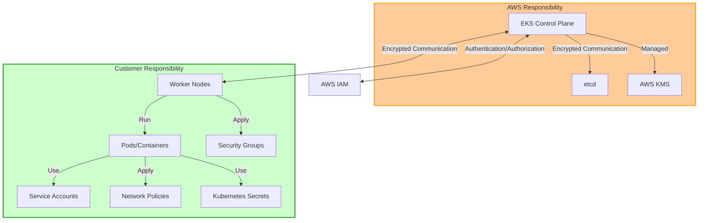

## Latest Security Trends (2023)

Kubernetes と EKS security 領域における最新のトレンドと推奨事項は次のとおりです。

### 1. Zero Trust Architecture

従来の境界型セキュリティモデルから離れ、このアプローチではデフォルトでいかなるアクセスも信頼せず、継続的に検証します。

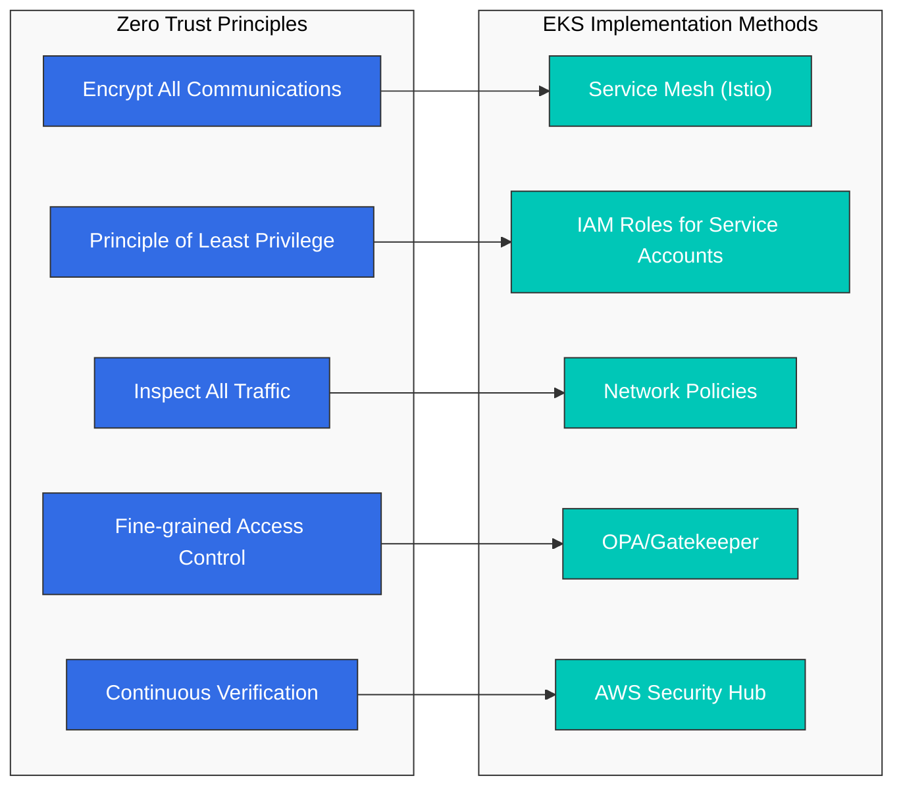

EKS で Zero Trust を実装する方法:
- **Service Mesh**: Istio または AWS App Mesh を使用した services 間の mTLS 通信
- **IAM Roles for Service Accounts (IRSA)**: きめ細かな権限管理
- **Network Policies**: 必要な通信のみを許可するデフォルト拒否ポリシー
- **OPA/Gatekeeper**: ポリシーベースの access control
- **AWS Security Hub**: 継続的なセキュリティ態勢監視

### 2. Supply Chain Security

ソフトウェアサプライチェーン攻撃が増加する中、container images から deployment までのパイプライン全体のセキュリティが重要になっています。

主な実装方法:
- **SLSA (Supply-chain Levels for Software Artifacts)** フレームワークを採用する
- **Image signing and verification**: Cosign, Notary v2
- **SBOM (Software Bill of Materials)** の生成と管理: Syft, Grype
- **Image scanning**: Amazon ECR image scanning, Trivy, Clair
- **GitOps security**: 署名付き commits、安全な pipelines

### 3. Runtime Security and Threat Detection

Container runtime security が重要になるにつれ、次の技術が注目されています。

- **eBPF-based security monitoring**: Cilium, Falco
- **AWS GuardDuty EKS Protection**: Runtime threat detection
- **Kubernetes Audit log analysis**: CloudWatch Logs Insights
- **Anomaly behavior detection**: Amazon Detective
- **Container escape prevention**: gVisor, Kata Containers

### 4. Policy as Code

一貫性と自動化を向上させるため、セキュリティポリシーを code として管理するアプローチです。

- **OPA (Open Policy Agent)**: 汎用 policy engine
- **Kyverno**: Kubernetes-native policy management
- **AWS Config**: Compliance monitoring
- **Terraform Sentinel**: IaC policy enforcement
- **AWS CloudFormation Guard**: IaC policy validation

## IAM and Authentication

### EKS Authentication Mechanisms

Amazon EKS は次の authentication mechanisms を提供します。

1. **AWS IAM Authenticator**: AWS IAM credentials を使用して Kubernetes API server に認証します。
2. **OIDC Provider Integration**: 外部 OIDC providers（例: Active Directory, Okta, Auth0）と統合し、user authentication を管理します。
3. **IAM Roles for Service Accounts**: AWS IAM roles を Kubernetes service accounts に紐付け、pods が AWS services に安全にアクセスできるようにします。

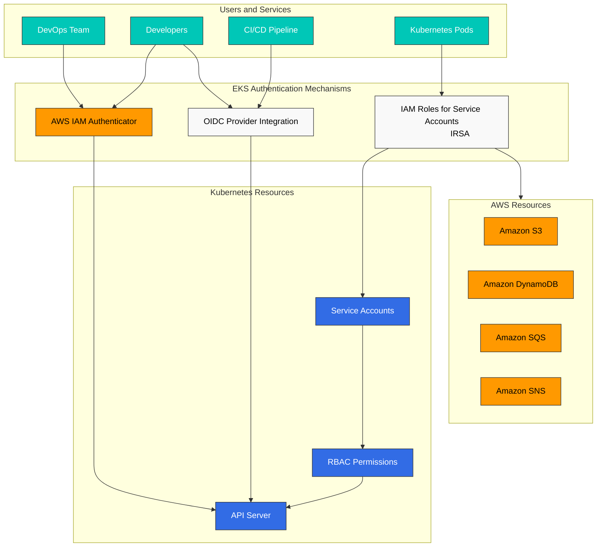

### IAM Roles and Policy Configuration

#### EKS Cluster Role

EKS cluster を作成する際に必要な最小権限:

```json
{
  "Version": "2012-10-17",
  "Statement": [
    {
      "Effect": "Allow",
      "Action": [
        "eks:CreateCluster",
        "eks:DescribeCluster",
        "eks:UpdateClusterConfig",
        "eks:DeleteCluster"
      ],
      "Resource": "*"
    },
    {
      "Effect": "Allow",
      "Action": "iam:PassRole",
      "Resource": "*",
      "Condition": {
        "StringEquals": {
          "iam:PassedToService": "eks.amazonaws.com"
        }
      }
    }
  ]
}
```

#### EKS Access Entry

EKS Access Entry は、EKS clusters への IAM user と role access を管理するために aws-auth ConfigMap を置き換える新しい方法です。Access Entry には次の利点があります。

- AWS-managed solution として安定性が向上
- 宣言的 API による管理
- Version control と audit capabilities
- node IAM role と user/role access management の分離

```bash
# Enable Access Entry for the cluster
aws eks update-cluster-config \
  --name my-cluster \
  --region us-west-2 \
  --access-config authenticationMode=API_AND_CONFIG_MAP

# Create Access Entry for IAM role
aws eks create-access-entry \
  --cluster-name my-cluster \
  --principal-arn arn:aws:iam::123456789012:role/DevTeamRole \
  --username dev-team \
  --kubernetes-groups dev-team

# Create Access Entry for IAM user
aws eks create-access-entry \
  --cluster-name my-cluster \
  --principal-arn arn:aws:iam::123456789012:user/admin \
  --username admin \
  --kubernetes-groups system:masters

# List Access Entries
aws eks list-access-entries --cluster-name my-cluster
```

> **Note**: EKS Access Entry は 2023 年に導入され、aws-auth ConfigMap よりも安定して管理しやすい方法を提供します。既存の clusters は両方の方法をサポートする hybrid mode に移行できます。

### IRSA (IAM Roles for Service Accounts)

IRSA により、AWS IAM roles を Kubernetes service accounts に紐付け、pods が AWS services に安全にアクセスできるようになります。

#### IRSA Setup Steps

1. EKS cluster 用の OIDC provider を作成します。

```bash
eksctl utils associate-iam-oidc-provider --cluster my-cluster --approve
```

2. IAM role と policy を作成します。

```bash
eksctl create iamserviceaccount \
  --name s3-reader \
  --namespace default \
  --cluster my-cluster \
  --attach-policy-arn arn:aws:iam::aws:policy/AmazonS3ReadOnlyAccess \
  --approve
```

3. service account を pod に関連付けます。

```yaml
apiVersion: v1
kind: Pod
metadata:
  name: s3-reader
spec:
  serviceAccountName: s3-reader
  containers:
  - name: app
    image: amazonlinux:2
    command: ['sh', '-c', 'aws s3 ls']
```

## OIDC Provider Deep Dive

OpenID Connect (OIDC) は EKS における IAM Roles for Service Accounts (IRSA) の基盤です。OIDC の仕組みを理解することで、authentication issues のトラブルシューティングや安全な workload identity patterns の実装に役立ちます。

### OIDC Trust Relationship Mechanics

EKS cluster を作成すると、AWS は OIDC provider endpoint を自動的に作成します。この endpoint は、AWS STS が Kubernetes service accounts を認証するために信頼する identity provider として機能します。

Trust relationship は次のように動作します。
1. EKS は projected service account tokens を介して pods に OIDC tokens を発行します
2. token には pod の identity（namespace、service account name）に関する claims が含まれます
3. AWS STS は OIDC provider の public keys に対して token を検証します
4. 有効な場合、STS は一時的な AWS credentials を発行します

### STS AssumeRoleWithWebIdentity Flow

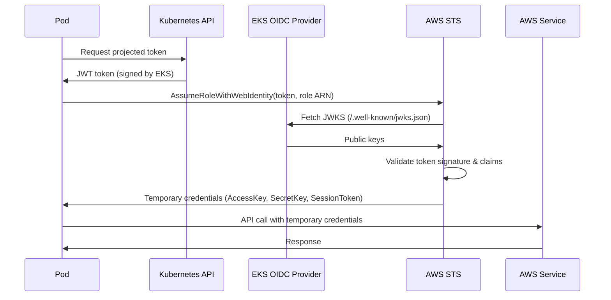

### Token Exchange Mechanism

projected service account token は、次の構造を持つ JWT (JSON Web Token) です。

```json
{
  "aud": ["sts.amazonaws.com"],
  "exp": 1234567890,
  "iat": 1234567800,
  "iss": "https://oidc.eks.us-west-2.amazonaws.com/id/EXAMPLED539D4633E53DE1B71EXAMPLE",
  "kubernetes.io": {
    "namespace": "default",
    "pod": {
      "name": "my-pod",
      "uid": "1234-5678-9012-3456"
    },
    "serviceaccount": {
      "name": "my-service-account",
      "uid": "abcd-efgh-ijkl-mnop"
    }
  },
  "sub": "system:serviceaccount:default:my-service-account"
}
```

主な claims:
- **iss**: OIDC provider URL（IAM trust policy と一致する必要があります）
- **sub**: subject（service account identifier）
- **aud**: audience（AWS では `sts.amazonaws.com` を含める必要があります）

### OIDC Endpoint Verification

cluster の OIDC configuration を確認します。

```bash
# Get OIDC provider URL
aws eks describe-cluster \
  --name my-cluster \
  --query "cluster.identity.oidc.issuer" \
  --output text

# Example output: https://oidc.eks.us-west-2.amazonaws.com/id/EXAMPLED539D4633E53DE1B71EXAMPLE

# List OIDC providers in your account
aws iam list-open-id-connect-providers

# Get OIDC provider details
aws iam get-open-id-connect-provider \
  --open-id-connect-provider-arn arn:aws:iam::123456789012:oidc-provider/oidc.eks.us-west-2.amazonaws.com/id/EXAMPLED539D4633E53DE1B71EXAMPLE
```

### JWKS URI and Token Validation

JWKS (JSON Web Key Set) endpoint は token validation 用の public keys を提供します。

```bash
# Fetch JWKS from OIDC provider
OIDC_URL=$(aws eks describe-cluster --name my-cluster --query "cluster.identity.oidc.issuer" --output text)
curl -s "${OIDC_URL}/.well-known/openid-configuration" | jq .

# Get the JWKS directly
curl -s "${OIDC_URL}/keys" | jq .
```

JWKS response には、token signatures の検証に使用される RSA public keys が含まれます。

```json
{
  "keys": [
    {
      "kty": "RSA",
      "kid": "key-id-1",
      "use": "sig",
      "alg": "RS256",
      "n": "base64-encoded-modulus",
      "e": "AQAB"
    }
  ]
}
```

## EKS Pod Identity

EKS Pod Identity は、pods が AWS services にアクセスする方法を簡素化する新しい authentication mechanism です。強力なセキュリティ保証を維持しながら、IRSA よりも利点を提供します。

### Advantages over IRSA

| Feature | IRSA | EKS Pod Identity |
|---------|------|------------------|
| Setup Complexity | Requires OIDC provider + IAM role per SA | Simpler Pod Identity Association |
| IAM Role Reuse | One role per service account | Same role across clusters/accounts |
| Session Tags | Limited | Full support for ABAC |
| Cross-Account | Complex trust policies | Simplified with associations |
| Credential Rotation | Token-based, short-lived | Managed by Pod Identity Agent |
| Troubleshooting | Complex token validation | Simpler debugging |

### Pod Identity Agent Mechanics

EKS Pod Identity Agent は nodes 上で DaemonSet として実行され、credential distribution を処理します。

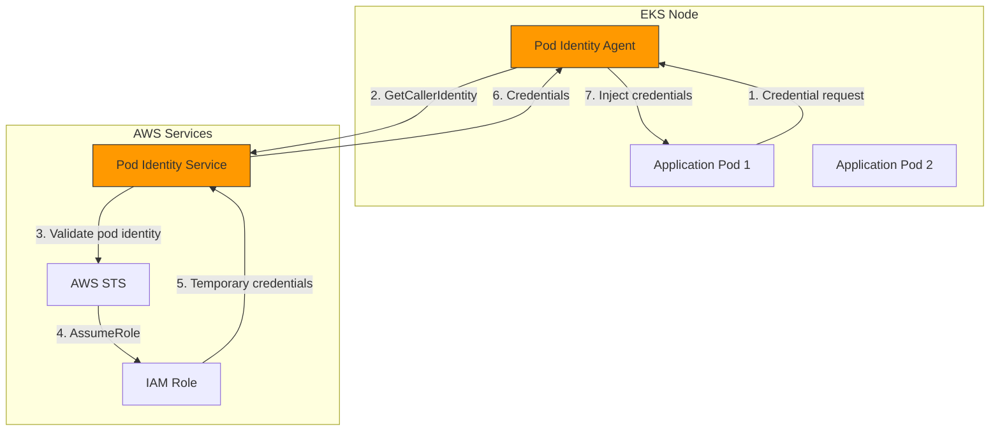

### Pod Identity Association Setup

**Using eksctl**:

```bash
# Create Pod Identity Association
eksctl create podidentityassociation \
  --cluster my-cluster \
  --namespace default \
  --service-account-name my-app-sa \
  --role-arn arn:aws:iam::123456789012:role/MyAppRole
```

**Using AWS CLI**:

```bash
# First, create the IAM role with Pod Identity trust policy
cat > trust-policy.json << 'EOF'
{
  "Version": "2012-10-17",
  "Statement": [
    {
      "Effect": "Allow",
      "Principal": {
        "Service": "pods.eks.amazonaws.com"
      },
      "Action": [
        "sts:AssumeRole",
        "sts:TagSession"
      ]
    }
  ]
}
EOF

aws iam create-role \
  --role-name MyAppRole \
  --assume-role-policy-document file://trust-policy.json

# Attach required policies
aws iam attach-role-policy \
  --role-name MyAppRole \
  --policy-arn arn:aws:iam::aws:policy/AmazonS3ReadOnlyAccess

# Create the Pod Identity Association
aws eks create-pod-identity-association \
  --cluster-name my-cluster \
  --namespace default \
  --service-account my-app-sa \
  --role-arn arn:aws:iam::123456789012:role/MyAppRole
```

### IRSA to Pod Identity Migration Procedure

IRSA から Pod Identity への段階的な移行手順:

1. **Install Pod Identity Agent**（まだインストールされていない場合）:

```bash
aws eks create-addon \
  --cluster-name my-cluster \
  --addon-name eks-pod-identity-agent \
  --addon-version v1.0.0-eksbuild.1
```

2. **Update IAM role trust policy** して IRSA と Pod Identity の両方をサポートします。

```json
{
  "Version": "2012-10-17",
  "Statement": [
    {
      "Effect": "Allow",
      "Principal": {
        "Federated": "arn:aws:iam::123456789012:oidc-provider/oidc.eks.us-west-2.amazonaws.com/id/EXAMPLE"
      },
      "Action": "sts:AssumeRoleWithWebIdentity",
      "Condition": {
        "StringEquals": {
          "oidc.eks.us-west-2.amazonaws.com/id/EXAMPLE:sub": "system:serviceaccount:default:my-app-sa"
        }
      }
    },
    {
      "Effect": "Allow",
      "Principal": {
        "Service": "pods.eks.amazonaws.com"
      },
      "Action": [
        "sts:AssumeRole",
        "sts:TagSession"
      ]
    }
  ]
}
```

3. **Create Pod Identity Association**:

```bash
aws eks create-pod-identity-association \
  --cluster-name my-cluster \
  --namespace default \
  --service-account my-app-sa \
  --role-arn arn:aws:iam::123456789012:role/MyAppRole
```

4. pods を再起動して **Test the new authentication** します。

```bash
kubectl rollout restart deployment my-app -n default
```

5. Pod Identity が動作することを確認した後、**Remove IRSA annotations** します。

```bash
kubectl annotate serviceaccount my-app-sa \
  -n default \
  eks.amazonaws.com/role-arn-
```

6. IAM role から **Clean up IRSA trust policy** します（任意、完全移行後）。

### Pod Identity Architecture Diagram

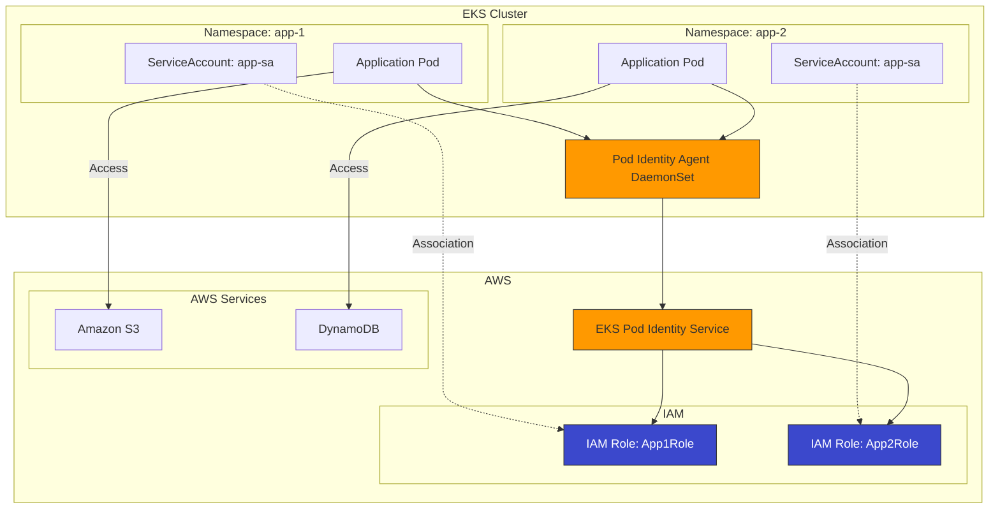

## Cluster Endpoint Access Control

EKS cluster endpoint access control は、users と workloads が Kubernetes API server に到達する方法を決定します。適切な設定はセキュリティに不可欠です。

### Public/Private/Public+Private Endpoint Configuration

EKS は 3 種類の endpoint access configurations をサポートしています。

| Configuration | Public Endpoint | Private Endpoint | Use Case |
|--------------|-----------------|------------------|----------|
| Public Only | Enabled | Disabled | Development, testing |
| Private Only | Disabled | Enabled | High-security production |
| Public + Private | Enabled | Enabled | Balanced security and convenience |

**Public Only** (default):
- API server はインターネットからアクセス可能
- Nodes はインターネット経由で通信
- 最も簡単なセットアップですが、最も安全性は低い

**Private Only**:
- API server は VPC 内からのみアクセス可能
- kubectl access には VPN、Direct Connect、または bastion host が必要
- Nodes は private network 経由で通信
- 最も安全なオプション

**Public + Private**:
- API server はインターネットと VPC の両方からアクセス可能
- Nodes は private network 経由で通信（より効率的）
- セキュリティと使いやすさのバランスが良い

### CIDR Restriction Settings

public endpoint を使用する場合は、特定の IP ranges にアクセスを制限します。

```bash
# Update cluster to restrict public access
aws eks update-cluster-config \
  --name my-cluster \
  --resources-vpc-config \
    endpointPublicAccess=true,\
    endpointPrivateAccess=true,\
    publicAccessCidrs="10.0.0.0/8","203.0.113.0/24"
```

eksctl を使用する場合:

```yaml
# cluster-config.yaml
apiVersion: eksctl.io/v1alpha5
kind: ClusterConfig
metadata:
  name: my-cluster
  region: us-west-2

vpc:
  clusterEndpoints:
    publicAccess: true
    privateAccess: true
  publicAccessCIDRs:
    - 10.0.0.0/8        # Internal corporate network
    - 203.0.113.0/24    # Office IP range
```

### Private Cluster Operation Patterns

private-only EKS cluster を運用するには、ネットワーク接続ソリューションが必要です。

**Pattern 1: VPN Access**

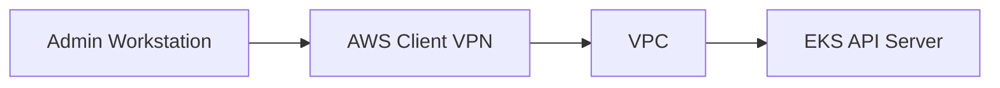

```bash
# Create Client VPN endpoint
aws ec2 create-client-vpn-endpoint \
  --client-cidr-block 10.100.0.0/16 \
  --server-certificate-arn arn:aws:acm:us-west-2:123456789012:certificate/abc123 \
  --authentication-options Type=certificate-authentication,MutualAuthentication={ClientRootCertificateChainArn=arn:aws:acm:us-west-2:123456789012:certificate/xyz789} \
  --connection-log-options Enabled=false \
  --vpc-id vpc-12345678
```

**Pattern 2: Transit Gateway**

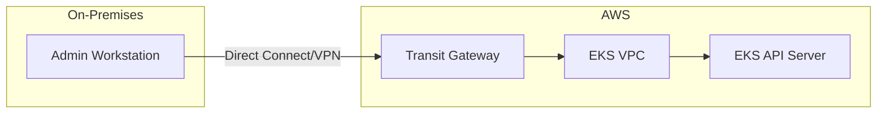

**Pattern 3: Bastion Host with SSM**

```yaml
# Bastion host deployment for kubectl access
apiVersion: apps/v1
kind: Deployment
metadata:
  name: kubectl-bastion
  namespace: kube-system
spec:
  replicas: 1
  selector:
    matchLabels:
      app: kubectl-bastion
  template:
    metadata:
      labels:
        app: kubectl-bastion
    spec:
      serviceAccountName: kubectl-bastion-sa
      containers:
      - name: bastion
        image: amazon/aws-cli:latest
        command: ["sleep", "infinity"]
        resources:
          requests:
            memory: "256Mi"
            cpu: "100m"
```

SSM Session Manager 経由でアクセスします。

```bash
# Start SSM session to bastion pod's node
aws ssm start-session --target i-1234567890abcdef0

# Or use kubectl exec through SSM
aws ssm start-session \
  --target i-1234567890abcdef0 \
  --document-name AWS-StartPortForwardingSession \
  --parameters '{"portNumber":["443"],"localPortNumber":["6443"]}'
```

### Endpoint Access Control Configuration Example

production-ready private cluster の完全な例:

```bash
# Create cluster with private endpoint only
eksctl create cluster \
  --name production-cluster \
  --region us-west-2 \
  --vpc-private-subnets subnet-private1,subnet-private2,subnet-private3 \
  --without-nodegroup

# Update to private-only endpoint
aws eks update-cluster-config \
  --name production-cluster \
  --resources-vpc-config \
    endpointPublicAccess=false,\
    endpointPrivateAccess=true

# Verify endpoint configuration
aws eks describe-cluster \
  --name production-cluster \
  --query "cluster.resourcesVpcConfig.{PublicAccess:endpointPublicAccess,PrivateAccess:endpointPrivateAccess,PublicCIDRs:publicAccessCidrs}"
```

private clusters に必要な VPC endpoints:

```bash
# Create required VPC endpoints
for service in ec2 ecr.api ecr.dkr s3 logs sts elasticloadbalancing autoscaling; do
  aws ec2 create-vpc-endpoint \
    --vpc-id vpc-12345678 \
    --service-name com.amazonaws.us-west-2.${service} \
    --subnet-ids subnet-private1 subnet-private2 \
    --security-group-ids sg-12345678
done
```

### Customer-Routed Control Plane Egress (June 2026)

> **Announced**: June 18, 2026 · [Source](https://aws.amazon.com/about-aws/whats-new/2026/06/amazon-eks-customer-routed-control-plane-egress/)

以前は、EKS Kubernetes API server が外部 endpoints（admission webhooks、private OIDC providers、aggregated API servers）に到達する必要がある場合、その egress traffic は AWS-managed path を通っていました。Customer-Routed Control Plane Egress により、この control plane egress traffic を代わりに自身の VPC を通じて直接ルーティングできます。

**Supported traffic**:
- Admission webhook calls (OPA/Gatekeeper, Kyverno)
- Private OIDC provider access
- Aggregated API server access (e.g., Metrics Server, custom APIs)

**Key characteristics**:
- control plane egress が customer VPC を通過するため、data perimeter を実装し、自身の network 内で traffic を monitor/inspect できます
- SCP 内の `eks:controlPlaneEgressMode` IAM condition key を使用して organization level で強制可能
- 既存 clusters に適用可能で、追加コストはなく、すべての regions で利用可能

```bash
# Enable customer-routed control plane egress on a cluster
aws eks update-cluster-config \
  --name my-cluster \
  --resources-vpc-config controlPlaneEgressMode=CUSTOMER_ROUTED
```

```json
// SCP example: enforce customer-routed egress mode
{
  "Version": "2012-10-17",
  "Statement": [
    {
      "Sid": "RequireCustomerRoutedControlPlaneEgress",
      "Effect": "Deny",
      "Action": [
        "eks:CreateCluster",
        "eks:UpdateClusterConfig"
      ],
      "Resource": "*",
      "Condition": {
        "StringNotEquals": {
          "eks:controlPlaneEgressMode": "CUSTOMER_ROUTED"
        }
      }
    }
  ]
}
```

## Network Security

### Security Groups

AWS security groups を使用して、EKS cluster 内の nodes と pods への network traffic を制御できます。

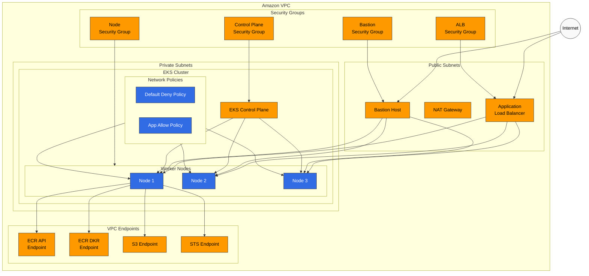

#### Cluster Security Group

EKS cluster security group は control plane と worker nodes 間の通信を許可します。

- Port 443 (HTTPS): Cluster API server communication
- Port 10250: kubelet API
- Port range 1025-65535: Inter-node communication

#### Node Security Group

worker nodes に推奨される security group configuration:

- Inbound: cluster security group からの traffic を許可
- Outbound: すべての traffic を許可（必要に応じて制限可能）

### Network Policies

Kubernetes network policies を使用して pods 間の通信を制御できます。EKS では、Amazon VPC CNI、Calico、Cilium などの network plugins を通じて network policies を実装できます。

#### Default Deny Policy Example

```yaml
apiVersion: networking.k8s.io/v1
kind: NetworkPolicy
metadata:
  name: default-deny
  namespace: default
spec:
  podSelector: {}
  policyTypes:
  - Ingress
  - Egress
```

#### Allow Policy Example for Specific Applications

```yaml
apiVersion: networking.k8s.io/v1
kind: NetworkPolicy
metadata:
  name: api-allow
  namespace: default
spec:
  podSelector:
    matchLabels:
      app: api
  policyTypes:
  - Ingress
  ingress:
  - from:
    - podSelector:
        matchLabels:
          app: frontend
    ports:
    - protocol: TCP
      port: 8080
```

### VPC Endpoints

VPC endpoints を使用して AWS services に private access し、internet gateway を経由せずに AWS services へ安全にアクセスします。

EKS clusters に推奨される VPC endpoints:

- com.amazonaws.region.ecr.api
- com.amazonaws.region.ecr.dkr
- com.amazonaws.region.s3
- com.amazonaws.region.logs
- com.amazonaws.region.sts

## Pod Security

### Pod Security Standards (PSS)

Kubernetes 1.23 で導入された Pod Security Standards は、pods の security context を制限するための組み込みメカニズムを提供します。EKS では、PSS の次の levels を適用できます。

- **Privileged**: 制限なし
- **Baseline**: 既知の privilege escalation を防止
- **Restricted**: 強力なセキュリティ制限を適用

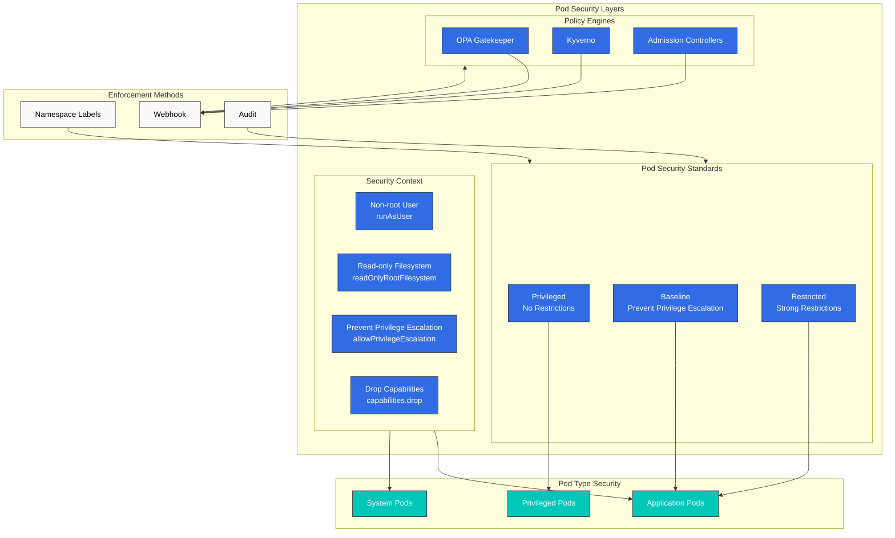

PSS を namespace に適用する例:

```yaml
apiVersion: v1
kind: Namespace
metadata:
  name: secure-ns
  labels:
    pod-security.kubernetes.io/enforce: restricted
    pod-security.kubernetes.io/audit: restricted
    pod-security.kubernetes.io/warn: restricted
```

### Security Context

pod と container レベルで security context を設定し、権限を制限できます。

```yaml
apiVersion: v1
kind: Pod
metadata:
  name: secure-pod
spec:
  securityContext:
    runAsUser: 1000
    runAsGroup: 3000
    fsGroup: 2000
  containers:
  - name: secure-container
    image: nginx
    securityContext:
      allowPrivilegeEscalation: false
      readOnlyRootFilesystem: true
      capabilities:
        drop:
        - ALL
```

### OPA Gatekeeper and Kyverno

OPA Gatekeeper や Kyverno などの policy engines を使用して、cluster 全体に security policies を適用できます。

#### Kyverno Policy Example - Prevent Privileged Containers

```yaml
apiVersion: kyverno.io/v1
kind: ClusterPolicy
metadata:
  name: disallow-privileged-containers
spec:
  validationFailureAction: enforce
  rules:
  - name: privileged-containers
    match:
      resources:
        kinds:
        - Pod
    validate:
      message: "Privileged containers are not allowed"
      pattern:
        spec:
          containers:
          - name: "*"
            securityContext:
              privileged: false
```

## Bottlerocket and Read-Only OS

Bottlerocket は、containers の実行に特化して設計された、目的特化型でセキュリティ重視の operating system です。最小限の footprint と immutable design により、強化されたセキュリティを提供します。

### Bottlerocket Characteristics

**API-Based Configuration**:
- デフォルトでは SSH access なし
- API (apiclient) を通じた configuration changes
- Settings は reboots 後も保持
- Changes は適用前に検証

```bash
# Example: Configure Bottlerocket settings via user data
[settings.kubernetes]
cluster-name = "my-cluster"
api-server = "https://EXAMPLE.gr7.us-west-2.eks.amazonaws.com"
cluster-certificate = "BASE64_ENCODED_CERT"

[settings.kubernetes.node-labels]
"node.kubernetes.io/os" = "bottlerocket"

[settings.kubernetes.node-taints]
"bottlerocket" = "true:NoSchedule"
```

**Automatic Updates**:
- Wave-based update deployment
- 失敗時の automatic rollback
- 設定可能な update windows

```bash
# Configure update settings
[settings.updates]
targets-base-url = "https://updates.bottlerocket.aws/"
version-lock = "1.15.%"  # Lock to specific minor version
```

### SELinux Enforcement

Bottlerocket はデフォルトで SELinux を enforcing mode で実行します。

- **Process Isolation**: Containers は host resources にアクセスできません
- **File System Protection**: system files に対する厳格な access controls
- **Network Isolation**: processes 間の controlled network access

SELinux は、次を防止する mandatory access control を提供します。
- Container escape attacks
- Privilege escalation
- Unauthorized file access

### dm-verity (Root Filesystem Integrity)

dm-verity は root filesystem の cryptographic verification を提供します。

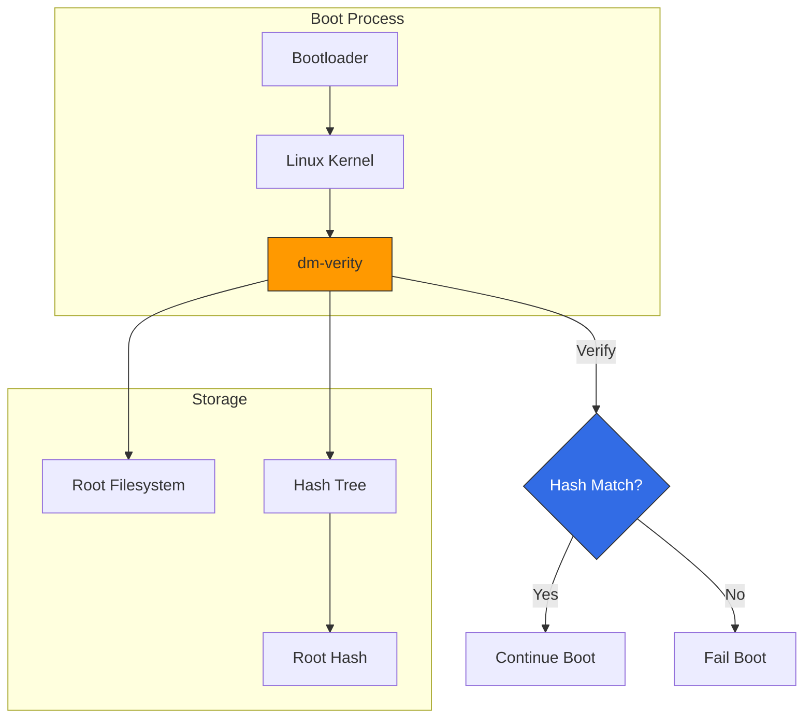

主な利点:
- **Tamper Detection**: system files へのあらゆる変更を検出
- **Boot-Time Verification**: containers が起動する前に system integrity を検証
- **Read-Only Root**: root filesystem は read-only で mount

### Immutable Infrastructure Strategy

Bottlerocket は真の immutable infrastructure アプローチを可能にします。

1. **No In-Place Updates**: patching ではなく nodes を置き換える
2. **Consistent State**: すべての node が既知の正常な image から開始
3. **Audit Trail**: すべての changes を AMI versions で追跡
4. **Fast Recovery**: 以前の AMI を起動して roll back

実装パターン:

```yaml
# Node group with Bottlerocket
apiVersion: eksctl.io/v1alpha5
kind: ClusterConfig
metadata:
  name: secure-cluster
  region: us-west-2

managedNodeGroups:
  - name: bottlerocket-ng
    instanceType: m5.large
    desiredCapacity: 3
    amiFamily: Bottlerocket
    bottlerocket:
      settings:
        kubernetes:
          node-labels:
            os: bottlerocket
        host-containers:
          admin:
            enabled: false  # Disable admin container for production
```

### Using Bottlerocket with EKS Managed Node Groups

Bottlerocket managed node groups の完全なセットアップ:

```bash
# Create managed node group with Bottlerocket
aws eks create-nodegroup \
  --cluster-name my-cluster \
  --nodegroup-name bottlerocket-nodes \
  --node-role arn:aws:iam::123456789012:role/EKSNodeRole \
  --subnets subnet-1 subnet-2 subnet-3 \
  --ami-type BOTTLEROCKET_x86_64 \
  --instance-types m5.large \
  --scaling-config minSize=2,maxSize=10,desiredSize=3 \
  --update-config maxUnavailable=1
```

高度な configuration で eksctl を使用する場合:

```yaml
apiVersion: eksctl.io/v1alpha5
kind: ClusterConfig
metadata:
  name: production-cluster
  region: us-west-2

managedNodeGroups:
  - name: bottlerocket-workers
    instanceType: m5.xlarge
    minSize: 3
    maxSize: 20
    desiredCapacity: 5
    amiFamily: Bottlerocket
    volumeSize: 100
    volumeType: gp3
    volumeEncrypted: true
    iam:
      attachPolicyARNs:
        - arn:aws:iam::aws:policy/AmazonEKSWorkerNodePolicy
        - arn:aws:iam::aws:policy/AmazonEKS_CNI_Policy
        - arn:aws:iam::aws:policy/AmazonEC2ContainerRegistryReadOnly
        - arn:aws:iam::aws:policy/AmazonSSMManagedInstanceCore
    bottlerocket:
      settings:
        kubernetes:
          node-labels:
            workload-type: general
            os: bottlerocket
          node-taints:
            - key: "CriticalAddonsOnly"
              value: "true"
              effect: "NoSchedule"
        kernel:
          sysctl:
            "net.core.somaxconn": "32768"
            "net.ipv4.tcp_max_syn_backlog": "32768"
        host-containers:
          admin:
            enabled: false
          control:
            enabled: true
```

## IAM Permission Boundaries

IAM Permission Boundaries は、どの policies が attached されているかに関係なく、IAM entity が持てる最大権限を設定する仕組みを提供します。

### Permission Boundary Concept

Effective permissions は identity-based policies と permission boundaries の積集合です。

```
Effective Permissions = Identity Policy ∩ Permission Boundary
```

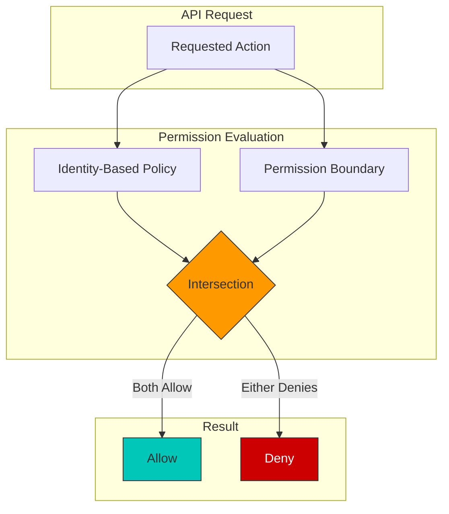

例のシナリオ:
- Identity policy allows: `s3:*`, `ec2:*`, `rds:*`
- Permission boundary allows: `s3:*`, `ec2:Describe*`
- Effective permissions: `s3:*`, `ec2:Describe*`

### SCP (Service Control Policy) Usage

SCPs は AWS Organizations level で guardrails を提供します。

```json
{
  "Version": "2012-10-17",
  "Statement": [
    {
      "Sid": "DenyEKSClusterDeletion",
      "Effect": "Deny",
      "Action": "eks:DeleteCluster",
      "Resource": "*",
      "Condition": {
        "StringNotLike": {
          "aws:PrincipalArn": "arn:aws:iam::*:role/EKSAdminRole"
        }
      }
    },
    {
      "Sid": "RequireIMDSv2",
      "Effect": "Deny",
      "Action": "ec2:RunInstances",
      "Resource": "arn:aws:ec2:*:*:instance/*",
      "Condition": {
        "StringNotEquals": {
          "ec2:MetadataHttpTokens": "required"
        }
      }
    },
    {
      "Sid": "DenyPublicEKSEndpoint",
      "Effect": "Deny",
      "Action": "eks:UpdateClusterConfig",
      "Resource": "*",
      "Condition": {
        "Bool": {
          "eks:endpointPublicAccess": "true"
        }
      }
    }
  ]
}
```

### Least Privilege IAM Policy Patterns

EKS IAM policies のベストプラクティス:

**Pattern 1: Namespace-Scoped Permissions**

```json
{
  "Version": "2012-10-17",
  "Statement": [
    {
      "Sid": "AllowNamespaceOperations",
      "Effect": "Allow",
      "Action": [
        "eks:DescribeCluster",
        "eks:ListClusters"
      ],
      "Resource": "*"
    },
    {
      "Sid": "AllowSpecificClusterAccess",
      "Effect": "Allow",
      "Action": [
        "eks:AccessKubernetesApi"
      ],
      "Resource": "arn:aws:eks:us-west-2:123456789012:cluster/production-cluster",
      "Condition": {
        "StringEquals": {
          "eks:namespaces": ["team-a", "team-a-staging"]
        }
      }
    }
  ]
}
```

**Pattern 2: Resource-Based Restrictions**

```json
{
  "Version": "2012-10-17",
  "Statement": [
    {
      "Sid": "AllowECRPull",
      "Effect": "Allow",
      "Action": [
        "ecr:GetDownloadUrlForLayer",
        "ecr:BatchGetImage",
        "ecr:BatchCheckLayerAvailability"
      ],
      "Resource": "arn:aws:ecr:us-west-2:123456789012:repository/approved-*"
    },
    {
      "Sid": "AllowECRAuth",
      "Effect": "Allow",
      "Action": "ecr:GetAuthorizationToken",
      "Resource": "*"
    }
  ]
}
```

**Pattern 3: Condition-Based Access**

```json
{
  "Version": "2012-10-17",
  "Statement": [
    {
      "Sid": "AllowS3AccessWithTags",
      "Effect": "Allow",
      "Action": [
        "s3:GetObject",
        "s3:PutObject"
      ],
      "Resource": "arn:aws:s3:::app-bucket/*",
      "Condition": {
        "StringEquals": {
          "aws:ResourceTag/Environment": "${aws:PrincipalTag/Environment}"
        }
      }
    }
  ]
}
```

### EKS Node Role Permission Boundary Example

EKS node roles に permission boundaries を適用して blast radius を制限します。

```json
{
  "Version": "2012-10-17",
  "Statement": [
    {
      "Sid": "AllowEKSNodeOperations",
      "Effect": "Allow",
      "Action": [
        "ec2:DescribeInstances",
        "ec2:DescribeVolumes",
        "ec2:DescribeNetworkInterfaces",
        "ec2:AttachVolume",
        "ec2:DetachVolume",
        "ecr:GetAuthorizationToken",
        "ecr:BatchCheckLayerAvailability",
        "ecr:GetDownloadUrlForLayer",
        "ecr:BatchGetImage",
        "logs:CreateLogStream",
        "logs:PutLogEvents"
      ],
      "Resource": "*"
    },
    {
      "Sid": "DenyPrivilegedActions",
      "Effect": "Deny",
      "Action": [
        "iam:*",
        "organizations:*",
        "account:*",
        "eks:DeleteCluster",
        "eks:UpdateClusterConfig",
        "ec2:DeleteVpc",
        "ec2:DeleteSubnet",
        "ec2:DeleteSecurityGroup"
      ],
      "Resource": "*"
    },
    {
      "Sid": "AllowSecretsInNamespace",
      "Effect": "Allow",
      "Action": [
        "secretsmanager:GetSecretValue"
      ],
      "Resource": "arn:aws:secretsmanager:*:*:secret:/eks/production/*"
    }
  ]
}
```

boundary を node role に適用します。

```bash
# Create permission boundary
aws iam create-policy \
  --policy-name EKSNodePermissionBoundary \
  --policy-document file://node-permission-boundary.json

# Apply boundary to node role
aws iam put-role-permissions-boundary \
  --role-name EKSNodeRole \
  --permissions-boundary arn:aws:iam::123456789012:policy/EKSNodePermissionBoundary

# Verify boundary is applied
aws iam get-role --role-name EKSNodeRole --query "Role.PermissionsBoundary"
```

### Proactive Governance with 7 New IAM Condition Keys (April 2026)

> **Announced**: April 20, 2026 · [Source](https://aws.amazon.com/about-aws/whats-new/2026/04/amazon-eks-iam-condition-keys/)

Amazon EKS は、cluster creation と update time に policy-based proactive governance を強制できる 7 つの新しい IAM condition keys を追加しました。これらの conditions は `CreateCluster`、`UpdateClusterConfig`、`UpdateClusterVersion`、`AssociateEncryptionConfig` APIs に適用でき、AWS Organizations SCPs と統合できます。

| Condition Key | Purpose |
|----------------|---------|
| `eks:endpointPublicAccess` / `eks:endpointPrivateAccess` | Enforce use of the private endpoint |
| `eks:encryptionConfigProviderKeyArns` | Require KMS-based secrets encryption |
| `eks:kubernetesVersion` | Restrict cluster creation/upgrade to approved Kubernetes versions |
| `eks:controlPlaneScalingTier` | Restrict the control plane scaling tier |
| `eks:deletionProtection` | Enforce cluster deletion protection |
| `eks:zonalShiftEnabled` | Control whether zonal shift is enabled |

```json
// SCP example: require private endpoint and KMS encryption
{
  "Version": "2012-10-17",
  "Statement": [
    {
      "Sid": "RequirePrivateEndpointAndKmsEncryption",
      "Effect": "Deny",
      "Action": [
        "eks:CreateCluster",
        "eks:UpdateClusterConfig"
      ],
      "Resource": "*",
      "Condition": {
        "Bool": {
          "eks:endpointPublicAccess": "true"
        }
      }
    },
    {
      "Sid": "RequireEncryptionConfig",
      "Effect": "Deny",
      "Action": "eks:CreateCluster",
      "Resource": "*",
      "Condition": {
        "Null": {
          "eks:encryptionConfigProviderKeyArns": "true"
        }
      }
    },
    {
      "Sid": "RestrictKubernetesVersion",
      "Effect": "Deny",
      "Action": [
        "eks:CreateCluster",
        "eks:UpdateClusterVersion"
      ],
      "Resource": "*",
      "Condition": {
        "StringNotEquals": {
          "eks:kubernetesVersion": ["1.32", "1.33"]
        }
      }
    }
  ]
}
```

## Encryption and Secrets Management

### EKS Encryption Options

#### etcd Encryption

EKS は etcd に保存された Kubernetes secrets をデフォルトで暗号化します。追加の暗号化レイヤーとして AWS KMS を使用できます。

```mermaid
flowchart TD
    subgraph Encryption_Options ["EKS Encryption Options"]
        subgraph ETCD_Encryption ["etcd Encryption"]
            Default[Default Encryption]
            KMS_Encryption[AWS KMS Encryption]
        end

        subgraph Secret_Management ["Secrets Management Solutions"]
            K8s_Secrets[Kubernetes Secrets]
            AWS_SM[AWS Secrets Manager]
            AWS_PS[AWS Parameter Store]
            Vault[HashiCorp Vault]
            SOPS[Mozilla SOPS]
        end

        subgraph Integration_Tools ["Integration Tools"]
            ESO["External Secrets
                Operator"]
            ASCP["AWS Secrets and
                Configuration Provider"]
            CSI_Driver["Secrets Store
                CSI Driver"]
        end
    end

    subgraph Usage_Patterns ["Usage Patterns"]
        subgraph Storage ["Storage"]
            Encrypted_Storage[Encrypted Storage]
            Version_Control[Version Control]
            Access_Control[Access Control]
        end

        subgraph Retrieval ["Retrieval"]
            Pod_Mount[Pod Mount]
            Env_Vars[Environment Variables]
            Init_Container[Init Container]
        end
    end

    KMS_Encryption --> Default

    AWS_SM --> ESO
    AWS_PS --> ESO
    AWS_SM --> ASCP
    AWS_PS --> ASCP
    Vault --> CSI_Driver

    ESO --> K8s_Secrets
    ASCP --> K8s_Secrets
    CSI_Driver --> K8s_Secrets

    K8s_Secrets --> Encrypted_Storage
    AWS_SM --> Encrypted_Storage
    AWS_PS --> Encrypted_Storage
    Vault --> Encrypted_Storage
    SOPS --> Encrypted_Storage

    AWS_SM --> Version_Control
    Vault --> Version_Control

    AWS_SM --> Access_Control
    AWS_PS --> Access_Control
    Vault --> Access_Control

    K8s_Secrets --> Pod_Mount
    K8s_Secrets --> Env_Vars
    K8s_Secrets --> Init_Container

    %% Class definitions
    classDef awsService fill:#FF9900,stroke:#333,stroke-width:1px,color:black;
    classDef k8sComponent fill:#326CE5,stroke:#333,stroke-width:1px,color:white;
    classDef userApp fill:#00C7B7,stroke:#333,stroke-width:1px,color:white;
    classDef dataStore fill:#3B48CC,stroke:#333,stroke-width:1px,color:white;
    classDef default fill:#f9f9f9,stroke:#333,stroke-width:1px,color:black;

    %% Class application
    class KMS_Encryption,AWS_SM,AWS_PS,ASCP awsService;
    class K8s_Secrets,ESO,CSI_Driver k8sComponent;
    class Vault,SOPS userApp;
    class Default,Encrypted_Storage,Version_Control,Access_Control,Pod_Mount,Env_Vars,Init_Container default;
```

```bash
eksctl create cluster --name my-cluster --region us-west-2 --encryption-provider-config-key arn:aws:kms:us-west-2:111122223333:key/1234abcd-12ab-34cd-56ef-1234567890ab
```

### AWS Secrets Manager and Parameter Store Integration

External Secrets Operator または AWS Secrets and Configuration Provider (ASCP) を使用して、AWS Secrets Manager または Parameter Store に保存された secrets を Kubernetes pods に mount できます。

#### Install External Secrets Operator

```bash
helm repo add external-secrets https://charts.external-secrets.io
helm install external-secrets external-secrets/external-secrets -n external-secrets --create-namespace
```

#### Define SecretStore and ExternalSecret

```yaml
apiVersion: external-secrets.io/v1beta1
kind: SecretStore
metadata:
  name: aws-secretsmanager
spec:
  provider:
    aws:
      service: SecretsManager
      region: us-west-2
      auth:
        jwt:
          serviceAccountRef:
            name: external-secrets-sa
---
apiVersion: external-secrets.io/v1beta1
kind: ExternalSecret
metadata:
  name: db-credentials
spec:
  refreshInterval: 1h
  secretStoreRef:
    name: aws-secretsmanager
    kind: SecretStore
  target:
    name: db-credentials
  data:
  - secretKey: username
    remoteRef:
      key: db-credentials
      property: username
  - secretKey: password
    remoteRef:
      key: db-credentials
      property: password
```

### SOPS (Secrets OPerationS)

Mozilla SOPS を使用して、Git repositories 内の encrypted secrets を安全に保存・管理できます。

#### SOPS Installation and Usage

```bash
# Install SOPS
brew install sops

# Encrypt secrets using AWS KMS key
sops --encrypt --aws-profile default --kms arn:aws:kms:us-west-2:111122223333:key/1234abcd-12ab-34cd-56ef-1234567890ab secrets.yaml > secrets.enc.yaml

# Decrypt encrypted secrets
sops --decrypt secrets.enc.yaml
```

## Compliance and Auditing

### EKS Audit Logging

EKS control plane audit logs を有効にして、cluster 内で行われたすべての API calls を記録できます。

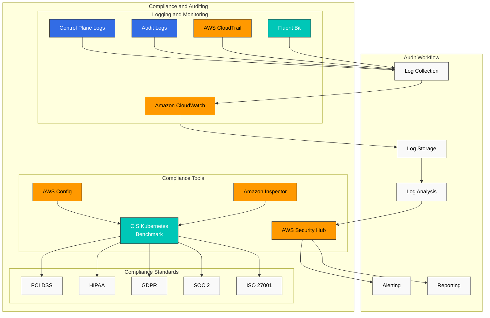

```bash
aws eks update-cluster-config \
  --region us-west-2 \
  --name my-cluster \
  --logging '{"clusterLogging":[{"types":["api","audit","authenticator","controllerManager","scheduler"],"enabled":true}]}'
```

### AWS Config Rules

AWS Config を使用して EKS cluster の compliance status を監視できます。

- eks-cluster-logging-enabled
- eks-cluster-oldest-supported-version
- eks-endpoint-no-public-access
- eks-secrets-encrypted

### AWS Security Hub Integration

AWS Security Hub を使用して、EKS cluster の security posture を一元的に管理・監視できます。Security Hub は CIS Kubernetes Benchmark などの industry standards に対する compliance をチェックします。

## Security Monitoring and Detection

### GuardDuty EKS Protection

Amazon GuardDuty EKS Protection を有効にして、EKS cluster 内の潜在的な security threats を検出できます。

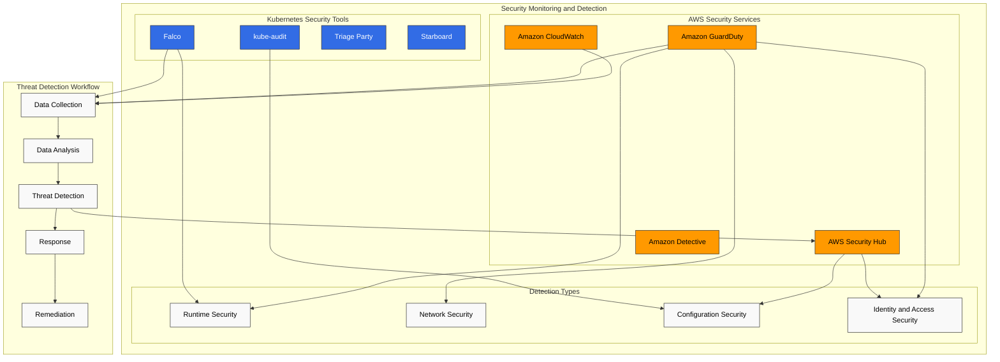

```bash
aws guardduty update-detector \
  --detector-id 12abc34d567e8fa901bc2d34e56789f0 \
  --features '[{"Name": "EKS_RUNTIME_MONITORING", "Status": "ENABLED"}]'
```

### AWS Security Hub

AWS Security Hub を使用して、EKS cluster の security posture を一元的に管理・監視できます。

```bash
aws securityhub enable-security-hub
aws securityhub batch-enable-standards --standards-subscription-requests '[{"StandardsArn":"arn:aws:securityhub:us-west-2::standards/aws-foundational-security-best-practices/v/1.0.0"}]'
```

### Falco

Falco を使用して runtime security monitoring と anomaly detection を実行できます。

```bash
helm repo add falcosecurity https://falcosecurity.github.io/charts
helm install falco falcosecurity/falco --namespace falco --create-namespace
```

Falco rule の例:

```yaml
- rule: Terminal shell in container
  desc: A shell was spawned by a pod in the container
  condition: container and shell_procs and not container_entrypoint
  output: Shell spawned in a container (user=%user.name pod=%k8s.pod.name container=%container.name shell=%proc.name parent=%proc.pname cmdline=%proc.cmdline)
  priority: WARNING
```

## EKS Security Best Practices

### Cluster Security Hardening

1. **Maintain Latest Kubernetes Version**: security patches を適用するため、EKS cluster を定期的に latest version へ upgrade します
2. **Use Private API Endpoint**: public internet から API server へのアクセスを制限します
3. **Apply Principle of Least Privilege**: IAM roles と RBAC に principle of least privilege を適用します
4. **Restrict Security Groups**: 必要な ports のみを許可するよう security groups を設定します
5. **Implement Network Policies**: pods 間の通信を制限するため network policies を適用します

### Node and Container Security

1. **Use Latest AMI**: latest security patches が適用された EKS-optimized AMI を使用します
2. **Scan Container Images**: vulnerability scanning には ECR image scanning または Trivy などの tools を使用します
3. **Use Immutable Infrastructure**: nodes を更新する際は新しい node groups を作成し、古い node groups を削除します
4. **Run Containers as Non-Root User**: privileges を制限するため、containers を non-root user として実行します
5. **Use Read-Only Filesystem**: 可能な場合は container root filesystem を read-only として mount します

### Continuous Security Monitoring

1. **Enable Audit Logging**: EKS control plane audit logs を有効にします
2. **Enable GuardDuty EKS Protection**: runtime security monitoring のため GuardDuty EKS Protection を有効にします
3. **Security Hub Integration**: centralized security posture management に AWS Security Hub を使用します
4. **Regular Security Assessments**: CIS Kubernetes Benchmark に基づいて regular security assessments を実施します
5. **Establish Incident Response Plan**: EKS cluster 向けの security incident response plan を策定し、テストします

## EKS Security Considerations for Financial Services

financial services industry で EKS を使用する際に考慮すべき追加のセキュリティ要件:

### Regulatory Compliance

1. **PCI DSS**: card payment data を処理する workloads に対する PCI DSS requirements compliance
2. **GDPR/CCPA**: personally identifiable information (PII) に関する data protection regulations への compliance
3. **Financial Regulations**: 国内の financial regulatory requirements（例: Financial Supervisory Service guidelines）への compliance

### Data Security

1. **Encryption in Transit**: TLS 1.2 以上を使用してすべての network communications を暗号化します
2. **Data at Rest Encryption**: AWS KMS を使用して data at rest を暗号化します
3. **Data Classification**: data を sensitivity に応じて分類し、適切な security controls を適用します
4. **Data Access Logging**: すべての sensitive data access に対する詳細な logging と monitoring

### High Availability and Disaster Recovery

1. **Multi-AZ Deployment**: EKS cluster を複数の availability zones にわたって deploy します
2. **Disaster Recovery Plan**: regular backups と recovery testing を含む disaster recovery plan を策定します
3. **Business Continuity**: financial services に適した RTO (Recovery Time Objective) と RPO (Recovery Point Objective) を定義します

### EKS Security Architecture Example for Financial Services

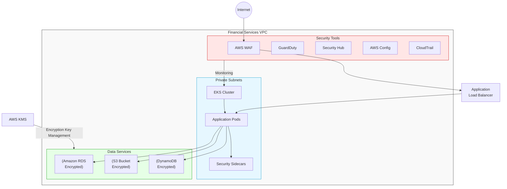

## Conclusion

Amazon EKS security はマルチレイヤーの防御戦略によって実装されます。IAM と RBAC による強力な authentication と authorization、network policies と security groups による network security、Pod Security Standards と security context による workload security、さらに各種 AWS security services との統合を通じて、EKS cluster を安全に運用できます。

financial services のような厳格な規制がある業界では、追加の security controls と compliance requirements を考慮する必要があります。regular security assessments、vulnerability scanning、continuous monitoring を通じて EKS environment の security posture を維持することが重要です。

## References

- [Amazon EKS Security Best Practices](https://aws.github.io/aws-eks-best-practices/security/docs/)
- [Kubernetes Security Best Practices](https://kubernetes.io/docs/concepts/security/overview/)
- [CIS Kubernetes Benchmark](https://www.cisecurity.org/benchmark/kubernetes)
- [AWS Security Hub](https://aws.amazon.com/security-hub/)
- [Amazon GuardDuty](https://aws.amazon.com/guardduty/)
- [Amazon EKS Customer-Routed Control Plane Egress (2026-06-18)](https://aws.amazon.com/about-aws/whats-new/2026/06/amazon-eks-customer-routed-control-plane-egress/)
- [Amazon EKS New IAM Condition Keys (2026-04-20)](https://aws.amazon.com/about-aws/whats-new/2026/04/amazon-eks-iam-condition-keys/)

## Quiz

この章で学んだ内容を確認するには、[topic quiz](../quizzes/eks/05-eks-security-quiz.md) を試してください。
