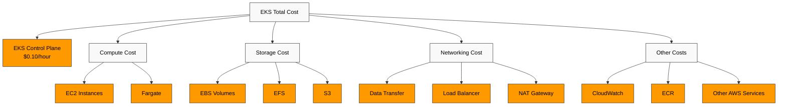
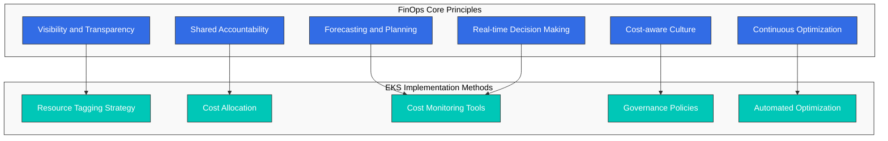
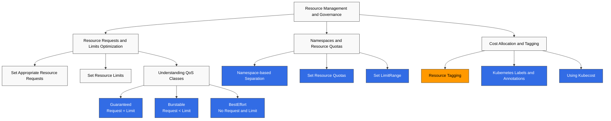

# Amazon EKS Cost Optimization

> **Supported Versions**: Amazon EKS 1.31, 1.32, 1.33
> **最終更新**: February 22, 2026

Amazon EKS (Elastic Kubernetes Service) は、containerized applications のデプロイ、管理、スケーリングを容易にしますが、コストを効果的に管理することが重要です。このドキュメントでは、EKS cluster のコストを最適化するためのさまざまな戦略と best practices について説明します。

## Table of Contents

1. [EKS Cost Components](#eks-cost-components)
2. [FinOps Principles and EKS](#finops-principles-and-eks)
3. [Compute Cost Optimization](#compute-cost-optimization)
4. [Storage Cost Optimization](#storage-cost-optimization)
5. [Networking Cost Optimization](#networking-cost-optimization)
6. [Resource Management and Governance](#resource-management-and-governance)
7. [Cost Monitoring and Analysis](#cost-monitoring-and-analysis)
8. [Cost Optimization Best Practices](#cost-optimization-best-practices)

## EKS Cost Components

Amazon EKS の利用時に発生するコストは、次の components で構成されます。



## FinOps Principles and EKS

FinOps (Financial Operations) は、finance、technology、business teams が協力して cloud spending に対する責任を共有し、cost optimization decisions を行う cloud cost management の operational model です。

### Core Principles of the FinOps Framework



### Applying FinOps to EKS

1. **Achieving Cost Visibility**
   - Kubernetes namespaces、labels、annotations を使用した cost allocation
   - AWS Cost Explorer や Kubecost などの tools と統合した詳細な cost analysis
   - team、application、environment 別の cost analysis

2. **Implementing Shared Accountability Model**
   - team 別の cost allocation と reporting
   - cost optimization goals の設定と tracking
   - cost savings に対する incentives の提供

3. **Automating Continuous Optimization**
   - auto-scaling policies の実装
   - spot instance utilization の自動化
   - idle resources の検出と削除

4. **Cost Forecasting and Planning**
   - workload pattern analysis による cost forecasting
   - Reserved Instances と Savings Plans の活用
   - cost anomaly detection と alerting

### Latest FinOps Tools and Technologies

1. **Kubecost**: Kubernetes cost monitoring and optimization tool
2. **AWS Cost Anomaly Detection**: 異常な cost increases の検出
3. **Karpenter**: 効率的な node provisioning と cost optimization
4. **Goldilocks**: Resource requests and limits optimization
5. **Vertical Pod Autoscaler**: pod resource requests の自動調整

### EKS Cluster Cost

EKS cluster 自体のコスト:

- **EKS Control Plane**: 1 時間あたり $0.10 (region によって異なる場合があります)
- **EKS Extended Cluster**: 1 時間あたり $0.10 (region によって異なる場合があります)

### Compute Cost

EKS cluster で実行される worker nodes のコスト:

- **EC2 Instances**: node groups に使用される EC2 instances のコスト
- **Fargate**: Fargate profiles を使用する場合の vCPU と memory usage に基づくコスト

### Storage Cost

EKS cluster で使用される storage のコスト:

- **EBS Volumes**: persistent volumes に使用される EBS volumes のコスト
- **EFS**: shared file systems に使用される EFS のコスト
- **S3**: object storage に使用される S3 のコスト

### Networking Cost

EKS cluster の networking に関連するコスト:

- **Data Transfer**: regions 間または internet への data transfer のコスト
- **Load Balancer**: services に使用される load balancers のコスト
- **NAT Gateway**: private subnets からの outbound traffic 用 NAT gateway のコスト

### Other Costs

- **CloudWatch**: monitoring と logging に使用される CloudWatch のコスト
- **ECR**: container image storage に使用される ECR のコスト
- **Other AWS Services**: EKS cluster とともに使用されるその他の AWS services のコスト

## Compute Cost Optimization

Compute cost は通常、EKS cluster の最大の cost component です。次の戦略を使用して compute costs を最適化できます。

```mermaid
flowchart TD
    ComputeCost[Compute Cost Optimization] --> InstanceType[Instance Type Optimization]
    ComputeCost --> SpotInstances[Spot Instance Utilization]
    ComputeCost --> SavingsPlans["Savings Plans and
                Reserved Instances"]
    ComputeCost --> AutoScaling[Auto Scaling Optimization]
    ComputeCost --> FargateVsEC2["Fargate vs EC2
                Cost Comparison"]

    InstanceType --> Family[Instance Family Selection]
    InstanceType --> Size[Instance Size Optimization]
    InstanceType --> Generation[Instance Generation Consideration]

    SpotInstances --> WorkloadTypes[Suitable Workload Types]
    SpotInstances --> ManagedNodeGroups[Managed Node Groups]
    SpotInstances --> Karpenter[Karpenter Utilization]
    SpotInstances --> InterruptionHandling[Interruption Handling]

    SavingsPlans --> ComputeSP[Compute Savings Plans]
    SavingsPlans --> EC2SP[EC2 Instance Savings Plans]
    SavingsPlans --> RI[Reserved Instances]

    AutoScaling --> CA[Cluster Autoscaler]
    AutoScaling --> KarpenterAS[Karpenter]
    AutoScaling --> HPA[Horizontal Pod Autoscaler]
    AutoScaling --> VPA[Vertical Pod Autoscaler]

    %% Class definitions
    classDef awsService fill:#FF9900,stroke:#333,stroke-width:1px,color:black;
    classDef k8sComponent fill:#326CE5,stroke:#333,stroke-width:1px,color:white;
    classDef default fill:#f9f9f9,stroke:#333,stroke-width:1px,color:black;

    %% Class application
    class ComputeSP,EC2SP,RI,SpotInstances,ManagedNodeGroups awsService;
    class CA,KarpenterAS,HPA,VPA,Karpenter k8sComponent;
    class ComputeCost,InstanceType,Family,Size,Generation,WorkloadTypes,InterruptionHandling,SavingsPlans,AutoScaling,FargateVsEC2 default;
```



### Selecting the Right Instance Type

workload に適した instance type を選択することが重要です。

#### Instance Family Selection

workload characteristics に基づいて適切な instance family を選択します。

- **General Purpose (T3, M5, M6)**: balanced compute、memory、networking resources を必要とする workloads
- **Compute Optimized (C5, C6)**: high-performance processors を必要とする compute-intensive workloads
- **Memory Optimized (R5, R6, X1)**: large in-memory databases、caches などの memory-intensive workloads
- **Storage Optimized (I3, D2)**: high disk I/O を必要とする workloads
- **Accelerated Computing (P3, G4, Inf1)**: GPU または machine learning accelerators を必要とする workloads

#### Instance Size Optimization

workload requirements に適した instance size を選択します。

- 大きすぎる instances は resource waste につながる可能性があります。
- 小さすぎる instances は performance issues を引き起こす可能性があります。
- CloudWatch Container Insights または Kubernetes metrics を使用して実際の resource usage を monitor し、適切な size を選択します。

#### Instance Generation Consideration

新しい世代の instances は一般に、前世代よりも優れた performance と cost efficiency を提供します。

- M5 の代わりに M6i または M6g を使用する
- C5 の代わりに C6i または C6g を使用する
- R5 の代わりに R6i または R6g を使用する

### Spot Instance Utilization

spot instances を使用すると、EC2 instances を on-demand prices より最大 90% 低い価格で利用できます。

#### Workloads Suitable for Spot Instances

- **Stateless Applications**: state を保存しない applications
- **Fault-tolerant Applications**: instance interruptions に対応できる applications
- **Batch Processing Jobs**: 中断された場合に restart できる jobs
- **CI/CD Pipelines**: build と test jobs

#### Using Spot Instances in Managed Node Groups

```bash
eksctl create nodegroup \
  --cluster my-cluster \
  --name my-spot-ng \
  --node-type m5.large \
  --nodes-min 2 \
  --nodes-max 5 \
  --spot
```

#### Spot Instance Provisioning with Karpenter

```yaml
apiVersion: karpenter.sh/v1
kind: NodePool
metadata:
  name: spot
spec:
  template:
    spec:
      requirements:
      - key: karpenter.sh/capacity-type
        operator: In
        values: ["spot"]
      - key: kubernetes.io/arch
        operator: In
        values: ["amd64"]
      - key: node.kubernetes.io/instance-type
        operator: In
        values: ["m5.large", "m5.xlarge", "m5.2xlarge"]
      nodeClassRef:
        group: karpenter.k8s.aws
        kind: EC2NodeClass
        name: spot-class
  limits:
    cpu: 1000
    memory: 1000Gi
  disruption:
    consolidationPolicy: WhenEmpty
    consolidateAfter: 30s
---
apiVersion: karpenter.k8s.aws/v1
kind: EC2NodeClass
metadata:
  name: spot-class
spec:
  subnetSelectorTerms:
    - tags:
        karpenter.sh/discovery: my-cluster
  securityGroupSelectorTerms:
    - tags:
        karpenter.sh/discovery: my-cluster
```

#### Spot Instance Interruption Handling

spot instance interruptions を処理するための best practices:

1. **Use Multiple Instance Types**: さまざまな instance types を使用して interruption risk を分散します
2. **Use Multiple Availability Zones**: 複数の availability zones に instances を deploy します
3. **Use Spot Instance Interruption Handler**: AWS Node Termination Handler を使用して interruption notifications を処理します

```bash
helm repo add eks https://aws.github.io/eks-charts
helm install aws-node-termination-handler \
  --namespace kube-system \
  eks/aws-node-termination-handler \
  --set enableSpotInterruptionDraining=true
```

### Savings Plans and Reserved Instances

予測可能な workloads では、Savings Plans または Reserved Instances を使用してコストを削減できます。

#### Compute Savings Plans

Compute Savings Plans は、1 年または 3 年の commitment により on-demand rates から最大 66% の割引を提供します。

- **Flexibility**: instance family、size、OS、tenancy、region に関係なく適用されます
- **Includes EC2, Fargate, and Lambda**: 複数の compute services にわたって適用されます

#### EC2 Instance Savings Plans

EC2 Instance Savings Plans は、特定の region の instance families に対して最大 72% の割引を提供します。

- **Moderate Flexibility**: 特定の region の instance family 内で、sizes と OS にわたって適用されます
- **Higher Discount Rate**: Compute Savings Plans より高い discount rate を提供します

#### Reserved Instances

Reserved Instances は、特定の instance types と regions に対して最大 75% の割引を提供します。

- **Low Flexibility**: 特定の instance types、regions、availability zones に結び付けられます
- **Highest Discount Rate**: 最も高い discount rate を提供します

### Fargate vs EC2 Cost Comparison

Fargate と EC2 のどちらを選択するかを決めるときは、コストを考慮します。

#### Fargate Advantages

- **Reduced Operational Overhead**: node management が不要です
- **Precise Resource Provisioning**: pod level での resource allocation
- **No Idle Capacity**: running pods に対してのみ支払います

#### EC2 Advantages

- **More Cost-efficient for Large Workloads**: resource utilization が高いケースでより cost-efficient です
- **More Instance Type Options**: さまざまな workloads 向けに instance types を選択できます
- **Spot Instance Support**: spot instances を使用した追加の cost savings が可能です

#### Cost Comparison Example

**Scenario**: 2vCPU、4GB memory を使用する application

**Fargate Cost**:
- vCPU: $0.04048 per vCPU-hour × 2 = $0.08096 per hour
- Memory: $0.004445 per GB-hour × 4 = $0.01778 per hour
- Total Cost: $0.09874 per hour

**EC2 Cost (t3.medium)**:
- On-demand: $0.0416 per hour
- Spot: ~$0.0125 per hour (assuming 70% discount)

この例では EC2 の方が cost-efficient ですが、node management overhead と cluster utilization を考慮する必要があります。

### Auto Scaling Optimization

effective auto-scaling strategies を実装することでコストを最適化できます。

#### Cluster Autoscaler

Cluster Autoscaler は、pods を schedule できない場合に自動的に nodes を追加し、十分に利用されていない nodes を削除します。

```bash
# Install Cluster Autoscaler
kubectl apply -f https://raw.githubusercontent.com/kubernetes/autoscaler/master/cluster-autoscaler/cloudprovider/aws/examples/cluster-autoscaler-autodiscover.yaml

# Configure Cluster Autoscaler
kubectl -n kube-system set env deployment.apps/cluster-autoscaler \
  CLUSTER_NAME=my-cluster \
  AWS_REGION=us-west-2
```

Cluster Autoscaler configuration optimization:

- **scale-down-delay-after-add**: node addition 後、scale down するまでの delay (default: 10 minutes)
- **scale-down-unneeded-time**: node が不要と見なされるまでの time (default: 10 minutes)
- **max-node-provision-time**: node provisioning の maximum wait time (default: 15 minutes)

```bash
kubectl -n kube-system set env deployment.apps/cluster-autoscaler \
  CLUSTER_AUTOSCALER_EXPANDER=least-waste \
  CLUSTER_AUTOSCALER_SCALE_DOWN_DELAY_AFTER_ADD=5m \
  CLUSTER_AUTOSCALER_SCALE_DOWN_UNNEEDED_TIME=5m
```

#### Karpenter

Karpenter は Cluster Autoscaler の代替であり、より高速で柔軟な node provisioning を提供します。

```yaml
apiVersion: karpenter.sh/v1
kind: NodePool
metadata:
  name: default
spec:
  template:
    spec:
      requirements:
      - key: kubernetes.io/arch
        operator: In
        values: ["amd64"]
      - key: node.kubernetes.io/instance-type
        operator: In
        values: ["m5.large", "m5.xlarge", "m5.2xlarge"]
      nodeClassRef:
        group: karpenter.k8s.aws
        kind: EC2NodeClass
        name: default-class
  limits:
    cpu: 1000
    memory: 1000Gi
  disruption:
    consolidationPolicy: WhenEmpty
    consolidateAfter: 30s
---
apiVersion: karpenter.k8s.aws/v1
kind: EC2NodeClass
metadata:
  name: default-class
spec:
  subnetSelectorTerms:
    - tags:
        karpenter.sh/discovery: my-cluster
  securityGroupSelectorTerms:
    - tags:
        karpenter.sh/discovery: my-cluster
```

Karpenter cost optimization settings:

- **ttlSecondsAfterEmpty**: node が empty になってから termination までの time (例: 30 seconds)
- **consolidation.enabled**: node consolidation を有効化 (default: true)
- **instance-types**: cost-efficient な instance types を指定します

#### Horizontal Pod Autoscaler (HPA)

HPA は CPU utilization または custom metrics に基づいて pods の数を自動的に調整します。

```yaml
apiVersion: autoscaling/v2
kind: HorizontalPodAutoscaler
metadata:
  name: app-hpa
spec:
  scaleTargetRef:
    apiVersion: apps/v1
    kind: Deployment
    name: app
  minReplicas: 2
  maxReplicas: 10
  metrics:
  - type: Resource
    resource:
      name: cpu
      target:
        type: Utilization
        averageUtilization: 70
  - type: Resource
    resource:
      name: memory
      target:
        type: Utilization
        averageUtilization: 80
```

HPA optimization settings:

- **--horizontal-pod-autoscaler-downscale-stabilization**: Scale down stabilization period (default: 5 minutes)
- **--horizontal-pod-autoscaler-cpu-initialization-period**: CPU initialization period (default: 5 minutes)
- **--horizontal-pod-autoscaler-initial-readiness-delay**: Initial readiness delay (default: 30 seconds)

#### Vertical Pod Autoscaler (VPA)

VPA は resource utilization を最適化するため、pod CPU と memory requests を自動的に調整します。

```yaml
apiVersion: autoscaling.k8s.io/v1
kind: VerticalPodAutoscaler
metadata:
  name: app-vpa
spec:
  targetRef:
    apiVersion: apps/v1
    kind: Deployment
    name: app
  updatePolicy:
    updateMode: Auto
  resourcePolicy:
    containerPolicies:
    - containerName: '*'
      minAllowed:
        cpu: 50m
        memory: 100Mi
      maxAllowed:
        cpu: 1
        memory: 1Gi
```

VPA Modes:

- **Auto**: resource requests を update するため pods を自動的に restart します
- **Initial**: 新しい pods に対してのみ resource requests を設定します
- **Off**: recommendations のみを提供し、自動 updates は行いません
## Storage Cost Optimization

Storage は EKS clusters の重要な cost component です。次の戦略を使用して storage costs を最適化できます。

```mermaid
flowchart TD
    StorageCost[Storage Cost Optimization] --> EBSOptimize[EBS Volume Optimization]
    StorageCost --> EFSOptimize[EFS Cost Optimization]
    StorageCost --> S3Optimize[S3 Cost Optimization]

    EBSOptimize --> VolumeType[Select Appropriate Volume Type]
    EBSOptimize --> GP3Migration[Migrate to gp3]
    EBSOptimize --> VolumeSize[Volume Size Optimization]
    EBSOptimize --> LifecycleManagement[Volume Lifecycle Management]

    EFSOptimize --> ThroughputMode[Select Appropriate Throughput Mode]
    EFSOptimize --> EFSLifecycle[Lifecycle Management]
    EFSOptimize --> AccessPatterns[Access Pattern Optimization]

    S3Optimize --> StorageClass[Storage Class Optimization]
    S3Optimize --> LifecyclePolicy[Lifecycle Policy]
    S3Optimize --> RequestOptimize[S3 Request Optimization]

    VolumeType --> GP3[gp3: General Purpose SSD]
    VolumeType --> GP2[gp2: Previous Generation General Purpose SSD]
    VolumeType --> IO[io1/io2: Provisioned IOPS SSD]
    VolumeType --> ST1[st1: Throughput Optimized HDD]
    VolumeType --> SC1[sc1: Cold HDD]

    StorageClass --> Standard[S3 Standard]
    StorageClass --> IntelligentTiering[S3 Intelligent-Tiering]
    StorageClass --> StandardIA[S3 Standard-IA]
    StorageClass --> OneZoneIA[S3 One Zone-IA]
    StorageClass --> Glacier[S3 Glacier]

    %% Class definitions
    classDef awsService fill:#FF9900,stroke:#333,stroke-width:1px,color:black;
    classDef dataStore fill:#3B48CC,stroke:#333,stroke-width:1px,color:white;
    classDef default fill:#f9f9f9,stroke:#333,stroke-width:1px,color:black;

    %% Class application
    class GP3,GP2,IO,ST1,SC1,Standard,IntelligentTiering,StandardIA,OneZoneIA,Glacier awsService;
    class StorageCost,EBSOptimize,EFSOptimize,S3Optimize,VolumeType,GP3Migration,VolumeSize,LifecycleManagement,ThroughputMode,EFSLifecycle,AccessPatterns,StorageClass,LifecyclePolicy,RequestOptimize default;
```



### EBS Volume Optimization

EBS volumes は EKS clusters の persistent storage に主に使用されます。

#### Select Appropriate Volume Type

workload に適した EBS volume type を選択します。

- **gp3**: ほとんどの workloads に推奨される general purpose SSD
- **gp2**: previous generation general purpose SSD。gp3 への migration を推奨
- **io1/io2**: high-performance workloads 向けの Provisioned IOPS SSD
- **st1**: throughput-intensive workloads 向けの Throughput optimized HDD
- **sc1**: infrequently accessed data 向けの Cold HDD

gp3 は gp2 より cost-efficient で、より高い baseline performance を持ちます。

| Volume Type | Baseline IOPS | Max IOPS | Baseline Throughput | Max Throughput | Price per GB |
|------------|--------------|----------|---------------------|----------------|--------------|
| gp3        | 3,000        | 16,000   | 125 MiB/s           | 1,000 MiB/s    | $0.08/GB-month |
| gp2        | 3 IOPS/GB    | 16,000   | Up to 250 MiB/s     | 250 MiB/s      | $0.10/GB-month |

#### Migrate to gp3

既存の gp2 volumes を gp3 に migrate してコストを削減します。

```yaml
apiVersion: storage.k8s.io/v1
kind: StorageClass
metadata:
  name: gp3
  annotations:
    storageclass.kubernetes.io/is-default-class: "true"
provisioner: ebs.csi.aws.com
parameters:
  type: gp3
  encrypted: "true"
allowVolumeExpansion: true
```

Migrating existing PVC to gp3:

1. volume snapshot を作成します
2. snapshot から gp3 volume の新しい PVC を作成します
3. application を新しい PVC に migrate します

#### Volume Size Optimization

必要な volume size のみを provision します。

- Over-provisioned volumes は不要なコストを発生させます。
- volume usage を monitor し、必要に応じて size を調整します。
- 必要に応じて volume size を自動的に調整する auto-expansion solutions を検討します。

#### Volume Lifecycle Management

不要な volumes を特定して削除します。

- unused PVCs と PVs を定期的に review する
- terminated pods の volumes を cleanup する
- 適切な PV reclaim policies (Delete または Retain) を設定する

### EFS Cost Optimization

EFS は複数の nodes にまたがる shared access を必要とする workloads に有用です。

#### Select Appropriate Throughput Mode

workload に適した EFS throughput mode を選択します。

- **Bursting Throughput**: intermittent access patterns に適しています
- **Provisioned Throughput**: predictable performance を必要とする workloads に適しています
- **Elastic Throughput**: 変動の大きい workloads に適しています

#### Lifecycle Management

EFS lifecycle management を使用して、infrequently accessed files を IA (Infrequent Access) storage class に自動的に移動します。

```bash
aws efs put-lifecycle-configuration \
  --file-system-id fs-1234567890abcdef0 \
  --lifecycle-policies '[{"TransitionToIA":"AFTER_30_DAYS"}]'
```

#### Access Pattern Optimization

コストを削減するために EFS access patterns を最適化します。

- small files ではなく larger files を使用する
- metadata operations を最小化する
- sequential access patterns を使用する

### S3 Cost Optimization

S3 は logs、backups、static content などを保存するための cost-efficient な選択肢です。

#### Storage Class Optimization

workload に適した S3 storage class を選択します。

- **S3 Standard**: frequently accessed data
- **S3 Intelligent-Tiering**: access patterns が変化する data
- **S3 Standard-IA**: infrequently accessed data
- **S3 One Zone-IA**: infrequently accessed、non-critical data
- **S3 Glacier**: archive data

#### Lifecycle Policy

S3 lifecycle policies を使用して、objects をより安価な storage classes に自動的に移動する、または expire させます。

```json
{
  "Rules": [
    {
      "ID": "Move to IA after 30 days, Glacier after 90 days",
      "Status": "Enabled",
      "Prefix": "logs/",
      "Transitions": [
        {
          "Days": 30,
          "StorageClass": "STANDARD_IA"
        },
        {
          "Days": 90,
          "StorageClass": "GLACIER"
        }
      ],
      "Expiration": {
        "Days": 365
      }
    }
  ]
}
```

#### S3 Request Optimization

S3 request costs を最適化します。

- small objects を larger objects にまとめる
- 不要な LIST operations を最小化する
- S3 Transfer Acceleration または multipart uploads の使用を検討する

## Networking Cost Optimization

Networking costs は、特に大規模な data transfers がある場合に大きくなる可能性があります。次の戦略を使用して networking costs を最適化できます。

```mermaid
flowchart TD
    NetworkCost[Networking Cost Optimization] --> DataTransfer[Data Transfer Optimization]
    NetworkCost --> LoadBalancer[Load Balancer Optimization]
    NetworkCost --> NATGateway[NAT Gateway Optimization]

    DataTransfer --> RegionalComm[Utilize Intra-region Communication]
    DataTransfer --> AZRouting[Availability Zone Aware Routing]
    DataTransfer --> Compression[Use Compression]

    LoadBalancer --> LBType[Select Appropriate Load Balancer Type]
    LoadBalancer --> LBSharing[Load Balancer Sharing]
    LoadBalancer --> IdleLB[Remove Idle Load Balancers]

    NATGateway --> NATSharing[NAT Gateway Sharing]
    NATGateway --> VPCEndpoints[Use VPC Endpoints]
    NATGateway --> OutboundTraffic[Outbound Traffic Optimization]

    LBType --> NLB[Network Load Balancer]
    LBType --> ALB[Application Load Balancer]
    LBType --> CLB[Classic Load Balancer]

    VPCEndpoints --> S3Endpoint[S3 VPC Endpoint]
    VPCEndpoints --> DynamoDBEndpoint[DynamoDB VPC Endpoint]
    VPCEndpoints --> ECREndpoint[ECR VPC Endpoint]
    VPCEndpoints --> CloudWatchEndpoint[CloudWatch Logs VPC Endpoint]
    VPCEndpoints --> STSEndpoint[STS VPC Endpoint]

    %% Class definitions
    classDef awsService fill:#FF9900,stroke:#333,stroke-width:1px,color:black;
    classDef k8sComponent fill:#326CE5,stroke:#333,stroke-width:1px,color:white;
    classDef default fill:#f9f9f9,stroke:#333,stroke-width:1px,color:black;

    %% Class application
    class NLB,ALB,CLB,S3Endpoint,DynamoDBEndpoint,ECREndpoint,CloudWatchEndpoint,STSEndpoint awsService;
    class AZRouting k8sComponent;
    class NetworkCost,DataTransfer,LoadBalancer,NATGateway,RegionalComm,Compression,LBType,LBSharing,IdleLB,NATSharing,VPCEndpoints,OutboundTraffic default;
```



### Data Transfer Optimization

#### Utilize Intra-region Communication

可能な限り同じ region 内で通信することで、inter-region data transfer costs を削減します。

- EKS cluster と関連する AWS services を同じ region に配置する
- 複数 regions にまたがる場合は inter-region data transfer を最小化する

#### Availability Zone Aware Routing

inter-AZ data transfer costs を削減するために、availability zone aware routing を実装します。

- topology-aware service routing を使用する
- availability zone affinity を設定する

```yaml
apiVersion: v1
kind: Service
metadata:
  name: my-service
  annotations:
    service.kubernetes.io/topology-aware-hints: "auto"
spec:
  selector:
    app: my-app
  ports:
  - port: 80
    targetPort: 8080
  type: ClusterIP
```

#### Use Compression

データ転送前に compression を使用して、転送されるデータ量を削減します。

- API response compression
- Log and metric compression
- Image and static asset optimization

### Load Balancer Optimization

#### Select Appropriate Load Balancer Type

workload に適した load balancer type を選択します。

- **Network Load Balancer (NLB)**: TCP/UDP traffic、low latency が必要な場合
- **Application Load Balancer (ALB)**: HTTP/HTTPS traffic、path-based routing が必要な場合
- **Classic Load Balancer (CLB)**: legacy workloads

#### Load Balancer Sharing

複数の services で load balancers を共有してコストを削減します。

- ALB Ingress Controller を使用する
- Ingress resources を使用して複数の services を expose する

```bash
# Install ALB Ingress Controller
helm repo add eks https://aws.github.io/eks-charts
helm install aws-load-balancer-controller \
  eks/aws-load-balancer-controller \
  -n kube-system \
  --set clusterName=my-cluster
```

```yaml
apiVersion: networking.k8s.io/v1
kind: Ingress
metadata:
  name: shared-ingress
  annotations:
    kubernetes.io/ingress.class: alb
    alb.ingress.kubernetes.io/scheme: internet-facing
spec:
  rules:
  - host: service1.example.com
    http:
      paths:
      - path: /
        pathType: Prefix
        backend:
          service:
            name: service1
            port:
              number: 80
  - host: service2.example.com
    http:
      paths:
      - path: /
        pathType: Prefix
        backend:
          service:
            name: service2
            port:
              number: 80
```

#### Remove Idle Load Balancers

未使用の load balancers を特定して削除します。

- traffic のない load balancers を monitor する
- test または development environments の不要な load balancers を削除する

### NAT Gateway Optimization

NAT gateways には hourly charges と data processing charges が発生します。

#### NAT Gateway Sharing

複数の subnets で NAT gateways を共有してコストを削減します。

- availability zone ごとに 1 つの NAT gateway を使用する
- 複数の private subnets に同じ NAT gateway を使用する

#### Use VPC Endpoints

AWS services への private access に VPC endpoints を使用して、NAT gateway costs を削減します。

```bash
# Create S3 VPC Endpoint
aws ec2 create-vpc-endpoint \
  --vpc-id vpc-1234567890abcdef0 \
  --service-name com.amazonaws.us-west-2.s3 \
  --route-table-ids rtb-1234567890abcdef0

# Create DynamoDB VPC Endpoint
aws ec2 create-vpc-endpoint \
  --vpc-id vpc-1234567890abcdef0 \
  --service-name com.amazonaws.us-west-2.dynamodb \
  --route-table-ids rtb-1234567890abcdef0
```

Commonly used VPC endpoints:

- S3
- DynamoDB
- ECR
- CloudWatch Logs
- STS

#### Outbound Traffic Optimization

NAT gateway を通過する outbound traffic を最適化します。

- 不要な external API calls を最小化する
- 大規模な data transfers を off-peak hours に schedule する
- data compression を使用する

## Resource Management and Governance

効果的な resource management と governance は、EKS cluster costs を制御するうえで重要です。次の戦略を使用して resources を効果的に管理できます。



### Resource Requests and Limits Optimization

#### Set Appropriate Resource Requests

application の実際の resource requirements に合った resource requests を設定します。

- 高すぎる requests は resource waste につながります。
- 低すぎる requests は performance issues を引き起こす可能性があります。
- VPA (Vertical Pod Autoscaler) を使用して resource requests を最適化します

```yaml
apiVersion: v1
kind: Pod
metadata:
  name: app
spec:
  containers:
  - name: app
    image: app:latest
    resources:
      requests:
        cpu: 100m
        memory: 256Mi
      limits:
        cpu: 500m
        memory: 512Mi
```

#### Set Resource Limits

containers が過剰な resources を使用しないように resource limits を設定します。

- CPU Limit: container が使用できる maximum CPU
- Memory Limit: container が使用できる maximum memory

#### Understanding QoS Classes

Kubernetes QoS (Quality of Service) classes を理解し、活用します。

- **Guaranteed**: Request = Limit (highest priority)
- **Burstable**: Request < Limit
- **BestEffort**: No request and limit (lowest priority)

resources が不足している場合、BestEffort pods が最初に evict され、次に Burstable pods が evict されます。

### Namespaces and Resource Quotas

#### Namespace-based Separation

namespaces を使用して resources を論理的に分離します。

- team、environment、application ごとに namespaces を作成する
- namespace ごとに resource usage を monitor する

#### Set Resource Quotas

ResourceQuota を使用して namespace ごとの resource usage を制限します。

```yaml
apiVersion: v1
kind: ResourceQuota
metadata:
  name: team-quota
  namespace: team-a
spec:
  hard:
    requests.cpu: "10"
    requests.memory: 20Gi
    limits.cpu: "20"
    limits.memory: 40Gi
    pods: "20"
    services: "10"
    persistentvolumeclaims: "5"
```

#### Set LimitRange

LimitRange を使用して namespace 内の containers に default resource limits を設定します。

```yaml
apiVersion: v1
kind: LimitRange
metadata:
  name: default-limits
  namespace: team-a
spec:
  limits:
  - default:
      cpu: 500m
      memory: 512Mi
    defaultRequest:
      cpu: 100m
      memory: 256Mi
    type: Container
```

### Cost Allocation and Tagging

#### Resource Tagging

AWS resources に tag を付けて costs を track し、allocate します。

- team、project、environment、cost center などで tag 付けする
- consistent tagging strategy を実装する

```bash
# Tag EKS cluster
aws eks tag-resource \
  --resource-arn arn:aws:eks:us-west-2:123456789012:cluster/my-cluster \
  --tags Team=DevOps,Environment=Production,CostCenter=123456

# Tag EC2 instance
aws ec2 create-tags \
  --resources i-1234567890abcdef0 \
  --tags Key=Team,Value=DevOps Key=Environment,Value=Production Key=CostCenter,Value=123456
```

#### Kubernetes Labels and Annotations

Kubernetes resources に labels と annotations を付けて costs を track し、allocate します。

```yaml
apiVersion: apps/v1
kind: Deployment
metadata:
  name: app
  labels:
    app: app
    team: team-a
    environment: production
    cost-center: "123456"
spec:
  replicas: 3
  selector:
    matchLabels:
      app: app
  template:
    metadata:
      labels:
        app: app
        team: team-a
        environment: production
        cost-center: "123456"
    spec:
      containers:
      - name: app
        image: app:latest
```

#### Using Kubecost

Kubecost を使用して Kubernetes resource costs を track し、最適化します。

```bash
# Install Kubecost
helm repo add kubecost https://kubecost.github.io/cost-analyzer/
helm install kubecost kubecost/cost-analyzer \
  --namespace kubecost \
  --create-namespace \
  --set kubecostToken="<your-token>"
```

Kubecost は次の features を提供します。

- namespace、deployment、service、label 別の cost analysis
- Cost optimization recommendations
- Cost allocation and chargeback reports
## Cost Monitoring and Analysis

コストを効果的に最適化するには、継続的に costs を monitor して analyze する必要があります。次の tools と strategies を使用して EKS cluster costs を monitor および analyze できます。

```mermaid
flowchart TD
    CostMonitoring[Cost Monitoring and Analysis] --> CostExplorer[AWS Cost Explorer]
    CostMonitoring --> KubecostTool[Kubecost]
    CostMonitoring --> ContainerInsights[CloudWatch Container Insights]
    CostMonitoring --> CustomDashboard[Custom Cost Dashboard]

    CostExplorer --> CostAnalysis[Cost Analysis]
    CostExplorer --> AnomalyDetection[Cost Anomaly Detection]
    CostExplorer --> Budgets[Cost Budget Setting]

    KubecostTool --> KubecostDashboard[Kubecost Dashboard]
    KubecostTool --> KubecostAlerts[Kubecost Alerts]

    ContainerInsights --> ResourceUsage[Resource Usage Monitoring]
    ContainerInsights --> CostInsights[Cost Optimization Insights]

    CustomDashboard --> GrafanaDashboard[Grafana Dashboard]
    CustomDashboard --> OptimizationScore[Cost Optimization Score]

    %% Class definitions
    classDef awsService fill:#FF9900,stroke:#333,stroke-width:1px,color:black;
    classDef k8sComponent fill:#326CE5,stroke:#333,stroke-width:1px,color:white;
    classDef grafana fill:#F8B52A,stroke:#333,stroke-width:1px,color:black;
    classDef default fill:#f9f9f9,stroke:#333,stroke-width:1px,color:black;

    %% Class application
    class CostExplorer,AnomalyDetection,Budgets,ContainerInsights,ResourceUsage,CostInsights awsService;
    class KubecostTool,KubecostDashboard,KubecostAlerts k8sComponent;
    class GrafanaDashboard grafana;
    class CostMonitoring,CostAnalysis,CustomDashboard,OptimizationScore default;
```



### AWS Cost Explorer

AWS Cost Explorer は、AWS costs と usage を visualize、understand、manage するための tool です。

#### Cost Analysis

AWS Cost Explorer を使用して EKS cluster costs を analyze します。

- service 別の cost analysis
- tag 別の cost analysis
- 時間の経過に伴う cost trend analysis

```bash
# Get cost data using AWS CLI
aws ce get-cost-and-usage \
  --time-period Start=2025-06-01,End=2025-07-01 \
  --granularity MONTHLY \
  --metrics "BlendedCost" "UnblendedCost" "UsageQuantity" \
  --group-by Type=DIMENSION,Key=SERVICE Type=TAG,Key=Environment
```

#### Cost Anomaly Detection

AWS Cost Anomaly Detection を使用して abnormal cost increases を検出します。

1. AWS Management Console に log in します
2. AWS Cost Management service に navigate します
3. "Cost Anomaly Detection" を選択します
4. "Create anomaly monitor" をクリックします
5. monitor type と notification preferences を設定します

#### Cost Budget Setting

AWS Budgets を使用して cost budgets を設定し、超過時に alerts を受け取ります。

```bash
# Create budget using AWS CLI
aws budgets create-budget \
  --account-id 123456789012 \
  --budget file://budget.json \
  --notifications-with-subscribers file://notifications.json
```

budget.json:
```json
{
  "BudgetName": "EKS Cluster Budget",
  "BudgetLimit": {
    "Amount": "1000",
    "Unit": "USD"
  },
  "BudgetType": "COST",
  "CostFilters": {
    "TagKeyValue": [
      "user:Environment$Production"
    ],
    "Service": [
      "Amazon Elastic Kubernetes Service"
    ]
  },
  "TimePeriod": {
    "Start": 1625097600,
    "End": 1627776000
  },
  "TimeUnit": "MONTHLY"
}
```

notifications.json:
```json
[
  {
    "Notification": {
      "ComparisonOperator": "GREATER_THAN",
      "NotificationType": "ACTUAL",
      "Threshold": 80,
      "ThresholdType": "PERCENTAGE"
    },
    "Subscribers": [
      {
        "Address": "email@example.com",
        "SubscriptionType": "EMAIL"
      }
    ]
  }
]
```

### Kubecost

Kubecost は Kubernetes cluster costs の monitoring と optimization に特化した tool です。

#### Kubecost Installation

```bash
helm repo add kubecost https://kubecost.github.io/cost-analyzer/
helm install kubecost kubecost/cost-analyzer \
  --namespace kubecost \
  --create-namespace \
  --set kubecostToken="<your-token>"
```

#### Kubecost Dashboard

Kubecost dashboard は次の information を提供します。

- namespace、deployment、service、node 別の cost
- Resource efficiency and utilization
- Cost optimization recommendations
- Cost allocation and chargeback reports

#### Kubecost Alerts

cost anomalies または budget overruns の notifications を受け取るために Kubecost alerts を設定します。

```yaml
apiVersion: v1
kind: ConfigMap
metadata:
  name: cost-analyzer-alerts
  namespace: kubecost
data:
  alerts.json: |
    {
      "alerts": [
        {
          "name": "Budget Warning",
          "description": "Monthly spend is approaching budget",
          "type": "budget",
          "threshold": 0.8,
          "window": "month",
          "aggregation": "namespace",
          "filter": {
            "namespace": "team-a"
          },
          "budget": 1000
        }
      ]
    }
```

### CloudWatch Container Insights

CloudWatch Container Insights を使用して EKS cluster resource usage を monitor します。

#### Enable Container Insights

```bash
# Enable Container Insights
eksctl utils update-cluster-logging \
  --enable-types containerinsights \
  --cluster my-cluster \
  --region us-west-2
```

#### Resource Usage Monitoring

CloudWatch dashboard では次の metrics を monitor できます。

- CPU と memory usage
- Disk and network I/O
- Container restart count
- Node status

#### Cost Optimization Insights

CloudWatch Container Insights data を analyze して cost optimization opportunities を特定します。

- over-provisioned resources を特定する
- resource utilization が低い nodes を特定する
- resource requests と actual usage の差異を analyze する

### Custom Cost Dashboard

custom cost dashboards を作成して EKS cluster costs を包括的に monitor できます。

#### Grafana Dashboard

Prometheus と Grafana を使用して custom cost dashboards を作成します。

1. Prometheus で resource usage metrics を収集します
2. Grafana で cost dashboard を作成します
3. AWS Cost Explorer API と統合して actual cost data を表示します

#### Cost Optimization Score

cost optimization scores を計算して cluster cost efficiency を track します。

- Resource request to usage ratio
- Node utilization
- Spot instance usage ratio
- Idle resource ratio

## Cost Optimization Best Practices

EKS cluster costs を最適化するための best practices を見てみましょう。

```mermaid
flowchart TD
    BestPractices[Cost Optimization Best Practices] --> GeneralPractices[General Best Practices]
    BestPractices --> WorkloadSpecific[Workload-specific Optimization]
    BestPractices --> FinancialServices[Cost Optimization for Financial Services]

    GeneralPractices --> ContinuousOpt[Continuous Cost Optimization]
    GeneralPractices --> CostCulture[Building Cost-aware Culture]
    GeneralPractices --> Automation[Utilizing Automation]

    WorkloadSpecific --> DevTest[Development and Test Environments]
    WorkloadSpecific --> BatchWorkloads[Batch Workloads]
    WorkloadSpecific --> WebApps[Web Applications]
    WorkloadSpecific --> DBWorkloads[Database Workloads]

    FinancialServices --> ComplianceCost[Regulatory Compliance Cost Management]
    FinancialServices --> HABalance[High Availability and Cost Balance]
    FinancialServices --> SecurityBalance[Security Requirements and Cost Balance]

    ContinuousOpt --> Measure[Measure]
    ContinuousOpt --> Analyze[Analyze]
    ContinuousOpt --> Optimize[Optimize]
    ContinuousOpt --> Monitor[Monitor]
    ContinuousOpt --> Iterate[Iterate]

    DevTest --> AutoShutdown[Auto shutdown environments when not in use]
    DevTest --> DevSpot[Use spot instances]
    DevTest --> ResourceLimits[Set resource limits]

    BatchWorkloads --> BatchSpot[Use spot instances]
    BatchWorkloads --> OffPeak[Schedule runs during off-peak hours]
    BatchWorkloads --> ResourceRelease[Release resources after job completion]

    %% Class definitions
    classDef awsService fill:#FF9900,stroke:#333,stroke-width:1px,color:black;
    classDef k8sComponent fill:#326CE5,stroke:#333,stroke-width:1px,color:white;
    classDef default fill:#f9f9f9,stroke:#333,stroke-width:1px,color:black;

    %% Class application
    class DevSpot,BatchSpot awsService;
    class ResourceLimits,ResourceRelease k8sComponent;
    class BestPractices,GeneralPractices,WorkloadSpecific,FinancialServices,ContinuousOpt,CostCulture,Automation,DevTest,BatchWorkloads,WebApps,DBWorkloads,ComplianceCost,HABalance,SecurityBalance,Measure,Analyze,Optimize,Monitor,Iterate,AutoShutdown,OffPeak default;
```



### General Best Practices

#### Continuous Cost Optimization

Cost optimization は一度きりの task ではなく、継続的な process です。

1. **Measure**: current costs と resource usage を測定します
2. **Analyze**: cost drivers と optimization opportunities を analyze します
3. **Optimize**: cost optimization strategies を実装します
4. **Monitor**: results を monitor し、必要に応じて調整します
5. **Iterate**: process を繰り返します

#### Building Cost-aware Culture

organization 内に cost-aware culture を構築します。

- teams に cost visibility を提供する
- cost optimization goals を設定する
- cost optimization achievements を認識し、報酬を与える
- cost optimization best practices を共有する

#### Utilizing Automation

automation を活用してコストを最適化します。

- auto-scaling を実装する
- usage-based resource provisioning
- cost anomaly detection と alerting を自動化する
- idle resources を自動的に特定して削除する

### Workload-specific Optimization

#### Development and Test Environments

development と test environments のコストを最適化します。

- 使用していない environments を auto shutdown する
- spot instances を使用する
- resource limits を設定する
- shared environments の使用を検討する

```bash
# CronJob for auto-shutdown of dev environment
kubectl apply -f - <<EOF
apiVersion: batch/v1
kind: CronJob
metadata:
  name: dev-env-shutdown
  namespace: kube-system
spec:
  schedule: "0 20 * * 1-5"  # Weekdays at 8 PM
  jobTemplate:
    spec:
      template:
        spec:
          serviceAccountName: cluster-admin
          containers:
          - name: kubectl
            image: bitnami/kubectl:latest
            command:
            - /bin/sh
            - -c
            - kubectl scale deployment -n dev --all --replicas=0
          restartPolicy: OnFailure
EOF
```

#### Batch Workloads

batch workloads のコストを最適化します。

- spot instances を使用する
- off-peak hours に runs を schedule する
- resource requests を最適化する
- job completion 後に resources を release する

```yaml
apiVersion: batch/v1
kind: Job
metadata:
  name: batch-job
spec:
  template:
    spec:
      nodeSelector:
        kubernetes.io/lifecycle: spot
      containers:
      - name: batch-processor
        image: batch-processor:latest
        resources:
          requests:
            cpu: 2
            memory: 4Gi
          limits:
            cpu: 4
            memory: 8Gi
      restartPolicy: Never
  backoffLimit: 4
```

#### Web Applications

web applications のコストを最適化します。

- auto-scaling を実装する
- CDN を使用して traffic を削減する
- caching strategy を実装する
- serverless architecture を検討する

```yaml
apiVersion: autoscaling/v2
kind: HorizontalPodAutoscaler
metadata:
  name: web-app-hpa
spec:
  scaleTargetRef:
    apiVersion: apps/v1
    kind: Deployment
    name: web-app
  minReplicas: 2
  maxReplicas: 10
  metrics:
  - type: Resource
    resource:
      name: cpu
      target:
        type: Utilization
        averageUtilization: 70
  - type: Resource
    resource:
      name: memory
      target:
        type: Utilization
        averageUtilization: 80
```

#### Database Workloads

database workloads のコストを最適化します。

- 適切な instance type を選択する
- storage auto-scaling を設定する
- read replicas の使用を検討する
- caching layer の追加を検討する

### Cost Optimization for Financial Services

financial services industry で EKS を使用する際に検討すべき追加の cost optimization strategies:

#### Regulatory Compliance Cost Management

regulatory compliance requirements を満たしながらコストを最適化します。

- regulatory requirements を満たす最小限の resources を provision する
- compliance automation により operational costs を削減する
- regulated environments と non-regulated environments を分離する

#### High Availability and Cost Balance

high availability requirements とコストの balance を維持します。

- critical workloads に Multi-AZ deployment を使用する
- non-critical workloads には single-AZ deployment を検討する
- disaster recovery environments に cost-efficient な approach を実装する

#### Security Requirements and Cost Balance

security requirements とコストの balance を維持します。

- risk-based approach を使用して security controls を実装する
- security automation により operational costs を削減する
- cost-efficient な security tools and services を選択する

## Conclusion

Amazon EKS cluster costs を効果的に最適化するには、compute、storage、networking、operational costs を対象とする包括的な approach が必要です。このドキュメントで扱った strategies と best practices を実装することで、performance や stability を犠牲にすることなく EKS costs を大幅に削減できます。

Key Points:

1. **EKS Cost Components**: EKS cluster cost、compute cost、storage cost、networking cost、その他の costs
2. **Compute Cost Optimization**: 適切な instance types の選択、spot instances の活用、Savings Plans と Reserved Instances の使用、auto-scaling の最適化
3. **Storage Cost Optimization**: EBS volume optimization、EFS cost optimization、S3 cost optimization
4. **Networking Cost Optimization**: Data transfer optimization、load balancer optimization、NAT gateway optimization
5. **Resource Management and Governance**: Resource requests and limits optimization、namespaces and resource quotas、cost allocation and tagging
6. **Cost Monitoring and Analysis**: AWS Cost Explorer、Kubecost、CloudWatch Container Insights、custom cost dashboards
7. **Cost Optimization Best Practices**: General best practices、workload-specific optimization、financial services 向け cost optimization

Cost optimization は継続的な process であり、cluster と workloads の進化に合わせて cost optimization strategies を定期的に review し、調整する必要があります。

## References

- [Amazon EKS Pricing](https://aws.amazon.com/eks/pricing/)
- [AWS Cost Optimization Resources](https://aws.amazon.com/aws-cost-management/)
- [Kubernetes Resource Management](https://kubernetes.io/docs/concepts/configuration/manage-resources-containers/)
- [AWS Well-Architected Framework - Cost Optimization Pillar](https://docs.aws.amazon.com/wellarchitected/latest/cost-optimization-pillar/welcome.html)
- [Kubecost Documentation](https://www.kubecost.com/kubernetes-cost-optimization/kubernetes-cost-optimization-best-practices/)
- [EKS Best Practices - Cost Optimization](https://aws.github.io/aws-eks-best-practices/cost-optimization/)

## Quiz

この章で学んだ内容を確認するには、[topic quiz](../quizzes/eks/07-eks-cost-optimization-quiz.md) を試してください。
