# Amazon EKS Upgrades

> **最終更新**: July 3, 2026

Amazon EKS cluster を最新の状態に保つことは、セキュリティ、安定性、新機能の活用のために重要です。このドキュメントでは、EKS cluster を安全にアップグレードするための戦略、ベストプラクティス、手順ガイドを提供します。

## Table of Contents

1. [EKS Upgrade Overview](#eks-upgrade-overview)
2. [Upgrade Planning and Preparation](#upgrade-planning-and-preparation)
3. [EKS Control Plane Upgrade](#eks-control-plane-upgrade)
4. [Node Group Upgrade](#node-group-upgrade)
5. [Add-on Upgrade](#add-on-upgrade)
6. [Upgrade Validation and Troubleshooting](#upgrade-validation-and-troubleshooting)
7. [Upgrade Automation](#upgrade-automation)
8. [Upgrade Best Practices](#upgrade-best-practices)

## EKS Upgrade Overview

```mermaid
flowchart TD
    UpgradeOverview[EKS Upgrade Overview] --> VersionManagement[EKS Version Management]
    UpgradeOverview --> UpgradeComponents[Upgrade Components]
    UpgradeOverview --> UpgradePath[Upgrade Path]
    UpgradeOverview --> UpgradeOrder[Upgrade Order]

    VersionManagement --> Support["Version Support
                Minimum 4 versions supported simultaneously"]
    VersionManagement --> SupportPeriod["Support Period
                Approximately 14 months"]
    VersionManagement --> Deprecation["Version Deprecation
                Minimum 60 days notice"]

    UpgradeComponents --> ControlPlane[EKS Control Plane]
    UpgradeComponents --> NodeGroups[Node Groups]
    UpgradeComponents --> Addons[Add-ons]
    UpgradeComponents --> SelfManaged[Self-managed Components]

    UpgradePath --> CorrectPath["Correct Path
                1.24 → 1.25 → 1.26 → 1.27"]
    UpgradePath --> InvalidPath["Not Supported
                1.24 → 1.26"]

    UpgradeOrder --> Step1[1. Upgrade Planning and Preparation]
    UpgradeOrder --> Step2[2. EKS Control Plane Upgrade]
    UpgradeOrder --> Step3[3. Add-on Upgrade]
    UpgradeOrder --> Step4[4. Node Group Upgrade]
    UpgradeOrder --> Step5[5. Upgrade Validation]

    %% Class definitions
    classDef awsService fill:#FF9900,stroke:#333,stroke-width:1px,color:black;
    classDef k8sComponent fill:#326CE5,stroke:#333,stroke-width:1px,color:white;
    classDef default fill:#f9f9f9,stroke:#333,stroke-width:1px,color:black;

    %% Class application
    class ControlPlane,NodeGroups,Addons awsService;
    class SelfManaged k8sComponent;
    class UpgradeOverview,VersionManagement,UpgradeComponents,UpgradePath,UpgradeOrder,Support,SupportPeriod,Deprecation,CorrectPath,InvalidPath,Step1,Step2,Step3,Step4,Step5 default;
```



### EKS Version Management

Amazon EKS は Kubernetes のバージョン管理ポリシーに従います。

- **Version Support**: EKS は少なくとも 4 つの Kubernetes バージョンを同時にサポートします。
- **Support Period**: 各 Kubernetes バージョンは、EKS でのリリース後およそ 14 か月間サポートされます。
- **Version Deprecation**: バージョンが非推奨になる前に、少なくとも 60 日前の通知が提供されます。

### Recent EKS Upgrade Announcements (2026)

- **Kubernetes version rollback support (July 1, 2026)**: アップグレードによって問題が発生した場合、7 日以内であれば Control Plane を以前の minor version にロールバックできるようになりました。EKS は事前に自動の Rollback Readiness チェックを実行し、API compatibility、version skew、add-on compatibility、cluster health を確認します。EKS Auto Mode cluster は自動的にロールバックされます。worker node は自動で戻り、Control Plane は順番に復元されます。追加料金はなく、すべてのリージョンで利用できます。詳細については、以下の [Rollback Procedure](#rollback-procedure) を参照してください。（出典: [Amazon EKS announces Kubernetes version rollback](https://aws.amazon.com/about-aws/whats-new/2026/07/amazon-eks-version-rollback)）
- **99.99% SLA and 8XL control plane tier (March 20, 2026)**: Provisioned Control Plane cluster の SLA は、1 分単位の粒度で測定され、99.95% から 99.99% に引き上げられました。新しい 8XL scaling tier は、以前の 4XL tier の API request-handling capacity を 2 倍にし、非常に大規模な cluster や AI/ML/HPC workloads を対象としています。（出典: [Amazon EKS announces SLA and 8XL scaling tier](https://aws.amazon.com/about-aws/whats-new/2026/03/amazon-eks-announces-sla-8xl-scaling-tier/)）

### Upgrade Components

EKS cluster のアップグレードには、次のコンポーネントが含まれます。

1. **EKS Control Plane**: Kubernetes API server、etcd、controller manager など。
2. **Node Groups**: Worker nodes と node AMIs
3. **Add-ons**: AWS managed add-ons（例: CoreDNS、kube-proxy、VPC CNI）
4. **Self-managed Components**: Helm charts、custom resources など。

### Upgrade Path

EKS cluster は、一度に 1 つの minor version ずつアップグレードする必要があります。

- 1.24 → 1.25 → 1.26 → 1.27 (correct path)
- 1.24 → 1.26 (not supported)

### Upgrade Order

一般的なアップグレード順序は次のとおりです。

1. アップグレード計画と準備
2. EKS Control Plane のアップグレード
3. Add-on のアップグレード
4. Node group のアップグレード
5. アップグレードの検証

## Upgrade Planning and Preparation

```mermaid
flowchart TD
    UpgradePlanning[Upgrade Planning and Preparation] --> Assessment[Upgrade Assessment]
    UpgradePlanning --> Preparation[Pre-upgrade Preparation]

    Assessment --> Compatibility[Version Compatibility Check]
    Assessment --> ResourceReq[Resource Requirements Assessment]
    Assessment --> Schedule[Upgrade Schedule Planning]

    Compatibility --> DeprecatedAPI[Check Deprecated APIs]
    Compatibility --> FeatureChanges[Review Feature Changes]
    Compatibility --> AddonCompat[Check Add-on Compatibility]

    ResourceReq --> ClusterCapacity[Check Cluster Capacity]
    ResourceReq --> Downtime[Downtime Tolerance]
    ResourceReq --> RollbackPlan[Rollback Plan]

    Schedule --> MaintenanceWindow[Set Maintenance Window]
    Schedule --> PhaseApproach[Phased Approach]
    Schedule --> RollbackWindow[Plan Rollback Window]

    Preparation --> ClusterState[Check Cluster State]
    Preparation --> Backup[Create Backup]
    Preparation --> TestUpgrade[Test Upgrade]
    Preparation --> Documentation[Create Upgrade Documentation]

    %% Class definitions
    classDef awsService fill:#FF9900,stroke:#333,stroke-width:1px,color:black;
    classDef k8sComponent fill:#326CE5,stroke:#333,stroke-width:1px,color:white;
    classDef default fill:#f9f9f9,stroke:#333,stroke-width:1px,color:black;

    %% Class application
    class ClusterCapacity,MaintenanceWindow awsService;
    class DeprecatedAPI,AddonCompat,ClusterState k8sComponent;
    class UpgradePlanning,Assessment,Preparation,Compatibility,ResourceReq,Schedule,FeatureChanges,Downtime,RollbackPlan,PhaseApproach,RollbackWindow,Backup,TestUpgrade,Documentation default;
```



### Upgrade Assessment

アップグレードを開始する前に、次の項目を評価する必要があります。

#### Version Compatibility Check

対象の Kubernetes バージョンとの互換性を確認します。

- **API Deprecation**: 非推奨 API を使用している workloads を特定します
- **Feature Changes**: 新しいバージョンでの機能変更を確認します
- **Add-on Compatibility**: add-ons が対象バージョンと互換性があることを確認します

```bash
# Check deprecated API usage
kubectl get -l k8s-app!=kube-dns deployments --all-namespaces -o json | jq '.items[].spec.template.spec.containers[].image' | sort | uniq

# Check deprecated API usage
kubectl get $(kubectl api-resources --verbs=list -o name | paste -sd, -) \
  --all-namespaces -o json | jq '.items[] | select(.apiVersion | contains("beta"))' | jq -r '.kind,.apiVersion,.metadata.name' | sort | uniq
```

#### Resource Requirements Assessment

アップグレードに必要なリソースを評価します。

- **Cluster Capacity**: アップグレード中に追加 nodes を収容するための十分な capacity
- **Downtime Tolerance**: workloads が downtime を許容できるかどうか
- **Rollback Plan**: 問題が発生した場合の rollback plan

#### Upgrade Schedule Planning

アップグレードスケジュールを計画します。

- **Maintenance Window**: トラフィックが少ない時間帯にアップグレードをスケジュールします
- **Phased Approach**: 非本番環境から開始し、本番環境へ進めます
- **Rollback Window**: 問題が発生した場合に rollback に必要な時間を計画します

### Pre-upgrade Preparation

#### Check Cluster State

アップグレード前に cluster state を確認します。

```bash
# Check node status
kubectl get nodes

# Check pod status
kubectl get pods --all-namespaces

# Check component status
kubectl get componentstatuses

# Check events
kubectl get events --all-namespaces
```

#### Create Backup

アップグレード前に重要なデータをバックアップします。

```bash
# etcd backup
kubectl -n kube-system exec -it etcd-pod -- etcdctl snapshot save /tmp/etcd-backup.db

# Backup using Velero
velero backup create pre-upgrade-backup --include-namespaces=default,app-namespace
```

#### Test Upgrade

非本番環境でアップグレードをテストします。

1. 本番環境に似た test cluster を作成します
2. test cluster でアップグレードを実行します
3. workloads と機能をテストします
4. 問題を特定して解決します

#### Create Upgrade Documentation

アップグレードプロセスを文書化します。

- アップグレード手順
- 担当者と連絡先
- Rollback procedures
- Troubleshooting guide

## EKS Control Plane Upgrade

```mermaid
flowchart TD
    ControlPlaneUpgrade[EKS Control Plane Upgrade] --> Preparation[Control Plane Upgrade Preparation]
    ControlPlaneUpgrade --> Execution[Control Plane Upgrade Execution]
    ControlPlaneUpgrade --> Monitoring[Control Plane Upgrade Monitoring]
    ControlPlaneUpgrade --> Troubleshooting[Control Plane Upgrade Troubleshooting]

    Preparation --> CheckVersion[Check Current Version]
    Preparation --> AvailableVersions[Check Available Versions]
    Preparation --> UpgradePlan[Create Upgrade Plan]

    Execution --> Console[Using AWS Management Console]
    Execution --> CLI[Using AWS CLI]
    Execution --> Eksctl[Using eksctl]

    Monitoring --> CheckStatus[Check Upgrade Status]
    Monitoring --> ClusterState[Monitor Cluster State]
    Monitoring --> CloudWatchMetrics[Monitor CloudWatch Metrics]

    Troubleshooting --> CommonIssues[Common Issues]
    Troubleshooting --> TroubleshootingSteps[Troubleshooting Steps]

    CommonIssues --> UpgradeFailure[Upgrade Failure]
    CommonIssues --> APIAvailability[API Server Availability Issues]
    CommonIssues --> CompatibilityIssues[Compatibility Issues]

    %% Class definitions
    classDef awsService fill:#FF9900,stroke:#333,stroke-width:1px,color:black;
    classDef k8sComponent fill:#326CE5,stroke:#333,stroke-width:1px,color:white;
    classDef default fill:#f9f9f9,stroke:#333,stroke-width:1px,color:black;

    %% Class application
    class Console,CLI,CloudWatchMetrics awsService;
    class Eksctl,ClusterState,APIAvailability k8sComponent;
    class ControlPlaneUpgrade,Preparation,Execution,Monitoring,Troubleshooting,CheckVersion,AvailableVersions,UpgradePlan,CheckStatus,CommonIssues,TroubleshootingSteps,UpgradeFailure,CompatibilityIssues default;
```



### Control Plane Upgrade Preparation

#### Check Current Version

現在の EKS cluster version を確認します。

```bash
aws eks describe-cluster --name my-cluster --query "cluster.version"
```

#### Check Available Versions

利用可能な Kubernetes バージョンを確認します。

```bash
aws eks describe-addon-versions --kubernetes-version 1.27
```

#### Create Upgrade Plan

Control Plane のアップグレード計画を作成します。

- Upgrade time: トラフィックが少ない時間帯を選択します
- Monitoring setup: アップグレード中に cluster state を監視します
- Rollback plan: 問題が発生した場合の rollback procedure

### Control Plane Upgrade Execution

#### Upgrade Using AWS Management Console

1. AWS Management Console にログインします
2. Amazon EKS service に移動します
3. cluster list からアップグレード対象の cluster を選択します
4. 「Cluster configuration」タブを選択します
5. 「Update Kubernetes version」をクリックします
6. 対象バージョンを選択し、「Update」をクリックします

#### Upgrade Using AWS CLI

```bash
aws eks update-cluster-version \
  --name my-cluster \
  --kubernetes-version 1.27
```

#### Upgrade Using eksctl

```bash
eksctl upgrade cluster \
  --name my-cluster \
  --version 1.27 \
  --approve
```

### Control Plane Upgrade Monitoring

#### Check Upgrade Status

アップグレードのステータスを確認します。

```bash
# Check status using AWS CLI
aws eks describe-update \
  --name my-cluster \
  --update-id <update-id>

# Check status using eksctl
eksctl get clusters
eksctl get nodegroup --cluster my-cluster
```

#### Monitor Cluster State

アップグレード中に cluster state を監視します。

```bash
# Check node status
kubectl get nodes

# Check pod status
kubectl get pods --all-namespaces

# Check events
kubectl get events --all-namespaces --sort-by='.lastTimestamp'
```

#### Monitor CloudWatch Metrics

CloudWatch で cluster metrics を監視します。

- API server latency
- etcd latency
- Controller manager latency
- Scheduler latency

### Control Plane Upgrade Troubleshooting

#### Common Issues

Control Plane アップグレード中に発生する可能性のある一般的な問題は次のとおりです。

- **Upgrade Failure**: アップグレードプロセスが失敗または中断される
- **API Server Availability**: アップグレード中の API server availability の問題
- **Compatibility Issues**: workloads と新しいバージョン間の compatibility issues

#### Troubleshooting Steps

1. アップグレードステータスを確認します
2. CloudTrail logs を確認します
3. EKS Control Plane logs を確認します
4. AWS Support に問い合わせます
## Node Group Upgrade

Control Plane をアップグレードした後、node groups をアップグレードする必要があります。Node group アップグレードにはいくつかの戦略があり、それぞれに利点と欠点があります。

```mermaid
flowchart TD
    NodeGroupUpgrade[Node Group Upgrade] --> UpgradeStrategies[Node Group Upgrade Strategies]
    NodeGroupUpgrade --> ManagedNG[Managed Node Group Upgrade]
    NodeGroupUpgrade --> SelfManagedNG[Self-managed Node Group Upgrade]
    NodeGroupUpgrade --> FargateUpgrade[Fargate Node Upgrade]
    NodeGroupUpgrade --> MonitoringValidation[Node Upgrade Monitoring and Validation]

    UpgradeStrategies --> ManagedStrategy[Managed Node Groups]
    UpgradeStrategies --> SelfManagedStrategy[Self-managed Node Groups]
    UpgradeStrategies --> FargateStrategy[Fargate]

    ManagedStrategy --> RollingUpgrade[Rolling Upgrade]
    ManagedStrategy --> AutoDraining[Auto Draining]
    ManagedStrategy --> VersionTracking[Version Tracking]

    SelfManagedStrategy --> BlueGreen[Blue/Green Deployment]
    SelfManagedStrategy --> RollingManual[Rolling Upgrade]
    SelfManagedStrategy --> InPlace[In-place Upgrade]

    ManagedNG --> CheckManagedVersion[Check Managed Node Group Version]
    ManagedNG --> ConsoleManagedUpgrade[Using AWS Management Console]
    ManagedNG --> CLIManagedUpgrade[Using AWS CLI]
    ManagedNG --> EksctlManagedUpgrade[Using eksctl]
    ManagedNG --> ManagedConfig[Managed Node Group Upgrade Configuration]

    SelfManagedNG --> BlueGreenDeploy[Blue/Green Deployment]
    SelfManagedNG --> RollingUpgradeSelf[Rolling Upgrade]
    SelfManagedNG --> InPlaceUpgrade[In-place Upgrade]

    MonitoringValidation --> CheckNodeVersion[Check Node Version]
    MonitoringValidation --> CheckNodeStatus[Check Node Status]
    MonitoringValidation --> CheckPodDeployment[Check Pod Deployment]

    %% Class definitions
    classDef awsService fill:#FF9900,stroke:#333,stroke-width:1px,color:black;
    classDef k8sComponent fill:#326CE5,stroke:#333,stroke-width:1px,color:white;
    classDef default fill:#f9f9f9,stroke:#333,stroke-width:1px,color:black;

    %% Class application
    class ManagedNG,ConsoleManagedUpgrade,CLIManagedUpgrade,FargateUpgrade,FargateStrategy awsService;
    class EksctlManagedUpgrade,RollingUpgrade,AutoDraining,BlueGreen,RollingManual,InPlace,CheckNodeVersion,CheckNodeStatus,CheckPodDeployment k8sComponent;
    class NodeGroupUpgrade,UpgradeStrategies,SelfManagedNG,ManagedStrategy,SelfManagedStrategy,VersionTracking,CheckManagedVersion,ManagedConfig,BlueGreenDeploy,RollingUpgradeSelf,InPlaceUpgrade,MonitoringValidation default;
```



### Node Group Upgrade Strategies

#### Managed Node Group Upgrade

Managed node groups は、AWS が提供する node group 管理機能で、node アップグレードを自動化します。

- **Rolling Upgrade**: workload の中断を最小限に抑えるため、nodes を 1 つずつ置き換えます
- **Auto Draining**: pods が他の nodes に移動するように、nodes は自動的に drain されます
- **Version Tracking**: Control Plane version と互換性のある node AMI を自動的に選択します

#### Self-managed Node Group Upgrade

Self-managed node groups では、手動で nodes をアップグレードする必要があります。

- **Blue/Green Deployment**: 新しい node group を作成し、workloads を移行します
- **Rolling Upgrade**: nodes を 1 つずつ drain して終了し、新しい nodes に置き換えます
- **In-place Upgrade**: 既存 nodes 上の kubelet と container runtime をアップグレードします

#### Fargate Node Upgrade

Fargate nodes は AWS によって管理されるため、個別のアップグレードは不要です。

- Fargate pods は新しくスケジュールされるときに、最新の platform version を自動的に使用します。
- 既存の Fargate pods は、再起動されるまで現在の platform version を維持します。

### Managed Node Group Upgrade

#### Check Managed Node Group Version

現在の managed node group version を確認します。

```bash
aws eks describe-nodegroup \
  --cluster-name my-cluster \
  --nodegroup-name my-nodegroup \
  --query "nodegroup.version"
```

#### Upgrade Using AWS Management Console

1. AWS Management Console にログインします
2. Amazon EKS service に移動します
3. cluster list からアップグレード対象の cluster を選択します
4. 「Compute」タブを選択します
5. アップグレードする node group を選択します
6. 「Update node group」をクリックします
7. 対象バージョンを選択し、「Update」をクリックします

#### Upgrade Using AWS CLI

```bash
aws eks update-nodegroup-version \
  --cluster-name my-cluster \
  --nodegroup-name my-nodegroup \
  --kubernetes-version 1.27
```

#### Upgrade Using eksctl

```bash
eksctl upgrade nodegroup \
  --cluster my-cluster \
  --name my-nodegroup \
  --kubernetes-version 1.27
```

#### Managed Node Group Upgrade Configuration

Managed node group のアップグレード動作を設定できます。

- **Max Unavailable**: アップグレード中に利用不可となる nodes の最大数
- **Pod Disruption Budget**: Pod Disruption Budgets (PDB) を尊重することで service availability を維持します

```bash
aws eks update-nodegroup-config \
  --cluster-name my-cluster \
  --nodegroup-name my-nodegroup \
  --update-config maxUnavailable=1
```

### Self-managed Node Group Upgrade

#### Blue/Green Deployment

Blue/green deployment は、新しい node group を作成してから workloads を移行します。

1. 新しい node group を作成します。

```bash
eksctl create nodegroup \
  --cluster my-cluster \
  --name my-nodegroup-new \
  --node-type m5.large \
  --nodes 3 \
  --nodes-min 3 \
  --nodes-max 6 \
  --node-ami auto
```

2. workloads を移行します。

```bash
# Apply taint to existing nodes
kubectl taint nodes -l alpha.eksctl.io/nodegroup-name=my-nodegroup-old \
  node-group=old:NoSchedule

# Verify new pods are scheduled on new nodes
kubectl get pods -o wide

# Drain existing nodes
for node in $(kubectl get nodes -l alpha.eksctl.io/nodegroup-name=my-nodegroup-old -o name); do
  kubectl drain --ignore-daemonsets --delete-emptydir-data $node
done
```

3. 既存の node group を削除します。

```bash
eksctl delete nodegroup \
  --cluster my-cluster \
  --name my-nodegroup-old
```

#### Rolling Upgrade

Rolling upgrade は、nodes を 1 つずつ drain して終了し、新しい nodes に置き換えます。

```bash
# Get node list
NODES=$(kubectl get nodes -l alpha.eksctl.io/nodegroup-name=my-nodegroup -o name)

# Perform draining and termination for each node
for node in $NODES; do
  echo "Draining node $node..."
  kubectl drain --ignore-daemonsets --delete-emptydir-data $node

  # Get node ID
  INSTANCE_ID=$(aws ec2 describe-instances \
    --filters "Name=private-dns-name,Values=$(echo $node | cut -d'/' -f2)" \
    --query "Reservations[0].Instances[0].InstanceId" \
    --output text)

  # Terminate node
  aws ec2 terminate-instances --instance-ids $INSTANCE_ID

  # Wait for new node to be ready
  echo "Waiting for new node to be ready..."
  sleep 60

  # Check node status
  kubectl get nodes
done
```

#### In-place Upgrade

In-place upgrade は、既存 nodes 上の kubelet と container runtime をアップグレードします。

```bash
# Get node list
NODES=$(kubectl get nodes -l alpha.eksctl.io/nodegroup-name=my-nodegroup -o name)

# Perform in-place upgrade for each node
for node in $NODES; do
  echo "Cordoning node $node..."
  kubectl cordon $node

  echo "Draining node $node..."
  kubectl drain --ignore-daemonsets --delete-emptydir-data $node

  # SSH to node and perform upgrade
  # This part may vary depending on node access method
  INSTANCE_ID=$(aws ec2 describe-instances \
    --filters "Name=private-dns-name,Values=$(echo $node | cut -d'/' -f2)" \
    --query "Reservations[0].Instances[0].InstanceId" \
    --output text)

  # Execute command using SSM
  aws ssm send-command \
    --instance-ids $INSTANCE_ID \
    --document-name "AWS-RunShellScript" \
    --parameters commands=["sudo yum update -y kubelet kubectl"]

  # Uncordon node
  echo "Uncordoning node $node..."
  kubectl uncordon $node
done
```

### Node Upgrade Monitoring and Validation

#### Check Node Version

Node の Kubernetes version を確認します。

```bash
kubectl get nodes -o custom-columns=NAME:.metadata.name,VERSION:.status.nodeInfo.kubeletVersion
```

#### Check Node Status

Node status を確認します。

```bash
kubectl get nodes
kubectl describe nodes
```

#### Check Pod Deployment

pods が正常にデプロイされていることを確認します。

```bash
kubectl get pods --all-namespaces -o wide
kubectl get pods --all-namespaces -o wide | grep -v Running
```

## Add-on Upgrade

EKS cluster には、アップグレードが必要な複数の add-ons も含まれます。

```mermaid
flowchart TD
    AddonUpgrade[Add-on Upgrade] --> ManagedAddons[AWS Managed Add-ons]
    AddonUpgrade --> SelfManagedAddons[Self-managed Add-ons]
    AddonUpgrade --> KeyAddonGuides[Key Add-on Upgrade Guides]
    AddonUpgrade --> AddonTroubleshooting[Add-on Upgrade Troubleshooting]

    ManagedAddons --> ListAddons[Check Managed Add-on List]
    ManagedAddons --> CheckAddonVersion[Check Managed Add-on Version]
    ManagedAddons --> AvailableVersions[Check Available Add-on Versions]
    ManagedAddons --> UpgradeAddons[Upgrade Managed Add-ons]

    SelfManagedAddons --> HelmUpgrade[Upgrade Using Helm]
    SelfManagedAddons --> KubectlUpgrade[Upgrade Using kubectl]

    KeyAddonGuides --> CoreDNSUpgrade[CoreDNS Upgrade]
    KeyAddonGuides --> KubeProxyUpgrade[kube-proxy Upgrade]
    KeyAddonGuides --> VPCCNIUpgrade[VPC CNI Upgrade]

    AddonTroubleshooting --> CommonAddonIssues[Common Issues]
    AddonTroubleshooting --> TroubleshootingSteps[Troubleshooting Steps]

    CommonAddonIssues --> ConfigConflicts[Configuration Conflicts]
    CommonAddonIssues --> CompatibilityIssues[Compatibility Issues]
    CommonAddonIssues --> ResourceConstraints[Resource Constraints]

    %% Class definitions
    classDef awsService fill:#FF9900,stroke:#333,stroke-width:1px,color:black;
    classDef k8sComponent fill:#326CE5,stroke:#333,stroke-width:1px,color:white;
    classDef default fill:#f9f9f9,stroke:#333,stroke-width:1px,color:black;

    %% Class application
    class ManagedAddons,UpgradeAddons awsService;
    class CoreDNSUpgrade,KubeProxyUpgrade,VPCCNIUpgrade,HelmUpgrade,KubectlUpgrade k8sComponent;
    class AddonUpgrade,SelfManagedAddons,KeyAddonGuides,AddonTroubleshooting,ListAddons,CheckAddonVersion,AvailableVersions,CommonAddonIssues,TroubleshootingSteps,ConfigConflicts,CompatibilityIssues,ResourceConstraints default;
```



### AWS Managed Add-ons

#### Check Managed Add-on List

cluster にインストールされている managed add-ons を確認します。

```bash
aws eks list-addons --cluster-name my-cluster
```

#### Check Managed Add-on Version

managed add-ons の現在のバージョンを確認します。

```bash
aws eks describe-addon \
  --cluster-name my-cluster \
  --addon-name vpc-cni \
  --query "addon.addonVersion"
```

#### Check Available Add-on Versions

利用可能な add-on versions を確認します。

```bash
aws eks describe-addon-versions \
  --addon-name vpc-cni \
  --kubernetes-version 1.27
```

#### Upgrade Managed Add-ons

AWS Management Console、AWS CLI、または eksctl を使用して managed add-ons をアップグレードできます。

```bash
# Upgrade using AWS CLI
aws eks update-addon \
  --cluster-name my-cluster \
  --addon-name vpc-cni \
  --addon-version v1.12.0-eksbuild.1 \
  --resolve-conflicts PRESERVE

# Upgrade using eksctl
eksctl update addon \
  --cluster my-cluster \
  --name vpc-cni \
  --version v1.12.0-eksbuild.1 \
  --preserve
```

### Self-managed Add-ons

#### Upgrade Self-managed Add-ons

Helm または kubectl を使用して self-managed add-ons をアップグレードします。

```bash
# Upgrade using Helm
helm repo update
helm upgrade metrics-server metrics-server/metrics-server \
  --namespace kube-system \
  --version 3.8.2

# Upgrade using kubectl
kubectl apply -f https://raw.githubusercontent.com/kubernetes-sigs/metrics-server/v0.6.1/deploy/kubernetes/metrics-server-deployment.yaml
```

### Key Add-on Upgrade Guides

#### CoreDNS Upgrade

CoreDNS は Kubernetes cluster に DNS service を提供します。

```bash
# Check CoreDNS version
kubectl get deployment coredns -n kube-system -o jsonpath="{.spec.template.spec.containers[0].image}"

# Upgrade CoreDNS
aws eks update-addon \
  --cluster-name my-cluster \
  --addon-name coredns \
  --addon-version v1.9.3-eksbuild.2 \
  --resolve-conflicts PRESERVE
```

#### kube-proxy Upgrade

kube-proxy は Kubernetes service networking を処理します。

```bash
# Check kube-proxy version
kubectl get daemonset kube-proxy -n kube-system -o jsonpath="{.spec.template.spec.containers[0].image}"

# Upgrade kube-proxy
aws eks update-addon \
  --cluster-name my-cluster \
  --addon-name kube-proxy \
  --addon-version v1.27.1-eksbuild.1 \
  --resolve-conflicts PRESERVE
```

#### VPC CNI Upgrade

Amazon VPC CNI は pod networking を処理します。

```bash
# Check VPC CNI version
kubectl describe daemonset aws-node -n kube-system | grep Image

# Upgrade VPC CNI
aws eks update-addon \
  --cluster-name my-cluster \
  --addon-name vpc-cni \
  --addon-version v1.12.0-eksbuild.1 \
  --resolve-conflicts PRESERVE
```

### Add-on Upgrade Troubleshooting

#### Common Issues

Add-on アップグレード中に発生する可能性のある一般的な問題は次のとおりです。

- **Configuration Conflicts**: custom configuration と新しいバージョン間の conflicts
- **Compatibility Issues**: add-on と Kubernetes version 間の compatibility issues
- **Resource Constraints**: アップグレードに必要なリソースの不足

#### Troubleshooting Steps

1. Add-on status を確認します。

```bash
aws eks describe-addon \
  --cluster-name my-cluster \
  --addon-name vpc-cni
```

2. Add-on logs を確認します。

```bash
kubectl logs -n kube-system -l k8s-app=kube-dns
kubectl logs -n kube-system -l k8s-app=kube-proxy
kubectl logs -n kube-system -l k8s-app=aws-node
```

3. Add-on events を確認します。

```bash
kubectl get events -n kube-system --sort-by='.lastTimestamp'
```
## Upgrade Validation and Troubleshooting

アップグレードが完了した後、cluster が正常に動作していることを検証し、発生する可能性のある問題を解決する必要があります。

```mermaid
flowchart TD
    ValidationTroubleshooting[Upgrade Validation and Troubleshooting] --> Validation[Upgrade Validation]
    ValidationTroubleshooting --> Troubleshooting[Upgrade Troubleshooting]

    Validation --> VersionCheck[Check Cluster Version]
    Validation --> ClusterStateCheck[Check Cluster State]
    Validation --> WorkloadValidation[Workload Validation]
    Validation --> FunctionalTesting[Functional Testing]

    ClusterStateCheck --> NodeStatus[Check Node Status]
    ClusterStateCheck --> PodStatus[Check Pod Status]
    ClusterStateCheck --> NamespaceStatus[Check Namespace Status]
    ClusterStateCheck --> ServiceStatus[Check Service Status]

    WorkloadValidation --> DeploymentStatus[Check Deployment Status]
    WorkloadValidation --> StatefulSetStatus[Check StatefulSet Status]
    WorkloadValidation --> DaemonSetStatus[Check DaemonSet Status]
    WorkloadValidation --> EndpointStatus[Check Service Endpoints]

    FunctionalTesting --> PodCreation[Pod Creation Test]
    FunctionalTesting --> ServiceCreation[Service Creation Test]
    FunctionalTesting --> ScalingTest[Scaling Test]

    Troubleshooting --> CommonIssues[Common Upgrade Issues]
    Troubleshooting --> TroubleshootingSteps[Troubleshooting Steps]
    Troubleshooting --> RollbackProcedure[Rollback Procedure]

    CommonIssues --> ControlPlaneIssues[Control Plane Upgrade Failure]
    CommonIssues --> NodeIssues[Node Upgrade Issues]
    CommonIssues --> AddonIssues[Add-on Upgrade Issues]
    CommonIssues --> WorkloadIssues[Workload Issues]

    TroubleshootingSteps --> CheckLogs[Check Logs]
    TroubleshootingSteps --> CheckEvents[Check Events]
    TroubleshootingSteps --> CheckResourceStatus[Check Resource Status]
    TroubleshootingSteps --> CheckAPIVersion[Check API Version]

    %% Class definitions
    classDef awsService fill:#FF9900,stroke:#333,stroke-width:1px,color:black;
    classDef k8sComponent fill:#326CE5,stroke:#333,stroke-width:1px,color:white;
    classDef default fill:#f9f9f9,stroke:#333,stroke-width:1px,color:black;

    %% Class application
    class ControlPlaneIssues awsService;
    class NodeStatus,PodStatus,NamespaceStatus,ServiceStatus,DeploymentStatus,StatefulSetStatus,DaemonSetStatus,EndpointStatus,PodCreation,ServiceCreation,ScalingTest,NodeIssues,AddonIssues,WorkloadIssues,CheckLogs,CheckEvents,CheckResourceStatus,CheckAPIVersion k8sComponent;
    class ValidationTroubleshooting,Validation,Troubleshooting,VersionCheck,ClusterStateCheck,WorkloadValidation,FunctionalTesting,CommonIssues,TroubleshootingSteps,RollbackProcedure default;
```



### Upgrade Validation

#### Check Cluster Version

cluster と node のバージョンを確認します。

```bash
# Check cluster version
kubectl version --short

# Check node version
kubectl get nodes -o custom-columns=NAME:.metadata.name,VERSION:.status.nodeInfo.kubeletVersion
```

#### Check Cluster State

cluster components のステータスを確認します。

```bash
# Check node status
kubectl get nodes

# Check pod status
kubectl get pods --all-namespaces

# Check namespace status
kubectl get namespaces

# Check service status
kubectl get services --all-namespaces
```

#### Workload Validation

application workloads が正常に動作していることを確認します。

```bash
# Check deployment status
kubectl get deployments --all-namespaces

# Check statefulset status
kubectl get statefulsets --all-namespaces

# Check daemonset status
kubectl get daemonsets --all-namespaces

# Check service endpoints
kubectl get endpoints --all-namespaces
```

#### Functional Testing

主要機能が正常に動作していることをテストします。

1. **Pod Creation Test**:

```bash
kubectl run nginx --image=nginx
kubectl get pod nginx
kubectl delete pod nginx
```

2. **Service Creation Test**:

```bash
kubectl create deployment nginx --image=nginx --replicas=2
kubectl expose deployment nginx --port=80 --type=ClusterIP
kubectl get service nginx
kubectl delete service nginx
kubectl delete deployment nginx
```

3. **Scaling Test**:

```bash
kubectl create deployment nginx --image=nginx
kubectl scale deployment nginx --replicas=3
kubectl get deployment nginx
kubectl delete deployment nginx
```

### Upgrade Troubleshooting

#### Common Upgrade Issues

アップグレード中に発生する可能性のある一般的な問題は次のとおりです。

1. **Control Plane Upgrade Failure**:
   - API server availability issues
   - etcd database issues
   - IAM permission issues

2. **Node Upgrade Issues**:
   - Node draining failure
   - New node startup failure
   - kubelet version mismatch

3. **Add-on Upgrade Issues**:
   - Configuration conflicts
   - Compatibility issues
   - Resource constraints

4. **Workload Issues**:
   - API deprecation による workload failure
   - resource constraints による Pod scheduling failure
   - Networking issues

#### Troubleshooting Steps

1. **Check Logs**:

```bash
# Check control plane logs
aws eks update-cluster-config \
  --region us-west-2 \
  --name my-cluster \
  --logging '{"clusterLogging":[{"types":["api","audit","authenticator","controllerManager","scheduler"],"enabled":true}]}'

# Check node logs
kubectl logs -n kube-system -l component=kube-proxy
kubectl logs -n kube-system -l k8s-app=aws-node
```

2. **Check Events**:

```bash
kubectl get events --all-namespaces --sort-by='.lastTimestamp'
```

3. **Check Resource Status**:

```bash
kubectl describe nodes
kubectl describe pods --all-namespaces | grep -A 10 "Events:"
```

4. **Check API Version**:

```bash
kubectl api-versions
```

#### Rollback Procedure

アップグレードの問題を解決できない場合は、rollback を検討します。

1. **Control Plane Rollback**:
   - 2026 年 7 月時点で、Amazon EKS はアップグレード後 7 日以内であれば Control Plane を以前の minor version にロールバックすることをサポートしています。事前に自動の Rollback Readiness チェックが実行され、API compatibility、version skew、add-on compatibility、cluster health を確認します。EKS Auto Mode cluster は自動的にロールバックされます。worker node は自動で戻り、Control Plane は順番に復元されます。追加料金はなく、すべてのリージョンで利用できます。（出典: [Amazon EKS announces Kubernetes version rollback](https://aws.amazon.com/about-aws/whats-new/2026/07/amazon-eks-version-rollback)）
   - 7 日を超過している場合、またはこの機能が利用できず問題が深刻な場合は、新しい cluster を作成して workloads を移行する必要があります。

2. **Node Group Rollback**:
   - 以前のバージョンの node group に rollback します。

```bash
# Create new node group with previous version
eksctl create nodegroup \
  --cluster my-cluster \
  --name my-nodegroup-old-version \
  --node-type m5.large \
  --nodes 3 \
  --nodes-min 3 \
  --nodes-max 6 \
  --node-ami-family AmazonLinux2 \
  --node-ami auto \
  --kubernetes-version 1.26

# Delete previous node group once new node group is ready
eksctl delete nodegroup \
  --cluster my-cluster \
  --name my-nodegroup-new-version
```

3. **Add-on Rollback**:
   - add-on の以前のバージョンに rollback します。

```bash
aws eks update-addon \
  --cluster-name my-cluster \
  --addon-name vpc-cni \
  --addon-version <previous-version> \
  --resolve-conflicts PRESERVE
```

## Upgrade Automation

大規模環境では、アップグレードプロセスの自動化が重要です。次のツールと方法を使用して EKS アップグレードを自動化できます。

```mermaid
flowchart TD
    UpgradeAutomation[Upgrade Automation] --> EksctlAutomation[Automation Using eksctl]
    UpgradeAutomation --> CLIScriptAutomation[Automation Using AWS CLI and Scripts]
    UpgradeAutomation --> GitOpsAutomation[Automation Using GitOps]
    UpgradeAutomation --> BestPractices[Automation Best Practices]

    EksctlAutomation --> ClusterUpgrade[Cluster Upgrade]
    EksctlAutomation --> NodegroupUpgrade[Node Group Upgrade]

    CLIScriptAutomation --> VariableSetup[Variable Setup]
    CLIScriptAutomation --> ClusterUpgradeScript[Cluster Upgrade Script]
    CLIScriptAutomation --> AddonUpgradeScript[Add-on Upgrade Script]
    CLIScriptAutomation --> NodegroupUpgradeScript[Node Group Upgrade Script]

    GitOpsAutomation --> GitConfig[Store Cluster Configuration in Git Repository]
    GitOpsAutomation --> CICDPipeline[Configure CI/CD Pipeline]

    BestPractices --> GradualApproach[Gradual Approach]
    BestPractices --> RollbackPlan[Rollback Plan]
    BestPractices --> ValidationSteps[Validation Steps]
    BestPractices --> Notifications[Notifications]
    BestPractices --> Documentation[Documentation]

    %% Class definitions
    classDef awsService fill:#FF9900,stroke:#333,stroke-width:1px,color:black;
    classDef k8sComponent fill:#326CE5,stroke:#333,stroke-width:1px,color:white;
    classDef default fill:#f9f9f9,stroke:#333,stroke-width:1px,color:black;

    %% Class application
    class CLIScriptAutomation,VariableSetup,ClusterUpgradeScript,AddonUpgradeScript,NodegroupUpgradeScript awsService;
    class EksctlAutomation,ClusterUpgrade,NodegroupUpgrade,GitOpsAutomation,GitConfig,CICDPipeline k8sComponent;
    class UpgradeAutomation,BestPractices,GradualApproach,RollbackPlan,ValidationSteps,Notifications,Documentation default;
```



### Automation Using eksctl

eksctl は EKS cluster management のための command-line tool で、アップグレード自動化に使用できます。

```bash
# Cluster upgrade
eksctl upgrade cluster \
  --name my-cluster \
  --version 1.27 \
  --approve

# Node group upgrade
eksctl upgrade nodegroup \
  --cluster my-cluster \
  --name my-nodegroup \
  --kubernetes-version 1.27
```

### Automation Using AWS CLI and Scripts

AWS CLI と shell scripts を使用してアップグレードプロセスを自動化できます。

```bash
#!/bin/bash

# Variable setup
CLUSTER_NAME="my-cluster"
TARGET_VERSION="1.27"
REGION="us-west-2"

# Cluster upgrade
echo "Upgrading cluster $CLUSTER_NAME to version $TARGET_VERSION..."
UPDATE_ID=$(aws eks update-cluster-version \
  --region $REGION \
  --name $CLUSTER_NAME \
  --kubernetes-version $TARGET_VERSION \
  --query "update.id" \
  --output text)

# Wait for upgrade completion
echo "Waiting for cluster upgrade to complete..."
aws eks wait update-successful \
  --region $REGION \
  --name $CLUSTER_NAME \
  --update-id $UPDATE_ID

# Add-on upgrade
echo "Upgrading addons..."
for ADDON in vpc-cni coredns kube-proxy; do
  LATEST_VERSION=$(aws eks describe-addon-versions \
    --region $REGION \
    --addon-name $ADDON \
    --kubernetes-version $TARGET_VERSION \
    --query "addons[0].addonVersions[0].addonVersion" \
    --output text)

  echo "Upgrading $ADDON to version $LATEST_VERSION..."
  aws eks update-addon \
    --region $REGION \
    --cluster-name $CLUSTER_NAME \
    --addon-name $ADDON \
    --addon-version $LATEST_VERSION \
    --resolve-conflicts PRESERVE
done

# Managed node group upgrade
echo "Upgrading managed nodegroups..."
NODEGROUPS=$(aws eks list-nodegroups \
  --region $REGION \
  --cluster-name $CLUSTER_NAME \
  --query "nodegroups[]" \
  --output text)

for NG in $NODEGROUPS; do
  echo "Upgrading nodegroup $NG..."
  aws eks update-nodegroup-version \
    --region $REGION \
    --cluster-name $CLUSTER_NAME \
    --nodegroup-name $NG

  # Wait for node group upgrade completion
  echo "Waiting for nodegroup $NG upgrade to complete..."
  aws eks wait nodegroup-active \
    --region $REGION \
    --cluster-name $CLUSTER_NAME \
    --nodegroup-name $NG
done

echo "Upgrade process completed successfully!"
```

### Automation Using GitOps

GitOps tools（例: Flux、ArgoCD）を使用して EKS cluster upgrades を自動化できます。

1. **Store Cluster Configuration in Git Repository**:

```yaml
# cluster.yaml
apiVersion: eksctl.io/v1alpha5
kind: ClusterConfig
metadata:
  name: my-cluster
  region: us-west-2
  version: "1.27"
managedNodeGroups:
  - name: my-nodegroup
    instanceType: m5.large
    desiredCapacity: 3
    minSize: 3
    maxSize: 6
```

2. **Configure CI/CD Pipeline**:

```yaml
# .github/workflows/upgrade-eks.yml
name: Upgrade EKS Cluster

on:
  push:
    branches: [ main ]
    paths:
      - 'cluster.yaml'

jobs:
  upgrade:
    runs-on: ubuntu-latest
    steps:
      - name: Checkout code
        uses: actions/checkout@v2

      - name: Configure AWS credentials
        uses: aws-actions/configure-aws-credentials@v1
        with:
          aws-access-key-id: ${{ secrets.AWS_ACCESS_KEY_ID }}
          aws-secret-access-key: ${{ secrets.AWS_SECRET_ACCESS_KEY }}
          aws-region: us-west-2

      - name: Install eksctl
        run: |
          curl --silent --location "https://github.com/weaveworks/eksctl/releases/latest/download/eksctl_$(uname -s)_amd64.tar.gz" | tar xz -C /tmp
          sudo mv /tmp/eksctl /usr/local/bin

      - name: Upgrade EKS cluster
        run: |
          eksctl upgrade cluster -f cluster.yaml
```

### Automation Best Practices

EKS アップグレード自動化のベストプラクティスは次のとおりです。

1. **Gradual Approach**: 非本番環境から開始し、本番環境へ進めます
2. **Rollback Plan**: 自動 rollback mechanism を実装します
3. **Validation Steps**: アップグレード後に automated validation steps を含めます
4. **Notifications**: アップグレードの成功または失敗に関する notifications を設定します
5. **Documentation**: automation process と手順を文書化します

## Upgrade Best Practices

EKS cluster アップグレードのベストプラクティスを見てみましょう。

```mermaid
flowchart TD
    BestPractices[Upgrade Best Practices] --> GeneralPractices[General Best Practices]
    BestPractices --> LargeClusterPractices[Best Practices for Large Clusters]
    BestPractices --> FinancialServicesPractices[Best Practices for Financial Services]

    GeneralPractices --> UpgradePlanning[Upgrade Planning]
    GeneralPractices --> UpgradePreparation[Upgrade Preparation]
    GeneralPractices --> UpgradeExecution[Upgrade Execution]
    GeneralPractices --> PostUpgrade[Post-upgrade]

    UpgradePlanning --> VersionSelection[Version Selection]
    UpgradePlanning --> UpgradeSchedule[Upgrade Schedule]
    UpgradePlanning --> PhaseApproach[Phased Approach]
    UpgradePlanning --> RollbackPlanning[Rollback Planning]

    UpgradePreparation --> Backup[Backup]
    UpgradePreparation --> ResourceAllocation[Resource Allocation]
    UpgradePreparation --> CompatibilityCheck[Compatibility Check]
    UpgradePreparation --> DeprecatedAPIIdentification[Deprecated API Identification]

    UpgradeExecution --> ControlPlaneFirst[Control Plane First]
    UpgradeExecution --> AddonsNext[Add-ons Next]
    UpgradeExecution --> NodesLast[Nodes Last]
    UpgradeExecution --> GradualNodeUpgrade[Gradual Node Upgrade]

    PostUpgrade --> Validation[Validation]
    PostUpgrade --> Monitoring[Monitoring]
    PostUpgrade --> Documentation[Documentation]
    PostUpgrade --> Learning[Learning]

    LargeClusterPractices --> CanaryDeployment[Canary Deployment]
    LargeClusterPractices --> Automation[Automation]
    LargeClusterPractices --> EnhancedMonitoring[Enhanced Monitoring]
    LargeClusterPractices --> CommunicationPlan[Communication Plan]
    LargeClusterPractices --> AutomatedRollback[Automated Rollback]

    FinancialServicesPractices --> ComplianceCheck[Regulatory Compliance]
    FinancialServicesPractices --> RiskAssessment[Risk Assessment]
    FinancialServicesPractices --> ChangeManagement[Change Management]
    FinancialServicesPractices --> EnhancedTesting[Enhanced Testing]
    FinancialServicesPractices --> EnhancedDocumentation[Enhanced Documentation]

    %% Class definitions
    classDef awsService fill:#FF9900,stroke:#333,stroke-width:1px,color:black;
    classDef k8sComponent fill:#326CE5,stroke:#333,stroke-width:1px,color:white;
    classDef default fill:#f9f9f9,stroke:#333,stroke-width:1px,color:black;

    %% Class application
    class ResourceAllocation,EnhancedMonitoring awsService;
    class ControlPlaneFirst,AddonsNext,NodesLast,GradualNodeUpgrade,CanaryDeployment,Automation,AutomatedRollback k8sComponent;
    class BestPractices,GeneralPractices,LargeClusterPractices,FinancialServicesPractices,UpgradePlanning,UpgradePreparation,UpgradeExecution,PostUpgrade,VersionSelection,UpgradeSchedule,PhaseApproach,RollbackPlanning,Backup,CompatibilityCheck,DeprecatedAPIIdentification,Validation,Monitoring,Documentation,Learning,CommunicationPlan,ComplianceCheck,RiskAssessment,ChangeManagement,EnhancedTesting,EnhancedDocumentation default;
```



### General Best Practices

#### Upgrade Planning

1. **Version Selection**: 安定したバージョンを選択し、release notes を確認します
2. **Upgrade Schedule**: トラフィックが少ない時間帯にアップグレードをスケジュールします
3. **Phased Approach**: 非本番環境から開始し、本番環境へ進めます
4. **Rollback Planning**: 問題が発生した場合に備えて rollback plan を作成します

#### Upgrade Preparation

1. **Backup**: 重要なデータをバックアップします
2. **Resource Allocation**: アップグレードに十分なリソースを確保します
3. **Compatibility Check**: workload と add-on の compatibility を確認します
4. **Deprecated API Identification**: 非推奨 API を使用している workloads を特定し、更新します

#### Upgrade Execution

1. **Control Plane First**: 最初に Control Plane をアップグレードします
2. **Add-ons Next**: Control Plane アップグレード後に add-ons をアップグレードします
3. **Nodes Last**: Control Plane と add-on のアップグレード後に nodes をアップグレードします
4. **Gradual Node Upgrade**: workload の中断を最小限に抑えるため、nodes を段階的にアップグレードします

#### Post-upgrade

1. **Validation**: cluster と workload のステータスを検証します
2. **Monitoring**: アップグレード後に cluster を監視します
3. **Documentation**: アップグレードプロセスと結果を文書化します
4. **Learning**: アップグレード中に遭遇した問題とその解決策から学びます

### Best Practices for Large Clusters

大規模な EKS cluster アップグレードに関する追加のベストプラクティスは次のとおりです。

1. **Canary Deployment**: 一部の nodes または workloads から開始し、段階的に拡大します
2. **Automation**: アップグレードプロセスを自動化します
3. **Enhanced Monitoring**: アップグレード中に cluster state を継続的に監視します
4. **Communication Plan**: stakeholders にアップグレードステータスを定期的に共有します
5. **Automated Rollback**: 問題が発生した場合に備えて automated rollback mechanism を実装します

### Best Practices for Financial Services

金融サービス業界での EKS cluster アップグレードに関する追加のベストプラクティスは次のとおりです。

1. **Regulatory Compliance**: アップグレードが regulatory requirements を満たしていることを確認します
2. **Risk Assessment**: アップグレード前に risk assessment を実施します
3. **Change Management**: 厳格な change management processes に従います
4. **Enhanced Testing**: アップグレード前に徹底的なテストを実施します
5. **Enhanced Documentation**: アップグレードプロセスと結果を詳細に文書化します

## Conclusion

Amazon EKS cluster を正常にアップグレードするには、綿密な計画、準備、検証が必要です。このドキュメントでは、EKS cluster の Control Plane、node groups、add-ons を安全にアップグレードするための戦略、手順、ベストプラクティスを説明しました。

Key Points:

1. **EKS Upgrade Overview**: EKS version management、upgrade components、path
2. **Upgrade Planning and Preparation**: Upgrade assessment、preparation、testing
3. **EKS Control Plane Upgrade**: Control Plane upgrade methods と monitoring
4. **Node Group Upgrade**: managed および self-managed node group upgrade strategies
5. **Add-on Upgrade**: AWS managed および self-managed add-on upgrades
6. **Upgrade Validation and Troubleshooting**: upgrade validation と common issue resolution
7. **Upgrade Automation**: eksctl、AWS CLI、GitOps を使用した upgrade automation
8. **Upgrade Best Practices**: 一般的なベストプラクティスと業界固有のベストプラクティス

EKS cluster を最新の状態に保つことで、security patches、bug fixes、新機能を活用でき、cluster 全体のセキュリティ、安定性、パフォーマンスを向上させることができます。

## References

- [Amazon EKS Upgrade Documentation](https://docs.aws.amazon.com/eks/latest/userguide/update-cluster.html)
- [Kubernetes Versions and Version Skew](https://kubernetes.io/docs/setup/release/version-skew-policy/)
- [EKS Managed Node Group Upgrade](https://docs.aws.amazon.com/eks/latest/userguide/update-managed-node-group.html)
- [EKS Add-on Upgrade](https://docs.aws.amazon.com/eks/latest/userguide/managing-add-ons.html)
- [eksctl Documentation](https://eksctl.io/usage/cluster-upgrade/)
- [Kubernetes Upgrade Best Practices](https://kubernetes.io/docs/tasks/administer-cluster/cluster-upgrade/)

## Quiz

この章で学んだ内容を確認するには、[topic quiz](../quizzes/eks/08-eks-upgrades-quiz.md) に挑戦してください。
