# Amazon EKS Troubleshooting

> **最終更新**: July 3, 2026

Amazon EKS clusters を運用していると、さまざまな問題が発生する可能性があります。このドキュメントでは、EKS clusters で発生し得る一般的な問題とその解決策を示します。

## Table of Contents

1. [Troubleshooting Basics](#troubleshooting-basics)
2. [Cluster Creation and Management Issues](#cluster-creation-and-management-issues)
3. [Networking Issues](#networking-issues)
4. [Node and Pod Issues](#node-and-pod-issues)
5. [IAM and Authentication Issues](#iam-and-authentication-issues)
6. [Storage Issues](#storage-issues)
7. [Logging and Monitoring Issues](#logging-and-monitoring-issues)
8. [Performance Issues](#performance-issues)
9. [Upgrade Issues](#upgrade-issues)
10. [Common Error Messages and Solutions](#common-error-messages-and-solutions)

## Troubleshooting Basics

```mermaid
flowchart TD
    TroubleshootingBasics[Troubleshooting Basics] --> Approach[Troubleshooting Approach]
    TroubleshootingBasics --> Tools[Essential Tools and Commands]
    TroubleshootingBasics --> LogCollection[Log Collection and Analysis]
    TroubleshootingBasics --> DiagnosticInfo[Diagnostic Information Collection]

    Approach --> IdentifyProblem[1. Identify Problem]
    Approach --> CollectInfo[2. Collect Information]
    Approach --> Analyze[3. Analyze]
    Approach --> Resolve[4. Resolve]
    Approach --> Verify[5. Verify]
    Approach --> Document[6. Document]

    Tools --> AWSCLI[AWS CLI]
    Tools --> Kubectl[kubectl]
    Tools --> Eksctl[eksctl]
    Tools --> CloudWatch[AWS CloudWatch]

    LogCollection --> ControlPlane[EKS Control Plane Logs]
    LogCollection --> NodeLogs[Node Logs]
    LogCollection --> PodLogs[Pod Logs]

    DiagnosticInfo --> ClusterInfo[Cluster Diagnostic Info]
    DiagnosticInfo --> SystemResources[System Resource Info]
    DiagnosticInfo --> NetworkDiagnostics[Network Diagnostics]

    %% Class definitions
    classDef awsService fill:#FF9900,stroke:#333,stroke-width:1px,color:black;
    classDef k8sComponent fill:#326CE5,stroke:#333,stroke-width:1px,color:white;
    classDef default fill:#f9f9f9,stroke:#333,stroke-width:1px,color:black;

    %% Apply classes
    class AWSCLI,CloudWatch,ControlPlane awsService;
    class Kubectl,Eksctl,NodeLogs,PodLogs k8sComponent;
    class TroubleshootingBasics,Approach,Tools,LogCollection,DiagnosticInfo,IdentifyProblem,CollectInfo,Analyze,Resolve,Verify,Document,ClusterInfo,SystemResources,NetworkDiagnostics default;
```



### Troubleshooting Approach

EKS cluster の問題を効果的に troubleshoot するための体系的なアプローチ:

1. **問題の特定**: 問題の症状と影響を明確に特定します。
2. **情報の収集**: 関連する logs、events、metrics を収集します。
3. **分析**: 収集した情報を分析し、root cause を特定します。
4. **解決**: 適切な解決策を適用します。
5. **検証**: 問題が解決されたことを確認します。
6. **文書化**: 将来の参照のために問題と解決策を文書化します。

### Essential Tools and Commands

EKS troubleshooting に必要な tools と commands:

#### AWS CLI

AWS CLI を使用して EKS cluster 情報を確認します:

```bash
# List EKS clusters
aws eks list-clusters

# Check cluster details
aws eks describe-cluster --name my-cluster

# List node groups
aws eks list-nodegroups --cluster-name my-cluster

# Check node group details
aws eks describe-nodegroup --cluster-name my-cluster --nodegroup-name my-nodegroup
```

#### kubectl

kubectl を使用して Kubernetes resources を確認します:

```bash
# Check node status
kubectl get nodes
kubectl describe node <node-name>

# Check pod status
kubectl get pods --all-namespaces
kubectl describe pod <pod-name> -n <namespace>

# Check service status
kubectl get services --all-namespaces
kubectl describe service <service-name> -n <namespace>

# Check events
kubectl get events --all-namespaces --sort-by='.lastTimestamp'

# Check logs
kubectl logs <pod-name> -n <namespace>
kubectl logs <pod-name> -n <namespace> -c <container-name>
```

#### eksctl

eksctl を使用して EKS clusters を管理します:

```bash
# List clusters
eksctl get clusters

# List node groups
eksctl get nodegroup --cluster my-cluster

# Enable cluster logging
eksctl utils update-cluster-logging --enable-types all --cluster my-cluster --approve
```

#### AWS CloudWatch

CloudWatch を使用して EKS cluster の logs と metrics を確認します:

```bash
# Check CloudWatch log groups
aws logs describe-log-groups --log-group-name-prefix /aws/eks/my-cluster

# Check CloudWatch log streams
aws logs describe-log-streams --log-group-name /aws/eks/my-cluster/cluster

# Check CloudWatch log events
aws logs get-log-events --log-group-name /aws/eks/my-cluster/cluster --log-stream-name <log-stream-name>
```

### Log Collection and Analysis

#### EKS Control Plane Logs

EKS control plane logs を有効化して確認します:

```bash
# Enable control plane logs
aws eks update-cluster-config \
  --name my-cluster \
  --logging '{"clusterLogging":[{"types":["api","audit","authenticator","controllerManager","scheduler"],"enabled":true}]}'

# Check logs in CloudWatch
aws logs get-log-events \
  --log-group-name /aws/eks/my-cluster/cluster \
  --log-stream-name kube-apiserver-<timestamp>
```

#### Node Logs

Node logs を確認します:

```bash
# Connect to node using SSM
aws ssm start-session --target <instance-id>

# Check node logs
sudo journalctl -u kubelet

# Check container runtime logs
sudo journalctl -u docker
sudo journalctl -u containerd
```

#### Pod Logs

Pod logs を確認します:

```bash
# Check pod logs
kubectl logs <pod-name> -n <namespace>

# Check previous pod logs
kubectl logs <pod-name> -n <namespace> --previous

# Check specific container logs
kubectl logs <pod-name> -n <namespace> -c <container-name>

# Stream logs
kubectl logs -f <pod-name> -n <namespace>
```

### Diagnostic Information Collection

#### Cluster Diagnostic Information

Cluster diagnostic information を収集します:

```bash
# Collect cluster info
kubectl cluster-info dump > cluster-info.txt

# Collect node info
kubectl describe nodes > nodes-info.txt

# Collect pod info
kubectl get pods --all-namespaces -o wide > pods-info.txt
kubectl describe pods --all-namespaces > pods-desc-info.txt

# Collect service info
kubectl get services --all-namespaces -o wide > services-info.txt
kubectl describe services --all-namespaces > services-desc-info.txt
```

#### System Resource Information

System resource information を収集します:

```bash
# Check node resource usage
kubectl top nodes

# Check pod resource usage
kubectl top pods --all-namespaces

# Check node disk usage
kubectl debug node/<node-name> -it --image=busybox -- df -h
```

#### Network Diagnostics

Network diagnostic information を収集します:

```bash
# Check network policies
kubectl get networkpolicies --all-namespaces

# Check DNS
kubectl run dnsutils --image=tutum/dnsutils --restart=Never -- sleep 3600
kubectl exec -it dnsutils -- nslookup kubernetes.default

# Check network connectivity
kubectl run netshoot --image=nicolaka/netshoot --restart=Never -- sleep 3600
kubectl exec -it netshoot -- ping <target-ip>
kubectl exec -it netshoot -- traceroute <target-ip>
```

## Cluster Creation and Management Issues

```mermaid
flowchart TD
    ClusterIssues[Cluster Creation and Management Issues] --> CreationFailure[Cluster Creation Failure]
    ClusterIssues --> EndpointAccess[Cluster Endpoint Access Issues]
    ClusterIssues --> DeletionIssues[Cluster Deletion Issues]

    CreationFailure --> CommonCauses1[Common Causes]
    CreationFailure --> TroubleshootingSteps1[Troubleshooting Steps]
    CreationFailure --> Solutions1[Common Solutions]

    CommonCauses1 --> IAMPermissions[Insufficient IAM Permissions]
    CommonCauses1 --> QuotaExceeded[Service Quota Exceeded]
    CommonCauses1 --> NetworkConfig[Network Configuration Issues]
    CommonCauses1 --> ResourceConflict[Resource Name Conflict]
    CommonCauses1 --> ServiceAvailability[AWS Service Availability Issues]

    EndpointAccess --> CommonCauses2[Common Causes]
    EndpointAccess --> TroubleshootingSteps2[Troubleshooting Steps]
    EndpointAccess --> Solutions2[Common Solutions]

    CommonCauses2 --> NetworkRestriction[Network Access Restriction]
    CommonCauses2 --> AuthIssues[Authentication Issues]
    CommonCauses2 --> KubeconfigError[kubeconfig Configuration Error]
    CommonCauses2 --> APIServerAvailability[API Server Availability Issues]

    DeletionIssues --> CommonCauses3[Common Causes]
    DeletionIssues --> TroubleshootingSteps3[Troubleshooting Steps]
    DeletionIssues --> Solutions3[Common Solutions]

    CommonCauses3 --> ResourceDependency[Resource Dependencies]
    CommonCauses3 --> IAMPermissionLack[Insufficient IAM Permissions]
    CommonCauses3 --> ResourceDeletionFailure[Resource Deletion Failure]

    %% Class definitions
    classDef awsService fill:#FF9900,stroke:#333,stroke-width:1px,color:black;
    classDef k8sComponent fill:#326CE5,stroke:#333,stroke-width:1px,color:white;
    classDef default fill:#f9f9f9,stroke:#333,stroke-width:1px,color:black;

    %% Apply classes
    class IAMPermissions,QuotaExceeded,ServiceAvailability,APIServerAvailability,ResourceDependency,IAMPermissionLack awsService;
    class KubeconfigError,NetworkConfig k8sComponent;
    class ClusterIssues,CreationFailure,EndpointAccess,DeletionIssues,CommonCauses1,TroubleshootingSteps1,Solutions1,NetworkRestriction,AuthIssues,CommonCauses2,TroubleshootingSteps2,Solutions2,CommonCauses3,TroubleshootingSteps3,Solutions3,ResourceConflict,ResourceDeletionFailure default;
```



### Cluster Creation Failure

#### Common Causes

EKS cluster 作成失敗の一般的な原因:

1. **IAM 権限不足**: cluster を作成する IAM user または role に必要な権限がありません
2. **Service Quota 超過**: EKS clusters または関連 resources（例: VPC、subnets）の quota を超過しています
3. **Network Configuration Issues**: VPC、subnet、または security group の設定エラー
4. **Resource Name Conflict**: すでに使用中の cluster names または resource names を使用しています
5. **AWS Service Availability Issues**: EKS または関連 services の availability issues

#### Troubleshooting Steps

1. **IAM Permissions を確認**:

```bash
# Check IAM permissions
aws sts get-caller-identity

# Check required IAM policies
aws iam list-attached-role-policies --role-name <role-name>
```

2. **Service Quotas を確認**:

```bash
# Check EKS cluster quota
aws service-quotas get-service-quota --service-code eks --quota-code L-1194D53C

# Check VPC quota
aws service-quotas get-service-quota --service-code vpc --quota-code L-F678F1CE
```

3. **Network Configuration を確認**:

```bash
# Check VPC
aws ec2 describe-vpcs --vpc-ids <vpc-id>

# Check subnets
aws ec2 describe-subnets --subnet-ids <subnet-id-1> <subnet-id-2>

# Check routing tables
aws ec2 describe-route-tables --filters "Name=vpc-id,Values=<vpc-id>"

# Check security groups
aws ec2 describe-security-groups --group-ids <security-group-id>
```

4. **CloudTrail Logs を確認**:

```bash
# Check CloudTrail events
aws cloudtrail lookup-events --lookup-attributes AttributeKey=EventName,AttributeValue=CreateCluster
```

5. **AWS Service Status を確認**:

AWS Service Status Dashboard (https://status.aws.amazon.com/) で EKS と関連 services の状態を確認します。

#### Common Solutions

1. **IAM Permissions を追加**:

```bash
# Add IAM policy for EKS cluster management
aws iam attach-role-policy \
  --role-name <role-name> \
  --policy-arn arn:aws:iam::aws:policy/AmazonEKSClusterPolicy
```

2. **Service Quota Increase をリクエスト**:

```bash
# Request service quota increase
aws service-quotas request-service-quota-increase \
  --service-code eks \
  --quota-code L-1194D53C \
  --desired-value <new-value>
```

3. **Network Configuration を変更**:

```bash
# Add subnet tags
aws ec2 create-tags \
  --resources <subnet-id> \
  --tags Key=kubernetes.io/cluster/<cluster-name>,Value=shared

# Add security group rules
aws ec2 authorize-security-group-ingress \
  --group-id <security-group-id> \
  --protocol tcp \
  --port 443 \
  --cidr <cidr-block>
```

4. **別の Region で試行**:

```bash
# Create cluster in different region
aws eks create-cluster \
  --region <different-region> \
  --name my-cluster \
  --role-arn <role-arn> \
  --resources-vpc-config subnetIds=<subnet-id-1>,<subnet-id-2>,securityGroupIds=<security-group-id>
```

### Cluster Endpoint Access Issues

#### Common Causes

EKS cluster endpoint access issues の一般的な原因:

1. **Network Access Restriction**: cluster endpoint への network access restrictions
2. **Authentication Issues**: cluster の authentication issues
3. **kubeconfig Configuration Error**: 不正な kubeconfig configuration
4. **API Server Availability Issues**: API server availability issues

#### Troubleshooting Steps

1. **Cluster Endpoint を確認**:

```bash
# Check cluster endpoint
aws eks describe-cluster --name my-cluster --query "cluster.endpoint"

# Test endpoint access
curl -k <cluster-endpoint>
```

2. **Cluster Endpoint Access Policy を確認**:

```bash
# Check cluster endpoint access policy
aws eks describe-cluster --name my-cluster --query "cluster.resourcesVpcConfig.endpointPublicAccess"
aws eks describe-cluster --name my-cluster --query "cluster.resourcesVpcConfig.endpointPrivateAccess"
aws eks describe-cluster --name my-cluster --query "cluster.resourcesVpcConfig.publicAccessCidrs"
```

3. **kubeconfig Configuration を確認**:

```bash
# Check kubeconfig configuration
cat ~/.kube/config

# Update kubeconfig
aws eks update-kubeconfig --name my-cluster --region <region>
```

4. **Authentication を確認**:

```bash
# Check AWS CLI credentials
aws sts get-caller-identity

# Test kubectl authentication
kubectl auth can-i get pods
```

#### Common Solutions

1. **Cluster Endpoint Access Policy を変更**:

```bash
# Enable public endpoint access
aws eks update-cluster-config \
  --name my-cluster \
  --resources-vpc-config endpointPublicAccess=true,publicAccessCidrs=["0.0.0.0/0"]

# Enable private endpoint access
aws eks update-cluster-config \
  --name my-cluster \
  --resources-vpc-config endpointPrivateAccess=true
```

2. **kubeconfig を再生成**:

```bash
# Regenerate kubeconfig
aws eks update-kubeconfig --name my-cluster --region <region>
```

3. **IAM Authentication を設定**:

```bash
# Check aws-auth ConfigMap
kubectl describe configmap aws-auth -n kube-system

# Update aws-auth ConfigMap
eksctl create iamidentitymapping \
  --cluster my-cluster \
  --arn <iam-role-or-user-arn> \
  --username <username> \
  --group system:masters
```

4. **VPC Endpoint を作成**:

```bash
# Create VPC endpoint for EKS
aws ec2 create-vpc-endpoint \
  --vpc-id <vpc-id> \
  --service-name com.amazonaws.<region>.eks \
  --vpc-endpoint-type Interface \
  --subnet-ids <subnet-id-1> <subnet-id-2> \
  --security-group-ids <security-group-id>
```

5. **CloudShell 経由の One-Click Cluster Access を使用** (released April 30, 2026):

local kubeconfig setup や network access issues により cluster access が妨げられている場合、EKS console は直接的な代替手段を提供します。cluster list で **Connect** をクリックすると、その cluster 用に kubectl が事前設定された AWS CloudShell が自動的に起動するため、browser からすぐに troubleshooting を開始できます — local kubectl installation、AWS CLI credential setup、kubeconfig configuration は不要です。public または private API endpoints のいずれの clusters もサポートし、すべての regions で利用でき、既存の CloudShell/EKS charges 以外の追加コストは発生しません。(Source: [Amazon EKS one-click cluster access](https://aws.amazon.com/about-aws/whats-new/2026/04/amazon-eks-one-click-cluster-access/))

### Cluster Deletion Issues

#### Common Causes

EKS cluster 削除 issues の一般的な原因:

1. **Resource Dependencies**: cluster に依存する resources がまだ存在しています
2. **IAM 権限不足**: cluster を削除する IAM user または role に必要な権限がありません
3. **Resource Deletion Failure**: cluster resources の削除に失敗しています

#### Troubleshooting Steps

1. **Cluster Status を確認**:

```bash
# Check cluster status
aws eks describe-cluster --name my-cluster --query "cluster.status"
```

2. **Cluster Resources を確認**:

```bash
# Check node groups
aws eks list-nodegroups --cluster-name my-cluster

# Check Fargate profiles
aws eks list-fargate-profiles --cluster-name my-cluster

# Check add-ons
aws eks list-addons --cluster-name my-cluster
```

3. **CloudTrail Logs を確認**:

```bash
# Check CloudTrail events
aws cloudtrail lookup-events --lookup-attributes AttributeKey=EventName,AttributeValue=DeleteCluster
```

#### Common Solutions

1. **依存 Resources を削除**:

```bash
# Delete node groups
aws eks delete-nodegroup --cluster-name my-cluster --nodegroup-name <nodegroup-name>

# Delete Fargate profiles
aws eks delete-fargate-profile --cluster-name my-cluster --fargate-profile-name <profile-name>

# Delete add-ons
aws eks delete-addon --cluster-name my-cluster --addon-name <addon-name>
```

2. **Force Delete**:

```bash
# Force delete using eksctl
eksctl delete cluster --name my-cluster --force
```

3. **Manual Resource Cleanup**:

```bash
# Delete load balancers
kubectl delete services --all --all-namespaces

# Delete PVCs
kubectl delete pvc --all --all-namespaces

# Delete namespaces
kubectl delete namespaces --all --ignore-not-found=true
```

4. **AWS Resource Cleanup**:

```bash
# Delete ELBs
aws elb describe-load-balancers | jq -r '.LoadBalancerDescriptions[].LoadBalancerName' | xargs -I {} aws elb delete-load-balancer --load-balancer-name {}

# Delete NLB/ALBs
aws elbv2 describe-load-balancers | jq -r '.LoadBalancers[].LoadBalancerArn' | xargs -I {} aws elbv2 delete-load-balancer --load-balancer-arn {}

# Delete security groups
aws ec2 describe-security-groups --filters "Name=tag:kubernetes.io/cluster/<cluster-name>,Values=owned" | jq -r '.SecurityGroups[].GroupId' | xargs -I {} aws ec2 delete-security-group --group-id {}
```

## Networking Issues

Networking issues は EKS clusters で最も一般的な問題の一つです。このセクションでは、一般的な networking issues とその解決策を扱います。

```mermaid
flowchart TD
    NetworkingIssues[Networking Issues] --> PodCommunication[Pod-to-Pod Communication Issues]
    NetworkingIssues --> ServiceAccess[Service Access Issues]
    NetworkingIssues --> LoadBalancer[Load Balancer Issues]
    NetworkingIssues --> DNSIssues[DNS Issues]
    NetworkingIssues --> VPCCNIIssues[VPC CNI Issues]

    PodCommunication --> PodCommonCauses[Common Causes]
    PodCommunication --> PodTroubleshootingSteps[Troubleshooting Steps]
    PodCommunication --> PodSolutions[Common Solutions]

    PodCommonCauses --> NetworkPolicy[Network Policies]
    PodCommonCauses --> SecurityGroupRules[Security Group Rules]
    PodCommonCauses --> CNIPluginIssues[CNI Plugin Issues]
    PodCommonCauses --> PodCIDRConflict[Pod CIDR Conflict]
    PodCommonCauses --> MTUMismatch[MTU Mismatch]

    ServiceAccess --> ServiceCommonCauses[Common Causes]
    ServiceAccess --> ServiceTroubleshootingSteps[Troubleshooting Steps]
    ServiceAccess --> ServiceSolutions[Common Solutions]

    ServiceCommonCauses --> SelectorMismatch[Service Selector Mismatch]
    ServiceCommonCauses --> EndpointIssues[Endpoint Issues]
    ServiceCommonCauses --> PodStatusIssues[Pod Status Issues]
    ServiceCommonCauses --> PortMismatch[Service Port Mismatch]
    ServiceCommonCauses --> KubeProxyIssues[kube-proxy Issues]

    LoadBalancer --> LBCommonCauses[Common Causes]
    LoadBalancer --> LBTroubleshootingSteps[Troubleshooting Steps]
    LoadBalancer --> LBSolutions[Common Solutions]

    LBCommonCauses --> SubnetTagMissing[Missing Subnet Tags]
    LBCommonCauses --> SGRuleRestriction[Security Group Rule Restrictions]
    LBCommonCauses --> HealthCheckFailure[Health Check Failure]
    LBCommonCauses --> ServiceAnnotationIssues[Service Annotation Issues]
    LBCommonCauses --> QuotaExceeded[Quota Exceeded]

    %% Class definitions
    classDef awsService fill:#FF9900,stroke:#333,stroke-width:1px,color:black;
    classDef k8sComponent fill:#326CE5,stroke:#333,stroke-width:1px,color:white;
    classDef default fill:#f9f9f9,stroke:#333,stroke-width:1px,color:black;

    %% Apply classes
    class SecurityGroupRules,SubnetTagMissing,SGRuleRestriction,HealthCheckFailure,QuotaExceeded awsService;
    class NetworkPolicy,CNIPluginIssues,PodCIDRConflict,SelectorMismatch,EndpointIssues,PodStatusIssues,PortMismatch,KubeProxyIssues,ServiceAnnotationIssues k8sComponent;
    class NetworkingIssues,PodCommunication,ServiceAccess,LoadBalancer,DNSIssues,VPCCNIIssues,PodCommonCauses,PodTroubleshootingSteps,PodSolutions,MTUMismatch,ServiceCommonCauses,ServiceTroubleshootingSteps,ServiceSolutions,LBCommonCauses,LBTroubleshootingSteps,LBSolutions default;
```



### Pod-to-Pod Communication Issues

#### Common Causes

pod-to-pod communication issues の一般的な原因:

1. **Network Policies**: pod-to-pod communication をブロックする制限的な network policies
2. **Security Group Rules**: pod-to-pod communication をブロックする制限的な security group rules
3. **CNI Plugin Issues**: CNI plugin configuration または version issues
4. **Pod CIDR Conflict**: Pod CIDR range conflicts
5. **MTU Mismatch**: network interfaces 間の MTU mismatch

#### Troubleshooting Steps

1. **Network Policies を確認**:

```bash
# Check network policies
kubectl get networkpolicies --all-namespaces
kubectl describe networkpolicy <networkpolicy-name> -n <namespace>
```

2. **Security Group Rules を確認**:

```bash
# Check node security groups
aws ec2 describe-instances \
  --filters "Name=tag:eks:cluster-name,Values=my-cluster" \
  --query "Reservations[*].Instances[*].SecurityGroups[*]" \
  --output text

# Check security group rules
aws ec2 describe-security-group-rules \
  --filters "Name=group-id,Values=<security-group-id>"
```

3. **CNI Plugin を確認**:

```bash
# Check CNI plugin version
kubectl describe daemonset aws-node -n kube-system | grep Image

# Check CNI plugin configuration
kubectl describe configmap aws-node -n kube-system
```

4. **Pod CIDR を確認**:

```bash
# Check pod CIDR
kubectl get nodes -o jsonpath='{.items[*].spec.podCIDR}'

# Check pod IPs
kubectl get pods -o wide --all-namespaces
```

5. **MTU を確認**:

```bash
# Check node MTU
kubectl debug node/<node-name> -it --image=busybox -- ifconfig

# Check CNI MTU
kubectl describe configmap aws-node -n kube-system | grep MTU
```

#### Common Solutions

1. **Network Policies を変更**:

```bash
# Create allow network policy
cat <<EOF | kubectl apply -f -
apiVersion: networking.k8s.io/v1
kind: NetworkPolicy
metadata:
  name: allow-all
  namespace: <namespace>
spec:
  podSelector: {}
  ingress:
  - {}
  egress:
  - {}
  policyTypes:
  - Ingress
  - Egress
EOF
```

2. **Security Group Rules を変更**:

```bash
# Add node-to-node communication rule
aws ec2 authorize-security-group-ingress \
  --group-id <security-group-id> \
  --protocol all \
  --source-group <security-group-id>
```

3. **CNI Plugin を更新**:

```bash
# Update CNI plugin
aws eks update-addon \
  --cluster-name my-cluster \
  --addon-name vpc-cni \
  --addon-version <latest-version> \
  --resolve-conflicts PRESERVE
```

4. **CNI Configuration を変更**:

```bash
# Modify CNI MTU configuration
kubectl set env daemonset aws-node -n kube-system AWS_VPC_ENI_MTU=1500
```

5. **Pods を再起動**:

```bash
# Restart pods
kubectl delete pod <pod-name> -n <namespace>
```

### Service Access Issues

#### Common Causes

service access issues の一般的な原因:

1. **Service Selector Mismatch**: Service selector が pod labels と一致しません
2. **Endpoint Issues**: Service endpoints が作成されていません
3. **Pod Status Issues**: Pods が ready ではありません
4. **Service Port Mismatch**: Service port が pod port と一致しません
5. **kube-proxy Issues**: kube-proxy configuration または status issues

#### Troubleshooting Steps

1. **Service と Pods を確認**:

```bash
# Check service
kubectl get services -n <namespace>
kubectl describe service <service-name> -n <namespace>

# Check pods
kubectl get pods -l <service-selector> -n <namespace>
kubectl describe pod <pod-name> -n <namespace>
```

2. **Endpoints を確認**:

```bash
# Check endpoints
kubectl get endpoints <service-name> -n <namespace>
kubectl describe endpoints <service-name> -n <namespace>
```

3. **Pod Status を確認**:

```bash
# Check pod status
kubectl get pods -l <service-selector> -n <namespace> -o wide
kubectl describe pod <pod-name> -n <namespace>
```

4. **Service Ports を確認**:

```bash
# Check service ports
kubectl get service <service-name> -n <namespace> -o jsonpath='{.spec.ports[*]}'

# Check pod ports
kubectl get pod <pod-name> -n <namespace> -o jsonpath='{.spec.containers[*].ports[*]}'
```

5. **kube-proxy を確認**:

```bash
# Check kube-proxy status
kubectl get pods -n kube-system -l k8s-app=kube-proxy
kubectl logs -n kube-system -l k8s-app=kube-proxy
```

#### Common Solutions

1. **Service Selector を変更**:

```bash
# Modify service selector
kubectl patch service <service-name> -n <namespace> -p '{"spec":{"selector":{"app":"<app-label>"}}}'
```

2. **Pod Labels を変更**:

```bash
# Modify pod labels
kubectl label pod <pod-name> -n <namespace> app=<app-label> --overwrite
```

3. **Service Ports を変更**:

```bash
# Modify service ports
kubectl patch service <service-name> -n <namespace> -p '{"spec":{"ports":[{"port":80,"targetPort":8080}]}}'
```

4. **kube-proxy を再起動**:

```bash
# Restart kube-proxy
kubectl delete pod -n kube-system -l k8s-app=kube-proxy
```

5. **Service を再作成**:

```bash
# Delete service
kubectl delete service <service-name> -n <namespace>

# Create service
kubectl expose deployment <deployment-name> -n <namespace> --port=80 --target-port=8080
```

### Load Balancer Issues

#### Common Causes

load balancer issues の一般的な原因:

1. **Missing Subnet Tags**: load balancer subnet tags が不足しています
2. **Security Group Rule Restrictions**: 制限的な security group rules
3. **Health Check Failure**: Load balancer health check failures
4. **Service Annotation Issues**: 不正な service annotations
5. **Quota Exceeded**: Load balancer quota exceeded

#### Troubleshooting Steps

1. **Service Status を確認**:

```bash
# Check service status
kubectl get service <service-name> -n <namespace>
kubectl describe service <service-name> -n <namespace>
```

2. **Load Balancer Status を確認**:

```bash
# Check load balancer ARN
aws elbv2 describe-load-balancers \
  --query "LoadBalancers[?contains(DNSName, '<load-balancer-dns>')].LoadBalancerArn" \
  --output text

# Check load balancer status
aws elbv2 describe-load-balancer-attributes \
  --load-balancer-arn <load-balancer-arn>

# Check target group health
aws elbv2 describe-target-health \
  --target-group-arn <target-group-arn>
```

3. **Subnet Tags を確認**:

```bash
# Check subnet tags
aws ec2 describe-subnets \
  --subnet-ids <subnet-id-1> <subnet-id-2> \
  --query "Subnets[*].{ID:SubnetId,Tags:Tags}"
```

4. **Security Group Rules を確認**:

```bash
# Check security group rules
aws ec2 describe-security-group-rules \
  --filters "Name=group-id,Values=<security-group-id>"
```

5. **Service Events を確認**:

```bash
# Check service events
kubectl get events -n <namespace> --field-selector involvedObject.name=<service-name>
```

#### Common Solutions

1. **Subnet Tags を追加**:

```bash
# Add public subnet tags
aws ec2 create-tags \
  --resources <subnet-id-1> <subnet-id-2> \
  --tags Key=kubernetes.io/role/elb,Value=1

# Add private subnet tags
aws ec2 create-tags \
  --resources <subnet-id-1> <subnet-id-2> \
  --tags Key=kubernetes.io/role/internal-elb,Value=1
```

2. **Security Group Rules を追加**:

```bash
# Add inbound rule
aws ec2 authorize-security-group-ingress \
  --group-id <security-group-id> \
  --protocol tcp \
  --port 80 \
  --cidr 0.0.0.0/0

# Add outbound rule
aws ec2 authorize-security-group-egress \
  --group-id <security-group-id> \
  --protocol tcp \
  --port 80 \
  --cidr 0.0.0.0/0
```

3. **Service Annotations を変更**:

```bash
# Add internal load balancer annotation
kubectl annotate service <service-name> -n <namespace> \
  service.beta.kubernetes.io/aws-load-balancer-internal="true" \
  --overwrite

# Add load balancer type annotation
kubectl annotate service <service-name> -n <namespace> \
  service.beta.kubernetes.io/aws-load-balancer-type="nlb" \
  --overwrite
```

4. **Service を再作成**:

```bash
# Backup service
kubectl get service <service-name> -n <namespace> -o yaml > service-backup.yaml

# Delete service
kubectl delete service <service-name> -n <namespace>

# Create service
kubectl apply -f service-backup.yaml
```

5. **Load Balancer を手動作成**:

```bash
# Create load balancer
aws elbv2 create-load-balancer \
  --name <load-balancer-name> \
  --type application \
  --subnets <subnet-id-1> <subnet-id-2> \
  --security-groups <security-group-id>
```

### DNS Issues

#### Common Causes

DNS issues の一般的な原因:

1. **CoreDNS Pod Issues**: CoreDNS pods が running でない、または ready でありません
2. **kube-dns Service Issues**: kube-dns service が適切に設定されていません
3. **DNS Policy Issues**: Pod DNS policy が適切に設定されていません
4. **Network Policy Restrictions**: DNS traffic をブロックする network policies
5. **CoreDNS Configuration Issues**: CoreDNS configuration errors

#### Troubleshooting Steps

1. **CoreDNS Pods を確認**:

```bash
# Check CoreDNS pods
kubectl get pods -n kube-system -l k8s-app=kube-dns
kubectl describe pod -n kube-system -l k8s-app=kube-dns
```

2. **kube-dns Service を確認**:

```bash
# Check kube-dns service
kubectl get service kube-dns -n kube-system
kubectl describe service kube-dns -n kube-system
```

3. **CoreDNS Configuration を確認**:

```bash
# Check CoreDNS configuration
kubectl get configmap coredns -n kube-system -o yaml
```

4. **DNS Resolution をテスト**:

```bash
# Create DNS resolution test pod
kubectl run dnsutils --image=tutum/dnsutils --restart=Never -- sleep 3600

# Test DNS resolution
kubectl exec -it dnsutils -- nslookup kubernetes.default
kubectl exec -it dnsutils -- nslookup <service-name>.<namespace>.svc.cluster.local
```

5. **DNS Debugging**:

```bash
# Create DNS debugging pod
cat <<EOF | kubectl apply -f -
apiVersion: v1
kind: Pod
metadata:
  name: dnsutils
  namespace: default
spec:
  containers:
  - name: dnsutils
    image: tutum/dnsutils
    command:
      - sleep
      - "3600"
    imagePullPolicy: IfNotPresent
  restartPolicy: Always
EOF

# DNS debugging
kubectl exec -it dnsutils -- cat /etc/resolv.conf
kubectl exec -it dnsutils -- dig kubernetes.default.svc.cluster.local
```

#### Common Solutions

1. **CoreDNS を再起動**:

```bash
# Restart CoreDNS pods
kubectl delete pod -n kube-system -l k8s-app=kube-dns
```

2. **CoreDNS Configuration を変更**:

```bash
# Modify CoreDNS configuration
kubectl edit configmap coredns -n kube-system
```

3. **CoreDNS を Scale Up**:

```bash
# Scale up CoreDNS
kubectl scale deployment coredns -n kube-system --replicas=3
```

4. **DNS Policy を変更**:

```bash
# Modify DNS policy
kubectl patch deployment <deployment-name> -n <namespace> -p '{"spec":{"template":{"spec":{"dnsPolicy":"ClusterFirst"}}}}'
```

5. **CoreDNS を更新**:

```bash
# Update CoreDNS
aws eks update-addon \
  --cluster-name my-cluster \
  --addon-name coredns \
  --addon-version <latest-version> \
  --resolve-conflicts PRESERVE
```

### VPC CNI Issues

#### Common Causes

VPC CNI issues の一般的な原因:

1. **IP Address Exhaustion**: nodes に割り当てられた IP addresses が不足しています
2. **ENI Limit Reached**: Node ENI (Elastic Network Interface) limit reached
3. **CNI Version Issues**: 古い、または互換性のない CNI version
4. **CNI Configuration Errors**: 不正な CNI configuration
5. **Permission Issues**: CNI の IAM permissions が不足しています

#### Troubleshooting Steps

1. **VPC CNI Pods を確認**:

```bash
# Check VPC CNI pods
kubectl get pods -n kube-system -l k8s-app=aws-node
kubectl describe pod -n kube-system -l k8s-app=aws-node
```

2. **VPC CNI Logs を確認**:

```bash
# Check VPC CNI logs
kubectl logs -n kube-system -l k8s-app=aws-node
```

3. **IP Address Usage を確認**:

```bash
# Check IP address usage
kubectl exec -n kube-system -l k8s-app=aws-node -- curl -s http://localhost:61679/v1/enis | jq
```

4. **CNI Configuration を確認**:

```bash
# Check CNI configuration
kubectl describe daemonset aws-node -n kube-system | grep -A 10 Environment
```

5. **IAM Permissions を確認**:

```bash
# Check node IAM role
aws eks describe-nodegroup \
  --cluster-name my-cluster \
  --nodegroup-name <nodegroup-name> \
  --query "nodegroup.nodeRole"

# Check IAM policies
aws iam list-attached-role-policies \
  --role-name <node-role-name>
```

#### Common Solutions

1. **IP Address Exhaustion を解消**:

```bash
# Enable prefix delegation
kubectl set env daemonset aws-node -n kube-system ENABLE_PREFIX_DELEGATION=true

# Enable custom networking
kubectl set env daemonset aws-node -n kube-system AWS_VPC_K8S_CNI_CUSTOM_NETWORK_CFG=true
```

2. **ENI Limit を増加**:

```bash
# Update node group with larger instance type
aws eks update-nodegroup-config \
  --cluster-name my-cluster \
  --nodegroup-name <nodegroup-name> \
  --scaling-config desiredSize=<desired-size>,minSize=<min-size>,maxSize=<max-size> \
  --update-config maxUnavailable=1
```

3. **VPC CNI を更新**:

```bash
# Update VPC CNI
aws eks update-addon \
  --cluster-name my-cluster \
  --addon-name vpc-cni \
  --addon-version <latest-version> \
  --resolve-conflicts PRESERVE
```

4. **CNI Configuration を変更**:

```bash
# Modify CNI configuration
kubectl set env daemonset aws-node -n kube-system WARM_IP_TARGET=5
kubectl set env daemonset aws-node -n kube-system MINIMUM_IP_TARGET=2
```

5. **IAM Permissions を追加**:

```bash
# Add CNI IAM policy
aws iam attach-role-policy \
  --role-name <node-role-name> \
  --policy-arn arn:aws:iam::aws:policy/AmazonEKS_CNI_Policy
```

## Node and Pod Issues

```mermaid
flowchart TD
    NodePodIssues[Node and Pod Issues] --> NodeNotReady[Node NotReady Issues]
    NodePodIssues --> PodNotRunning[Pod Not Running Issues]
    NodePodIssues --> ResourceConstraints[Resource Constraint Issues]
    NodePodIssues --> NodeGroupIssues[Node Group Issues]

    NodeNotReady --> NodeCommonCauses[Common Causes]
    NodeNotReady --> NodeTroubleshootingSteps[Troubleshooting Steps]
    NodeNotReady --> NodeSolutions[Common Solutions]

    NodeCommonCauses --> KubeletIssues[kubelet Issues]
    NodeCommonCauses --> NodeNetworkIssues[Node Network Issues]
    NodeCommonCauses --> NodeResourceExhaustion[Node Resource Exhaustion]
    NodeCommonCauses --> NodeHealthCheckFailure[Node Health Check Failure]
    NodeCommonCauses --> NodeDiskPressure[Node Disk Pressure]

    PodNotRunning --> PodCommonCauses[Common Causes]
    PodNotRunning --> PodTroubleshootingSteps[Troubleshooting Steps]
    PodNotRunning --> PodSolutions[Common Solutions]

    PodCommonCauses --> ImagePullFailure[Image Pull Failure]
    PodCommonCauses --> ResourceRequestIssues[Resource Request Issues]
    PodCommonCauses --> PodConfigError[Pod Configuration Error]
    PodCommonCauses --> SchedulingFailure[Scheduling Failure]
    PodCommonCauses --> VolumeMountFailure[Volume Mount Failure]

    %% Class definitions
    classDef awsService fill:#FF9900,stroke:#333,stroke-width:1px,color:black;
    classDef k8sComponent fill:#326CE5,stroke:#333,stroke-width:1px,color:white;
    classDef default fill:#f9f9f9,stroke:#333,stroke-width:1px,color:black;

    %% Apply classes
    class NodeGroupIssues awsService;
    class KubeletIssues,NodeNetworkIssues,NodeResourceExhaustion,NodeHealthCheckFailure,NodeDiskPressure,ImagePullFailure,ResourceRequestIssues,PodConfigError,SchedulingFailure,VolumeMountFailure k8sComponent;
    class NodePodIssues,NodeNotReady,PodNotRunning,ResourceConstraints,NodeCommonCauses,NodeTroubleshootingSteps,NodeSolutions,PodCommonCauses,PodTroubleshootingSteps,PodSolutions default;
```



### Node NotReady Issues

#### Common Causes

node NotReady issues の一般的な原因:

1. **kubelet Issues**: kubelet service が running でない、または errors があります
2. **Node Network Issues**: Node network configuration issues
3. **Node Resource Exhaustion**: Node resource（CPU、memory、disk）の枯渇
4. **Node Health Check Failure**: Node health check failures
5. **Node Disk Pressure**: Node disk space exhaustion

#### Troubleshooting Steps

1. **Node Status を確認**:

```bash
# Check node status
kubectl get nodes
kubectl describe node <node-name>
```

2. **Node Conditions を確認**:

```bash
# Check node conditions
kubectl get nodes -o jsonpath='{.items[*].status.conditions}' | jq
```

3. **kubelet Status を確認**:

```bash
# Connect to node using SSM
aws ssm start-session --target <instance-id>

# Check kubelet status
sudo systemctl status kubelet
sudo journalctl -u kubelet -n 100
```

4. **Node Resources を確認**:

```bash
# Check node resources
kubectl top node <node-name>

# Check disk usage
kubectl debug node/<node-name> -it --image=busybox -- df -h
```

5. **Node Events を確認**:

```bash
# Check node events
kubectl get events --field-selector involvedObject.name=<node-name>
```

#### Common Solutions

1. **kubelet を再起動**:

```bash
# Connect to node
aws ssm start-session --target <instance-id>

# Restart kubelet
sudo systemctl restart kubelet
```

2. **Network Issues を修正**:

```bash
# Check network configuration
aws ssm start-session --target <instance-id>
sudo cat /etc/cni/net.d/*
sudo systemctl restart containerd
```

3. **Disk Space を解放**:

```bash
# Connect to node
aws ssm start-session --target <instance-id>

# Clean up unused images
sudo crictl rmi --prune

# Clean up logs
sudo journalctl --vacuum-time=1d
```

4. **Node を再起動**:

```bash
# Reboot EC2 instance
aws ec2 reboot-instances --instance-ids <instance-id>
```

5. **Node を置換**:

```bash
# Cordon node
kubectl cordon <node-name>

# Drain node
kubectl drain <node-name> --ignore-daemonsets --delete-emptydir-data

# Terminate instance
aws ec2 terminate-instances --instance-ids <instance-id>
```

### Pod Not Running Issues

#### Common Causes

pod not running issues の一般的な原因:

1. **Image Pull Failure**: Container image pull failure
2. **Resource Request Issues**: resource requests を満たすための resources が不足しています
3. **Pod Configuration Error**: Pod specification errors
4. **Scheduling Failure**: Pod scheduling failure
5. **Volume Mount Failure**: Volume mount failure

#### Troubleshooting Steps

1. **Pod Status を確認**:

```bash
# Check pod status
kubectl get pod <pod-name> -n <namespace>
kubectl describe pod <pod-name> -n <namespace>
```

2. **Pod Events を確認**:

```bash
# Check pod events
kubectl get events -n <namespace> --field-selector involvedObject.name=<pod-name>
```

3. **Pod Logs を確認**:

```bash
# Check pod logs
kubectl logs <pod-name> -n <namespace>
kubectl logs <pod-name> -n <namespace> --previous
```

4. **Container Status を確認**:

```bash
# Check container status
kubectl get pod <pod-name> -n <namespace> -o jsonpath='{.status.containerStatuses[*]}'
```

5. **Scheduling を確認**:

```bash
# Check pod scheduling
kubectl get pod <pod-name> -n <namespace> -o jsonpath='{.status.conditions[?(@.type=="PodScheduled")]}'
```

#### Common Solutions

1. **Image Pull Issues を修正**:

```bash
# Check image availability
docker pull <image-name>

# Create image pull secret
kubectl create secret docker-registry <secret-name> \
  --docker-server=<registry-server> \
  --docker-username=<username> \
  --docker-password=<password> \
  --docker-email=<email> \
  -n <namespace>

# Add image pull secret to pod
kubectl patch serviceaccount default -n <namespace> -p '{"imagePullSecrets":[{"name":"<secret-name>"}]}'
```

2. **Resource Issues を修正**:

```bash
# Reduce resource requests
kubectl patch deployment <deployment-name> -n <namespace> -p '{"spec":{"template":{"spec":{"containers":[{"name":"<container-name>","resources":{"requests":{"memory":"128Mi","cpu":"100m"}}}]}}}}'
```

3. **Configuration Errors を修正**:

```bash
# Check and fix pod specification
kubectl get deployment <deployment-name> -n <namespace> -o yaml > deployment.yaml
# Edit deployment.yaml
kubectl apply -f deployment.yaml
```

4. **Scheduling Issues を修正**:

```bash
# Check schedulable nodes
kubectl get nodes -o jsonpath='{.items[?(@.spec.unschedulable!=true)].metadata.name}'

# Remove node taints
kubectl taint nodes <node-name> <taint-key>-
```

5. **Volume Issues を修正**:

```bash
# Check PVC status
kubectl get pvc -n <namespace>
kubectl describe pvc <pvc-name> -n <namespace>

# Recreate PVC
kubectl delete pvc <pvc-name> -n <namespace>
kubectl apply -f pvc.yaml
```

### Resource Constraint Issues

#### Common Causes

resource constraint issues の一般的な原因:

1. **Insufficient CPU**: CPU resources が不足しています
2. **Insufficient Memory**: memory resources が不足しています
3. **Insufficient Disk**: disk space が不足しています
4. **Resource Quotas**: resource quota limits に到達しています
5. **Limit Ranges**: Container limit ranges を超過しています

#### Troubleshooting Steps

1. **Resource Usage を確認**:

```bash
# Check node resources
kubectl top nodes

# Check pod resources
kubectl top pods -n <namespace>
```

2. **Resource Quotas を確認**:

```bash
# Check resource quotas
kubectl get resourcequotas -n <namespace>
kubectl describe resourcequota <quota-name> -n <namespace>
```

3. **Limit Ranges を確認**:

```bash
# Check limit ranges
kubectl get limitranges -n <namespace>
kubectl describe limitrange <limitrange-name> -n <namespace>
```

4. **Pod Resources を確認**:

```bash
# Check pod resource requests and limits
kubectl get pod <pod-name> -n <namespace> -o jsonpath='{.spec.containers[*].resources}'
```

#### Common Solutions

1. **Resource Requests and Limits を調整**:

```bash
# Adjust resource requests and limits
kubectl patch deployment <deployment-name> -n <namespace> -p '{"spec":{"template":{"spec":{"containers":[{"name":"<container-name>","resources":{"requests":{"memory":"256Mi","cpu":"200m"},"limits":{"memory":"512Mi","cpu":"500m"}}}]}}}}'
```

2. **Resource Quotas を調整**:

```bash
# Adjust resource quotas
kubectl patch resourcequota <quota-name> -n <namespace> -p '{"spec":{"hard":{"requests.cpu":"10","requests.memory":"20Gi"}}}'
```

3. **Node Group を拡張**:

```bash
# Expand node group
aws eks update-nodegroup-config \
  --cluster-name my-cluster \
  --nodegroup-name <nodegroup-name> \
  --scaling-config desiredSize=<desired-size>,minSize=<min-size>,maxSize=<max-size>
```

4. **Cluster Autoscaler を有効化**:

```bash
# Deploy Cluster Autoscaler
kubectl apply -f https://raw.githubusercontent.com/kubernetes/autoscaler/master/cluster-autoscaler/cloudprovider/aws/examples/cluster-autoscaler-autodiscover.yaml
```

## IAM and Authentication Issues

```mermaid
flowchart TD
    IAMAuthIssues[IAM and Authentication Issues] --> ClusterAccessDenied[Cluster Access Denied]
    IAMAuthIssues --> IRSAIssues[IRSA Issues]
    IAMAuthIssues --> NodeJoinFailure[Node Join Failure]

    ClusterAccessDenied --> AccessCommonCauses[Common Causes]
    ClusterAccessDenied --> AccessTroubleshootingSteps[Troubleshooting Steps]
    ClusterAccessDenied --> AccessSolutions[Common Solutions]

    AccessCommonCauses --> AWSAuthConfigMapMissing[aws-auth ConfigMap Missing]
    AccessCommonCauses --> IAMRoleNotMapped[IAM Role Not Mapped]
    AccessCommonCauses --> TokenExpiration[Token Expiration]
    AccessCommonCauses --> KubeconfigMisconfiguration[kubeconfig Misconfiguration]

    IRSAIssues --> IRSACommonCauses[Common Causes]
    IRSAIssues --> IRSATroubleshootingSteps[Troubleshooting Steps]
    IRSAIssues --> IRSASolutions[Common Solutions]

    IRSACommonCauses --> OIDCProviderNotConfigured[OIDC Provider Not Configured]
    IRSACommonCauses --> TrustPolicyMisconfiguration[Trust Policy Misconfiguration]
    IRSACommonCauses --> ServiceAccountAnnotationMissing[Service Account Annotation Missing]
    IRSACommonCauses --> IAMRolePermissionIssues[IAM Role Permission Issues]

    NodeJoinFailure --> NodeJoinCommonCauses[Common Causes]
    NodeJoinFailure --> NodeJoinTroubleshootingSteps[Troubleshooting Steps]
    NodeJoinFailure --> NodeJoinSolutions[Common Solutions]

    NodeJoinCommonCauses --> NodeRolePermissions[Node Role Permissions]
    NodeJoinCommonCauses --> SecurityGroupRestrictions[Security Group Restrictions]
    NodeJoinCommonCauses --> BootstrapFailure[Bootstrap Failure]

    %% Class definitions
    classDef awsService fill:#FF9900,stroke:#333,stroke-width:1px,color:black;
    classDef k8sComponent fill:#326CE5,stroke:#333,stroke-width:1px,color:white;
    classDef default fill:#f9f9f9,stroke:#333,stroke-width:1px,color:black;

    %% Apply classes
    class AWSAuthConfigMapMissing,IAMRoleNotMapped,TokenExpiration,OIDCProviderNotConfigured,TrustPolicyMisconfiguration,IAMRolePermissionIssues,NodeRolePermissions,SecurityGroupRestrictions awsService;
    class KubeconfigMisconfiguration,ServiceAccountAnnotationMissing,BootstrapFailure k8sComponent;
    class IAMAuthIssues,ClusterAccessDenied,IRSAIssues,NodeJoinFailure,AccessCommonCauses,AccessTroubleshootingSteps,AccessSolutions,IRSACommonCauses,IRSATroubleshootingSteps,IRSASolutions,NodeJoinCommonCauses,NodeJoinTroubleshootingSteps,NodeJoinSolutions default;
```



### Cluster Access Denied

#### Common Causes

cluster access denied の一般的な原因:

1. **aws-auth ConfigMap Missing**: aws-auth ConfigMap が存在しない、または misconfigured です
2. **IAM Role Not Mapped**: IAM role または user が aws-auth ConfigMap に mapping されていません
3. **Token Expiration**: AWS authentication token が期限切れです
4. **kubeconfig Misconfiguration**: kubeconfig が misconfigured です

#### Troubleshooting Steps

1. **AWS Identity を確認**:

```bash
# Check AWS identity
aws sts get-caller-identity
```

2. **aws-auth ConfigMap を確認**:

```bash
# Check aws-auth ConfigMap
kubectl get configmap aws-auth -n kube-system -o yaml
```

3. **kubeconfig を確認**:

```bash
# Check kubeconfig
cat ~/.kube/config
kubectl config current-context
```

4. **Authentication を確認**:

```bash
# Check authentication
kubectl auth can-i get pods
```

#### Common Solutions

1. **kubeconfig を更新**:

```bash
# Update kubeconfig
aws eks update-kubeconfig --name my-cluster --region <region>
```

2. **IAM Identity Mapping を追加**:

```bash
# Add IAM identity mapping using eksctl
eksctl create iamidentitymapping \
  --cluster my-cluster \
  --arn <iam-role-or-user-arn> \
  --username <username> \
  --group system:masters

# Or manually edit aws-auth ConfigMap
kubectl edit configmap aws-auth -n kube-system
```

3. **aws-auth ConfigMap を作成**:

```bash
# Create aws-auth ConfigMap
cat <<EOF | kubectl apply -f -
apiVersion: v1
kind: ConfigMap
metadata:
  name: aws-auth
  namespace: kube-system
data:
  mapRoles: |
    - rolearn: <node-role-arn>
      username: system:node:{{EC2PrivateDNSName}}
      groups:
        - system:bootstrappers
        - system:nodes
    - rolearn: <admin-role-arn>
      username: admin
      groups:
        - system:masters
EOF
```

4. **AWS Credentials を更新**:

```bash
# Refresh AWS credentials
aws sts get-session-token
aws eks get-token --cluster-name my-cluster
```

### IRSA Issues

#### Common Causes

IRSA issues の一般的な原因:

1. **OIDC Provider Not Configured**: cluster の OIDC provider が設定されていません
2. **Trust Policy Misconfiguration**: IAM role trust policy が misconfigured です
3. **Service Account Annotation Missing**: Service account annotation がありません
4. **IAM Role Permission Issues**: IAM role に必要な permissions がありません

#### Troubleshooting Steps

1. **OIDC Provider を確認**:

```bash
# Check OIDC provider
aws eks describe-cluster --name my-cluster --query "cluster.identity.oidc.issuer"

# List OIDC providers
aws iam list-open-id-connect-providers
```

2. **Service Account を確認**:

```bash
# Check service account
kubectl get serviceaccount <service-account-name> -n <namespace> -o yaml
```

3. **IAM Role を確認**:

```bash
# Check IAM role trust policy
aws iam get-role --role-name <role-name> --query "Role.AssumeRolePolicyDocument"

# Check IAM role policies
aws iam list-attached-role-policies --role-name <role-name>
```

4. **Pod Environment Variables を確認**:

```bash
# Check pod environment variables
kubectl exec -it <pod-name> -n <namespace> -- env | grep AWS
```

#### Common Solutions

1. **OIDC Provider を設定**:

```bash
# Associate OIDC provider
eksctl utils associate-iam-oidc-provider --cluster my-cluster --approve
```

2. **Trust Policy を修正**:

```bash
# Get OIDC provider URL
OIDC_PROVIDER=$(aws eks describe-cluster --name my-cluster --query "cluster.identity.oidc.issuer" --output text | sed -e "s/^https:\/\///")

# Update trust policy
cat > trust-policy.json << EOF
{
  "Version": "2012-10-17",
  "Statement": [
    {
      "Effect": "Allow",
      "Principal": {
        "Federated": "arn:aws:iam::<account-id>:oidc-provider/${OIDC_PROVIDER}"
      },
      "Action": "sts:AssumeRoleWithWebIdentity",
      "Condition": {
        "StringEquals": {
          "${OIDC_PROVIDER}:sub": "system:serviceaccount:<namespace>:<service-account-name>"
        }
      }
    }
  ]
}
EOF

aws iam update-assume-role-policy --role-name <role-name> --policy-document file://trust-policy.json
```

3. **Service Account Annotation を追加**:

```bash
# Add service account annotation
kubectl annotate serviceaccount <service-account-name> -n <namespace> \
  eks.amazonaws.com/role-arn=<role-arn> \
  --overwrite
```

4. **IAM Permissions を追加**:

```bash
# Attach IAM policy
aws iam attach-role-policy \
  --role-name <role-name> \
  --policy-arn <policy-arn>
```

### Node Join Failure

#### Common Causes

node join failure の一般的な原因:

1. **Node Role Permissions**: Node IAM role に必要な permissions がありません
2. **Security Group Restrictions**: security group rules が node-to-control plane communication を妨げています
3. **Bootstrap Failure**: Node bootstrap script failure

#### Troubleshooting Steps

1. **Node Group Status を確認**:

```bash
# Check node group status
aws eks describe-nodegroup --cluster-name my-cluster --nodegroup-name <nodegroup-name>
```

2. **Node IAM Role を確認**:

```bash
# Check node IAM role
aws iam get-role --role-name <node-role-name>
aws iam list-attached-role-policies --role-name <node-role-name>
```

3. **Security Groups を確認**:

```bash
# Check security groups
aws ec2 describe-security-groups --group-ids <security-group-id>
```

4. **Node Logs を確認**:

```bash
# Connect to node using SSM
aws ssm start-session --target <instance-id>

# Check kubelet logs
sudo journalctl -u kubelet
```

#### Common Solutions

1. **Node IAM Permissions を追加**:

```bash
# Attach required policies
aws iam attach-role-policy \
  --role-name <node-role-name> \
  --policy-arn arn:aws:iam::aws:policy/AmazonEKSWorkerNodePolicy

aws iam attach-role-policy \
  --role-name <node-role-name> \
  --policy-arn arn:aws:iam::aws:policy/AmazonEC2ContainerRegistryReadOnly

aws iam attach-role-policy \
  --role-name <node-role-name> \
  --policy-arn arn:aws:iam::aws:policy/AmazonEKS_CNI_Policy
```

2. **Security Group Rules を修正**:

```bash
# Add required inbound rules
aws ec2 authorize-security-group-ingress \
  --group-id <node-security-group-id> \
  --protocol tcp \
  --port 443 \
  --source-group <cluster-security-group-id>

aws ec2 authorize-security-group-ingress \
  --group-id <node-security-group-id> \
  --protocol tcp \
  --port 10250 \
  --source-group <cluster-security-group-id>
```

3. **Bootstrap Script を修正**:

```bash
# Connect to node
aws ssm start-session --target <instance-id>

# Re-run bootstrap script
sudo /etc/eks/bootstrap.sh my-cluster
```

## Storage Issues

### EBS Volume Issues

#### Common Causes

EBS volume issues の一般的な原因:

1. **CSI Driver Not Installed**: EBS CSI driver が install されていません
2. **IAM Permission Issues**: Node IAM role に EBS permissions がありません
3. **Volume Attachment Failure**: Volume attachment が失敗します
4. **StorageClass Misconfiguration**: StorageClass が misconfigured です

#### Troubleshooting Steps

1. **CSI Driver を確認**:

```bash
# Check EBS CSI driver
kubectl get pods -n kube-system -l app=ebs-csi-controller
kubectl describe deployment ebs-csi-controller -n kube-system
```

2. **PVC と PV を確認**:

```bash
# Check PVC status
kubectl get pvc -n <namespace>
kubectl describe pvc <pvc-name> -n <namespace>

# Check PV status
kubectl get pv
kubectl describe pv <pv-name>
```

3. **StorageClass を確認**:

```bash
# Check StorageClass
kubectl get storageclass
kubectl describe storageclass <storageclass-name>
```

4. **IAM Permissions を確認**:

```bash
# Check node IAM role permissions
aws iam list-attached-role-policies --role-name <node-role-name>
```

#### Common Solutions

1. **EBS CSI Driver をインストール**:

```bash
# Install EBS CSI driver using eksctl
eksctl create addon \
  --cluster my-cluster \
  --name aws-ebs-csi-driver \
  --service-account-role-arn <role-arn>
```

2. **IAM Permissions を追加**:

```bash
# Attach EBS CSI driver policy
aws iam attach-role-policy \
  --role-name <role-name> \
  --policy-arn arn:aws:iam::aws:policy/service-role/AmazonEBSCSIDriverPolicy
```

3. **StorageClass を作成**:

```bash
# Create StorageClass
cat <<EOF | kubectl apply -f -
apiVersion: storage.k8s.io/v1
kind: StorageClass
metadata:
  name: ebs-sc
provisioner: ebs.csi.aws.com
parameters:
  type: gp3
  fsType: ext4
volumeBindingMode: WaitForFirstConsumer
EOF
```

### EFS Volume Issues

#### Common Causes

EFS volume issues の一般的な原因:

1. **EFS CSI Driver Not Installed**: EFS CSI driver が install されていません
2. **Security Group Issues**: security group rules が EFS access を妨げています
3. **Mount Target Issues**: EFS mount targets が設定されていません
4. **IAM Permission Issues**: Node IAM role に EFS permissions がありません

#### Troubleshooting Steps

1. **EFS CSI Driver を確認**:

```bash
# Check EFS CSI driver
kubectl get pods -n kube-system -l app=efs-csi-controller
```

2. **EFS File System を確認**:

```bash
# Check EFS file system
aws efs describe-file-systems --file-system-id <file-system-id>

# Check mount targets
aws efs describe-mount-targets --file-system-id <file-system-id>
```

3. **Security Groups を確認**:

```bash
# Check EFS security group
aws ec2 describe-security-groups --group-ids <efs-security-group-id>
```

#### Common Solutions

1. **EFS CSI Driver をインストール**:

```bash
# Install EFS CSI driver
kubectl apply -k "github.com/kubernetes-sigs/aws-efs-csi-driver/deploy/kubernetes/overlays/stable/?ref=release-1.5"
```

2. **Security Groups を設定**:

```bash
# Allow NFS traffic
aws ec2 authorize-security-group-ingress \
  --group-id <efs-security-group-id> \
  --protocol tcp \
  --port 2049 \
  --source-group <node-security-group-id>
```

3. **Mount Targets を作成**:

```bash
# Create mount target
aws efs create-mount-target \
  --file-system-id <file-system-id> \
  --subnet-id <subnet-id> \
  --security-groups <security-group-id>
```

## Logging and Monitoring Issues

### CloudWatch Issues

#### Common Causes

CloudWatch issues の一般的な原因:

1. **CloudWatch Agent Not Installed**: CloudWatch agent が install されていません
2. **IAM Permission Issues**: Node IAM role に CloudWatch permissions がありません
3. **Log Group Configuration Issues**: Log group が設定されていません
4. **Agent Configuration Issues**: CloudWatch agent が misconfigured です

#### Troubleshooting Steps

1. **CloudWatch Agent を確認**:

```bash
# Check CloudWatch agent pods
kubectl get pods -n amazon-cloudwatch -l name=cloudwatch-agent
```

2. **IAM Permissions を確認**:

```bash
# Check node IAM role permissions
aws iam list-attached-role-policies --role-name <node-role-name>
```

3. **Log Groups を確認**:

```bash
# Check log groups
aws logs describe-log-groups --log-group-name-prefix /aws/eks/my-cluster
```

#### Common Solutions

1. **CloudWatch Agent をインストール**:

```bash
# Install CloudWatch Container Insights
kubectl apply -f https://raw.githubusercontent.com/aws-samples/amazon-cloudwatch-container-insights/latest/k8s-deployment-manifest-templates/deployment-mode/daemonset/container-insights-monitoring/quickstart/cwagent-fluentd-quickstart.yaml
```

2. **IAM Permissions を追加**:

```bash
# Attach CloudWatch policy
aws iam attach-role-policy \
  --role-name <node-role-name> \
  --policy-arn arn:aws:iam::aws:policy/CloudWatchAgentServerPolicy
```

### Prometheus and Grafana Issues

#### Common Causes

Prometheus and Grafana issues の一般的な原因:

1. **Prometheus Not Installed**: Prometheus が適切に install されていません
2. **Scrape Target Issues**: Scrape targets が設定されていません
3. **Storage Issues**: Prometheus storage issues
4. **Grafana Data Source Issues**: Grafana data source が misconfigured です

#### Troubleshooting Steps

1. **Prometheus Pods を確認**:

```bash
# Check Prometheus pods
kubectl get pods -n monitoring -l app=prometheus
kubectl logs -n monitoring -l app=prometheus
```

2. **Prometheus Targets を確認**:

```bash
# Port forward to Prometheus
kubectl port-forward -n monitoring svc/prometheus-server 9090:80

# Check targets in browser: http://localhost:9090/targets
```

3. **Grafana Pods を確認**:

```bash
# Check Grafana pods
kubectl get pods -n monitoring -l app=grafana
kubectl logs -n monitoring -l app=grafana
```

#### Common Solutions

1. **Helm を使用して Prometheus をインストール**:

```bash
# Install Prometheus
helm repo add prometheus-community https://prometheus-community.github.io/helm-charts
helm install prometheus prometheus-community/prometheus -n monitoring --create-namespace
```

2. **ServiceMonitor を設定**:

```bash
# Create ServiceMonitor
cat <<EOF | kubectl apply -f -
apiVersion: monitoring.coreos.com/v1
kind: ServiceMonitor
metadata:
  name: my-app
  namespace: monitoring
spec:
  selector:
    matchLabels:
      app: my-app
  endpoints:
  - port: metrics
    interval: 30s
EOF
```

## Performance Issues

### Node Performance Issues

#### Common Causes

node performance issues の一般的な原因:

1. **Resource Constraints**: CPU または memory が不足しています
2. **Network Bottlenecks**: Network bandwidth limitations
3. **Disk I/O Issues**: Disk I/O bottlenecks
4. **Instance Type Mismatch**: Instance type が workload requirements と一致しません

#### Troubleshooting Steps

1. **Node Resource Usage を確認**:

```bash
# Check node resources
kubectl top nodes
kubectl describe node <node-name>
```

2. **System Performance を確認**:

```bash
# Connect to node
aws ssm start-session --target <instance-id>

# Check CPU usage
top

# Check memory usage
free -m

# Check disk I/O
iostat -x 1
```

#### Common Solutions

1. **Node Group をスケール**:

```bash
# Scale node group
aws eks update-nodegroup-config \
  --cluster-name my-cluster \
  --nodegroup-name <nodegroup-name> \
  --scaling-config desiredSize=<size>,minSize=<min>,maxSize=<max>
```

2. **より大きい Instance Type を使用**:

```bash
# Create new node group with larger instance type
eksctl create nodegroup \
  --cluster my-cluster \
  --name <new-nodegroup-name> \
  --node-type <larger-instance-type> \
  --nodes <node-count>
```

### Pod Performance Issues

#### Common Causes

pod performance issues の一般的な原因:

1. **Resource Limits**: Resource limits が厳しすぎます
2. **Application Issues**: Application performance issues
3. **Network Issues**: Network latency または bandwidth issues
4. **Storage Issues**: Storage performance issues

#### Troubleshooting Steps

1. **Pod Resource Usage を確認**:

```bash
# Check pod resources
kubectl top pods -n <namespace>
kubectl describe pod <pod-name> -n <namespace>
```

2. **Application Logs を確認**:

```bash
# Check application logs
kubectl logs <pod-name> -n <namespace>
```

#### Common Solutions

1. **Resource Limits を調整**:

```bash
# Adjust resource limits
kubectl patch deployment <deployment-name> -n <namespace> -p '{"spec":{"template":{"spec":{"containers":[{"name":"<container-name>","resources":{"limits":{"memory":"1Gi","cpu":"1000m"}}}]}}}}'
```

2. **HPA を有効化**:

```bash
# Create HPA
kubectl autoscale deployment <deployment-name> -n <namespace> --cpu-percent=70 --min=2 --max=10
```

## Upgrade Issues

### Cluster Upgrade Issues

#### Common Causes

cluster upgrade issues の一般的な原因:

1. **Version Compatibility**: 互換性のない Kubernetes versions
2. **Add-on Compatibility**: 新しい version と互換性のない add-ons
3. **API Deprecation**: Deprecated APIs が使用されています
4. **Custom Resource Issues**: CRDs が新しい version と互換性がありません

#### Troubleshooting Steps

1. **Current Version を確認**:

```bash
# Check cluster version
aws eks describe-cluster --name my-cluster --query "cluster.version"

# Check node versions
kubectl get nodes -o wide
```

2. **Add-on Compatibility を確認**:

```bash
# Check add-on versions
aws eks describe-addon-versions --kubernetes-version <target-version>
```

3. **Deprecated APIs を確認**:

```bash
# Install pluto
brew install fairwindsops/tap/pluto

# Check deprecated APIs
pluto detect-files -d .
pluto detect-helm -A
```

#### Common Solutions

1. **Cluster Control Plane をアップグレード**:

```bash
# Upgrade cluster
aws eks update-cluster-version \
  --name my-cluster \
  --kubernetes-version <target-version>
```

2. **Add-ons をアップグレード**:

```bash
# Upgrade add-ons
aws eks update-addon \
  --cluster-name my-cluster \
  --addon-name vpc-cni \
  --addon-version <target-version> \
  --resolve-conflicts PRESERVE

aws eks update-addon \
  --cluster-name my-cluster \
  --addon-name coredns \
  --addon-version <target-version> \
  --resolve-conflicts PRESERVE

aws eks update-addon \
  --cluster-name my-cluster \
  --addon-name kube-proxy \
  --addon-version <target-version> \
  --resolve-conflicts PRESERVE
```

### Node Group Upgrade Issues

#### Common Causes

node group upgrade issues の一般的な原因:

1. **AMI Compatibility**: AMI が cluster version と互換性がありません
2. **PodDisruptionBudget**: PDB が pod eviction を妨げています
3. **Node Drain Failure**: Node drain failure
4. **Resource Constraints**: new nodes のための resources が不足しています

#### Troubleshooting Steps

1. **Node Group Status を確認**:

```bash
# Check node group status
aws eks describe-nodegroup \
  --cluster-name my-cluster \
  --nodegroup-name <nodegroup-name>
```

2. **PodDisruptionBudgets を確認**:

```bash
# Check PDBs
kubectl get pdb --all-namespaces
kubectl describe pdb <pdb-name> -n <namespace>
```

3. **Node Drain Status を確認**:

```bash
# Check node status
kubectl get nodes
kubectl describe node <node-name>
```

#### Common Solutions

1. **Node Group を更新**:

```bash
# Update node group
aws eks update-nodegroup-version \
  --cluster-name my-cluster \
  --nodegroup-name <nodegroup-name>
```

2. **PodDisruptionBudget を調整**:

```bash
# Temporarily modify PDB
kubectl patch pdb <pdb-name> -n <namespace> -p '{"spec":{"minAvailable":0}}'
```

3. **Node Drain を強制**:

```bash
# Force drain node
kubectl drain <node-name> --ignore-daemonsets --delete-emptydir-data --force
```

## Common Error Messages and Solutions

### Cluster Errors

#### `error: You must be logged in to the server (Unauthorized)`

**原因**: cluster の authentication issues。

**解決策**:
- AWS CLI credentials を確認します
- kubeconfig を再生成します
- aws-auth ConfigMap を確認します

```bash
# Check AWS CLI credentials
aws sts get-caller-identity

# Regenerate kubeconfig
aws eks update-kubeconfig --name my-cluster --region <region>
```

#### `Unable to connect to the server: dial tcp: lookup xxx: no such host`

**原因**: DNS resolution issue または cluster endpoint issue。

**解決策**:
- cluster endpoint を確認します
- DNS configuration を確認します
- network connectivity を確認します

```bash
# Check cluster endpoint
aws eks describe-cluster --name my-cluster --query "cluster.endpoint"

# Check DNS resolution
nslookup <cluster-endpoint>
```

### Node and Pod Errors

#### `Insufficient pods`

**原因**: Node が pods の最大数に達しています。

**解決策**:
- nodes を追加します
- より大きい instance types を使用します
- prefix delegation を有効化します

```bash
# Check node pod capacity
kubectl describe node <node-name> | grep -A 5 "Capacity"

# Reduce pod resource requests
kubectl patch deployment <deployment-name> -n <namespace> -p '{"spec":{"template":{"spec":{"containers":[{"name":"<container-name>","resources":{"requests":{"memory":"128Mi"}}}]}}}}'
```

#### `CrashLoopBackOff`

**原因**: Container が繰り返し crash して restart しています。

**解決策**:
- container logs を確認します
- application configuration を確認します
- resource constraints を確認します

```bash
# Check container logs
kubectl logs <pod-name> -n <namespace>
kubectl logs <pod-name> -n <namespace> --previous
```

#### `ImagePullBackOff`

**原因**: container image を pull できません。

**解決策**:
- image name と tag を確認します
- image registry accessibility を確認します
- image pull secrets を設定します

```bash
# Create image pull secret
kubectl create secret docker-registry <secret-name> \
  --docker-server=<registry-server> \
  --docker-username=<username> \
  --docker-password=<password> \
  --docker-email=<email> \
  -n <namespace>

# Add secret to service account
kubectl patch serviceaccount <service-account-name> -n <namespace> -p '{"imagePullSecrets":[{"name":"<secret-name>"}]}'
```

#### `Evicted`

**原因**: Node resource pressure により Pod が evicted されました。

**解決策**:
- node resources を確認します
- pod resource requests and limits を調整します
- node group を scale out します

```bash
# Check node resources
kubectl describe node <node-name> | grep -A 10 "Allocated resources"
```

### Networking Errors

#### `FailedCreateServiceEndpoints`

**原因**: service endpoints を作成できません。

**解決策**:
- service selector を確認します
- pod labels を確認します
- pod status を確認します

```bash
# Check service selector
kubectl get service <service-name> -n <namespace> -o jsonpath='{.spec.selector}'

# Check pod labels
kubectl get pods -n <namespace> --show-labels
```

#### `EniLimitExceeded`

**原因**: Node ENI limit を超過しています。

**解決策**:
- より大きい instance type で node group を更新します
- prefix delegation を有効化します
- custom networking を有効化します

```bash
# Enable prefix delegation
kubectl set env daemonset aws-node -n kube-system ENABLE_PREFIX_DELEGATION=true
```

#### `FailedLoadBalancerCreation`

**原因**: load balancer を作成できません。

**解決策**:
- subnet tags を確認します
- security group rules を確認します
- service annotations を確認します

```bash
# Add subnet tags
aws ec2 create-tags \
  --resources <subnet-id-1> <subnet-id-2> \
  --tags Key=kubernetes.io/role/elb,Value=1
```

### IAM and Authentication Errors

#### `error: You must be logged in to the server (Unauthorized)`

**原因**: cluster の authentication issues。

**解決策**:
- AWS CLI credentials を確認します
- kubeconfig を再生成します
- aws-auth ConfigMap を確認します

```bash
# Check AWS CLI credentials
aws sts get-caller-identity

# Regenerate kubeconfig
aws eks update-kubeconfig --name my-cluster --region <region>
```

#### `error: You must be logged in to the server (the server has asked for the client to provide credentials)`

**原因**: IAM authentication issues。

**解決策**:
- AWS CLI credentials を確認します
- aws-auth ConfigMap を確認します
- IAM role または user mapping を追加します

```bash
# Check aws-auth ConfigMap
kubectl get configmap aws-auth -n kube-system -o yaml

# Add IAM role or user mapping
eksctl create iamidentitymapping \
  --cluster my-cluster \
  --arn <iam-role-or-user-arn> \
  --username <username> \
  --group system:masters
```

#### `error: error loading config file "/home/user/.kube/config": open /home/user/.kube/config: permission denied`

**原因**: kubeconfig file permission issues。

**解決策**:
- kubeconfig file permissions を修正します
- kubeconfig file を再生成します

```bash
# Fix kubeconfig file permissions
chmod 600 ~/.kube/config

# Regenerate kubeconfig file
aws eks update-kubeconfig --name my-cluster --region <region>
```

### Storage Errors

#### `FailedAttachVolume: Multi-Attach error for volume`

**原因**: Volume がすでに別の node に attach されています。

**解決策**:
- previous pod を削除します
- volume を手動で detach します
- node を再起動します

```bash
# Delete previous pod
kubectl delete pod <old-pod-name> -n <namespace>

# Manually detach volume
aws ec2 detach-volume --volume-id <volume-id>
```

#### `FailedMount: Unable to mount volumes for pod: timeout expired waiting for volumes to attach or mount`

**原因**: volume を mount できません。

**解決策**:
- volume status を確認します
- CSI driver を確認します
- node を再起動します

```bash
# Check volume status
aws ec2 describe-volumes --volume-ids <volume-id>

# Check CSI driver
kubectl get pods -n kube-system -l app=ebs-csi-controller
kubectl logs -n kube-system -l app=ebs-csi-controller -c ebs-plugin
```

#### `PersistentVolumeClaim is not bound`

**原因**: PVC が PV に bound されていません。

**解決策**:
- PVC と PV status を確認します
- StorageClass を確認します
- volume binding mode を確認します

```bash
# Check PVC status
kubectl describe pvc <pvc-name> -n <namespace>

# Check PV status
kubectl get pv

# Check StorageClass
kubectl get storageclass
```

### Logging and Monitoring Errors

#### `Failed to list *v1.Pod: Unauthorized`

**原因**: metrics server の authentication issues。

**解決策**:
- metrics server service account を確認します
- RBAC configuration を確認します
- metrics server を再起動します

```bash
# Restart metrics server
kubectl delete pod -n kube-system -l k8s-app=metrics-server
```

#### `Failed to scrape node`

**原因**: Metrics server が node metrics を収集できません。

**解決策**:
- kubelet configuration を確認します
- metrics server configuration を確認します
- network connectivity を確認します

```bash
# Check kubelet configuration
aws ssm start-session --target <instance-id>
sudo cat /etc/kubernetes/kubelet/kubelet-config.json
```

#### `Failed to list *v1.Pod: the server could not find the requested resource`

**原因**: API server configuration issues。

**解決策**:
- API server configuration を確認します
- cluster version を確認します
- metrics server を再インストールします

```bash
# Reinstall metrics server
kubectl apply -f https://github.com/kubernetes-sigs/metrics-server/releases/latest/download/components.yaml
```

## Quiz

この章で学んだ内容を確認するには、[topic quiz](../quizzes/eks/09-eks-troubleshooting-quiz.md) に挑戦してください。
