# Kubernetes Version Features and Roadmap

> **サポート対象バージョン**: Kubernetes 1.29 - 1.36
> **最終更新**: July 3, 2026

Kubernetes は急速に進化しており、年 3 回の release で新機能の導入、既存機能の昇格、古い API の非推奨化が行われます。Amazon EKS を運用する enterprise team にとって、version landscape を理解することは、upgrade 計画、適切なタイミングでの新機能採用、deprecation による中断回避に不可欠です。この document は、Kubernetes 1.29 から 1.36 までを version ごとに包括的に参照できるようにし、各 release に対する EKS 固有の guidance を提供します。

## Table of Contents

1. [Overview and Learning Objectives](#1-overview-and-learning-objectives)
2. [Kubernetes Release Cycle](#2-kubernetes-release-cycle)
3. [EKS Version Support Matrix](#3-eks-version-support-matrix)
4. [Version-by-Version Feature Guide](#4-version-by-version-feature-guide)
5. [Key Feature Graduation Timeline](#5-key-feature-graduation-timeline)
6. [Deprecations and Removals](#6-deprecations-and-removals)
7. [EKS-Specific Considerations](#7-eks-specific-considerations)
8. [Version Upgrade Planning](#8-version-upgrade-planning)
9. [Future Outlook](#9-future-outlook)
10. [References](#10-references)

---

## 1. Overview and Learning Objectives

### Purpose of This Document

この document は、以下の中央集約された reference として機能します。

- Kubernetes 1.29 から 1.36 で導入された **version-specific new features**
- alpha から beta、GA への進行を追跡する **feature graduation timelines**
- **Deprecation schedules** と必要な migration actions
- standard support と extended support の日付を含む **EKS support windows**
- enterprise team 向けの **upgrade planning guidance**

### Learning Objectives

この document を読むと、以下ができるようになります。

1. Kubernetes release cycle と feature maturity model を説明する
2. 各 Kubernetes version で利用可能な feature を特定する
3. feature gate を特定の version に対応付け、その lifecycle を理解する
4. feature availability と deprecation timeline に基づいて version upgrade を計画する
5. standard support と extended support を含む、EKS 固有の version support policy を理解する
6. 古い version に留まることによる cost と risk の trade-off を評価する
7. 今後登場する feature と予想される graduation timeline を見通す

### Who Should Read This

| Audience | Key Sections |
|----------|-------------|
| **Platform Engineers** | Version Feature Guide, Upgrade Planning, Deprecations |
| **Cluster Administrators** | EKS Support Matrix, Upgrade Planning, EKS-Specific Considerations |
| **Application Developers** | Feature Guide (Sidecar Containers, In-Place Resize, DRA), Feature Graduation Timeline |
| **Security Teams** | Deprecations, Security-related features per version, StructuredAuthz, User Namespaces |
| **Engineering Managers** | Overview, Support Matrix, Cost implications of Extended Support |

---

## 2. Kubernetes Release Cycle

### Release Cadence

Kubernetes は予測可能な release cadence に従っており、おおよそ 4 か月間隔で年 3 回 release されます。

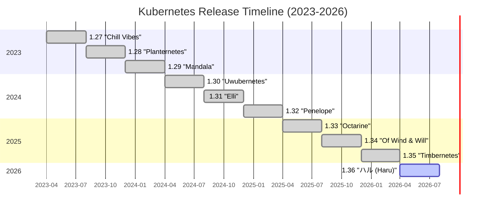
```mermaid
gantt
    title Kubernetes Release Timeline (2023-2026)
    dateFormat  YYYY-MM
    axisFormat  %Y-%m

    section 2023
    1.27 "Chill Vibes"        :done, v127, 2023-04, 2023-08
    1.28 "Planternetes"       :done, v128, 2023-08, 2023-12
    1.29 "Mandala"            :done, v129, 2023-12, 2024-04

    section 2024
    1.30 "Uwubernetes"        :done, v130, 2024-04, 2024-08
    1.31 "Elli"               :done, v131, 2024-08, 2024-12
    1.32 "Penelope"           :done, v132, 2024-12, 2025-04

    section 2025
    1.33 "Octarine"           :done, v133, 2025-04, 2025-08
    1.34 "Of Wind & Will"     :done, v134, 2025-08, 2025-12
    1.35 "Timbernetes"        :done, v135, 2025-12, 2026-04

    section 2026
    1.36 "ハル (Haru)"         :active, v136, 2026-04, 2026-08
```

### Typical Release Timeline

各 release は、約 15 週間にわたる構造化された timeline に従います。

| Phase | Duration | Description |
|-------|----------|-------------|
| **Enhancements Freeze** | Week 0 | すべての feature に承認済み KEP (Kubernetes Enhancement Proposals) が必要 |
| **Code Freeze** | ~Week 10 | 新規 feature code は不可。bug fix と test に集中 |
| **Beta Release** | ~Week 11 | testing 用の pre-release |
| **RC (Release Candidate)** | ~Week 13 | 最終 testing phase |
| **General Availability** | ~Week 15 | 公式 release |

### Feature Maturity Model

Kubernetes はすべての feature に対して 3 段階の graduation model を使用します。production planning では、これらの stage を理解することが重要です。

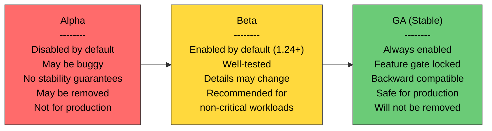
```mermaid
flowchart LR
    Alpha["Alpha
    --------
    Disabled by default
    May be buggy
    No stability guarantees
    May be removed
    Not for production"]
    -->
    Beta["Beta
    --------
    Enabled by default (1.24+)
    Well-tested
    Details may change
    Recommended for
    non-critical workloads"]
    -->
    GA["GA (Stable)
    --------
    Always enabled
    Feature gate locked
    Backward compatible
    Safe for production
    Will not be removed"]

    style Alpha fill:#ff6b6b,stroke:#333,color:black
    style Beta fill:#ffd93d,stroke:#333,color:black
    style GA fill:#6bcb77,stroke:#333,color:black
```

**把握しておくべき重要な policy 変更:**

- **Kubernetes 1.24 以降**: Beta API は新規 cluster で default enabled ではなくなりました。新しい beta feature は feature gate による明示的な opt-in が必要です。
- **Kubernetes 1.28 以降**: GA feature の feature gate は 2 release 後に削除されます。つまり、その feature は恒久的に enabled になります。

### Feature Gates

Feature gate は、feature を enabled または disabled にするかを制御する key-value pair です。alpha/beta/GA maturity model を適用する mechanism です。

```yaml
# Example: Enabling feature gates on the kubelet
apiVersion: kubelet.config.k8s.io/v1beta1
kind: KubeletConfiguration
featureGates:
  InPlacePodVerticalScaling: true    # Enable in-place pod resize (beta in 1.33)
  UserNamespacesSupport: true         # Enable user namespaces (beta in 1.33)
```

```yaml
# Example: Enabling feature gates on the API server (EKS managed - informational only)
# Note: In EKS, control plane feature gates are managed by AWS.
# You cannot directly modify API server flags on EKS.
apiVersion: kubeadm.k8s.io/v1beta3
kind: ClusterConfiguration
apiServer:
  extraArgs:
    feature-gates: "ValidatingAdmissionPolicy=true,StructuredAuthorizationConfiguration=true"
```

**cluster で enabled になっている feature gate の確認:**

```bash
# List all feature gates and their status on a node's kubelet
kubectl get --raw /api/v1/nodes/<node-name>/proxy/configz | jq '.kubeletconfig.featureGates'

# Check API server feature gates (requires API server access logs)
kubectl get --raw /metrics | grep kubernetes_feature_enabled

# Check specific feature gate status
kubectl get --raw /metrics | grep 'kubernetes_feature_enabled{name="InPlacePodVerticalScaling"}'
```

### SIG Governance Structure

Kubernetes development は Special Interest Groups (SIGs) によって編成されています。どの SIG が feature を所有しているかを理解すると、進捗を追跡し、関連 documentation を見つけやすくなります。

| SIG | Scope | Key Features in This Document |
|-----|-------|-------------------------------|
| **SIG Node** | Kubelet, container runtime, pod lifecycle | Sidecar Containers, In-Place Pod Resize, User Namespaces |
| **SIG Auth** | Authentication, authorization, security policy | StructuredAuthorizationConfiguration, CEL Admission |
| **SIG Network** | Networking, Service, Ingress, DNS | Gateway API, ServiceCIDR/IPAddress, Topology Aware Routing |
| **SIG Storage** | PV/PVC, CSI, volume management | VolumeAttributesClass, ReadWriteOncePod |
| **SIG Scheduling** | Scheduler, Pod Scheduling Readiness | Pod Scheduling Readiness, Gang Scheduling |
| **SIG Apps** | Workload controllers (Deployment, StatefulSet, Job) | Job Success Policy, Sidecar Containers |
| **SIG API Machinery** | API server, CRDs, admission control | CEL Admission, KYAML |
| **SIG Autoscaling** | HPA, VPA, cluster autoscaling | HPA Container Resource Metrics |

---

## 3. EKS Version Support Matrix

### Support Tiers

Amazon EKS は 2 つの version support tier を提供します。

| Tier | Duration | Pricing | Description |
|------|----------|---------|-------------|
| **Standard Support** | EKS release から 14 か月 | $0.10/cluster/hour | 完全な feature support、security patch、bug fix |
| **Extended Support** | 追加 12 か月 | $0.60/cluster/hour | security patch と critical bug fix のみ |

> **Cost Impact**: Extended support は standard support の 6 倍の費用です。単一 cluster を 24/7 で稼働させる場合、extended support は年間約 $4,380、standard support は年間約 $730 となり、cluster あたり年間 $3,650 の追加費用になります。

### Version Lifecycle Diagram

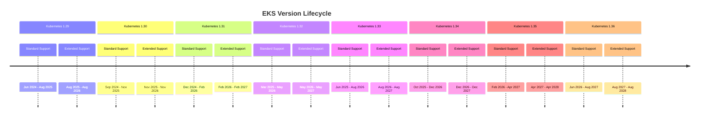
```mermaid
timeline
    title EKS Version Lifecycle
    section Kubernetes 1.29
        Standard Support : Jun 2024 - Aug 2025
        Extended Support : Aug 2025 - Aug 2026
    section Kubernetes 1.30
        Standard Support : Sep 2024 - Nov 2025
        Extended Support : Nov 2025 - Nov 2026
    section Kubernetes 1.31
        Standard Support : Dec 2024 - Feb 2026
        Extended Support : Feb 2026 - Feb 2027
    section Kubernetes 1.32
        Standard Support : Mar 2025 - May 2026
        Extended Support : May 2026 - May 2027
    section Kubernetes 1.33
        Standard Support : Jun 2025 - Aug 2026
        Extended Support : Aug 2026 - Aug 2027
    section Kubernetes 1.34
        Standard Support : Oct 2025 - Dec 2026
        Extended Support : Dec 2026 - Dec 2027
    section Kubernetes 1.35
        Standard Support : Feb 2026 - Apr 2027
        Extended Support : Apr 2027 - Apr 2028
    section Kubernetes 1.36
        Standard Support : Jun 2026 - Aug 2027
        Extended Support : Aug 2027 - Aug 2028
```

### Detailed Version Support Matrix

以下の table は、upstream release date、EKS availability、support end date を含む、EKS が support する各 Kubernetes version を追跡します。

| K8s Version | Code Name | Upstream Release | EKS Release | Standard Support End | Extended Support End | Current Status |
|-------------|-----------|-----------------|-------------|---------------------|---------------------|----------------|
| **1.29** | Mandala | Dec 2023 | Jun 2024 | Aug 2025 | Aug 2026 | Extended Support |
| **1.30** | Uwubernetes | Apr 2024 | Sep 2024 | Nov 2025 | Nov 2026 | Extended Support |
| **1.31** | Elli | Aug 2024 | Dec 2024 | Feb 2026 | Feb 2027 | Extended Support |
| **1.32** | Penelope | Dec 2024 | Mar 2025 | May 2026 | May 2027 | Standard Support |
| **1.33** | Octarine | Apr 2025 | Jun 2025 | Aug 2026 | Aug 2027 | Standard Support |
| **1.34** | Of Wind & Will | Aug 2025 | Oct 2025 | Dec 2026 | Dec 2027 | Standard Support |
| **1.35** | Timbernetes | Dec 2025 | Feb 2026 | Apr 2027 | Apr 2028 | Standard Support |
| **1.36** | ハル (Haru) | Apr 2026 | Jun 2026 | Aug 2027 | Aug 2028 | Standard Support |

> **Note**: EKS release date は通常、upstream Kubernetes release から 2〜4 か月遅れます。AWS はこの期間を使って release を検証し、EKS-managed add-ons と統合し、AWS services との compatibility を確認します。

### Auto-Upgrade Behavior

Kubernetes version が support end（extended support を含む）に到達すると、EKS は cluster を自動的に upgrade します。

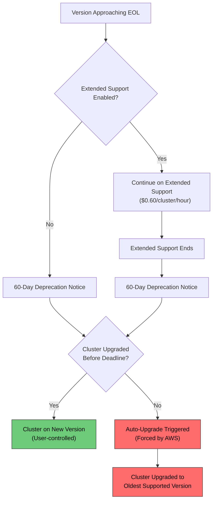
```mermaid
flowchart TD
    A["Version Approaching EOL"] --> B{"Extended Support Enabled?"}
    B -->|Yes| C["Continue on Extended Support
    ($0.60/cluster/hour)"]
    B -->|No| D["60-Day Deprecation Notice"]
    C --> E["Extended Support Ends"]
    E --> F["60-Day Deprecation Notice"]
    D --> G{"Cluster Upgraded
    Before Deadline?"}
    F --> G
    G -->|Yes| H["Cluster on New Version
    (User-controlled)"]
    G -->|No| I["Auto-Upgrade Triggered
    (Forced by AWS)"]
    I --> J["Cluster Upgraded to
    Oldest Supported Version"]

    style I fill:#ff6b6b,stroke:#333,color:black
    style J fill:#ff6b6b,stroke:#333,color:black
    style H fill:#6bcb77,stroke:#333,color:black
```

**Important**: Auto-upgrade は control plane のみを update します。node group、add-on、self-managed component は引き続き手動で upgrade する必要があります。対応する node と add-on の upgrade なしに control plane が強制 upgrade されると、workload disruption が発生する可能性があります。

### Recent EKS Version Support Announcements (2026)

AWS は 2026 年に、EKS version support に影響する複数の announcement を行いました。

| Date | Announcement | Highlights |
|:---:|------|------|
| 2026-06-02 | EKS & EKS Distro begin supporting Kubernetes 1.36 | User Namespaces GA, Mutating Admission Policies, In-Place Pod Vertical Scaling, Resource Health Status, EKS Cluster Insights pre-upgrade checks |
| 2026-01-28 | EKS & EKS Distro begin supporting Kubernetes 1.35 | In-Place Pod Resource Updates, PreferSameNode Traffic Distribution, Node Topology Labels via Downward API, Image Volumes |

#### Kubernetes 1.36 Support (June 2, 2026)

Amazon EKS と EKS Distro は Kubernetes 1.36 の support を開始しました。この announcement では以下が強調されています（implementation detail は下の section 4.8 を参照）。

- **User Namespaces (GA)**: container の root user を host の non-privileged user に map し、multi-tenant isolation を強化
- **Mutating Admission Policies**: webhook server 不要の CEL-based mutation
- **In-Place Pod Vertical Scaling**: pod を restart せずに CPU/memory を調整
- **Resource Health Status**: Pod status に device health と hardware failure condition を表示
- **EKS Cluster Insights**: deprecated API usage と add-on compatibility の pre-upgrade check

> Source: [Amazon EKS Distro now supports Kubernetes version 1.36](https://aws.amazon.com/about-aws/whats-new/2026/06/amazon-eks-distro-kubernetes-version-1-36/)

#### Kubernetes 1.35 Support (January 28, 2026)

Amazon EKS と EKS Distro は Kubernetes 1.35 の support を開始し、以下を追加しました。

- **In-Place Pod Resource Updates** -- section 4.7 で In-Place Pod Vertical Scaling GA として扱う、restart-free resource adjustment と同じ capability
- **PreferSameNode Traffic Distribution** -- same node 上の endpoint へ traffic を route することを優先
- **Node Topology Labels via Downward API** -- node topology label を pod に公開
- **Image Volumes** -- OCI image を volume として mount し、data や ML model を配布

> Source: [Amazon EKS Distro now supports Kubernetes version 1.35](https://aws.amazon.com/about-aws/whats-new/2026/01/amazon-eks-distro-kubernetes-version-1-35)

> **Related announcements**: EKS version rollback support (July 1, 2026) と新しい control plane 99.99% SLA / 8XL scaling tier (March 20, 2026) は、Kubernetes version feature ではなく upgrade process に直接関係するため、[EKS Upgrades](08-eks-upgrades.md) document で扱います。

---

## 4. Version-by-Version Feature Guide

この section では、Kubernetes 1.29 から 1.36 までの各 version で導入、graduated、deprecated された feature を詳細に説明します。

### 4.1 Kubernetes 1.29 "Mandala" (December 2023)

**Theme**: 宇宙を象徴する幾何学的 art form にちなんだ名称で、この release に対する community の holistic approach を反映しています。

**Release Stats**: 49 enhancements -- 11 Stable, 19 Beta, 19 Alpha

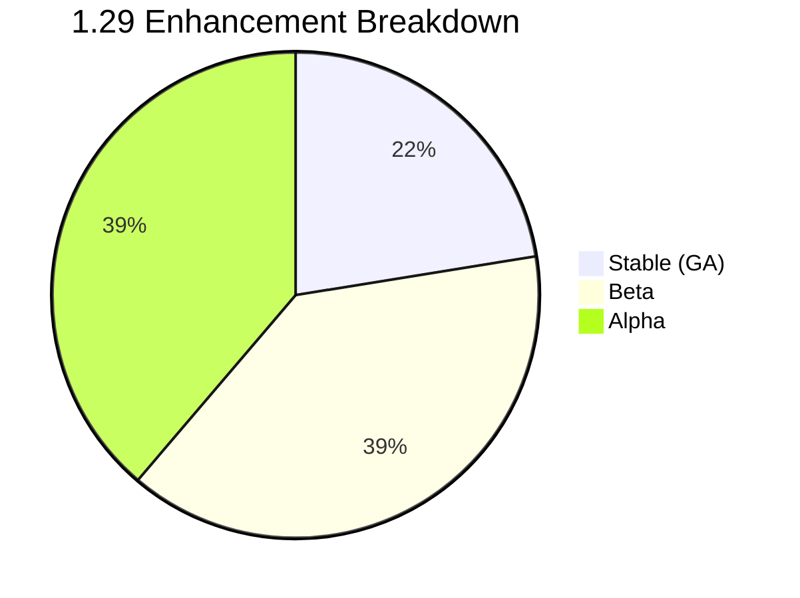
```mermaid
pie title 1.29 Enhancement Breakdown
    "Stable (GA)" : 11
    "Beta" : 19
    "Alpha" : 19
```

#### Key Graduated Features (GA)

**KMS v2 Encryption**

Kubernetes Secrets の at-rest encryption 向け KMS v2 が GA に到達し、KMS v1 と比べて大幅な performance improvement を提供します。

| Aspect | KMS v1 | KMS v2 |
|--------|--------|--------|
| Encryption calls per write | object ごとに 1 回 | DEK rotation ごとに 1 回 |
| Performance | scale 時に high latency | ほぼ constant latency |
| Key hierarchy | single layer | two-layer (KEK + DEK) |
| Status | 1.28 で deprecated | 1.29 で GA |

```yaml
# KMS v2 EncryptionConfiguration
apiVersion: apiserver.config.k8s.io/v1
kind: EncryptionConfiguration
resources:
  - resources:
      - secrets
    providers:
      - kms:
          apiVersion: v2
          name: aws-encryption-provider
          endpoint: unix:///var/run/kmsplugin/socket.sock
          timeout: 3s
      - identity: {}
```

**ReadWriteOncePod PV Access Mode**

`ReadWriteOncePod` (RWOP) access mode が GA に昇格しました。これにより、PersistentVolume は cluster 全体で単一の Pod からのみ read-write として mount できるようになり、`ReadWriteOnce`（同じ node 上の複数 pod を許可）より強い data safety guarantee を提供します。

```yaml
apiVersion: v1
kind: PersistentVolumeClaim
metadata:
  name: database-pvc
spec:
  accessModes:
    - ReadWriteOncePod    # Only one pod can mount this volume
  storageClassName: gp3
  resources:
    requests:
      storage: 100Gi
```

**Other GA Features in 1.29**:
- credential を使った CSI volume expansion 用の `NodeExpandSecret`
- kubelet-level distributed tracing 用の `KubeletTracing`
- `ReadWriteOncePod` PersistentVolume access mode
- topology spread constraint 用の `MinDomainsInPodTopologySpread`

#### Key Beta Features

**nftables-based kube-proxy (Alpha)**

iptables の代わりに nftables を使用する新しい kube-proxy backend が alpha として導入されました。nftables は、特に数千の Services を持つ cluster で iptables より優れた performance と scalability を提供するため重要です。

```bash
# Check current kube-proxy mode
kubectl get configmap kube-proxy-config -n kube-system -o yaml | grep mode

# nftables mode (alpha in 1.29 - requires feature gate)
# mode: nftables
```

| Proxy Mode | Maturity in 1.29 | Rule Complexity | Performance at Scale |
|-----------|-------------------|-----------------|---------------------|
| iptables | Stable (default) | packet ごとに O(n) | >5000 services で低下 |
| IPVS | Stable | O(1) lookup | scale 時に良好 |
| nftables | Alpha | O(1) lookup | scale 時に非常に良好 |

**Load Balancer IP Mode**

`LoadBalancerIPMode` feature (beta) により、type LoadBalancer の Services が load balancer IP の扱いを指定できるようになり、cloud provider implementation との compatibility が向上します。

#### Key Alpha Features

- **SidecarContainers** (`restartPolicy: Always` を持つ initContainer) -- その旅を始めた landmark feature
- **PodLifecycleSleepAction** -- pod lifecycle hook に `sleep` action を追加
- **Unknown Version Interoperability Proxy** -- unknown API version への request を proxy

#### Deprecations in 1.29

- `flowcontrol.apiserver.k8s.io/v1beta2` deprecated (1.32 で removed)
- `SecurityContextDeny` admission plugin deprecated
- In-tree cloud provider integration は deprecation path を継続

---

### 4.2 Kubernetes 1.30 "Uwubernetes" (April 2024)

**Theme**: Kubernetes community の welcoming な性質を体現する、community が選んだ playful な名称です。

**Release Stats**: 45 enhancements -- 17 Stable, 18 Beta, 10 Alpha

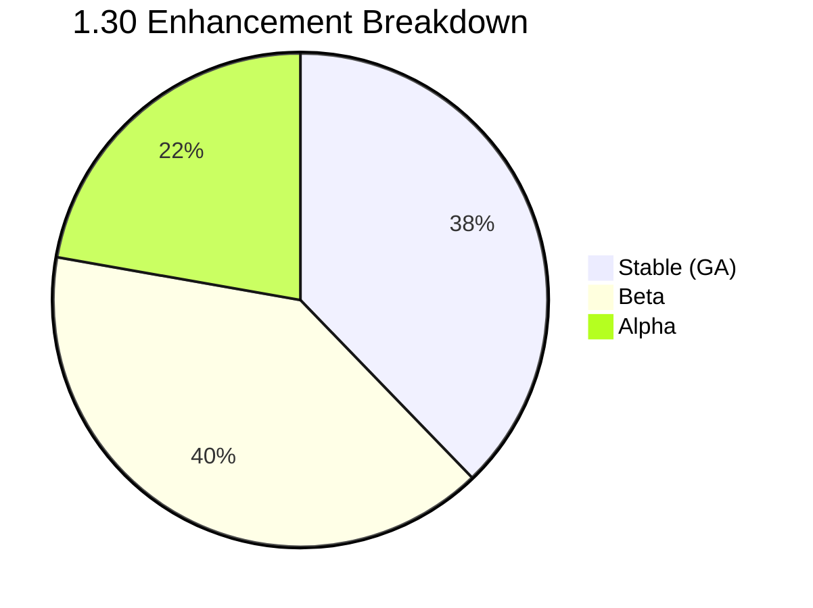
```mermaid
pie title 1.30 Enhancement Breakdown
    "Stable (GA)" : 17
    "Beta" : 18
    "Alpha" : 10
```

#### Key Graduated Features (GA)

**ValidatingAdmissionPolicy with CEL (GA)**

最も重要な graduating feature の 1 つである ValidatingAdmissionPolicy は、Common Expression Language (CEL) を使った native admission control を可能にし、多くの use case で webhook-based admission controller を不要にします。

| Aspect | Admission Webhooks | ValidatingAdmissionPolicy (CEL) |
|--------|-------------------|-------------------------------|
| Latency | network round-trip | in-process evaluation |
| Availability risk | webhook server failure = blocked requests | external dependency なし |
| Language | Any (Go, Python, etc.) | CEL |
| Complexity | 高い (deploy, maintain, scale) | 低い (single YAML resource) |
| Feature journey | N/A | Alpha 1.26 -> Beta 1.28 -> GA 1.30 |

```yaml
# ValidatingAdmissionPolicy: Require resource limits on all containers
apiVersion: admissionregistration.k8s.io/v1
kind: ValidatingAdmissionPolicy
metadata:
  name: require-resource-limits
spec:
  failurePolicy: Fail
  matchConstraints:
    resourceRules:
      - apiGroups: [""]
        apiVersions: ["v1"]
        operations: ["CREATE", "UPDATE"]
        resources: ["pods"]
  validations:
    - expression: >-
        object.spec.containers.all(c,
          has(c.resources) &&
          has(c.resources.limits) &&
          has(c.resources.limits.memory) &&
          has(c.resources.limits.cpu)
        )
      message: "All containers must have CPU and memory limits set"
      reason: Invalid
---
apiVersion: admissionregistration.k8s.io/v1
kind: ValidatingAdmissionPolicyBinding
metadata:
  name: require-resource-limits-binding
spec:
  policyName: require-resource-limits
  validationActions:
    - Deny
  matchResources:
    namespaceSelector:
      matchLabels:
        enforce-limits: "true"
```

```yaml
# CEL: Enforce image registry policy
apiVersion: admissionregistration.k8s.io/v1
kind: ValidatingAdmissionPolicy
metadata:
  name: restrict-image-registries
spec:
  failurePolicy: Fail
  matchConstraints:
    resourceRules:
      - apiGroups: [""]
        apiVersions: ["v1"]
        operations: ["CREATE", "UPDATE"]
        resources: ["pods"]
  validations:
    - expression: >-
        object.spec.containers.all(c,
          c.image.startsWith('123456789012.dkr.ecr.') ||
          c.image.startsWith('public.ecr.aws/')
        )
      message: "Images must come from approved ECR registries"
    - expression: >-
        object.spec.initContainers.all(c,
          c.image.startsWith('123456789012.dkr.ecr.') ||
          c.image.startsWith('public.ecr.aws/')
        )
      message: "Init container images must come from approved ECR registries"
```

**Pod Scheduling Readiness (GA)**

Pod Scheduling Readiness により、特定条件が満たされるまで pod を作成しても scheduling されないようにできます。これにより pod creation と scheduling が分離され、batch scheduling や resource provisioning のような advanced workflow が可能になります。

```yaml
# Pod with scheduling gates
apiVersion: v1
kind: Pod
metadata:
  name: ml-training-job
spec:
  schedulingGates:
    - name: "example.com/gpu-provisioned"      # Gate 1: Wait for GPU node
    - name: "example.com/dataset-downloaded"    # Gate 2: Wait for data
  containers:
    - name: trainer
      image: ml-training:v2
      resources:
        limits:
          nvidia.com/gpu: 4
```

```bash
# Remove a scheduling gate when the condition is met
kubectl patch pod ml-training-job --type='json' -p='[
  {"op": "remove", "path": "/spec/schedulingGates/0"}
]'

# Check remaining scheduling gates
kubectl get pod ml-training-job -o jsonpath='{.spec.schedulingGates}'
```

**HPA ContainerResource Metrics (GA)**

HPA は total pod metrics ではなく個々の container metrics に基づいて scale できるようになりました。これは、main container の resource usage が scaling を駆動すべきで、sidecar を含む合計ではない sidecar pattern で重要です。

```yaml
apiVersion: autoscaling/v2
kind: HorizontalPodAutoscaler
metadata:
  name: web-app-hpa
spec:
  scaleTargetRef:
    apiVersion: apps/v1
    kind: Deployment
    name: web-app
  minReplicas: 2
  maxReplicas: 50
  metrics:
    - type: ContainerResource
      containerResource:
        name: cpu
        container: app              # Scale based only on the 'app' container
        target:
          type: Utilization
          averageUtilization: 70
    - type: ContainerResource
      containerResource:
        name: memory
        container: app              # Ignore sidecar memory usage
        target:
          type: Utilization
          averageUtilization: 80
```

**Other GA Features in 1.30**:
- `MinDomainsInPodTopologySpread` -- topology spread の minimum domain count
- `NodeLogQuery` -- kubelet API 経由で node-level logs を query
- `PodDisruptionConditions` -- Pod status に disruption-related condition を追加
- `StableLoadBalancerNodeSet` -- load balancer health check 用の stable set of nodes

#### Key Beta Features

**Contextual Logging (Beta, Enabled by Default)**

Contextual logging は、pod name、namespace、component などの structured context をすべての Kubernetes log message に追加し、log analysis と correlation を大幅に容易にします。

```bash
# Before contextual logging
I0415 12:00:00.000000       1 controller.go:100] "Reconciling object" name="my-pod"

# With contextual logging (additional context automatically added)
I0415 12:00:00.000000       1 controller.go:100] "Reconciling object" logger="pod-controller" pod="default/my-pod" node="ip-10-0-1-100"
```

**Recursive Read-Only Mounts (Beta)**

volume mount tree 全体を recursive に read-only にでき、read-only mount path 内の writable sub-mount を防ぎます。

#### Key Alpha Features

- **UserNamespacesSupport** -- security isolation 向上のための pod-level user namespaces
- **RelaxedEnvironmentVariableValidation** -- env var value で従来 invalid だった文字を許可
- **SELinuxMountReadWriteOncePod** -- RWOP volume 向け SELinux label support

---

### 4.3 Kubernetes 1.31 "Elli" (August 2024)

**Theme**: Kubernetes contributor の犬にちなんだ名称で、community の personal touch を反映しています。

**Release Stats**: 45 enhancements -- 11 Stable, 22 Beta, 12 Alpha

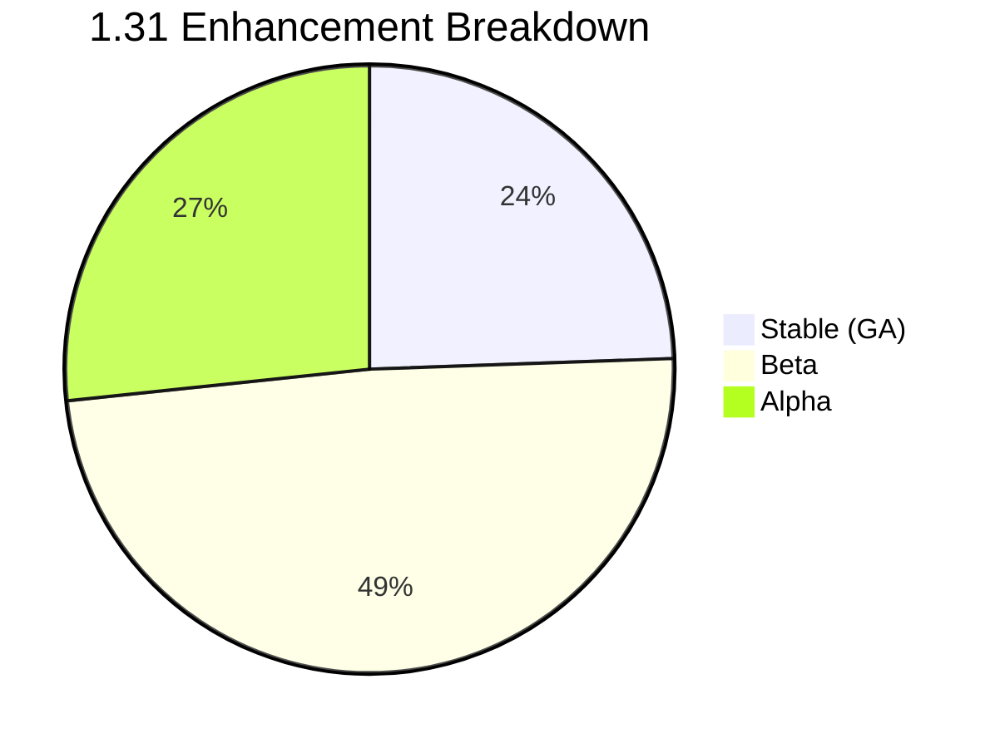
```mermaid
pie title 1.31 Enhancement Breakdown
    "Stable (GA)" : 11
    "Beta" : 22
    "Alpha" : 12
```

#### Key Graduated Features (GA)

**AppArmor Support (GA)**

Kubernetes の native AppArmor support が GA に昇格し、従来の annotation-based approach を適切な API field に置き換えました。

```yaml
# Old approach (deprecated annotations)
# metadata:
#   annotations:
#     container.apparmor.security.beta.kubernetes.io/app: localhost/my-profile

# New GA approach: native API field
apiVersion: v1
kind: Pod
metadata:
  name: secure-app
spec:
  containers:
    - name: app
      image: myapp:latest
      securityContext:
        appArmorProfile:
          type: Localhost
          localhostProfile: my-custom-profile
```

```yaml
# AppArmor with RuntimeDefault profile
apiVersion: apps/v1
kind: Deployment
metadata:
  name: web-server
spec:
  template:
    spec:
      containers:
        - name: nginx
          image: nginx:1.27
          securityContext:
            appArmorProfile:
              type: RuntimeDefault    # Uses container runtime's default profile
```

**Persistent Volume Last Phase Transition Time (GA)**

PersistentVolumes 上の新しい `.status.lastPhaseTransitionTime` field が、PV が最後に phase（Available, Bound, Released, Failed）を変更した時刻を追跡します。これにより volume lifecycle に関する monitoring と automation が向上します。

```bash
# Check PV phase transition times
kubectl get pv -o custom-columns=\
NAME:.metadata.name,\
PHASE:.status.phase,\
LAST_TRANSITION:.status.lastPhaseTransitionTime

# Example output:
# NAME         PHASE     LAST_TRANSITION
# pv-data-01   Bound     2025-01-15T10:30:00Z
# pv-data-02   Released  2025-01-14T22:15:00Z
```

**Other GA Features in 1.31**:
- `PodDisruptionConditions` -- disruption cause information で強化された Pod status
- `JobPodReplacementPolicy` -- Jobs で failed pod をいつ置き換えるかを制御
- `PodHostIPs` -- downward API 経由で全 host IP（IPv4 と IPv6）を pod に公開

#### Key Beta Features

**DRA Structured Parameters (Beta)**

Dynamic Resource Allocation (DRA) structured parameters が beta に移行し、device plugin が standardized API を通じて hardware capability を advertise できるようになりました。これは GPU、FPGA、その他 accelerator scheduling の基盤です。

```yaml
# ResourceClaim for GPU allocation using DRA
apiVersion: resource.k8s.io/v1beta1
kind: ResourceClaim
metadata:
  name: gpu-claim
spec:
  devices:
    requests:
      - name: gpu
        deviceClassName: gpu.nvidia.com
        selectors:
          - cel:
              expression: >-
                device.attributes["gpu.nvidia.com"].model == "A100" &&
                device.capacity["gpu.nvidia.com"].memory.compareTo(quantity("80Gi")) >= 0
```

**Sidecar Containers (Beta)**

sidecar containers feature は beta に進みました（1.29 で alpha、1.31 で default enabled）。`restartPolicy: Always` を持つ init containers は true sidecars として機能し、以下を実現します。
- regular containers より前に start
- main workload と並行して run
- pod shutdown 時に最後に terminated

```yaml
apiVersion: v1
kind: Pod
metadata:
  name: app-with-sidecar
spec:
  initContainers:
    - name: log-shipper
      image: fluent-bit:latest
      restartPolicy: Always       # This makes it a sidecar
      volumeMounts:
        - name: log-volume
          mountPath: /var/log/app
  containers:
    - name: app
      image: myapp:latest
      volumeMounts:
        - name: log-volume
          mountPath: /var/log/app
  volumes:
    - name: log-volume
      emptyDir: {}
```

**Traffic Distribution for Services (Beta)**

Services 上の新しい `spec.trafficDistribution` field により、same-zone endpoint を優先するなどの traffic routing preference を要求できます。

```yaml
apiVersion: v1
kind: Service
metadata:
  name: my-service
spec:
  trafficDistribution: PreferClose    # Route traffic to closest endpoints
  selector:
    app: my-app
  ports:
    - port: 80
      targetPort: 8080
```

**Other Beta Features in 1.31**:
- `PodLifecycleSleepAction` -- PreStop/PostStart hook の `sleep` action
- `RelaxedDNSSearchValidation` -- DNS search path validation の緩和
- `VolumeAttributesClass` -- CSI 経由の mutable volume attributes

#### Key Alpha Features

- **PortForwardWebsockets** -- WebSocket-based port forwarding
- **ImageVolume** -- OCI image を read-only volume として mount
- **DRAPartitionableDevices** -- DRA device の partitioning support

---

### 4.4 Kubernetes 1.32 "Penelope" (December 2024)

**Theme**: Homer の Odyssey に登場する忠実な人物 Penelope にちなんだ名称で、project の揺るぎない reliability を象徴しています。

**Release Stats**: 44 enhancements -- 13 Stable, 12 Beta, 19 Alpha

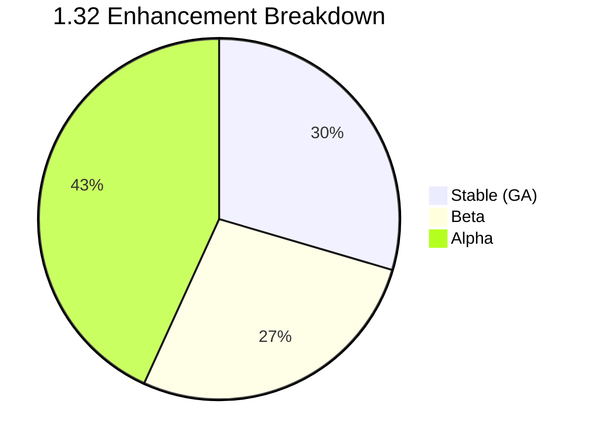
```mermaid
pie title 1.32 Enhancement Breakdown
    "Stable (GA)" : 13
    "Beta" : 12
    "Alpha" : 19
```

#### Key Graduated Features (GA)

**StructuredAuthorizationConfiguration (GA)**

authorization module（Node, RBAC, Webhook, CEL）の ordered chain を structured configuration で定義できる major security feature です。legacy `--authorization-mode` flag approach を置き換えます。

```yaml
# StructuredAuthorizationConfiguration
# (Managed by AWS for EKS control plane; shown for reference)
apiVersion: apiserver.config.k8s.io/v1beta1
kind: AuthorizationConfiguration
authorizers:
  - type: Node
    name: node
  - type: RBAC
    name: rbac
  - type: Webhook
    name: custom-authz
    webhook:
      timeout: 3s
      subjectAccessReviewVersion: v1
      matchConditionSubjectAccessReviewVersion: v1
      failurePolicy: Deny
      connectionInfo:
        type: KubeConfigFile
        kubeConfigFile: /etc/kubernetes/authz-webhook.kubeconfig
      matchConditions:
        - expression: >-
            request.resourceAttributes.namespace == "production"
```

これにより以下が可能になります。
- **Ordered evaluation**: Authorization request を chain に沿って順番に評価
- **CEL-based filtering**: CEL expression を使って各 authorizer に関連する request のみを match
- **Granular webhook routing**: 特定の request のみを external authorization webhook に送信
- **Feature journey**: Alpha 1.29 -> Beta 1.30 -> GA 1.32

**Auto-Remove PVC Protection Finalizer (GA)**

PersistentVolumeClaim protection finalizer は、PVC が使用されなくなると自動的に clean up されるようになりました。これにより、protection finalizer が削除されなかったために削除できない orphaned PVC という一般的な問題が解消されます。

```bash
# Before 1.32: Common issue - stuck PVC deletion
$ kubectl delete pvc my-pvc
persistentvolumeclaim "my-pvc" deleted  # ... hangs forever

$ kubectl get pvc my-pvc -o jsonpath='{.metadata.finalizers}'
["kubernetes.io/pvc-protection"]  # Finalizer not removed

# After 1.32 (GA): Automatic cleanup
$ kubectl delete pvc my-pvc
persistentvolumeclaim "my-pvc" deleted  # Completes immediately when no pod references it
```

**Other GA Features in 1.32**:
- `CustomResourceFieldSelectors` -- CRD 用 field selector
- `RetryGenerateName` -- conflict 時に新しい generated name で自動 retry
- `SizeMemoryBackedVolumes` -- memory-backed emptyDir volume の size limit を enforce
- `StableLoadBalancerNodeSet` -- LB health checking 用の consistent node set
- `ServiceAccountTokenJTI` -- audit tracking 用の SA token 内 unique JTI
- `ServiceAccountTokenNodeBindingValidation` -- SA token を node に bind

#### Key Beta Features

**User Namespaces (Beta)**

User namespaces は、container 内の UID/GID を remap することで強力な security boundary を提供します。process が container 内で root として実行されていても、host 上では unprivileged user に map されます。

```yaml
apiVersion: v1
kind: Pod
metadata:
  name: secure-pod
spec:
  hostUsers: false              # Enable user namespace remapping
  containers:
    - name: app
      image: myapp:latest
      securityContext:
        runAsUser: 0            # Root inside container
        # Maps to unprivileged UID on host (e.g., UID 65534+offset)
```

**VolumeAttributesClass (Beta)**

VolumeAttributesClass により、provisioning 後に volume を再作成せずに volume attributes（IOPS、throughput など）を変更できます。

```yaml
apiVersion: storage.k8s.io/v1beta1
kind: VolumeAttributesClass
metadata:
  name: high-performance
driverName: ebs.csi.aws.com
parameters:
  iops: "10000"
  throughput: "500"
---
apiVersion: v1
kind: PersistentVolumeClaim
metadata:
  name: database-volume
spec:
  accessModes:
    - ReadWriteOnce
  resources:
    requests:
      storage: 500Gi
  storageClassName: gp3
  volumeAttributesClassName: high-performance    # Apply performance attributes
```

```yaml
# Modify volume attributes by changing the class reference
# (triggers a CSI ModifyVolume call)
apiVersion: v1
kind: PersistentVolumeClaim
metadata:
  name: database-volume
spec:
  volumeAttributesClassName: ultra-performance   # Switch to higher tier
```

**nftables kube-proxy (Beta)**

kube-proxy の nftables backend が beta に進み、Service routing 向けの production-ready nftables support をもたらします。

#### Key Alpha Features

- **DynamicResourceAllocation (DRA) Core** -- GPU/accelerator scheduling の包括的 framework
- **MultiCIDRServiceAllocator** -- 複数の CIDR range から Service IP を allocate
- **RelaxedEnvironmentVariableValidation** -- env var で使用可能な character set を拡張
- **InPlacePodVerticalScalingExtendedStatus** -- pod resizing の extended status reporting

---

### 4.5 Kubernetes 1.33 "Octarine" (April 2025)

**Theme**: Terry Pratchett の Discworld series に登場する、wizard にしか見えない eighth color にちなんだ名称です。magical features が詰まった release にふさわしい名前です。

**Release Stats**: 64 enhancements -- 18 Stable, 20 Beta, 24 Alpha (この範囲で最大の release)

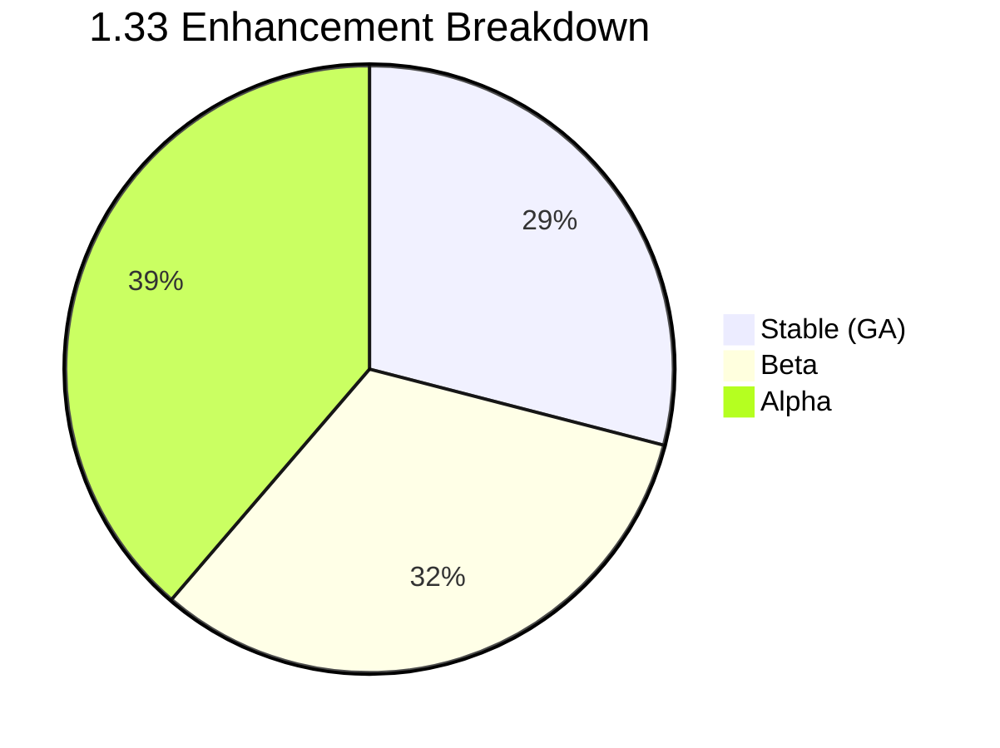
```mermaid
pie title 1.33 Enhancement Breakdown
    "Stable (GA)" : 18
    "Beta" : 20
    "Alpha" : 24
```

#### Key Graduated Features (GA)

**Sidecar Containers (GA)**

この release で最も期待された GA graduation です。`restartPolicy: Always` を持つ init containers として実装される native sidecar containers は、複数 version にわたる journey を経て full stability に到達しました。

| Version | Status | Behavior |
|---------|--------|----------|
| 1.28 | Alpha | Feature gate `SidecarContainers` required |
| 1.29 | Alpha | Bug fixes, stability improvements |
| 1.31 | Beta | Enabled by default |
| 1.33 | **GA** | Permanently enabled, feature gate removed |

```yaml
# Production-ready sidecar pattern (GA in 1.33)
apiVersion: apps/v1
kind: Deployment
metadata:
  name: microservice
spec:
  replicas: 3
  selector:
    matchLabels:
      app: microservice
  template:
    metadata:
      labels:
        app: microservice
    spec:
      initContainers:
        # Sidecar 1: Service mesh proxy
        - name: envoy-proxy
          image: envoyproxy/envoy:v1.31
          restartPolicy: Always
          ports:
            - containerPort: 15001
          resources:
            requests:
              cpu: 100m
              memory: 128Mi
            limits:
              cpu: 500m
              memory: 256Mi

        # Sidecar 2: Log collection
        - name: fluent-bit
          image: fluent/fluent-bit:3.2
          restartPolicy: Always
          volumeMounts:
            - name: app-logs
              mountPath: /var/log/app
          resources:
            requests:
              cpu: 50m
              memory: 64Mi

        # Regular init container (runs to completion first)
        - name: db-migration
          image: myapp-migrations:latest
          command: ["./migrate", "--target", "latest"]

      containers:
        - name: app
          image: myapp:v3.2
          ports:
            - containerPort: 8080
          volumeMounts:
            - name: app-logs
              mountPath: /var/log/app

      volumes:
        - name: app-logs
          emptyDir: {}
```

**Sidecar container lifecycle guarantees:**

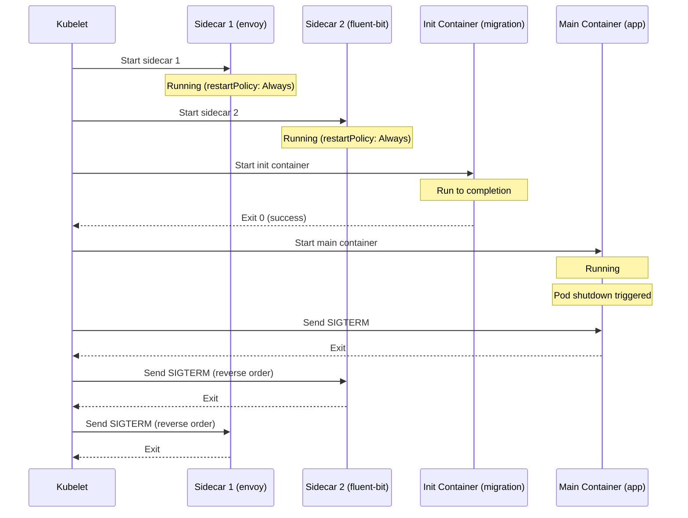
```mermaid
sequenceDiagram
    participant K as Kubelet
    participant S1 as Sidecar 1 (envoy)
    participant S2 as Sidecar 2 (fluent-bit)
    participant I as Init Container (migration)
    participant M as Main Container (app)

    K->>S1: Start sidecar 1
    Note over S1: Running (restartPolicy: Always)
    K->>S2: Start sidecar 2
    Note over S2: Running (restartPolicy: Always)
    K->>I: Start init container
    Note over I: Run to completion
    I-->>K: Exit 0 (success)
    K->>M: Start main container
    Note over M: Running

    Note over M: Pod shutdown triggered
    K->>M: Send SIGTERM
    M-->>K: Exit
    K->>S2: Send SIGTERM (reverse order)
    S2-->>K: Exit
    K->>S1: Send SIGTERM (reverse order)
    S1-->>K: Exit
```

**ServiceCIDR and IPAddress API (GA)**

ServiceCIDR and IPAddress API により、cluster restart なしで Service IP range を dynamic に管理できます。これは初期 Service CIDR を使い切る large-scale cluster で特に有用です。

```yaml
# Define additional Service CIDR ranges
apiVersion: networking.k8s.io/v1
kind: ServiceCIDR
metadata:
  name: secondary-service-range
spec:
  cidrs:
    - "10.200.0.0/16"
```

```bash
# View allocated IP addresses
kubectl get ipaddresses

# Check ServiceCIDR status
kubectl get servicecidrs
NAME                       CIDRS            AGE
kubernetes                 10.96.0.0/12     365d
secondary-service-range    10.200.0.0/16    30d
```

**Topology Aware Routing (GA)**

以前は "Topology Aware Hints" として知られていたこの feature は、"Topology Aware Routing" という名称で GA に昇格しました。同じ availability zone 内の endpoint へ Service traffic を preferential routing でき、cross-AZ data transfer cost を削減します。

```yaml
apiVersion: v1
kind: Service
metadata:
  name: my-service
  annotations:
    # Legacy hint-based approach (deprecated)
    # service.kubernetes.io/topology-aware-hints: Auto
spec:
  trafficDistribution: PreferClose    # GA approach in 1.33
  selector:
    app: my-app
  ports:
    - port: 80
      targetPort: 8080
```

> **EKS Cost Tip**: high-traffic internal services で topology-aware routing を有効化すると、AWS の same region 内で $0.01/GB の cross-AZ data transfer charge を大幅に削減できます。

**Job Success Policy (GA)**

すべての pod が完了していなくても Job を successful とみなす条件を指定できます。leader pod の success が全体の job success を決める distributed computing framework に不可欠です。

```yaml
apiVersion: batch/v1
kind: Job
metadata:
  name: distributed-training
spec:
  completionMode: Indexed
  completions: 8
  parallelism: 8
  successPolicy:
    rules:
      - succeededIndexes: "0"       # Job succeeds when index 0 (leader) succeeds
        succeededCount: 1
  template:
    spec:
      containers:
        - name: trainer
          image: pytorch-training:latest
          env:
            - name: JOB_COMPLETION_INDEX
              valueFrom:
                fieldRef:
                  fieldPath: metadata.annotations['batch.kubernetes.io/job-completion-index']
```

**Other GA Features in 1.33**:
- `PodLifecycleSleepAction` -- pod lifecycle hook の `sleep` action
- `LoadBalancerIPMode` -- LB IP が pod にどう見えるかを制御
- `JobManagedBy` -- Job object の external controller management
- `RetryGenerateName` -- generated name の automatic name collision retry

#### Key Beta Features (Enabled by Default)

**In-Place Pod Vertical Scaling (Beta)**

Kubernetes history で最も期待された feature の 1 つです。in-place pod resize により、running pod を restart せずに CPU と memory resources を変更できます。

```yaml
apiVersion: v1
kind: Pod
metadata:
  name: resizable-app
spec:
  containers:
    - name: app
      image: myapp:latest
      resources:
        requests:
          cpu: 500m
          memory: 256Mi
        limits:
          cpu: "1"
          memory: 512Mi
      resizePolicy:
        - resourceName: cpu
          restartPolicy: NotRequired    # CPU resize without restart
        - resourceName: memory
          restartPolicy: RestartContainer  # Memory resize requires restart
```

```bash
# Resize a running pod's CPU (no restart!)
kubectl patch pod resizable-app --subresource resize --patch '{
  "spec": {
    "containers": [{
      "name": "app",
      "resources": {
        "requests": {"cpu": "1"},
        "limits": {"cpu": "2"}
      }
    }]
  }
}'

# Check resize status
kubectl get pod resizable-app -o jsonpath='{.status.resize}'
# "InProgress" -> "Proposed" -> "" (completed)

# View allocated vs requested resources
kubectl get pod resizable-app -o jsonpath='{.status.containerStatuses[0].allocatedResources}'
```

| Feature Journey | Version | Notes |
|----------------|---------|-------|
| Alpha | 1.27 | Initial implementation |
| Beta | 1.33 | Enabled by default |
| GA | 1.35 | Full stability |

**OCI Images as Volumes (Beta)**

OCI (Open Container Initiative) image を pod 内に read-only volume として直接 mount できます。これにより data、ML model、configuration を application image に bundle せずに container image として共有できます。

```yaml
apiVersion: v1
kind: Pod
metadata:
  name: ml-inference
spec:
  containers:
    - name: inference-server
      image: inference-engine:latest
      volumeMounts:
        - name: model
          mountPath: /models/llama
          readOnly: true
  volumes:
    - name: model
      image:
        reference: 123456789012.dkr.ecr.us-west-2.amazonaws.com/models:llama-7b
        pullPolicy: IfNotPresent
```

**User Namespaces (Beta)**

User namespaces は beta に進み、container process が host 上の unprivileged user に map される、より強力な security isolation を提供します。

**Other Beta Features in 1.33**:
- `MatchLabelKeysInPodAffinity` -- pod affinity matching に label key を使用
- `PodLevelResources` -- container level だけでなく pod level で resource limit を設定
- `ServiceTrafficDistribution` -- enhanced traffic distribution controls
- `StructuredAuthenticationConfiguration` -- authz pattern に対応する structured authn config

#### Key Alpha Features

- **KYAML** -- dangerous YAML feature を制限する、より安全な YAML subset
- **PortForwardWebsockets** improvements
- **CRDValidationRatcheting** enhancements -- 既存の invalid field を validation に通過させる
- **MutatingAdmissionPolicy** -- CEL-based mutating admission（ValidatingAdmissionPolicy の counterpart）

---

### 4.6 Kubernetes 1.34 "Of Wind & Will" (August 2025)

**Theme**: Kubernetes project を前進させる momentum と determination を捉えた evocative な名称です。

**Release Stats**: 58 enhancements -- 23 Stable, 22 Beta, 13 Alpha

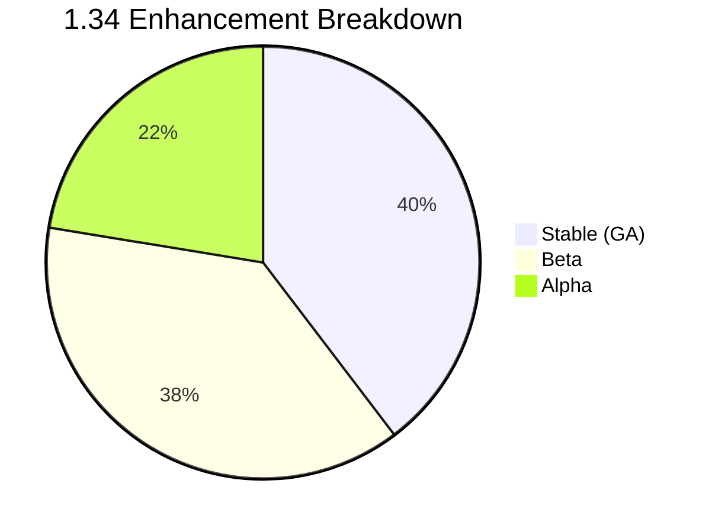
```mermaid
pie title 1.34 Enhancement Breakdown
    "Stable (GA)" : 23
    "Beta" : 22
    "Alpha" : 13
```

#### Key Graduated Features (GA)

**Dynamic Resource Allocation (DRA) Core APIs (GA)**

DRA は GA に到達し、GPU、FPGA、network device などの hardware resource を request および allocate する standardized framework を提供します。これは legacy device plugin model を、より flexible で Kubernetes-native な approach に置き換えます。

```yaml
# DeviceClass: Define a class of hardware devices
apiVersion: resource.k8s.io/v1
kind: DeviceClass
metadata:
  name: gpu-a100
spec:
  selectors:
    - cel:
        expression: >-
          device.driver == "gpu.nvidia.com" &&
          device.attributes["model"].stringValue == "A100"
---
# ResourceClaim: Request specific hardware
apiVersion: resource.k8s.io/v1
kind: ResourceClaim
metadata:
  name: training-gpus
  namespace: ml-team
spec:
  devices:
    requests:
      - name: gpu
        deviceClassName: gpu-a100
        count: 4
    constraints:
      - requests: ["gpu"]
        matchAttribute: "gpu.nvidia.com/numa-node"    # All GPUs on same NUMA node
---
# ResourceClaimTemplate: Auto-create claims per pod
apiVersion: resource.k8s.io/v1
kind: ResourceClaimTemplate
metadata:
  name: gpu-claim-template
  namespace: ml-team
spec:
  spec:
    devices:
      requests:
        - name: gpu
          deviceClassName: gpu-a100
          count: 1
---
# Pod using DRA
apiVersion: v1
kind: Pod
metadata:
  name: ml-training
  namespace: ml-team
spec:
  resourceClaims:
    - name: gpu-claim
      resourceClaimName: training-gpus
  containers:
    - name: trainer
      image: pytorch-training:latest
      resources:
        claims:
          - name: gpu-claim
            request: gpu
```

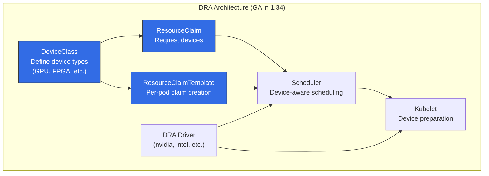
```mermaid
flowchart TD
    subgraph "DRA Architecture (GA in 1.34)"
        DC["DeviceClass
        Define device types
        (GPU, FPGA, etc.)"]
        RC["ResourceClaim
        Request devices"]
        RCT["ResourceClaimTemplate
        Per-pod claim creation"]
        DRI["DRA Driver
        (nvidia, intel, etc.)"]
        SCH["Scheduler
        Device-aware scheduling"]
        KUB["Kubelet
        Device preparation"]
    end

    DC --> RC
    DC --> RCT
    RC --> SCH
    RCT --> SCH
    SCH --> KUB
    DRI --> SCH
    DRI --> KUB

    style DC fill:#326CE5,stroke:#333,color:white
    style RC fill:#326CE5,stroke:#333,color:white
    style RCT fill:#326CE5,stroke:#333,color:white
```

**Namespace Structured Deletion (GA)**

Namespace deletion は well-defined ordering に従うようになり、依存される resource より前に dependent resource が clean up されることを保証します。これにより、長年存在した stuck-namespace issue の class が解消されます。

```bash
# Before 1.34: Namespace deletion could get stuck
$ kubectl delete namespace old-project
# Hangs indefinitely due to finalizer ordering issues

# After 1.34 (GA): Ordered deletion with clear status
$ kubectl delete namespace old-project
$ kubectl get namespace old-project -o jsonpath='{.status.conditions}'
# Shows clear progress through deletion phases
```

**VolumeAttributesClass (GA)**

VolumeAttributesClass が GA に昇格し、IOPS や throughput などの volume attributes を in-place で変更できるようになりました。

```yaml
# Change EBS volume performance tier without recreating
apiVersion: storage.k8s.io/v1
kind: VolumeAttributesClass
metadata:
  name: high-iops
driverName: ebs.csi.aws.com
parameters:
  iops: "16000"
  throughput: "1000"
---
apiVersion: storage.k8s.io/v1
kind: VolumeAttributesClass
metadata:
  name: standard
driverName: ebs.csi.aws.com
parameters:
  iops: "3000"
  throughput: "125"
```

```bash
# Switch a PVC's performance tier
kubectl patch pvc database-vol --type='merge' -p '{
  "spec": {"volumeAttributesClassName": "high-iops"}
}'

# Monitor the modification
kubectl get pvc database-vol -o jsonpath='{.status.currentVolumeAttributesClassName}'
kubectl get pvc database-vol -o jsonpath='{.status.modifyVolumeStatus}'
```

**Other GA Features in 1.34**:
- `nftablesProxyMode` -- nftables kube-proxy backend
- Services 向け `TrafficDistribution`
- `PodLevelResources` -- pod level で aggregate resource limits を設定
- `MatchLabelKeysInPodAffinity` -- label-key-based affinity matching
- `ImageVolume` -- OCI images as volumes
- `UserNamespacesSupport` -- user namespace isolation

#### Key Beta Features

**KYAML (Beta, Enabled by Default)**

KYAML は Kubernetes manifest 向けに設計された、より安全な YAML subset です。anchors、aliases、特定の type coercion など、security vulnerability や unexpected behavior につながる dangerous YAML feature を disallow します。

```yaml
# STANDARD YAML: These dangerous patterns are REJECTED by KYAML

# Pattern 1: YAML anchors and aliases (disabled in KYAML)
# defaults: &defaults
#   replicas: 3
# production:
#   <<: *defaults     # REJECTED: anchor/alias

# Pattern 2: Boolean coercion (restricted in KYAML)
# environment: yes    # YAML interprets as boolean True
# environment: "yes"  # KYAML requires explicit quoting

# Pattern 3: Octal notation ambiguity
# fileMode: 0644      # YAML may interpret as octal or decimal
# fileMode: "0644"    # KYAML requires clarity
```

```bash
# Check if KYAML validation is enabled on your cluster
kubectl get --raw /metrics | grep kyaml_validation

# Test a manifest against KYAML rules
kubectl apply --dry-run=server -f manifest.yaml
# Warnings will indicate KYAML violations
```

**MutatingAdmissionPolicy (Beta)**

ValidatingAdmissionPolicy の CEL-based counterpart であり、webhook なしで admission 中に resource を in-line mutation できます。

```yaml
apiVersion: admissionregistration.k8s.io/v1beta1
kind: MutatingAdmissionPolicy
metadata:
  name: inject-default-labels
spec:
  matchConstraints:
    resourceRules:
      - apiGroups: ["apps"]
        apiVersions: ["v1"]
        operations: ["CREATE"]
        resources: ["deployments"]
  mutations:
    - patchType: ApplyConfiguration
      applyConfiguration:
        expression: >-
          Object{
            metadata: Object.metadata{
              labels: {
                "app.kubernetes.io/managed-by": "platform-team",
                "cost-center": string(request.namespace)
              }
            }
          }
```

**Other Beta Features in 1.34**:
- `CRDValidationRatcheting` -- CRD field の progressive validation
- `DeviceHealthConditions` -- DRA 経由で device health を report
- `PodLevelResources` enhancements

#### Key Alpha Features

- **KYAML** はこの release で alpha から beta に移行
- **GangScheduling** (alpha) -- pod の group を atomic に schedule
- **InPlacePodVerticalScaling** extended features
- **DRAPartitionableDevices** improvements

---

### 4.7 Kubernetes 1.35 "Timbernetes" (December 2025)

**Theme**: complexity を切り開き、solid foundation を築くという release の focus を反映した lumberjack-themed name です。

**Release Stats**: 60 enhancements -- 17 Stable, 19 Beta, 22 Alpha

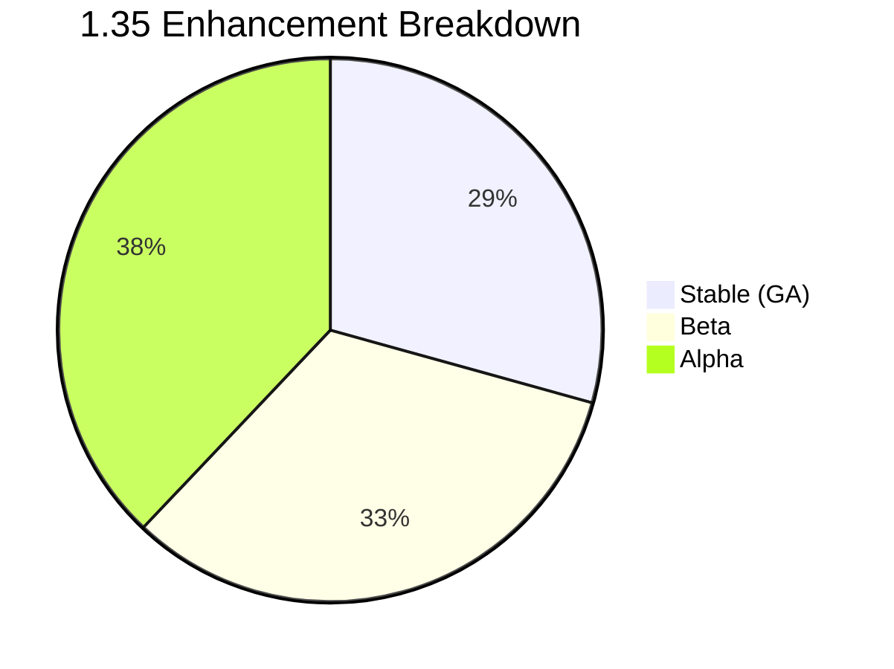
```mermaid
pie title 1.35 Enhancement Breakdown
    "Stable (GA)" : 17
    "Beta" : 19
    "Alpha" : 22
```

#### Key Graduated Features (GA)

**In-Place Pod Vertical Scaling (GA)**

長く待たれていた in-place pod resize の graduation です。Pod は full stability guarantee のもとで、restart なしに CPU と memory を resize できるようになりました。

| Version | Status | Key Changes |
|---------|--------|-------------|
| 1.27 | Alpha | Initial implementation, CPU-only resize |
| 1.33 | Beta | Memory resize, resize policies, enabled by default |
| 1.35 | **GA** | Full stability, extended status, production-ready |

```yaml
# Production-ready in-place scaling with VPA integration
apiVersion: autoscaling.k8s.io/v1
kind: VerticalPodAutoscaler
metadata:
  name: app-vpa
spec:
  targetRef:
    apiVersion: apps/v1
    kind: Deployment
    name: web-app
  updatePolicy:
    updateMode: "InPlace"           # Use in-place resize (requires 1.35+)
  resourcePolicy:
    containerPolicies:
      - containerName: app
        minAllowed:
          cpu: 100m
          memory: 128Mi
        maxAllowed:
          cpu: "4"
          memory: 4Gi
        controlledResources:
          - cpu
          - memory
```

```yaml
# Resize policy controlling restart behavior
apiVersion: v1
kind: Pod
metadata:
  name: production-app
spec:
  containers:
    - name: app
      image: myapp:latest
      resources:
        requests:
          cpu: "1"
          memory: 1Gi
        limits:
          cpu: "2"
          memory: 2Gi
      resizePolicy:
        - resourceName: cpu
          restartPolicy: NotRequired       # CPU: resize in-place
        - resourceName: memory
          restartPolicy: NotRequired       # Memory: also in-place (GA!)
```

```bash
# Resize workflow
kubectl patch pod production-app --subresource resize --patch '{
  "spec": {
    "containers": [{
      "name": "app",
      "resources": {
        "requests": {"cpu": "2", "memory": "2Gi"},
        "limits": {"cpu": "4", "memory": "4Gi"}
      }
    }]
  }
}'

# Monitor resize progress
kubectl get pod production-app -o json | jq '{
  resize: .status.resize,
  allocated: .status.containerStatuses[0].allocatedResources,
  requested: .spec.containers[0].resources.requests
}'
```

> **Impact for EKS Users**: In-place pod resize は resource adjustment のために pod を restart する必要をなくします。これは以下に transformative です。
> - restart cost が高い **Stateful workloads** (databases, caches)
> - 実行中に追加 resource を必要とする **Long-running batch jobs**
> - 以前は pod restart が必要だった **VPA adoption**
> - disruption なしの right-sizing による **Cost optimization**

**Other GA Features in 1.35**:
- `CRDValidationRatcheting` -- progressive CRD validation
- `DeviceHealthConditions` -- DRA device health reporting
- `PodLifecycleSleepActionGracePeriod` -- sleep action 向け configurable grace period
- `ContextualLogging` -- fully graduated structured logging

#### Key Beta Features

**KYAML (Beta, Enabled by Default)**

KYAML は beta に到達して default enabled になり、API server に送信されるすべての YAML がより安全な subset に対して validated されます。invalid YAML pattern は warning を生成します（beta では rejection ではありません）。

```bash
# With KYAML enabled, these warnings appear on apply:
$ kubectl apply -f deployment.yaml
Warning: KYAML: line 15: implicit boolean coercion; use "true" instead of "yes"
Warning: KYAML: line 23: YAML anchor detected; anchors are not supported in KYAML
deployment.apps/my-app created
```

**Gang Scheduling (Alpha moving to Beta)**

Gang scheduling は、pod group が atomic に schedule されることを保証します。つまり group 内のすべての pod が schedule されるか、どれも schedule されないかのどちらかです。これは distributed training や tightly-coupled HPC workloads に重要です。

```yaml
# PodGroup for gang scheduling
apiVersion: scheduling.k8s.io/v1alpha1
kind: PodGroup
metadata:
  name: distributed-training
  namespace: ml-team
spec:
  minMember: 4                    # All 4 pods must be schedulable
  scheduleTimeoutSeconds: 300     # Timeout if group can't be scheduled
---
apiVersion: batch/v1
kind: Job
metadata:
  name: pytorch-distributed
  namespace: ml-team
spec:
  completions: 4
  parallelism: 4
  template:
    metadata:
      labels:
        pod-group.scheduling.k8s.io/name: distributed-training
    spec:
      schedulerName: default-scheduler
      containers:
        - name: trainer
          image: pytorch-dist:latest
          resources:
            limits:
              nvidia.com/gpu: 8
```

**Other Beta Features in 1.35**:
- `AnonymousAuthConfigurableEndpoints` -- endpoint ごとの configurable anonymous access
- `InPlacePodVerticalScalingAllocatedStatus` -- detailed resize status reporting
- `SELinuxMount` improvements
- `NodeInclusionPolicyInPodTopologySpread` -- topology spread の node inclusion control

#### Key Alpha Features

- **PodLevelInPlaceScaling** -- container level だけでなく pod level（aggregate）で resize
- **LeaderMigration** -- controller-manager leader election を migrate
- **SchedulerQueueingHints** improvements
- **RecoverVolumeExpansionFailure** -- failed volume expansion から recover

---

### 4.8 Kubernetes 1.36 "ハル (Haru)" (April 2026)

**Theme**: 日本語の「春」（ハル/Haru）にちなんだ名称で、新しい始まりと成長を象徴しています。

**Release Stats**: 68 enhancements -- 18 Stable, 25 Beta, 25 Alpha。主要 theme には security hardening、AI/ML workload support、API extensibility が含まれます。EKS は GovCloud (US) を含む利用可能なすべての region で 1.36 を support しています。

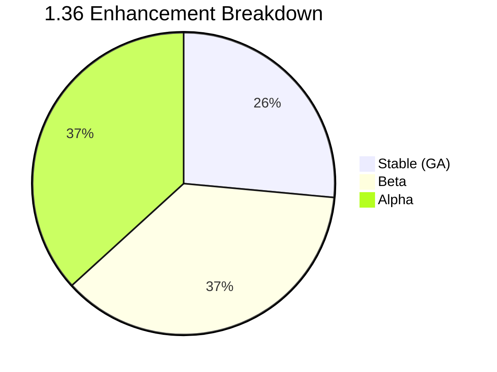
```mermaid
pie title 1.36 Enhancement Breakdown
    "Stable (GA)" : 18
    "Beta" : 25
    "Alpha" : 25
```

**Overview of Key Features**:

| Feature | Stage | Key Value |
|---------|-------|-----------|
| Mutating Admission Policies | **GA** | webhook server を排除 -- operational simplicity, performance, availability |
| In-Place Pod Vertical Scaling | **Enhanced** | zero-downtime resource adjustment -- cost efficiency, SLA protection |
| User Namespaces | **GA** | container root ≠ node root -- privilege isolation |
| Fine-Grained Kubelet API Authorization | **GA** | least-privilege kubelet API access |
| Legacy ServiceAccount Token Cleanup | **GA** | unused token の auto-cleanup -- attack surface reduction |
| Resource Health Status (DRA) | Improved | GPU device health -- failure root-cause identification の高速化 |

#### Key Graduated Features (GA)

**Mutating Admission Policies (GA)**

Mutating Admission Policies (MAP) は CEL-based mutation を native Kubernetes object にもたらし、external webhook server を不要にします。MAP では、mutation logic は `MutatingAdmissionPolicy` と `MutatingAdmissionPolicyBinding` resources を使って declarative に定義され、API server によって in-process で評価されます。

主な特徴:

- **In-process API server evaluation**: webhook network round-trip や external server latency はありません。Mutation は API server process 内で実行されます。
- **Operational simplicity**: certificate management、high-availability deployment、webhook server の scaling concern は不要です。API server がすべて処理します。
- **Idempotency guaranteed**: CEL expression は deterministic result を生成し、ordering や re-invocation の edge case を排除します。
- **Limitation**: external data lookup（例: OPA server や image registry への問い合わせ）を必要とする mutation には、引き続き traditional webhook が必要です。MAP は self-contained で policy-driven な mutation 向けです。

> **Impact**: admission control の webhook server は、歴史的に Kubernetes cluster における single point of failure でした。misconfigured または unavailable な webhook は、cluster 全体の pod creation を block する可能性があります。MAP は、大半の mutation use case についてこの class の operational risk を排除します。

以下の例は、in-place resize 用に annotation された pod に `resizePolicy` を自動注入する `MutatingAdmissionPolicy` を示します。これは MAP（1.36 で GA）と In-Place Pod Vertical Scaling（1.35 で GA）を組み合わせた実践的な pattern です。

```yaml
apiVersion: admissionregistration.k8s.io/v1
kind: MutatingAdmissionPolicy
metadata:
  name: inject-resizepolicy
spec:
  failurePolicy: Fail
  reinvocationPolicy: Never
  matchConstraints:
    resourceRules:
      - apiGroups: [""]
        apiVersions: ["v1"]
        operations: ["CREATE"]
        resources: ["pods"]
  matchConditions:
    - name: only-resize-enabled
      expression: >-
        has(object.metadata.annotations) &&
        ("resize.example.com/enabled" in object.metadata.annotations) &&
        object.metadata.annotations["resize.example.com/enabled"] == "true"
  mutations:
    - patchType: JSONPatch
      jsonPatch:
        expression: >-
          object.spec.containers.map(c, JSONPatch{
            op: "add",
            path: "/spec/containers/" + string(object.spec.containers.indexOf(c)) + "/resizePolicy",
            value: [
              {"resourceName": "cpu",    "restartPolicy": "NotRequired"},
              {"resourceName": "memory", "restartPolicy": "RestartContainer"}
            ]
          })
---
apiVersion: admissionregistration.k8s.io/v1
kind: MutatingAdmissionPolicyBinding
metadata:
  name: inject-resizepolicy-binding
spec:
  policyName: inject-resizepolicy
  matchResources:
    namespaceSelector:
      matchLabels:
        map-demo: "true"
```

> **Safety Note**: MAP `matchConstraints` は default で cluster-wide です。cluster 全体への意図しない modification を防ぐため、binding で必ず `namespaceSelector` を使って mutation scope を限定してください。

> **Technical Note**: `resizePolicy` は Kubernetes API schema で atomic list として定義されています。つまり、上記のように `JSONPatch` を使用する必要があります。`ApplyConfiguration` を使おうとすると `"may not mutate atomic arrays"` で失敗します。

**In-Place Pod Vertical Scaling Enhancements**

1.35 での per-container in-place resize の GA graduation を基盤として、Kubernetes 1.36 は複数の enhancement を追加します。

- **Pod-level shared budget resize**: Pod-level resources を pod restart なしで resize でき、pod 内のすべての container にまたがる aggregate resource adjustment が可能になります。
- **CPUManager checkpoint tracking**: CPUManager は live resize operation 中の checkpoint state を追跡し、performance-sensitive workload の NUMA alignment を維持します。
- **CPU resize (NotRequired)**: `restartPolicy: NotRequired` の CPU change は cgroup update で適用され、zero downtime です。container restart も connection drop もありません。
- **Memory shrink behavior**: Memory shrink operation は、resize 時点の actual memory usage によって `RestartContainer` を trigger する場合があります。production で memory resize を有効にする前に per-workload validation が不可欠です。

**User Namespaces (Feature Gate Removed)**

User Namespaces は 1.36 で feature gate が削除され、full production readiness に到達しました。Container UID 0（container 内の root）は unprivileged host UID に map され、application change なしで privilege isolation を提供します。

Gate が削除されたため、user namespaces は feature gate configuration なしで 1.36 を実行するすべての cluster で利用できます。これにより、container-to-host privilege isolation を実現するための third-party solution は不要になります。

**KYAML (GA)**

KYAML は GA に到達し、より安全な YAML subset がすべての Kubernetes manifest の standard になりました。KYAML validation は dangerous YAML pattern を default で reject します（warning だけではありません）。

| YAML Feature | Allowed in KYAML? | Reason |
|-------------|-------------------|--------|
| Anchors & Aliases | No | Injection risk, confusion |
| Merge Keys (`<<`) | No | Unpredictable behavior |
| Implicit booleans (`yes`/`no`) | No | Type coercion bugs |
| Non-string map keys | No | Ambiguity |
| Duplicate keys | No | Silent override |
| Comments | Yes | documentation に不可欠 |
| Multi-line strings (`|`, `>`) | Yes | 一般的に必要 |
| Flow sequences/mappings | Yes | Standard YAML usage |

```bash
# KYAML is now enforced by default
$ kubectl apply -f bad-manifest.yaml
Error from server: error parsing bad-manifest.yaml: KYAML validation failed:
  line 5: YAML anchors are not permitted
  line 12: implicit boolean value "yes" is not permitted; use "true" or "false"
```

**Gang Scheduling (GA)**

Atomic pod group scheduling が GA に昇格しました。

```yaml
# GA-level gang scheduling
apiVersion: scheduling.k8s.io/v1
kind: PodGroup
metadata:
  name: mpi-job
spec:
  minMember: 8
  scheduleTimeoutSeconds: 600
  priorityClassName: high-priority
```

**Other GA Features in 1.36**:
- `AnonymousAuthConfigurableEndpoints` -- endpoint ごとの anonymous auth control
- `SELinuxMount` -- volume 向け SELinux label management
- `NodeInclusionPolicyInPodTopologySpread` -- topology spread node inclusion
- `RecoverVolumeExpansionFailure` -- failed expansion からの automated recovery
- `FineGrainedKubeletAPIAuthorization` -- least-privilege kubelet API access。どの node がどの kubelet endpoint に access できるかを制限
- `LegacyServiceAccountTokenCleanUp` -- unused Secret-based ServiceAccount token の auto-cleanup。long-lived credential による attack surface を削減

#### Phase-Aware Resource Management Pattern

この section では、In-Place Pod Vertical Scaling（1.35 で GA）と Mutating Admission Policies（1.36 で GA）を組み合わせて、phase-aware resource management を実装する実践的 pattern を示します。application lifecycle phase に基づき container resources を自動調整します。

**Problem Definition**

多くの containerized workloads には、異なる resource profile を必要とする明確な lifecycle phase があります。

- **Startup (warmup) phase**: JVM JIT compilation、LLM model loading、index/cache prefill に高い CPU が必要
- **Steady-state (serving) phase**: 通常の request handling には低い CPU で十分

どちらの phase でも Kubernetes では container は `Running` と表示されます。application が warmup から serving に遷移したときに resources を自動切り替えする native mechanism はありません。典型的な workaround は startup phase 向けの over-provisioning ですが、より長い steady-state phase では resource が無駄になります。

Target workloads には、JIT warmup を伴う JVM applications、model を memory に load する ML inference servers、startup 時に cache や index を build する services が含まれます。

**Flow**:

```
Pod Create (startup: large CPU, req==limit -> Guaranteed QoS)
  -> Controller watches pod.status.containerStatuses[].started
  -> started:true detected (= startup probe passed)
  -> Resize via pods/resize subresource to steady-state CPU (zero-downtime)
```

**Key Insight -- QoS Preservation**

QoS class は Pod creation time に決定され、resize しても変わりません (KEP-1287)。startup phase と steady-state phase の両方で `requests == limits` を設定することで、pod は lifecycle 全体を通じて `Guaranteed` QoS を維持します。Memory は固定（restart risk を避ける）し、CPU のみを変更します。

**Annotation-Based Approach (No CRD Required)**

Custom Resource を定義する代わりに、この pattern は既存 workload の annotation を使用します。lightweight controller が pod を watch し、annotation に基づいて動作します。

```yaml
apiVersion: apps/v1
kind: Deployment
metadata:
  name: phase-aware-app
spec:
  replicas: 2
  selector:
    matchLabels:
      app: phase-aware-app
  template:
    metadata:
      annotations:
        resize.example.com/enabled:          "true"
        resize.example.com/trigger:          "StartupProbePassed"
        resize.example.com/steady-resources: |
          {"app":{"requests":{"cpu":"50m"},"limits":{"cpu":"50m"}}}
      labels:
        app: phase-aware-app
    spec:
      containers:
        - name: app
          image: myapp:latest
          resizePolicy:
            - resourceName: cpu
              restartPolicy: NotRequired
            - resourceName: memory
              restartPolicy: RestartContainer
          resources:
            requests:
              cpu: "200m"
              memory: 64Mi
            limits:
              cpu: "200m"
              memory: 64Mi
          startupProbe:
            httpGet:
              path: /healthz
              port: 8080
            initialDelaySeconds: 5
            periodSeconds: 3
            failureThreshold: 30
```

**Controller Implementation (Go)**

以下の controller は annotated pods を watch し、startup probe が pass したときに steady-state resources へ patch します。Pods のみを watch するため、Deployments、StatefulSets、DaemonSets、Argo Rollouts で同一に動作し、workload-type branching は不要です。

```go
// pod-resizer — annotation-based zero-downtime in-place downscale controller.
// Watches Pods only — works identically for Deployment/StatefulSet/DaemonSet/Rollout.
// On startup probe pass, patches to steady resources via pods/resize subresource.
// Maintains req==limit on both phases to preserve Guaranteed QoS (KEP-1287).
package main

import (
	"context"
	"encoding/json"
	"fmt"
	"log"
	"strconv"
	"sync"
	"time"

	corev1 "k8s.io/api/core/v1"
	metav1 "k8s.io/apimachinery/pkg/apis/meta/v1"
	"k8s.io/apimachinery/pkg/types"
	"k8s.io/client-go/informers"
	"k8s.io/client-go/kubernetes"
	"k8s.io/client-go/rest"
	"k8s.io/client-go/tools/cache"
)

const (
	annEnabled = "resize.example.com/enabled"
	annTrigger = "resize.example.com/trigger"
	annDelay   = "resize.example.com/delay-seconds"
	annSteady  = "resize.example.com/steady-resources"
	annResized = "resize.example.com/resized"
)

type resVals struct {
	Requests map[string]string `json:"requests,omitempty"`
	Limits   map[string]string `json:"limits,omitempty"`
}

var clientset *kubernetes.Clientset
var processed sync.Map

func main() {
	cfg, err := rest.InClusterConfig()
	if err != nil {
		log.Fatalf("in-cluster config: %v", err)
	}
	clientset, err = kubernetes.NewForConfig(cfg)
	if err != nil {
		log.Fatalf("clientset: %v", err)
	}

	factory := informers.NewSharedInformerFactory(clientset, 15*time.Second)
	podInformer := factory.Core().V1().Pods().Informer()
	podInformer.AddEventHandler(cache.ResourceEventHandlerFuncs{
		AddFunc:    func(obj interface{}) { handle(obj) },
		UpdateFunc: func(_, obj interface{}) { handle(obj) },
	})

	stop := make(chan struct{})
	defer close(stop)
	log.Printf("pod-resizer starting; watching pods annotated %s=true", annEnabled)
	factory.Start(stop)
	factory.WaitForCacheSync(stop)
	log.Printf("informer cache synced; ready")
	select {}
}

func handle(obj interface{}) {
	pod, ok := obj.(*corev1.Pod)
	if !ok {
		return
	}
	a := pod.Annotations
	if a == nil || a[annEnabled] != "true" || a[annResized] == "true" {
		return
	}
	if pod.DeletionTimestamp != nil || pod.Status.Phase != corev1.PodRunning {
		return
	}

	trigger := a[annTrigger]
	if trigger == "" {
		trigger = "StartupProbePassed"
	}
	if !triggerMet(pod, trigger, a[annDelay]) {
		return
	}

	steady := map[string]resVals{}
	if err := json.Unmarshal([]byte(a[annSteady]), &steady); err != nil {
		log.Printf("ERROR %s/%s: bad %s: %v", pod.Namespace, pod.Name, annSteady, err)
		return
	}
	patch := buildResizePatch(steady)
	if patch == nil {
		return
	}
	pb, _ := json.Marshal(patch)

	key := string(pod.UID)
	if _, loaded := processed.LoadOrStore(key, true); loaded {
		return
	}

	if _, err := clientset.CoreV1().Pods(pod.Namespace).Patch(
		context.TODO(), pod.Name, types.StrategicMergePatchType, pb,
		metav1.PatchOptions{}, "resize"); err != nil {
		processed.Delete(key)
		log.Printf("ERROR %s/%s: resize patch failed: %v", pod.Namespace, pod.Name, err)
		return
	}
	log.Printf("RESIZED %s/%s [%s] trigger=%s patch=%s",
		pod.Namespace, pod.Name, ownerKind(pod), trigger, string(pb))

	mark := []byte(fmt.Sprintf(`{"metadata":{"annotations":{%q:"true"}}}`, annResized))
	if _, err := clientset.CoreV1().Pods(pod.Namespace).Patch(
		context.TODO(), pod.Name, types.MergePatchType, mark, metav1.PatchOptions{}); err != nil {
		log.Printf("WARN %s/%s: marker patch failed: %v", pod.Namespace, pod.Name, err)
	}
}

func triggerMet(pod *corev1.Pod, trigger, delayStr string) bool {
	switch trigger {
	case "Ready":
		for _, c := range pod.Status.Conditions {
			if c.Type == corev1.PodReady {
				return c.Status == corev1.ConditionTrue
			}
		}
		return false
	case "Delay":
		delay, _ := strconv.Atoi(delayStr)
		for _, cs := range pod.Status.ContainerStatuses {
			if cs.State.Running != nil {
				return time.Since(cs.State.Running.StartedAt.Time) >= time.Duration(delay)*time.Second
			}
		}
		return false
	default:
		if len(pod.Status.ContainerStatuses) == 0 {
			return false
		}
		for _, cs := range pod.Status.ContainerStatuses {
			if cs.Started == nil || !*cs.Started {
				return false
			}
		}
		return true
	}
}

func buildResizePatch(steady map[string]resVals) map[string]interface{} {
	var containers []map[string]interface{}
	for name, rv := range steady {
		res := map[string]interface{}{}
		if len(rv.Requests) > 0 {
			res["requests"] = rv.Requests
		}
		if len(rv.Limits) > 0 {
			res["limits"] = rv.Limits
		}
		containers = append(containers, map[string]interface{}{"name": name, "resources": res})
	}
	if len(containers) == 0 {
		return nil
	}
	return map[string]interface{}{"spec": map[string]interface{}{"containers": containers}}
}

func ownerKind(pod *corev1.Pod) string {
	if len(pod.OwnerReferences) > 0 {
		return pod.OwnerReferences[0].Kind
	}
	return "Pod"
}
```

**Controller RBAC**

Controller は patching のために `pods/resize` subresource への access と、standard pod watch/list permission を必要とします。

```yaml
apiVersion: v1
kind: ServiceAccount
metadata:
  name: pod-resizer
  namespace: pod-resizer-system
---
apiVersion: rbac.authorization.k8s.io/v1
kind: ClusterRole
metadata:
  name: pod-resizer
rules:
  - apiGroups: [""]
    resources: ["pods"]
    verbs: ["get", "list", "watch", "patch"]
  - apiGroups: [""]
    resources: ["pods/resize"]          # Required for resize subresource
    verbs: ["patch"]
---
apiVersion: rbac.authorization.k8s.io/v1
kind: ClusterRoleBinding
metadata:
  name: pod-resizer
subjects:
  - kind: ServiceAccount
    name: pod-resizer
    namespace: pod-resizer-system
roleRef:
  apiGroup: rbac.authorization.k8s.io
  kind: ClusterRole
  name: pod-resizer
```

**Demo Workload**

phase-aware resize pattern を test するための minimal workload です。

```yaml
apiVersion: v1
kind: Namespace
metadata:
  name: resize-demo
  labels:
    map-demo: "true"        # Enables MAP resizePolicy injection
---
apiVersion: apps/v1
kind: Deployment
metadata:
  name: busybox-resize-demo
  namespace: resize-demo
spec:
  replicas: 2
  selector:
    matchLabels:
      app: busybox-resize-demo
  template:
    metadata:
      labels:
        app: busybox-resize-demo
      annotations:
        resize.example.com/enabled:          "true"
        resize.example.com/trigger:          "StartupProbePassed"
        resize.example.com/steady-resources: |
          {"busybox":{"requests":{"cpu":"50m"},"limits":{"cpu":"50m"}}}
    spec:
      containers:
        - name: busybox
          image: busybox:1.36
          command: ["sh", "-c", "echo 'starting warmup'; sleep 10; echo 'ready'; while true; do sleep 3600; done"]
          resources:
            requests:
              cpu: "200m"
              memory: 64Mi
            limits:
              cpu: "200m"
              memory: 64Mi
          startupProbe:
            exec:
              command: ["sh", "-c", "test -f /tmp/ready || (sleep 8 && touch /tmp/ready)"]
            initialDelaySeconds: 2
            periodSeconds: 3
            failureThreshold: 10
```

**Argo Rollouts Compatibility**

Controller は modification なしで Argo Rollouts と動作します。ownership chain は Rollout -> ReplicaSet -> Pod であり、Deployment -> ReplicaSet -> Pod と同一の構造です。Controller は Pods のみを watch し、type-specific logic のために owner reference を inspect しないため、適切な annotation を持つ pod を作成する任意の workload controller が support されます。

**Test Results (EKS 1.36.1)**

EKS v1.36.1、containerd 2.2.3、Amazon Linux 2023 (cgroup v2, arm64/Graviton) で test 済みです。

Controller log output:

```
2026/06/28 09:12:03 pod-resizer starting; watching pods annotated resize.example.com/enabled=true
2026/06/28 09:12:03 informer cache synced; ready
2026/06/28 09:12:41 RESIZED resize-demo/busybox-resize-demo-7f8b9c6d4-k2xnm [ReplicaSet] trigger=StartupProbePassed patch={"spec":{"containers":[{"name":"busybox","resources":{"limits":{"cpu":"50m"},"requests":{"cpu":"50m"}}}]}}
2026/06/28 09:12:41 RESIZED resize-demo/busybox-resize-demo-7f8b9c6d4-p9wvj [ReplicaSet] trigger=StartupProbePassed patch={"spec":{"containers":[{"name":"busybox","resources":{"limits":{"cpu":"50m"},"requests":{"cpu":"50m"}}}]}}
2026/06/28 09:13:05 RESIZED resize-demo/busybox-resize-ds-xq7zt [DaemonSet] trigger=StartupProbePassed patch={"spec":{"containers":[{"name":"busybox","resources":{"limits":{"cpu":"50m"},"requests":{"cpu":"50m"}}}]}}
2026/06/28 09:13:22 RESIZED resize-demo/busybox-resize-sts-0 [StatefulSet] trigger=StartupProbePassed patch={"spec":{"containers":[{"name":"busybox","resources":{"limits":{"cpu":"50m"},"requests":{"cpu":"50m"}}}]}}
```

In-place resize verification:

| Workload | QoS | CPU (req/lim) | restartCount | containerID |
|----------|-----|---------------|--------------|-------------|
| Deployment (x2) | Guaranteed -> **Guaranteed** | 200m -> **50m** | 0 -> **0** | **Identical** |
| DaemonSet | Guaranteed -> **Guaranteed** | 200m -> **50m** | 0 -> **0** | **Identical** |
| StatefulSet | Guaranteed -> **Guaranteed** | 200m -> **50m** | 0 -> **0** | **Identical** |

> **Key Evidence**: `restartCount=0` かつ resize 前後で `containerID` が同一であることにより、true in-place cgroup CPU reallocation が確認されます。container は再作成されていません。QoS class は resize 全体を通じて `Guaranteed` として維持されました。

**MAP Injection Test Results**

`MutatingAdmissionPolicy` が annotation presence に基づいて `resizePolicy` を正しく inject することを検証します。

| Case | Annotation Present | Injected resizePolicy | Verdict |
|------|-------------------|----------------------|---------|
| with-annotation | Yes | `[{cpu:NotRequired},{memory:RestartContainer}]` | Injected (no webhook needed) |
| without-annotation | No | `[]` (none) | Not injected (matchCondition working) |

**Advantages of the Annotation-Based Approach**

| Aspect | Benefit |
|--------|---------|
| Operational overhead | CRD/CR なし -- 既存 workload に annotation を追加するだけ |
| Workload universality | Controller は Pods のみを watch -- Deployment/StatefulSet/DaemonSet/Rollout で同一 behavior |
| Code complexity | type branching、child creation、owner-reference handling なし |
| Existing workloads | annotation patch で適用（manifest rewrite 不要） |
| resizePolicy automation | MAP (GA) が pod creation 時に自動注入 -- webhook なしで fully automated |

**Caveats**

- CPU-only zero-downtime resize は安全で検証済みです。Memory shrink は actual usage によって container restart を trigger する場合があります。本番有効化前に workload ごとに validate してください。
- `--subresource resize` には `kubectl` version 1.32 以降が必要です（debugging のみ。controller は subresources を native に扱う client-go を使用します）。
- HPA および CPUManager static NUMA alignment policy との interaction は workload ごとの validation が必要です。Concurrent HPA scaling と in-place resize は conflicting resource target を生む可能性があります。
- production deployment では、multi-replica high availability のために controller に leader election を追加してください。

#### Upgrade Checklist

- **Ingress-NGINX retired (2026-03-24)**: Security patch は停止しています。Gateway API compatible controller（例: Envoy Gateway, Istio Gateway, Cilium Gateway API）へ migrate してください。
- **IPVS mode / externalIPs service audit**: 1.36 networking change との compatibility のため、IPVS mode または `externalIPs` を使用する services を review してください。upgrade 前の audit が推奨されます。
- **EKS Cluster Insights**: upgrade 開始前に EKS Cluster Insights を実行し、deprecated API usage、incompatible add-on versions、その他 compatibility issue を特定してください。

#### Key Beta Features

**Pod-Level In-Place Scaling (Beta)**

1.35 での per-container in-place resize の GA を基盤として、pod-level in-place scaling は pod level で aggregate resource limit を設定し、それを resize できるようにします。

```yaml
apiVersion: v1
kind: Pod
metadata:
  name: multi-container-app
spec:
  resources:                          # Pod-level resource limits
    limits:
      cpu: "4"
      memory: 8Gi
    requests:
      cpu: "2"
      memory: 4Gi
  containers:
    - name: app
      image: myapp:latest
      resources:
        requests:
          cpu: "1"
          memory: 2Gi
    - name: sidecar
      image: sidecar:latest
      resources:
        requests:
          cpu: 500m
          memory: 512Mi
    # Remaining resources available for burst
```

**Improved DRA Partitioning**

GPU のような device 向け DRA partitioning が beta に到達し、fine-grained resource sharing が可能になりました。

```yaml
# Request a GPU partition (MIG-like)
apiVersion: resource.k8s.io/v1
kind: ResourceClaim
metadata:
  name: gpu-partition
spec:
  devices:
    requests:
      - name: gpu-slice
        deviceClassName: gpu-partition
        selectors:
          - cel:
              expression: >-
                device.capacity["gpu.nvidia.com"].memory.compareTo(quantity("10Gi")) >= 0
```

#### Key Alpha Features

- **MultipleSCTPAssociations** -- pod ごとの multiple SCTP associations
- **SchedulerFIFO** -- FIFO scheduling queue option
- **CPUManagerPolicyAlpha** enhancements

---

## 5. Key Feature Graduation Timeline

以下の table は、major feature graduation の comprehensive cross-version view を提供します。採用を計画している feature の full lifecycle を理解するために使用してください。

### Core Features

| Feature | KEP | Alpha | Beta | GA | Description |
|---------|-----|-------|------|-----|-------------|
| Sidecar Containers | KEP-753 | 1.28 | 1.29/1.31 | **1.33** | `restartPolicy: Always` を持つ init containers による native sidecar support |
| In-Place Pod Vertical Scaling | KEP-1287 | 1.27 | 1.33 | **1.35** | restart なしで pod CPU/memory を resize |
| Pod Scheduling Readiness | KEP-3521 | 1.26 | 1.27 | **1.30** | pod scheduling を遅延させる scheduling gates |
| Job Success Policy | KEP-3998 | 1.28 | 1.31 | **1.33** | Jobs 向け custom success criteria |
| Pod-Level Resources | KEP-2837 | 1.32 | 1.33 | **1.34** | pod level の aggregate resource limits |

### Security Features

| Feature | KEP | Alpha | Beta | GA | Description |
|---------|-----|-------|------|-----|-------------|
| ValidatingAdmissionPolicy (CEL) | KEP-3488 | 1.26 | 1.28 | **1.30** | CEL による native admission control |
| MutatingAdmissionPolicy (CEL) | KEP-3962 | 1.33 | 1.34/1.35 | **1.36** | CEL による native mutation |
| StructuredAuthorizationConfiguration | KEP-3221 | 1.29 | 1.30 | **1.32** | ordered authorization chain configuration |
| AppArmor GA | KEP-24 | 1.4 | 1.28 | **1.31** | native AppArmor profile API field |
| User Namespaces | KEP-127 | 1.25 | 1.30/1.33 | **1.34** | security isolation 用 UID/GID remapping |
| KYAML | KEP-4222 | 1.33 | 1.34/1.35 | **1.36** | Kubernetes manifest 向けの safer YAML subset |

### Networking Features

| Feature | KEP | Alpha | Beta | GA | Description |
|---------|-----|-------|------|-----|-------------|
| Gateway API (CRD) | KEP-1897 | 1.18 | 1.22 | **1.26+** | next-gen Ingress API (CRD-based, version independent) |
| ServiceCIDR / IPAddress API | KEP-1880 | 1.27 | 1.31 | **1.33** | dynamic Service IP range management |
| Topology Aware Routing | KEP-2433 | 1.21 | 1.23 | **1.33** | zone-aware traffic routing |
| nftables kube-proxy | KEP-3866 | 1.29 | 1.31 | **1.34** | nftables-based Service routing |
| Traffic Distribution | KEP-4444 | 1.30 | 1.31 | **1.34** | Service traffic distribution preferences |

### Storage Features

| Feature | KEP | Alpha | Beta | GA | Description |
|---------|-----|-------|------|-----|-------------|
| ReadWriteOncePod | KEP-2485 | 1.22 | 1.27 | **1.29** | single-pod RW access mode |
| VolumeAttributesClass | KEP-3751 | 1.29 | 1.31 | **1.34** | mutable volume attributes (IOPS, throughput) |
| PV Last Phase Transition | KEP-3762 | 1.28 | 1.29 | **1.31** | PV phase change の timestamp tracking |
| RecoverVolumeExpansionFailure | KEP-1790 | 1.23 | 1.35 | **1.36** | failed volume expansion からの recovery |

### Scheduling Features

| Feature | KEP | Alpha | Beta | GA | Description |
|---------|-----|-------|------|-----|-------------|
| Gang Scheduling | KEP-4818 | 1.35 | 1.35 | **1.36** | distributed workloads 向け atomic group scheduling |
| Pod Scheduling Readiness | KEP-3521 | 1.26 | 1.27 | **1.30** | deferred scheduling 用 scheduling gates |
| MinDomainsInPodTopologySpread | KEP-3022 | 1.24 | 1.25 | **1.30** | topology spread の minimum domain count |

### Resource Management Features

| Feature | KEP | Alpha | Beta | GA | Description |
|---------|-----|-------|------|-----|-------------|
| DRA Core APIs | KEP-3063 | 1.26 | 1.31 | **1.34** | accelerator 向け Dynamic Resource Allocation |
| HPA Container Metrics | KEP-2273 | 1.20 | 1.27 | **1.30** | per-container HPA metrics |
| OCI Images as Volumes | KEP-4639 | 1.31 | 1.33 | **1.34** | OCI image を read-only volume として mount |

### Comprehensive Timeline Visualization

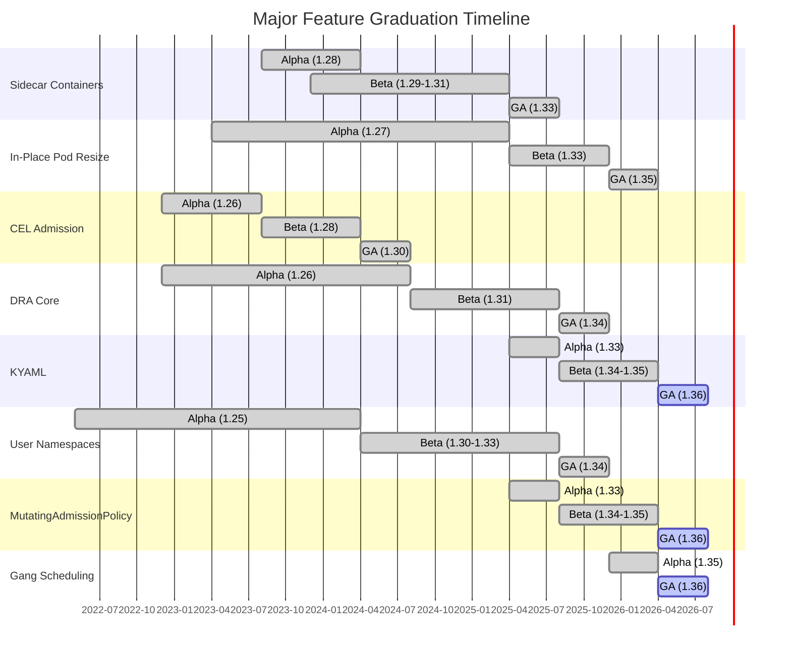
```mermaid
gantt
    title Major Feature Graduation Timeline
    dateFormat  YYYY-MM
    axisFormat  %Y-%m

    section Sidecar Containers
    Alpha (1.28)              :done, s1, 2023-08, 2024-04
    Beta (1.29-1.31)          :done, s2, 2023-12, 2025-04
    GA (1.33)                 :done, s3, 2025-04, 2025-08

    section In-Place Pod Resize
    Alpha (1.27)              :done, r1, 2023-04, 2025-04
    Beta (1.33)               :done, r2, 2025-04, 2025-12
    GA (1.35)                 :done, r3, 2025-12, 2026-04

    section CEL Admission
    Alpha (1.26)              :done, c1, 2022-12, 2023-08
    Beta (1.28)               :done, c2, 2023-08, 2024-04
    GA (1.30)                 :done, c3, 2024-04, 2024-08

    section DRA Core
    Alpha (1.26)              :done, d1, 2022-12, 2024-08
    Beta (1.31)               :done, d2, 2024-08, 2025-08
    GA (1.34)                 :done, d3, 2025-08, 2025-12

    section KYAML
    Alpha (1.33)              :done, k1, 2025-04, 2025-08
    Beta (1.34-1.35)          :done, k2, 2025-08, 2026-04
    GA (1.36)                 :active, k3, 2026-04, 2026-08

    section User Namespaces
    Alpha (1.25)              :done, u1, 2022-05, 2024-04
    Beta (1.30-1.33)          :done, u2, 2024-04, 2025-08
    GA (1.34)                 :done, u3, 2025-08, 2025-12

    section MutatingAdmissionPolicy
    Alpha (1.33)              :done, m1, 2025-04, 2025-08
    Beta (1.34-1.35)          :done, m2, 2025-08, 2026-04
    GA (1.36)                 :active, m3, 2026-04, 2026-08

    section Gang Scheduling
    Alpha (1.35)              :done, g1, 2025-12, 2026-04
    GA (1.36)                 :active, g2, 2026-04, 2026-08
```

---

## 6. Deprecations and Removals

deprecation と removal を理解することは upgrade planning に不可欠です。Deprecation は、API または feature が将来の version で removed されることを知らせ、team に migration の時間を与えます。Removal は API または feature の実際の削除です。

### Kubernetes API Deprecation Policy

- **GA APIs**: replacement GA API が利用可能な場合にのみ deprecated になります。removal まで最低 12 か月または 3 release。
- **Beta APIs**: deprecation 後、removal まで最低 9 か月または 3 release。
- **Alpha APIs**: notice なしで任意の release で removed される可能性があります。

### API Deprecations and Removals by Version

#### Removed in 1.29

| API/Feature | Replaced By | Migration Path |
|------------|-------------|----------------|
| `SecurityContextDeny` admission plugin | Pod Security Standards (PSS) | `PodSecurity` admission controller へ migrate |

#### Removed in 1.32

| API/Feature | Replaced By | Migration Path |
|------------|-------------|----------------|
| `flowcontrol.apiserver.k8s.io/v1beta2` | `flowcontrol.apiserver.k8s.io/v1beta3` -> `v1` | FlowSchema と PriorityLevelConfiguration resource の API version を update |
| `autoscaling/v2beta1` HPA API | `autoscaling/v2` | すべての HPA manifest を `autoscaling/v2` に update |

#### Removed in 1.34

| API/Feature | Replaced By | Migration Path |
|------------|-------------|----------------|
| Legacy `--authorization-mode` flag patterns | StructuredAuthorizationConfiguration | structured authorization config file へ migrate |
| `flowcontrol.apiserver.k8s.io/v1beta3` | `flowcontrol.apiserver.k8s.io/v1` | stable API version に update |

#### Deprecated (Not Yet Removed)

| API/Feature | Deprecated In | Expected Removal | Migration Path |
|------------|--------------|-----------------|----------------|
| In-tree cloud provider (AWS, GCP, Azure) | 1.26+ | Ongoing | external cloud controller manager へ migrate |
| Annotation-based AppArmor profiles | 1.31 | 1.35 | `securityContext.appArmorProfile` field を使用 |
| `batch/v1beta1` CronJob | 1.21 | 1.25 (removed) | `batch/v1` を使用 |
| `policy/v1beta1` PodDisruptionBudget | 1.21 | 1.25 (removed) | `policy/v1` を使用 |
| kube-proxy iptables mode | 1.33 (soft) | TBD | nftables または IPVS への migration を計画 |

### Removed Feature Gates by Version

Feature が GA に到達すると、通常その feature gate は 2 release 後に removed されます。これは GA feature を disable できないことを意味します。

```bash
# Check for feature gates that reference removed gates
# This would cause kubelet startup failure after upgrade

# Feature gates removed in 1.33:
# - SidecarContainers (GA in 1.33, gate removed in 1.35)
# - ServiceCIDR (GA in 1.33, gate removed in 1.35)

# Feature gates removed in 1.34:
# - UserNamespacesSupport (GA in 1.34, gate removed in 1.36)
# - VolumeAttributesClass (GA in 1.34, gate removed in 1.36)

# If you have explicit feature gate overrides, check them:
kubectl get cm kubelet-config -n kube-system -o yaml | grep featureGates -A 20
```

### Migration Checklist for Deprecated APIs

```bash
#!/bin/bash
# deprecation-check.sh - Check for deprecated API usage

echo "=== Kubernetes Deprecation Audit ==="

# Check for deprecated API versions in cluster resources
echo ""
echo "--- Checking for deprecated APIs in running resources ---"

# FlowSchema (v1beta2/v1beta3 deprecated)
echo "FlowSchemas using deprecated API versions:"
kubectl get flowschemas -o json | jq -r '.items[] | select(.apiVersion != "flowcontrol.apiserver.k8s.io/v1") | "\(.metadata.name): \(.apiVersion)"'

# Check for AppArmor annotations (deprecated in 1.31)
echo ""
echo "Pods using deprecated AppArmor annotations:"
kubectl get pods -A -o json | jq -r '.items[] | select(.metadata.annotations // {} | keys[] | test("apparmor.security.beta")) | "\(.metadata.namespace)/\(.metadata.name)"'

# Check for deprecated admission webhooks
echo ""
echo "Admission webhooks using deprecated API versions:"
kubectl get validatingwebhookconfigurations -o json | jq -r '.items[] | select(.apiVersion | test("v1beta1")) | .metadata.name'
kubectl get mutatingwebhookconfigurations -o json | jq -r '.items[] | select(.apiVersion | test("v1beta1")) | .metadata.name'

# Check Helm releases for deprecated APIs
echo ""
echo "Checking Helm releases for deprecated API versions:"
for release in $(helm list -A -q); do
  helm get manifest $release -n $(helm list -A -f "^${release}$" -o json | jq -r '.[0].namespace') 2>/dev/null | \
    grep "apiVersion:" | sort -u | while read line; do
      case "$line" in
        *v1beta1*|*v1beta2*|*v2beta1*)
          echo "  $release: $line (DEPRECATED)"
          ;;
      esac
    done
done

echo ""
echo "=== Audit Complete ==="
```

### API Compatibility Matrix

upgrade 前に manifest が target Kubernetes version と compatible であることを verify するため、この table を使用してください。

| Resource | Stable API | Deprecated APIs | Safe Since |
|----------|-----------|-----------------|------------|
| HorizontalPodAutoscaler | `autoscaling/v2` | `v2beta1` (removed 1.26), `v2beta2` (removed 1.26) | 1.23 |
| CronJob | `batch/v1` | `v1beta1` (removed 1.25) | 1.21 |
| PodDisruptionBudget | `policy/v1` | `v1beta1` (removed 1.25) | 1.21 |
| CSIDriver | `storage.k8s.io/v1` | `v1beta1` (removed 1.22) | 1.18 |
| FlowSchema | `flowcontrol.apiserver.k8s.io/v1` | `v1beta2` (removed 1.32), `v1beta3` (removed 1.34) | 1.29 |
| ValidatingAdmissionPolicy | `admissionregistration.k8s.io/v1` | `v1beta1` (deprecated 1.30) | 1.30 |
| ResourceClaim (DRA) | `resource.k8s.io/v1` | `v1alpha3` (removed 1.34), `v1beta1` (removed 1.34) | 1.34 |
| VolumeAttributesClass | `storage.k8s.io/v1` | `v1beta1` (removed 1.36) | 1.34 |

---

## 7. EKS-Specific Considerations

### EKS Version Lag vs. Upstream

EKS release は upstream Kubernetes から約 2〜4 か月遅れます。この lag には以下の利点があります。

| Benefit | Description |
|---------|-------------|
| **Stability** | AWS が EKS-specific integration とともに release を validate |
| **Add-on Compatibility** | Managed add-ons が test および update される |
| **AMI Availability** | Optimized EKS AMIs が build および test される |
| **Security Patches** | known CVE が release 前に対処される |

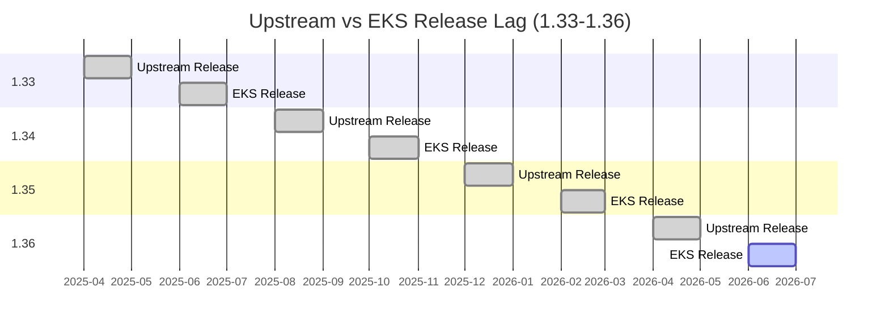
```mermaid
gantt
    title Upstream vs EKS Release Lag (1.33-1.36)
    dateFormat YYYY-MM
    axisFormat %Y-%m

    section 1.33
    Upstream Release    :done, u33, 2025-04, 2025-05
    EKS Release         :done, e33, 2025-06, 2025-07

    section 1.34
    Upstream Release    :done, u34, 2025-08, 2025-09
    EKS Release         :done, e34, 2025-10, 2025-11

    section 1.35
    Upstream Release    :done, u35, 2025-12, 2026-01
    EKS Release         :done, e35, 2026-02, 2026-03

    section 1.36
    Upstream Release    :done, u36, 2026-04, 2026-05
    EKS Release         :active, e36, 2026-06, 2026-07
```

### EKS Feature Gate Availability

すべての upstream Kubernetes feature gate が EKS で利用できるわけではありません。AWS が control plane configuration を管理するため、以下のようになります。

- **GA features**: 常に enabled（upstream と同じ）
- **Beta features (enabled by default)**: 一般に EKS で利用可能
- **Beta features (disabled by default)**: EKS support ticket が必要、または利用不可の場合あり
- **Alpha features**: EKS では利用不可（alpha features は EKS で決して enabled になりません）

```bash
# Check which feature gates are active on your EKS cluster's nodes
kubectl get --raw "/api/v1/nodes/$(kubectl get nodes -o jsonpath='{.items[0].metadata.name}')/proxy/configz" | \
  jq '.kubeletconfig.featureGates'

# Check API server feature gates via metrics
kubectl get --raw /metrics 2>/dev/null | grep kubernetes_feature_enabled | head -30
```

### EKS Managed Add-on Compatibility Matrix

EKS cluster を upgrade する際、add-on compatibility は重要です。各 Kubernetes version には特定の add-on version requirement があります。

| Add-on | K8s 1.31 | K8s 1.32 | K8s 1.33 | K8s 1.34 | K8s 1.35 | K8s 1.36 |
|--------|----------|----------|----------|----------|----------|----------|
| **VPC CNI** | v1.18+ | v1.19+ | v1.19+ | v1.20+ | v1.20+ | v1.21+ |
| **CoreDNS** | v1.11.1+ | v1.11.3+ | v1.12.0+ | v1.12.0+ | v1.12.1+ | v1.12.1+ |
| **kube-proxy** | v1.31.x | v1.32.x | v1.33.x | v1.34.x | v1.35.x | v1.36.x |
| **EBS CSI** | v1.35+ | v1.36+ | v1.37+ | v1.38+ | v1.39+ | v1.40+ |
| **EFS CSI** | v2.0+ | v2.1+ | v2.1+ | v2.2+ | v2.2+ | v2.3+ |
| **ADOT** | v0.102+ | v0.104+ | v0.106+ | v0.108+ | v0.110+ | v0.112+ |

> **Note**: specific patch version が必要な場合があるため、upgrade 前には必ず最新の [EKS add-on version compatibility](https://docs.aws.amazon.com/eks/latest/userguide/managing-add-ons.html) を確認してください。

```bash
# Check current add-on versions
aws eks describe-addon-versions --kubernetes-version 1.36 \
  --addon-name vpc-cni --query 'addons[].addonVersions[].addonVersion' --output table

# List all installed add-ons and their versions
aws eks list-addons --cluster-name my-cluster --output table
for addon in $(aws eks list-addons --cluster-name my-cluster --query 'addons[]' --output text); do
  version=$(aws eks describe-addon --cluster-name my-cluster --addon-name $addon \
    --query 'addon.addonVersion' --output text)
  echo "$addon: $version"
done
```

### EKS Auto Mode Version Support

EKS Auto Mode は node group を自動管理して cluster management を簡素化しますが、独自の version consideration があります。

| Feature | Behavior with Auto Mode |
|---------|------------------------|
| **Control plane upgrades** | EKS により managed（API/console 経由で trigger 可能） |
| **Node upgrades** | Auto Mode により automatically handled |
| **Version skew** | Auto Mode は control plane と nodes の間で n-1 skew を維持 |
| **Add-on updates** | Core add-ons は automatically managed |
| **Feature gates** | Node-level feature gates は Auto Mode により managed |

```bash
# Check Auto Mode status
aws eks describe-cluster --name my-cluster \
  --query 'cluster.computeConfig' --output json

# Verify Auto Mode node version alignment
kubectl get nodes -o custom-columns=\
NAME:.metadata.name,\
VERSION:.status.nodeInfo.kubeletVersion,\
INSTANCE_TYPE:.metadata.labels.'node\.kubernetes\.io/instance-type'
```

> **Important**: EKS Auto Mode を使用する場合、custom NodePool configuration が target Kubernetes version と compatible であることを確認してください。Auto Mode NodePools は upgrade 中に new AMI を自動採用しますが、custom configuration は manual verification が必要な場合があります。

### Extended Support Cost Analysis

extended support の financial impact を理解することで、team は upgrade planning の優先順位を付けやすくなります。

```
Cost Comparison: Standard vs Extended Support (per cluster)

Standard Support:  $0.10/hour  x  24 hours  x  365 days  =  $876/year
Extended Support:  $0.60/hour  x  24 hours  x  365 days  =  $5,256/year

Additional cost per cluster in extended support:  $4,380/year
```

| Clusters in Extended Support | Additional Annual Cost |
|-----------------------------|----------------------|
| 1 cluster | $4,380 |
| 5 clusters | $21,900 |
| 10 clusters | $43,800 |
| 25 clusters | $109,500 |
| 50 clusters | $219,000 |
| 100 clusters | $438,000 |

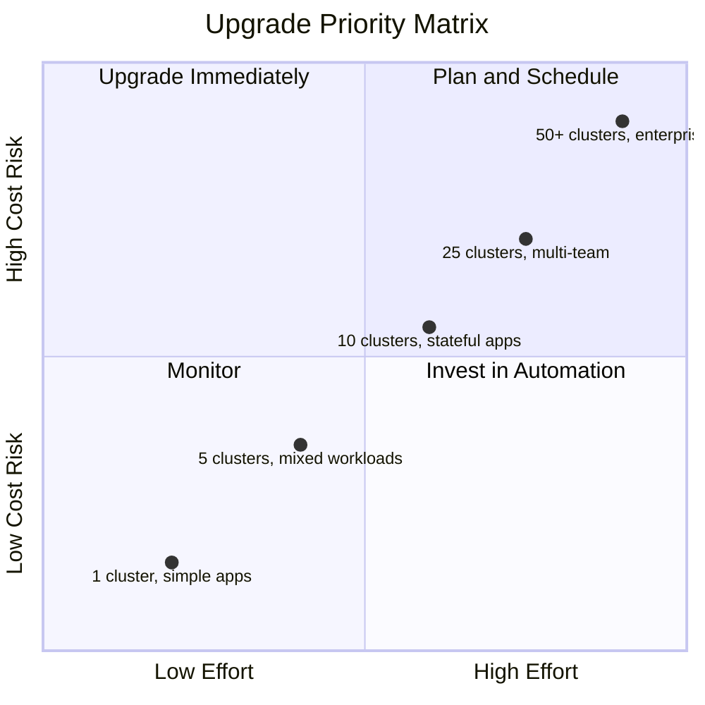
```mermaid
quadrantChart
    title Upgrade Priority Matrix
    x-axis Low Effort --> High Effort
    y-axis Low Cost Risk --> High Cost Risk
    quadrant-1 Plan and Schedule
    quadrant-2 Upgrade Immediately
    quadrant-3 Monitor
    quadrant-4 Invest in Automation
    "1 cluster, simple apps": [0.2, 0.15]
    "5 clusters, mixed workloads": [0.4, 0.35]
    "10 clusters, stateful apps": [0.6, 0.55]
    "25 clusters, multi-team": [0.75, 0.7]
    "50+ clusters, enterprise": [0.9, 0.9]
```

---

## 8. Version Upgrade Planning

### Feature Gate Testing Strategy

upgrade 前に、staging environment で新しい feature gate を test し、compatibility を確認してください。

```yaml
# Step 1: Enable feature gates in staging
# For EKS managed node groups, use a custom launch template
apiVersion: eksctl.io/v1alpha5
kind: ClusterConfig
metadata:
  name: staging-cluster
  region: us-west-2
managedNodeGroups:
  - name: test-nodes
    instanceType: m6i.xlarge
    desiredCapacity: 3
    kubelet:
      featureGates:
        InPlacePodVerticalScaling: true
        UserNamespacesSupport: true
```

```bash
# Step 2: Verify feature gates are active
kubectl get --raw "/api/v1/nodes/$(kubectl get nodes -o jsonpath='{.items[0].metadata.name}')/proxy/configz" | \
  jq '.kubeletconfig.featureGates'

# Step 3: Run feature-specific tests
# Example: Test in-place pod resize
cat <<EOF | kubectl apply -f -
apiVersion: v1
kind: Pod
metadata:
  name: resize-test
spec:
  containers:
    - name: test
      image: nginx:latest
      resources:
        requests:
          cpu: 100m
          memory: 128Mi
        limits:
          cpu: 200m
          memory: 256Mi
      resizePolicy:
        - resourceName: cpu
          restartPolicy: NotRequired
        - resourceName: memory
          restartPolicy: NotRequired
EOF

# Attempt resize
kubectl patch pod resize-test --subresource resize --patch '{
  "spec": {"containers": [{"name": "test", "resources": {"requests": {"cpu": "200m"},"limits": {"cpu": "400m"}}}]}
}'

# Verify resize succeeded
kubectl get pod resize-test -o jsonpath='{.status.resize}'
kubectl get pod resize-test -o jsonpath='{.status.containerStatuses[0].allocatedResources}'
```

### Pre-Upgrade Checklist by Version Jump

各 version upgrade を計画する際は、この checklist framework を使用してください。source version と target version に基づいて specific item を埋めます。

#### General Pre-Upgrade Checklist (All Versions)

```markdown
## Pre-Upgrade Checklist: v1.X -> v1.Y

### Phase 1: Assessment (1-2 weeks before)
- [ ] Review Kubernetes changelog for target version
- [ ] Review EKS release notes for target version
- [ ] Check deprecated API usage with `kubectl convert` or Pluto
- [ ] Verify add-on compatibility matrix
- [ ] Check third-party operator compatibility (cert-manager, Istio, ArgoCD, etc.)
- [ ] Review feature gate changes (new, graduated, removed)
- [ ] Test upgrade in staging/dev environment

### Phase 2: Preparation (1 week before)
- [ ] Back up etcd (EKS manages this, but verify backup schedule)
- [ ] Document current cluster state (versions, add-ons, node groups)
- [ ] Update IaC templates (Terraform, CDK, CloudFormation)
- [ ] Prepare rollback plan
- [ ] Schedule maintenance window
- [ ] Notify stakeholders

### Phase 3: Execution
- [ ] Upgrade control plane
- [ ] Verify API server health
- [ ] Upgrade managed add-ons (CoreDNS, kube-proxy, VPC CNI)
- [ ] Upgrade EBS CSI driver
- [ ] Upgrade node groups (rolling update)
- [ ] Verify node health and version
- [ ] Run smoke tests

### Phase 4: Validation
- [ ] Verify all workloads are running
- [ ] Check HPA/VPA functionality
- [ ] Validate ingress/networking
- [ ] Test service mesh (if applicable)
- [ ] Verify monitoring and alerting
- [ ] Check storage operations (PVC create, attach, resize)
- [ ] Run integration tests
```

#### Version-Specific Upgrade Notes

**Upgrading to 1.33 (from 1.32)**:
```markdown
Additional checks:
- [ ] Sidecar containers GA: Verify init containers with restartPolicy: Always work as expected
- [ ] In-Place Pod Resize beta: Test resize behavior with existing VPA configurations
- [ ] ServiceCIDR GA: If using custom Service CIDR, verify compatibility
- [ ] Topology Aware Routing GA: Review Service traffic distribution settings
```

**Upgrading to 1.34 (from 1.33)**:
```markdown
Additional checks:
- [ ] DRA GA: If using device plugins, plan migration to DRA
- [ ] KYAML beta: Audit YAML manifests for anchor/alias usage
- [ ] VolumeAttributesClass GA: Test volume modification workflows
- [ ] Namespace deletion changes: Verify namespace cleanup procedures
- [ ] User Namespaces GA: Test workloads with hostUsers: false
```

**Upgrading to 1.35 (from 1.34)**:
```markdown
Additional checks:
- [ ] In-Place Pod Resize GA: Full production use now safe
- [ ] KYAML enabled by default: Fix any YAML warnings before upgrade
- [ ] Gang Scheduling alpha: Not available on EKS (alpha)
- [ ] Remove deprecated feature gate overrides for 1.33 GA features
- [ ] Verify sidecar container feature gate is not explicitly set (removed in 1.35)
```

**Upgrading to 1.36 (from 1.35)**:
```markdown
Additional checks:
- [ ] KYAML GA: All YAML must pass KYAML validation (strict enforcement)
- [ ] Gang Scheduling GA: Evaluate for distributed workloads
- [ ] Pod-level In-Place Scaling beta: Test pod-level resource limits
- [ ] Remove deprecated feature gate overrides for 1.34 GA features
```

### API Compatibility Verification

```bash
#!/bin/bash
# api-compat-check.sh - Verify API compatibility before upgrade

TARGET_VERSION=${1:-"1.36"}
echo "=== API Compatibility Check for Kubernetes $TARGET_VERSION ==="

# Tool 1: Use kubectl convert (if available)
echo ""
echo "--- Checking with kubectl convert ---"
# Install convert plugin if not present
# kubectl krew install convert

# Tool 2: Use Pluto for deprecated API detection
echo ""
echo "--- Checking with Pluto ---"
if command -v pluto &> /dev/null; then
  echo "Scanning cluster for deprecated APIs..."
  pluto detect-all-in-cluster --target-versions k8s=v${TARGET_VERSION}
  
  echo ""
  echo "Scanning Helm releases..."
  pluto detect-helm --target-versions k8s=v${TARGET_VERSION}
else
  echo "Pluto not installed. Install with:"
  echo "  brew install FairwindsOps/tap/pluto"
  echo "  or: kubectl krew install deprecations"
fi

# Tool 3: Check with kubent (kube-no-trouble)
echo ""
echo "--- Checking with kubent ---"
if command -v kubent &> /dev/null; then
  kubent --target-version ${TARGET_VERSION}
else
  echo "kubent not installed. Install from: https://github.com/doitintl/kube-no-trouble"
fi

# Manual checks
echo ""
echo "--- Manual API Version Checks ---"

# Check for v1beta1 usage
echo "Resources using v1beta1 APIs:"
kubectl api-resources -o wide 2>/dev/null | grep v1beta1

# Check CRDs for deprecated API versions
echo ""
echo "CRDs with deprecated conversion webhooks:"
kubectl get crds -o json | jq -r '.items[] | select(.spec.conversion.webhook != null) | .metadata.name'

echo ""
echo "=== Compatibility Check Complete ==="
```

### Add-on Version Alignment

```bash
#!/bin/bash
# addon-alignment.sh - Verify add-on compatibility for target K8s version

CLUSTER_NAME=${1:-"my-cluster"}
TARGET_K8S_VERSION=${2:-"1.36"}

echo "=== Add-on Alignment Check ==="
echo "Cluster: $CLUSTER_NAME"
echo "Target K8s Version: $TARGET_K8S_VERSION"
echo ""

# Get current add-on versions
echo "--- Current Add-on Versions ---"
for addon in $(aws eks list-addons --cluster-name $CLUSTER_NAME --query 'addons[]' --output text); do
  current_version=$(aws eks describe-addon --cluster-name $CLUSTER_NAME --addon-name $addon \
    --query 'addon.addonVersion' --output text 2>/dev/null)
  echo "$addon: $current_version"
done

# Get compatible versions for target
echo ""
echo "--- Compatible Versions for K8s $TARGET_K8S_VERSION ---"
for addon in vpc-cni coredns kube-proxy aws-ebs-csi-driver; do
  echo ""
  echo "$addon:"
  aws eks describe-addon-versions \
    --addon-name $addon \
    --kubernetes-version $TARGET_K8S_VERSION \
    --query 'addons[].addonVersions[?compatibilities[?defaultVersion==`true`]].addonVersion' \
    --output text 2>/dev/null | head -5
  
  default_version=$(aws eks describe-addon-versions \
    --addon-name $addon \
    --kubernetes-version $TARGET_K8S_VERSION \
    --query 'addons[].addonVersions[?compatibilities[?defaultVersion==`true`]].addonVersion | [0]' \
    --output text 2>/dev/null)
  echo "  Default: $default_version"
done

echo ""
echo "=== Alignment Check Complete ==="
```

### Upgrade Execution Workflow

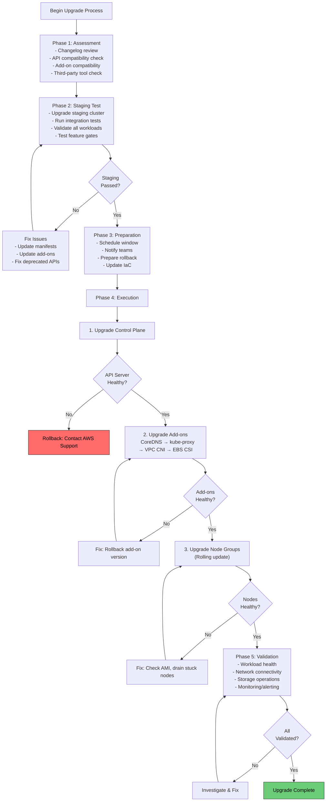
```mermaid
flowchart TD
    Start["Begin Upgrade Process"] --> Assess["Phase 1: Assessment
    - Changelog review
    - API compatibility check
    - Add-on compatibility
    - Third-party tool check"]
    
    Assess --> Staging["Phase 2: Staging Test
    - Upgrade staging cluster
    - Run integration tests
    - Validate all workloads
    - Test feature gates"]
    
    Staging --> StagePass{"Staging
    Passed?"}
    StagePass -->|No| Fix["Fix Issues
    - Update manifests
    - Update add-ons
    - Fix deprecated APIs"]
    Fix --> Staging
    
    StagePass -->|Yes| Prepare["Phase 3: Preparation
    - Schedule window
    - Notify teams
    - Prepare rollback
    - Update IaC"]
    
    Prepare --> Execute["Phase 4: Execution"]
    
    Execute --> CP["1. Upgrade Control Plane"]
    CP --> CPCheck{"API Server
    Healthy?"}
    CPCheck -->|No| CPRollback["Rollback: Contact AWS Support"]
    CPCheck -->|Yes| Addons["2. Upgrade Add-ons
    CoreDNS → kube-proxy → VPC CNI → EBS CSI"]
    
    Addons --> AddonCheck{"Add-ons
    Healthy?"}
    AddonCheck -->|No| AddonFix["Fix: Rollback add-on version"]
    AddonFix --> Addons
    AddonCheck -->|Yes| Nodes["3. Upgrade Node Groups
    (Rolling update)"]
    
    Nodes --> NodeCheck{"Nodes
    Healthy?"}
    NodeCheck -->|No| NodeFix["Fix: Check AMI, drain stuck nodes"]
    NodeFix --> Nodes
    NodeCheck -->|Yes| Validate["Phase 5: Validation
    - Workload health
    - Network connectivity
    - Storage operations
    - Monitoring/alerting"]
    
    Validate --> Pass{"All
    Validated?"}
    Pass -->|No| Investigate["Investigate & Fix"]
    Investigate --> Validate
    Pass -->|Yes| Complete["Upgrade Complete"]

    style Complete fill:#6bcb77,stroke:#333,color:black
    style CPRollback fill:#ff6b6b,stroke:#333,color:black
```

### Rollback Strategy

> **Update (2026-07-01)**: Amazon EKS は Kubernetes version rollback support を announcement しました。upgrade から 7 日以内であれば、control plane を previous minor version に rollback できます。API compatibility、version skew、add-on compatibility、cluster health を対象とする automated Rollback Readiness check が最初に実行されます。EKS Auto Mode cluster は自動的に rollback され、worker nodes は自動で戻り、control plane は順番に restore されます。追加 charge はなく、すべての region で利用可能です。以下の strategy は、7 日を過ぎた場合やこの feature が利用できない場合の fallback です。(Source: [Amazon EKS announces Kubernetes version rollback](https://aws.amazon.com/about-aws/whats-new/2026/07/amazon-eks-version-rollback))

```yaml
# Upgrade rollback strategy
rollback_strategy:

  control_plane:
    note: "Within 7 days: use EKS native version rollback / Beyond 7 days: blue-green cluster strategy"
    mitigation:
      - "Use EKS version rollback to restore the previous minor version immediately (within 7 days, no additional cost)"
      - "Beyond 7 days, fall back to a blue/green cluster strategy established before the upgrade"
      - "Shift traffic via Route 53 weighted routing"
      - "Migrate workloads to the new cluster"

  node_groups:
    strategy: "Create new node group + retain previous node group"
    steps:
      - "Do not immediately delete the previous version's node group"
      - "If issues arise, remove the taint from the previous node group"
      - "Add a taint to the new node group to shift traffic"

  workloads:
    strategy: "GitOps-based rollback"
    steps:
      - "Roll back to the previous commit in ArgoCD/Flux"
      - "Run a Helm rollback"

  addons:
    strategy: "Downgrade to the previous version"
    command: |
      aws eks update-addon \
        --cluster-name my-cluster \
        --addon-name vpc-cni \
        --addon-version <previous-version> \
        --resolve-conflicts OVERWRITE
```

---

## 9. Future Outlook

### Features in Active Development

Kubernetes community は container orchestration の境界を広げ続けています。ここでは、今後の release に登場する可能性がある active development 中の key feature と trend を示します。

#### Near-Term (Expected 1.37 - 1.38)

| Feature | Current State | Expected Timeline | Impact |
|---------|--------------|-------------------|--------|
| **Pod-Level In-Place Scaling GA** | Beta (1.36) | 1.37 | aggregate pod resource management |
| **MutatingAdmissionPolicy enhancements** | GA (1.36) | Ongoing | richer CEL mutation patterns |
| **Improved DRA partitioning** | Beta (1.36) | 1.37 | fine-grained GPU sharing |
| **Scheduler improvements** | Various | Ongoing | better bin-packing, queue management |

#### Medium-Term Trends

**AI/ML Workload Optimization**

Kubernetes は AI/ML workloads をよりよく support するため急速に進化しています。

- **DRA ecosystem growth**: specialized hardware（TPU、custom ASIC など）向け device driver の増加
- **Gang scheduling maturity**: strict co-scheduling requirement を持つ distributed training の support 向上
- **GPU time-slicing and MIG**: GPU partitioning の native Kubernetes support
- **Network-aware scheduling**: distributed training placement で network topology を考慮

**Security Hardening**

- **Sigstore integration**: container image 向け native supply chain security
- **Policy as Code maturity**: より complex な scenario を cover する CEL-based admission
- **Confidential containers**: TEE-based container isolation
- **Improved audit logging**: structured で queryable な audit event

**Developer Experience**

- **KYAML ecosystem**: より安全な YAML subset 向け tooling improvement
- **Improved CRD experience**: より良い validation、defaulting、conversion
- **Enhanced kubectl**: より強力な query、filtering、formatting option

### CNCF Ecosystem Trends

| Trend | Key Projects | Kubernetes Impact |
|-------|-------------|-------------------|
| **Platform Engineering** | Backstage, Crossplane, KRO | platform を構築するための platform としての Kubernetes |
| **eBPF Networking** | Cilium, Calico eBPF | iptables/nftables を完全に置き換え |
| **Service Mesh Evolution** | Istio Ambient, Cilium SM | sidecar-free mesh architectures |
| **GitOps Maturity** | ArgoCD, FluxCD | default としての declarative operations |
| **Observability** | OpenTelemetry | unified telemetry collection standard |
| **WebAssembly (Wasm)** | SpinKube, wasmCloud | より lightweight な workload execution |
| **AI Infrastructure** | KubeAI, vLLM operator | Kubernetes-native AI serving |

### Planning for the Future

Kubernetes strategy を計画する team 向けの推奨事項:

1. **Stay within n-1 of latest**: latest EKS release から 1 version 以上遅れないことを target にする
2. **Upgrade quarterly**: Kubernetes release cadence（4 か月ごと）に合わせる
3. **Test early**: EKS availability から数週間以内に staging cluster で new version を validate
4. **Automate upgrades**: cluster upgrade testing を含む CI/CD pipeline に投資する
5. **Monitor deprecations**: Kubernetes release announcement を subscribe し、changelog を proactive に review
6. **Adopt GA features promptly**: GA に到達した feature は production-ready であり、恒久的に enabled になります

---

## 10. References

### Official Kubernetes Resources

- [Kubernetes Release Page](https://kubernetes.io/releases/)
- [Kubernetes Changelog (GitHub)](https://github.com/kubernetes/kubernetes/blob/master/CHANGELOG/)
- [Kubernetes Feature Gates Reference](https://kubernetes.io/docs/reference/command-line-tools-reference/feature-gates/)
- [Kubernetes Enhancement Proposals (KEPs)](https://github.com/kubernetes/enhancements)
- [KEP Tracking Board](https://www.kubernetes.dev/resources/keps/)
- [Kubernetes Deprecation Policy](https://kubernetes.io/docs/reference/using-api/deprecation-policy/)
- [API Migration Guide](https://kubernetes.io/docs/reference/using-api/deprecation-guide/)
- [Kubernetes Blog - Release Announcements](https://kubernetes.io/blog/)
- [SIG Release](https://github.com/kubernetes/sig-release)

### Amazon EKS Resources

- [EKS Kubernetes Versions](https://docs.aws.amazon.com/eks/latest/userguide/kubernetes-versions.html)
- [EKS Release Calendar](https://docs.aws.amazon.com/eks/latest/userguide/kubernetes-versions.html#kubernetes-release-calendar)
- [EKS Extended Support](https://docs.aws.amazon.com/eks/latest/userguide/extended-support-control.html)
- [EKS Add-on Versions](https://docs.aws.amazon.com/eks/latest/userguide/managing-add-ons.html)
- [EKS Auto Mode](https://docs.aws.amazon.com/eks/latest/userguide/automode.html)
- [EKS Best Practices Guide](https://aws.github.io/aws-eks-best-practices/)
- [EKS Upgrade Guide](https://docs.aws.amazon.com/eks/latest/userguide/update-cluster.html)

### Tools for Upgrade Planning

- [Pluto - Deprecated API Detector](https://github.com/FairwindsOps/pluto)
- [kubent (kube-no-trouble)](https://github.com/doitintl/kube-no-trouble)
- [kubectl-convert Plugin](https://kubernetes.io/docs/tasks/tools/install-kubectl-linux/#install-kubectl-convert-plugin)
- [Nova - Helm Chart Version Checker](https://github.com/FairwindsOps/nova)
- [eksctl](https://eksctl.io/)

### Community Resources

- [Kubernetes Slack](https://kubernetes.slack.com) - #sig-release, #eks channels
- [CNCF Calendar](https://www.cncf.io/calendar/) - KubeCon and community events
- [The Kubernetes Podcast](https://kubernetespodcast.com/)
- [Release Team Shadows Program](https://github.com/kubernetes/sig-release/blob/master/release-team/shadows.md)

## Quiz

この document で学んだ内容を確認するには、[Kubernetes Version Features and Roadmap Quiz](../quizzes/eks/12-kubernetes-version-roadmap-quiz.md) に挑戦してください。

---

< [前へ: EKS Advanced Debugging](./11-eks-advanced-debugging.md) | [目次](./README.md) >
