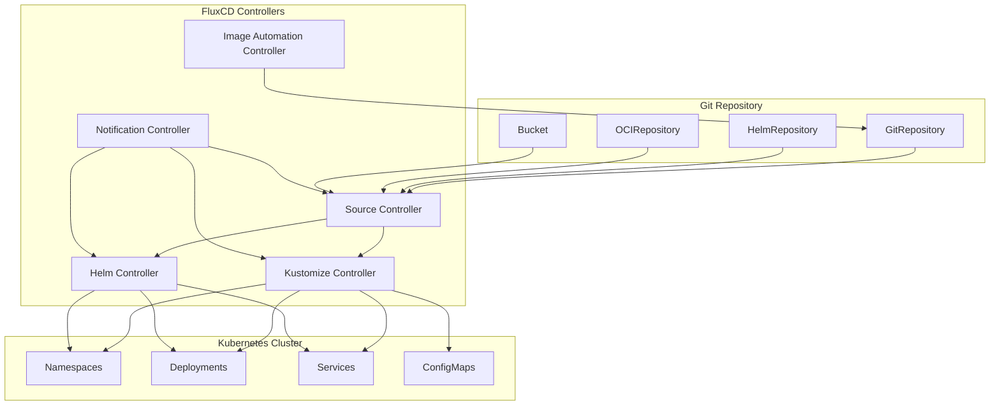

# FluxCD

> **サポート対象バージョン**: FluxCD v2.2+
> **最終更新**: February 22, 2026

FluxCD は、オープンで拡張可能な Kubernetes 向け継続的デリバリーおよびプログレッシブデリバリーのソリューション群です。FluxCD は 2022 年 11 月に CNCF を卒業し、クラウドネイティブエコシステムにおいて最も成熟した GitOps ツールの 1 つとなりました。

## 概要

FluxCD は、Kubernetes クラスターの望ましい状態を定義する信頼できる情報源として Git リポジトリを使用し、GitOps の原則を実装します。クラスターの状態が Git の設定と一致することを自動的に保証します。

### 主な機能

- **GitOps Native**: GitOps ワークフロー向けにゼロから構築
- **Multi-tenancy**: 分離された設定で複数のチームをサポート
- **Multi-cluster**: 単一の Git リポジトリから複数のクラスターを管理
- **Extensible**: 専用 Controller を備えたモジュラーアーキテクチャ
- **Kubernetes Native**: 設定に Custom Resource Definitions (CRD) を使用

## アーキテクチャの概要

FluxCD は、連携して GitOps ワークフローを実装する一連の専用 Controller で構成されています。



## コアコンポーネント

### Source Controller

Source Controller は、外部ソースから Artifact を取得する役割を担います。複数のソースタイプをサポートしています。

#### GitRepository

Git リポジトリを追跡し、他の Controller で利用できるようにします。

```yaml
apiVersion: source.toolkit.fluxcd.io/v1
kind: GitRepository
metadata:
  name: my-app
  namespace: flux-system
spec:
  interval: 1m
  url: https://github.com/my-org/my-app
  ref:
    branch: main
  secretRef:
    name: git-credentials
```

#### HelmRepository

Helm chart リポジトリを追跡します。

```yaml
apiVersion: source.toolkit.fluxcd.io/v1
kind: HelmRepository
metadata:
  name: bitnami
  namespace: flux-system
spec:
  interval: 1h
  url: https://charts.bitnami.com/bitnami
```

#### OCIRepository

OCI 準拠レジストリ（コンテナレジストリを含む）に保存された Artifact を追跡します。

```yaml
apiVersion: source.toolkit.fluxcd.io/v1beta2
kind: OCIRepository
metadata:
  name: my-artifacts
  namespace: flux-system
spec:
  interval: 5m
  url: oci://ghcr.io/my-org/my-artifacts
  ref:
    tag: latest
```

#### Bucket

S3 互換ストレージに保存された Artifact を追跡します。

```yaml
apiVersion: source.toolkit.fluxcd.io/v1beta2
kind: Bucket
metadata:
  name: my-bucket
  namespace: flux-system
spec:
  interval: 5m
  provider: aws
  bucketName: my-flux-bucket
  endpoint: s3.amazonaws.com
  region: us-east-1
  secretRef:
    name: aws-credentials
```

### Kustomize Controller

Kustomize Controller は、ソースから Kustomize overlay とプレーンな Kubernetes manifest を適用します。

#### Kustomization CRD

```yaml
apiVersion: kustomize.toolkit.fluxcd.io/v1
kind: Kustomization
metadata:
  name: my-app
  namespace: flux-system
spec:
  interval: 10m
  targetNamespace: production
  sourceRef:
    kind: GitRepository
    name: my-app
  path: ./deploy/production
  prune: true
  healthChecks:
    - apiVersion: apps/v1
      kind: Deployment
      name: my-app
      namespace: production
  timeout: 2m
```

#### 変数置換

FluxCD は `postBuild` を使用した変数置換をサポートしています。

```yaml
apiVersion: kustomize.toolkit.fluxcd.io/v1
kind: Kustomization
metadata:
  name: my-app
  namespace: flux-system
spec:
  interval: 10m
  sourceRef:
    kind: GitRepository
    name: my-app
  path: ./deploy
  postBuild:
    substitute:
      ENVIRONMENT: production
      REPLICAS: "3"
    substituteFrom:
      - kind: ConfigMap
        name: cluster-config
      - kind: Secret
        name: cluster-secrets
```

#### ヘルスチェック

デプロイされたリソース用のカスタムヘルスチェックを定義します。

```yaml
spec:
  healthChecks:
    - apiVersion: apps/v1
      kind: Deployment
      name: frontend
      namespace: production
    - apiVersion: apps/v1
      kind: StatefulSet
      name: database
      namespace: production
  timeout: 5m
```

### Helm Controller

Helm Controller は Helm chart release を宣言的に管理します。

#### HelmRelease CRD

```yaml
apiVersion: helm.toolkit.fluxcd.io/v2
kind: HelmRelease
metadata:
  name: nginx
  namespace: flux-system
spec:
  interval: 5m
  chart:
    spec:
      chart: nginx
      version: ">=15.0.0"
      sourceRef:
        kind: HelmRepository
        name: bitnami
        namespace: flux-system
  targetNamespace: web
  install:
    createNamespace: true
    remediation:
      retries: 3
  upgrade:
    remediation:
      retries: 3
  values:
    replicaCount: 2
    service:
      type: LoadBalancer
```

#### Values のオーバーライド

複数のソースから Helm values をオーバーライドします。

```yaml
spec:
  valuesFrom:
    - kind: ConfigMap
      name: nginx-values
      valuesKey: values.yaml
    - kind: Secret
      name: nginx-secrets
      valuesKey: credentials.yaml
  values:
    replicaCount: 3
```

#### Drift Detection

デプロイされたリソースが望ましい状態と一致するよう、drift detection を有効にします。

```yaml
spec:
  driftDetection:
    mode: enabled
    ignore:
      - paths: ["/spec/replicas"]
        target:
          kind: Deployment
```

### Notification Controller

Notification Controller は、受信および送信イベントを処理します。

#### Provider

アラート用の notification provider を設定します。

```yaml
apiVersion: notification.toolkit.fluxcd.io/v1beta3
kind: Provider
metadata:
  name: slack
  namespace: flux-system
spec:
  type: slack
  channel: flux-alerts
  secretRef:
    name: slack-webhook
```

サポートされる provider は次のとおりです。
- Slack
- Microsoft Teams
- Discord
- PagerDuty
- Opsgenie
- GitHub
- GitLab
- Grafana
- Generic webhooks

#### アラート

FluxCD イベント用のアラートを定義します。

```yaml
apiVersion: notification.toolkit.fluxcd.io/v1beta3
kind: Alert
metadata:
  name: on-call
  namespace: flux-system
spec:
  summary: "Cluster alerts"
  providerRef:
    name: slack
  eventSeverity: error
  eventSources:
    - kind: GitRepository
      name: '*'
    - kind: Kustomization
      name: '*'
    - kind: HelmRelease
      name: '*'
```

#### Receiver (Webhook)

外部イベント用の webhook を設定します。

```yaml
apiVersion: notification.toolkit.fluxcd.io/v1
kind: Receiver
metadata:
  name: github-receiver
  namespace: flux-system
spec:
  type: github
  events:
    - ping
    - push
  secretRef:
    name: github-webhook-token
  resources:
    - kind: GitRepository
      name: my-app
```

### Image Automation

FluxCD は、Git リポジトリ内のコンテナイメージタグを自動的に更新できます。

#### ImageRepository

新しいタグを検出するためにコンテナレジストリをスキャンします。

```yaml
apiVersion: image.toolkit.fluxcd.io/v1beta2
kind: ImageRepository
metadata:
  name: my-app
  namespace: flux-system
spec:
  image: ghcr.io/my-org/my-app
  interval: 1m
  secretRef:
    name: registry-credentials
```

#### ImagePolicy

イメージタグを選択するポリシーを定義します。

```yaml
apiVersion: image.toolkit.fluxcd.io/v1beta2
kind: ImagePolicy
metadata:
  name: my-app
  namespace: flux-system
spec:
  imageRepositoryRef:
    name: my-app
  policy:
    semver:
      range: ">=1.0.0"
```

#### ImageUpdateAutomation

新しいイメージが検出されたときの Git commit を自動化します。

```yaml
apiVersion: image.toolkit.fluxcd.io/v1beta2
kind: ImageUpdateAutomation
metadata:
  name: my-app
  namespace: flux-system
spec:
  interval: 30m
  sourceRef:
    kind: GitRepository
    name: my-app
  git:
    checkout:
      ref:
        branch: main
    commit:
      author:
        email: flux@my-org.com
        name: Flux
      messageTemplate: |
        Automated image update

        Automation: {{ .AutomationObject }}

        Files:
        {{ range $filename, $_ := .Changed.FileChanges -}}
        - {{ $filename }}
        {{ end -}}

        Objects:
        {{ range $resource, $changes := .Changed.Objects -}}
        - {{ $resource.Kind }} {{ $resource.Name }}
          {{- range $_, $change := $changes }}
          {{ $change.OldValue }} -> {{ $change.NewValue }}
          {{- end }}
        {{ end -}}
    push:
      branch: main
  update:
    path: ./deploy
    strategy: Setters
```

## インストール

### Flux CLI を使用する場合

Flux CLI をインストールします。

```bash
# macOS
brew install fluxcd/tap/flux

# Linux
curl -s https://fluxcd.io/install.sh | sudo bash

# Windows (Chocolatey)
choco install flux
```

### Bootstrap

クラスターで FluxCD を Bootstrap します。

```bash
# Bootstrap with GitHub
flux bootstrap github \
  --owner=my-org \
  --repository=fleet-infra \
  --branch=main \
  --path=clusters/production \
  --personal

# Bootstrap with GitLab
flux bootstrap gitlab \
  --owner=my-org \
  --repository=fleet-infra \
  --branch=main \
  --path=clusters/production
```

### インストールの確認

```bash
# Check Flux components
flux check

# Get all Flux resources
flux get all

# Watch for changes
flux get kustomizations --watch
```

## Flux を使用したマルチクラスター

FluxCD は、単一のリポジトリから複数のクラスターを管理することをサポートしています。

### Fleet リポジトリの構造

```
fleet-infra/
├── clusters/
│   ├── production/
│   │   ├── flux-system/
│   │   │   └── gotk-sync.yaml
│   │   └── apps.yaml
│   ├── staging/
│   │   ├── flux-system/
│   │   │   └── gotk-sync.yaml
│   │   └── apps.yaml
│   └── development/
│       ├── flux-system/
│       │   └── gotk-sync.yaml
│       └── apps.yaml
├── infrastructure/
│   ├── base/
│   │   ├── cert-manager/
│   │   ├── ingress-nginx/
│   │   └── monitoring/
│   └── overlays/
│       ├── production/
│       └── staging/
└── apps/
    ├── base/
    │   ├── frontend/
    │   └── backend/
    └── overlays/
        ├── production/
        └── staging/
```

### クラスター間の依存関係

```yaml
apiVersion: kustomize.toolkit.fluxcd.io/v1
kind: Kustomization
metadata:
  name: infrastructure
  namespace: flux-system
spec:
  interval: 1h
  sourceRef:
    kind: GitRepository
    name: fleet-infra
  path: ./infrastructure/overlays/production
  prune: true
---
apiVersion: kustomize.toolkit.fluxcd.io/v1
kind: Kustomization
metadata:
  name: apps
  namespace: flux-system
spec:
  dependsOn:
    - name: infrastructure
  interval: 10m
  sourceRef:
    kind: GitRepository
    name: fleet-infra
  path: ./apps/overlays/production
  prune: true
```

## Amazon EKS 上の FluxCD

### IRSA 統合

FluxCD 用に IAM Roles for Service Accounts (IRSA) を設定します。

```yaml
apiVersion: v1
kind: ServiceAccount
metadata:
  name: source-controller
  namespace: flux-system
  annotations:
    eks.amazonaws.com/role-arn: arn:aws:iam::ACCOUNT_ID:role/flux-source-controller
```

ECR アクセス用の IAM Policy:

```json
{
  "Version": "2012-10-17",
  "Statement": [
    {
      "Effect": "Allow",
      "Action": [
        "ecr:GetAuthorizationToken",
        "ecr:BatchCheckLayerAvailability",
        "ecr:GetDownloadUrlForLayer",
        "ecr:BatchGetImage"
      ],
      "Resource": "*"
    }
  ]
}
```

### ECR 統合

Amazon ECR からイメージを pull するよう FluxCD を設定します。

```yaml
apiVersion: source.toolkit.fluxcd.io/v1beta2
kind: OCIRepository
metadata:
  name: my-app
  namespace: flux-system
spec:
  interval: 5m
  url: oci://ACCOUNT_ID.dkr.ecr.us-east-1.amazonaws.com/my-app
  ref:
    tag: latest
  provider: aws
```

### S3 Bucket ソース

Artifact のソースとして S3 を使用します。

```yaml
apiVersion: source.toolkit.fluxcd.io/v1beta2
kind: Bucket
metadata:
  name: artifacts
  namespace: flux-system
spec:
  interval: 5m
  provider: aws
  bucketName: my-flux-artifacts
  endpoint: s3.us-east-1.amazonaws.com
  region: us-east-1
```

### CodeCommit 統合

AWS CodeCommit で FluxCD を Bootstrap します。

```bash
flux bootstrap git \
  --url=ssh://git-codecommit.us-east-1.amazonaws.com/v1/repos/fleet-infra \
  --branch=main \
  --path=clusters/production \
  --ssh-key-algorithm=rsa \
  --ssh-rsa-bits=4096
```

## ベストプラクティス

### リポジトリ構造

- 小規模なチームには monorepo を使用
- 大規模な組織ではインフラストラクチャとアプリケーションに別々のリポジトリを使用
- Kustomize で環境固有の overlay を実装

### セキュリティ

- sealed secret または external secret operator を使用
- マルチテナントのシナリオに RBAC を実装
- Receiver の webhook validation を有効化

### モニタリング

- reconciliation failure 用のアラートを設定
- Prometheus にメトリクスを export
- Flux component 用のダッシュボードをセットアップ

### パフォーマンス

- 変更頻度に基づいて reconciliation interval を調整
- Helm リポジトリに caching を使用
- 適切な timeout で health check を実装

## クイズ

学習内容を確認するには、[FluxCD クイズ](../quizzes/gitops/02-fluxcd-quiz.md)に挑戦してください。
