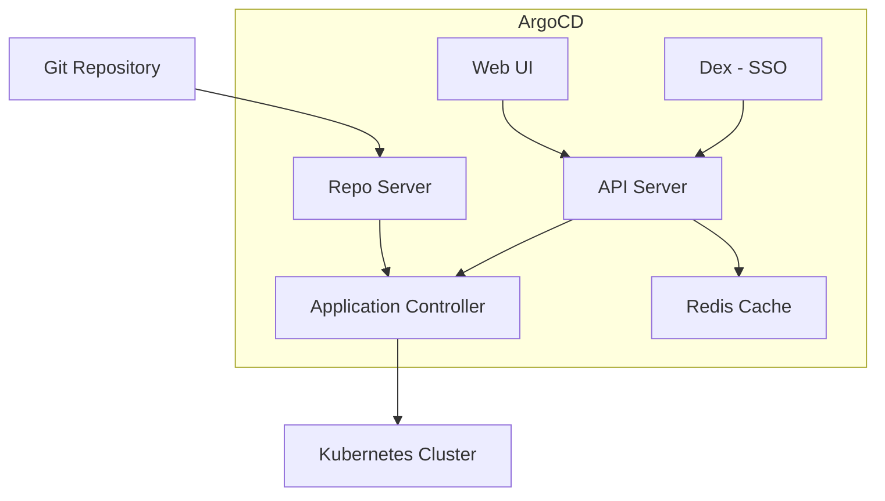
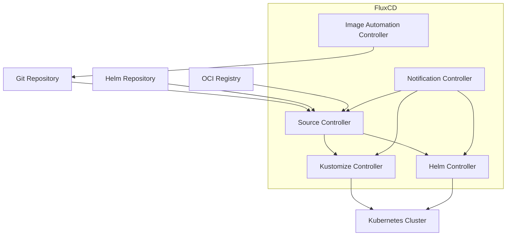

# GitOps ツールの比較

> **最終更新**: February 22, 2026

このガイドでは、Kubernetes エコシステムで最も人気のある 2 つの選択肢である ArgoCD と FluxCD に焦点を当て、GitOps ツールを包括的に比較します。

## 概要

GitOps は、アプリケーション開発で使用される DevOps のベストプラクティスをインフラストラクチャ自動化に適用する運用フレームワークです。CNCF エコシステムにおける主要な GitOps ツールは次の 2 つです。

- **ArgoCD**: Kubernetes 向けの宣言的な GitOps 継続的デリバリーツール
- **FluxCD**: Kubernetes 向けの継続的デリバリーおよびプログレッシブデリバリーのソリューション群

どちらも CNCF の卒業プロジェクトであり、成熟度と広範な採用を示しています。

## ArgoCD vs FluxCD: 直接比較

### 思想と設計

| 観点 | ArgoCD | FluxCD |
|--------|--------|--------|
| **アーキテクチャ** | UI を備えたモノリシックアプリケーション | Controller のモジュール式ツールキット |
| **設定** | Application 中心の CRD | Source 中心の CRD |
| **ユーザーインターフェイス** | 高機能な Web UI を同梱 | CLI 優先、組み込み UI なし |
| **学習曲線** | 初心者にとって緩やか | より急だが、柔軟性が高い |
| **デプロイメントモデル** | Pull ベースの GitOps | Pull ベースの GitOps |

### 機能比較

| 機能 | ArgoCD | FluxCD |
|---------|--------|--------|
| **Web UI** | 組み込み、高機能 | 含まれない（Weave GitOps を使用） |
| **CLI** | `argocd` CLI | `flux` CLI |
| **マルチテナンシー** | RBAC を備えた Project | Namespace 分離 |
| **マルチクラスター** | ネイティブサポート | ネイティブサポート |
| **Helm サポート** | 完全サポート | Helm Controller による完全サポート |
| **Kustomize サポート** | 完全サポート | Kustomize Controller による完全サポート |
| **OCI サポート** | Helm chart のみ | OCI artifact の完全サポート |
| **通知** | 組み込みの通知システム | Notification Controller |
| **RBAC** | 包括的な RBAC | Kubernetes ネイティブ RBAC |
| **SSO 統合** | OIDC、SAML、LDAP | Kubernetes 認証 |
| **ヘルスチェック** | 組み込みのリソースヘルス | カスタムヘルスチェック |
| **プログレッシブデリバリー** | Argo Rollouts 経由 | Flagger 経由 |
| **イメージ自動化** | Argo Image Updater 経由 | 組み込みの Image Automation |
| **差分プレビュー** | UI での視覚的な差分 | CLI 差分 |
| **Sync Wave** | ネイティブサポート | 依存関係経由 |
| **Hook** | PreSync、Sync、PostSync | ネイティブではない（Job を使用） |

### アーキテクチャの比較

#### ArgoCD アーキテクチャ



#### FluxCD アーキテクチャ



### コミュニティとエコシステム

| 指標 | ArgoCD | FluxCD |
|--------|--------|--------|
| **GitHub Stars** | ~17,000+ | ~6,500+ |
| **CNCF ステータス** | Graduated (Dec 2022) | Graduated (Nov 2022) |
| **初回リリース** | 2018 | 2016 (v1)、2020 (v2) |
| **主要メンテナー** | Intuit、Red Hat | Weaveworks、CNCF |
| **エコシステムツール** | Argo Workflows、Rollouts、Events | Flagger、Weave GitOps |

## ArgoCD を選択する場合

次のような場合、ArgoCD が最適です。

### ユースケース

1. **視覚的な管理**: デプロイメント管理にグラフィカルインターフェイスを好むチーム
2. **一元的な制御**: 複数のクラスターを単一の画面で管理したい組織
3. **包括的な RBAC**: チーム横断の複雑なアクセス制御要件
4. **SSO 統合**: OIDC/SAML 認証を必要とするエンタープライズ環境
5. **Sync Wave と Hook**: 順序要件を含む複雑なデプロイメントオーケストレーション

### 利点

- **高機能な Web UI**: デプロイメント管理のための直感的な視覚インターフェイス
- **Application 中心**: 開発者のデプロイメントに対する考え方に自然に対応
- **成熟したエコシステム**: Argo Workflows、Rollouts、Events との緊密な統合
- **エンタープライズ機能**: SSO、RBAC、監査ログを標準で提供
- **容易なデバッグ**: UI 上での視覚的な差分と同期ステータス

### シナリオ例

```
Scenario: Enterprise with 50+ microservices
- Multiple teams need self-service deployments
- Security team requires audit logs and RBAC
- Developers want visual feedback on sync status
- Need SSO integration with corporate identity provider

Recommendation: ArgoCD
- Projects per team with role-based access
- Application Sets for template-driven deployments
- Web UI for developer self-service
- Dex integration for SSO
```

## FluxCD を選択する場合

次のような場合、FluxCD が最適です。

### ユースケース

1. **モジュール式アーキテクチャ**: 必要な Controller だけを選択
2. **CLI 優先ワークフロー**: UI への依存がない GitOps ネイティブワークフロー
3. **イメージ自動化**: Git 内のコンテナイメージを自動更新
4. **OCI Artifact**: OCI registry から保存およびデプロイ
5. **軽量なフットプリント**: 最小限のリソース消費

### 利点

- **モジュール式設計**: 必要なものだけを使用
- **ネイティブ Image Automation**: 組み込みのコンテナイメージ更新
- **OCI サポート**: OCI artifact のファーストクラスサポート
- **Kubernetes ネイティブ**: 標準の Kubernetes RBAC を使用
- **低いリソース使用量**: メモリと CPU のフットプリントが小さい

### シナリオ例

```
Scenario: Platform team building internal developer platform
- Need automated image updates when CI builds new versions
- Want to store deployment artifacts in container registry
- Prefer CLI-driven GitOps workflows
- Multiple clusters with different configurations

Recommendation: FluxCD
- Image automation for continuous deployment
- OCI repositories for artifact storage
- Kustomize overlays for environment differences
- Multi-cluster management with fleet repo
```

## 両方を併用できるか？

はい。ArgoCD と FluxCD は、補完的なパターンで併用できます。

### パターン 1: インフラストラクチャに FluxCD、アプリケーションに ArgoCD

```
Git Repository
├── infrastructure/     # Managed by FluxCD
│   ├── cert-manager/
│   ├── ingress-nginx/
│   └── monitoring/
└── applications/       # Managed by ArgoCD
    ├── app-a/
    ├── app-b/
    └── app-c/
```

- FluxCD はクラスターインフラストラクチャ（operator、controller）を管理します
- ArgoCD は開発者向け UI を用いてアプリケーションデプロイメントを管理します

### パターン 2: ArgoCD デプロイメントでの FluxCD Image Automation

```
1. CI builds new image → pushes to registry
2. FluxCD Image Automation detects new tag
3. FluxCD commits updated manifest to Git
4. ArgoCD syncs the change to cluster
```

### パターン 3: クラスターごとに異なるツール

- 本番クラスター: ArgoCD（UI と監査要件のため）
- 開発クラスター: FluxCD（迅速な反復のため）

## 移行に関する考慮事項

### FluxCD から ArgoCD へ

1. FluxCD Kustomization を ArgoCD Application としてエクスポート
2. FluxCD source を ArgoCD repository にマッピング
3. HelmRelease を ArgoCD Helm Application に変換
4. ArgoCD で RBAC と SSO を設定

### ArgoCD から FluxCD へ

1. ArgoCD Application を Kustomization/HelmRelease に変換
2. Git/Helm repository を使用して Source Controller をセットアップ
3. アラート用に Notification Controller を設定
4. 必要に応じて Image Automation を実装

## その他の GitOps ツール

ArgoCD と FluxCD が GitOps の領域を主導していますが、他のツールも存在します。

### Jenkins X

- CI/CD パイプラインの自動化に焦点を当てる
- 組み込みのプレビュー環境
- Tekton ベースのパイプライン
- 最適な対象: GitOps と統合された CI/CD を求めるチーム

### Rancher Fleet

- 数千のクラスター管理向けに設計
- 大規模な GitOps
- Rancher と統合
- 最適な対象: 大規模なエッジデプロイメント

### Weave GitOps

- FluxCD 上に構築された商用製品
- Flux に UI とエンタープライズ機能を追加
- 最適な対象: UI を求める FluxCD ユーザー

## 意思決定マトリクス

| 要件 | 最適な選択 |
|-------------|-------------|
| Web UI が必要 | ArgoCD |
| CLI 優先ワークフロー | FluxCD |
| イメージ自動化 | FluxCD |
| 複雑な RBAC | ArgoCD |
| SSO 統合 | ArgoCD |
| 最小限のリソース | FluxCD |
| OCI artifact | FluxCD |
| Sync Wave/Hook | ArgoCD |
| 視覚的な差分 | ArgoCD |
| モジュール式デプロイメント | FluxCD |
| エンタープライズ監査 | ArgoCD |
| 大規模なマルチクラスター | 両方 |

## まとめ

ArgoCD と FluxCD はどちらも GitOps を実装するための優れた選択肢です。選定は多くの場合、次の点に集約されます。

- **ArgoCD を選択**: 高機能な UI、エンタープライズ機能、Application 中心の管理を重視する場合
- **FluxCD を選択**: モジュール性、CLI ワークフロー、組み込みのイメージ自動化を好む場合

多くの組織は、最も重要となる場面で各ツールの強みを活用し、異なる目的で両方のツールをうまく使用しています。

## クイズ

学習内容を確認するには、[GitOps ツール比較クイズ](../quizzes/gitops/03-gitops-comparison-quiz.md)に挑戦してください。
