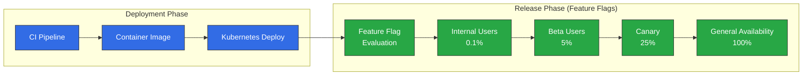
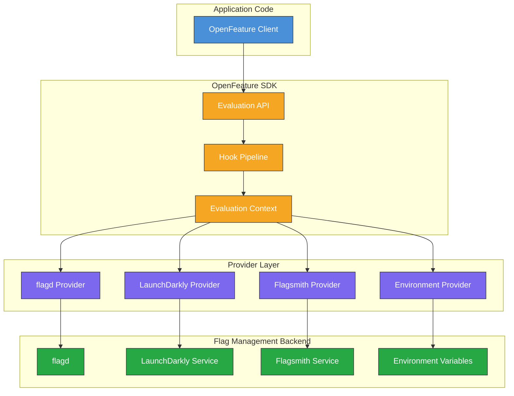
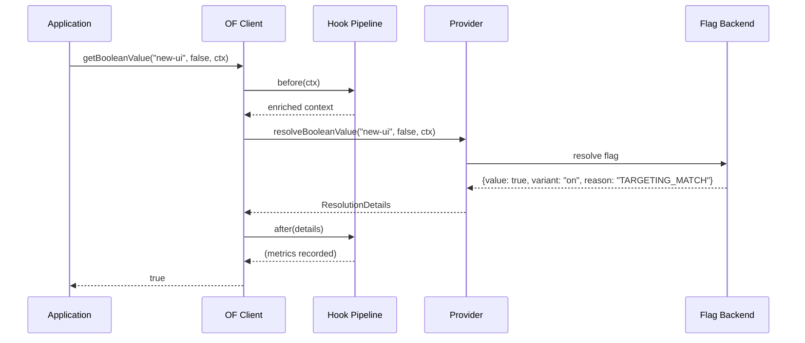
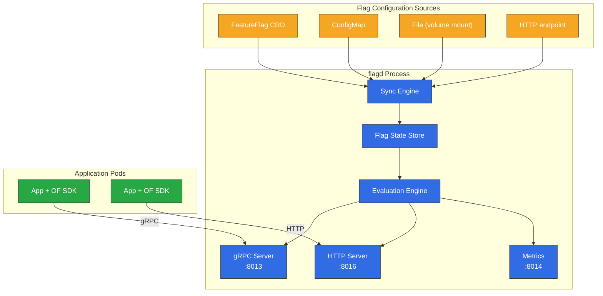
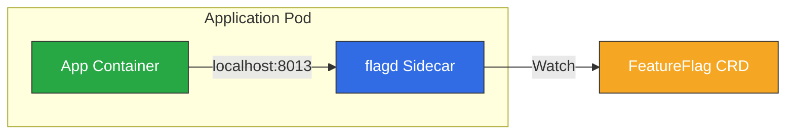
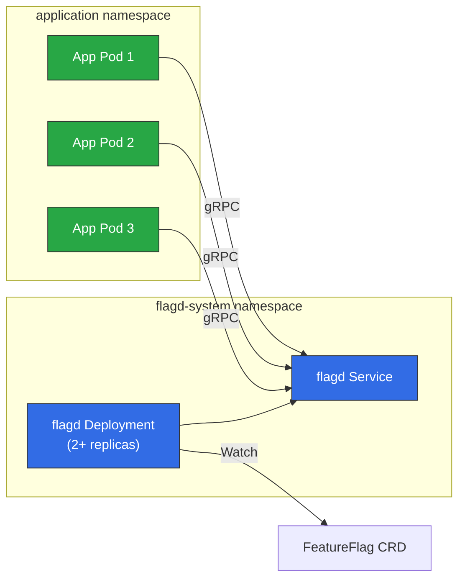
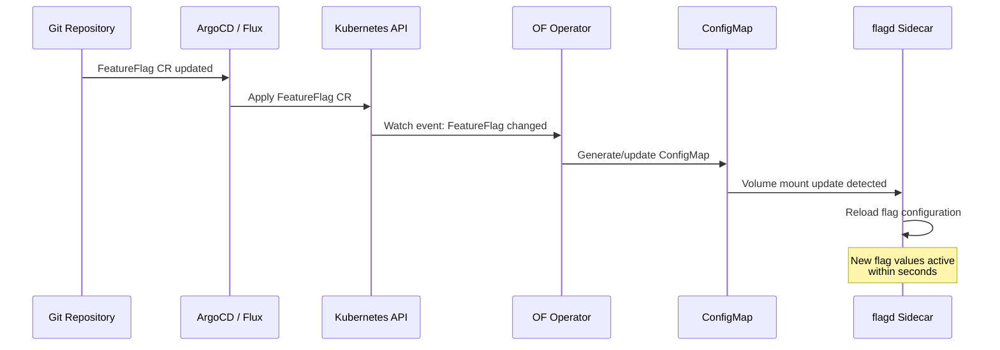
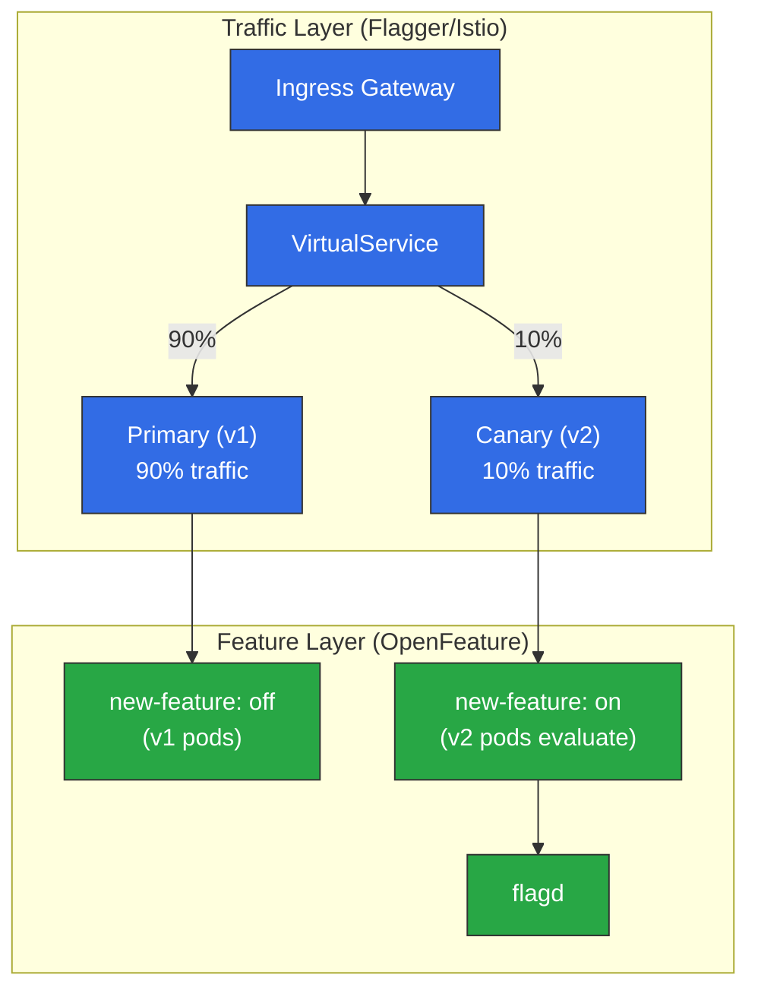
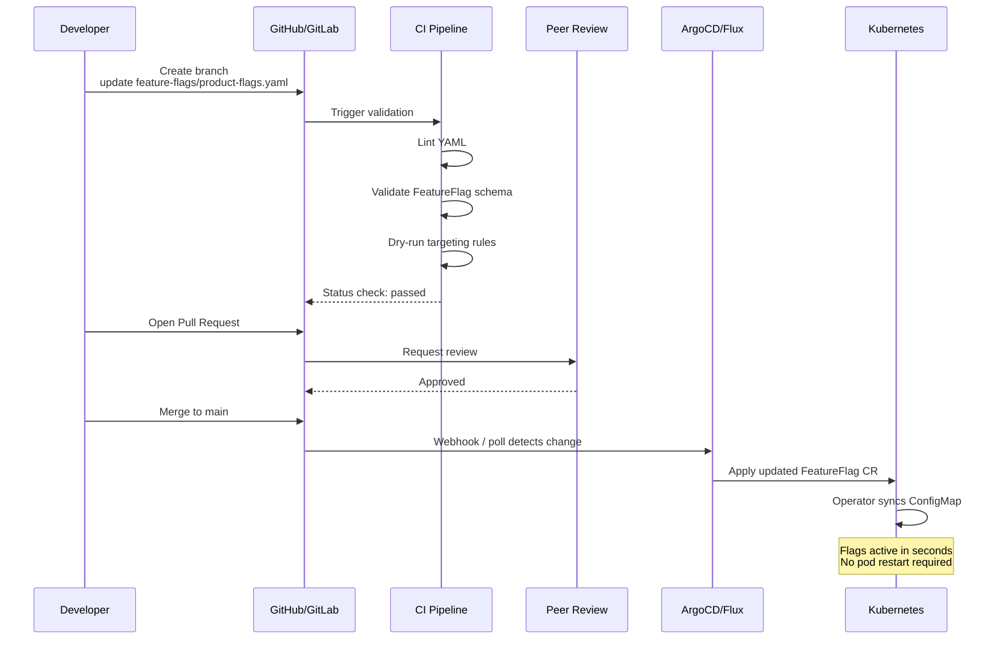
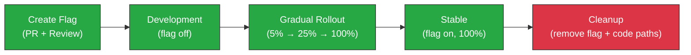

# Feature Flags と OpenFeature

> **サポート対象バージョン**: OpenFeature SDK v1.x、flagd v0.11+
> **最終更新**: June 2025

Feature flag は、Kubernetes におけるモダンなプログレッシブデリバリーの基盤となる手法です。エンジニアリングチームは Deployment とリリースを分離できるため、コードを再 Deployment せずに、安全なロールアウト、対象を絞った実験、即時ロールバックを実現できます。このガイドでは、OpenFeature 標準、参照実装である flagd、Kubernetes 用 OpenFeature Operator、GitOps ワークフロー向けの本番品質の統合パターンを取り上げます。

---

## 目次

- [概要と学習目標](#overview-and-learning-objectives)
- [OpenFeature アーキテクチャ](#openfeature-architecture)
- [Kubernetes 上の flagd](#flagd-on-kubernetes)
- [OpenFeature Operator](#openfeature-operator)
- [アプリケーション統合](#application-integration)
- [Canary リリースと Feature Flag の組み合わせ](#canary-release-and-feature-flag-combination)
- [GitOps 統合](#gitops-integration)
- [オブザーバビリティ](#observability)
- [本番環境のベストプラクティス](#production-best-practices)
- [参考資料](#references)

---

## 概要と学習目標

### 学習目標

このセクションを完了すると、次のことができるようになります。

- プログレッシブデリバリーと継続的 Deployment における Feature Flag の役割を説明する
- Feature Flag プラットフォームを比較し、環境に適したツールを選定する
- OpenFeature Operator を使用して Kubernetes に flagd を Deployment する
- Go、Java、Python、Node.js アプリケーションに OpenFeature SDK を統合する
- Feature Flag と Canary リリースを組み合わせて高度なロールアウト戦略を実現する
- GitOps ワークフローを通じて Feature Flag 設定をコードとして管理する
- Prometheus と Grafana で Flag 評価を監視する

### Feature Flag とは？

Feature Flag（Feature Toggle または Feature Switch とも呼ばれます）は、新しいコードを Deployment することなく、実行時に機能を有効または無効にできる仕組みです。基本的な考え方は単純で、Flag 値を確認する条件分岐でコードパスを囲み、その値を外部から制御します。

```
if featureEnabled("new-checkout-flow"):
    renderNewCheckout()
else:
    renderLegacyCheckout()
```

Feature Flag は、ソフトウェアデリバリーにおいて複数の異なる目的に使用されます。

| カテゴリ | 目的 | 有効期間 | 例 |
|----------|---------|----------|---------|
| **Release Flag** | Deployment とリリースを分離する | 数日から数週間 | 開発中は未完成の機能を Flag の背後に隠す |
| **Experiment Flag** | A/B テストとデータに基づく意思決定 | 数週間から数か月 | 料金ページのバリアント B をユーザーの 10% に表示する |
| **Ops Flag** | 運用制御と Circuit Breaker | 恒久的 | 重要度の低い下流依存先の Kill Switch |
| **Permission Flag** | 権限付与とアクセス制御 | 恒久的 | 有料顧客にのみプレミアム機能を有効化する |

### プログレッシブデリバリーにおける Feature Flag

プログレッシブデリバリーは、どのユーザーがいつ新しい機能を利用できるかをきめ細かく制御することで、継続的デリバリーを拡張します。Feature Flag はこのモデルの重要な構成要素です。



Feature Flag を使用すると、すべての Pod にコードを同時に Deployment しつつ、新しい動作を誰が見るかはアプリケーションレベルで制御できます。これは、リクエストがどの Pod バージョンに到達するかを制御するトラフィック分割アプローチ（Canary Deployment など）とは根本的に異なります。両方の手法は相互補完的であり、[Canary リリースと Feature Flag の組み合わせ](#canary-release-and-feature-flag-combination) セクションで説明します。

### Feature Flag ツールの比較

次の表は、Kubernetes エコシステムで広く使用される Feature Flag プラットフォームを比較したものです。

| 機能 | LaunchDarkly | Flagsmith | flagd | Split.io | Unleash |
|---------|-------------|-----------|-------|----------|---------|
| **Deployment モデル** | SaaS（オンプレミス向け Relay Proxy） | SaaS またはセルフホスト | セルフホスト（K8s ネイティブ） | SaaS（ハイブリッド可） | セルフホストまたは SaaS |
| **OpenFeature サポート** | 公式 Provider | 公式 Provider | 参照実装 | 公式 Provider | 公式 Provider |
| **Kubernetes Operator** | なし（Relay Proxy を使用） | なし | あり（OpenFeature Operator） | なし | なし |
| **CRD ベース設定** | なし | なし | あり（FeatureFlag CR） | なし | なし |
| **ターゲティングルール** | 高度（セグメント、ルール） | 高度（セグメント、ルール） | JSON ベースのルール | 高度（属性） | 戦略ベース |
| **監査ログ** | 組み込み | 組み込み | Kubernetes + OTel 経由 | 組み込み | 組み込み |
| **リアルタイム更新** | ストリーミング（SSE） | ストリーミング（SSE/WS） | gRPC 同期 / K8s watch | ストリーミング（SSE） | ポーリングまたは Webhook |
| **料金** | 商用 | 無料枠 + 商用 | 無料（OSS、CNCF） | 商用 | 無料（OSS）+ 商用 |
| **最適な用途** | 大規模エンタープライズ | セルフホストの柔軟性 | Cloud-native K8s ワークロード | 実験重視 | シンプルなセルフホスト要件 |

### OpenFeature 標準

OpenFeature は、Feature Flag 評価のためのベンダー中立でコミュニティ主導の API を提供する CNCF incubating project です。任意のバックエンド Provider と連携する標準インターフェースを定義することで、ベンダーロックインの問題を解決します。

OpenFeature の主な利点:

- **ベンダー中立 API**: アプリケーションコードを変更せずに Provider を切り替えられる
- **一貫した評価モデル**: Boolean、string、number、object の Flag 型と統一された評価 API
- **Hook**: ログ、メトリクス、検証、トレーシングのためのライフサイクル Hook
- **評価コンテキスト**: すべての評価に渡される構造化コンテキスト（ユーザー属性、環境情報）
- **マルチ言語サポート**: Go、Java、Python、Node.js、.NET、PHP などの公式 SDK

---

## OpenFeature アーキテクチャ

### SDK 構造

OpenFeature SDK は、評価 API と Flag 管理バックエンドを分離するレイヤードアーキテクチャに従います。



### コアコンポーネント

**評価 API**: アプリケーションコードが操作する主要インターフェースです。型付きの評価メソッド（`getBooleanValue`、`getStringValue`、`getNumberValue`、`getObjectValue`）と、評価のスコープを設定する `Client` 抽象化を提供します。

**Provider**: Provider は、OpenFeature SDK を特定の Flag 管理バックエンドに接続する具体的な実装です。任意の時点（ドメインごと）でアクティブにできる Provider は 1 つだけで、SDK はすべての Flag 解決をそれに委任します。

**評価コンテキスト**: Flag 評価のコンテキストを提供するキーと値の属性セットです。一般的な属性には `targetingKey`（ユーザー ID）、`email`、`region`、`environment`、カスタムプロパティがあります。コンテキストは評価パイプライン全体を通過します。

**Hook**: Hook は、次の 4 段階で Flag 評価ライフサイクルをインターセプトします。

| 段階 | タイミング | 主なユースケース |
|-------|--------|-----------------|
| `before` | 評価前 | コンテキストの拡充、入力の検証 |
| `after` | 評価成功後 | メトリクスの記録、判断のログ出力 |
| `error` | 評価失敗時 | エラー報告、フォールバックロジック |
| `finally` | 常に実行（try/finally と同様） | クリーンアップ、Span の完了 |

### Provider モデル

Provider の抽象化によって、OpenFeature はベンダー中立になります。各 Provider は標準インターフェースを実装します。

```
Provider Interface:
  - resolveBooleanValue(flagKey, defaultValue, context) -> ResolutionDetails
  - resolveStringValue(flagKey, defaultValue, context) -> ResolutionDetails
  - resolveNumberValue(flagKey, defaultValue, context) -> ResolutionDetails
  - resolveObjectValue(flagKey, defaultValue, context) -> ResolutionDetails
  - initialize(context) -> void
  - shutdown() -> void
  - onContextChange(oldCtx, newCtx) -> void
```

Provider を切り替えるには、設定コードの 1 行だけを変更します。

```go
// Switch from flagd to LaunchDarkly by changing only the provider
openfeature.SetProvider(flagd.NewProvider())        // Option A: flagd
openfeature.SetProvider(launchdarkly.NewProvider())  // Option B: LaunchDarkly
```

### 評価フロー

完全な Flag 評価は、次のシーケンスに従います。



---

## Kubernetes 上の flagd

### flagd とは？

flagd は、軽量なオープンソース Feature Flag デーモンであり、OpenFeature 準拠の Flag 評価エンジンの参照実装です。Cloud-native 環境向けに特別に設計され、Kubernetes 上でネイティブに実行されます。

主な特徴:

- **軽量**: 単一の Go バイナリ、最小限のリソースフットプリント（アイドル時メモリ約 20 MB）
- **Kubernetes ネイティブ**: FeatureFlag CRD、ConfigMap、またはファイルから Flag 設定を読み取る
- **gRPC と HTTP**: gRPC（ポート 8013）と HTTP（ポート 8016）で評価エンドポイントを公開する
- **リアルタイム同期**: Kubernetes リソースの変更を watch し、Flag の状態を即時に更新する
- **割合ベース評価**: 一貫性ハッシュを使用したパーセンテージベースのロールアウトを組み込みでサポート
- **ターゲティングルール**: 複雑なオーディエンスセグメンテーションのための JSON Logic ベースのターゲティング

### flagd アーキテクチャ



### Helm によるインストール

Helm を使用して flagd をスタンドアロン Deployment としてインストールします。

```bash
# Add the OpenFeature Helm repository
helm repo add openfeature https://open-feature.github.io/open-feature-operator/
helm repo update

# Install flagd standalone (without the operator)
helm install flagd openfeature/flagd \
  --namespace flagd-system \
  --create-namespace \
  --set replicas=2 \
  --set resources.requests.cpu=100m \
  --set resources.requests.memory=64Mi \
  --set resources.limits.cpu=500m \
  --set resources.limits.memory=256Mi \
  --set metrics.enabled=true
```

ほとんどの本番環境では、flagd インスタンスを自動管理する OpenFeature Operator（次のセクションを参照）をインストールする方法を推奨します。

### FeatureFlag CRD

OpenFeature Operator は、Feature Flag を Kubernetes リソースとして宣言できる `FeatureFlag` Custom Resource Definition を導入します。これは Kubernetes ネイティブな方法で Flag 設定を管理するための主要な仕組みです。

主要な Flag 型とターゲティングルールをすべて示す完全な `FeatureFlag` CR の例を次に示します。

```yaml
apiVersion: core.openfeature.dev/v1beta1
kind: FeatureFlag
metadata:
  name: product-flags
  namespace: default
  labels:
    app: product-service
    environment: production
spec:
  flagSpec:
    # --- Boolean flag: simple on/off toggle ---
    flags:
      new-checkout-flow:
        state: ENABLED
        variants:
          "on": true
          "off": false
        defaultVariant: "off"
        targeting:
          # Enable for internal users and 10% of external users
          if:
            - or:
              - in:
                - "@company.com"
                - var: email
              - in:
                - var: targetingKey
                - fractional:
                  - - "on"
                    - 10
                  - - "off"
                    - 90
            - "on"
            - "off"

      # --- String flag: multi-variant feature ---
      checkout-theme:
        state: ENABLED
        variants:
          classic: "classic-v1"
          modern: "modern-v2"
          experimental: "modern-v3-beta"
        defaultVariant: classic
        targeting:
          if:
            - in:
              - var: region
              - - "us-east-1"
                - "eu-west-1"
            - "modern"
            - "classic"

      # --- Number flag: configuration tuning ---
      api-rate-limit:
        state: ENABLED
        variants:
          low: 100
          standard: 500
          high: 2000
          unlimited: 10000
        defaultVariant: standard
        targeting:
          if:
            - "=="
              - var: tier
              - "premium"
            - "high"
            - "standard"

      # --- Object flag: complex configuration ---
      recommendation-config:
        state: ENABLED
        variants:
          default:
            algorithm: "collaborative-filtering"
            maxResults: 10
            includeSponsored: false
          enhanced:
            algorithm: "deep-learning-v2"
            maxResults: 20
            includeSponsored: true
            modelVersion: "2025-06"
        defaultVariant: default
        targeting:
          if:
            - in:
              - var: targetingKey
              - fractional:
                - - "enhanced"
                  - 25
                - - "default"
                  - 75
            - "enhanced"
            - "default"

      # --- Ops flag: emergency kill switch ---
      enable-external-recommendations:
        state: ENABLED
        variants:
          "on": true
          "off": false
        defaultVariant: "on"
        # No targeting rules: controlled purely by defaultVariant.
        # Set defaultVariant to "off" to disable the feature globally.
```

### Sidecar Injection とスタンドアロン Deployment

flagd は Kubernetes 上で 2 つのモードで実行できます。選択は、レイテンシ要件、運用モデル、リソース予算によって決まります。

**Sidecar モード**（OpenFeature Operator により Injection）:



**スタンドアロンモード**（集中型 Deployment）:



| 観点 | Sidecar | スタンドアロン |
|--------|---------|------------|
| **レイテンシ** | 最小（localhost） | やや高い（ネットワークホップ） |
| **リソース使用量** | Pod ごとに 1 つの flagd | Pod 間で共有 |
| **影響範囲** | Pod 単位の分離 | 共有。障害はすべてのコンシューマーに影響 |
| **スケーリング** | アプリケーション Pod とともにスケール | 独立してスケール |
| **設定** | Operator annotation により自動 | 手動の Helm/YAML 管理 |
| **最適な用途** | レイテンシに敏感な重要ワークロード | コスト重視、多数の小規模 Service |

---
## OpenFeature Operator

OpenFeature Operator は、flagd インスタンスのライフサイクルを管理し、Feature Flag 設定を同期する Kubernetes Operator です。本番 Kubernetes 環境で flagd を実行するための推奨方法です。

### インストール

```bash
# Install the OpenFeature Operator via Helm
helm repo add openfeature https://open-feature.github.io/open-feature-operator/
helm repo update

helm install open-feature-operator openfeature/open-feature-operator \
  --namespace open-feature-operator-system \
  --create-namespace \
  --set sidecarConfiguration.resources.requests.cpu=50m \
  --set sidecarConfiguration.resources.requests.memory=32Mi \
  --set sidecarConfiguration.resources.limits.cpu=200m \
  --set sidecarConfiguration.resources.limits.memory=128Mi
```

### Operator が導入する CRD

Operator は Feature Flag を管理するために複数の CRD を導入します。

| CRD | 目的 |
|-----|---------|
| `FeatureFlag` | Feature Flag 定義をインラインで宣言する（Flag キー、バリアント、ターゲティングルール） |
| `FeatureFlagSource` | ワークロード用の Flag 設定のソース（CRD、ファイル、HTTP）を指定する |

### FeatureFlagSource CRD

`FeatureFlagSource` リソースは、flagd が設定をどこから読み取るかを Operator に伝えます。1 つの `FeatureFlagSource` は複数のソースを参照でき、Operator がそれらをマージします。

```yaml
apiVersion: core.openfeature.dev/v1beta1
kind: FeatureFlagSource
metadata:
  name: product-service-flags
  namespace: default
spec:
  sources:
    # Source 1: FeatureFlag CR in the same namespace
    - source: product-flags          # Name of the FeatureFlag CR
      provider: kubernetes           # Read from Kubernetes CRD
    # Source 2: Shared flags from another namespace
    - source: global-flags
      provider: kubernetes
    # Source 3: External HTTP source (for third-party flag data)
    - source: https://flags.internal.company.com/api/v1/flags
      provider: http
      httpSyncBearerToken: "flag-sync-token"  # Token for auth
  # Port configuration for the injected flagd sidecar
  port: 8013
  metricsPort: 8014
  # flagd management port
  managementPort: 8015
  # Evaluation log format
  evaluator: json
  # Default sync provider
  defaultSyncProvider: kubernetes
```

### Pod 自動 Injection

Operator は annotation を使用して、flagd Sidecar コンテナをアプリケーション Pod に Injection します。Operator の mutating webhook が annotation を検出すると、Pod spec に flagd コンテナを自動追加します。

```yaml
apiVersion: apps/v1
kind: Deployment
metadata:
  name: product-service
  namespace: default
spec:
  replicas: 3
  selector:
    matchLabels:
      app: product-service
  template:
    metadata:
      labels:
        app: product-service
      annotations:
        # This annotation triggers flagd sidecar injection
        openfeature.dev/enabled: "true"
        # Reference the FeatureFlagSource to use
        openfeature.dev/flagsourcename: "product-service-flags"
    spec:
      containers:
        - name: product-service
          image: myregistry/product-service:v1.4.0
          ports:
            - containerPort: 8080
          env:
            # The flagd provider connects to localhost because the sidecar
            # runs in the same pod
            - name: FLAGD_HOST
              value: "localhost"
            - name: FLAGD_PORT
              value: "8013"
```

Operator がこの Deployment を処理すると、結果の Pod にはアプリケーションコンテナと flagd Sidecar の 2 つのコンテナが含まれ、Flag 設定は参照された `FeatureFlagSource` から取得されます。

### ConfigMap と CRD の同期

Operator は `FeatureFlag` CR の変更を watch し、flagd が読み取る対応する ConfigMap を生成または更新します。この同期フローは次のように動作します。



`FeatureFlag` CR を更新すると、Operator は Kubernetes watch API を通じて変更を検出し、Flag 仕様を含む ConfigMap を再生成します。flagd はファイル watcher を通じてその変更を取得します。いずれも Pod の再起動なしで実行されます。

---

## アプリケーション統合

### Go SDK

```go
package main

import (
    "context"
    "fmt"
    "log"

    "github.com/open-feature/go-sdk/openfeature"
    flagd "github.com/open-feature/go-sdk-contrib/providers/flagd/pkg"
)

func main() {
    // Initialize the flagd provider
    provider := flagd.NewProvider(
        flagd.WithHost("localhost"),
        flagd.WithPort(8013),
        flagd.WithResolverType(flagd.GRPC),
    )
    openfeature.SetProvider(provider)

    // Create a client scoped to a domain
    client := openfeature.NewClient("product-service")

    // Build evaluation context with user and environment attributes
    ctx := openfeature.NewEvaluationContext(
        "user-12345",  // targetingKey
        map[string]interface{}{
            "email":   "alice@company.com",
            "region":  "us-east-1",
            "tier":    "premium",
            "env":     "production",
        },
    )

    // Boolean flag evaluation
    newCheckout, _ := client.BooleanValue(
        context.Background(), "new-checkout-flow", false, ctx,
    )
    fmt.Printf("New checkout enabled: %v\n", newCheckout)

    // String flag evaluation
    theme, _ := client.StringValue(
        context.Background(), "checkout-theme", "classic-v1", ctx,
    )
    fmt.Printf("Theme: %s\n", theme)

    // Number flag evaluation
    rateLimit, _ := client.FloatValue(
        context.Background(), "api-rate-limit", 500, ctx,
    )
    fmt.Printf("Rate limit: %.0f\n", rateLimit)

    // Object flag evaluation (returns interface{})
    recoConfig, _ := client.ObjectValue(
        context.Background(), "recommendation-config",
        map[string]interface{}{"algorithm": "collaborative-filtering", "maxResults": 10},
        ctx,
    )
    fmt.Printf("Recommendation config: %v\n", recoConfig)

    // Detailed evaluation (includes reason, variant, metadata)
    details, _ := client.BooleanValueDetails(
        context.Background(), "new-checkout-flow", false, ctx,
    )
    fmt.Printf("Value: %v, Variant: %s, Reason: %s\n",
        details.Value, details.Variant, details.Reason)
}
```

### Java SDK

```java
import dev.openfeature.sdk.*;
import dev.openfeature.contrib.providers.flagd.FlagdProvider;
import dev.openfeature.contrib.providers.flagd.FlagdOptions;

public class ProductService {

    private final Client featureClient;

    public ProductService() {
        // Configure the flagd provider
        FlagdOptions options = FlagdOptions.builder()
            .host("localhost")
            .port(8013)
            .resolverType(FlagdOptions.ResolverType.GRPC)
            .deadline(500)  // evaluation timeout in ms
            .build();

        OpenFeatureAPI api = OpenFeatureAPI.getInstance();
        api.setProvider(new FlagdProvider(options));
        this.featureClient = api.getClient("product-service");
    }

    public void handleCheckout(User user) {
        // Build evaluation context
        MutableContext ctx = new MutableContext(user.getId());
        ctx.add("email", user.getEmail());
        ctx.add("region", user.getRegion());
        ctx.add("tier", user.getTier());

        // Boolean evaluation
        boolean newCheckout = featureClient.getBooleanValue(
            "new-checkout-flow", false, ctx
        );

        if (newCheckout) {
            processNewCheckout(user);
        } else {
            processLegacyCheckout(user);
        }

        // String evaluation
        String theme = featureClient.getStringValue(
            "checkout-theme", "classic-v1", ctx
        );
        renderWithTheme(theme);

        // Number evaluation
        int rateLimit = featureClient.getIntegerValue(
            "api-rate-limit", 500, ctx
        );
        applyRateLimit(rateLimit);

        // Object evaluation
        Value recoConfig = featureClient.getObjectValue(
            "recommendation-config",
            new Value(Structure.mapToStructure(
                Map.of("algorithm", new Value("collaborative-filtering"))
            )),
            ctx
        );
        configureRecommendations(recoConfig.asStructure());
    }

    // Detailed evaluation with reason and variant
    public void logFlagDecision(String flagKey, User user) {
        MutableContext ctx = new MutableContext(user.getId());
        FlagEvaluationDetails<Boolean> details =
            featureClient.getBooleanDetails(flagKey, false, ctx);

        logger.info("Flag: {}, Value: {}, Variant: {}, Reason: {}",
            flagKey, details.getValue(),
            details.getVariant(), details.getReason());
    }
}
```

### Python SDK

```python
from openfeature import api
from openfeature.evaluation_context import EvaluationContext
from openfeature.contrib.provider.flagd import FlagdProvider
from openfeature.contrib.provider.flagd.config import ResolverType

# Initialize the provider
provider = FlagdProvider(
    host="localhost",
    port=8013,
    resolver_type=ResolverType.GRPC,
    deadline_ms=500,
)
api.set_provider(provider)

# Create a client
client = api.get_client("product-service")


def handle_request(user: dict):
    """Handle an incoming request with feature flag evaluation."""

    # Build evaluation context
    ctx = EvaluationContext(
        targeting_key=user["id"],
        attributes={
            "email": user["email"],
            "region": user.get("region", "us-east-1"),
            "tier": user.get("tier", "free"),
            "env": "production",
        },
    )

    # Boolean flag
    new_checkout = client.get_boolean_value("new-checkout-flow", False, ctx)
    if new_checkout:
        return render_new_checkout(user)

    # String flag
    theme = client.get_string_value("checkout-theme", "classic-v1", ctx)

    # Number flag
    rate_limit = client.get_integer_value("api-rate-limit", 500, ctx)

    # Object flag
    reco_config = client.get_object_value(
        "recommendation-config",
        {"algorithm": "collaborative-filtering", "maxResults": 10},
        ctx,
    )

    # Detailed evaluation
    details = client.get_boolean_details("new-checkout-flow", False, ctx)
    print(
        f"Flag: new-checkout-flow, Value: {details.value}, "
        f"Variant: {details.variant}, Reason: {details.reason}"
    )

    return render_legacy_checkout(user, theme, rate_limit, reco_config)
```

### Node.js SDK

```typescript
import { OpenFeature, EvaluationContext } from '@openfeature/server-sdk';
import { FlagdProvider } from '@openfeature/flagd-provider';

// Initialize the provider
const provider = new FlagdProvider({
  host: 'localhost',
  port: 8013,
  resolverType: 'grpc',
  deadlineMs: 500,
});

OpenFeature.setProvider(provider);

// Create a client
const client = OpenFeature.getClient('product-service');

interface User {
  id: string;
  email: string;
  region: string;
  tier: string;
}

async function handleCheckout(user: User): Promise<void> {
  // Build evaluation context
  const ctx: EvaluationContext = {
    targetingKey: user.id,
    email: user.email,
    region: user.region,
    tier: user.tier,
    env: 'production',
  };

  // Boolean flag
  const newCheckout = await client.getBooleanValue(
    'new-checkout-flow',
    false,
    ctx,
  );

  if (newCheckout) {
    await processNewCheckout(user);
  } else {
    await processLegacyCheckout(user);
  }

  // String flag
  const theme = await client.getStringValue(
    'checkout-theme',
    'classic-v1',
    ctx,
  );

  // Number flag
  const rateLimit = await client.getNumberValue(
    'api-rate-limit',
    500,
    ctx,
  );

  // Object flag
  const recoConfig = await client.getObjectValue(
    'recommendation-config',
    { algorithm: 'collaborative-filtering', maxResults: 10 },
    ctx,
  );

  // Detailed evaluation with metadata
  const details = await client.getBooleanDetails(
    'new-checkout-flow',
    false,
    ctx,
  );
  console.log(
    `Flag: new-checkout-flow, Value: ${details.value}, ` +
    `Variant: ${details.variant}, Reason: ${details.reason}`,
  );
}
```

### ターゲティングルールの詳細

flagd はターゲティングルールに JSON Logic を使用します。一般的なターゲティングパターンを以下に示します。

**パーセンテージベースのロールアウト（一貫性ハッシュ）**:

`fractional` 演算子は `targetingKey` をハッシュ関数の入力として使用するため、同じユーザーには常に同じバリアントが表示されます。

```yaml
targeting:
  if:
    - in:
      - var: targetingKey
      - fractional:
        - - "on"
          - 20    # 20% of users
        - - "off"
          - 80    # 80% of users
    - "on"
    - "off"
```

**属性ベースのターゲティング（region、tier など）**:

```yaml
targeting:
  if:
    - and:
      - "=="
        - var: region
        - "us-east-1"
      - in:
        - var: tier
        - - "premium"
          - "enterprise"
    - "enhanced"
    - "default"
```

**組み合わせターゲティング（内部ユーザー OR パーセンテージ）**:

```yaml
targeting:
  if:
    - or:
      - ends_with:
        - var: email
        - "@company.com"
      - in:
        - var: targetingKey
        - fractional:
          - - "on"
            - 5
          - - "off"
            - 95
    - "on"
    - "off"
```

---
## Canary リリースと Feature Flag の組み合わせ

Feature Flag と Canary リリースは相互補完的な戦略です。Canary リリースはインフラストラクチャレベル（どの Pod バージョンがリクエストを処理するか）でトラフィックを制御し、Feature Flag はアプリケーションレベル（どのコードパスを実行するか）で動作を制御します。両方を組み合わせることで、最高レベルのリリース安全性を提供します。

### アーキテクチャ: Flagger + Feature Flag



### Flagger + Feature Flag ワークフロー

次のワークフローでは、トラフィック管理には Flagger を使用し、Canary Pod 内でのきめ細かな制御には Feature Flag を使用します。

**フェーズ 1 -- Flag をオフにして Deployment**: Flag（デフォルト: off）の背後に新機能を置いた v2 をリリースします。Flagger は v2 へ少量のトラフィックのルーティングを開始します。

**フェーズ 2 -- 内部ユーザー向けに Flag を有効化**: `@company.com` に一致するユーザーに対して機能を有効にするよう、`FeatureFlag` CR を更新します。v2 Pod に到達した内部ユーザーには新機能が表示され、それ以外の v2 ユーザーには以前の動作が表示されます。

**フェーズ 3 -- パーセンテージロールアウト**: ターゲティングルールを全ユーザーの 10% に拡大します。Flagger の分析を通じてエラー率とレイテンシを監視します。

**フェーズ 4 -- 完全ロールアウト**: メトリクスが健全であれば、Flagger は v2 を Primary に昇格させ、Feature Flag を 100% に開放します。

Flagger Canary リソースの例:

```yaml
apiVersion: flagger.app/v1beta1
kind: Canary
metadata:
  name: product-service
  namespace: default
spec:
  targetRef:
    apiVersion: apps/v1
    kind: Deployment
    name: product-service
  service:
    port: 8080
  analysis:
    interval: 1m
    threshold: 5
    maxWeight: 50
    stepWeight: 10
    metrics:
      - name: request-success-rate
        thresholdRange:
          min: 99
        interval: 1m
      - name: request-duration
        thresholdRange:
          max: 500
        interval: 1m
      # Custom metric: feature flag error rate
      - name: feature-flag-error-rate
        templateRef:
          name: feature-flag-errors
          namespace: flagger-system
        thresholdRange:
          max: 1
        interval: 1m
```

### Feature Flag による A/B テスト

Feature Flag により、ユーザー割り当てが決定的でインフラストラクチャのルーティングから独立した、真の A/B テストが可能になります。

```yaml
apiVersion: core.openfeature.dev/v1beta1
kind: FeatureFlag
metadata:
  name: ab-test-pricing
  namespace: default
spec:
  flagSpec:
    flags:
      pricing-page-variant:
        state: ENABLED
        variants:
          control: "pricing-v1"
          variant-a: "pricing-v2-annual-first"
          variant-b: "pricing-v2-monthly-first"
        defaultVariant: control
        targeting:
          if:
            - in:
              - var: targetingKey
              - fractional:
                - - "control"
                  - 34
                - - "variant-a"
                  - 33
                - - "variant-b"
                  - 33
            - fractional:
              - - "control"
                - 34
              - - "variant-a"
                - 33
              - - "variant-b"
                - 33
```

`fractional` は `targetingKey` に対する一貫性ハッシュを使用するため、各ユーザーはセッションをまたいでも常に同じバリアントを表示します。これは有効な A/B テスト結果に不可欠です。

### Dark Launch パターン

Dark Launch は、新機能を本番環境に Deployment しつつ、内部ユーザーまたは Shadow Pipeline にのみ公開する方法です。Feature Flag を使うとこれを簡単に実現できます。

```yaml
apiVersion: core.openfeature.dev/v1beta1
kind: FeatureFlag
metadata:
  name: dark-launch-payment-v2
  namespace: default
spec:
  flagSpec:
    flags:
      payment-engine-v2:
        state: ENABLED
        variants:
          "on": true
          "off": false
        defaultVariant: "off"
        targeting:
          # Only enable for specific internal test accounts
          if:
            - in:
              - var: targetingKey
              - - "test-user-001"
                - "test-user-002"
                - "qa-bot-001"
            - "on"
            - "off"
```

アプリケーションコードは古いパスと新しいパスの両方を同時に処理しますが、Flag がオンの場合にのみ新しいパスの結果を返します。

```go
func processPayment(order Order, ctx openfeature.EvaluationContext) Result {
    // Always run the legacy path
    legacyResult := legacyPaymentEngine.Process(order)

    // Check if the new engine should be used
    useV2, _ := client.BooleanValue(context.Background(), "payment-engine-v2", false, ctx)

    if useV2 {
        newResult := paymentEngineV2.Process(order)
        // Compare results for validation (optional)
        compareResults(legacyResult, newResult)
        return newResult
    }

    return legacyResult
}
```

### メトリクスベースの自動ロールアウト

Flagger の分析と Feature Flag メトリクスを組み合わせて、ロールアウトを自動的に進行または中止します。

```yaml
apiVersion: flagger.app/v1beta1
kind: MetricTemplate
metadata:
  name: feature-flag-errors
  namespace: flagger-system
spec:
  provider:
    type: prometheus
    address: http://prometheus.monitoring:9090
  query: |
    100 - (
      sum(rate(
        flagd_impression_total{
          key="new-checkout-flow",
          reason!="ERROR"
        }[1m]
      )) /
      sum(rate(
        flagd_impression_total{
          key="new-checkout-flow"
        }[1m]
      )) * 100
    )
```

---

## GitOps 統合

### コードとしての Feature Flag

Git 経由で Feature Flag を管理すると、インフラストラクチャに対する GitOps と同じ利点が得られます。すなわち、バージョン履歴、Pull Request レビュー、自動 Deployment、監査証跡です。`FeatureFlag` CRD により、これは自然に実現できます。Flag 設定は Git に保存される単なる別の Kubernetes マニフェストです。

推奨リポジトリレイアウト:

```
gitops-repo/
├── base/
│   ├── namespaces.yaml
│   └── ...
├── apps/
│   ├── product-service/
│   │   ├── deployment.yaml
│   │   ├── service.yaml
│   │   ├── feature-flags/
│   │   │   ├── product-flags.yaml       # FeatureFlag CR
│   │   │   └── flag-source.yaml         # FeatureFlagSource CR
│   │   └── kustomization.yaml
│   └── checkout-service/
│       ├── deployment.yaml
│       ├── feature-flags/
│       │   └── checkout-flags.yaml
│       └── kustomization.yaml
├── platform/
│   └── open-feature-operator/
│       ├── helmrelease.yaml
│       └── values.yaml
└── environments/
    ├── dev/
    │   └── patches/
    │       └── feature-flags-dev.yaml    # Dev-specific flag overrides
    ├── staging/
    │   └── patches/
    │       └── feature-flags-staging.yaml
    └── production/
        └── patches/
            └── feature-flags-prod.yaml
```

### ArgoCD FeatureFlag CR の Deployment

Feature Flag リソースを管理する ArgoCD Application を定義します。

```yaml
apiVersion: argoproj.io/v1alpha1
kind: Application
metadata:
  name: product-service-flags
  namespace: argocd
spec:
  project: default
  source:
    repoURL: https://github.com/org/gitops-repo.git
    targetRevision: main
    path: apps/product-service/feature-flags
  destination:
    server: https://kubernetes.default.svc
    namespace: default
  syncPolicy:
    automated:
      prune: true
      selfHeal: true
    syncOptions:
      - CreateNamespace=true
    retry:
      limit: 3
      backoff:
        duration: 5s
        factor: 2
        maxDuration: 1m
```

### Flux FeatureFlag CR の Deployment

FluxCD では、Kustomization リソースを使用します。

```yaml
apiVersion: kustomize.toolkit.fluxcd.io/v1
kind: Kustomization
metadata:
  name: product-service-flags
  namespace: flux-system
spec:
  interval: 5m
  sourceRef:
    kind: GitRepository
    name: gitops-repo
  path: ./apps/product-service/feature-flags
  prune: true
  targetNamespace: default
  healthChecks:
    - apiVersion: core.openfeature.dev/v1beta1
      kind: FeatureFlag
      name: product-flags
      namespace: default
```

### PR ベースの Flag 変更ワークフロー

Feature Flag 変更の Pull Request ワークフローは、安全性とトレーサビリティを提供します。



**CI 検証例**（GitHub Actions）:

```yaml
name: Validate Feature Flags
on:
  pull_request:
    paths:
      - '**/feature-flags/**'

jobs:
  validate:
    runs-on: ubuntu-latest
    steps:
      - uses: actions/checkout@v4

      - name: Validate YAML syntax
        run: |
          find . -path '*/feature-flags/*.yaml' -exec yamllint -d relaxed {} +

      - name: Validate FeatureFlag schema
        run: |
          # Use kubeconform with the OpenFeature CRD schema
          find . -path '*/feature-flags/*.yaml' \
            -exec kubeconform \
              -schema-location 'https://raw.githubusercontent.com/open-feature/open-feature-operator/main/config/crd/bases/core.openfeature.dev_featureflags.yaml' \
              {} +

      - name: Check targeting rules
        run: |
          # Custom script to validate JSON Logic targeting rules
          python scripts/validate-targeting-rules.py \
            --flags-dir apps/*/feature-flags/
```

### Kustomize による環境固有の Override

Kustomize patch を使用して、環境ごとに異なる Flag 状態を維持します。

```yaml
# environments/production/patches/feature-flags-prod.yaml
apiVersion: core.openfeature.dev/v1beta1
kind: FeatureFlag
metadata:
  name: product-flags
spec:
  flagSpec:
    flags:
      new-checkout-flow:
        # Production: conservative 5% rollout
        defaultVariant: "off"
        targeting:
          if:
            - in:
              - var: targetingKey
              - fractional:
                - - "on"
                  - 5
                - - "off"
                  - 95
            - "on"
            - "off"
```

```yaml
# environments/dev/patches/feature-flags-dev.yaml
apiVersion: core.openfeature.dev/v1beta1
kind: FeatureFlag
metadata:
  name: product-flags
spec:
  flagSpec:
    flags:
      new-checkout-flow:
        # Dev: always on
        defaultVariant: "on"
```

---
## オブザーバビリティ

### Flag 評価メトリクス（Prometheus）

flagd はメトリクスポート（デフォルト: 8014）で Prometheus メトリクスを公開します。Feature Flag の動作を監視する主なメトリクスは次のとおりです。

| メトリクス | 型 | 説明 |
|--------|------|-------------|
| `flagd_impression_total` | Counter | `key`、`variant`、`reason` でラベル付けされた Flag 評価の総数 |
| `flagd_evaluation_error_total` | Counter | `key` と `error_code` でラベル付けされた評価エラーの総数 |
| `flagd_evaluation_duration_seconds` | Histogram | Flag 評価のレイテンシ分布 |
| `flagd_flag_syncs_total` | Counter | ソースからの Flag 設定同期回数 |

Prometheus scrape 設定:

```yaml
apiVersion: monitoring.coreos.com/v1
kind: ServiceMonitor
metadata:
  name: flagd-metrics
  namespace: monitoring
  labels:
    release: prometheus
spec:
  namespaceSelector:
    any: true
  selector:
    matchLabels:
      app.kubernetes.io/name: flagd
  endpoints:
    - port: metrics
      interval: 15s
      path: /metrics
```

Sidecar モードを使用する場合は、Pod レベルの scrape を設定します。

```yaml
apiVersion: monitoring.coreos.com/v1
kind: PodMonitor
metadata:
  name: flagd-sidecar-metrics
  namespace: monitoring
spec:
  namespaceSelector:
    any: true
  selector:
    matchLabels:
      openfeature.dev/enabled: "true"
  podMetricsEndpoints:
    - port: "8014"
      interval: 15s
      path: /metrics
```

### Grafana ダッシュボード

Feature Flag 用 Grafana ダッシュボードの主なパネル:

**パネル 1 -- バリアント別 Flag 評価率**:

```promql
sum by (key, variant) (
  rate(flagd_impression_total[5m])
)
```

**パネル 2 -- Flag ごとのエラー率**:

```promql
sum by (key) (rate(flagd_evaluation_error_total[5m]))
/
sum by (key) (rate(flagd_impression_total[5m]))
* 100
```

**パネル 3 -- 評価レイテンシ（p99）**:

```promql
histogram_quantile(0.99,
  sum by (le) (
    rate(flagd_evaluation_duration_seconds_bucket[5m])
  )
)
```

**パネル 4 -- ロールアウトの進捗（"on" 評価の割合）**:

```promql
sum(rate(flagd_impression_total{key="new-checkout-flow", variant="on"}[5m]))
/
sum(rate(flagd_impression_total{key="new-checkout-flow"}[5m]))
* 100
```

**パネル 5 -- 設定同期ステータス**:

```promql
sum by (source) (rate(flagd_flag_syncs_total[5m]))
```

### 変更履歴の追跡

Feature Flag は GitOps を通じて Kubernetes リソースとして管理されるため、すべての変更が 2 か所で追跡されます。

1. **Git 履歴**: diff、作成者、タイムスタンプ、PR リンクを含む完全な Commit ログ
2. **Kubernetes Event**: Flag 設定が変更されたときに OpenFeature Operator が Event を出力する

Flag の変更に関する Kubernetes Event を照会します。

```bash
kubectl get events --field-selector reason=FlagConfigurationUpdated \
  --sort-by='.metadata.creationTimestamp' -n default
```

### 監査ログ

コンプライアンスおよびセキュリティ監査のため、複数のデータソースを組み合わせます。

| データソース | 取得内容 | 保持戦略 |
|-------------|-----------------|-------------------|
| Git Commit | 誰が、いつ、何を、なぜ変更したか（PR 説明） | 恒久的（Git 履歴） |
| Kubernetes 監査ログ | FeatureFlag リソースへの API Server 呼び出し | 集中ログ（90 日超） |
| flagd 評価ログ | コンテキストと結果を含むすべての Flag 評価 | サンプリングベース（高ボリューム Flag） |
| Prometheus メトリクス | 集計された評価回数とエラー率 | 時系列保持（15～30 日） |

詳細な監査証跡のために、flagd で評価ログを有効化します。

```yaml
apiVersion: core.openfeature.dev/v1beta1
kind: FeatureFlagSource
metadata:
  name: audited-flags
spec:
  sources:
    - source: product-flags
      provider: kubernetes
  # Enable structured evaluation logging
  evaluator: json
  logFormat: json
```

---

## 本番環境のベストプラクティス

### Flag ライフサイクル管理

すべての Feature Flag には、定義されたライフサイクルが必要です。本来の目的を超えて残り続ける Flag は、コードの複雑さ、テスト対象範囲、認知負荷を増大させる技術的負債になります。



推奨ライフサイクルルール:

| Flag 型 | 最大有効期間 | 期限到達時のアクション |
|-----------|-----------------|-----------------|
| Release Flag | 100% ロールアウト後 30 日 | Flag を削除し、古いコードパスを削除する |
| Experiment Flag | 90 日 | 結果を分析し、勝者を選択して Flag を削除する |
| Ops Flag | 期限なし（恒久的） | 四半期ごとにレビューする |
| Permission Flag | 期限なし（恒久的） | 四半期ごとにレビューする |

### 技術的負債の防止

古い Feature Flag は技術的負債の大きな原因です。次の対策を実装してください。

**1. 有効期限を含む Flag メタデータ**:

```yaml
apiVersion: core.openfeature.dev/v1beta1
kind: FeatureFlag
metadata:
  name: product-flags
  annotations:
    # Metadata for lifecycle tracking
    openfeature.dev/owner: "checkout-team"
    openfeature.dev/created: "2025-06-01"
    openfeature.dev/expires: "2025-07-15"
    openfeature.dev/jira: "CHECKOUT-1234"
    openfeature.dev/type: "release"
spec:
  flagSpec:
    flags:
      new-checkout-flow:
        state: ENABLED
        # ...
```

**2. 自動化された古い Flag の検出**（CronJob）:

```yaml
apiVersion: batch/v1
kind: CronJob
metadata:
  name: stale-flag-detector
  namespace: open-feature-operator-system
spec:
  schedule: "0 9 * * 1"  # Every Monday at 9 AM
  jobTemplate:
    spec:
      template:
        spec:
          containers:
            - name: detector
              image: bitnami/kubectl:latest
              command:
                - /bin/sh
                - -c
                - |
                  echo "Checking for expired feature flags..."
                  TODAY=$(date +%Y-%m-%d)
                  kubectl get featureflags --all-namespaces -o json | \
                    jq -r --arg today "$TODAY" \
                    '.items[] |
                     select(.metadata.annotations["openfeature.dev/expires"] != null) |
                     select(.metadata.annotations["openfeature.dev/expires"] < $today) |
                     "\(.metadata.namespace)/\(.metadata.name) expired on \(.metadata.annotations["openfeature.dev/expires"])"'
          restartPolicy: OnFailure
```

**3. コードレベルの lint**: 静的解析を使用してコード内の Flag 参照を検出し、稼働中の Flag 定義と照合します。コードから参照されているのに CRD に存在しない Flag（またはその逆）は、古いアーティファクトを示します。

### 緊急 Kill Switch

問題のある機能を即座に無効化できるよう、重要な Feature Flag を Kill Switch として設計します。

```yaml
apiVersion: core.openfeature.dev/v1beta1
kind: FeatureFlag
metadata:
  name: kill-switches
  namespace: default
  labels:
    openfeature.dev/type: ops
spec:
  flagSpec:
    flags:
      # Kill switch for external payment provider
      enable-stripe-payments:
        state: ENABLED
        variants:
          "on": true
          "off": false
        defaultVariant: "on"   # Change to "off" to disable Stripe globally

      # Kill switch for recommendation engine
      enable-recommendations:
        state: ENABLED
        variants:
          "on": true
          "off": false
        defaultVariant: "on"

      # Kill switch for real-time notifications
      enable-push-notifications:
        state: ENABLED
        variants:
          "on": true
          "off": false
        defaultVariant: "on"
```

緊急時には、GitOps Pipeline を待たずに `kubectl` を使用して直ちに Kill Switch を切り替えます。

```bash
# Emergency: disable Stripe payments
kubectl patch featureflag kill-switches -n default --type='json' \
  -p='[{
    "op": "replace",
    "path": "/spec/flagSpec/flags/enable-stripe-payments/defaultVariant",
    "value": "off"
  }]'
```

緊急事態を解決した後は、変更を Git に Commit して信頼できる情報源との同期を保つか、手動 Patch を元に戻して GitOps に元の状態を復元させます。

### 段階的ロールアウト戦略

安全で段階的なロールアウトには `fractional` 演算子を使用します。

| 段階 | 割合 | 期間 | ゲート条件 |
|-------|-----------|----------|---------------|
| 内部 | 0.1%（会社メールアドレスのみ） | 1～2 日 | P0/P1 バグなし |
| Early Adopter | 5% | 2～3 日 | エラー率 < 0.1%、レイテンシ p99 < 500ms |
| Canary | 25% | 3～5 日 | ビジネスメトリクスの劣化なし |
| Broad | 50% | 2～3 日 | 安定したコンバージョン率 |
| General Availability | 100% | -- | 30 日以内に Flag を削除 |

各段階でターゲティングルールを更新します。

```bash
# Stage: Canary (25%)
kubectl patch featureflag product-flags -n default --type='json' \
  -p='[{
    "op": "replace",
    "path": "/spec/flagSpec/flags/new-checkout-flow/targeting",
    "value": {
      "if": [
        {"in": [{"var": "targetingKey"},
          {"fractional": [["on", 25], ["off", 75]]}]},
        "on", "off"
      ]
    }
  }]'
```

### パフォーマンス影響の最小化

Feature Flag 評価はすべてのリクエストにレイテンシを追加します。次の手法で影響を最小化してください。

**1. flagd Provider で gRPC ストリーミングを使用する**: flagd Provider は、Flag 値を SDK に Push してローカルにキャッシュする gRPC ストリーミングをサポートします。評価はプロセス内キャッシュからサブミリ秒のレイテンシで解決されます。

```go
provider := flagd.NewProvider(
    flagd.WithResolverType(flagd.IN_PROCESS), // In-process evaluation
)
```

**2. 一括評価**: 1 つのリクエストで複数の Flag が必要な場合、それらをまとめて評価して往復回数を減らします（非ストリーミング Provider に関連します）。

**3. Hot Loop 内の Flag を避ける**: Feature Flag は、密な Loop の内部ではなく、リクエスト境界で評価する必要があります。結果をリクエストスコープの変数にキャッシュします。

```go
// Good: evaluate once per request
newCheckout, _ := client.BooleanValue(ctx, "new-checkout-flow", false, evalCtx)
for _, item := range cart.Items {
    if newCheckout {
        processItemV2(item)
    } else {
        processItemV1(item)
    }
}

// Bad: evaluate inside the loop
for _, item := range cart.Items {
    newCheckout, _ := client.BooleanValue(ctx, "new-checkout-flow", false, evalCtx)
    // ...
}
```

**4. 評価期限を設定する**: Flag 評価の失敗がリクエスト失敗へ連鎖しないよう、Timeout を設定します。Timeout 時には常にデフォルト値が返されます。

**5. flagd Sidecar のリソース制限**: Sidecar がアプリケーションコンテナと競合しないよう、適切な CPU とメモリの制限を設定します。

```yaml
# Recommended resource settings for flagd sidecar
resources:
  requests:
    cpu: 50m
    memory: 32Mi
  limits:
    cpu: 200m
    memory: 128Mi
```

---

## 参考資料

### 公式ドキュメント

- [OpenFeature Specification](https://openfeature.dev/specification/)
- [OpenFeature SDK Documentation](https://openfeature.dev/docs/reference/intro)
- [flagd Documentation](https://flagd.dev/)
- [OpenFeature Operator](https://github.com/open-feature/open-feature-operator)
- [CNCF OpenFeature Project](https://www.cncf.io/projects/openfeature/)

### Provider ドキュメント

- [flagd Provider（Go）](https://github.com/open-feature/go-sdk-contrib/tree/main/providers/flagd)
- [flagd Provider（Java）](https://github.com/open-feature/java-sdk-contrib/tree/main/providers/flagd)
- [flagd Provider（Python）](https://github.com/open-feature/python-sdk-contrib/tree/main/providers/openfeature-provider-flagd)
- [flagd Provider（Node.js）](https://github.com/open-feature/js-sdk-contrib/tree/main/libs/providers/flagd)
- [LaunchDarkly OpenFeature Provider](https://docs.launchdarkly.com/sdk/openfeature)
- [Flagsmith OpenFeature Provider](https://docs.flagsmith.com/clients/openfeature)

### 関連する内部ドキュメント

- [GitOps の概要](./README.md) -- GitOps の原則とツール選定
- [ArgoCD](./argocd/README.md) -- ArgoCD のインストール、Application、同期戦略
- [FluxCD](./02-fluxcd.md) -- FluxCD Controller とイメージ自動化
- [ArgoCD トラフィック管理](./argocd/05-traffic-management.md) -- Argo Rollouts とプログレッシブデリバリー
- [Istio トラフィック分割](../service-mesh/istio/traffic-management/04-traffic-splitting.md) -- Service Mesh トラフィック管理
- [Prometheus](../observability/metrics/01-prometheus.md) -- メトリクス収集とアラート
- [Grafana](../observability/grafana/README.md) -- ダッシュボード作成と可視化

### コミュニティリソース

- [OpenFeature GitHub Organization](https://github.com/open-feature)
- [OpenFeature Ecosystem](https://openfeature.dev/ecosystem) -- Provider、Hook、統合の完全な一覧
- [Feature Flag Best Practices (Martin Fowler)](https://martinfowler.com/articles/feature-toggles.html)
- [Progressive Delivery with Feature Flags (CNCF)](https://www.cncf.io/blog/2023/01/31/progressive-delivery/)
