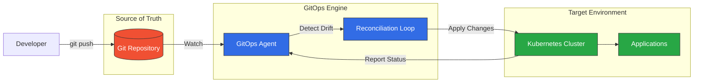
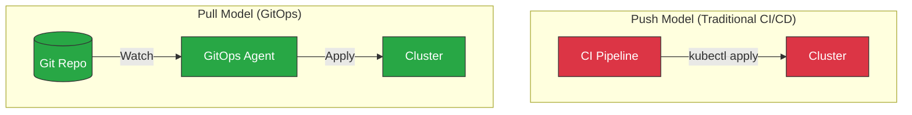
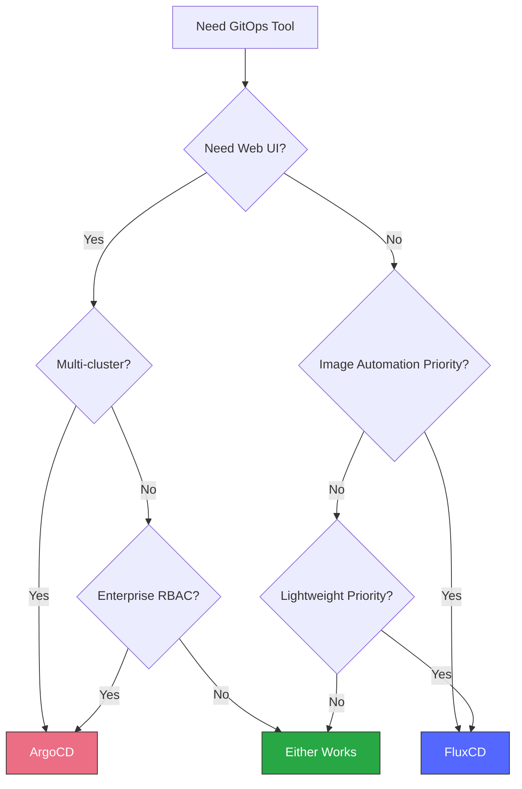
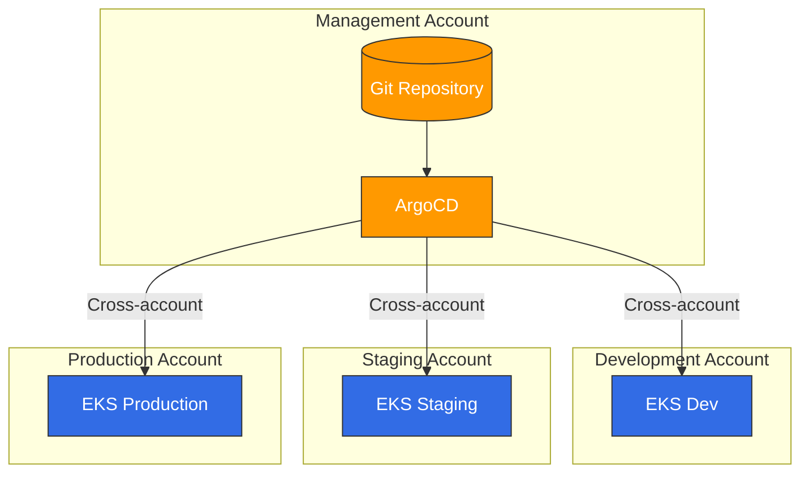

# GitOps

> **最終更新**: February 23, 2026

## 目次
- [GitOps とは？](#gitops-とは)
- [コア原則](#コア原則)
- [Push Model と Pull Model](#push-model-と-pull-model)
- [GitOps ツールの概要](#gitops-ツールの概要)
- [ツール選定ガイド](#ツール選定ガイド)
- [Amazon EKS における GitOps](#amazon-eks-における-gitops)
- [はじめに](#はじめに)

## GitOps とは？

GitOps は、バージョン管理、コラボレーション、コンプライアンス、CI/CD などのインフラストラクチャ自動化に関する DevOps のベストプラクティスを、インフラストラクチャ管理に適用する運用フレームワークです。この用語は 2017 年に Weaveworks によって提唱され、その後クラウドネイティブアプリケーションのデプロイメントにおける CNCF 認定の手法となりました。

GitOps の中核では、宣言的なインフラストラクチャおよびアプリケーション設定の信頼できる唯一の情報源として Git リポジトリを使用します。望ましい状態への変更は Git コミットを通じて行われ、自動化されたプロセスが実際のシステム状態と宣言された状態の一致を保証します。



### 歴史と進化

| 年 | マイルストーン |
|------|-----------|
| 2017 | Weaveworks が「GitOps」という用語を提唱 |
| 2019 | Flux v1 がリリースされ、ArgoCD が普及 |
| 2020 | CNCF が Flux をインキュベーティングプロジェクトとして採択 |
| 2021 | ArgoCD が CNCF 卒業プロジェクトとなる |
| 2022 | GitOps Working Group が原則を公開 |
| 2023 | OpenGitOps プロジェクトが標準を正式化 |
| 2024 | GitOps が主要な K8s デプロイメントパターンとなる |

### CNCF OpenGitOps の定義

OpenGitOps プロジェクトは、4 つの原則により GitOps を定義しています。

1. **宣言的**: GitOps で管理されるシステムでは、望ましい状態を宣言的に表現する必要があります
2. **バージョン管理と不変性**: 望ましい状態は、不変性とバージョン管理を強制し、完全なバージョン履歴を保持する方法で保存されます
3. **自動的に Pull される**: ソフトウェアエージェントが、ソースから望ましい状態の宣言を自動的に Pull します
4. **継続的に Reconcile される**: ソフトウェアエージェントが実際のシステム状態を継続的に監視し、望ましい状態の適用を試みます

## コア原則

### 宣言的設定

インフラストラクチャ、アプリケーション、ポリシー、設定を含むすべてをコードとして定義します。これにより、次のことが可能になります。

- **再現性**: どの環境も Git リポジトリから再作成できます
- **監査可能性**: 誰が、何を、いつ、なぜ変更したかを含む、すべての変更の完全な履歴
- **一貫性**: 環境間で同一の設定

```yaml
# Example: Declarative application state
apiVersion: apps/v1
kind: Deployment
metadata:
  name: web-app
  labels:
    app: web-app
    version: v1.2.3
spec:
  replicas: 3
  selector:
    matchLabels:
      app: web-app
  template:
    metadata:
      labels:
        app: web-app
    spec:
      containers:
      - name: web-app
        image: myregistry/web-app:v1.2.3
        ports:
        - containerPort: 8080
```

### 信頼できる唯一の情報源としての Git

Git リポジトリには、システム全体の望ましい状態が保存されます。

- **アプリケーション設定**
- **インフラストラクチャ定義**
- **セキュリティポリシー**
- **環境固有の設定**

### 自動 Reconciliation

GitOps エージェントは継続的に以下を行います。

1. Git リポジトリの変更を監視する
2. 望ましい状態と実際の状態を比較する
3. システムを準拠した状態にするために変更を適用する
4. ステータスとドリフトを報告する

### 自己修復システム

実際の状態が望ましい状態からドリフトした場合（手動変更、障害など）、GitOps エージェントは正しい状態を自動的に復元します。

## Push Model と Pull Model

GitOps は 2 つのデプロイメントモデルをサポートします。



### Push Model

従来の Push Model では、以下のとおりです。
- CI/CD パイプラインがクラスターに直接アクセスする
- 認証情報が CI システムに保存される
- 変更はクラスターの外部から Push される

**欠点:**
- CI システムにクラスターの認証情報が必要
- 誰が変更を行ったかの監査がより困難
- 自動ドリフト検出がない

### Pull Model（推奨）

GitOps の Pull Model では、以下のとおりです。
- エージェントがクラスター内で稼働する
- エージェントが Git から変更を Pull する
- 外部からのクラスターアクセスが不要

**利点:**
- セキュリティの向上（外部認証情報が不要）
- Git に完全な監査証跡を保持
- 自動ドリフト検出と修正
- ファイアウォールの背後でも動作

## GitOps ツールの概要

### ArgoCD

[ArgoCD](argocd/README.md) は、Kubernetes 向けの宣言的な GitOps 継続的デリバリーツールです。

**主な機能:**
- 可視化のための Web UI
- マルチクラスターサポート
- SSO 統合
- Rollback 機能
- ヘルスステータスの監視
- フリート管理のための ApplicationSet

**最適な対象:** ビジュアル管理、マルチクラスターデプロイメント、エンタープライズ機能を求めるチーム

### FluxCD

FluxCD は、オープンで拡張可能な Kubernetes 向け継続的デリバリーソリューションのセットです。

**主な機能:**
- 軽量かつモジュール式
- ネイティブの Helm および Kustomize サポート
- イメージ自動化
- マルチテナンシー
- 通知コントローラー

**最適な対象:** CLI ファーストで軽量なソリューションや、イメージ自動化ワークフローを好むチーム

### Jenkins X

Jenkins X は、Kubernetes 上のクラウドネイティブアプリケーション向けに CI/CD を提供します。

**主な機能:**
- 自動化された CI/CD パイプライン
- プレビュー環境
- GitOps プロモーション
- Tekton ベースのパイプライン

**最適な対象:** Jenkins エコシステムに大きく投資しているチーム

### 比較マトリクス

| 機能 | ArgoCD | FluxCD | Jenkins X |
|---------|--------|--------|-----------|
| Web UI | ✅ 高機能 | ❌ CLI のみ | ✅ 基本 |
| マルチクラスター | ✅ ネイティブ | ✅ Flux 経由 | ✅ 制限あり |
| Helm サポート | ✅ 完全 | ✅ 完全 | ✅ 完全 |
| Kustomize | ✅ 完全 | ✅ 完全 | ✅ 制限あり |
| イメージ自動化 | ⚠️ 制限あり | ✅ ネイティブ | ✅ ネイティブ |
| RBAC | ✅ きめ細かい | ⚠️ 基本 | ⚠️ 基本 |
| 通知 | ✅ 高機能 | ✅ 高機能 | ✅ 基本 |
| 学習曲線 | 中 | 低 | 高 |
| リソース使用量 | 中 | 低 | 高 |
| CNCF ステータス | 卒業 | 卒業 | Sandbox |

## ツール選定ガイド

### 次の場合は ArgoCD を選択:

- 運用のためのビジュアルダッシュボードが必要
- マルチクラスター管理が必要
- エンタープライズ SSO/RBAC が重要
- チームが UI ベースのワークフローを好む
- フリート管理のために ApplicationSet が必要

### 次の場合は FluxCD を選択:

- 軽量でモジュール式のアーキテクチャを好む
- イメージ自動化が主要な要件
- CLI ファーストのワークフローを好む
- リソース制約が懸念事項
- Helm コントローラーとの密接な統合が必要

### 意思決定フレームワーク



## Amazon EKS における GitOps

### EKS 固有の考慮事項

Amazon EKS で GitOps を実装する場合:

#### IAM 統合

安全な AWS API アクセスには IAM Roles for Service Accounts (IRSA) を使用します。

```yaml
apiVersion: v1
kind: ServiceAccount
metadata:
  name: gitops-controller
  annotations:
    eks.amazonaws.com/role-arn: arn:aws:iam::123456789012:role/GitOpsRole
```

#### マルチアカウントアーキテクチャ



#### AWS サービス統合

GitOps は次の方法で AWS リソースを管理できます。

- **AWS Controllers for Kubernetes (ACK)**: AWS サービス向けのネイティブ K8s CRD
- **Crossplane**: マルチクラウドリソースのプロビジョニング
- **Terraform Controller**: GitOps を介した Terraform 状態管理

### 推奨アーキテクチャ

```
├── infrastructure/
│   ├── base/                    # Shared infrastructure
│   │   ├── vpc/
│   │   ├── eks/
│   │   └── iam/
│   └── environments/
│       ├── dev/
│       ├── staging/
│       └── production/
├── applications/
│   ├── base/                    # Application base configs
│   └── overlays/
│       ├── dev/
│       ├── staging/
│       └── production/
└── platform/
    ├── argocd/                  # GitOps tooling
    ├── monitoring/              # Observability stack
    └── security/                # Security policies
```

## はじめに

### ArgoCD クイックスタート

1. **ArgoCD をインストール:**
   ```bash
   kubectl create namespace argocd
   kubectl apply -n argocd -f https://raw.githubusercontent.com/argoproj/argo-cd/stable/manifests/install.yaml
   ```

2. **UI にアクセス:**
   ```bash
   kubectl port-forward svc/argocd-server -n argocd 8080:443
   ```

3. **初期パスワードを取得:**
   ```bash
   kubectl -n argocd get secret argocd-initial-admin-secret -o jsonpath="{.data.password}" | base64 -d
   ```

ArgoCD の詳細なセットアップについては、[ArgoCD ドキュメント](argocd/README.md)を参照してください。

### FluxCD クイックスタート

1. **Flux CLI をインストール:**
   ```bash
   curl -s https://fluxcd.io/install.sh | sudo bash
   ```

2. **Flux を Bootstrap:**
   ```bash
   flux bootstrap github \
     --owner=<org> \
     --repository=<repo> \
     --path=clusters/my-cluster
   ```

FluxCD の詳細なセットアップについては、FluxCD ドキュメントを参照してください。

## セクションナビゲーション

| トピック | 説明 |
|-------|-------------|
| [ArgoCD](argocd/README.md) | インストール、アプリケーション、同期戦略などを含む完全な ArgoCD ガイド |
| [FluxCD](02-fluxcd.md) | FluxCD のセットアップ、ソースコントローラー、イメージ自動化 |

## 参考資料

- [CNCF GitOps Working Group](https://github.com/cncf/tag-app-delivery/tree/main/gitops-wg)
- [OpenGitOps Project](https://opengitops.dev/)
- [GitOps Principles](https://www.gitops.tech/)

## クイズ

学習内容を確認するには、以下のクイズに挑戦してください。
- [ArgoCD クイズ](../quizzes/gitops/01-argocd-quiz.md)
- [FluxCD クイズ](../quizzes/gitops/02-fluxcd-quiz.md)
- [GitOps 比較クイズ](../quizzes/gitops/03-gitops-comparison-quiz.md)
