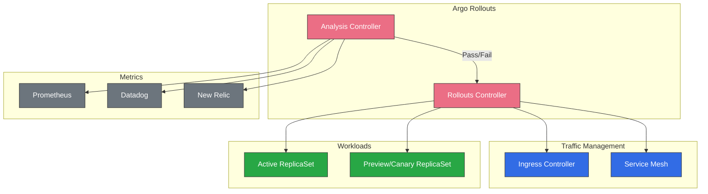
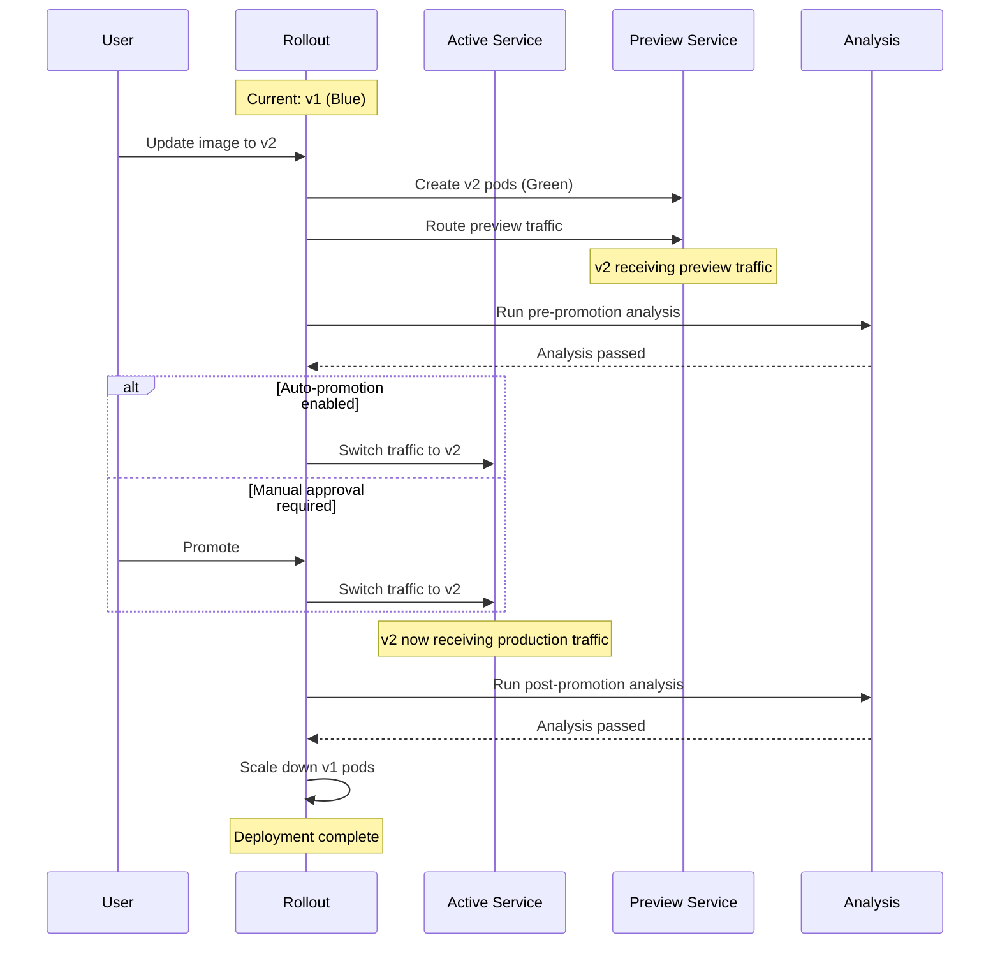
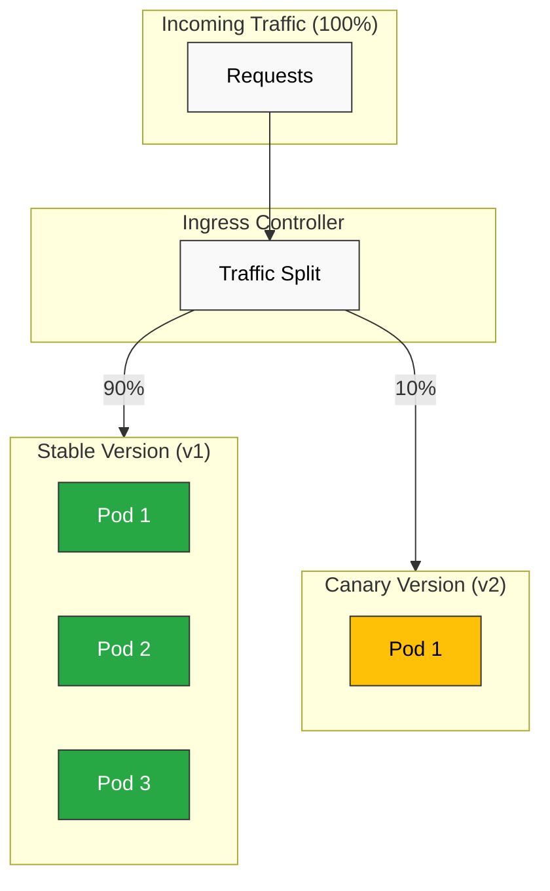

# ArgoCD トラフィック管理

> **サポート対象バージョン**: Argo Rollouts v1.6+, ArgoCD v2.9+
> **最終更新**: February 22, 2026

## 目次
- [Argo Rollouts の概要](#argo-rollouts-overview)
- [インストール](#installation)
- [Blue-Green デプロイ](#blue-green-deployments)
- [Canary デプロイ](#canary-deployments)
- [分析と検証](#analysis-and-verification)
- [Ingress 統合](#ingress-integration)
- [ロールバック戦略](#rollback-strategies)
- [実験](#experiments)
- [通知](#notifications)

## Argo Rollouts の概要

Argo Rollouts は、blue-green デプロイ、canary デプロイ、progressive delivery 機能を含む高度なデプロイ機能を提供する Kubernetes controller です。

### Argo Rollouts を使用する理由

標準の Kubernetes Deployment は rolling update のみをサポートします。Argo Rollouts はこれを次のように拡張します。

| 機能 | K8s Deployment | Argo Rollouts |
|---------|----------------|---------------|
| Rolling Update | はい | はい |
| Blue-Green | いいえ | はい |
| Canary | いいえ | はい |
| トラフィック分割 | いいえ | はい |
| 自動ロールバック | いいえ | はい |
| 分析/検証 | いいえ | はい |
| 一時停止/再開 | いいえ | はい |
| 実験 | いいえ | はい |

### アーキテクチャ



## インストール

### Argo Rollouts Controller のインストール

```bash
# Create namespace
kubectl create namespace argo-rollouts

# Install controller
kubectl apply -n argo-rollouts -f https://github.com/argoproj/argo-rollouts/releases/latest/download/install.yaml

# Verify installation
kubectl get pods -n argo-rollouts
```

### kubectl Plugin のインストール

```bash
# macOS
brew install argoproj/tap/kubectl-argo-rollouts

# Linux
curl -LO https://github.com/argoproj/argo-rollouts/releases/latest/download/kubectl-argo-rollouts-linux-amd64
chmod +x kubectl-argo-rollouts-linux-amd64
sudo mv kubectl-argo-rollouts-linux-amd64 /usr/local/bin/kubectl-argo-rollouts

# Verify
kubectl argo rollouts version
```

### Helm を使用したインストール

```bash
helm repo add argo https://argoproj.github.io/argo-helm
helm repo update

helm install argo-rollouts argo/argo-rollouts \
  --namespace argo-rollouts \
  --create-namespace \
  --set dashboard.enabled=true
```

### 本番環境用 Helm Values

```yaml
controller:
  replicas: 2
  metrics:
    enabled: true
    serviceMonitor:
      enabled: true

dashboard:
  enabled: true
  ingress:
    enabled: true
    ingressClassName: nginx
    hosts:
      - rollouts.example.com

# For AWS ALB integration
trafficRouterPlugins:
  - name: alb
    enabled: true
```

## Blue-Green デプロイ

Blue-green デプロイでは、同一の環境を 2 つ維持し、それらの間でトラフィックを切り替えます。

### 基本的な Blue-Green Rollout

```yaml
apiVersion: argoproj.io/v1alpha1
kind: Rollout
metadata:
  name: myapp
  namespace: myapp
spec:
  replicas: 5
  revisionHistoryLimit: 3
  selector:
    matchLabels:
      app: myapp
  template:
    metadata:
      labels:
        app: myapp
    spec:
      containers:
        - name: myapp
          image: myregistry/myapp:v1.0.0
          ports:
            - containerPort: 8080
          readinessProbe:
            httpGet:
              path: /health
              port: 8080
            initialDelaySeconds: 5
            periodSeconds: 10
          resources:
            requests:
              cpu: 100m
              memory: 128Mi
            limits:
              cpu: 500m
              memory: 512Mi
  strategy:
    blueGreen:
      activeService: myapp-active
      previewService: myapp-preview
      autoPromotionEnabled: false
      scaleDownDelaySeconds: 30
      previewReplicaCount: 2
      prePromotionAnalysis:
        templates:
          - templateName: smoke-tests
        args:
          - name: service-name
            value: myapp-preview
      postPromotionAnalysis:
        templates:
          - templateName: success-rate
---
apiVersion: v1
kind: Service
metadata:
  name: myapp-active
  namespace: myapp
spec:
  selector:
    app: myapp
  ports:
    - port: 80
      targetPort: 8080
---
apiVersion: v1
kind: Service
metadata:
  name: myapp-preview
  namespace: myapp
spec:
  selector:
    app: myapp
  ports:
    - port: 80
      targetPort: 8080
```

### Blue-Green フロー



### 自動 Promotion を使用する Blue-Green

```yaml
strategy:
  blueGreen:
    activeService: myapp-active
    previewService: myapp-preview
    autoPromotionEnabled: true
    autoPromotionSeconds: 60  # Wait 60s before auto-promoting
    previewReplicaCount: 3
```

## Canary デプロイ

Canary デプロイでは、新しいバージョンにトラフィックを段階的に移行します。

### 基本的な Canary Rollout

```yaml
apiVersion: argoproj.io/v1alpha1
kind: Rollout
metadata:
  name: myapp-canary
  namespace: myapp
spec:
  replicas: 10
  selector:
    matchLabels:
      app: myapp
  template:
    metadata:
      labels:
        app: myapp
    spec:
      containers:
        - name: myapp
          image: myregistry/myapp:v1.0.0
          ports:
            - containerPort: 8080
  strategy:
    canary:
      canaryService: myapp-canary
      stableService: myapp-stable
      trafficRouting:
        nginx:
          stableIngress: myapp-ingress
      steps:
        # Step 1: 5% traffic to canary
        - setWeight: 5
        - pause: {duration: 2m}

        # Step 2: 10% traffic, run analysis
        - setWeight: 10
        - analysis:
            templates:
              - templateName: success-rate
            args:
              - name: service-name
                value: myapp-canary

        # Step 3: 25% traffic
        - setWeight: 25
        - pause: {duration: 5m}

        # Step 4: 50% traffic
        - setWeight: 50
        - pause: {duration: 5m}

        # Step 5: 75% traffic
        - setWeight: 75
        - analysis:
            templates:
              - templateName: success-rate
              - templateName: latency-check

        # Step 6: 100% traffic (full promotion)
        - setWeight: 100
---
apiVersion: v1
kind: Service
metadata:
  name: myapp-stable
  namespace: myapp
spec:
  selector:
    app: myapp
  ports:
    - port: 80
      targetPort: 8080
---
apiVersion: v1
kind: Service
metadata:
  name: myapp-canary
  namespace: myapp
spec:
  selector:
    app: myapp
  ports:
    - port: 80
      targetPort: 8080
```

### Canary ステップの説明

| ステップの種類 | 説明 |
|-----------|-------------|
| `setWeight` | Canary へのトラフィックの割合を設定 |
| `pause` | 指定時間または手動承認まで待機 |
| `analysis` | AnalysisTemplate を実行 |
| `setCanaryScale` | Canary の replica 数を設定 |
| `setHeaderRoute` | ヘッダーでルーティング（traffic router 用） |

### 手動ゲートを使用する Canary

```yaml
strategy:
  canary:
    steps:
      - setWeight: 10
      - pause: {}  # Indefinite pause - requires manual promotion

      - setWeight: 50
      - pause: {duration: 10m}

      - setWeight: 100
```

手動で Promotion します。

```bash
# Promote to next step
kubectl argo rollouts promote myapp-canary

# Promote fully (skip remaining steps)
kubectl argo rollouts promote myapp-canary --full
```

### Canary トラフィックフロー



## 分析と検証

AnalysisTemplate は、デプロイの健全性を検証する方法を定義します。

### Prometheus 分析

```yaml
apiVersion: argoproj.io/v1alpha1
kind: AnalysisTemplate
metadata:
  name: success-rate
  namespace: myapp
spec:
  args:
    - name: service-name
  metrics:
    - name: success-rate
      interval: 1m
      count: 5
      successCondition: result[0] >= 0.95
      failureLimit: 3
      provider:
        prometheus:
          address: http://prometheus.monitoring:9090
          query: |
            sum(rate(
              http_requests_total{
                service="{{args.service-name}}",
                status=~"2.."
              }[5m]
            )) /
            sum(rate(
              http_requests_total{
                service="{{args.service-name}}"
              }[5m]
            ))
```

### レイテンシー分析

```yaml
apiVersion: argoproj.io/v1alpha1
kind: AnalysisTemplate
metadata:
  name: latency-check
  namespace: myapp
spec:
  args:
    - name: service-name
  metrics:
    - name: p99-latency
      interval: 2m
      count: 3
      successCondition: result[0] < 500  # 500ms threshold
      failureLimit: 2
      provider:
        prometheus:
          address: http://prometheus.monitoring:9090
          query: |
            histogram_quantile(0.99,
              sum(rate(
                http_request_duration_seconds_bucket{
                  service="{{args.service-name}}"
                }[5m]
              )) by (le)
            ) * 1000
```

### Web 分析（HTTP Endpoint）

```yaml
apiVersion: argoproj.io/v1alpha1
kind: AnalysisTemplate
metadata:
  name: smoke-tests
  namespace: myapp
spec:
  args:
    - name: service-name
  metrics:
    - name: smoke-test
      interval: 30s
      count: 3
      successCondition: result.status == "healthy"
      failureLimit: 1
      provider:
        web:
          url: "http://{{args.service-name}}/health"
          jsonPath: "{$.status}"
          timeoutSeconds: 10
```

### Datadog 分析

```yaml
apiVersion: argoproj.io/v1alpha1
kind: AnalysisTemplate
metadata:
  name: datadog-success-rate
  namespace: myapp
spec:
  args:
    - name: service-name
  metrics:
    - name: error-rate
      interval: 5m
      count: 3
      successCondition: result < 0.05
      failureLimit: 2
      provider:
        datadog:
          apiVersion: v2
          interval: 5m
          query: |
            sum:http.requests{service:{{args.service-name}},status:5xx}.as_count() /
            sum:http.requests{service:{{args.service-name}}}.as_count()
```

### Job ベースの分析

```yaml
apiVersion: argoproj.io/v1alpha1
kind: AnalysisTemplate
metadata:
  name: integration-tests
  namespace: myapp
spec:
  args:
    - name: service-url
  metrics:
    - name: integration-tests
      provider:
        job:
          spec:
            backoffLimit: 1
            template:
              spec:
                restartPolicy: Never
                containers:
                  - name: test-runner
                    image: myregistry/integration-tests:latest
                    env:
                      - name: TARGET_URL
                        value: "{{args.service-url}}"
                    command:
                      - /bin/sh
                      - -c
                      - |
                        npm run test:integration
                        if [ $? -eq 0 ]; then
                          exit 0
                        else
                          exit 1
                        fi
```

### ClusterAnalysisTemplate

namespace をまたいで分析テンプレートを共有します。

```yaml
apiVersion: argoproj.io/v1alpha1
kind: ClusterAnalysisTemplate
metadata:
  name: global-success-rate
spec:
  args:
    - name: service-name
    - name: namespace
  metrics:
    - name: success-rate
      interval: 1m
      count: 5
      successCondition: result[0] >= 0.95
      provider:
        prometheus:
          address: http://prometheus.monitoring:9090
          query: |
            sum(rate(
              http_requests_total{
                namespace="{{args.namespace}}",
                service="{{args.service-name}}",
                status=~"2.."
              }[5m]
            )) /
            sum(rate(
              http_requests_total{
                namespace="{{args.namespace}}",
                service="{{args.service-name}}"
              }[5m]
            ))
```

## Ingress 統合

### NGINX Ingress

```yaml
apiVersion: argoproj.io/v1alpha1
kind: Rollout
metadata:
  name: myapp
  namespace: myapp
spec:
  strategy:
    canary:
      stableService: myapp-stable
      canaryService: myapp-canary
      trafficRouting:
        nginx:
          stableIngress: myapp-ingress
          additionalIngressAnnotations:
            canary-by-header: X-Canary
            canary-by-header-value: "true"
      steps:
        - setWeight: 10
        - pause: {duration: 5m}
        - setWeight: 50
        - pause: {duration: 5m}
        - setWeight: 100
---
apiVersion: networking.k8s.io/v1
kind: Ingress
metadata:
  name: myapp-ingress
  namespace: myapp
  annotations:
    nginx.ingress.kubernetes.io/rewrite-target: /
spec:
  ingressClassName: nginx
  rules:
    - host: myapp.example.com
      http:
        paths:
          - path: /
            pathType: Prefix
            backend:
              service:
                name: myapp-stable
                port:
                  number: 80
```

### AWS ALB Ingress

```yaml
apiVersion: argoproj.io/v1alpha1
kind: Rollout
metadata:
  name: myapp
  namespace: myapp
spec:
  strategy:
    canary:
      stableService: myapp-stable
      canaryService: myapp-canary
      trafficRouting:
        alb:
          ingress: myapp-ingress
          rootService: myapp-root
          servicePort: 80
      steps:
        - setWeight: 10
        - pause: {duration: 5m}
        - setWeight: 50
        - pause: {duration: 5m}
        - setWeight: 100
---
apiVersion: networking.k8s.io/v1
kind: Ingress
metadata:
  name: myapp-ingress
  namespace: myapp
  annotations:
    kubernetes.io/ingress.class: alb
    alb.ingress.kubernetes.io/scheme: internet-facing
    alb.ingress.kubernetes.io/target-type: ip
    alb.ingress.kubernetes.io/actions.myapp-root: |
      {
        "type": "forward",
        "forwardConfig": {
          "targetGroups": [
            {
              "serviceName": "myapp-stable",
              "servicePort": 80,
              "weight": 100
            },
            {
              "serviceName": "myapp-canary",
              "servicePort": 80,
              "weight": 0
            }
          ]
        }
      }
spec:
  rules:
    - host: myapp.example.com
      http:
        paths:
          - path: /
            pathType: Prefix
            backend:
              service:
                name: myapp-root
                port:
                  name: use-annotation
```

### Istio トラフィック分割

```yaml
apiVersion: argoproj.io/v1alpha1
kind: Rollout
metadata:
  name: myapp
  namespace: myapp
spec:
  strategy:
    canary:
      stableService: myapp-stable
      canaryService: myapp-canary
      trafficRouting:
        istio:
          virtualService:
            name: myapp-vsvc
            routes:
              - primary
          destinationRule:
            name: myapp-destrule
            canarySubsetName: canary
            stableSubsetName: stable
      steps:
        - setWeight: 10
        - pause: {duration: 5m}
        - setWeight: 50
        - pause: {duration: 5m}
        - setWeight: 100
---
apiVersion: networking.istio.io/v1beta1
kind: VirtualService
metadata:
  name: myapp-vsvc
  namespace: myapp
spec:
  hosts:
    - myapp.example.com
  gateways:
    - myapp-gateway
  http:
    - name: primary
      route:
        - destination:
            host: myapp-stable
          weight: 100
        - destination:
            host: myapp-canary
          weight: 0
---
apiVersion: networking.istio.io/v1beta1
kind: DestinationRule
metadata:
  name: myapp-destrule
  namespace: myapp
spec:
  host: myapp
  subsets:
    - name: stable
      labels:
        app: myapp
    - name: canary
      labels:
        app: myapp
```

## ロールバック戦略

### 分析失敗時の自動ロールバック

```yaml
strategy:
  canary:
    steps:
      - setWeight: 10
      - analysis:
          templates:
            - templateName: success-rate
          args:
            - name: service-name
              value: myapp-canary
    # Analysis failure automatically triggers rollback
```

### 手動ロールバック

```bash
# Abort current rollout and rollback
kubectl argo rollouts abort myapp

# Undo to previous version
kubectl argo rollouts undo myapp

# Undo to specific revision
kubectl argo rollouts undo myapp --to-revision=2
```

### ロールバック設定

```yaml
spec:
  strategy:
    canary:
      abortScaleDownDelaySeconds: 30
      dynamicStableScale: true
      steps:
        - setWeight: 10
        - analysis:
            templates:
              - templateName: success-rate
            # Analysis runs continuously
            # Failure at any point triggers rollback
```

## 実験

複数のバージョンで A/B テストを同時に実行します。

```yaml
apiVersion: argoproj.io/v1alpha1
kind: Experiment
metadata:
  name: myapp-experiment
  namespace: myapp
spec:
  duration: 1h
  progressDeadlineSeconds: 300
  templates:
    - name: baseline
      replicas: 2
      selector:
        matchLabels:
          app: myapp
          variant: baseline
      template:
        metadata:
          labels:
            app: myapp
            variant: baseline
        spec:
          containers:
            - name: myapp
              image: myregistry/myapp:v1.0.0
              ports:
                - containerPort: 8080
    - name: canary
      replicas: 2
      selector:
        matchLabels:
          app: myapp
          variant: canary
      template:
        metadata:
          labels:
            app: myapp
            variant: canary
        spec:
          containers:
            - name: myapp
              image: myregistry/myapp:v2.0.0
              ports:
                - containerPort: 8080
  analyses:
    - name: compare-metrics
      templateName: compare-experiment
      args:
        - name: baseline-hash
          valueFrom:
            podTemplateHashValue: baseline
        - name: canary-hash
          valueFrom:
            podTemplateHashValue: canary
```

## 通知

Rollout イベントを通知システムと統合します。

### Rollout での通知の設定

```yaml
apiVersion: argoproj.io/v1alpha1
kind: Rollout
metadata:
  name: myapp
  namespace: myapp
  annotations:
    notifications.argoproj.io/subscribe.on-rollout-completed.slack: deployments
    notifications.argoproj.io/subscribe.on-rollout-aborted.slack: deployments
    notifications.argoproj.io/subscribe.on-analysis-run-failed.slack: alerts
spec:
  # ...
```

### 通知トリガーとテンプレート

```yaml
apiVersion: v1
kind: ConfigMap
metadata:
  name: argo-rollouts-notification-configmap
  namespace: argo-rollouts
data:
  service.slack: |
    token: $slack-token

  trigger.on-rollout-completed: |
    - when: rollout.status.phase == 'Healthy'
      send: [rollout-completed]

  trigger.on-rollout-aborted: |
    - when: rollout.status.phase == 'Degraded'
      send: [rollout-aborted]

  template.rollout-completed: |
    message: |
      Rollout {{.rollout.metadata.name}} completed successfully!
      Revision: {{.rollout.status.currentPodHash}}
      Image: {{(index .rollout.spec.template.spec.containers 0).image}}

  template.rollout-aborted: |
    message: |
      Rollout {{.rollout.metadata.name}} was aborted!
      Reason: {{.rollout.status.message}}
```

## クイズ

学習内容を確認するには、[ArgoCD traffic management クイズ](../../quizzes/gitops/argocd/05-traffic-management-quiz.md)に挑戦してください。
