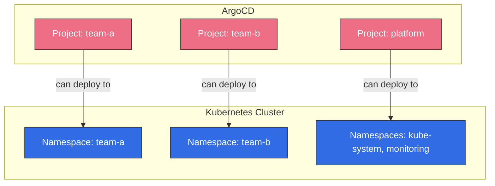

# ArgoCD Projects と RBAC

> **対応バージョン**: ArgoCD v2.9+
> **最終更新**: February 22, 2026

## 目次
- [AppProject の概要](#appproject-overview)
- [デフォルト Project](#default-project)
- [カスタム Project](#custom-projects)
- [RBAC 設定](#rbac-configuration)
- [マルチテナンシーのパターン](#multi-tenancy-patterns)
- [CI/CD 用 JWT トークン](#jwt-tokens-for-cicd)
- [孤立リソースのモニタリング](#orphaned-resource-monitoring)

## AppProject の概要

AppProject は Application を論理的にグループ化し、デプロイ可能なリソース、デプロイ先、および管理者を制御するアクセス制御を定義します。

### 主な機能

| 機能 | 説明 |
|---------|-------------|
| ソースの制限 | 使用できる Git リポジトリを制限します |
| 宛先の制限 | 対象のクラスターと Namespace を制限します |
| リソースの許可リスト／拒否リスト | 作成可能な K8s リソースを制御します |
| ロール定義 | Project 固有の RBAC ロールを定義します |
| Sync ウィンドウ | Application を Sync できる時間帯を定義します |

### AppProject CRD の構造

```yaml
apiVersion: argoproj.io/v1alpha1
kind: AppProject
metadata:
  name: my-project
  namespace: argocd
  finalizers:
    - resources-finalizer.argocd.argoproj.io
spec:
  description: "Project description"

  # Source repositories
  sourceRepos:
    - https://github.com/myorg/*
    - https://charts.helm.sh/stable

  # Allowed destinations
  destinations:
    - namespace: my-app-*
      server: https://kubernetes.default.svc
    - namespace: '*'
      server: https://production.k8s.local

  # Cluster resource allowlist
  clusterResourceWhitelist:
    - group: ''
      kind: Namespace
    - group: rbac.authorization.k8s.io
      kind: ClusterRole
    - group: rbac.authorization.k8s.io
      kind: ClusterRoleBinding

  # Cluster resource denylist
  clusterResourceBlacklist:
    - group: ''
      kind: ResourceQuota

  # Namespace resource allowlist (default: allow all)
  namespaceResourceWhitelist:
    - group: '*'
      kind: '*'

  # Namespace resource denylist
  namespaceResourceBlacklist:
    - group: ''
      kind: LimitRange

  # Project roles
  roles:
    - name: developer
      description: Developer access
      policies:
        - p, proj:my-project:developer, applications, get, my-project/*, allow
        - p, proj:my-project:developer, applications, sync, my-project/*, allow
      groups:
        - my-org:developers

  # Sync windows
  syncWindows:
    - kind: allow
      schedule: '0 9 * * 1-5'
      duration: 8h
      applications:
        - '*'

  # Orphaned resource monitoring
  orphanedResources:
    warn: true
    ignore:
      - group: ''
        kind: ConfigMap
        name: kube-root-ca.crt
```

## デフォルト Project

ArgoCD には、すべてのソース、宛先、リソースを許可する `default` Project が含まれています。

### デフォルト Project の仕様

```yaml
apiVersion: argoproj.io/v1alpha1
kind: AppProject
metadata:
  name: default
  namespace: argocd
spec:
  description: Default project
  sourceRepos:
    - '*'
  destinations:
    - namespace: '*'
      server: '*'
  clusterResourceWhitelist:
    - group: '*'
      kind: '*'
```

### デフォルト Project を使用する場合

- 開発環境
- 迅速なテスト
- マルチテナンシー要件がない小規模チーム

### デフォルト Project の制限

本番環境では、デフォルト Project を制限します。

```yaml
apiVersion: argoproj.io/v1alpha1
kind: AppProject
metadata:
  name: default
  namespace: argocd
spec:
  description: Restricted default project
  sourceRepos: []  # No repos allowed
  destinations: []  # No destinations allowed
```

## カスタム Project

### チームベースの Project

```yaml
apiVersion: argoproj.io/v1alpha1
kind: AppProject
metadata:
  name: team-frontend
  namespace: argocd
spec:
  description: Frontend team project

  sourceRepos:
    - https://github.com/myorg/frontend-*
    - https://github.com/myorg/shared-libs

  destinations:
    - namespace: frontend-*
      server: https://kubernetes.default.svc
    - namespace: frontend-*
      server: https://staging.k8s.local
    - namespace: frontend-*
      server: https://production.k8s.local

  clusterResourceWhitelist:
    - group: ''
      kind: Namespace

  namespaceResourceBlacklist:
    # Prevent privileged workloads
    - group: ''
      kind: Pod
    # Use Deployments instead

  roles:
    - name: admin
      description: Project admin
      policies:
        - p, proj:team-frontend:admin, applications, *, team-frontend/*, allow
        - p, proj:team-frontend:admin, repositories, *, team-frontend/*, allow
      groups:
        - myorg:frontend-leads

    - name: developer
      description: Developer access
      policies:
        - p, proj:team-frontend:developer, applications, get, team-frontend/*, allow
        - p, proj:team-frontend:developer, applications, sync, team-frontend/*, allow
        - p, proj:team-frontend:developer, applications, action/*, team-frontend/*, allow
      groups:
        - myorg:frontend-devs

    - name: viewer
      description: Read-only access
      policies:
        - p, proj:team-frontend:viewer, applications, get, team-frontend/*, allow
      groups:
        - myorg:frontend-viewers
```

### 環境ベースの Project

```yaml
apiVersion: argoproj.io/v1alpha1
kind: AppProject
metadata:
  name: production
  namespace: argocd
spec:
  description: Production environment project

  sourceRepos:
    - https://github.com/myorg/gitops-prod

  destinations:
    - namespace: '*'
      server: https://production.k8s.local
    - namespace: '*'
      server: https://production-dr.k8s.local

  clusterResourceWhitelist:
    - group: ''
      kind: Namespace
    - group: networking.k8s.io
      kind: IngressClass
    - group: storage.k8s.io
      kind: StorageClass

  # Restrict certain namespaced resources in production
  namespaceResourceBlacklist:
    - group: ''
      kind: Pod  # Force use of controllers
    - group: batch
      kind: Job  # Jobs should go through CI/CD

  syncWindows:
    # Only allow sync during business hours
    - kind: allow
      schedule: '0 9 * * 1-5'
      duration: 8h
      applications:
        - '*'
      manualSync: true

    # Emergency window (manual only)
    - kind: allow
      schedule: '0 0 * * *'
      duration: 24h
      applications:
        - '*'
      manualSync: true

  roles:
    - name: sre
      description: SRE team with full access
      policies:
        - p, proj:production:sre, applications, *, production/*, allow
      groups:
        - myorg:sre-team

    - name: deployer
      description: CI/CD deployment access
      policies:
        - p, proj:production:deployer, applications, sync, production/*, allow
        - p, proj:production:deployer, applications, get, production/*, allow
```

### プラットフォームインフラストラクチャ Project

```yaml
apiVersion: argoproj.io/v1alpha1
kind: AppProject
metadata:
  name: platform
  namespace: argocd
spec:
  description: Platform infrastructure components

  sourceRepos:
    - https://github.com/myorg/platform-*
    - https://prometheus-community.github.io/helm-charts
    - https://grafana.github.io/helm-charts
    - https://charts.jetstack.io
    - https://kubernetes.github.io/ingress-nginx

  destinations:
    - namespace: kube-system
      server: '*'
    - namespace: monitoring
      server: '*'
    - namespace: logging
      server: '*'
    - namespace: ingress-nginx
      server: '*'
    - namespace: cert-manager
      server: '*'

  # Platform needs cluster-wide resources
  clusterResourceWhitelist:
    - group: '*'
      kind: '*'

  roles:
    - name: platform-admin
      description: Platform team admin
      policies:
        - p, proj:platform:platform-admin, applications, *, platform/*, allow
        - p, proj:platform:platform-admin, clusters, *, *, allow
        - p, proj:platform:platform-admin, repositories, *, *, allow
      groups:
        - myorg:platform-team
```

## RBAC 設定

ArgoCD RBAC は `argocd-rbac-cm` ConfigMap で設定します。

### RBAC ポリシーの構文

```
p, <subject>, <resource>, <action>, <object>, <effect>
g, <subject>, <role>
```

| フィールド | 説明 |
|-------|-------------|
| `subject` | ユーザー、グループ、またはロール |
| `resource` | applications、clusters、repositories など |
| `action` | get、create、update、delete、sync など |
| `object` | リソース識別子（project/app または *） |
| `effect` | allow または deny |

### 組み込みロール

| ロール | 説明 |
|------|-------------|
| `role:readonly` | すべてのリソースへの読み取り専用アクセス |
| `role:admin` | すべてのリソースへのフルアクセス |

### 完全な RBAC 設定

```yaml
apiVersion: v1
kind: ConfigMap
metadata:
  name: argocd-rbac-cm
  namespace: argocd
data:
  # Default policy for authenticated users
  policy.default: role:readonly

  # Scope RBAC policies to specific AppProjects
  scopes: '[groups]'

  policy.csv: |
    # Built-in admin role (full access)
    p, role:admin, applications, *, */*, allow
    p, role:admin, clusters, *, *, allow
    p, role:admin, repositories, *, *, allow
    p, role:admin, projects, *, *, allow
    p, role:admin, accounts, *, *, allow
    p, role:admin, gpgkeys, *, *, allow
    p, role:admin, certificates, *, *, allow
    p, role:admin, logs, *, *, allow
    p, role:admin, exec, *, */*, allow

    # Built-in readonly role
    p, role:readonly, applications, get, */*, allow
    p, role:readonly, clusters, get, *, allow
    p, role:readonly, repositories, get, *, allow
    p, role:readonly, projects, get, *, allow
    p, role:readonly, logs, get, */*, allow

    # Custom organization roles
    # Org admins
    p, role:org-admin, applications, *, */*, allow
    p, role:org-admin, clusters, get, *, allow
    p, role:org-admin, repositories, *, *, allow
    p, role:org-admin, projects, *, *, allow

    # Developers (can sync and view, but not delete)
    p, role:developer, applications, get, */*, allow
    p, role:developer, applications, sync, */*, allow
    p, role:developer, applications, action/*, */*, allow
    p, role:developer, logs, get, */*, allow
    p, role:developer, exec, create, */*, allow

    # Viewers
    p, role:viewer, applications, get, */*, allow
    p, role:viewer, logs, get, */*, allow

    # Group to role mappings
    g, myorg:admins, role:admin
    g, myorg:org-admins, role:org-admin
    g, myorg:developers, role:developer
    g, myorg:viewers, role:viewer

    # User to role mappings
    g, admin@example.com, role:admin
    g, ci-bot, role:developer

    # Project-scoped roles (defined in AppProject)
    # These are auto-generated: proj:<project>:<role>
```

### リソース固有の権限

```yaml
policy.csv: |
  # Applications - fine-grained permissions
  p, role:deployer, applications, get, */*, allow
  p, role:deployer, applications, sync, */*, allow
  p, role:deployer, applications, update, */*, deny
  p, role:deployer, applications, delete, */*, deny

  # Cluster management
  p, role:cluster-admin, clusters, *, *, allow
  p, role:cluster-viewer, clusters, get, *, allow

  # Repository management
  p, role:repo-admin, repositories, *, *, allow
  p, role:repo-viewer, repositories, get, *, allow

  # Project-specific permissions
  p, role:team-a-admin, applications, *, team-a/*, allow
  p, role:team-a-admin, projects, get, team-a, allow

  # Exec into running pods (debugging)
  p, role:debugger, exec, create, */*, allow
  p, role:debugger, applications, get, */*, allow
```

### Application 固有のアクション

```yaml
policy.csv: |
  # Sync-only role (for CI/CD)
  p, role:sync-only, applications, get, */*, allow
  p, role:sync-only, applications, sync, */*, allow

  # Override action (allows syncing with force)
  p, role:operator, applications, action/apps/Deployment/restart, */*, allow

  # Rollback permission
  p, role:operator, applications, update, */*, allow
```

## マルチテナンシーのパターン

### チームごとの Namespace



実装:

```yaml
# Team A Project
apiVersion: argoproj.io/v1alpha1
kind: AppProject
metadata:
  name: team-a
  namespace: argocd
spec:
  sourceRepos:
    - https://github.com/myorg/team-a-*
  destinations:
    - namespace: team-a
      server: https://kubernetes.default.svc
    - namespace: team-a-*
      server: https://kubernetes.default.svc
  clusterResourceWhitelist: []  # No cluster resources
  roles:
    - name: admin
      policies:
        - p, proj:team-a:admin, applications, *, team-a/*, allow
      groups:
        - team-a-admins
---
# Team B Project
apiVersion: argoproj.io/v1alpha1
kind: AppProject
metadata:
  name: team-b
  namespace: argocd
spec:
  sourceRepos:
    - https://github.com/myorg/team-b-*
  destinations:
    - namespace: team-b
      server: https://kubernetes.default.svc
    - namespace: team-b-*
      server: https://kubernetes.default.svc
  clusterResourceWhitelist: []
  roles:
    - name: admin
      policies:
        - p, proj:team-b:admin, applications, *, team-b/*, allow
      groups:
        - team-b-admins
```

### 環境ごとのクラスター

```yaml
apiVersion: argoproj.io/v1alpha1
kind: AppProject
metadata:
  name: development
  namespace: argocd
spec:
  sourceRepos:
    - '*'
  destinations:
    - namespace: '*'
      server: https://dev.k8s.local
  # Relaxed for development
  clusterResourceWhitelist:
    - group: '*'
      kind: '*'
---
apiVersion: argoproj.io/v1alpha1
kind: AppProject
metadata:
  name: production
  namespace: argocd
spec:
  sourceRepos:
    - https://github.com/myorg/gitops-prod
  destinations:
    - namespace: '*'
      server: https://prod.k8s.local
  # Strict for production
  clusterResourceWhitelist:
    - group: ''
      kind: Namespace
  syncWindows:
    - kind: deny
      schedule: '0 0 * * 0,6'  # No weekend deploys
      duration: 48h
      applications:
        - '*'
```

## CI/CD 用 JWT トークン

自動化のために Project スコープのトークンを作成します。

### JWT トークンの作成

```bash
# Create token for project role
argocd proj role create-token my-project deployer

# Create token with expiration
argocd proj role create-token my-project deployer --expires-in 24h

# Create token with ID (for revocation)
argocd proj role create-token my-project deployer --token-id ci-pipeline-1
```

### CI/CD でのトークン使用

```yaml
# GitHub Actions example
name: Deploy to ArgoCD
on:
  push:
    branches: [main]

jobs:
  deploy:
    runs-on: ubuntu-latest
    steps:
      - uses: actions/checkout@v4

      - name: Install ArgoCD CLI
        run: |
          curl -sSL -o argocd https://github.com/argoproj/argo-cd/releases/latest/download/argocd-linux-amd64
          chmod +x argocd
          sudo mv argocd /usr/local/bin/

      - name: Login to ArgoCD
        run: |
          argocd login ${{ secrets.ARGOCD_SERVER }} \
            --auth-token ${{ secrets.ARGOCD_TOKEN }} \
            --grpc-web

      - name: Sync Application
        run: |
          argocd app sync my-app --prune
          argocd app wait my-app --health
```

### トークン管理

```bash
# List tokens
argocd proj role list-tokens my-project deployer

# Delete token
argocd proj role delete-token my-project deployer <token-id>
```

### Secret を介したトークン

```yaml
apiVersion: v1
kind: Secret
metadata:
  name: argocd-ci-token
  namespace: argocd
  labels:
    argocd.argoproj.io/secret-type: argocd-token
stringData:
  token: <jwt-token>
```

## 孤立リソースのモニタリング

ArgoCD によって管理されていない対象 Namespace 内のリソースを検出します。

### 孤立リソースのモニタリングを有効化

```yaml
apiVersion: argoproj.io/v1alpha1
kind: AppProject
metadata:
  name: my-project
  namespace: argocd
spec:
  orphanedResources:
    warn: true
    ignore:
      # Ignore specific resources
      - group: ''
        kind: ConfigMap
        name: kube-root-ca.crt
      - group: ''
        kind: ServiceAccount
        name: default
      # Ignore by pattern
      - group: ''
        kind: Secret
        name: 'default-token-*'
```

### 孤立リソースを表示

```bash
# Via CLI
argocd app resources my-app --orphaned

# Via API
curl -s https://argocd.example.com/api/v1/applications/my-app/resource-tree | jq '.orphanedNodes'
```

### 自動クリーンアップ

現在、ArgoCD は孤立リソースについて警告するだけです。自動クリーンアップには、post-sync フックを使用します。

```yaml
apiVersion: batch/v1
kind: Job
metadata:
  name: cleanup-orphans
  annotations:
    argocd.argoproj.io/hook: PostSync
    argocd.argoproj.io/hook-delete-policy: HookSucceeded
spec:
  template:
    spec:
      serviceAccountName: orphan-cleaner
      restartPolicy: Never
      containers:
        - name: cleaner
          image: bitnami/kubectl:latest
          command:
            - /bin/sh
            - -c
            - |
              # Custom cleanup logic
              kubectl get configmaps -n my-namespace -l managed-by!=argocd -o name | xargs -r kubectl delete -n my-namespace
```

## クイズ

学習内容を確認するには、[ArgoCD Projects と RBAC のクイズ](../../quizzes/gitops/argocd/06-projects-rbac-quiz.md)に挑戦してください。
