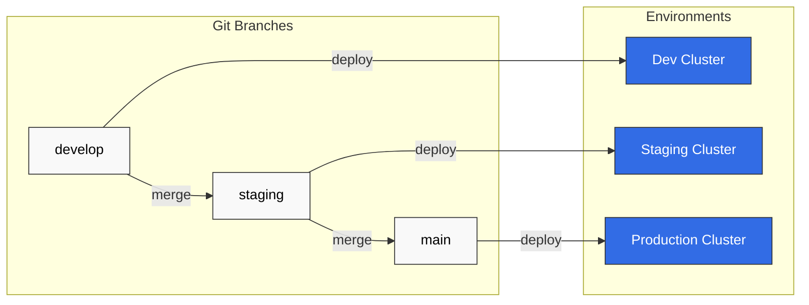

# ArgoCD ベストプラクティス

> **対応バージョン**: ArgoCD v2.9+
> **最終更新**: February 22, 2026

## 目次
- [リポジトリ構造](#repository-structure)
- [環境昇格](#environment-promotion)
- [リソース管理](#resource-management)
- [パフォーマンスチューニング](#performance-tuning)
- [災害復旧](#disaster-recovery)
- [アップグレード戦略](#upgrade-strategies)
- [トラブルシューティング](#troubleshooting)
- [EKS ベストプラクティス](#eks-best-practices)
- [本番環境チェックリスト](#production-checklist)

## リポジトリ構造

### Monorepo パターン

すべてのアプリケーションと環境を単一のリポジトリで管理します:

```
gitops-repo/
├── apps/
│   ├── app-a/
│   │   ├── base/
│   │   │   ├── deployment.yaml
│   │   │   ├── service.yaml
│   │   │   └── kustomization.yaml
│   │   └── overlays/
│   │       ├── dev/
│   │       │   ├── kustomization.yaml
│   │       │   └── patch.yaml
│   │       ├── staging/
│   │       │   ├── kustomization.yaml
│   │       │   └── patch.yaml
│   │       └── production/
│   │           ├── kustomization.yaml
│   │           └── patch.yaml
│   └── app-b/
│       └── ...
├── platform/
│   ├── argocd/
│   ├── monitoring/
│   └── ingress/
└── clusters/
    ├── dev/
    ├── staging/
    └── production/
```

**利点:**
- 信頼できる唯一の情報源
- アプリケーション横断の変更が容易
- CI/CD を簡素化
- 複数アプリケーションのアトミックな更新

**欠点:**
- 大規模になる可能性がある
- アクセス制御が複雑
- 単一障害点

### Polyrepo パターン

アプリケーションまたはチームごとにリポジトリを分割します:

```
Organization:
├── gitops-platform/          # Platform team
│   ├── argocd/
│   ├── monitoring/
│   └── ingress/
├── gitops-team-a/            # Team A applications
│   ├── app-a/
│   └── app-b/
├── gitops-team-b/            # Team B applications
│   ├── app-c/
│   └── app-d/
└── gitops-infra/             # Infrastructure
    ├── terraform/
    └── clusters/
```

**利点:**
- 所有権が明確
- 独立したデプロイ
- きめ細かなアクセス制御
- リポジトリサイズが小さい

**欠点:**
- 変更の調整がより困難
- 管理するリポジトリが増加
- 乖離が発生する可能性

### App of Apps のリポジトリ構造

```
gitops-root/
├── argocd-apps/
│   ├── Chart.yaml
│   ├── values.yaml
│   ├── values-dev.yaml
│   ├── values-staging.yaml
│   ├── values-production.yaml
│   └── templates/
│       ├── _helpers.tpl
│       ├── namespace.yaml
│       ├── project.yaml
│       ├── app-a.yaml
│       ├── app-b.yaml
│       └── platform-apps.yaml
└── bootstrap/
    └── root-app.yaml
```

### 推奨される命名規則

| 種類 | パターン | 例 |
|------|---------|---------|
| Application | `{app}-{env}` | `frontend-production` |
| Project | `{team}` または `{env}` | `platform`, `production` |
| Namespace | `{app}` または `{app}-{env}` | `frontend`, `frontend-prod` |
| リポジトリ | `gitops-{scope}` | `gitops-platform` |

## 環境昇格

### Git ブランチ戦略



### ディレクトリベースの昇格

```yaml
# overlays/dev/kustomization.yaml
apiVersion: kustomize.config.k8s.io/v1beta1
kind: Kustomization
resources:
  - ../../base
images:
  - name: myapp
    newTag: dev-abc1234

# overlays/staging/kustomization.yaml
apiVersion: kustomize.config.k8s.io/v1beta1
kind: Kustomization
resources:
  - ../../base
images:
  - name: myapp
    newTag: v1.2.3-rc1

# overlays/production/kustomization.yaml
apiVersion: kustomize.config.k8s.io/v1beta1
kind: Kustomization
resources:
  - ../../base
images:
  - name: myapp
    newTag: v1.2.3
```

### 自動昇格パイプライン

```yaml
# .github/workflows/promote.yaml
name: Promote to Production
on:
  workflow_dispatch:
    inputs:
      version:
        description: 'Version to promote'
        required: true

jobs:
  promote:
    runs-on: ubuntu-latest
    steps:
      - uses: actions/checkout@v4

      - name: Update production overlay
        run: |
          cd overlays/production
          kustomize edit set image myapp=myregistry/myapp:${{ github.event.inputs.version }}

      - name: Create Pull Request
        uses: peter-evans/create-pull-request@v5
        with:
          title: "Promote ${{ github.event.inputs.version }} to production"
          branch: promote/${{ github.event.inputs.version }}
          commit-message: "chore: promote ${{ github.event.inputs.version }} to production"
```

## リソース管理

### ArgoCD コンポーネントのリソース

```yaml
# Helm values for production
controller:
  resources:
    requests:
      cpu: 500m
      memory: 512Mi
    limits:
      cpu: 2000m
      memory: 2Gi

server:
  resources:
    requests:
      cpu: 250m
      memory: 256Mi
    limits:
      cpu: 1000m
      memory: 1Gi

repoServer:
  resources:
    requests:
      cpu: 500m
      memory: 512Mi
    limits:
      cpu: 2000m
      memory: 2Gi

redis:
  resources:
    requests:
      cpu: 100m
      memory: 128Mi
    limits:
      cpu: 500m
      memory: 512Mi
```

### 規模別のリソース制限

| 規模 | アプリケーション | Controller CPU | Controller メモリ | Repo Server CPU | Repo Server メモリ |
|-------|--------------|----------------|-------------------|-----------------|-------------------|
| 小規模 | < 50 | 500m | 512Mi | 500m | 512Mi |
| 中規模 | 50-200 | 1000m | 1Gi | 1000m | 1Gi |
| 大規模 | 200-500 | 2000m | 2Gi | 2000m | 2Gi |
| 超大規模 | > 500 | 4000m | 4Gi | 4000m | 4Gi |

### Horizontal Pod Autoscaler

```yaml
apiVersion: autoscaling/v2
kind: HorizontalPodAutoscaler
metadata:
  name: argocd-repo-server
  namespace: argocd
spec:
  scaleTargetRef:
    apiVersion: apps/v1
    kind: Deployment
    name: argocd-repo-server
  minReplicas: 2
  maxReplicas: 10
  metrics:
    - type: Resource
      resource:
        name: cpu
        target:
          type: Utilization
          averageUtilization: 70
    - type: Resource
      resource:
        name: memory
        target:
          type: Utilization
          averageUtilization: 80
```

## パフォーマンスチューニング

### Controller の最適化

```yaml
apiVersion: v1
kind: ConfigMap
metadata:
  name: argocd-cmd-params-cm
  namespace: argocd
data:
  # Reduce reconciliation frequency
  controller.status.processors: "50"
  controller.operation.processors: "25"
  controller.self.heal.timeout.seconds: "5"

  # Increase cache TTL
  controller.repo.server.timeout.seconds: "180"

  # Sharding for large deployments
  controller.sharding.algorithm: round-robin
```

### Repo Server の最適化

```yaml
apiVersion: v1
kind: ConfigMap
metadata:
  name: argocd-cmd-params-cm
  namespace: argocd
data:
  # Increase parallelism
  reposerver.parallelism.limit: "10"

  # Cache settings
  reposerver.repo.cache.expiration: "24h"

  # Git optimization
  reposerver.git.request.timeout: "60s"
  reposerver.git.lsremote.parallelism: "5"
```

### Redis の最適化

```yaml
# For high-traffic deployments, use Redis HA
redis-ha:
  enabled: true
  redis:
    config:
      maxmemory: "512mb"
      maxmemory-policy: "allkeys-lru"
  haproxy:
    enabled: true
    replicas: 3
```

### Application レベルの最適化

```yaml
apiVersion: argoproj.io/v1alpha1
kind: Application
metadata:
  name: large-app
  namespace: argocd
spec:
  # Reduce sync frequency for stable apps
  syncPolicy:
    automated:
      prune: true
      selfHeal: true
    syncOptions:
      - ApplyOutOfSyncOnly=true  # Only apply changed resources

  # Ignore frequently changing fields
  ignoreDifferences:
    - group: apps
      kind: Deployment
      jsonPointers:
        - /spec/replicas
    - group: "*"
      kind: "*"
      managedFieldsManagers:
        - kube-controller-manager
```

## 災害復旧

### バックアップ戦略

```bash
#!/bin/bash
# backup-argocd.sh

BACKUP_DIR="/backups/argocd/$(date +%Y%m%d)"
mkdir -p $BACKUP_DIR

# Backup Applications
kubectl get applications -n argocd -o yaml > $BACKUP_DIR/applications.yaml

# Backup AppProjects
kubectl get appprojects -n argocd -o yaml > $BACKUP_DIR/appprojects.yaml

# Backup Repositories
kubectl get secrets -n argocd -l argocd.argoproj.io/secret-type=repository -o yaml > $BACKUP_DIR/repositories.yaml

# Backup Repo Credentials
kubectl get secrets -n argocd -l argocd.argoproj.io/secret-type=repo-creds -o yaml > $BACKUP_DIR/repo-creds.yaml

# Backup Clusters
kubectl get secrets -n argocd -l argocd.argoproj.io/secret-type=cluster -o yaml > $BACKUP_DIR/clusters.yaml

# Backup ConfigMaps
kubectl get configmaps -n argocd -o yaml > $BACKUP_DIR/configmaps.yaml

# Backup RBAC
kubectl get configmap argocd-rbac-cm -n argocd -o yaml > $BACKUP_DIR/rbac.yaml

echo "Backup completed: $BACKUP_DIR"
```

### 復元手順

```bash
#!/bin/bash
# restore-argocd.sh

BACKUP_DIR=$1

if [ -z "$BACKUP_DIR" ]; then
  echo "Usage: restore-argocd.sh <backup-dir>"
  exit 1
fi

# Ensure ArgoCD is installed
kubectl get namespace argocd || kubectl create namespace argocd

# Restore in order
kubectl apply -f $BACKUP_DIR/configmaps.yaml
kubectl apply -f $BACKUP_DIR/rbac.yaml
kubectl apply -f $BACKUP_DIR/repo-creds.yaml
kubectl apply -f $BACKUP_DIR/repositories.yaml
kubectl apply -f $BACKUP_DIR/clusters.yaml
kubectl apply -f $BACKUP_DIR/appprojects.yaml
kubectl apply -f $BACKUP_DIR/applications.yaml

# Restart ArgoCD components
kubectl rollout restart deployment -n argocd

echo "Restore completed"
```

### マルチリージョン DR

```yaml
# Primary region ArgoCD manages secondary
apiVersion: argoproj.io/v1alpha1
kind: Application
metadata:
  name: argocd-dr
  namespace: argocd
spec:
  project: platform
  source:
    repoURL: https://github.com/myorg/gitops-platform.git
    targetRevision: HEAD
    path: argocd
  destination:
    server: https://dr-region.k8s.local  # DR cluster
    namespace: argocd
  syncPolicy:
    automated:
      prune: false  # Don't auto-prune in DR
      selfHeal: true
```

## アップグレード戦略

### アップグレード前チェックリスト

1. **リリースノートを確認**し、破壊的変更を把握する
2. **現在の状態をバックアップ**する（applications、projects、secrets）
3. まず**本番環境以外**でテストする
4. 必要に応じて**メンテナンス時間帯を設定**する
5. **関係者に通知**する

### ローリングアップグレード

```bash
# 1. Update ArgoCD manifests
kubectl apply -n argocd -f https://raw.githubusercontent.com/argoproj/argo-cd/v2.13.0/manifests/install.yaml

# 2. Wait for rollout
kubectl rollout status deployment argocd-server -n argocd
kubectl rollout status deployment argocd-repo-server -n argocd
kubectl rollout status deployment argocd-application-controller -n argocd

# 3. Verify
argocd version
argocd app list
```

### Blue-Green アップグレード

```bash
# 1. Install new version in separate namespace
kubectl create namespace argocd-new
kubectl apply -n argocd-new -f https://raw.githubusercontent.com/argoproj/argo-cd/v2.13.0/manifests/install.yaml

# 2. Migrate configuration
kubectl get configmap argocd-cm -n argocd -o yaml | sed 's/namespace: argocd/namespace: argocd-new/' | kubectl apply -f -
kubectl get configmap argocd-rbac-cm -n argocd -o yaml | sed 's/namespace: argocd/namespace: argocd-new/' | kubectl apply -f -

# 3. Test new installation
kubectl port-forward svc/argocd-server -n argocd-new 8081:443

# 4. Switch traffic (update ingress/load balancer)
# 5. Decommission old installation
kubectl delete namespace argocd
kubectl rename namespace argocd-new argocd
```

## トラブルシューティング

### 一般的な問題と解決策

#### Sync の失敗

```bash
# Check application events
kubectl describe application my-app -n argocd

# Check application controller logs
kubectl logs -n argocd -l app.kubernetes.io/name=argocd-application-controller --tail=100

# Force refresh
argocd app get my-app --refresh

# Hard refresh (clear cache)
argocd app get my-app --hard-refresh
```

#### リポジトリ接続の問題

```bash
# Test repository connectivity
argocd repo list
argocd repo get https://github.com/myorg/myrepo.git

# Check repo server logs
kubectl logs -n argocd -l app.kubernetes.io/name=argocd-repo-server --tail=100

# Verify credentials
kubectl get secret -n argocd -l argocd.argoproj.io/secret-type=repository
```

#### メモリ不足 (OOM)

```bash
# Check current memory usage
kubectl top pods -n argocd

# Increase limits
kubectl patch deployment argocd-repo-server -n argocd -p '
{
  "spec": {
    "template": {
      "spec": {
        "containers": [{
          "name": "argocd-repo-server",
          "resources": {
            "limits": {"memory": "4Gi"},
            "requests": {"memory": "2Gi"}
          }
        }]
      }
    }
  }
}'
```

#### Sync が遅い

```bash
# Check sync duration
argocd app get my-app -o json | jq '.status.operationState.finishedAt, .status.operationState.startedAt'

# Enable debug logging
kubectl patch configmap argocd-cmd-params-cm -n argocd -p '{"data":{"controller.log.level":"debug"}}'

# Check for large manifests
argocd app manifests my-app | wc -l
```

### デバッグコマンド早見表

```bash
# Application status
argocd app get <app-name>
argocd app get <app-name> -o json | jq '.status'

# Diff between desired and live
argocd app diff <app-name>

# View manifests
argocd app manifests <app-name>

# Sync with debug
argocd app sync <app-name> --debug

# View all applications
argocd app list -o wide

# Check cluster connectivity
argocd cluster list
argocd cluster get <cluster-url>

# View logs
kubectl logs -n argocd deployment/argocd-server --tail=100
kubectl logs -n argocd deployment/argocd-repo-server --tail=100
kubectl logs -n argocd deployment/argocd-application-controller --tail=100

# Clear application cache
argocd app get <app-name> --hard-refresh

# Force reconciliation
kubectl patch application <app-name> -n argocd -p '{"metadata":{"annotations":{"argocd.argoproj.io/refresh":"hard"}}}' --type merge
```

## EKS ベストプラクティス

### IRSA 設定

```yaml
# Service account with IRSA
apiVersion: v1
kind: ServiceAccount
metadata:
  name: argocd-application-controller
  namespace: argocd
  annotations:
    eks.amazonaws.com/role-arn: arn:aws:iam::123456789012:role/ArgoCD-Controller
---
apiVersion: v1
kind: ServiceAccount
metadata:
  name: argocd-repo-server
  namespace: argocd
  annotations:
    eks.amazonaws.com/role-arn: arn:aws:iam::123456789012:role/ArgoCD-RepoServer
```

### WAF を使用する ALB Ingress

```yaml
apiVersion: networking.k8s.io/v1
kind: Ingress
metadata:
  name: argocd-server
  namespace: argocd
  annotations:
    kubernetes.io/ingress.class: alb
    alb.ingress.kubernetes.io/scheme: internet-facing
    alb.ingress.kubernetes.io/target-type: ip
    alb.ingress.kubernetes.io/certificate-arn: arn:aws:acm:us-west-2:123456789012:certificate/xxx
    alb.ingress.kubernetes.io/wafv2-acl-arn: arn:aws:wafv2:us-west-2:123456789012:regional/webacl/argocd/xxx
    alb.ingress.kubernetes.io/shield-advanced-protection: "true"
    alb.ingress.kubernetes.io/ssl-policy: ELBSecurityPolicy-TLS-1-2-2017-01
spec:
  rules:
    - host: argocd.example.com
      http:
        paths:
          - path: /
            pathType: Prefix
            backend:
              service:
                name: argocd-server
                port:
                  number: 443
```

### EKS クラスターのアップグレード

ArgoCD で管理する EKS クラスターをアップグレードする場合:

1. 変更されている場合は、新しい API エンドポイントで**ArgoCD クラスター Secret を更新**する
2. アップグレード後に**接続性をテスト**する
3. **applications を再同期**して互換性を確認する
4. ハードコードされている場合は、Application manifests の**Kubernetes バージョンを更新**する

## 本番環境チェックリスト

### セキュリティ

- [ ] SSO を設定してテスト済み
- [ ] RBAC ポリシーを実装済み
- [ ] すべてのエンドポイントで TLS を有効化
- [ ] Secrets を外部に保存（Git には保存しない）
- [ ] NetworkPolicy を適用済み
- [ ] 監査ログを有効化
- [ ] リポジトリ認証情報を保護済み
- [ ] デフォルトの管理者パスワードを変更済み

### 高可用性

- [ ] すべてのコンポーネントで複数のレプリカを設定
- [ ] Redis HA を有効化
- [ ] Controller sharding を設定（アプリが 100 を超える場合）
- [ ] リソース制限を適切に設定
- [ ] repo-server 用の HPA を設定
- [ ] PodDisruptionBudgets を設定

### モニタリング

- [ ] Prometheus メトリクスを有効化
- [ ] ServiceMonitor を設定
- [ ] ダッシュボードを作成（Grafana）
- [ ] 以下に対するアラートを設定:
  - [ ] Sync の失敗
  - [ ] ヘルスの劣化
  - [ ] メモリ使用量の高騰
  - [ ] API server エラー

### バックアップと DR

- [ ] バックアップスクリプトを設定
- [ ] バックアップスケジュールを設定（最低でも毎日）
- [ ] 復元手順を文書化してテスト済み
- [ ] DR サイトを設定（必要な場合）

### 運用

- [ ] 通知サービスを設定
- [ ] 本番環境向けの Sync window を定義
- [ ] チーム/環境ごとに Project を設定
- [ ] リポジトリ構造を文書化
- [ ] アップグレード手順を文書化
- [ ] 一般的な問題に対応する Runbook を作成

## クイズ

学習内容を確認するには、[ArgoCD ベストプラクティス クイズ](../../quizzes/gitops/argocd/09-best-practices-quiz.md)に挑戦してください。
