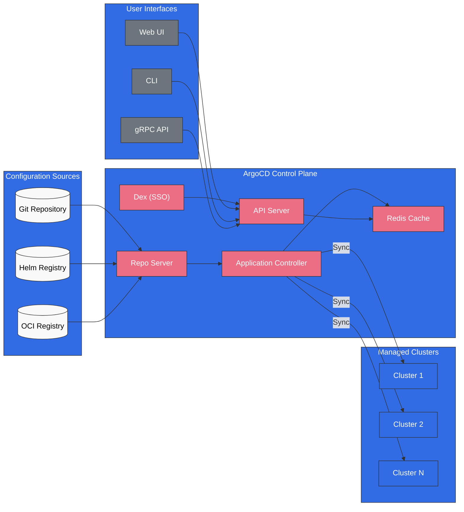
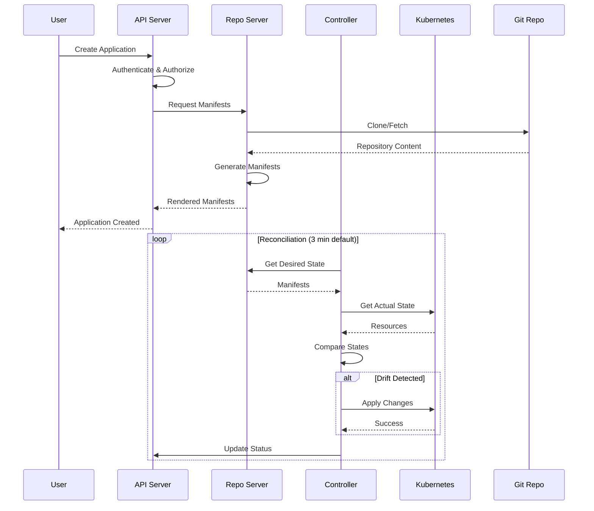

# ArgoCD

> **サポート対象バージョン**: ArgoCD v2.9+, Argo Rollouts v1.6+
> **最終更新**: August 24, 2026

## 目次
- [ArgoCD とは？](#what-is-argocd)
- [主な利点](#key-benefits)
- [アーキテクチャの概要](#architecture-overview)
- [コアコンセプト](#core-concepts)
- [サブガイドのナビゲーション](#sub-guide-navigation)
- [クイックスタート](#quick-start)
- [バージョン互換性](#version-compatibility)

## ArgoCD とは？

ArgoCD は、Kubernetes 向けの宣言的な GitOps 継続的デリバリーツールです。Git リポジトリで定義された望ましい状態をクラスター内の実際の状態と同期することで、Kubernetes クラスターへのアプリケーションのデプロイを自動化します。

CNCF の卒業プロジェクトとして、ArgoCD は GitOps ベースの Kubernetes デプロイにおける事実上の標準となっており、世界中の数千の組織で利用されています。



## 主な利点

### GitOps ネイティブ

- **唯一の信頼できる情報源としての Git**: すべてのアプリケーション設定を Git に保存
- **宣言的デプロイ**: 望ましい状態を定義すれば、残りは ArgoCD が処理
- **監査証跡**: Git コミットによりすべての変更の完全な履歴を保持
- **ロールバック**: 任意の以前の状態へ即座にロールバック

### マルチクラスター管理

- **一元的な制御**: 単一の ArgoCD インスタンスから数百のクラスターを管理
- **ApplicationSet**: テンプレートベースのマルチクラスターデプロイ
- **Cluster Generator**: ラベルに基づく動的なクラスターのターゲティング

### エンタープライズ対応

- **RBAC**: きめ細かなロールベースのアクセス制御
- **SSO 統合**: OIDC、SAML、LDAP をサポート
- **マルチテナンシー**: Project ベースの分離
- **高可用性**: 本番環境向けの HA デプロイ

### 開発者エクスペリエンス

- **Web UI**: 視覚的なアプリケーション管理とモニタリング
- **CLI**: フル機能のコマンドラインインターフェース
- **通知**: Slack、Teams、メール、webhook の統合
- **ヘルスモニタリング**: 組み込みおよびカスタムのヘルスチェック

## アーキテクチャの概要

### コアコンポーネント

| コンポーネント | 説明 | レプリカ数 (HA) |
|-----------|-------------|---------------|
| **API Server** | すべての API リクエスト、認証、RBAC を処理 | 2+ |
| **Repository Server** | リポジトリをクローンし、マニフェストを生成して結果をキャッシュ | 2+ |
| **Application Controller** | アプリケーションを監視し、状態を調整 | 2+ (シャーディング) |
| **Redis** | repo server と controller のキャッシュレイヤー | 3 (HA) |
| **Dex** | SSO 統合のための OIDC プロバイダー | 2+ |
| **Notification Controller** | イベント発生時に通知を送信 | 1+ |
| **ApplicationSet Controller** | ApplicationSet リソースを管理 | 1+ |

### データフロー



## コアコンセプト

### Application

Application CRD は ArgoCD の主要なリソースです。以下を定義します。
- **Source**: マニフェストの取得元（Git リポジトリ、Helm chart、OCI）
- **Destination**: デプロイ先（クラスターと namespace）
- **Sync Policy**: 同期の処理方法

### Project

Project は論理的なグループ化とアクセス制御を提供します。
- 使用可能なリポジトリを制限
- 宛先クラスターと namespace を制限
- 許可／拒否するリソースを定義

### ApplicationSet

ApplicationSet は、generator を使用して単一の定義から複数のアプリケーションを管理できます。
- **List Generator**: 静的な値のリスト
- **Cluster Generator**: 登録済みクラスターをターゲットに設定
- **Git Generator**: リポジトリのディレクトリ／ファイルをスキャン
- **Matrix/Merge**: 複数の generator を結合

### Sync

同期により、クラスターの状態を望ましい状態に一致させます。
- **Manual Sync**: ユーザーがトリガー
- **Auto Sync**: Git の変更時に自動実行
- **Self-Heal**: ドリフトを自動的に修正
- **Prune**: 孤立したリソースを削除

## サブガイドのナビゲーション

| ガイド | 説明 |
|-------|-------------|
| [インストール](01-installation.md) | インストール方法、CLI のセットアップ、HA 設定、EKS 統合 |
| [Applications](02-applications.md) | Application CRD、source の種類、ヘルスチェック、hook、App of Apps |
| [Sync 戦略](03-sync-strategies.md) | Sync policy、wave、window、diff、retry の設定 |
| [ApplicationSets](04-applicationsets.md) | すべての generator、テンプレート化、プログレッシブ Sync、マルチクラスターパターン |
| [トラフィック管理](05-traffic-management.md) | Argo Rollouts、blue-green、canary、分析、ingress 統合 |
| [Projects と RBAC](06-projects-rbac.md) | AppProject、RBAC policy、マルチテナンシー、JWT token |
| [セキュリティ](07-security.md) | SSO 統合、secret 管理、TLS、監査ログ |
| [通知](08-notifications.md) | 通知サービス、trigger、template、subscription |
| [ベストプラクティス](09-best-practices.md) | リポジトリパターン、パフォーマンスチューニング、トラブルシューティング、EKS のヒント |
| [Rollouts Experiments の詳細](10-rollouts-experiment.md) | Experiment CRD、エフェメラル ReplicaSet の検証、AnalysisRun の判定 |

## クイックスタート

### 1. ArgoCD をインストール

```bash
# Create namespace
kubectl create namespace argocd

# Install ArgoCD
kubectl apply -n argocd -f https://raw.githubusercontent.com/argoproj/argo-cd/stable/manifests/install.yaml

# Wait for pods to be ready
kubectl wait --for=condition=Ready pods --all -n argocd --timeout=300s
```

### 2. UI にアクセス

```bash
# Port forward to access locally
kubectl port-forward svc/argocd-server -n argocd 8080:443
```

### 3. 初期パスワードを取得

```bash
# Retrieve the initial admin password
kubectl -n argocd get secret argocd-initial-admin-secret \
  -o jsonpath="{.data.password}" | base64 -d && echo
```

### 4. CLI からログイン

```bash
# Install CLI (macOS)
brew install argocd

# Login
argocd login localhost:8080

# Change password (recommended)
argocd account update-password
```

### 5. 最初のアプリケーションをデプロイ

```bash
# Create application via CLI
argocd app create guestbook \
  --repo https://github.com/argoproj/argocd-example-apps.git \
  --path guestbook \
  --dest-server https://kubernetes.default.svc \
  --dest-namespace default

# Sync the application
argocd app sync guestbook
```

または宣言的に実行します。

```yaml
apiVersion: argoproj.io/v1alpha1
kind: Application
metadata:
  name: guestbook
  namespace: argocd
spec:
  project: default
  source:
    repoURL: https://github.com/argoproj/argocd-example-apps.git
    targetRevision: HEAD
    path: guestbook
  destination:
    server: https://kubernetes.default.svc
    namespace: default
  syncPolicy:
    automated:
      prune: true
      selfHeal: true
```

## バージョン互換性

### 2026 年 8 月の更新: EKS Managed Argo CD 機能のカスタム設定

2026 年 8 月 21 日、AWS は、Amazon EKS Capability for Argo CD がクラスター内の標準 `argocd-cm` ConfigMap を通じたカスタム設定をサポートするようになったと発表しました。Custom Resources のカスタムヘルスチェックを定義し、Argo CD UI バナーの内容をカスタマイズし、機能が管理対象リソースを監視および比較する方法を調整できます。これらは upstream Argo CD と同じ方法で設定され、AWS がその設定をマネージド機能に適用します。詳細は[発表](https://aws.amazon.com/about-aws/whats-new/2026/08/amazon-eks-argo-cd-configuration)と[設定ガイド](https://docs.aws.amazon.com/eks/latest/userguide/argocd-configure-settings.html)を参照してください。

### 2026 年 8 月の更新: ArgoCD 3.5 GA およびパッチリリース

ArgoCD v3.5.0 は 2026 年 8 月 7 日に GA となり、3.5 が現在の安定リリースラインになりました。続いて 8 月 12 日には、メンテナンス対象の 3 つのリリースラインに対する協調パッチ v3.5.1 / v3.4.7 / v3.3.14 がリリースされました。v3.5.1 には、ApplicationSet のプログレッシブ Sync がタイトなループで調整されるのを停止する修正や、server-side diff の Secret マスキング修正（`last-applied-configuration` annotation 内の secret を隠す修正を含む）などのバグ修正が含まれます。詳細は [v3.5.1 リリースノート](https://github.com/argoproj/argo-cd/releases/tag/v3.5.1)を参照してください。

### 2026 年 7 月の更新: ArgoCD 3.x パッチリリース

ArgoCD v3.4.5 は 2026 年 7 月 9 日にリリースされました。以下の表は 2.x 時代を基に作成されています。最新のバージョンごとのサポート情報については、[ArgoCD リリースページ](https://github.com/argoproj/argo-cd/releases)を確認してください。

KubeCon + CloudNativeCon Japan の併催イベントとして 2026 年 7 月 28 日に横浜で開催された ArgoCon Japan で、Argo CD のリードメンテナーが次期バージョン（3.5）の提案を共有しました（[CNCF ブログ](https://www.cncf.io/blog/2026/07/20/argocon-japan-2026-meeting-the-maintainers-enterprise-insights-and-the-road-to-argo-cd-3-5/)）。

### 2026 年 8 月の更新: ArgoCD v3.5.0 リリース

[ArgoCD v3.5.0](https://github.com/argoproj/argo-cd/releases/tag/v3.5.0) は 2026 年 8 月 4 日に GA となり、3.5 が現在の安定リリースラインになりました。主な変更点は以下のとおりです。

- **Helm 3 → Helm 4 への移行**: マニフェストのレンダリングで Helm 4 を使用
- **source integrity verification (Alpha)**: source hydrator 内のドライソースに対するオプトインの署名検証と、Source Integrity 設定の CLI サポート
- **ApplicationSet の改善**: 同時アプリケーション管理と、アーカイブ状態によるリポジトリのフィルタリング
- **Webhook jitter**: webhook によってトリガーされるアプリケーション更新に設定可能な jitter を追加し、サンダリングハードによる更新スパイクを平準化
- **UI**: New App パネルでのマルチ source アプリケーション作成、ApplicationSet Preview Apps タブ、リソースツリー内の AppSet ノード
- **新しいヘルスチェック**: GatewayClass、`BackendTLSPolicy` (Gateway API)、VictoriaMetrics、Gardener Shoot など

以前のリリースライン向けのパッチリリース v3.4.6 および v3.3.13 も、2026 年 7 月 31 日にリリースされました。

### Kubernetes 互換性

| ArgoCD バージョン | Kubernetes バージョン |
|----------------|---------------------|
| 2.13.x | 1.28 - 1.31 |
| 2.12.x | 1.27 - 1.30 |
| 2.11.x | 1.26 - 1.29 |
| 2.10.x | 1.25 - 1.28 |
| 2.9.x | 1.24 - 1.27 |

### Amazon EKS 互換性

| EKS バージョン | 推奨 ArgoCD |
|-------------|-------------------|
| 1.31 | 2.13.x |
| 1.30 | 2.12.x - 2.13.x |
| 1.29 | 2.11.x - 2.12.x |
| 1.28 | 2.10.x - 2.11.x |

### Argo Rollouts 互換性

| Rollouts バージョン | ArgoCD バージョン | 機能 |
|------------------|----------------|----------|
| 1.7.x | 2.10+ | 分析の改善 |
| 1.6.x | 2.9+ | 通知統合 |
| 1.5.x | 2.8+ | プログレッシブデリバリー |

## 次のステップ

1. **[インストールガイド](01-installation.md)**: 本番環境向けに ArgoCD をセットアップ
2. **[Applications ガイド](02-applications.md)**: Application CRD について学ぶ
3. **[ApplicationSets ガイド](04-applicationsets.md)**: マルチクラスターデプロイ

## リソース

- [ArgoCD 公式ドキュメント](https://argo-cd.readthedocs.io/)
- [ArgoCD GitHub リポジトリ](https://github.com/argoproj/argo-cd)
- [Argo Rollouts ドキュメント](https://argoproj.github.io/argo-rollouts/)
- [CNCF ArgoCD プロジェクトページ](https://www.cncf.io/projects/argo/)

## クイズ

学んだ内容を確認するには、[ArgoCD インストールクイズ](../../quizzes/gitops/argocd/01-installation-quiz.md)に挑戦してください。
