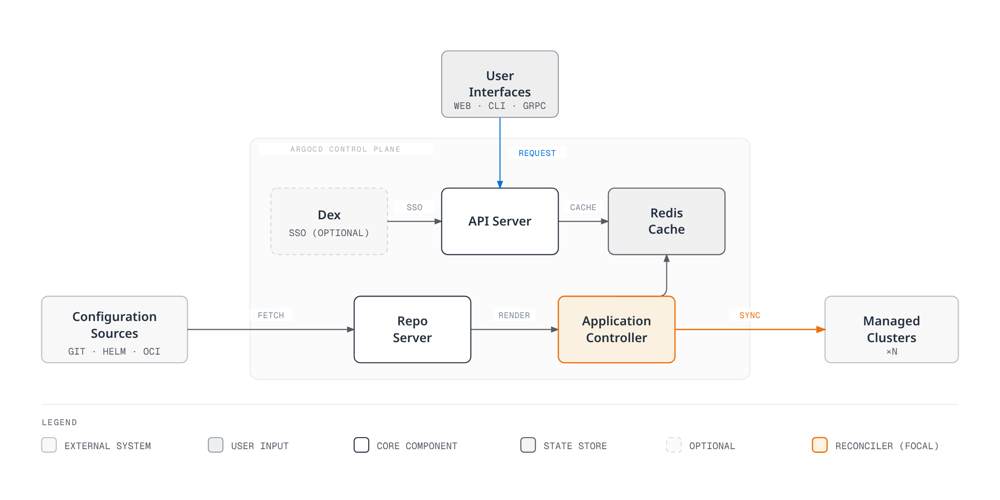
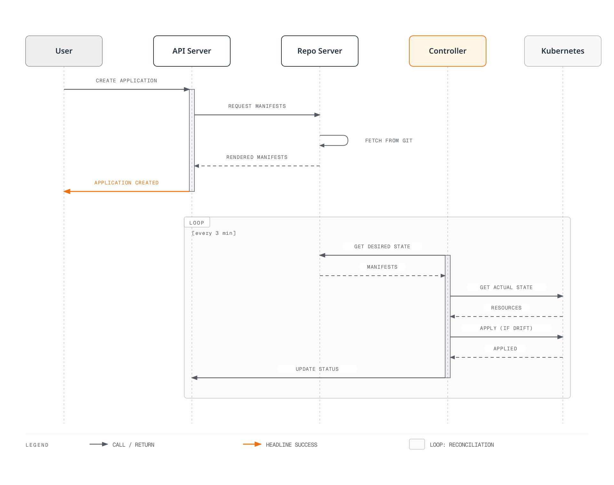

# ArgoCD

> **サポート対象バージョン**: ArgoCD v2.9+, Argo Rollouts v1.6+
> **最終更新**: August 31, 2026

## 目次
- [ArgoCD とは？](#what-is-argocd)
- [主な利点](#key-benefits)
- [アーキテクチャの概要](#architecture-overview)
- [コアコンセプト](#core-concepts)
- [サブガイドのナビゲーション](#sub-guide-navigation)
- [クイックスタート](#quick-start)
- [バージョン互換性](#version-compatibility)

## ArgoCD とは？

ArgoCD は、Kubernetes 向けの宣言的な GitOps 継続的デリバリーツールです。Git リポジトリで定義された望ましい状態をクラスタ内の実際の状態と同期することで、Kubernetes クラスタへのアプリケーションのデプロイを自動化します。

CNCF の卒業プロジェクトとして、ArgoCD は GitOps ベースの Kubernetes デプロイにおける事実上の標準となっており、世界中の数千の組織で利用されています。



## 主な利点

### GitOps ネイティブ

- **信頼できる唯一の情報源としての Git**: すべてのアプリケーション設定を Git に保存
- **宣言的デプロイ**: 望ましい状態を定義すれば、残りは ArgoCD が処理
- **監査証跡**: Git コミットを通じたすべての変更の完全な履歴
- **ロールバック**: 任意の以前の状態へ即座にロールバック

### マルチクラスタ管理

- **集中制御**: 単一の ArgoCD インスタンスから数百のクラスタを管理
- **ApplicationSet**: テンプレートベースのマルチクラスタデプロイ
- **Cluster Generator**: ラベルに基づく動的なクラスタターゲティング

### エンタープライズ対応

- **RBAC**: きめ細かなロールベースのアクセス制御
- **SSO 統合**: OIDC、SAML、LDAP をサポート
- **マルチテナンシー**: プロジェクトベースの分離
- **高可用性**: 本番環境に対応した HA デプロイ

### 開発者体験

- **Web UI**: 視覚的なアプリケーション管理とモニタリング
- **CLI**: 高機能なコマンドラインインターフェイス
- **通知**: Slack、Teams、メール、webhook との統合
- **ヘルスモニタリング**: 組み込みおよびカスタムのヘルスチェック

## アーキテクチャの概要

### コアコンポーネント

| コンポーネント | 説明 | レプリカ (HA) |
|-----------|-------------|---------------|
| **API Server** | すべての API リクエスト、認証、RBAC を処理 | 2+ |
| **Repository Server** | リポジトリをクローンし、マニフェストを生成して、結果をキャッシュ | 2+ |
| **Application Controller** | アプリケーションを監視し、状態を照合 | 2+ (シャーディング) |
| **Redis** | repo server と controller のためのキャッシュレイヤー | 3 (HA) |
| **Dex** | SSO 統合用の OIDC プロバイダー | 2+ |
| **Notification Controller** | イベント発生時に通知を送信 | 1+ |
| **ApplicationSet Controller** | ApplicationSet リソースを管理 | 1+ |

### データフロー



## コアコンセプト

### Application

Application CRD は ArgoCD の主要なリソースです。以下を定義します。
- **ソース**: マニフェストの取得元（Git リポジトリ、Helm チャート、OCI）
- **デスティネーション**: デプロイ先（クラスタと namespace）
- **Sync Policy**: 同期の処理方法

### Project

Project は論理的なグループ化とアクセス制御を提供します。
- 使用可能なリポジトリを制限
- デスティネーションのクラスタと namespace を制限
- 許可／拒否するリソースを定義

### ApplicationSet

ApplicationSet では、generator を使用して単一の定義から複数のアプリケーションを管理できます。
- **List Generator**: 値の静的なリスト
- **Cluster Generator**: 登録済みクラスタをターゲット化
- **Git Generator**: リポジトリのディレクトリ／ファイルをスキャン
- **Matrix/Merge**: 複数の generator を組み合わせ

### Sync

同期によりクラスタの状態を望ましい状態に一致させます。
- **手動 Sync**: ユーザーがトリガー
- **Auto Sync**: Git の変更時に自動実行
- **Self-Heal**: ドリフトを自動修正
- **Prune**: 孤立したリソースを削除

## サブガイドのナビゲーション

| ガイド | 説明 |
|-------|-------------|
| [インストール](01-installation.md) | インストール方法、CLI セットアップ、HA 構成、EKS 統合 |
| [Applications](02-applications.md) | Application CRD、ソースタイプ、ヘルスチェック、hook、App of Apps |
| [Sync 戦略](03-sync-strategies.md) | Sync Policy、wave、window、diff、リトライ設定 |
| [ApplicationSets](04-applicationsets.md) | すべての generator、テンプレート化、プログレッシブ Sync、マルチクラスタパターン |
| [トラフィック管理](05-traffic-management.md) | Argo Rollouts、blue-green、canary、分析、ingress 統合 |
| [Projects と RBAC](06-projects-rbac.md) | AppProject、RBAC ポリシー、マルチテナンシー、JWT トークン |
| [セキュリティ](07-security.md) | SSO 統合、secret 管理、TLS、監査ログ |
| [通知](08-notifications.md) | 通知サービス、トリガー、テンプレート、サブスクリプション |
| [ベストプラクティス](09-best-practices.md) | リポジトリパターン、パフォーマンスチューニング、トラブルシューティング、EKS のヒント |
| [Rollouts Experiments 詳細解説](10-rollouts-experiment.md) | Experiment CRD、一時的な ReplicaSet 検証、AnalysisRun の判定 |

## クイックスタート

### 1. ArgoCD をインストール

```bash
# Create namespace
kubectl create namespace argocd

# Install ArgoCD
kubectl apply -n argocd -f https://raw.githubusercontent.com/argoproj/argo-cd/stable/manifests/install.yaml

# Wait for pods to be ready
kubectl wait --for=condition=Ready pods --all -n argocd --timeout=300s
```

### 2. UI にアクセス

```bash
# Port forward to access locally
kubectl port-forward svc/argocd-server -n argocd 8080:443
```

### 3. 初期パスワードを取得

```bash
# Retrieve the initial admin password
kubectl -n argocd get secret argocd-initial-admin-secret \
  -o jsonpath="{.data.password}" | base64 -d && echo
```

### 4. CLI でログイン

```bash
# Install CLI (macOS)
brew install argocd

# Login
argocd login localhost:8080

# Change password (recommended)
argocd account update-password
```

### 5. 最初のアプリケーションをデプロイ

```bash
# Create application via CLI
argocd app create guestbook \
  --repo https://github.com/argoproj/argocd-example-apps.git \
  --path guestbook \
  --dest-server https://kubernetes.default.svc \
  --dest-namespace default

# Sync the application
argocd app sync guestbook
```

または、宣言的に作成します。

```yaml
apiVersion: argoproj.io/v1alpha1
kind: Application
metadata:
  name: guestbook
  namespace: argocd
spec:
  project: default
  source:
    repoURL: https://github.com/argoproj/argocd-example-apps.git
    targetRevision: HEAD
    path: guestbook
  destination:
    server: https://kubernetes.default.svc
    namespace: default
  syncPolicy:
    automated:
      prune: true
      selfHeal: true
```

## バージョン互換性

### 2026 年 8 月の更新: ArgoCD v3.5.2 / v3.4.8 パッチリリース

2026 年 8 月 27 日、保守対象のリリースライン向けパッチである v3.5.2 と v3.4.8 がリリースされました。v3.5.2 には、Sync 中により新しいコミットが到着した場合に Auto Sync がスキップされる問題、ApplicationSet の正規化後に `ignoreApplicationDifferences` が復元されない問題、notification controller が共有キャッシュのオブジェクトを最初にディープコピーせずに変更する問題などのバグ修正が含まれます。詳細は [v3.5.2 リリースノート](https://github.com/argoproj/argo-cd/releases/tag/v3.5.2)を参照してください。

### 2026 年 8 月の更新: EKS マネージド Argo CD 機能のカスタム構成

2026 年 8 月 21 日、AWS は、Amazon EKS Capability for Argo CD がクラスタ内の標準 `argocd-cm` ConfigMap を介したカスタム構成をサポートするようになったと発表しました。Custom Resources のカスタムヘルスチェックの定義、Argo CD UI バナーの内容のカスタマイズ、機能が管理するリソースの監視および比較方法の調整を行えます。これらはアップストリーム Argo CD と同じ方法で構成でき、AWS が設定をマネージド機能に適用します。詳細は[発表](https://aws.amazon.com/about-aws/whats-new/2026/08/amazon-eks-argo-cd-configuration)および[構成ガイド](https://docs.aws.amazon.com/eks/latest/userguide/argocd-configure-settings.html)を参照してください。

### 2026 年 8 月の更新: ArgoCD 3.5 GA およびパッチリリース

ArgoCD v3.5.0 は 2026 年 8 月 7 日に GA となり、3.5 が現在の安定リリースラインになりました。続いて 8 月 12 日には、保守対象の 3 つのリリースラインに対する協調パッチ v3.5.1 / v3.4.7 / v3.3.14 がリリースされました。v3.5.1 には、ApplicationSet のプログレッシブ Sync がタイトなループで照合を行うことを防ぐ修正や、サーバーサイド diff での Secret マスキング修正（`last-applied-configuration` アノテーション内の secret を非表示にする修正を含む）などのバグ修正が含まれます。詳細は [v3.5.1 リリースノート](https://github.com/argoproj/argo-cd/releases/tag/v3.5.1)を参照してください。

### 2026 年 7 月の更新: ArgoCD 3.x パッチリリース

ArgoCD v3.4.5 は 2026 年 7 月 9 日にリリースされました。以下の表は 2.x 時代に作成されたものです。バージョンごとの最新のサポート情報については、[ArgoCD リリースページ](https://github.com/argoproj/argo-cd/releases)を確認してください。

KubeCon + CloudNativeCon Japan の併催イベントとして横浜で 2026 年 7 月 28 日に開催された ArgoCon Japan において、Argo CD のリードメンテナーが次期バージョン（3.5）の提案を共有しました（[CNCF ブログ](https://www.cncf.io/blog/2026/07/20/argocon-japan-2026-meeting-the-maintainers-enterprise-insights-and-the-road-to-argo-cd-3-5/)）。

### 2026 年 8 月の更新: ArgoCD v3.5.0 リリース

[ArgoCD v3.5.0](https://github.com/argoproj/argo-cd/releases/tag/v3.5.0) は 2026 年 8 月 4 日に GA となり、3.5 が現在の安定リリースラインになりました。主な変更点は次のとおりです。

- **Helm 3 → Helm 4 移行**: マニフェストのレンダリングで Helm 4 を使用
- **ソース整合性検証 (Alpha)**: source hydrator 内のドライソースに対するオプトインの署名検証と、Source Integrity 構成の CLI サポート
- **ApplicationSet の改善**: 同時アプリケーション管理とアーカイブ状態によるリポジトリフィルタリング
- **Webhook ジッター**: webhook がトリガーするアプリケーション更新に対し、サンダリングハードの更新スパイクを平準化する設定可能なジッター
- **UI**: New App パネルでのマルチソースアプリケーション作成、ApplicationSet Preview Apps タブ、リソースツリー内の AppSet ノード
- **新しいヘルスチェック**: GatewayClass、`BackendTLSPolicy` (Gateway API)、VictoriaMetrics、Gardener Shoot など

前のリリースライン向けのパッチリリース v3.4.6 および v3.3.13 も、2026 年 7 月 31 日にリリースされました。

### Kubernetes 互換性

| ArgoCD バージョン | Kubernetes バージョン |
|----------------|---------------------|
| 2.13.x | 1.28 - 1.31 |
| 2.12.x | 1.27 - 1.30 |
| 2.11.x | 1.26 - 1.29 |
| 2.10.x | 1.25 - 1.28 |
| 2.9.x | 1.24 - 1.27 |

### Amazon EKS 互換性

| EKS バージョン | 推奨 ArgoCD |
|-------------|-------------------|
| 1.31 | 2.13.x |
| 1.30 | 2.12.x - 2.13.x |
| 1.29 | 2.11.x - 2.12.x |
| 1.28 | 2.10.x - 2.11.x |

### Argo Rollouts 互換性

| Rollouts バージョン | ArgoCD バージョン | 機能 |
|------------------|----------------|----------|
| 1.7.x | 2.10+ | 分析の改善 |
| 1.6.x | 2.9+ | 通知統合 |
| 1.5.x | 2.8+ | プログレッシブデリバリー |

## 次のステップ

1. **[インストールガイド](01-installation.md)**: 本番環境向けに ArgoCD をセットアップ
2. **[Applications ガイド](02-applications.md)**: Application CRD について学ぶ
3. **[ApplicationSets ガイド](04-applicationsets.md)**: マルチクラスタデプロイ

## リソース

- [ArgoCD 公式ドキュメント](https://argo-cd.readthedocs.io/)
- [ArgoCD GitHub リポジトリ](https://github.com/argoproj/argo-cd)
- [Argo Rollouts ドキュメント](https://argoproj.github.io/argo-rollouts/)
- [CNCF ArgoCD プロジェクトページ](https://www.cncf.io/projects/argo/)

## クイズ

学んだ内容を確認するには、[ArgoCD インストールクイズ](../../quizzes/gitops/argocd/01-installation-quiz.md)に挑戦してください。
