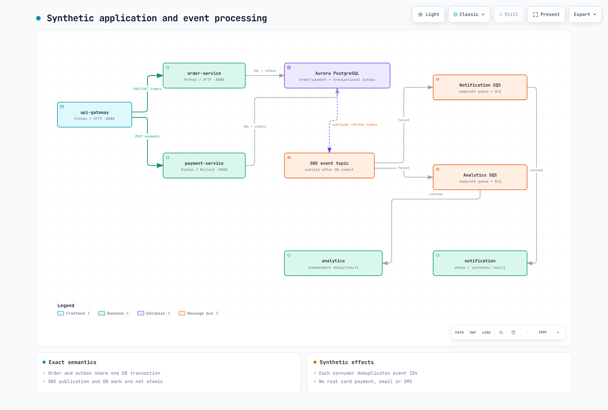

# パート3: MSA のデプロイとカナリア

<span id="application-structure"></span>
<span id="architecture-overview"></span>
<span id="canary-state-diagram"></span>
<span id="cleanup"></span>
<span id="exercise-1-msa-application-overview"></span>
<span id="exercise-2-karpenter-nodepool-configuration"></span>
<span id="exercise-3-keda-scaledobject-configuration"></span>
<span id="exercise-4-argocd-application-deployment"></span>
<span id="exercise-5-opentelemetry-auto-instrumentation"></span>
<span id="exercise-6-argo-rollouts-canary-deployment"></span>
<span id="exercise-7-intentional-failure-and-automatic-rollback"></span>
<span id="learning-objectives"></span>
<span id="next-steps"></span>
<span id="prerequisites"></span>
<span id="references"></span>
<span id="repository-structure"></span>
<span id="sample-code-snippets"></span>
<span id="service-call-flow"></span>
<span id="steps"></span>
<span id="steps-1"></span>
<span id="steps-2"></span>
<span id="steps-3"></span>
<span id="steps-4"></span>
<span id="steps-5"></span>
<span id="summary"></span>
<span id="troubleshooting"></span>
<span id="verification"></span>
<span id="verification-1"></span>
<span id="verification-2"></span>
<span id="verification-3"></span>
<span id="verification-4"></span>
<span id="verification-5"></span>

> **難易度**: 上級
> **最終更新**: September 13, 2026
実行可能な 5 つの Python ロールを個別のワークロードとしてデプロイします。[アプリケーション README](https://github.com/Atom-oh/kubernetes-docs/tree/main/examples/labs/observability/application) がコード、DB、イメージ、チャートの入力を定義します。決済と通知は疑似実装であり、実際の課金やメール/SMS の送信は行われません。



[🔍 インタラクティブ図を表示](https://www.atomai.click/kubernetes-docs/archmaps/en-labs-observability-03-msa-deployment-lab-10.html)

## 1. 共有 API と永続化のコントラクト {#contracts}

| リクエスト/ロール | コントラクト |
|---|---|
| `POST /orders` | 201 + `id`。order と outbox を同一トランザクションでコミット |
| `POST /payments` | 200 + `status: completed`。同一の order/amount/method は冪等 |
| `GET /orders/{id}` | 200 + 同一 ID、または 404 |
| `notification` | 専用の SQS キュー、永続化された疑似通知 |
| `analytics` | 別の SQS キュー、独立して永続化される結果 |

W3C コンテキストは gateway/service 間の HTTP と producer/consumer の境界を越えて伝播します。outbox への publish 後、DB へのマーク付け前にクラッシュすると再配信が発生するため、consumer はイベント ID をトランザクション内で重複排除します。ただしこれによって外部のメールや決済の副作用が exactly once になるわけではありません。order の POST に対する汎用的な Idempotency-Key の処理は含まれていません。

アプリのメトリクスは `lab_http_requests_total` と `lab_http_request_duration_seconds` で、service/route/status/revision のラベルが付きます。JSON ログには service/level/trace_id/span_id が含まれます。顧客や決済のペイロードはメトリクスのラベルにはしません。

## 2. データベースファイルとイメージ {#image-database}

パート1 の専用ランタイムアカウントとプライベート接続ファイルを使用します。Pod 内のパスは `/run/database-ca/global-bundle.pem` と `/run/database/connection.json` です。接続ファイルとパブリックな RDS CA を、それぞれ Secret / ConfigMap として個別にマウントします。

```bash
cd examples/labs/observability/application
kubectl --context service create namespace msa --dry-run=client -o yaml | kubectl --context service apply -f -
kubectl --context service -n msa create secret generic lab-database --from-file=connection.json="$LAB_STATE/runtime-pod-connection.json"
kubectl --context service -n msa create configmap lab-database-ca --from-file=global-bundle.pem="$LAB_STATE/global-bundle.pem"
docker buildx build --platform linux/amd64 \
  --tag "$IMAGE_REPOSITORY:$IMAGE_TAG" --push .
docker buildx imagetools inspect "$IMAGE_REPOSITORY:$IMAGE_TAG"
```
パート1 で選択したイミュータブルなバージョンを使用します。既存の Secret を更新する場合は、値を出力したりチャートファイルに埋め込んだりせず、組織のローテーション手順に従ってください。Dockerfile ではベースイメージのダイジェスト、UID 10001、範囲を限定したビルドコンテキストを固定しています。

生成される `m6i.large` ノードは AMD64 です。AMD64 対応またはクロスプラットフォーム対応の Buildx builder を使用し、デプロイ前にプッシュしたマニフェストに `linux/amd64` が含まれることを確認してください。監査時のローカル ARM64 スモークテストでは AMD64 ビルドを検証できません。

## 3. コントローラーとチャートのインストール {#deployment}

```bash
helm repo add kedacore https://kedacore.github.io/charts
helm repo add argo https://argoproj.github.io/argo-helm
helm upgrade --install keda kedacore/keda --version 2.20.2   --kube-context service -n keda --create-namespace -f "$LAB_STATE/helm-inputs/keda.yaml"
helm upgrade --install argo-rollouts argo/argo-rollouts --version 2.43.1   --kube-context service -n argo-rollouts --create-namespace
helm upgrade --install observability-lab ./chart --kube-context service -n msa   -f "$LAB_STATE/helm-inputs/application.yaml"
kubectl --context service -n msa get deployment,rollout,pods,svc,scaledobject
```
5 つの ServiceAccount と IRSA のサブジェクトをすべて確認します。Gateway に AWS ロールはありません。publisher は SNS に、consumer は自身のキューに、KEDA はキューの属性のみにアクセスします。1 つのワークロードに Pod Identity と IRSA の経路を重複して設定しないでください。Readiness は DB とスキーマを確認するもので、SQS/IAM への配信成功を確認するものではありません。

ServiceMonitor のラベルは service クラスターの Prometheus リリースと一致し、`honorLabels` によりアプリ側の service ラベルが保持されます。マネージドノードグループでベースラインを実行できます。Karpenter を追加するのは、[別ガイド](../../autoscaling/02-karpenter.md) で IAM/ディスカバリー/EC2NodeClass/AMI/taint を検証した後にしてください。


[🔍 インタラクティブ図を表示](https://www.atomai.click/kubernetes-docs/archmaps/en-labs-observability-03-msa-deployment-lab-0.html)

## 4. HTTP と非同期処理の検証 {#verify}

```bash
kubectl --context service -n msa port-forward svc/api-gateway 8080:8080
# Run in another terminal from the repository root:
BASE_URL=http://127.0.0.1:8080 LOAD_PROFILE=smoke   k6 run --no-usage-report examples/labs/observability/load-test/k6-scenario.js
```
作成された ID のみを読み取り、疑似決済の状態を検証します。キューごとに独立して配信されていること、および consumer の `/stats`、DB のカウント、ログが増加していることを確認します。notification と analytics は別々のキューを使用します。1 つのキューに競合する consumer を並べても fanout にはなりません。処理に失敗したメッセージや poison メッセージは、DLQ ポリシーのために ack されないまま残ります。

CloudWatch/Loki の JSON に含まれる trace_id、Tempo の実際のスパン、Prometheus の exemplar の ID を比較します。collector をインストールしただけではエンドツーエンドの検証にはなりません。

## 5. カナリアと GitOps の所有権 {#canary}


[🔍 インタラクティブ図を表示](https://www.atomai.click/kubernetes-docs/archmaps/en-labs-observability-03-msa-deployment-lab-1.html)
1 つの Rollout が payment-service を所有します。レプリカ数が 5 の場合、20% のステップはレプリカ単位であり、実際のリクエストの 20% を保証するものではありません。分析の前の manual pause の間に、新しいリビジョンへトラフィックを流してください。クエリは `rollouts-pod-template-hash` で対象を選択し、直近のリクエストが 5 件以上、成功率 99% を要求し、空/NaN/Inf/複数系列の結果を拒否します。

実際の Rollouts 1.10.0 の条件評価と PromQL はテスト済みですが、クラスターでの promote は実行していません。abort は Git の revert や目的のイメージへの復元ではありません。ArgoCD を任意で利用する場合は、[インストールガイド](../../gitops/argocd/01-installation.md) に従い、このリポジトリの実際のチャートパスとレビュー済みリビジョンを指定し、Helm による直接の所有権と同時に使用しないでください。Secret はコミットせず、既存の Secret を参照します。app-of-apps の sync wave だけでは子リソースの Readiness は保証されません。

### manual pause を体験する

以下の手順では Helm を望ましい状態 (desired state) の所有者として使用します。GitOps では、イメージの変更と復旧を Git 上でレビューし、Helm による直接の書き込みを混在させないでください。[Argo Rollouts 1.10.0 リリース](https://github.com/argoproj/argo-rollouts/releases/tag/v1.10.0) のバイナリとチェックサムを確認したうえで、OS/CPU に合致するプラグインをインストールします。

```bash
# ROLLOUTS_BINARY: checksum-verified binary for your OS/architecture.
: "${ROLLOUTS_BINARY:?Set the verified Argo Rollouts 1.10.0 binary path}"
mkdir -p "$HOME/.local/bin"
install -m 755 "$ROLLOUTS_BINARY" "$HOME/.local/bin/kubectl-argo-rollouts"
export PATH="$HOME/.local/bin:$PATH"
kubectl argo rollouts version --short
```

Rollout が stable であることを確認し、その完全な values を保持したうえで、パート3 のビルド手順で実際にレビュー済みの AMD64 イメージを新しいイミュータブルタグとして公開します。初回インストールでは以前の stable リビジョンが存在しないため、この更新演習には該当しません。チャートは 1 つのイメージ設定をすべてのロールで共有するため、これを変更すると他のロールも通常の Deployment として更新されます。Rollout のステップに従うのは payment のみです。

```bash
# Run from examples/labs/observability/application.
: "${CANARY_IMAGE_TAG:?Set an actually built and reviewed immutable AMD64 image tag}"
# Keep the original application.yaml as the stable revision's complete values.
CANARY_VALUES="$LAB_STATE/helm-inputs/canary-image.yaml"
python3 - "$CANARY_VALUES" "$CANARY_IMAGE_TAG" <<'PYIMAGE'
import sys, json
with open(sys.argv[1], "w") as output:
    json.dump({"image": {"tag": sys.argv[2]}}, output)
PYIMAGE
helm upgrade observability-lab ./chart --kube-context service -n msa \
  -f "$LAB_STATE/helm-inputs/application.yaml" -f "$CANARY_VALUES"
kubectl argo rollouts get rollout payment-service --context service -n msa --watch
```

--watch の表示は別のターミナルで維持し、必要に応じて Ctrl+C で停止します。トラフィック生成と promote/abort のコマンドは、さらに別のターミナルで実行してください。

Paused の間はセクション 4 のトラフィックを継続し、新しい rollouts-pod-template-hash のリビジョンに直近のリクエストが 5 件以上到達していることを Prometheus で確認します。トラフィックの欠落やクエリの失敗は成功ではありません。確認後、下記の manual pause を進めることで、設定済みの AnalysisRun と後続のステップが実行されます。--full は使用しないでください。分析と pause をスキップしてしまいます。

```bash
kubectl argo rollouts promote payment-service --context service -n msa
kubectl argo rollouts get rollout payment-service --context service -n msa --watch
kubectl --context service -n msa get analysisruns
```

問題が発生した場合は promote せずに abort し、元の完全な values を通じて目的のイメージへ復元します。abort だけでは spec.template や Git は復元されません。

```bash
kubectl argo rollouts abort payment-service --context service -n msa
helm upgrade observability-lab ./chart --kube-context service -n msa \
  -f "$LAB_STATE/helm-inputs/application.yaml"
kubectl argo rollouts get rollout payment-service --context service -n msa --watch
```

promote に成功したら、承認済みイメージのオーバーレイを以降の Helm コマンドでも保持するか、管理している望ましい values に取り込みます。障害分析の証跡を保存し、最終状態を確認してください。本監査では CLI のチェックサム/ヘルプと、チャートおよび分析ロジックを検証しましたが、これらのクラスターに対する update/promote/abort コマンドは実行していません。

[パート4](./04-load-testing-scaling-lab.md) に進みます。所有権と依存関係を考慮したクリーンアップは [パート6](./06-distributed-tracing-lab.md#cleanup) に従ってください。

## 検証範囲

検証対象は、ローカルの SQLite/PostgreSQL、3 つの HTTP サービス、OTel の相関付け、SNS/SQS SDK のスタブ、コンテナのスモークテスト、Helm/CRD、PromQL/Argo の条件です。実際の Aurora TLS、EKS/IRSA、SNS fanout、KEDA/Karpenter、カナリアのトラフィック分割は実施していません。
