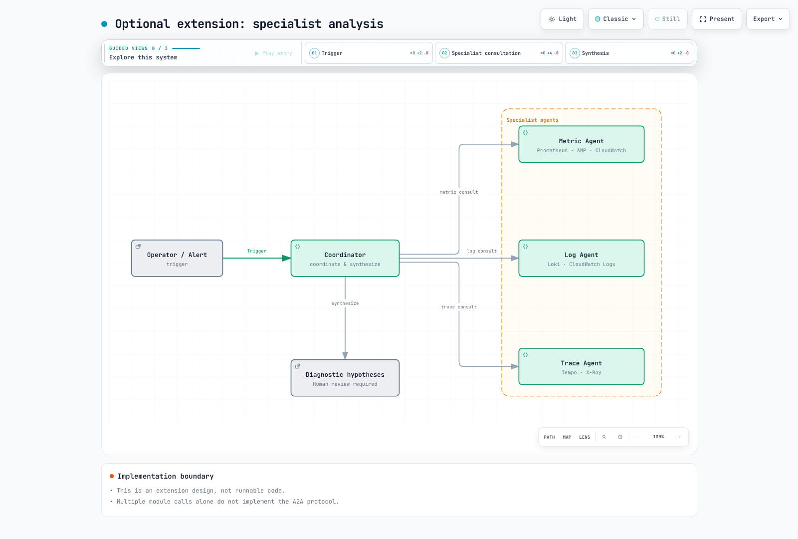

# パート 5: アラートと AIOps

<span id="architecture-overview"></span>
<span id="cleanup"></span>
<span id="exercise-1-alertmanager-prometheusrules"></span>
<span id="exercise-2-cloudwatch-alarms"></span>
<span id="exercise-3-grafana-oncall-setup"></span>
<span id="exercise-4-sns-topic-and-email-subscription"></span>
<span id="exercise-5-cloudwatch-investigations"></span>
<span id="exercise-6-aiops-agent-with-lambda-and-bedrock"></span>
<span id="exercise-7-load-and-fault-injection"></span>
<span id="exercise-8-verify-aiops-pipeline"></span>
<span id="exercise-9-advanced-a2a-multi-agent-pattern"></span>
<span id="learning-objectives"></span>
<span id="next-steps"></span>
<span id="prerequisites"></span>
<span id="references"></span>
<span id="steps"></span>
<span id="steps-1"></span>
<span id="steps-2"></span>
<span id="steps-3"></span>
<span id="steps-4"></span>
<span id="steps-5"></span>
<span id="steps-6"></span>
<span id="steps-7"></span>
<span id="steps-8"></span>
<span id="summary"></span>
<span id="troubleshooting"></span>
<span id="verification-1"></span>
<span id="verification-checklist"></span>

> **難易度**: 上級 · **推定所要時間**: 60 分
> **最終更新**: September 13, 2026

アラートを受信し、実際のメトリクスと集約ログを調査してから、人によるレビューのための診断仮説を作成します。[実行可能な例](https://github.com/Atom-oh/kubernetes-docs/tree/main/examples/labs/observability/aiops)は、入力/出力 SNS トピックを分離した Lambda レポーターです。自動修復や匿名 HTTP webhook は含まれていません。

前提条件は、[パート 2](./02-observability-stack-lab.md)の取り込み、[パート 3](./03-msa-deployment-lab.md)のサービス、および[パート 4](./04-load-testing-scaling-lab.md)の smoke test の成功です。コードとテンプレートはローカルで確認済みですが、この監査では AWS デプロイ、モデル呼び出し、通知は実行していません。


[🔍 インタラクティブな図を表示](https://www.atomai.click/kubernetes-docs/archmaps/en-labs-observability-05-alerting-aiops-lab-0.html)

## 1. 評価とルーティングを分離する {#rules-and-routing}

**Prometheus がアラートルールを評価**し、**Alertmanager がグループ化、重複排除、ルーティング、抑制、通知を処理**します。`PrometheusRule` は Prometheus Operator の CRD であり、Alertmanager 自体が評価するリソースではありません。

| 設定 | 確認事項 |
|---|---|
| Prometheus `for` | 評価をまたいで条件が継続している間は Pending となり、その後 firing になる |
| ルールセレクター | Prometheus CR 内の実際の namespace/label セレクターがルールを選択する |
| Alertmanager ルート | `matchers`、ルート順序、子、`continue`、receiver の一致 |
| メトリクス | 実際の SDK 名、単位、ラベル、不足している series、トラフィックなし、counter reset |
| Service ラベル | レポーターカタログ内のサービスのみ許可される |

`up == 0` は、すでに認識されている scrape target の障害を検出しますが、未発見のすべての target を検出するものではありません。再起動の増加は CrashLoopBackOff とは異なり、古い OOMKilled 状態は新しい OOM event とは異なります。PromQL の SQS メトリクス名だけでは、exporter なしにデータを作成できません。

```bash
kubectl --context managed -n monitoring get prometheus,alertmanager,prometheusrule
kubectl --context managed -n monitoring get services
# Use the actual Prometheus Service name in the next command.
kubectl --context managed -n monitoring port-forward svc/REPLACE_WITH_PROMETHEUS_SERVICE 9090:9090
```

```bash
curl --fail --silent http://127.0.0.1:9090/api/v1/rules
curl --fail --silent http://127.0.0.1:9090/api/v1/alerts
```

インストール済みの chart release から名前を置き換えてください。別の release 名を想定したり、存在しない ConfigMap を検索したりしないでください。リソースの存在と、実際に Prometheus が読み込み/評価していることは別々に確認する必要があります。

## 2. CloudWatch アラームのセマンティクス {#cloudwatch-alarms}

テンプレートの backlog アラームでは、`AWS/SQS`、`ApproximateNumberOfMessagesVisible`、完全一致の `QueueName`、`Maximum`、`Period=60`、`EvaluationPeriods=3`、`DatapointsToAlarm=2` を使用します。これは評価された datapoint の**3 つ中 2 つ**を意味し、違反は連続している必要はありません。`Period` は集計の粒度であり、評価頻度の同義語ではありません。

このラボでは欠損データを `missing` のまま扱います。非アクティブな queue や壊れた取り込みから健全なゼロ値を推測しないでください。RDS CPU を追加する際は、実際の instance メトリクス dimension `DBInstanceIdentifier` を使用してください。cluster aggregate や別の statistic を使用する前に、サポートされている dimension を確認します。

Alertmanager の再送、CloudWatch の状態遷移、SNS 配信、Lambda の非同期 retry は別々のレイヤーです。1 つのレイヤーでの重複排除では、エンドツーエンドの exactly-once 配信を保証できません。

## 3. サポートされている on-call パスを選択する {#oncall}

Grafana OnCall OSS は**2026 年 3 月 24 日にアーカイブ**され、Cloud Connection ベースの SMS、電話、push サポートも終了しました。古い新規インストールの手順や架空の escalation YAML を再利用しないでください。[公式のメンテナンス通知](https://grafana.com/docs/oncall/latest/set-up/open-source/)に従い、既存の incident/notification システムや Grafana Cloud IRM など、現在サポートされているパスを選択してください。

この例では出力 SNS トピックを提供します。選択したシステムで responder、escalation、acknowledgement、resolution を設定し、実際の配信を検証してください。テンプレートでは email、Slack、PagerDuty の subscription は自動作成されません。

## 4. 診断レポーターを準備する {#reporter}


[🔍 インタラクティブな図を表示](https://www.atomai.click/kubernetes-docs/archmaps/en-labs-observability-05-alerting-aiops-lab-10.html)
| ファイル | 責務 |
|---|---|
| `alerts.py` | SNS topic/format/allowlist と CloudWatch/Alertmanager の正規化 |
| `evidence.py` | 設定された CloudWatch メトリクスと集約ログの読み取り |
| `analysis.py` | 利用可能な evidence のみで Converse を実行し、出力 token は 1024、完了を確認 |
| `handler.py` | 2 worker による収集、Powertools idempotency、出力 topic への publish |
| `template.yaml` | 15 個の SAM/CloudFormation リソースとスコープを限定した IAM |
| `tests/` | 成功、失敗、重複、timeout、欠損データ |

```bash
cd examples/labs/observability/aiops
python3.12 -m venv .venv
.venv/bin/python -m pip install -r requirements.txt
.venv/bin/python -m unittest discover -s tests -v
```

コードは boto3 **1.43.93**、Powertools **3.34.0**、Python **3.12** で確認しました。実際にデプロイするには、既存の SQS queue/log group、承認済みの Service 名、現在利用可能な Converse model/inference-profile ID、およびその**完全一致の model/profile ARN**を指定してください。廃止された Claude model を hard-code しないでください。cross-region profile では、destination-model ARN の permission も必要になる場合があります。

ログには構造化された `service` および `level` フィールドが必要です。レポーターは生の message ではなく集約された error count をクエリし、モデルが生成したリソース ID やクエリを実行することはありません。不足/失敗した source は `no_data`/`error` のままとなり、分析が skip される可能性があります。設定されていない AMP 値や X-Ray trace を収集すると主張するものではありません。

## 5. Alertmanager をデプロイして接続する {#deploy}

```bash
sam build --template-file template.yaml
sam deploy --guided --capabilities CAPABILITY_IAM
```

operator は、change set を確認した後、承認済みのラボアカウントでこれらを実行します。テンプレートは暗号化された入力/出力 SNS topic、Lambda、idempotency table、failure queue、queue alarm を作成します。`AWS_REGION` など、予約済みの Lambda environment variable を上書きしません。

以下のデプロイ済み InputTopicArn と実際の Region に置き換えてください。`toJson` のシリアル化は Alertmanager **0.34.0** の native template で検証済みです。receiver/route を丸ごと上書きするのではなく、インストール環境で実際に読み込まれている設定へマージしてください。

```yaml
receivers:
- name: lab-diagnostics
  sns_configs:
  - topic_arn: REPLACE_WITH_INPUT_TOPIC_ARN
    sigv4:
      region: REPLACE_WITH_REGION
    message: '{{ . | toJson }}'
    send_resolved: true
```

`toJson` は JSON tag を尊重し、`alerts`、`labels`、`status`、`startsAt` のような camelCase key を生成します。先頭が大文字の Go template access（`.Alerts`）は、シリアル化された JSON key とは異なります。parser が大文字のサポートを保持しているのは互換性のためだけです。デフォルトの人間が読める SNS message はこの JSON format ではありません。

テンプレートの AlertmanagerPublishPolicyArn は、既存の**Alertmanager workload role**にのみアタッチしてください。Pod の credential path と KMS/SNS permission を確認し、共有 node role を拡張しないでください。`service` ラベルと許可されるアラート名を catalog/rule に一致させます。レポーターを OutputTopicArn に subscribe してはなりません。

## 6. Retry、evidence、完了 {#execution}


[🔍 インタラクティブな図を表示](https://www.atomai.click/kubernetes-docs/archmaps/en-labs-observability-05-alerting-aiops-lab-2.html)
成功した SNS message ID は、DynamoDB で**24 時間**重複排除されます。同じ ID で payload が変更された場合は拒否されます。SNS 配信は at least once であり、publish と idempotency commit の間で障害が発生すると通知が重複する可能性があります。これは exactly-once 配信ではありません。

Lambda の reserved concurrency は 2、非同期 retry は 2、最大 event age は Lambda が event を受け入れてから 1 時間です。SNS 配信 retry は別です。結果、failure queue、replay 手順を調査してください。生の event や credential を出力しないでください。

読み取りは現在時刻から遡って最大 15 分を使用し、実際の開始/終了時刻を報告します。元の alarm period を正確に再構築するものではありません。Logs Insights は制限付きで poll し、完了していない query を cancel します。切り詰められた（`max_tokens`）、ブロックされた、または空の model output は、完了した診断として publish されません。

## 7. CloudWatch Investigations を別途設定する {#investigations}


[🔍 インタラクティブな図を表示](https://www.atomai.click/kubernetes-docs/archmaps/en-labs-observability-05-alerting-aiops-lab-1.html)
まず、アカウント用に investigation group、permission、retention、encryption を準備します。次に、group ARN をアラームの**Investigation action**として追加します。metric または composite alarm で investigation を開始できます。ARN の形式は次のとおりです。

```text
arn:aws:aiops:REGION:ACCOUNT_ID:investigation-group/GROUP_ID
```

[公式手順](https://docs.aws.amazon.com/AmazonCloudWatch/latest/monitoring/Investigations-configure-alarm-procedures.html)に従い、action を追加する際は既存の alarm 設定を保持してください。`put-anomaly-detector`、`put-insight-rule`、`list-dashboards` は、investigation-group の作成/list-investigation API ではありません。Application Signals discovery を有効化するだけでは、この設定は完了しません。サンプルの SAM stack は investigation group を作成しません。

## 8. Fault injection と運用検証 {#verification}

最初に、健全な smoke baseline と通知パスを記録してください。アプリケーションが実際に実装している fault control のみを、時間制限、target、recovery plan を備えた専用 canary で使用します。存在しない `/admin/chaos` endpoint や未使用の environment flag を呼び出さないでください。Pod を削除しても CrashLoopBackOff が発生する保証はありません。

GitOps が所有する workload の変更と復旧は、Git/サポートされている Rollouts フローを通じて行います。Deployment と Rollout を混同したり、負の JSON Patch index を使用して environment variable を削除したりしないでください。

1. Prometheus がルールを読み込み、pending/firing を経て遷移することを確認します。
2. 選択された Alertmanager receiver と入力 SNS message を調査します。
3. Lambda の完了/失敗、DLQ、idempotency の結果を確認します。
4. 出力 topic が異なり、レポーターに再入できないことを検証します。
5. レポートの time bound、observation、unknown を、実際の responder 配信と比較します。
6. 注入した変更を復元し、retry/load test が停止したことを確認します。

## 9. オプションの拡張とクリーンアップ {#extensions}




[🔍 インタラクティブな図を表示](https://www.atomai.click/kubernetes-docs/archmaps/en-labs-observability-05-alerting-aiops-lab-3.html)
複数の analysis module を呼び出しても、A2A protocol を実装したことにはなりません。agent discovery、authentication、message/task contract、timeout、permission には別途設計が必要です。このレポーターは単一の診断 function です。

クリーンアップの前に evidence を保持し、入力 alarm action/subscription を停止してください。SAM stack、外部 workload-role policy attachment、追加 subscription を、所有権記録と照合します。既存の application queue/log group を削除しないでください。[パート 6](./06-distributed-tracing-lab.md#cleanup)の dependency order と cost check に従ってください。

## 検証範囲

確認では、24 個のローカル test、in-memory store を使用する実際の Powertools、6 件の botocore Stubber case、Alertmanager 0.34.0 native JSON template、CloudFormation lint、15 個の policy statement を対象としました。これらは、ライブ AWS IAM/KMS authorization、SNS 配信、DynamoDB persistence、CloudWatch query 実行、Bedrock response-quality、cluster deployment の test を構成するものではありません。
