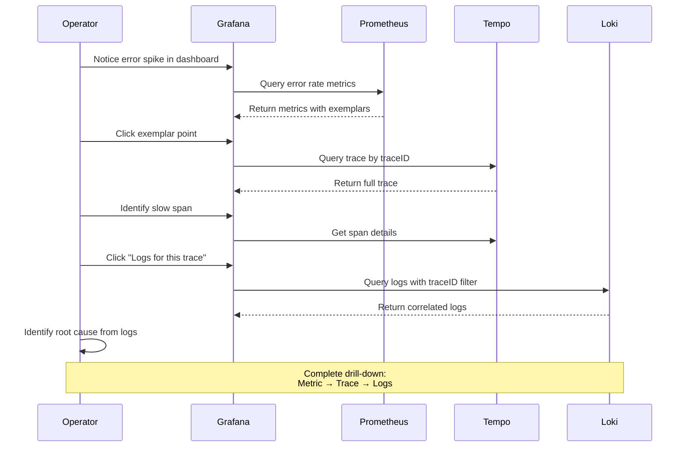
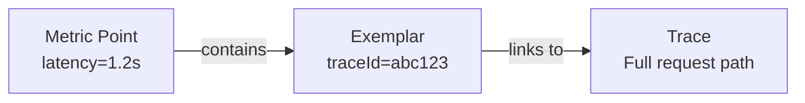

# パート 6: 分散トレーシング分析

> **難易度**: 上級
> **推定所要時間**: 45 分
> **最終更新**: February 22, 2026

## 学習目標

- Tempo と Grafana を使用してエンドツーエンドのトレース分析を実行する
- Service のボトルネックとパフォーマンス上の問題を特定する
- ログとトレースをリンクするための Loki-Tempo 相関を設定する
- メトリクスからトレースへドリルダウンするために Exemplars を使用する
- 包括的なオブザーバビリティダッシュボードを構築する

## 前提条件

- [ ] [パート 5: アラートと AIOps](./05-alerting-aiops-lab.md) を完了している
- [ ] OTel instrumentation を使用した MSA Service が稼働している
- [ ] Tempo がトレースを受信している
- [ ] Loki が traceId を含むログを受信している

---

## ドリルダウン分析ワークフロー



---

## 演習 1: TraceQL トレース検索

### 手順

**ステップ 1.1: Tempo を使用して Grafana Explore にアクセスする**

```bash
GRAFANA_URL=$(kubectl -n monitoring get svc grafana \
  -o jsonpath='{.status.loadBalancer.ingress[0].hostname}')

echo "Open: http://$GRAFANA_URL/explore"
echo "Select data source: Tempo"
```

**ステップ 1.2: サーバーエラー（5xx）を検索する**

```traceql
{ status = error } | select(span.http.status_code, resource.service.name, duration)
```

**ステップ 1.3: 遅いリクエスト（1 秒超）を検索する**

```traceql
{ duration > 1s && span.http.method = "POST" } | select(resource.service.name, name, duration)
```

**ステップ 1.4: データベースの遅いクエリを検索する**

```traceql
{ span.db.system = "postgresql" && duration > 100ms }
```

**ステップ 1.5: SQS 発行の遅延を検索する**

```traceql
{ span.messaging.system = "sqs" && span.messaging.operation = "publish" && duration > 500ms }
```

**ステップ 1.6: 複雑なクエリ - 特定の Service を含むエラートレース**

```traceql
{ resource.service.name = "order-service" && status = error }
| select(span.http.status_code, span.http.route, duration, span.error.message)
| order by duration desc
| limit 20
```

### TraceQL クエリリファレンス

| ユースケース | TraceQL クエリ |
|----------|---------------|
| すべてのエラー | `{ status = error }` |
| 遅いトレース | `{ duration > 1s }` |
| 特定の Service | `{ resource.service.name = "order-service" }` |
| HTTP 500 | `{ span.http.status_code >= 500 }` |
| データベースクエリ | `{ span.db.statement =~ "SELECT.*" }` |
| クロス Service | `{ resource.service.name = "api-gateway" } >> { resource.service.name = "order-service" }` |

---

## 演習 2: Service Graph の可視化

### 手順

**ステップ 2.1: Grafana で Service Graph を有効化する**

```bash
# Service Graph is auto-generated from trace data
# Access: Grafana > Explore > Tempo > Service Graph tab
```

**ステップ 2.2: Service の依存関係を分析する**

Service Graph には次の内容が表示されます:
- Service ノード（円）
- リクエストフロー（矢印）
- リクエストレート（矢印の太さ）
- エラーレート（赤色の濃さ）
- レイテンシー（ホバー時に表示）

**ステップ 2.3: ボトルネックとなる Service を特定する**

次の項目を確認します:
1. 高いレイテンシーを持つ Service（応答が遅い）
2. 高いエラーレートを持つ Service（赤いノード）
3. 多数の着信接続を持つ Service（ホットスポットの可能性）
4. ファンアウトパターンを持つ Service（複数のダウンストリーム呼び出し）

---

## 演習 3: レイテンシー特定ワークフロー

### 手順

**ステップ 3.1: レイテンシー分析ワークフロー表**

| ステップ | 操作 | ツール | 確認する項目 |
|------|--------|------|------------------|
| 1 | P99 レイテンシーの傾向を確認する | Prometheus/Grafana | 急激なスパイクまたは緩やかな増加 |
| 2 | 影響を受けた Service を特定する | Service Graph | 赤い／遅いノード |
| 3 | 遅いトレースを検索する | TraceQL | `{ duration > p99 }` |
| 4 | トレースのウォーターフォールを分析する | Tempo | 長い span、span 間のギャップ |
| 5 | span の詳細を確認する | Tempo | db.statement、http.url、エラーメッセージ |
| 6 | ログと関連付ける | Loki | 同じタイムスタンプ付近のエラー |
| 7 | リソースメトリクスを確認する | Prometheus | CPU、メモリ、接続プール |

**ステップ 3.2: 実践的なレイテンシー分析**

```bash
# Step 1: Find P99 latency
# In Grafana Explore with Prometheus:
histogram_quantile(0.99, sum(rate(http_server_request_duration_seconds_bucket{service="order-service"}[5m])) by (le))

# Step 2: Find traces above P99
# In Grafana Explore with Tempo:
{ resource.service.name = "order-service" && duration > 800ms }

# Step 3: Analyze a specific trace
# Click on a trace to see the waterfall view

# Step 4: Identify the slowest span
# Look for spans with longest duration relative to parent
```

**ステップ 3.3: 一般的なレイテンシーパターン**

| パターン | 症状 | 考えられる原因 |
|---------|---------|--------------|
| 単一の遅い span | 1 つの span がトレース時間の 90% を占める | データベースクエリ、外部 API |
| 連続する span | 複数の span が連続している | 並列化の不足 |
| span 間のギャップ | 時間が未計上になっている | GC 一時停止、スレッド競合 |
| ファンアウト遅延 | 多数の並列呼び出しのうち 1 つが遅い | 1 つのダウンストリーム Service の劣化 |
| 一貫して高いレイテンシー | すべてのリクエストが遅い | リソース枯渇 |

---

## 演習 4: Loki-Tempo 相関

### 手順

**ステップ 4.1: 双方向リンクを設定する**

パート 2 で設定した Grafana datasource には、すでに相関が設定されています。確認してください:

```bash
# Check Tempo datasource config
kubectl get configmap -n monitoring grafana -o yaml | grep -A20 "Tempo"
```

**ステップ 4.2: トレースからログへ（Tempo → Loki）**

1. Grafana Explore（Tempo）でトレースを開く
2. span をクリックする
3. 「Logs for this span」ボタンをクリックする
4. Grafana が traceId を使用して Loki をクエリする

**ステップ 4.3: ログからトレースへ（Loki → Tempo）**

1. Grafana Explore で Loki を選択する
2. ログクエリを実行する:
   ```logql
   {namespace="msa"} | json | level="ERROR"
   ```
3. traceId を含むログ行を見つける
4. traceId リンクをクリックして Tempo に移動する

**ステップ 4.4: 相関が機能することを確認する**

```bash
# Generate a test request and find it in both systems
curl -X POST "http://$API_URL:8080/api/v1/orders" \
  -H "Content-Type: application/json" \
  -d '{"customer_id":"TEST-001","product_id":"PROD-001","quantity":1}'

# Note the response and search in Tempo:
# { resource.service.name = "api-gateway" && span.http.route = "/api/v1/orders" }

# Find the traceId and search in Loki:
# {namespace="msa"} |= "traceId" | json | traceId = "<your-trace-id>"
```

---

## 演習 5: Exemplar の使用

### 手順

**ステップ 5.1: Exemplars を理解する**

Exemplars はメトリクスデータポイントを特定のトレースにリンクし、異常なメトリクスから実際のリクエストへドリルダウンできるようにします。



**ステップ 5.2: Grafana で Exemplars を表示する**

1. Grafana > Explore > Prometheus を開く
2. Exemplars を有効にしてクエリする:
   ```promql
   histogram_quantile(0.99, sum(rate(http_server_request_duration_seconds_bucket{service="order-service"}[5m])) by (le))
   ```
3. グラフでひし形のマーカー（exemplars）を探す
4. ひし形にホバーして traceId を確認する
5. クリックして Tempo に移動する

**ステップ 5.3: Exemplar の表示を設定する**

```bash
# Ensure Prometheus is recording exemplars
kubectl get configmap -n monitoring kube-prometheus-stack-prometheus -o yaml | grep exemplar
```

**ステップ 5.4: Grafana の Exemplar クエリ**

```promql
# Show request duration with exemplars
http_server_request_duration_seconds_bucket{service="order-service"}

# In Query Options, enable "Exemplars"
```

---

## 演習 6: 包括的なダッシュボードのセットアップ

### 手順

**ステップ 6.1: RED ダッシュボード（Rate、Errors、Duration）**

```bash
cat > /tmp/red-dashboard.json << 'EOF'
{
  "dashboard": {
    "title": "MSA RED Dashboard",
    "tags": ["obs-lab", "red", "sre"],
    "panels": [
      {
        "title": "Request Rate by Service",
        "type": "timeseries",
        "gridPos": {"h": 8, "w": 8, "x": 0, "y": 0},
        "targets": [{
          "expr": "sum(rate(http_server_request_count{namespace=\"msa\"}[5m])) by (service)",
          "legendFormat": "{{service}}"
        }]
      },
      {
        "title": "Error Rate by Service",
        "type": "timeseries",
        "gridPos": {"h": 8, "w": 8, "x": 8, "y": 0},
        "targets": [{
          "expr": "sum(rate(http_server_request_count{namespace=\"msa\",http_status_code=~\"5..\"}[5m])) by (service) / sum(rate(http_server_request_count{namespace=\"msa\"}[5m])) by (service)",
          "legendFormat": "{{service}}"
        }],
        "fieldConfig": {
          "defaults": {
            "unit": "percentunit",
            "thresholds": {
              "steps": [
                {"value": 0, "color": "green"},
                {"value": 0.01, "color": "yellow"},
                {"value": 0.05, "color": "red"}
              ]
            }
          }
        }
      },
      {
        "title": "P99 Latency by Service",
        "type": "timeseries",
        "gridPos": {"h": 8, "w": 8, "x": 16, "y": 0},
        "targets": [{
          "expr": "histogram_quantile(0.99, sum(rate(http_server_request_duration_seconds_bucket{namespace=\"msa\"}[5m])) by (le, service))",
          "legendFormat": "{{service}}"
        }],
        "fieldConfig": {
          "defaults": {
            "unit": "s"
          }
        }
      }
    ]
  }
}
EOF

curl -X POST -H "Content-Type: application/json" \
  -u admin:ObsLab2026! \
  -d @/tmp/red-dashboard.json \
  "http://$GRAFANA_URL/api/dashboards/db"
```

**ステップ 6.2: SLI/SLO ダッシュボード**

| SLI | 目標（SLO） | クエリ |
|-----|--------------|-------|
| 可用性 | 99.9% | `1 - (sum(rate(http_server_request_count{status_code=~"5.."}[30d])) / sum(rate(http_server_request_count[30d])))` |
| レイテンシー P99 | < 500ms | `histogram_quantile(0.99, sum(rate(http_server_request_duration_seconds_bucket[5m])) by (le)) < 0.5` |
| スループット | > 100 RPS | `sum(rate(http_server_request_count[5m])) > 100` |

**ステップ 6.3: インフラストラクチャダッシュボード**

| パネル | メトリクス | 目的 |
|-------|--------|---------|
| Node CPU | `node_cpu_seconds_total` | Node のリソース使用状況 |
| Node Memory | `node_memory_MemAvailable_bytes` | メモリプレッシャー |
| Pod CPU | `container_cpu_usage_seconds_total` | Pod のリソース使用状況 |
| Pod Memory | `container_memory_working_set_bytes` | Container メモリ |
| PVC 使用量 | `kubelet_volume_stats_used_bytes` | ストレージ消費量 |

**ステップ 6.4: トレーシングダッシュボード**

| パネル | データソース | 目的 |
|-------|-------------|---------|
| トレース数 | Tempo メトリクス | トレース量 |
| span Duration ヒートマップ | Tempo | Duration 分布 |
| Service Graph | Tempo | 依存関係の可視化 |
| エラートレーステーブル | Tempo | 直近のエラー |

---

## クリーンアップ

> **重要**: 継続的な AWS コストを回避するため、このクリーンアップセクションを完了してください。

### クリーンアップ手順表

| リソース | コマンド | 注記 |
|----------|---------|-------|
| MSA Applications | `kubectl delete namespace msa` | すべての MSA Pod/Service を削除します |
| Observability Stack | `helm uninstall kube-prometheus-stack -n monitoring` | Prometheus、Alertmanager |
| Loki | `helm uninstall loki -n logging` | ログストレージ |
| Tempo | `helm uninstall tempo -n tracing` | トレースストレージ |
| Grafana | `helm uninstall grafana -n monitoring` | ダッシュボード |
| OTel Collector | `kubectl delete namespace opentelemetry` | テレメトリパイプライン |
| ArgoCD | `helm uninstall argocd -n argocd` | GitOps |
| KEDA | `helm uninstall keda -n keda` | Autoscaler |
| Locust | `kubectl delete deployment locust-master locust-worker -n msa` | 負荷テスト |

### 完全クリーンアップスクリプト

```bash
#!/bin/bash
set -e

echo "Starting cleanup..."

# 1. Delete MSA applications
echo "Deleting MSA namespace..."
kubectl delete namespace msa --ignore-not-found

# 2. Delete observability stack (Managed Cluster)
kubectl config use-context $(kubectl config get-contexts -o name | grep obs-managed)

echo "Uninstalling Helm releases..."
helm uninstall grafana -n monitoring --ignore-not-found || true
helm uninstall kube-prometheus-stack -n monitoring --ignore-not-found || true
helm uninstall victoria-metrics -n monitoring --ignore-not-found || true
helm uninstall mimir -n monitoring --ignore-not-found || true
helm uninstall loki -n logging --ignore-not-found || true
helm uninstall tempo -n tracing --ignore-not-found || true
helm uninstall fluent-bit -n logging --ignore-not-found || true
helm uninstall argocd -n argocd --ignore-not-found || true
helm uninstall grafana-oncall -n monitoring --ignore-not-found || true

# 3. Delete namespaces
echo "Deleting namespaces..."
kubectl delete namespace monitoring logging tracing opentelemetry argocd --ignore-not-found

# 4. Delete Service Cluster resources
kubectl config use-context $(kubectl config get-contexts -o name | grep obs-service)
helm uninstall keda -n keda --ignore-not-found || true
helm uninstall argo-rollouts -n argo-rollouts --ignore-not-found || true
kubectl delete namespace keda argo-rollouts msa opentelemetry --ignore-not-found

# 5. Delete EKS clusters
echo "Deleting EKS clusters (this takes 15-20 minutes)..."
eksctl delete cluster -f ~/obs-lab/managed-cluster.yaml --wait || true
eksctl delete cluster -f ~/obs-lab/service-cluster.yaml --wait || true

# 6. Delete AWS resources
echo "Deleting AWS resources..."

# Aurora
aws rds delete-db-instance --db-instance-identifier obs-lab-aurora-1 --skip-final-snapshot --region $AWS_REGION || true
sleep 60
aws rds delete-db-cluster --db-cluster-identifier obs-lab-aurora --skip-final-snapshot --region $AWS_REGION || true

# OpenSearch
aws opensearch delete-domain --domain-name obs-lab-logs --region $AWS_REGION || true

# AMP
AMP_WORKSPACE_ID=$(aws amp list-workspaces --alias obs-lab-prometheus --query "workspaces[0].workspaceId" --output text --region $AWS_REGION)
aws amp delete-workspace --workspace-id $AMP_WORKSPACE_ID --region $AWS_REGION || true

# SQS/SNS
SQS_QUEUE_URL=$(aws sqs get-queue-url --queue-name obs-lab-orders --query QueueUrl --output text --region $AWS_REGION 2>/dev/null)
aws sqs delete-queue --queue-url $SQS_QUEUE_URL --region $AWS_REGION || true

SNS_TOPIC_ARN=$(aws sns list-topics --query "Topics[?contains(TopicArn, 'obs-lab-alerts')].TopicArn" --output text --region $AWS_REGION)
aws sns delete-topic --topic-arn $SNS_TOPIC_ARN --region $AWS_REGION || true

# S3 buckets
aws s3 rb s3://obs-lab-loki-${ACCOUNT_ID} --force --region $AWS_REGION || true
aws s3 rb s3://obs-lab-tempo-${ACCOUNT_ID} --force --region $AWS_REGION || true
aws s3 rb s3://obs-lab-mimir-${ACCOUNT_ID} --force --region $AWS_REGION || true
aws s3 rb s3://obs-lab-mwaa-${ACCOUNT_ID}-${AWS_REGION} --force --region $AWS_REGION || true

# Lambda and API Gateway
aws lambda delete-function --function-name obs-lab-aiops-agent --region $AWS_REGION || true

# IAM policies
aws iam delete-policy --policy-arn arn:aws:iam::${ACCOUNT_ID}:policy/obs-lab-amp-access || true
aws iam delete-policy --policy-arn arn:aws:iam::${ACCOUNT_ID}:policy/obs-lab-logging-access || true

# CloudWatch Alarms
aws cloudwatch delete-alarms --alarm-names obs-lab-aurora-cpu-high obs-lab-sqs-message-age obs-lab-opensearch-health obs-lab-critical-composite --region $AWS_REGION || true

# 7. Cleanup local files
echo "Cleaning up local files..."
rm -rf ~/obs-lab

echo "Cleanup complete!"
echo "Note: Some resources may take additional time to fully delete."
echo "Verify in AWS Console that all resources are removed."
```

### 検証

```bash
# Verify EKS clusters deleted
eksctl get cluster --region $AWS_REGION

# Verify AWS resources deleted
aws rds describe-db-clusters --query "DBClusters[?DBClusterIdentifier=='obs-lab-aurora']" --region $AWS_REGION
aws opensearch describe-domain --domain-name obs-lab-logs --region $AWS_REGION 2>&1 | grep -q "ResourceNotFoundException" && echo "OpenSearch deleted"
aws amp list-workspaces --alias obs-lab-prometheus --region $AWS_REGION
```

---

## まとめ

このラボシリーズでは、完全なオブザーバビリティプラットフォームを構築しました:

| パート | 対象トピック | 主なスキル |
|------|---------------|------------|
| 1 | インフラストラクチャ | EKS、AWS Service、ArgoCD マルチクラスター |
| 2 | Observability Stack | OTel、Prometheus、Loki、Tempo、Grafana |
| 3 | MSA Deployment | ArgoCD、Argo Rollouts、OTel instrumentation |
| 4 | 負荷テスト | k6、KEDA、Karpenter autoscaling |
| 5 | アラートと AIOps | Alertmanager、OnCall、Bedrock Claude |
| 6 | トレーシング分析 | TraceQL、相関、exemplars |

### 主なポイント

1. **3 つの柱の統合**: メトリクス、ログ、トレースを組み合わせることで完全なオブザーバビリティを実現する
2. **OTel の標準化**: OpenTelemetry はベンダー中立の instrumentation を提供する
3. **マルチバックエンド戦略**: 冗長性と柔軟性のために複数のバックエンドへファンアウトする
4. **オブザーバビリティ駆動の Deployment**: 自動分析を伴う Canary リリース
5. **AIOps 自動化**: AI を活用したインシデント分析により MTTR を短縮する
6. **相関が鍵**: TraceID リンクによりエンドツーエンドのデバッグが可能になる

## 最終検証チェックリスト

- [ ] 完全なメトリクス→exemplar→トレース→ログのドリルダウンが機能する
- [ ] Service Graph にすべての MSA 依存関係が表示される
- [ ] Canary rollout が意思決定にオブザーバビリティメトリクスを使用する
- [ ] アラートが発火し、通知チャネルに届く
- [ ] AIOps agent が有用な分析を提供する
- [ ] コストを回避するため、すべてのリソースがクリーンアップされている

## 次のステップ

このラボシリーズの完了後:

1. **本番 Deployment**: これらのパターンを本番ワークロードに適用する
2. **カスタム instrumentation**: ビジネス固有のメトリクスとトレースを追加する
3. **SLO 実装**: エラーバジェットを使用して SLO を定義および追跡する
4. **Chaos Engineering**: オブザーバビリティをテストするために制御された障害を導入する
5. **コスト最適化**: サンプリングおよび保持ポリシーを実装する

## 参考資料

- [Tempo ドキュメント](../../observability/tracing/01-tempo.md)
- [OpenTelemetry ドキュメント](../../observability/tracing/03-opentelemetry.md)
- [Loki ドキュメント](../../observability/logging/01-loki.md)
- [Prometheus ドキュメント](../../observability/metrics/01-prometheus.md)
- [Grafana ドキュメント](../../observability/grafana/README.md)
- [TraceQL ドキュメント](https://grafana.com/docs/tempo/latest/traceql/)
