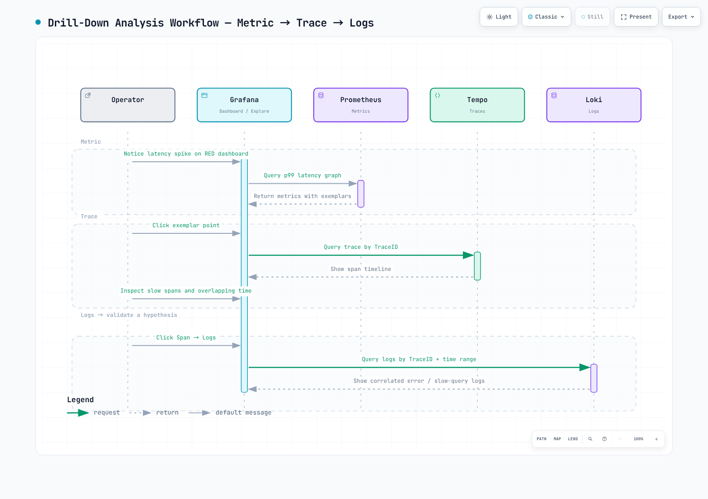
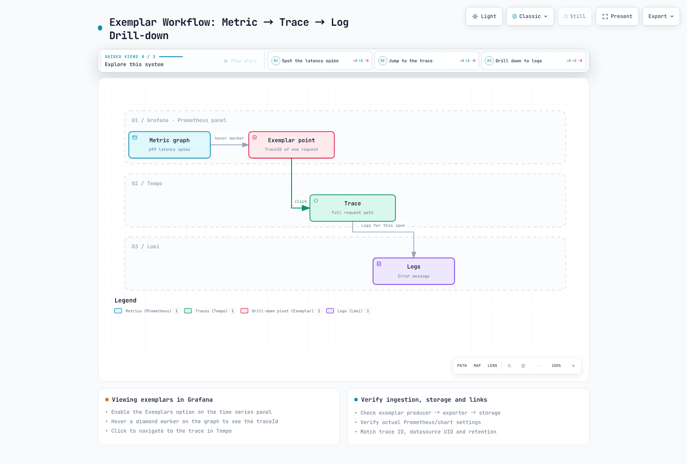

# パート 6: 分散トレーシング分析

<span id="cleanup-steps-table"></span>
<span id="drill-down-analysis-workflow"></span>
<span id="exercise-1-traceql-trace-search"></span>
<span id="exercise-2-service-graph-visualization"></span>
<span id="exercise-3-latency-identification-workflow"></span>
<span id="exercise-4-loki-tempo-correlation"></span>
<span id="exercise-5-exemplar-usage"></span>
<span id="exercise-6-comprehensive-dashboard-setup"></span>
<span id="final-verification-checklist"></span>
<span id="full-cleanup-script"></span>
<span id="key-takeaways"></span>
<span id="learning-objectives"></span>
<span id="next-steps"></span>
<span id="prerequisites"></span>
<span id="references"></span>
<span id="steps"></span>
<span id="steps-1"></span>
<span id="steps-2"></span>
<span id="steps-3"></span>
<span id="steps-4"></span>
<span id="steps-5"></span>
<span id="summary"></span>
<span id="traceql-query-reference"></span>
<span id="verification"></span>

> **難易度**: 上級 · **推定所要時間**: 45 分
> **最終更新**: September 13, 2026

1 件の実際のリクエストを、メトリクスから exemplar を経てトレースとログまで追跡し、観測結果と因果関係の仮説を切り分けます。これには [パート 2](./02-observability-stack-lab.md) の取り込み経路と [パート 3](./03-msa-deployment-lab.md) のコンテキスト伝播が必要です。以下の TraceQL は実際の Tempo **3.0.3** パーサーで検証済みで、現行の OTel 属性を使用しています。



[🔍 インタラクティブ図を表示](https://www.atomai.click/kubernetes-docs/archmaps/en-labs-observability-06-distributed-tracing-lab-0.html)

## 1. TraceQL 検索 {#traceql}

```traceql
{ resource.service.name = "order-service" && span:duration > 1s }

{ trace:duration > 2s && resource.service.name = "order-service" }

{ span:kind = server && span.http.response.status_code >= 500 }

{ span.db.system.name = "postgresql" && span:duration > 100ms }

{ span.messaging.system = "aws_sqs" && span.messaging.operation.type = "send" }

{ resource.service.name = "api-gateway" } >> { resource.service.name = "order-service" }

{ resource.service.name = "order-service" } >> { span.db.system.name = "postgresql" }

{ span:status = error } | select(resource.service.name, span.http.response.status_code, span:duration)
```

`span:duration` は個々の span を測定し、`trace:duration` はトレース全体を測定します。明示的な intrinsic には `span:` を、属性には `span.`/`resource.` を使用します。`>>` は左辺の span の子孫にあたる右辺の span を検索します。DB span の子孫を検索することは、あるサービス配下の DB 処理を見つけることとは異なります。

`sort(duration)`、SQL の `order by`、`| limit 20`、`{ duration > p99 }` はこの検索構文ではありません。結果のソート、検索件数の上限、時間範囲は Grafana で設定し、実測した p99 は `800ms` のような duration リテラルに置き換えてください。`select()` は表示する属性を要求するものであり、そもそも保存されていない span を復元することはできません。

古い SDK は `http.status_code`、`http.method`、`db.system`、`db.statement`、`messaging.operation` を出力する場合があります。現行の `http.response.status_code`、`http.request.method`、`db.system.name`、`db.query.text`、`messaging.operation.type` を使用する前に、実際の span と SDK バージョンを確認してください。クエリ属性の名称変更は、収集済みのデータを変換するものではありません。クエリ本文の取得は明示的なサニタイズポリシーの下でのみ行い、パスワード、SQL リテラル、顧客データは除外してください。

## 2. Service graph の前提条件 {#service-graph}

Tempo でトレースを受信するだけでは Grafana の service graph は完成しません。metrics-generator の service-graphs プロセッサを有効化し、そのメトリクスを実際のメトリクスバックエンドに送信し、Grafana の Tempo データソースの serviceMap UID をそのバックエンドに紐付けてください。client/server もしくは producer/consumer の span はコンテキストを共有していなければなりません。サンプリング、span の欠落、span kind の誤りは、生成されるエッジに影響します。

```promql
sum by (client, server) (rate(traces_service_graph_request_total[5m]))

(
  sum by (client, server) (rate(traces_service_graph_request_failed_total[5m]))
  or on (client, server)
  (0 * sum by (client, server) (rate(traces_service_graph_request_total[5m])))
)
/ on (client, server)
(sum by (client, server) (rate(traces_service_graph_request_total[5m])) > 0)

sum by (client, server) (rate(traces_service_graph_request_server_seconds_sum[5m]))
/
sum by (client, server) (rate(traces_service_graph_request_server_seconds_count[5m]))
```

失敗カウンターは最初の失敗が発生するまで系列が存在しない場合があります。欠落している分子を、対応する request-total 系列から得たゼロで埋め、さらに分母が正であることを要求することで、健全な 0% と、トラフィックがない状態や取り込みが欠落している状態を区別します。

最後のクエリはサーバー側の平均所要時間を測定します。クライアント側の所要時間には `traces_service_graph_request_client_seconds_*` を使用し、存在しない `traces_service_graph_request_duration_seconds_*` ファミリーをクエリしないでください。トラフィックがない区間は証拠が欠落しているものとして扱ってください。色やエッジの太さは Grafana/ダッシュボードの設定に依存します。1%/5% といった固定の色分けルールを前提とせず、request/error/duration の値を確認してください。

## 3. Waterfall からボトルネックの仮説を立てる {#waterfall}

| 観測結果 | 追加確認 |
|---|---|
| 遅い DB span | クエリプラン、ロック、コネクションプール、DB メトリクスを確認する |
| 長い client span | DNS/TLS/ネットワーク/サーバー待機/リトライの各区間を比較する |
| 親と子の間のギャップ | 未計装の処理、キュー、GC、スケジューリングを確認する |
| 並列な子 span | 所要時間を合算せず、重なりとクリティカルパスを分析する |
| メッセージングの遅延 | send/receive/process の所要時間を、キュー待ち時間や再配信と切り分ける |

親の所要時間には子の所要時間が含まれるため、すべての span を合算すると時間を二重計上します。1.8 秒の DB span だけではインデックスの欠落は証明できません。仮説を採用する前に、同一のリリース、トラフィック、時間範囲でログとメトリクスを比較してください。

## 4. ログとトレースを紐付ける {#correlation}

```logql
{service_name="order-service"} | json | level="ERROR"

{service_name="order-service"} | json | trace_id="0123456789abcdef0123456789abcdef"
```

これらのクエリは、実際に `service_name` ストリームラベルと JSON の `trace_id` フィールドが存在することを前提としています。32 文字のサンプルトレース ID は実際のリクエスト ID に置き換えてください。`traceID`、`traceId`、`trace_id` は別々のフィールドです。トレース ID は一意なストリームラベルではなく、ログのフィールドや structured metadata に保持してください。時間範囲は Grafana/HTTP パラメータで指定し、LogQL に `timestamp >= 2025-...` を付け足さないでください。

Loki の derived field はトレース ID を抽出し、Tempo データソースの UID へリンクします。Grafana のプロビジョニング YAML では、内部リンクの式を `$${__value.raw}` としてエスケープしてください。ダブルクォートで囲んだ正規表現や広範囲に及ぶシェルの envsubst は、バックスラッシュや Grafana の変数を変えてしまう可能性があります。適切なシングルクォートと、範囲を絞った置換を使用してください。

Tempo の `tracesToLogsV2` には、Loki の UID、実際のリソースからログラベルへのマッピング、時間のパディング、トレース ID によるフィルタリングを設定します。「Logs for this span」をクリックした後に生成された LogQL を確認してください。リンクが存在することと、同一リクエストを実際に取得できることは別個の確認項目です。

## 5. Exemplar の意味と検証 {#exemplars}



[🔍 インタラクティブ図を表示](https://www.atomai.click/kubernetes-docs/archmaps/en-labs-observability-06-distributed-tracing-lab-1.html)

exemplar は集計値に付随する **代表的な観測値** です。p99 のグラフ上の点をクリックしても、そのリクエストが厳密なパーセンタイル境界を決定したことの証明にはなりません。exemplar の生成、exporter/remote-write での保持、Prometheus での保存、Grafana データソースの紐付けがすべて機能している必要があります。サンプリングや保持期間によって、トレースが参照できない exemplar ID が残ることもあります。

実際の Prometheus exemplar API の結果を確認し、返された `trace_id` で Tempo をクエリしてください。Grafana の表示オプションを有効にすることや、存在しない Prometheus ConfigMap を検索することは、取り込みの検証にはなりません。exemplar 保存の設定は、インストール済みの Prometheus/チャートのバージョンと、レンダリングされた Prometheus リソース/ランタイム引数に照らして確認してください。

## 6. RED および SLI/SLO ダッシュボード {#slo}

RED パネルは、実際のメトリクス名、ラベル、ヒストグラムの単位に基づいて構築します。リクエストレート、失敗率、所要時間の分布は、同一のサービス/ルートの範囲で比較してください。可用性を算出する前に、対象となるリクエストと成功の定義を定め、4xx レスポンス、ヘルスチェック、リトライの扱いを明示してください。

30 日の SLO には、その期間にわたる実際の保持期間と観測データが必要です。作りたてのラボ環境における `[30d]` のクエリは、30 日分の証拠を生み出しません。トラフィックがない状態、系列の欠落、カウンターのリセットに対処し、低ボリュームにおけるパーセンタイルの限界を明示してください。エラーバジェットは、同一のウィンドウにおける許容失敗数と観測された失敗数から算出します。「99.9% 達成」といった固定の主張ではなく、期間、分母、値を記録してください。

## 7. フローを検証してからクリーンアップする {#cleanup}

クリーンアップの前に、exemplar ID、Tempo のトレース ID、ログのトレース ID が一致する 1 件のリクエストを記録し、実際の service graph の依存関係とアラート配信を検証してください。結果を見積もりで埋めるのではなく、実測値、タイムスタンプ、設定のバージョンを残してください。

| 順序 | 作業と完了条件 |
|---|---|
| 1 | k6/Locust、障害注入、AI 分析トリガーを停止し、結果を保存する |
| 2 | GitOps の ApplicationSet/親による再作成を停止し、実際のアプリケーションをカスケード削除する |
| 3 | サービスクラスターの LoadBalancer/Ingress、ワークロード、PVC を削除し、外部 LB/ボリュームのクリーンアップを検証する |
| 4 | オペレーターをアンインストールする前に、実際のリリース名/Namespace 名を使ってテレメトリのカスタムリソースを削除する |
| 5 | コントローラーを削除する前に Karpenter の NodeClaim をドレイン/削除する。依存関係が存在する間は API/LB/ストレージのコントローラーを残す |
| 6 | 同一の IaC ステートを使って destroy プランをレビューする。手動作成した AWS リソースには記録済みの正確な ID/ARN を使用する |
| 7 | 依存関係のクリーンアップ後に EKS/VPC を削除し、その後マネージドサービスの削除と残存リソースを検証する |

共有 Namespace やクラスター全体の CRD は削除しないでください。`latest` のインストーラー URL ではなく、記録済みのインストール時のリリース/Namespace/バージョンを使用してください。バージョニングが有効な S3 では、現行オブジェクトに加えて過去のバージョンと削除マーカーも確認する必要があります。Aurora のスナップショットポリシー、MWAA/DAG バケット、AMG、AMP、OpenSearch、SNS/SQS/DLQ、Lambda/API Gateway、IAM のアタッチメント、EBS/LB、ロググループ、アラームを、自身のインベントリと突き合わせて整合させてください。削除リクエストが受理されたことは、削除の完了ではありません。

未確認のまま自動承認で destroy を実行したり、すべてのエラーを抑制したり、作業ディレクトリ全体を削除するのではなく、リソースの所有権をレビューし、証拠とステートを保全してください。

## 検証の範囲と参考資料

現行の Tempo パーサーは、受理された 12 個のクエリを検証し、以前の誤ったクエリ 3 個を拒否しました。一時的なローカルの Loki 3.7.7 が合成ログ行 2 行を受信し、2 つの LogQL クエリはいずれも期待どおりのトレース ID を正確に取得しました。実サービスでの Tempo 検索、Loki の収集、Grafana でのデータ連携、クラウドリソースの削除は実行していません。

- [TraceQL](https://grafana.com/docs/tempo/latest/traceql/)
- [Service graph メトリクス](https://grafana.com/docs/tempo/latest/metrics-from-traces/service_graphs/)
- [OTel HTTP span](https://opentelemetry.io/docs/specs/semconv/http/http-spans/)
- [OTel データベース span](https://opentelemetry.io/docs/specs/semconv/database/database-spans/)
- [Loki derived fields](https://grafana.com/docs/grafana/latest/datasources/loki/configure-loki-data-source/)
- [Tempo ガイド](../../observability/tracing/01-tempo.md)
- [Loki ガイド](../../observability/logging/01-loki.md)
- [シリーズ一覧](./README.md)
