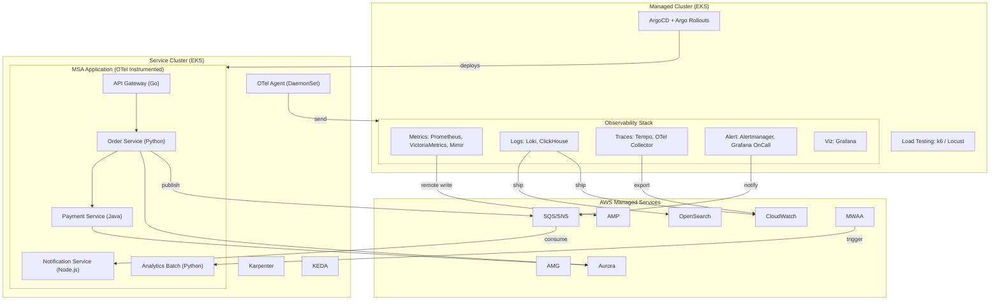
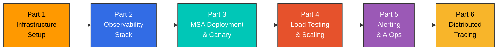
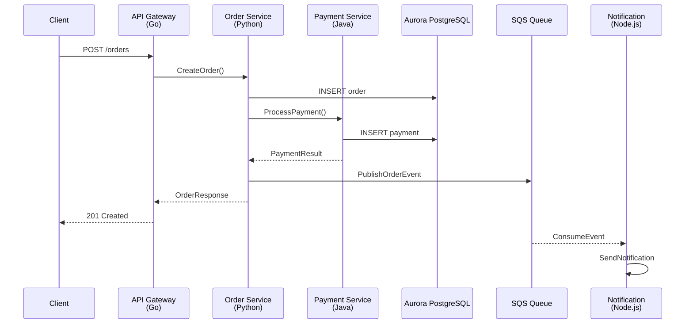

# ラボシリーズの概要

> **難易度**: 上級 **最終更新**: February 23, 2026

## 概要

このラボシリーズでは、Kubernetes ベースのマイクロサービス向けフルスタック可観測性プラットフォームを構築するための、包括的で実践的な学習を提供します。2 つの EKS クラスターに複数の可観測性ツールをデプロイして統合し、実際のパターンで可観測性の 3 本柱（Metrics、Logs、Traces）を実装します。

このアーキテクチャは、可観測性スタックをホストする **Managed Cluster** と、OTel インストルメンテーションを備えた MSA アプリケーションを実行する **Service Cluster** からなる、本番環境グレードの環境をシミュレートします。

## アーキテクチャ図

## 前提条件

このラボシリーズを開始する前に、以下を用意してください。

| 要件 | バージョン  | 確認コマンド          |
| ----------- | -------- | ----------------------------- |
| AWS アカウント | -        | `aws sts get-caller-identity` |
| AWS CLI     | >= 2.15  | `aws --version`               |
| eksctl      | >= 0.175 | `eksctl version`              |
| kubectl     | >= 1.29  | `kubectl version --client`    |
| Helm        | >= 3.14  | `helm version`                |
| Terraform   | >= 1.7   | `terraform version`           |
| k6          | >= 0.49  | `k6 version`                  |
| Docker      | >= 24.0  | `docker --version`            |

### 必要な IAM 権限

AWS ユーザー/ロールには以下の権限が必要です。

* EKS のフルアクセス
* EC2 のフルアクセス（ノードグループ用）
* VPC のフルアクセス
* IAM の限定アクセス（IRSA 用）
* CloudFormation のフルアクセス
* SQS/SNS のフルアクセス
* RDS のフルアクセス（Aurora 用）
* OpenSearch のフルアクセス
* Managed Prometheus/Grafana のフルアクセス
* MWAA のフルアクセス

## コスト見積もり

> **警告**: このラボシリーズでは多くの AWS リソースが作成されます。以下に推定コストを示します。

| サービス                   | 構成                     | 時間あたりのコスト（USD） |
| ------------------------- | --------------------------------- | ----------------- |
| EKS Control Plane         | 2 クラスター                        | $0.20             |
| EC2（Managed Cluster）     | 3x m5.xlarge                      | $0.58             |
| EC2（Service Cluster）     | 3x m5.large（+ Karpenter スケーリング） | $0.29+            |
| Aurora PostgreSQL         | db.r6g.large（マルチ AZ）           | $0.52             |
| OpenSearch                | m6g.large.search（2 ノード）        | $0.25             |
| Amazon Managed Prometheus | 取り込み量に応じる                | \~$0.10           |
| Amazon Managed Grafana    | 1 ワークスペース                       | $0.15             |
| MWAA                      | mw1.small                         | $0.31             |
| SQS/SNS                   | 使用量に応じる                    | \~$0.01           |
| **合計見積もり**        |                                   | **\~$2.50/時間**  |

**ヒント**: コストを最小限に抑えるため、ラボは 1 回のセッションで完了し、すぐにクリーンアップを実行してください。

## ラボの順序

| パート | タイトル                                                    | 所要時間 | 主なトピック                                      |
| ---- | -------------------------------------------------------- | -------- | ----------------------------------------------- |
| 1    | [Infrastructure Setup](01-infrastructure-setup-lab.md)   | 60 分   | EKS クラスター、AWS サービス、ArgoCD              |
| 2    | [Observability Stack](02-observability-stack-lab.md)     | 90 分   | OTel、Prometheus、Loki、Tempo、Grafana          |
| 3    | [MSA Deployment & Canary](03-msa-deployment-lab.md)      | 60 分   | ArgoCD、Argo Rollouts、OTel インストルメンテーション     |
| 4    | [Load Testing & Scaling](04-load-testing-scaling-lab.md) | 45 分   | k6、KEDA、Karpenter                             |
| 5    | [Alerting & AIOps](05-alerting-aiops-lab.md)             | 60 分   | Alertmanager、OnCall、CloudWatch Investigations |
| 6    | [Distributed Tracing](06-distributed-tracing-lab.md)     | 45 分   | Tempo、TraceQL、Log-Trace 相関           |

## MSA アプリケーションの概要

このラボでは、5 つのサービスからなるサンプルの e コマース MSA アプリケーションを使用します。

| サービス              | 言語           | 役割                            | 依存関係              |
| -------------------- | ------------------ | ------------------------------- | ------------------------- |
| API Gateway          | Go                 | リクエストルーティング、認証 | Order、Payment            |
| Order Service        | Python（FastAPI）   | 注文管理、在庫管理     | Aurora、SQS               |
| Payment Service      | Java（Spring Boot） | 決済処理              | Aurora                    |
| Notification Service | Node.js（Express）  | メール/SMS 通知         | SQS コンシューマー              |
| Analytics Batch      | Python             | 日次分析集計     | Aurora、MWAA によりトリガー |

### サービス呼び出しフロー

## 可観測性ツールの対象範囲

このラボでは、以下の可観測性ツールを扱います。

| カテゴリー          | 対象ツール                      | AWS 統合             |
| ----------------- | ---------------------------------- | --------------------------- |
| **Metrics**       | Prometheus、VictoriaMetrics、Mimir | AMP（remote write）          |
| **Logging**       | Loki、ClickHouse、Fluent Bit       | CloudWatch Logs、OpenSearch |
| **Tracing**       | Tempo、OTel Collector              | X-Ray（OTel 経由）            |
| **Visualization** | Grafana                            | AMG                         |
| **Alerting**      | Alertmanager、Grafana OnCall       | CloudWatch Alarms、SNS      |
| **AIOps**         | CloudWatch Investigations          | Bedrock Claude 統合  |

> **注記**: このラボでは、オープンソースおよび AWS ネイティブのツールに焦点を当てます。Datadog や Dynatrace などの商用ソリューションは別ドキュメントで扱いますが、このラボではデプロイしません。

## 学習成果

このラボシリーズを完了すると、次のことができるようになります。

1. Kubernetes 向けの本番環境グレードの可観測性アーキテクチャを**設計**する
2. OTel を使用して完全な LGTM スタック（Loki、Grafana、Tempo、Mimir）を**デプロイ**する
3. OTel Collector を使用してマルチバックエンドのテレメトリパイプラインを**構成**する
4. 可観測性に基づく分析を使用して Canary デプロイメントを**実装**する
5. CloudWatch Investigations と Bedrock を使用して AIOps ワークフローを**構築**する
6. 分散トレースを**分析**してパフォーマンスのボトルネックを特定する
7. 根本原因分析のために Metrics、Logs、Traces を**相関付ける**

## 参考資料

* [可観測性の概要](../../observability/README.md)
* [Prometheus ドキュメント](../../observability/metrics/01-prometheus.md)
* [Grafana ダッシュボード](../../observability/grafana/README.md)
* [Loki ドキュメント](../../observability/logging/01-loki.md)
* [Tempo ドキュメント](../../observability/tracing/01-tempo.md)
* [OpenTelemetry ドキュメント](../../observability/tracing/03-opentelemetry.md)
* [ArgoCD ドキュメント](../../gitops/argocd/README.md)
* [KEDA ドキュメント](../../autoscaling/01-keda.md)
* [Karpenter ドキュメント](../../autoscaling/02-karpenter.md)

***

**開始する準備はできましたか？** [パート 1: Infrastructure Setup](01-infrastructure-setup-lab.md) から始めましょう
