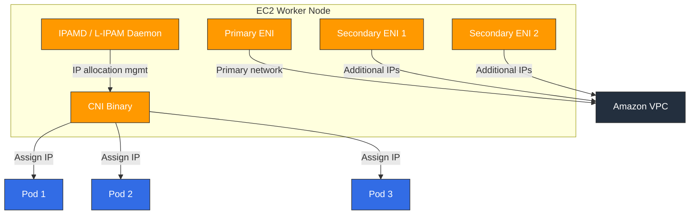

# Amazon VPC CNI

> **対応バージョン**: VPC CNI v1.19+, EKS 1.25+
> **最終更新**: February 22, 2026

## 目次
- [VPC CNI の概要](#vpc-cni-の概要)
- [ネットワーキングモデル](#ネットワーキングモデル)
- [インストールと設定](#インストールと設定)
- [IP アドレス管理](#ip-アドレス管理)
- [Network Policy のサポート](#network-policy-のサポート)
- [高度な機能](#高度な機能)
- [トラブルシューティング](#トラブルシューティング)
- [ベストプラクティス](#ベストプラクティス)

## VPC CNI の概要

Amazon VPC CNI（Container Network Interface）は、Amazon EKS のデフォルトネットワーキングプラグインです。VPC サブネットから各 Pod に実際の IP アドレスを割り当て、Pod が VPC ネットワーク内でネイティブに通信できるようにします。

### 主な機能

1. **ネイティブ VPC ネットワーキング**: Pod は実際の VPC IP を使用し、オーバーレイネットワークなしで通信します
2. **AWS Service 統合**: Security Groups、VPC Flow Logs、ルーティングテーブルなどの AWS ネットワーキング機能と直接統合します
3. **高パフォーマンス**: オーバーレイのオーバーヘッドなしでネイティブなネットワークパフォーマンスを実現します
4. **IPv4/IPv6 デュアルスタック**: IPv4 と IPv6 の両方のネットワーキングをサポートします

### アーキテクチャ

VPC CNI は、2 つの主要コンポーネントで構成されます。



1. **IPAMD（L-IPAM Daemon）**: 各ノードで実行され、ENI と IP アドレスを事前割り当ておよび管理するデーモン
2. **CNI Binary**: kubelet から呼び出され、IPAMD から IP を受け取って Pod ネットワーク名前空間を設定する CNI プラグイン

### IP 割り当てモード

VPC CNI は、2 つの IP 割り当てモードをサポートします。

| 機能 | Secondary IP モード | Prefix Delegation モード |
|---------|-------------------|----------------------|
| 割り当て単位 | 個別の IP アドレス | /28 IPv4 プレフィックス（16 IP） |
| IP 効率 | 中 | 高 |
| Pod 密度 | ENI あたりの IP 数により制限 | より高い Pod 密度 |
| 利用可能なバージョン | 初期バージョン | v1.9+ |
| 推奨用途 | 小規模クラスター | 大規模クラスター |

## ネットワーキングモデル

### ENI アーキテクチャ

各 EC2 インスタンスには 1 つ以上の ENI（Elastic Network Interface）を設定でき、各 ENI には複数のプライベート IP アドレスを割り当てられます。

```
┌─────────────────────────────────────────────────┐
│                 EC2 Instance                      │
│                                                   │
│  ┌─────────────┐  ┌─────────────┐  ┌──────────┐ │
│  │ Primary ENI  │  │Secondary ENI│  │Secondary │ │
│  │ (eth0)       │  │ (eth1)      │  │ENI (eth2)│ │
│  │              │  │             │  │          │ │
│  │ Primary IP   │  │ IP 1→Pod A  │  │IP 1→PodD│ │
│  │ IP 1 → Pod X │  │ IP 2→Pod B  │  │IP 2→PodE│ │
│  │ IP 2 → Pod Y │  │ IP 3→Pod C  │  │IP 3→PodF│ │
│  └─────────────┘  └─────────────┘  └──────────┘ │
└─────────────────────────────────────────────────┘
```

### インスタンスタイプの ENI/IP 上限

| インスタンスタイプ | 最大 ENI 数 | ENI あたりの IPv4 数 | 最大 Pod 数 |
|--------------|----------|-------------|----------|
| t3.medium | 3 | 6 | 17 |
| t3.large | 3 | 12 | 35 |
| m5.large | 3 | 10 | 29 |
| m5.xlarge | 4 | 15 | 58 |
| m5.2xlarge | 4 | 15 | 58 |
| c5.4xlarge | 8 | 30 | 234 |
| m5.8xlarge | 8 | 30 | 234 |

> **注**: 最大 Pod 数 = （ENI 数 × ENI あたりの IP 数）- ENI 数。Primary IP はノードで使用されます。

### Prefix Delegation（IPv4/IPv6）

Prefix Delegation モードでは、個別の IP ではなく /28 IPv4 プレフィックス（16 IP）が ENI に割り当てられます。

```bash
# Enable Prefix Delegation
kubectl set env daemonset aws-node -n kube-system ENABLE_PREFIX_DELEGATION=true

# Or via EKS add-on configuration
aws eks create-addon \
  --cluster-name my-cluster \
  --addon-name vpc-cni \
  --configuration-values '{"env":{"ENABLE_PREFIX_DELEGATION":"true"}}'
```

Prefix Delegation の利点:
- **高い Pod 密度**: /28 プレフィックスあたり 16 IP により、ノードあたりの Pod 数が大幅に増加します
- **高速な IP 割り当て**: 1 回の API 呼び出しで 16 IP を取得します
- **Nitro インスタンスの最適化**: Nitro ベースのインスタンスで最適なパフォーマンスを実現します

## インストールと設定

### EKS アドオンとしてのインストール

```bash
# Install VPC CNI add-on (latest version)
aws eks create-addon \
  --cluster-name my-cluster \
  --addon-name vpc-cni \
  --resolve-conflicts OVERWRITE

# Check add-on status
aws eks describe-addon \
  --cluster-name my-cluster \
  --addon-name vpc-cni

# Update add-on version
aws eks update-addon \
  --cluster-name my-cluster \
  --addon-name vpc-cni \
  --addon-version v1.19.0-eksbuild.1
```

### Helm Chart のインストール

```bash
# Add Helm repository
helm repo add eks https://aws.github.io/eks-charts

# Install
helm install aws-vpc-cni eks/aws-vpc-cni \
  --namespace kube-system \
  --set init.image.tag=v1.19.0 \
  --set image.tag=v1.19.0
```

### 主な環境変数

| 変数 | 説明 | デフォルト |
|----------|------------|---------|
| `WARM_IP_TARGET` | 事前割り当てする予備 IP 数 | 未設定 |
| `MINIMUM_IP_TARGET` | ノード上で維持する最小 IP 数 | 未設定 |
| `WARM_ENI_TARGET` | 事前割り当てする予備 ENI 数 | 1 |
| `WARM_PREFIX_TARGET` | 事前割り当てする予備プレフィックス数 | 未設定 |
| `ENABLE_PREFIX_DELEGATION` | Prefix Delegation を有効化 | false |
| `AWS_VPC_K8S_CNI_CUSTOM_NETWORK_CFG` | Custom Networking を有効化 | false |
| `ENI_CONFIG_LABEL_DEF` | ENIConfig 選択用のラベル | 未設定 |
| `ENABLE_POD_ENI` | Pod ごとの Security Groups を有効化 | false |
| `POD_SECURITY_GROUP_ENFORCING_MODE` | Security Group 適用モード | strict |

### Custom Networking（ENIConfig）

Custom Networking では、ノードとは異なるサブネットから IP を割り当てられます。

```yaml
apiVersion: crd.k8s.amazonaws.com/v1alpha1
kind: ENIConfig
metadata:
  name: us-east-1a
spec:
  subnet: subnet-0123456789abcdef0
  securityGroups:
    - sg-0123456789abcdef0
---
apiVersion: crd.k8s.amazonaws.com/v1alpha1
kind: ENIConfig
metadata:
  name: us-east-1b
spec:
  subnet: subnet-0abcdef0123456789
  securityGroups:
    - sg-0123456789abcdef0
```

```bash
# Enable Custom Networking
kubectl set env daemonset aws-node -n kube-system AWS_VPC_K8S_CNI_CUSTOM_NETWORK_CFG=true
kubectl set env daemonset aws-node -n kube-system ENI_CONFIG_LABEL_DEF=topology.kubernetes.io/zone
```

## IP アドレス管理

### WARM_IP_TARGET のチューニング

`WARM_IP_TARGET` は、各ノードで事前割り当てする予備 IP 数を制御します。

```bash
# Small clusters: fewer spare IPs
kubectl set env daemonset aws-node -n kube-system WARM_IP_TARGET=2 MINIMUM_IP_TARGET=4

# Large clusters: more spare IPs for faster Pod startup
kubectl set env daemonset aws-node -n kube-system WARM_IP_TARGET=5 MINIMUM_IP_TARGET=10
```

### Secondary CIDR の追加

Primary VPC CIDR が不足している場合は、Secondary CIDR を追加します。

```bash
# Add Secondary CIDR to VPC
aws ec2 associate-vpc-cidr-block \
  --vpc-id vpc-0123456789abcdef0 \
  --cidr-block 100.64.0.0/16

# Create subnets for Secondary CIDR
aws ec2 create-subnet \
  --vpc-id vpc-0123456789abcdef0 \
  --cidr-block 100.64.0.0/19 \
  --availability-zone us-east-1a
```

### IPv6 クラスターの設定

```bash
# Create IPv6 EKS cluster
eksctl create cluster \
  --name ipv6-cluster \
  --version 1.28 \
  --ip-family ipv6
```

## Network Policy のサポート

### VPC CNI ネイティブ Network Policy（v1.14+）

VPC CNI v1.14 以降、eBPF ベースのネイティブ Network Policy がサポートされています。

```bash
# Enable Network Policy
aws eks create-addon \
  --cluster-name my-cluster \
  --addon-name vpc-cni \
  --configuration-values '{"enableNetworkPolicy":"true"}'
```

### Network Policy の例

```yaml
apiVersion: networking.k8s.io/v1
kind: NetworkPolicy
metadata:
  name: allow-frontend-to-backend
  namespace: app
spec:
  podSelector:
    matchLabels:
      app: backend
  policyTypes:
    - Ingress
  ingress:
    - from:
        - podSelector:
            matchLabels:
              app: frontend
      ports:
        - protocol: TCP
          port: 8080
```

### Network Policy の検証

```bash
# Check Network Policy controller logs
kubectl logs -n kube-system -l k8s-app=aws-node -c aws-network-policy-agent

# List Network Policies
kubectl get networkpolicy -A

# Check eBPF policy maps
kubectl exec -n kube-system ds/aws-node -c aws-node -- ebpf-sdk list-maps
```

## 高度な機能

### Pod ごとの Security Groups

個々の Pod に AWS Security Groups を直接割り当てます。

```yaml
apiVersion: vpcresources.k8s.aws/v1beta1
kind: SecurityGroupPolicy
metadata:
  name: my-security-group-policy
  namespace: app
spec:
  podSelector:
    matchLabels:
      app: database
  securityGroups:
    groupIds:
      - sg-0123456789abcdef0
      - sg-0abcdef0123456789
```

```bash
# Enable Pod Security Groups
kubectl set env daemonset aws-node -n kube-system ENABLE_POD_ENI=true
```

### Trunk ENI / Branch ENI

Pod ごとの Security Groups は、Trunk ENI と Branch ENI のアーキテクチャを使用します。

- **Trunk ENI**: Branch ENI をホストするノードのメイン ENI
- **Branch ENI**: 独立した Security Group 適用を持つ、各 Pod に割り当てられた仮想 ENI

### Multus CNI 統合

VPC CNI をデフォルト CNI として使用しながら、Multus を介して追加のネットワークインターフェイスを設定します。

```yaml
apiVersion: k8s.cni.cncf.io/v1
kind: NetworkAttachmentDefinition
metadata:
  name: ipvlan-conf
spec:
  config: |
    {
      "cniVersion": "0.3.1",
      "type": "ipvlan",
      "master": "eth1",
      "mode": "l2",
      "ipam": {
        "type": "host-local",
        "subnet": "192.168.1.0/24"
      }
    }
```

### Windows ノードのサポート

VPC CNI は Windows ノードでも利用できます。

```bash
# Create Windows node group
eksctl create nodegroup \
  --cluster my-cluster \
  --name windows-ng \
  --node-type m5.large \
  --nodes 2 \
  --node-ami-family WindowsServer2022FullContainer
```

## トラブルシューティング

### IP 枯渇

**症状**: IP 割り当ての失敗により Pod が `Pending` 状態のままになる

```bash
# Check IPAMD logs
kubectl logs -n kube-system -l k8s-app=aws-node -c aws-node | grep -i "insufficient"

# Check per-node IP usage
kubectl get nodes -o json | jq '.items[] | {name: .metadata.name, allocatable_pods: .status.allocatable.pods}'

# Check available IPs in subnet
aws ec2 describe-subnets --subnet-ids subnet-xxx --query 'Subnets[].AvailableIpAddressCount'
```

**解決策**:
1. Prefix Delegation を有効にして Pod 密度を高める
2. Secondary CIDR を追加して IP プールを拡張する
3. 専用 Pod サブネットで Custom Networking を使用する
4. `WARM_IP_TARGET` をチューニングして IP の事前割り当てを最適化する

### ENI 上限超過

**症状**: `ENI limit reached` エラー

```bash
# Check node's ENI count
aws ec2 describe-instances --instance-ids i-xxx \
  --query 'Reservations[].Instances[].NetworkInterfaces | length(@)'

# Check ENI limits for instance type
aws ec2 describe-instance-types --instance-types m5.large \
  --query 'InstanceTypes[].NetworkInfo.{MaxENI: MaximumNetworkInterfaces, IPv4PerENI: Ipv4AddressesPerInterface}'
```

### IPAMD ログの分析

```bash
# Watch IPAMD logs in real-time
kubectl logs -n kube-system -l k8s-app=aws-node -c aws-node -f

# Filter IP allocation events
kubectl logs -n kube-system -l k8s-app=aws-node -c aws-node | grep -E "(allocated|freed|assigned)"

# Check IPAMD metrics
kubectl exec -n kube-system ds/aws-node -c aws-node -- curl http://localhost:61678/v1/enis
```

### 一般的なエラーと解決策

| エラー | 原因 | 解決策 |
|-------|-------|----------|
| `InsufficientFreeAddressesInSubnet` | サブネットの IP 枯渇 | Secondary CIDR を追加するか、Prefix Delegation を有効化 |
| `SecurityGroupLimitExceeded` | Security Groups が多すぎる | 未使用の SG を削除するか統合 |
| `ENI limit reached` | ENI 数の上限超過 | より大きなインスタンスタイプを使用 |
| `Failed to create ENI` | IAM 権限が不足 | ノードロールに ENI 作成権限を追加 |
| `Timeout waiting for pod IP` | IPAMD の遅延 | IPAMD を再起動してログを確認 |

## ベストプラクティス

### サブネット CIDR の計画

1. **十分なサブネットサイズを確保**: /19 以上のサブネットを使用します
2. **AZ ごとにサブネットを分離**: 各アベイラビリティーゾーンに専用 Pod サブネットを割り当てます
3. **100.64.0.0/10 範囲を活用**: Pod には RFC 6598 のアドレス空間を使用します

```
VPC CIDR: 10.0.0.0/16
├── 10.0.0.0/19   - Node subnet (AZ-a)
├── 10.0.32.0/19  - Node subnet (AZ-b)
├── 10.0.64.0/19  - Node subnet (AZ-c)
└── Secondary CIDR: 100.64.0.0/16
    ├── 100.64.0.0/19  - Pod subnet (AZ-a)
    ├── 100.64.32.0/19 - Pod subnet (AZ-b)
    └── 100.64.64.0/19 - Pod subnet (AZ-c)
```

### 推奨する Prefix Delegation 設定

```bash
kubectl set env daemonset aws-node -n kube-system \
  ENABLE_PREFIX_DELEGATION=true \
  WARM_PREFIX_TARGET=1 \
  WARM_IP_TARGET=5 \
  MINIMUM_IP_TARGET=2
```

### 大規模クラスターの最適化

1. **Prefix Delegation が必須**: 大規模環境で IP 効率を最大化します
2. **Custom Networking を使用**: ノードと Pod でサブネットを分離します
3. **WARM_IP_TARGET をチューニング**: Pod スケジューリングの遅延を最小化します
4. **モニタリングを設定**: IP 使用率を監視し、アラートを設定します

```yaml
# IP utilization monitoring Prometheus rule
apiVersion: monitoring.coreos.com/v1
kind: PrometheusRule
metadata:
  name: vpc-cni-alerts
spec:
  groups:
    - name: vpc-cni
      rules:
        - alert: HighIPUtilization
          expr: awscni_assigned_ip_addresses / awscni_total_ip_addresses > 0.9
          for: 5m
          labels:
            severity: warning
          annotations:
            summary: "VPC CNI IP utilization is above 90%"
```

## 参考資料

- [AWS VPC CNI 公式ドキュメント](https://docs.aws.amazon.com/eks/latest/userguide/managing-vpc-cni.html)
- [VPC CNI GitHub リポジトリ](https://github.com/aws/amazon-vpc-cni-k8s)
- [EKS ベストプラクティス - ネットワーキング](https://aws.github.io/aws-eks-best-practices/networking/)
- [Prefix Delegation ガイド](https://docs.aws.amazon.com/eks/latest/userguide/cni-increase-ip-addresses.html)
- [Pod 用 Security Groups](https://docs.aws.amazon.com/eks/latest/userguide/security-groups-for-pods.html)

## クイズ

この章で学んだ内容を確認するには、[VPC CNI クイズ](../quizzes/networking/01-vpc-cni-quiz.md)に挑戦してください。
