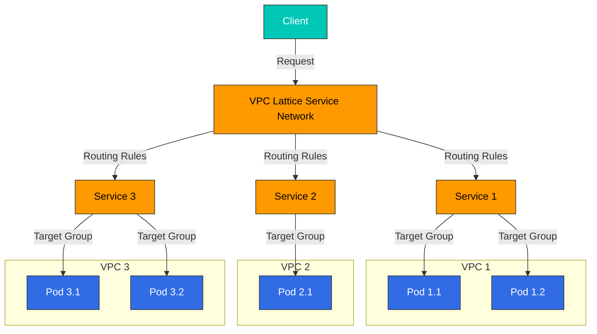
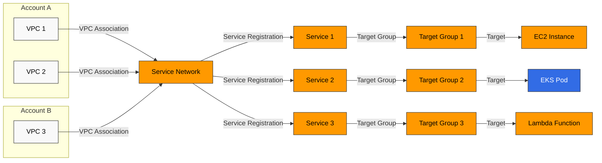
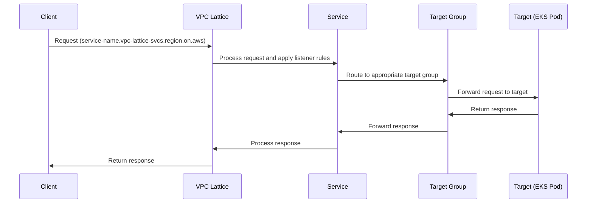
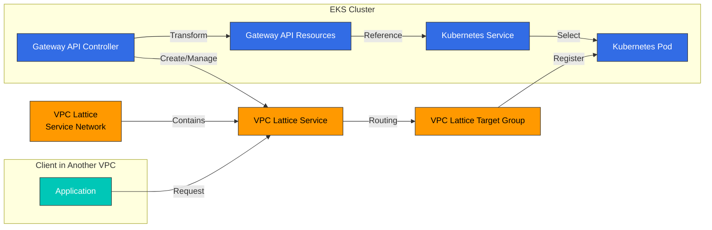

# VPC Lattice

Amazon VPC Lattice は、異なる VPC やアカウント間でサービスを安全に接続・管理できる AWS アプリケーションネットワーキングサービスです。このドキュメントでは、VPC Lattice の概念、アーキテクチャ、Amazon EKS との統合方法、ベストプラクティスについて説明します。

## 目次

1. [概要](#overview)
2. [アーキテクチャ](#architecture)
3. [EKS と VPC Lattice の統合](#eks-and-vpc-lattice-integration)
4. [インストールと設定](#installation-and-configuration)
5. [サービス管理](#service-management)
6. [ルーティングとトラフィック管理](#routing-and-traffic-management)
7. [セキュリティと認証](#security-and-authentication)
8. [モニタリングとログ記録](#monitoring-and-logging)
9. [ベストプラクティス](#best-practices)
10. [トラブルシューティング](#troubleshooting)
11. [まとめ](#conclusion)

## 概要

### VPC Lattice とは？

Amazon VPC Lattice は、サービス間接続、セキュリティ、モニタリングのためのフルマネージドなアプリケーションネットワーキングサービスです。主な機能は次のとおりです。

- **Service Network**: 複数の VPC やアカウントにまたがってサービスを接続する論理的な境界
- **Service Discovery**: Service Network 内のサービスを自動的に検出
- **Traffic Management**: ルーティングルール、重み付けルーティング、パスベースルーティングをサポート
- **Authentication and Authorization**: AWS IAM とリソースポリシーによるアクセス制御
- **Observability**: 統合されたモニタリング、ログ記録、トレーシング機能

### 主なユースケース

1. **マイクロサービスアーキテクチャ**: マイクロサービス間の通信を簡素化し、安全に保護
2. **マルチアカウント環境**: 複数の AWS アカウントにまたがるサービス間の安全な通信
3. **ハイブリッドワークロード**: コンテナ化されたワークロードとコンテナ化されていないワークロード間の通信
4. **Service Mesh の代替**: 複雑さを軽減する軽量な Service Mesh 機能を提供
5. **マルチクラスター接続**: 複数の EKS クラスター間のサービス通信を簡素化

### VPC Lattice と他のサービスの比較

#### VPC Lattice と API Gateway の比較

| 機能 | VPC Lattice | API Gateway |
|---------|------------|------------|
| 主な用途 | 内部サービス間通信 | 外部 API の公開 |
| ネットワークの場所 | VPC 内 | インターネット接続 |
| プロトコル | HTTP/HTTPS、gRPC | HTTP/HTTPS、WebSocket、REST、GraphQL |
| 認証 | AWS IAM、リソースポリシー | IAM、Lambda オーソライザー、Cognito |
| スケーラビリティ | 自動スケーリング | 自動スケーリング |
| 料金 | 時間単位 + データスループット | リクエスト数 + データスループット |

#### VPC Lattice と AWS App Mesh の比較

| 機能 | VPC Lattice | AWS App Mesh |
|---------|------------|-------------|
| アーキテクチャ | マネージドサービス | Sidecar Proxy ベース |
| 複雑さ | 低 | 中 |
| プロトコル | HTTP/HTTPS、gRPC | HTTP/HTTPS、gRPC、TCP |
| Service Discovery | 組み込み | AWS Cloud Map 統合 |
| トラフィック制御 | 基本的なルーティングルール | 高度なトラフィック制御 |
| Observability | CloudWatch 統合 | Envoy による詳細なメトリクス |

#### VPC Lattice と Transit Gateway の比較

| 機能 | VPC Lattice | Transit Gateway |
|---------|------------|----------------|
| 主な用途 | サービス間通信 | VPC 間ネットワーク接続 |
| 抽象化レベル | サービスレベル | ネットワークレベル |
| プロトコル | アプリケーションレイヤー (L7) | ネットワークレイヤー (L3) |
| ルーティング | サービス名ベース | IP ベース |
| セキュリティ | サービスレベルのポリシー | Security Group、NACL |

## アーキテクチャ

### VPC Lattice のコンポーネント

VPC Lattice は次の主要コンポーネントで構成されています。

1. **Service Network**: サービス間通信のための論理的な境界
2. **Service**: アプリケーションまたはマイクロサービスを表すエンドポイント
3. **Target Group**: サービスへのトラフィックをルーティングするターゲットの集合
4. **Listener**: サービスへの接続リクエストを処理するプロセス
5. **Rule**: Listener がトラフィックをルーティングする方法を定義
6. **VPC Association**: VPC を Service Network に接続



### Service Network アーキテクチャ

Service Network は、複数の VPC やアカウントにまたがるサービスを接続する VPC Lattice の中核コンポーネントです。



### トラフィックフロー

VPC Lattice におけるトラフィックの流れは次のとおりです。

1. Client が VPC Lattice サービスの DNS 名にリクエストを送信する
2. VPC Lattice がリクエストを受信し、Listener ルールに従って処理する
3. Listener ルールがリクエストを適切な Target Group にルーティングする
4. Target Group がリクエストを登録済みのターゲット（EC2、EKS Pod、Lambda など）に転送する
5. ターゲットがレスポンスを処理し、Client に返す



### Service Discovery

VPC Lattice は Service Network 内で Service Discovery を自動的に提供します。

1. 各 Service には一意の DNS 名（`service-name.vpc-lattice-svcs.region.on.aws`）がある
2. Client はこの DNS 名を使用して Service にアクセスする
3. VPC Lattice が DNS 解決とルーティングを処理する
4. Service Network に接続されたすべての VPC から Service にアクセスできる

### セキュリティモデル

VPC Lattice は次のセキュリティメカニズムを提供します。

1. **Network Isolation**: Service Network が論理的に分離された環境を提供
2. **Authentication and Authorization**: AWS IAM による Service のアクセス制御
3. **Resource Policies**: Service および Service Network のきめ細かなアクセス制御
4. **TLS Encryption**: サービス間通信の暗号化
5. **VPC Security Groups**: ターゲットのための追加のセキュリティレイヤー

## EKS と VPC Lattice の統合

### 統合アーキテクチャ

Amazon EKS と VPC Lattice の統合は次のコンポーネントで構成されます。

1. **AWS Gateway API Controller**: Kubernetes Gateway API を VPC Lattice リソースに変換
2. **Kubernetes Gateway API**: サービスルーティングのための標準 Kubernetes API
3. **VPC Lattice Service Network**: EKS クラスターが接続する Service Network
4. **VPC Lattice Service**: Kubernetes Service にマッピングされる VPC Lattice Service
5. **VPC Lattice Target Group**: Kubernetes Pod にマッピングされる Target Group



### 統合のメリット

EKS を VPC Lattice と統合すると、次のメリットが得られます。

1. **Standardized API**: Kubernetes Gateway API による一貫性のあるサービス管理
2. **Cross-Cluster Communication**: 複数の EKS クラスター間のシームレスな通信
3. **Hybrid Workloads**: EKS Pod とコンテナ化されていないワークロード間の通信
4. **Centralized Management**: AWS コンソールからすべての Service Network を管理
5. **Unified Observability**: CloudWatch と CloudTrail による統合モニタリングとログ記録
6. **Simplified Service Mesh**: Sidecar なしで Service Mesh 機能を提供

### Service Mesh の代替としての VPC Lattice

VPC Lattice は、以下の理由により従来の Service Mesh（Istio、Linkerd など）の代替となり得ます。

1. **Low Complexity**: Sidecar Proxy なしで Service Mesh 機能を提供
2. **Reduced Management Overhead**: AWS によるフルマネージドサービス
3. **Resource Efficiency**: Sidecar Proxy を使用しないことでリソース使用量を削減
4. **AWS Service Integration**: AWS サービスエコシステムとのシームレスな統合

| 機能 | VPC Lattice | 従来の Service Mesh |
|---------|------------|-----------------|
| Service Discovery | 組み込み | 個別の設定が必要 |
| トラフィックルーティング | サポート | サポート |
| トラフィック分割 | サポート | サポート |
| 詳細なトラフィック制御 | 制限あり | 広範 |
| Sidecar Proxy | 不要 | 必要 |
| 管理の複雑さ | 低 | 高 |
| リソースオーバーヘッド | 低 | 高 |
| Observability | CloudWatch 統合 | 多様なツールをサポート |
## インストールと設定

### 前提条件

VPC Lattice を EKS と統合するための前提条件は次のとおりです。

1. **Amazon EKS Cluster**: Kubernetes バージョン 1.23 以降
2. **IAM Permissions**: VPC Lattice リソースを作成・管理するための権限
3. **VPC Setup**: プライベートサブネットを持つ VPC
4. **AWS CLI**: 最新バージョンの AWS CLI
5. **kubectl**: 最新バージョンの kubectl
6. **Helm**: AWS Gateway API Controller のインストール用 Helm 3（任意）

### AWS Gateway API Controller のインストール

AWS Gateway API Controller は、Kubernetes Gateway API リソースを VPC Lattice リソースに変換します。

#### Helm を使用したインストール

```bash
# Add Helm repository
helm repo add eks https://aws.github.io/eks-charts
helm repo update

# Install AWS Gateway API Controller
helm install gateway-api-controller eks/aws-gateway-controller \
  --namespace aws-gateway-controller \
  --create-namespace \
  --set serviceAccount.create=true \
  --set serviceAccount.name=aws-gateway-controller \
  --set serviceAccount.annotations."eks\.amazonaws\.com/role-arn"=arn:aws:iam::<AWS_ACCOUNT_ID>:role/AmazonGatewayControllerRole
```

#### YAML マニフェストを使用したインストール

1. Service Account と RBAC の設定:

```yaml
apiVersion: v1
kind: ServiceAccount
metadata:
  name: aws-gateway-controller
  namespace: aws-gateway-controller
  annotations:
    eks.amazonaws.com/role-arn: arn:aws:iam::<AWS_ACCOUNT_ID>:role/AmazonGatewayControllerRole
---
apiVersion: rbac.authorization.k8s.io/v1
kind: ClusterRole
metadata:
  name: aws-gateway-controller
rules:
- apiGroups: ["gateway.networking.k8s.io"]
  resources: ["gatewayclasses", "gateways", "httproutes"]
  verbs: ["get", "list", "watch", "update", "patch"]
- apiGroups: [""]
  resources: ["services", "secrets", "namespaces"]
  verbs: ["get", "list", "watch"]
- apiGroups: [""]
  resources: ["events"]
  verbs: ["create", "patch"]
---
apiVersion: rbac.authorization.k8s.io/v1
kind: ClusterRoleBinding
metadata:
  name: aws-gateway-controller
roleRef:
  apiGroup: rbac.authorization.k8s.io
  kind: ClusterRole
  name: aws-gateway-controller
subjects:
- kind: ServiceAccount
  name: aws-gateway-controller
  namespace: aws-gateway-controller
```

2. Controller の Deployment:

```yaml
apiVersion: apps/v1
kind: Deployment
metadata:
  name: aws-gateway-controller
  namespace: aws-gateway-controller
spec:
  replicas: 1
  selector:
    matchLabels:
      app: aws-gateway-controller
  template:
    metadata:
      labels:
        app: aws-gateway-controller
    spec:
      serviceAccountName: aws-gateway-controller
      containers:
      - name: controller
        image: public.ecr.aws/aws-application-networking-k8s/aws-gateway-controller:v1.0.0
        args:
        - --health-probe-bind-address=:8081
        - --metrics-bind-address=:8080
        - --leader-elect
        resources:
          limits:
            cpu: 500m
            memory: 128Mi
          requests:
            cpu: 10m
            memory: 64Mi
```

### IAM Role の設定

AWS Gateway API Controller には、VPC Lattice リソースを管理するための適切な IAM 権限が必要です。

#### IRSA（IAM Roles for Service Accounts）の設定

```bash
# Create IAM policy
cat <<EOF > vpc-lattice-policy.json
{
  "Version": "2012-10-17",
  "Statement": [
    {
      "Effect": "Allow",
      "Action": [
        "vpc-lattice:*",
        "ec2:DescribeVpcs",
        "ec2:DescribeSubnets",
        "ec2:DescribeSecurityGroups",
        "elasticloadbalancing:DescribeTargetGroups",
        "elasticloadbalancing:DescribeTargetHealth",
        "elasticloadbalancing:RegisterTargets",
        "elasticloadbalancing:DeregisterTargets"
      ],
      "Resource": "*"
    }
  ]
}
EOF

aws iam create-policy \
  --policy-name AmazonGatewayControllerPolicy \
  --policy-document file://vpc-lattice-policy.json

# Create IAM role and associate with service account
eksctl create iamserviceaccount \
  --name aws-gateway-controller \
  --namespace aws-gateway-controller \
  --cluster <CLUSTER_NAME> \
  --attach-policy-arn arn:aws:iam::<AWS_ACCOUNT_ID>:policy/AmazonGatewayControllerPolicy \
  --approve \
  --override-existing-serviceaccounts
```

### VPC Lattice Service Network の作成

VPC Lattice Service Network は、AWS Management Console、AWS CLI、または AWS CloudFormation を通じて作成できます。

#### AWS CLI を使用した作成

```bash
# Create service network
aws vpc-lattice create-service-network \
  --name my-service-network \
  --auth-type AWS_IAM

# Store service network ID
SERVICE_NETWORK_ID=$(aws vpc-lattice list-service-networks \
  --query "items[?name=='my-service-network'].id" \
  --output text)

# Associate VPC with service network
aws vpc-lattice create-service-network-vpc-association \
  --service-network-identifier $SERVICE_NETWORK_ID \
  --vpc-identifier <VPC_ID> \
  --security-group-ids <SECURITY_GROUP_ID>
```

#### AWS CloudFormation を使用した作成

```yaml
Resources:
  MyServiceNetwork:
    Type: AWS::VpcLattice::ServiceNetwork
    Properties:
      Name: my-service-network
      AuthType: AWS_IAM

  MyVpcAssociation:
    Type: AWS::VpcLattice::ServiceNetworkVpcAssociation
    Properties:
      ServiceNetworkIdentifier: !Ref MyServiceNetwork
      VpcIdentifier: !Ref MyVPC
      SecurityGroupIds:
        - !Ref MySecurityGroup
```

### Gateway API リソースの設定

VPC Lattice と統合するために Kubernetes Gateway API リソースを設定します。

#### 1. GatewayClass の作成

GatewayClass は Gateway リソースの実装を定義します。

```yaml
apiVersion: gateway.networking.k8s.io/v1beta1
kind: GatewayClass
metadata:
  name: amazon-vpc-lattice
spec:
  controllerName: application-networking.k8s.aws/gateway-api-controller
```

#### 2. Gateway の作成

Gateway は、トラフィックがクラスターに入る方法を定義します。

```yaml
apiVersion: gateway.networking.k8s.io/v1beta1
kind: Gateway
metadata:
  name: my-gateway
  namespace: default
  annotations:
    application-networking.k8s.aws/service-network-id: <SERVICE_NETWORK_ID>
spec:
  gatewayClassName: amazon-vpc-lattice
  listeners:
  - name: http
    port: 80
    protocol: HTTP
```

#### 3. HTTPRoute の作成

HTTPRoute は HTTP トラフィックを Service にルーティングする方法を定義します。

```yaml
apiVersion: gateway.networking.k8s.io/v1beta1
kind: HTTPRoute
metadata:
  name: my-http-route
  namespace: default
spec:
  parentRefs:
  - name: my-gateway
    kind: Gateway
  rules:
  - matches:
    - path:
        type: PathPrefix
        value: /api
    backendRefs:
    - name: my-service
      port: 8080
```

### Service と Pod の設定

VPC Lattice と統合する Kubernetes Service と Pod を設定します。

#### 1. Service の作成

```yaml
apiVersion: v1
kind: Service
metadata:
  name: my-service
  namespace: default
spec:
  selector:
    app: my-app
  ports:
  - port: 8080
    targetPort: 8080
  type: ClusterIP
```

#### 2. Deployment の作成

```yaml
apiVersion: apps/v1
kind: Deployment
metadata:
  name: my-app
  namespace: default
spec:
  replicas: 3
  selector:
    matchLabels:
      app: my-app
  template:
    metadata:
      labels:
        app: my-app
    spec:
      containers:
      - name: my-container
        image: nginx:latest
        ports:
        - containerPort: 8080
        readinessProbe:
          httpGet:
            path: /health
            port: 8080
          initialDelaySeconds: 5
          periodSeconds: 10
```

## サービス管理

### VPC Lattice Service の作成

VPC Lattice Service は、AWS Management Console、AWS CLI、AWS CloudFormation を通じて直接作成することも、Kubernetes Gateway API を通じて間接的に作成することもできます。

#### AWS CLI を使用した直接作成

```bash
# Create target group
aws vpc-lattice create-target-group \
  --name my-target-group \
  --type INSTANCE \
  --config '{"port":80,"protocol":"HTTP","vpcIdentifier":"<VPC_ID>","healthCheck":{"enabled":true,"protocol":"HTTP","path":"/health","port":80,"healthCheckIntervalSeconds":30,"healthCheckTimeoutSeconds":5,"healthyThresholdCount":5,"unhealthyThresholdCount":2}}'

# Store target group ID
TARGET_GROUP_ID=$(aws vpc-lattice list-target-groups \
  --query "items[?name=='my-target-group'].id" \
  --output text)

# Create service
aws vpc-lattice create-service \
  --name my-service \
  --auth-type AWS_IAM

# Store service ID
SERVICE_ID=$(aws vpc-lattice list-services \
  --query "items[?name=='my-service'].id" \
  --output text)

# Create listener
aws vpc-lattice create-listener \
  --service-identifier $SERVICE_ID \
  --name my-listener \
  --protocol HTTP \
  --port 80 \
  --default-action '{"forward":{"targetGroups":[{"targetGroupIdentifier":"'$TARGET_GROUP_ID'"}]}}'

# Associate service with service network
aws vpc-lattice create-service-network-service-association \
  --service-network-identifier $SERVICE_NETWORK_ID \
  --service-identifier $SERVICE_ID
```

#### Kubernetes Gateway API を使用した間接作成

Gateway API リソースを作成すると、AWS Gateway API Controller が VPC Lattice リソースを自動的に作成します。

```yaml
apiVersion: gateway.networking.k8s.io/v1beta1
kind: Gateway
metadata:
  name: my-gateway
  namespace: default
  annotations:
    application-networking.k8s.aws/service-network-id: <SERVICE_NETWORK_ID>
spec:
  gatewayClassName: amazon-vpc-lattice
  listeners:
  - name: http
    port: 80
    protocol: HTTP
---
apiVersion: gateway.networking.k8s.io/v1beta1
kind: HTTPRoute
metadata:
  name: my-http-route
  namespace: default
spec:
  parentRefs:
  - name: my-gateway
    kind: Gateway
  rules:
  - matches:
    - path:
        type: PathPrefix
        value: /api
    backendRefs:
    - name: my-service
      port: 8080
```

### Service Discovery とアクセス

VPC Lattice Service には DNS 名が自動的に割り当てられ、Service Network 内で検出できます。

#### DNS 名の形式

```
<service-name>.<service-network-id>.vpc-lattice-svcs.<region>.on.aws
```

#### Service アクセスの例

```bash
# Query service DNS name
SERVICE_DNS=$(aws vpc-lattice get-service \
  --service-identifier $SERVICE_ID \
  --query "dnsEntry.domainName" \
  --output text)

# Access service
curl -v http://$SERVICE_DNS/api
```

### Service の更新と削除

#### AWS CLI を使用した Service の更新

```bash
# Update service
aws vpc-lattice update-service \
  --service-identifier $SERVICE_ID \
  --auth-type NONE

# Update listener
aws vpc-lattice update-listener \
  --service-identifier $SERVICE_ID \
  --listener-identifier <LISTENER_ID> \
  --default-action '{"forward":{"targetGroups":[{"targetGroupIdentifier":"'$TARGET_GROUP_ID'","weight":100}]}}'
```

#### AWS CLI を使用した Service の削除

```bash
# Dissociate from service network
aws vpc-lattice delete-service-network-service-association \
  --service-network-service-association-identifier <ASSOCIATION_ID>

# Delete listener
aws vpc-lattice delete-listener \
  --service-identifier $SERVICE_ID \
  --listener-identifier <LISTENER_ID>

# Delete service
aws vpc-lattice delete-service \
  --service-identifier $SERVICE_ID

# Delete target group
aws vpc-lattice delete-target-group \
  --target-group-identifier $TARGET_GROUP_ID
```

#### Kubernetes Gateway API を使用した Service 管理

Gateway API リソースを更新または削除すると、AWS Gateway API Controller が VPC Lattice リソースを自動的に更新または削除します。

```bash
# Update HTTPRoute
kubectl apply -f updated-http-route.yaml

# Delete HTTPRoute
kubectl delete httproute my-http-route

# Delete Gateway
kubectl delete gateway my-gateway
```

## ルーティングとトラフィック管理

### 基本ルーティング

VPC Lattice は、パスベースルーティング、ヘッダーベースルーティング、重み付けルーティングなど、さまざまなルーティングオプションを提供します。

#### パスベースルーティング

```yaml
apiVersion: gateway.networking.k8s.io/v1beta1
kind: HTTPRoute
metadata:
  name: path-based-route
  namespace: default
spec:
  parentRefs:
  - name: my-gateway
    kind: Gateway
  rules:
  - matches:
    - path:
        type: PathPrefix
        value: /api/v1
    backendRefs:
    - name: service-v1
      port: 8080
  - matches:
    - path:
        type: PathPrefix
        value: /api/v2
    backendRefs:
    - name: service-v2
      port: 8080
```

#### ヘッダーベースルーティング

```yaml
apiVersion: gateway.networking.k8s.io/v1beta1
kind: HTTPRoute
metadata:
  name: header-based-route
  namespace: default
spec:
  parentRefs:
  - name: my-gateway
    kind: Gateway
  rules:
  - matches:
    - headers:
      - name: "version"
        value: "v1"
    backendRefs:
    - name: service-v1
      port: 8080
  - matches:
    - headers:
      - name: "version"
        value: "v2"
    backendRefs:
    - name: service-v2
      port: 8080
```

### トラフィック分割と Canary Deployment

VPC Lattice は、重み付けルーティングによるトラフィック分割と Canary Deployment をサポートします。

#### AWS CLI を使用した重み付けルーティング

```bash
# Set up weighted routing
aws vpc-lattice update-listener \
  --service-identifier $SERVICE_ID \
  --listener-identifier <LISTENER_ID> \
  --default-action '{
    "forward": {
      "targetGroups": [
        {
          "targetGroupIdentifier": "'$TARGET_GROUP_ID_V1'",
          "weight": 80
        },
        {
          "targetGroupIdentifier": "'$TARGET_GROUP_ID_V2'",
          "weight": 20
        }
      ]
    }
  }'
```

#### Kubernetes Gateway API を使用した重み付けルーティング

現在、Kubernetes Gateway API は重み付けルーティングを直接サポートしていませんが、AWS Gateway API Controller はアノテーションを通じてこの機能をサポートしています。

```yaml
apiVersion: gateway.networking.k8s.io/v1beta1
kind: HTTPRoute
metadata:
  name: weighted-route
  namespace: default
  annotations:
    application-networking.k8s.aws/traffic-weights: |
      {
        "service-v1": 80,
        "service-v2": 20
      }
spec:
  parentRefs:
  - name: my-gateway
    kind: Gateway
  rules:
  - matches:
    - path:
        type: PathPrefix
        value: /api
    backendRefs:
    - name: service-v1
      port: 8080
    - name: service-v2
      port: 8080
```

### ヘルスチェックの設定

VPC Lattice は Target Group のヘルスチェックをサポートします。

#### AWS CLI を使用したヘルスチェック設定

```bash
# Update health check configuration
aws vpc-lattice update-target-group \
  --target-group-identifier $TARGET_GROUP_ID \
  --health-check '{
    "enabled": true,
    "protocol": "HTTP",
    "path": "/health",
    "port": 8080,
    "healthCheckIntervalSeconds": 30,
    "healthCheckTimeoutSeconds": 5,
    "healthyThresholdCount": 5,
    "unhealthyThresholdCount": 2,
    "matcher": {
      "httpCode": "200-299"
    }
  }'
```

#### Kubernetes Gateway API を使用したヘルスチェック設定

AWS Gateway API Controller はアノテーションを通じてヘルスチェック設定をサポートします。

```yaml
apiVersion: gateway.networking.k8s.io/v1beta1
kind: HTTPRoute
metadata:
  name: health-check-route
  namespace: default
  annotations:
    application-networking.k8s.aws/health-check: |
      {
        "enabled": true,
        "protocol": "HTTP",
        "path": "/health",
        "port": 8080,
        "intervalSeconds": 30,
        "timeoutSeconds": 5,
        "healthyThresholdCount": 5,
        "unhealthyThresholdCount": 2,
        "matcher": {
          "httpCode": "200-299"
        }
      }
spec:
  parentRefs:
  - name: my-gateway
    kind: Gateway
  rules:
  - matches:
    - path:
        type: PathPrefix
        value: /api
    backendRefs:
    - name: my-service
      port: 8080
```
## セキュリティと認証

### 認証方法

VPC Lattice は次の認証方法をサポートします。

1. **AWS IAM**: AWS Identity and Access Management を使用する認証
2. **No Authentication**: 認証なしですべてのリクエストを許可

#### AWS IAM 認証の設定

```bash
# Create service with IAM authentication
aws vpc-lattice create-service \
  --name my-service \
  --auth-type AWS_IAM
```

#### Kubernetes Gateway API を使用した IAM 認証の設定

```yaml
apiVersion: gateway.networking.k8s.io/v1beta1
kind: Gateway
metadata:
  name: my-gateway
  namespace: default
  annotations:
    application-networking.k8s.aws/service-network-id: <SERVICE_NETWORK_ID>
    application-networking.k8s.aws/auth-type: "AWS_IAM"
spec:
  gatewayClassName: amazon-vpc-lattice
  listeners:
  - name: http
    port: 80
    protocol: HTTP
```

### リソースポリシー

VPC Lattice は、リソースポリシーを通じて Service および Service Network のきめ細かなアクセス制御を提供します。

#### Service リソースポリシーの設定

```bash
# Set service resource policy
aws vpc-lattice put-resource-policy \
  --resource-arn arn:aws:vpc-lattice:<REGION>:<ACCOUNT_ID>:service/<SERVICE_ID> \
  --policy '{
    "Version": "2012-10-17",
    "Statement": [
      {
        "Effect": "Allow",
        "Principal": {
          "AWS": "arn:aws:iam::<ACCOUNT_ID>:role/MyRole"
        },
        "Action": "vpc-lattice:Invoke",
        "Resource": "arn:aws:vpc-lattice:<REGION>:<ACCOUNT_ID>:service/<SERVICE_ID>"
      }
    ]
  }'
```

#### Service Network リソースポリシーの設定

```bash
# Set service network resource policy
aws vpc-lattice put-resource-policy \
  --resource-arn arn:aws:vpc-lattice:<REGION>:<ACCOUNT_ID>:servicenetwork/<SERVICE_NETWORK_ID> \
  --policy '{
    "Version": "2012-10-17",
    "Statement": [
      {
        "Effect": "Allow",
        "Principal": {
          "AWS": "arn:aws:iam::<ACCOUNT_ID>:role/MyRole"
        },
        "Action": [
          "vpc-lattice:CreateServiceNetworkVpcAssociation",
          "vpc-lattice:CreateServiceNetworkServiceAssociation"
        ],
        "Resource": "arn:aws:vpc-lattice:<REGION>:<ACCOUNT_ID>:servicenetwork/<SERVICE_NETWORK_ID>"
      }
    ]
  }'
```

### クロスアカウントアクセス

VPC Lattice は、Service Network を通じて複数の AWS アカウントにまたがるサービス間通信をサポートします。

#### Service Network のクロスアカウント共有

1. AWS RAM（Resource Access Manager）を使用して Service Network を共有します。

```bash
# Share service network
aws ram create-resource-share \
  --name my-service-network-share \
  --resource-arns arn:aws:vpc-lattice:<REGION>:<ACCOUNT_ID>:servicenetwork/<SERVICE_NETWORK_ID> \
  --principals arn:aws:organizations::o-<ORGANIZATION_ID>:organization

# Or share with specific account
aws ram create-resource-share \
  --name my-service-network-share \
  --resource-arns arn:aws:vpc-lattice:<REGION>:<ACCOUNT_ID>:servicenetwork/<SERVICE_NETWORK_ID> \
  --principals <TARGET_ACCOUNT_ID>
```

2. 対象アカウントで共有された Service Network を承認します。

```bash
# Accept share invitation
aws ram accept-resource-share-invitation \
  --resource-share-invitation-arn arn:aws:ram:<REGION>:<ACCOUNT_ID>:resource-share-invitation/<INVITATION_ID>
```

3. 対象アカウントで VPC を共有された Service Network に接続します。

```bash
# VPC association
aws vpc-lattice create-service-network-vpc-association \
  --service-network-identifier <SERVICE_NETWORK_ID> \
  --vpc-identifier <VPC_ID> \
  --security-group-ids <SECURITY_GROUP_ID>
```

### TLS の設定

VPC Lattice は Service の TLS 暗号化をサポートします。

#### AWS CLI を使用した TLS 設定

```bash
# Create or import ACM certificate
CERTIFICATE_ARN=$(aws acm request-certificate \
  --domain-name my-service.example.com \
  --validation-method DNS \
  --query CertificateArn \
  --output text)

# Create TLS listener
aws vpc-lattice create-listener \
  --service-identifier $SERVICE_ID \
  --name my-tls-listener \
  --protocol HTTPS \
  --port 443 \
  --tls '{
    "certificateArn": "'$CERTIFICATE_ARN'",
    "mode": "STRICT"
  }' \
  --default-action '{
    "forward": {
      "targetGroups": [
        {
          "targetGroupIdentifier": "'$TARGET_GROUP_ID'"
        }
      ]
    }
  }'
```

#### Kubernetes Gateway API を使用した TLS 設定

```yaml
apiVersion: gateway.networking.k8s.io/v1beta1
kind: Gateway
metadata:
  name: my-tls-gateway
  namespace: default
  annotations:
    application-networking.k8s.aws/service-network-id: <SERVICE_NETWORK_ID>
spec:
  gatewayClassName: amazon-vpc-lattice
  listeners:
  - name: https
    port: 443
    protocol: HTTPS
    tls:
      mode: Terminate
      certificateRefs:
      - kind: Secret
        name: my-tls-cert
```

## モニタリングとログ記録

### CloudWatch メトリクス

VPC Lattice は、サービスのパフォーマンスと状態を監視するためのさまざまな CloudWatch メトリクスを提供します。

#### 主なメトリクス

| メトリクス名 | 説明 | ディメンション |
|------------|------|------|
| RequestCount | 処理されたリクエスト数 | ServiceId、ServiceName、TargetGroupId |
| HTTP_4XX_Count | 4XX HTTP レスポンスコードの数 | ServiceId、ServiceName、TargetGroupId |
| HTTP_5XX_Count | 5XX HTTP レスポンスコードの数 | ServiceId、ServiceName、TargetGroupId |
| ProcessedBytes | 処理されたバイト数 | ServiceId、ServiceName、TargetGroupId |
| TargetProcessingTime | ターゲット処理時間（ms） | ServiceId、ServiceName、TargetGroupId |
| HealthyTargetCount | 正常なターゲット数 | TargetGroupId |
| UnhealthyTargetCount | 異常なターゲット数 | TargetGroupId |

#### CloudWatch Dashboard の作成

```bash
# Create CloudWatch dashboard
aws cloudwatch put-dashboard \
  --dashboard-name VPCLatticeMonitoring \
  --dashboard-body '{
    "widgets": [
      {
        "type": "metric",
        "x": 0,
        "y": 0,
        "width": 12,
        "height": 6,
        "properties": {
          "metrics": [
            ["AWS/VpcLattice", "RequestCount", "ServiceName", "my-service"]
          ],
          "period": 60,
          "stat": "Sum",
          "region": "<REGION>",
          "title": "Request Count"
        }
      },
      {
        "type": "metric",
        "x": 12,
        "y": 0,
        "width": 12,
        "height": 6,
        "properties": {
          "metrics": [
            ["AWS/VpcLattice", "HTTP_4XX_Count", "ServiceName", "my-service"],
            ["AWS/VpcLattice", "HTTP_5XX_Count", "ServiceName", "my-service"]
          ],
          "period": 60,
          "stat": "Sum",
          "region": "<REGION>",
          "title": "Error Count"
        }
      }
    ]
  }'
```

### CloudWatch アラーム

問題を早期に検出するため、VPC Lattice メトリクスに対する CloudWatch アラームを設定します。

```bash
# Create 5XX error alarm
aws cloudwatch put-metric-alarm \
  --alarm-name VPCLattice-5XX-Errors \
  --alarm-description "Alarm when 5XX errors exceed threshold" \
  --metric-name HTTP_5XX_Count \
  --namespace AWS/VpcLattice \
  --dimensions Name=ServiceName,Value=my-service \
  --statistic Sum \
  --period 60 \
  --evaluation-periods 5 \
  --threshold 10 \
  --comparison-operator GreaterThanThreshold \
  --alarm-actions arn:aws:sns:<REGION>:<ACCOUNT_ID>:my-alert-topic
```

### アクセスログ

VPC Lattice は、Service のアクセスログを Amazon S3、Amazon CloudWatch Logs、または Amazon Kinesis Data Firehose に送信できます。

#### S3 アクセスログの設定

```bash
# Create S3 bucket
aws s3 mb s3://vpc-lattice-access-logs-<ACCOUNT_ID>

# Set bucket policy
aws s3api put-bucket-policy \
  --bucket vpc-lattice-access-logs-<ACCOUNT_ID> \
  --policy '{
    "Version": "2012-10-17",
    "Statement": [
      {
        "Effect": "Allow",
        "Principal": {
          "Service": "delivery.logs.amazonaws.com"
        },
        "Action": "s3:PutObject",
        "Resource": "arn:aws:s3:::vpc-lattice-access-logs-<ACCOUNT_ID>/*",
        "Condition": {
          "StringEquals": {
            "s3:x-amz-acl": "bucket-owner-full-control"
          }
        }
      }
    ]
  }'

# Enable access logging
aws vpc-lattice create-access-log-subscription \
  --resource-identifier $SERVICE_ID \
  --destination-arn arn:aws:s3:::vpc-lattice-access-logs-<ACCOUNT_ID> \
  --destination-name my-s3-logs
```

#### CloudWatch Logs アクセスログの設定

```bash
# Create log group
aws logs create-log-group \
  --log-group-name /aws/vpc-lattice/my-service

# Enable access logging
aws vpc-lattice create-access-log-subscription \
  --resource-identifier $SERVICE_ID \
  --destination-arn arn:aws:logs:<REGION>:<ACCOUNT_ID>:log-group:/aws/vpc-lattice/my-service \
  --destination-name my-cloudwatch-logs
```

### AWS X-Ray 統合

VPC Lattice は AWS X-Ray と統合し、分散トレーシングをサポートします。

#### X-Ray トレーシングの有効化

```bash
# Enable X-Ray tracing
aws vpc-lattice update-service \
  --service-identifier $SERVICE_ID \
  --auth-type AWS_IAM \
  --tracing-config '{
    "enabled": true
  }'
```

#### Kubernetes Gateway API を使用した X-Ray トレーシングの有効化

```yaml
apiVersion: gateway.networking.k8s.io/v1beta1
kind: Gateway
metadata:
  name: my-gateway
  namespace: default
  annotations:
    application-networking.k8s.aws/service-network-id: <SERVICE_NETWORK_ID>
    application-networking.k8s.aws/xray-tracing: "enabled"
spec:
  gatewayClassName: amazon-vpc-lattice
  listeners:
  - name: http
    port: 80
    protocol: HTTP
```

## ベストプラクティス

### 設計とアーキテクチャ

1. **Service Network の設計**
   - 論理的な境界ごとに Service Network を分離する
   - 環境（開発、ステージング、本番）ごとに Service Network を分離する
   - セキュリティ要件に基づいて Service Network を分離する

2. **Service の命名規則**
   - 一貫性のある命名規則を使用する
   - 名前に環境、Service タイプ、バージョンを含める
   - 例: `<env>-<service-name>-<version>`

3. **Target Group の設計**
   - 類似した特性を持つターゲットを同じ Target Group に配置する
   - ヘルスチェックのパスと間隔を最適化する
   - 適切な異常しきい値を設定する

### パフォーマンス最適化

1. **ヘルスチェックの最適化**
   - 適切なヘルスチェック間隔を設定する（短すぎないようにする）
   - 軽量なヘルスチェックエンドポイントを実装する
   - 重要な依存関係を検証するようにヘルスチェックパスを設定する

2. **接続の再利用**
   - Client 側のコネクションプーリングを実装する
   - Keep-Alive ヘッダーを使用する
   - 接続タイムアウトを最適化する

3. **キャッシュ戦略**
   - 静的コンテンツに Client 側キャッシュを実装する
   - Cache-Control ヘッダーを最適化する
   - 必要に応じて CDN を統合する

### セキュリティ強化

1. **最小権限の原則**
   - 必要最小限の権限のみを付与する
   - Service 固有の IAM ポリシーを作成する
   - 定期的に権限をレビューし、監査する

2. **ネットワークセキュリティ**
   - Security Group を使用してトラフィックを制限する
   - 必要なポートのみを開放する
   - VPC エンドポイントの使用を検討する

3. **暗号化**
   - 転送中のデータ暗号化に TLS を使用する
   - 最新の TLS バージョンと暗号スイートを使用する
   - 証明書の自動更新を設定する

### モニタリングと Observability

1. **包括的なモニタリング**
   - すべての Service の CloudWatch Dashboard を作成する
   - 主要メトリクスのアラームを設定する
   - ログ分析と異常検出を実装する

2. **ログ戦略**
   - すべての Service でアクセスログを有効にする
   - ログ保持ポリシーを設定する
   - ログ分析ツールを統合する

3. **分散トレーシング**
   - X-Ray トレーシングを有効にする
   - Service 間のトレース相関を実装する
   - トレースデータを分析・可視化する

### コスト最適化

1. **リソース使用量のモニタリング**
   - Service と Target Group の使用状況を追跡する
   - 未使用のリソースを特定して削除する
   - コスト配分タグを使用する

2. **トラフィックの最適化**
   - 不要なリクエストを削減する
   - レスポンスサイズを最適化する
   - バッチ処理を実装する（可能な場合）

3. **自動スケーリング**
   - トラフィックパターンに基づいてターゲットを自動スケーリングする
   - スケジュールされたスケーリングを実装する（予測可能なトラフィックパターン向け）
   - スケーリングしきい値を最適化する

## トラブルシューティング

### よくある問題と解決策

#### 1. 接続の問題

**問題**: Client が VPC Lattice Service に接続できない

**解決策**:
- VPC と Service Network 間の接続を確認する
- Security Group ルールを検証する
- DNS 解決を確認する
- ターゲットの状態を確認する

```bash
# Check VPC association
aws vpc-lattice list-service-network-vpc-associations \
  --service-network-identifier $SERVICE_NETWORK_ID

# Check target status
aws vpc-lattice list-targets \
  --target-group-identifier $TARGET_GROUP_ID
```

#### 2. 認証の問題

**問題**: Client が認証エラーを受け取る

**解決策**:
- IAM ポリシーと権限を検証する
- リソースポリシーを確認する
- 署名バージョンとヘッダーを確認する
- 一時的な認証情報の有効期限を確認する

```bash
# Check resource policy
aws vpc-lattice get-resource-policy \
  --resource-arn arn:aws:vpc-lattice:<REGION>:<ACCOUNT_ID>:service/<SERVICE_ID>
```

#### 3. ルーティングの問題

**問題**: リクエストが誤ったターゲットにルーティングされる

**解決策**:
- Listener ルールと優先順位を確認する
- パスパターンと一致条件を確認する
- Target Group の設定を確認する
- 重み付けルーティングの設定を確認する

```bash
# Check listener rules
aws vpc-lattice list-listeners \
  --service-identifier $SERVICE_ID

# Check target group
aws vpc-lattice get-target-group \
  --target-group-identifier $TARGET_GROUP_ID
```

#### 4. ヘルスチェックの失敗

**問題**: ターゲットがヘルスチェックに失敗している

**解決策**:
- ヘルスチェックエンドポイントの可用性を確認する
- ヘルスチェック設定を確認する
- ターゲットアプリケーションのログを確認する
- ネットワーク接続を確認する

```bash
# Check health check configuration
aws vpc-lattice get-target-group \
  --target-group-identifier $TARGET_GROUP_ID \
  --query "config.healthCheck"

# Check target status
aws vpc-lattice list-targets \
  --target-group-identifier $TARGET_GROUP_ID
```

### ログ記録とデバッグ

#### 1. アクセスログ分析

VPC Lattice のアクセスログを分析して問題を診断できます。

```bash
# Download access logs from S3
aws s3 cp s3://vpc-lattice-access-logs-<ACCOUNT_ID>/ . --recursive

# Query access logs from CloudWatch Logs
aws logs start-query \
  --log-group-name /aws/vpc-lattice/my-service \
  --start-time $(date -d '1 hour ago' +%s) \
  --end-time $(date +%s) \
  --query-string 'fields @timestamp, client_ip, request_path, status_code, request_processing_time | filter status_code >= 400'
```

#### 2. CloudWatch メトリクス分析

CloudWatch メトリクスを分析してパフォーマンスの問題を診断できます。

```bash
# Query request count metrics
aws cloudwatch get-metric-statistics \
  --namespace AWS/VpcLattice \
  --metric-name RequestCount \
  --dimensions Name=ServiceName,Value=my-service \
  --start-time $(date -d '1 hour ago' -u +%Y-%m-%dT%H:%M:%SZ) \
  --end-time $(date -u +%Y-%m-%dT%H:%M:%SZ) \
  --period 60 \
  --statistics Sum

# Query error metrics
aws cloudwatch get-metric-statistics \
  --namespace AWS/VpcLattice \
  --metric-name HTTP_5XX_Count \
  --dimensions Name=ServiceName,Value=my-service \
  --start-time $(date -d '1 hour ago' -u +%Y-%m-%dT%H:%M:%SZ) \
  --end-time $(date -u +%Y-%m-%dT%H:%M:%SZ) \
  --period 60 \
  --statistics Sum
```

#### 3. X-Ray トレース分析

AWS X-Ray を使用して分散トレースを分析できます。

```bash
# Query X-Ray traces
aws xray get-service-graph \
  --start-time $(date -d '1 hour ago' +%s) \
  --end-time $(date +%s)

# Query specific trace
aws xray batch-get-traces \
  --trace-ids <TRACE_ID>
```

### AWS Support とトラブルシューティングツール

#### 1. AWS Support ケースの作成

重大な問題については、AWS Support ケースを作成できます。

```bash
# Create AWS support case
aws support create-case \
  --subject "VPC Lattice Connectivity Issue" \
  --service-code vpc-lattice \
  --category-code connectivity \
  --severity-code urgent \
  --communication-body "We are experiencing connectivity issues with our VPC Lattice service. Service ID: $SERVICE_ID" \
  --language en
```

#### 2. AWS リソースのヘルスチェック

AWS Health Dashboard を通じて AWS サービスのステータスを確認できます。

```bash
# Check AWS Health events
aws health describe-events \
  --filter 'eventTypeCategories=issue,scheduledChange,accountNotification' \
  --region <REGION>
```

## まとめ

Amazon VPC Lattice は、異なる VPC やアカウントにまたがってサービスを安全に接続・管理できる AWS アプリケーションネットワーキングサービスです。EKS との統合を通じて、Kubernetes 環境における Service Mesh 機能を簡素化された方法で提供します。

このドキュメントでは、以下の内容を扱いました。

1. **概要**: VPC Lattice の概念、主なユースケース、他のサービスとの比較
2. **アーキテクチャ**: VPC Lattice のコンポーネント、Service Network アーキテクチャ、トラフィックフロー
3. **EKS と VPC Lattice の統合**: AWS Gateway API Controller を通じた統合とそのメリット
4. **インストールと設定**: AWS Gateway API Controller のインストール、IAM Role の設定、Service Network の作成
5. **サービス管理**: VPC Lattice Service の作成、検出、アクセス、更新、削除
6. **ルーティングとトラフィック管理**: 基本ルーティング、トラフィック分割、Canary Deployment、ヘルスチェック
7. **セキュリティと認証**: 認証方法、リソースポリシー、クロスアカウントアクセス、TLS 設定
8. **モニタリングとログ記録**: CloudWatch メトリクス、アラーム、アクセスログ、X-Ray 統合
9. **ベストプラクティス**: 設計、パフォーマンス、セキュリティ、モニタリング、コスト最適化
10. **トラブルシューティング**: よくある問題と解決策、ログ記録とデバッグ

VPC Lattice を効果的に実装・管理することで、マイクロサービスアーキテクチャの複雑さを軽減し、サービス間通信のセキュリティを強化し、Observability を向上できます。AWS マネージドサービスとして、運用オーバーヘッドを最小限に抑えながら Service Mesh の利点を提供します。

## 参考資料

- [Amazon VPC Lattice 公式ドキュメント](https://docs.aws.amazon.com/vpc-lattice/)
- [AWS Gateway API Controller 公式ドキュメント](https://github.com/aws/aws-application-networking-k8s)
- [Kubernetes Gateway API ドキュメント](https://gateway-api.sigs.k8s.io/)
- [Amazon EKS Workshop - VPC Lattice](https://www.eksworkshop.com/networking/vpc-lattice/)
- [AWS Blog - VPC Lattice の紹介](https://aws.amazon.com/blogs/aws/amazon-vpc-lattice-a-new-application-networking-service/)
- [AWS Blog - EKS と VPC Lattice の統合](https://aws.amazon.com/blogs/containers/amazon-eks-and-vpc-lattice-integration/)
- [AWS re:Invent 2022 - VPC Lattice セッション](https://www.youtube.com/watch?v=bGHZlJGQl1I)
- [AWS Samples - VPC Lattice の例](https://github.com/aws-samples/aws-vpc-lattice-examples)

## クイズ

この章で学習した内容を確認するには、[VPC Lattice クイズ](../quizzes/networking/02-vpc-lattice-quiz.md)に挑戦してください。
