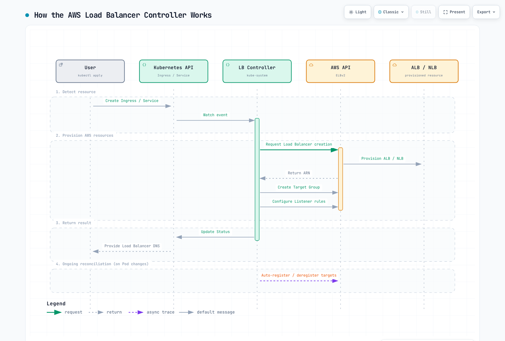

# AWS Load Balancer Controller

> **レビュー基準**: AWS Load Balancer Controller / Helmチャートv3.5.0
> **最終更新**: September 11, 2026

## 概要

AWS Load Balancer Controllerは、KubernetesクラスターのAWS Elastic Load Balancer（ELB）を管理するコントローラーです。KubernetesのIngressとServiceリソースを、AWS Application Load Balancer（ALB）およびNetwork Load Balancer（NLB）と自動的に統合します。

### 主な機能

- **Application Load Balancer（ALB）**: HTTP/HTTPSトラフィック、パスベースとホストベースのルーティング
- **Network Load Balancer（NLB）**: TCP/UDPトラフィック、高性能なL4負荷分散
- **TargetGroupBinding**: 既存ターゲットグループをKubernetes Serviceに接続
- **AWS WAF統合**: Webアプリケーションファイアウォールの適用
- **AWS Shield**: DDoS保護


[🔍 インタラクティブな図を見る](https://www.atomai.click/kubernetes-docs/archmaps/en-networking-03-aws-lb-controller-0.html)

## アーキテクチャ

### コントローラーの動作



[🔍 インタラクティブな図を見る](https://www.atomai.click/kubernetes-docs/archmaps/en-networking-03-aws-lb-controller-1.html)

### コンポーネント構成

RBAC、CRD、プローブ、Webhook証明書を含む、リリースされた完全なチャートをインストールしてください。コントローラーはKubernetesオブジェクトを監視してAWS APIを呼び出します。アプリケーショントラフィックはロードバランサーとそのターゲットを通り、コントローラーPodは通りません。リーダー選出では1つのレプリカが調整し、残りは待機容量とWebhook可用性を提供します。レプリカ数だけでは、ノードやアベイラビリティーゾーンにまたがる配置は保証されません。

## 前提条件

### 所有権と互換性

この章は**自己管理のオープンソースコントローラー**を設定します。EKS Auto Modeは独自のマネージド負荷分散を提供します。NLB Serviceは`eks.amazonaws.com/nlb`、ALB IngressClassは`eks.amazonaws.com/alb`を使い、TargetGroupBinding APIも`elbv2.k8s.aws/v1beta1`とは異なります。クラスを変更したり全アノテーションをそのままコピーしたりせず、Auto Mode移行ガイドを確認してください。両モデルが存在する場合、明示的なクラスで曖昧さを防ぎます。

現在サポートされるEKS Kubernetesリリースを使い、クラスターワイドのCRDを共有する全コントローラーを確認します。LBC **v3.5.0**は**2026-08-03**にリリースされ、検証済みチャート**3.5.0**がそのコントローラーを同梱します。Gateway API利用者はアップグレード前に**v1.6.0** CRDが必要で、LBC固有のGateway CRDは現在`gateway.k8s.aws/v1`を使用します。任意の最新Gateway APIやKubernetesリリースと互換性があるという意味ではありません。古い一般的な「Kubernetes 1.22+」というインストール下限は、現在のEKSサポートマトリックスではありません。

コントローラーのWebhookには、コントロールプレーンからTCP 9443への到達性が必要です。IMDSが制限される場合やFargate/Hybrid Nodes上で動作する場合は、リージョン/VPC値を明示し、そのコンピュートタイプでサポートされる認証情報の仕組みを選んでください。IPターゲットには、VPCでルーティング可能なPodアドレスと、サポートされるエンドポイント/ENI検出が必要です。Amazon VPC CNIはEKSで一般的ですが、可能なCNI設定はそれだけではありません。インスタンスターゲットにはNodePort対応Serviceと適切なノードネットワーキングが必要です。


### 1. IAMポリシーの作成

**v3.5.0**に同梱されたIAMポリシーと正しいAWSパーティションを使用します。広範な検出権限とセキュリティグループ権限、リソース/タグ条件、このデプロイで有効な機能を確認してください。レビュー済みポリシーを保存してから作成します。上流ポリシーを最小権限の保証と見なしたり、古いv2.8ポリシーを現行インストールにコピーしたりしないでください。コントローラーのAWS認証情報には、対応ノードで**IRSAまたはEKS Pod Identity**を使用でき、Kubernetes API RBACとは別です。

### 2. IRSAの設定

```bash
export AWS_REGION=us-east-1
export CLUSTER_NAME=my-cluster
export AWS_ACCOUNT_ID="$(aws sts get-caller-identity --query Account --output text)"
export VPC_ID="$(aws eks describe-cluster --name "$CLUSTER_NAME" \
  --query 'cluster.resourcesVpcConfig.vpcId' --output text)"
kubectl config current-context

aws eks describe-cluster --name "$CLUSTER_NAME" \
  --query cluster.identity.oidc.issuer --output text
# Only if this cluster's IAM OIDC provider does not already exist:
eksctl utils associate-iam-oidc-provider --cluster "$CLUSTER_NAME" \
  --region "$AWS_REGION" --approve

curl --fail --location --output iam-policy-upstream.json \
  https://raw.githubusercontent.com/kubernetes-sigs/aws-load-balancer-controller/v3.5.0/docs/install/iam_policy.json
export REVIEWED_POLICY_FILE=iam-policy-reviewed.json
test -s "$REVIEWED_POLICY_FILE"
export CONTROLLER_POLICY_ARN="$(aws iam create-policy \
  --policy-name AWSLoadBalancerControllerIAMPolicy \
  --policy-document "file://$REVIEWED_POLICY_FILE" --query Policy.Arn --output text)"
eksctl create iamserviceaccount --cluster "$CLUSTER_NAME" --region "$AWS_REGION" \
  --namespace kube-system --name aws-load-balancer-controller \
  --attach-policy-arn "$CONTROLLER_POLICY_ARN" --approve
```

レビュー済みの既存ポリシー/ロールは再作成せず再利用します。再利用するIRSAロールには、このクラスターのOIDCプロバイダーと対象サービスアカウントへの信頼ステートメントが必要です。既存サービスアカウントは変更前に所有権とアノテーションを確認します。Pod Identityには独自のエージェント/関連付けとロール信頼設定があります。静的アクセスキーをチャートのvaluesにコピーしないでください。

## インストール

### Helmによるインストール

```bash
helm repo add eks https://aws.github.io/eks-charts
helm repo update eks
helm pull eks/aws-load-balancer-controller --version 3.5.0

# Review cluster-wide CRD changes and other controllers before applying.
curl --fail --location --output gateway-api-v1.6.0.yaml \
  https://github.com/kubernetes-sigs/gateway-api/releases/download/v1.6.0/standard-install.yaml
kubectl apply --server-side -f gateway-api-v1.6.0.yaml
helm show crds ./aws-load-balancer-controller-3.5.0.tgz > lbc-crds.yaml
kubectl apply --server-side -f lbc-crds.yaml

# Save the values below as controller-values.yaml and replace its cluster/region/VPC.
helm install aws-load-balancer-controller ./aws-load-balancer-controller-3.5.0.tgz \
  -n kube-system -f controller-values.yaml --wait --timeout 5m
```

```yaml
# values.yaml example
clusterName: my-cluster
serviceAccount:
  create: false
  name: aws-load-balancer-controller

region: us-east-1
vpcId: vpc-0123456789abcdef0

# Resource settings
resources:
  requests:
    cpu: 100m
    memory: 128Mi
  limits:
    cpu: 200m
    memory: 256Mi

# Replica count
replicaCount: 2

# Pod Disruption Budget
podDisruptionBudget:
  minAvailable: 1

# Anti-Affinity for HA
affinity:
  podAntiAffinity:
    preferredDuringSchedulingIgnoredDuringExecution:
      - weight: 100
        podAffinityTerm:
          labelSelector:
            matchExpressions:
              - key: app.kubernetes.io/name
                operator: In
                values:
                  - aws-load-balancer-controller
          topologyKey: kubernetes.io/hostname

# Webhook certificates
enableCertManager: false

# Log level
logLevel: info

# IngressClass settings
ingressClass: alb
createIngressClassResource: true

# Additional settings
enableShield: false
enableWaf: false
enableWafv2: true
# Use explicit Service classes; do not claim unclassified LoadBalancer Services.
enableServiceMutatorWebhook: false
enableEndpointSlices: true
keepTLSSecret: true
clusterSecretsPermissions:
  allowAllSecrets: false
```

リソース値は例であり、測定された本番サイズではありません。既存リリースには、保存済みvaluesによるレビュー済みの`helm upgrade`が必要です。HelmはCRDを自動アップグレードしません。`enableServiceMutatorWebhook: false`により、この章のNLB Serviceは`service.k8s.aws/nlb`を明示的に選択します。通常、デフォルトのWebhookが変更するのは新規作成のLoadBalancer Serviceで、後からtypeを変更した既存Serviceではありません。`keepTLSSecret: true`は、利用可能ならHelm管理のWebhook Secretを再利用します。GitOps/ローテーション時にはCAバンドルとPod証明書を調整するか、別途インストールした互換性のあるcert-managerを使用します。アップグレードを強制するために共有CRDを削除しないでください。

### インストールの確認

```bash
# Check Deployment status
kubectl get deployment -n kube-system aws-load-balancer-controller

# Check Pod status
kubectl get pods -n kube-system -l app.kubernetes.io/name=aws-load-balancer-controller

# Check logs
kubectl logs -n kube-system -l app.kubernetes.io/name=aws-load-balancer-controller

# Check IngressClass
kubectl get ingressclass
```

## Application Load Balancer（ALB）

以下の各マニフェストは独立した例として扱ってください。アカウント/リソースID、ドメイン、サブネット、セキュリティグループ、証明書ARNを、正しいリージョンの確認済み値に置き換えます。参照する名前空間、Service、準備済みバックエンドワークロードを先に作成してください。サービスポート80とターゲットポート8080は役割が異なります。containerPortの宣言だけではアプリケーションは待ち受けず、/healthも実装されません。ヘルスエンドポイント、実際のターゲットポート、HTTP/TLSプロトコル、セキュリティグループ、NetworkPolicyは整合している必要があります。概要の図は**IPターゲット**を示します。インスタンスターゲットはノードを登録し、NodePortを使用します。TargetGroupBindingもこのコントローラーが調整し、シーケンス図は説明用であってアトミックなトランザクションではありません。

### 基本的なIngress設定

```yaml
apiVersion: networking.k8s.io/v1
kind: Ingress
metadata:
  name: my-ingress
  namespace: default
  annotations:
    # ALB scheme (internet-facing or internal)
    alb.ingress.kubernetes.io/scheme: internet-facing

    # Target Type (ip or instance)
    alb.ingress.kubernetes.io/target-type: ip

    # Listener ports
    alb.ingress.kubernetes.io/listen-ports: '[{"HTTP": 80}, {"HTTPS": 443}]'

    # SSL redirect
    alb.ingress.kubernetes.io/ssl-redirect: "443"

    # ACM certificate
    alb.ingress.kubernetes.io/certificate-arn: arn:aws:acm:us-east-1:ACCOUNT:certificate/CERT_ID

    # Subnet specification
    alb.ingress.kubernetes.io/subnets: subnet-xxx,subnet-yyy,subnet-zzz

    # Security groups
    alb.ingress.kubernetes.io/security-groups: sg-xxxxxxxxx
    alb.ingress.kubernetes.io/manage-backend-security-group-rules: "true"

    # Health check settings
    alb.ingress.kubernetes.io/healthcheck-path: /health
    alb.ingress.kubernetes.io/healthcheck-interval-seconds: "15"
    alb.ingress.kubernetes.io/healthcheck-timeout-seconds: "5"
    alb.ingress.kubernetes.io/healthy-threshold-count: "2"
    alb.ingress.kubernetes.io/unhealthy-threshold-count: "2"

spec:
  ingressClassName: alb
  rules:
    - host: api.example.com
      http:
        paths:
          - path: /
            pathType: Prefix
            backend:
              service:
                name: api-service
                port:
                  number: 80
```

### 高度なIngress設定

```yaml
apiVersion: networking.k8s.io/v1
kind: Ingress
metadata:
  name: advanced-ingress
  annotations:
    alb.ingress.kubernetes.io/scheme: internet-facing
    alb.ingress.kubernetes.io/target-type: ip

    # Group multiple Ingresses into single ALB
    alb.ingress.kubernetes.io/group.name: my-app-group
    alb.ingress.kubernetes.io/group.order: "10"

    # Target group attributes
    alb.ingress.kubernetes.io/target-group-attributes: >-
      stickiness.enabled=true,
      stickiness.lb_cookie.duration_seconds=60,
      slow_start.duration_seconds=30,
      deregistration_delay.timeout_seconds=30

    # IP address type
    alb.ingress.kubernetes.io/ip-address-type: dualstack

    # Load balancer attributes
    alb.ingress.kubernetes.io/load-balancer-attributes: >-
      idle_timeout.timeout_seconds=60,
      routing.http2.enabled=true,
      routing.http.drop_invalid_header_fields.enabled=true,
      access_logs.s3.enabled=true,
      access_logs.s3.bucket=my-alb-logs,
      access_logs.s3.prefix=my-app

    # Tags
    alb.ingress.kubernetes.io/tags: Environment=production,Team=platform

    # WAF v2 integration
    alb.ingress.kubernetes.io/wafv2-acl-arn: arn:aws:wafv2:us-east-1:ACCOUNT:regional/webacl/my-acl/xxx

    # Shield Advanced
    alb.ingress.kubernetes.io/shield-advanced-protection: "true"

spec:
  ingressClassName: alb
  tls:
    - hosts:
        - api.example.com
        - www.example.com
  rules:
    - host: api.example.com
      http:
        paths:
          - path: /v1
            pathType: Prefix
            backend:
              service:
                name: api-v1
                port:
                  number: 80
          - path: /v2
            pathType: Prefix
            backend:
              service:
                name: api-v2
                port:
                  number: 80
    - host: www.example.com
      http:
        paths:
          - path: /
            pathType: Prefix
            backend:
              service:
                name: web-frontend
                port:
                  number: 80
```

### パスベースのルーティング

```yaml
apiVersion: networking.k8s.io/v1
kind: Ingress
metadata:
  name: path-based-routing
  annotations:
    alb.ingress.kubernetes.io/scheme: internet-facing
    alb.ingress.kubernetes.io/target-type: ip

    # Condition-based routing
    alb.ingress.kubernetes.io/conditions.api-v2: >-
      [{"field":"http-header","httpHeaderConfig":{"httpHeaderName":"X-Api-Version","values":["v2"]}}]

spec:
  ingressClassName: alb
  rules:
    - host: api.example.com
      http:
        paths:
          # Exact path matching
          - path: /health
            pathType: Exact
            backend:
              service:
                name: health-service
                port:
                  number: 80

          # API version routing
          - path: /api
            pathType: Prefix
            backend:
              service:
                name: api-v2
                port:
                  number: 80
          - path: /api
            pathType: Prefix
            backend:
              service:
                name: api-v1
                port:
                  number: 80

          # Static files
          - path: /static
            pathType: Prefix
            backend:
              service:
                name: static-service
                port:
                  number: 80

          # Default path
          - path: /
            pathType: Prefix
            backend:
              service:
                name: default-service
                port:
                  number: 80
```

### 認証設定

これらの例には既存HTTPS証明書とIDプロバイダーのアプリケーションが必要です。コールバック`https://app.example.com/oauth2/idpresponse`、認可コードフロー、許可スコープ、必要なクライアントシークレットを設定します。ALBはプロバイダーのトークン/ユーザー情報エンドポイントへIPv4で到達する必要があります。内部ALBには適切な送信/NAT経路が必要な場合があります。認証はHTTPSリスナーでのみ行われます。未認証リクエストへの`allow`はバックエンドを保護しません。バックエンドへの直接アクセスを制限し、アプリケーションの要件に応じてALB署名付きユーザークレームを検証してください。

```yaml
apiVersion: networking.k8s.io/v1
kind: Ingress
metadata:
  name: auth-ingress
  annotations:
    alb.ingress.kubernetes.io/scheme: internet-facing
    alb.ingress.kubernetes.io/target-type: ip
    alb.ingress.kubernetes.io/listen-ports: '[{"HTTPS": 443}]'
    alb.ingress.kubernetes.io/certificate-arn: arn:aws:acm:us-east-1:123456789012:certificate/12345678-1234-1234-1234-123456789012

    # Cognito authentication
    alb.ingress.kubernetes.io/auth-type: cognito
    alb.ingress.kubernetes.io/auth-idp-cognito: >-
      {"userPoolARN":"arn:aws:cognito-idp:us-east-1:ACCOUNT:userpool/us-east-1_xxxxx",
       "userPoolClientID":"xxxxxxxxx",
       "userPoolDomain":"my-domain"}
    alb.ingress.kubernetes.io/auth-on-unauthenticated-request: authenticate
    alb.ingress.kubernetes.io/auth-scope: "openid profile email"
    alb.ingress.kubernetes.io/auth-session-cookie: "AWSELBAuthSessionCookie"
    alb.ingress.kubernetes.io/auth-session-timeout: "3600"

spec:
  ingressClassName: alb
  rules:
    - host: app.example.com
      http:
        paths:
          - path: /
            pathType: Prefix
            backend:
              service:
                name: protected-app
                port:
                  number: 80
```

```yaml
# OIDC Authentication Example
apiVersion: networking.k8s.io/v1
kind: Ingress
metadata:
  name: oidc-ingress
  annotations:
    alb.ingress.kubernetes.io/scheme: internet-facing
    alb.ingress.kubernetes.io/target-type: ip
    alb.ingress.kubernetes.io/listen-ports: '[{"HTTPS": 443}]'
    alb.ingress.kubernetes.io/certificate-arn: arn:aws:acm:us-east-1:123456789012:certificate/12345678-1234-1234-1234-123456789012

    # OIDC authentication
    alb.ingress.kubernetes.io/auth-type: oidc
    alb.ingress.kubernetes.io/auth-idp-oidc: >-
      {"issuer":"https://accounts.google.com",
       "authorizationEndpoint":"https://accounts.google.com/o/oauth2/v2/auth",
       "tokenEndpoint":"https://oauth2.googleapis.com/token",
       "userInfoEndpoint":"https://openidconnect.googleapis.com/v1/userinfo",
       "secretName":"oidc-secret"}
    alb.ingress.kubernetes.io/auth-on-unauthenticated-request: authenticate

spec:
  ingressClassName: alb
  rules:
    - host: app.example.com
      http:
        paths:
          - path: /
            pathType: Prefix
            backend:
              service:
                name: protected-app
                port:
                  number: 80
---
# OIDC Secret
apiVersion: v1
kind: Secret
metadata:
  name: oidc-secret
type: Opaque
stringData:
  clientID: your-client-id
  clientSecret: your-client-secret
```

OIDC SecretはIngressの名前空間に置く必要があります。チャートのデフォルトは`clusterSecretsPermissions.allowAllSecrets: false`です。このコントローラーには必要なSecretアクセスだけを付与します。v3.5.0は`metadata.name`フィールドセレクターでSecretを監視するため、Roleで`resourceNames`を制限できます。実際のSecretは承認されたシークレット管理手順で作成し、本物のクライアントシークレットをコミットしないでください。

```yaml
apiVersion: rbac.authorization.k8s.io/v1
kind: Role
metadata:
  name: lbc-oidc-secret
  namespace: default
rules:
- apiGroups:
  - ''
  resources:
  - secrets
  resourceNames:
  - oidc-secret
  verbs:
  - get
  - list
  - watch
---
apiVersion: rbac.authorization.k8s.io/v1
kind: RoleBinding
metadata:
  name: lbc-oidc-secret
  namespace: default
subjects:
- kind: ServiceAccount
  name: aws-load-balancer-controller
  namespace: kube-system
roleRef:
  apiGroup: rbac.authorization.k8s.io
  kind: Role
  name: lbc-oidc-secret
```

## Network Load Balancer（NLB）

### 基本的なNLB Service設定

```yaml
apiVersion: v1
kind: Service
metadata:
  name: nlb-service
  annotations:
    # Specify NLB type
    service.beta.kubernetes.io/aws-load-balancer-nlb-target-type: "ip"

    # Scheme
    service.beta.kubernetes.io/aws-load-balancer-scheme: "internet-facing"

    # Subnet specification
    service.beta.kubernetes.io/aws-load-balancer-subnets: subnet-xxx,subnet-yyy

    # Health check
    service.beta.kubernetes.io/aws-load-balancer-healthcheck-protocol: "HTTP"
    service.beta.kubernetes.io/aws-load-balancer-healthcheck-path: "/health"
    service.beta.kubernetes.io/aws-load-balancer-healthcheck-port: "8080"
    service.beta.kubernetes.io/aws-load-balancer-healthcheck-interval: "10"
    service.beta.kubernetes.io/aws-load-balancer-healthcheck-healthy-threshold: "2"
    service.beta.kubernetes.io/aws-load-balancer-healthcheck-unhealthy-threshold: "2"

spec:
  type: LoadBalancer
  loadBalancerClass: service.k8s.aws/nlb
  selector:
    app: my-app
  ports:
    - name: tcp
      port: 80
      targetPort: 8080
      protocol: TCP
```

### 重み付きターゲットグループ

以下のServiceは、自身の暗黙のターゲットグループに重み90、既存の`service-canary:8080`バックエンドに重み10を与えます。両Serviceには意図した準備済みエンドポイントと互換性のあるターゲット設定が必要です。このアノテーションはカナリアワークロードを作成しません。アノテーションのサフィックスはリスナーのプロトコルとポート、 **`actions.TCP-80`** です。

重みは**0から999**の相対値で、新しい接続に適用されます。通常の重み変更では既存接続が維持されますが、**ターゲットグループの重みを0にすると、新規接続を止めるとともに、短時間後に既存接続も閉じます**。無停止が保証されるドレインとは説明しないでください。TLSリスナーには互換性のあるターゲットグループプロトコルが必要で、ターゲットグループのスティッキネスはサポートされません。

```yaml
apiVersion: v1
kind: Service
metadata:
  name: nlb-weighted
  namespace: default
  annotations:
    service.beta.kubernetes.io/aws-load-balancer-nlb-target-type: ip
    service.beta.kubernetes.io/aws-load-balancer-scheme: internal
    service.beta.kubernetes.io/actions.TCP-80: '{"type":"forward","forwardConfig":{"baseServiceWeight":90,"targetGroups":[{"serviceName":"service-canary","servicePort":8080,"weight":10}]}}'
spec:
  type: LoadBalancer
  loadBalancerClass: service.k8s.aws/nlb
  selector:
    app: my-app
    version: stable
  ports:
  - name: tcp
    port: 80
    targetPort: 8080
    protocol: TCP
```

### TLS終端NLB

```yaml
apiVersion: v1
kind: Service
metadata:
  name: nlb-tls-service
  annotations:
    service.beta.kubernetes.io/aws-load-balancer-nlb-target-type: "ip"
    service.beta.kubernetes.io/aws-load-balancer-scheme: "internet-facing"

    # TLS configuration
    service.beta.kubernetes.io/aws-load-balancer-ssl-cert: "arn:aws:acm:us-east-1:ACCOUNT:certificate/CERT_ID"
    service.beta.kubernetes.io/aws-load-balancer-ssl-ports: "443"
    service.beta.kubernetes.io/aws-load-balancer-ssl-negotiation-policy: "ELBSecurityPolicy-TLS13-1-2-2021-06"

    # Backend is HTTP
    service.beta.kubernetes.io/aws-load-balancer-backend-protocol: "tcp"

spec:
  type: LoadBalancer
  loadBalancerClass: service.k8s.aws/nlb
  selector:
    app: my-app
  ports:
    - name: https
      port: 443
      targetPort: 8080
      protocol: TCP
```

### 内部NLB

```yaml
apiVersion: v1
kind: Service
metadata:
  name: internal-nlb
  annotations:
    service.beta.kubernetes.io/aws-load-balancer-nlb-target-type: "ip"

    # Internal scheme
    service.beta.kubernetes.io/aws-load-balancer-scheme: "internal"

    # Cross-zone load balancing
    service.beta.kubernetes.io/aws-load-balancer-attributes: "load_balancing.cross_zone.enabled=true"

    # Private subnets
    service.beta.kubernetes.io/aws-load-balancer-subnets: subnet-private-a,subnet-private-b

    # Security groups (optional)
    service.beta.kubernetes.io/aws-load-balancer-security-groups: sg-xxxxxxxxx
    service.beta.kubernetes.io/aws-load-balancer-manage-backend-security-group-rules: "true"

spec:
  type: LoadBalancer
  loadBalancerClass: service.k8s.aws/nlb
  selector:
    app: internal-service
  ports:
    - port: 80
      targetPort: 8080
```

### UDP対応NLB

```yaml
apiVersion: v1
kind: Service
metadata:
  name: udp-nlb
  annotations:
    service.beta.kubernetes.io/aws-load-balancer-enable-tcp-udp-listener: "true"
    service.beta.kubernetes.io/aws-load-balancer-nlb-target-type: "ip"
    service.beta.kubernetes.io/aws-load-balancer-scheme: "internet-facing"

spec:
  type: LoadBalancer
  loadBalancerClass: service.k8s.aws/nlb
  selector:
    app: dns-server
  ports:
    - name: dns-udp
      port: 53
      targetPort: 53
      protocol: UDP
    - name: dns-tcp
      port: 53
      targetPort: 53
      protocol: TCP
```

### Proxy Protocol v2

Proxy Protocol v2は元のクライアントアドレスをバイナリの接続メタデータとして伝えます。IPパケットの送信元アドレスを保持するものでは**ありません**。違いを明確にするため、この例はパケットレベルのクライアントIP保持を無効にします。バックエンドは、該当するヘルスチェック接続も含め、アプリケーションデータの前にProxy Protocolを解析する必要があります。通常のHTTP/TLSサーバーは、設定なしではそのプレフィックスを処理できません。

`preserve_client_ip.enabled`は、ターゲットタイプ/プロトコル/ネットワーク経路でサポートされる場合にNLBのパケット送信元保持を制御します。インスタンス/NodePortターゲットでは、`externalTrafficPolicy: Local`で後続のkube-proxy SNATホップを避けられますが、NLBの保持を常に代替するものではありません。IPファミリー変換と未対応の中継/ヘアピン経路は別途検討が必要です。

```yaml
apiVersion: v1
kind: Service
metadata:
  name: proxy-protocol-nlb
  annotations:
    service.beta.kubernetes.io/aws-load-balancer-nlb-target-type: "ip"
    service.beta.kubernetes.io/aws-load-balancer-scheme: "internet-facing"

    # Enable Proxy Protocol v2

    # Target Group attributes
    service.beta.kubernetes.io/aws-load-balancer-target-group-attributes: >-
      proxy_protocol_v2.enabled=true,
      preserve_client_ip.enabled=false

spec:
  type: LoadBalancer
  loadBalancerClass: service.k8s.aws/nlb
  selector:
    app: proxy-aware-app
  ports:
    - port: 80
      targetPort: 8080
```

## IngressClassとIngressClassParams

このオプションのクラスは、チャート所有の`alb`クラスを上書きしないよう`alb-platform`という名前です。対象名前空間に`alb-enabled=true`ラベルを付け、Ingressの`spec.ingressClassName: alb-platform`を設定します。意図した方針でない限り、クラスターのデフォルトにしないでください。IngressClassParamsの設定は、対応するアノテーションより優先されます。

### IngressClassの定義

```yaml
apiVersion: networking.k8s.io/v1
kind: IngressClass
metadata:
  name: alb-platform
spec:
  controller: ingress.k8s.aws/alb
  parameters:
    apiGroup: elbv2.k8s.aws
    kind: IngressClassParams
    name: alb-params
```

### IngressClassParamsの設定

```yaml
apiVersion: elbv2.k8s.aws/v1beta1
kind: IngressClassParams
metadata:
  name: alb-params
spec:
  # Default scheme
  scheme: internet-facing

  # IP address type
  ipAddressType: dualstack

  # Namespace selector (allow only specific namespaces)
  namespaceSelector:
    matchLabels:
      alb-enabled: "true"

  # Default tags
  tags:
    - key: Environment
      value: production
    - key: ManagedBy
      value: aws-load-balancer-controller

  # Load balancer attributes
  loadBalancerAttributes:
    - key: idle_timeout.timeout_seconds
      value: "60"
    - key: routing.http2.enabled
      value: "true"

  # Subnet selection
  # subnets:
  #   ids:
  #     - subnet-xxx
  #     - subnet-yyy
  #   tags:
  #     kubernetes.io/role/elb: ["1"]

  # Group settings
  group:
    name: my-default-group
```

## TargetGroupBinding {#targetgroupbinding}

TargetGroupBinding CRDを使用すると、既存AWSターゲットグループをKubernetes Serviceへ直接接続できます。

### 基本的なTargetGroupBinding

```yaml
apiVersion: elbv2.k8s.aws/v1beta1
kind: TargetGroupBinding
metadata:
  name: my-tgb
  namespace: default
spec:
  # Existing Target Group ARN
  targetGroupARN: arn:aws:elasticloadbalancing:us-east-1:ACCOUNT:targetgroup/my-tg/xxxxxxxxxxxx

  # Service to connect
  serviceRef:
    name: my-service
    port: 80

  # Target Type (ip or instance)
  targetType: ip

  # Networking settings
  networking:
    ingress:
      - from:
          - securityGroup:
              groupID: sg-xxxxxxxxx
        ports:
          - port: 80
            protocol: TCP
```

TGBは登録を管理し、既存ロードバランサー/リスナーのライフサイクルは管理しません。サービスポート、ターゲットグループのプロトコル/IPファミリー、バックエンドのターゲットポート、セキュリティグループルールを整合させます。`nodeSelector`は**インスタンス**ターゲットだけを絞り込み、IPモードのPodは選択しません。コントローラーのIAM権限でアカウント内の他ターゲットグループを参照できる場合があるため、TGBの作成/更新は信頼できる運用者に制限してください。

複数クラスターやTGBが1つのターゲットグループを共有する場合、**参加するすべてのTGBで作成時から**`spec.multiClusterTargetGroup: true`を設定します。デフォルトの`false`は完全な所有権を前提とし、他クラスターのターゲットを登録解除する可能性があります。作成後に安易に切り替えないでください。文書化された変更ではターゲットが残存する場合があります。クラスターごとにターゲットグループを分ける方法も別の所有権モデルです。

### 高度なTargetGroupBinding

```yaml
apiVersion: elbv2.k8s.aws/v1beta1
kind: TargetGroupBinding
metadata:
  name: advanced-tgb
  namespace: production
spec:
  targetGroupARN: arn:aws:elasticloadbalancing:us-east-1:ACCOUNT:targetgroup/prod-tg/xxxxxxxxxxxx

  serviceRef:
    name: production-service
    port: 8080

  targetType: ip

  # IP address type
  ipAddressType: ipv4

  # VPC ID (auto-detected, can be explicit)
  # vpcID: vpc-xxxxxxxxx

  # Networking settings
  networking:
    ingress:
      # Allow traffic from multiple security groups
      - from:
          - securityGroup:
              groupID: sg-alb-sg
          - securityGroup:
              groupID: sg-internal-sg
        ports:
          - port: 8080
            protocol: TCP
          - port: 8443
            protocol: TCP

  # Node selector applies to instance targets, not IP-mode pod selection
  # nodeSelector:
  #   matchLabels:
  #     node-type: compute
```

### 複数ポートのTargetGroupBinding

```yaml
# Separate TargetGroupBindings for multiple ports
---
apiVersion: elbv2.k8s.aws/v1beta1
kind: TargetGroupBinding
metadata:
  name: http-tgb
spec:
  targetGroupARN: arn:aws:elasticloadbalancing:...:targetgroup/http-tg/xxx
  serviceRef:
    name: multi-port-service
    port: 80
  targetType: ip
---
apiVersion: elbv2.k8s.aws/v1beta1
kind: TargetGroupBinding
metadata:
  name: https-tgb
spec:
  targetGroupARN: arn:aws:elasticloadbalancing:...:targetgroup/https-tg/yyy
  serviceRef:
    name: multi-port-service
    port: 443
  targetType: ip
```

## WAFとShieldの統合

ALBのリージョンにある既存のリージョナルWeb ACLを使い、意図したルールを設定します。インストール値はWAF v2を有効、Shield統合を無効にします。Shield Advancedの例を使うには、先に必要なサブスクリプション/権限を用意し、コントローラーのShield統合を有効にしてください。アノテーションだけでは有料サブスクリプションは有効にならず、無効なコントローラー機能を上書きすることもありません。これらのALB統合は、WAFが任意のNLB TCP/UDPトラフィックを検査することを意味しません。S3アクセスログの例にも、既存の送信先バケットと文書化されたALBログ配信バケットポリシーが必要です。

### AWS WAF v2の統合

```yaml
apiVersion: networking.k8s.io/v1
kind: Ingress
metadata:
  name: waf-protected-ingress
  annotations:
    alb.ingress.kubernetes.io/scheme: internet-facing
    alb.ingress.kubernetes.io/target-type: ip

    # Connect WAF v2 WebACL
    alb.ingress.kubernetes.io/wafv2-acl-arn: arn:aws:wafv2:us-east-1:ACCOUNT:regional/webacl/my-webacl/xxxxxxxx-xxxx-xxxx-xxxx-xxxxxxxxxxxx

spec:
  ingressClassName: alb
  rules:
    - host: api.example.com
      http:
        paths:
          - path: /
            pathType: Prefix
            backend:
              service:
                name: api-service
                port:
                  number: 80
```

### AWS Shield Advanced

```yaml
apiVersion: networking.k8s.io/v1
kind: Ingress
metadata:
  name: shield-protected-ingress
  annotations:
    alb.ingress.kubernetes.io/scheme: internet-facing
    alb.ingress.kubernetes.io/target-type: ip

    # Enable Shield Advanced protection
    alb.ingress.kubernetes.io/shield-advanced-protection: "true"

spec:
  ingressClassName: alb
  rules:
    - host: critical-app.example.com
      http:
        paths:
          - path: /
            pathType: Prefix
            backend:
              service:
                name: critical-service
                port:
                  number: 80
```

## 主なバージョン更新

- **v2.16.0 — 2025-11-20:** ALB Target OptimizerとNLB重み付きターゲットグループ。Target Optimizerにはターゲット制御エージェントと設定が必要で、LBCをインストールするだけでは有効になりません。
- **v2.17.0 — 2025-12-19:** リスナー、エンドポイントグループ、エンドポイントをネストする単一の`aga.k8s.aws/v1beta1` `GlobalAccelerator` CRDによるGlobal Acceleratorサポート。Gateway APIはGAリリース候補の状態。Global Acceleratorには追加IAM権限と機能設定が必要です。
- **v3.5.0 — 2026-08-03:** Gateway API v1.6.0準拠と安定版v1 TCPRoute/UDPRouteサポート。LBC Gateway設定リソースは`gateway.k8s.aws/v1`を使用し、引き続き提供されるv1beta1は非推奨です。

現在のv3.5はQUIC/TCP_QUIC設定とALB JWT検証をサポートします。これらは別々の機能で、プロトコル固有の制約があります。JWT検証はHTTPS専用で、JSONは`jwksUri`ではなく **`jwksEndpoint`** を使用します。有効な証明書、到達可能な信頼できるJWKSエンドポイント、レビュー済みの発行者/クレームを備えたHTTPS Ingressのアノテーションに、以下を追加します。

```yaml
alb.ingress.kubernetes.io/jwt-validation: >-
  {"issuer":"https://accounts.example.com","jwksEndpoint":"https://accounts.example.com/.well-known/jwks.json"}
```

これはアノテーションの断片であり、完全なKubernetesオブジェクトではありません。署名検証だけで認可が十分と想定せず、アプリケーションに必要なaudience/他のクレームを検証します。別のGateway設定については[Gateway APIガイド](./04-gateway-api.md)を参照してください。

## アノテーションリファレンス

### ALB Ingressアノテーション

| アノテーション | 説明 | デフォルト |
|------------|-------------|---------|
| `alb.ingress.kubernetes.io/scheme` | internet-facingまたはinternal | internal |
| `alb.ingress.kubernetes.io/target-type` | ipまたはinstance | instance |
| `alb.ingress.kubernetes.io/subnets` | サブネットIDまたは名前 | 自動検出 |
| `alb.ingress.kubernetes.io/security-groups` | セキュリティグループID | 自動作成 |
| `alb.ingress.kubernetes.io/listen-ports` | リスナーポートのJSON | HTTP 80、certificate-arn指定時はHTTPS 443 |
| `alb.ingress.kubernetes.io/certificate-arn` | ACM証明書ARN | - |
| `alb.ingress.kubernetes.io/ssl-redirect` | SSLリダイレクトポート | - |
| `alb.ingress.kubernetes.io/ssl-policy` | SSLポリシー | ELBSecurityPolicy-2016-08 |
| `alb.ingress.kubernetes.io/healthcheck-path` | ヘルスチェックパス | / |
| `alb.ingress.kubernetes.io/healthcheck-port` | ヘルスチェックポート | traffic-port |
| `alb.ingress.kubernetes.io/healthcheck-protocol` | ヘルスチェックプロトコル | HTTP |
| `alb.ingress.kubernetes.io/healthcheck-interval-seconds` | ヘルスチェック間隔 | 15 |
| `alb.ingress.kubernetes.io/healthcheck-timeout-seconds` | ヘルスチェックタイムアウト | 5 |
| `alb.ingress.kubernetes.io/healthy-threshold-count` | 正常と判断するしきい値 | 2 |
| `alb.ingress.kubernetes.io/unhealthy-threshold-count` | 異常と判断するしきい値 | 2 |
| `alb.ingress.kubernetes.io/group.name` | Ingressグループ名 | - |
| `alb.ingress.kubernetes.io/group.order` | グループ内の優先順位 | 0 |
| `alb.ingress.kubernetes.io/ip-address-type` | ipv4またはdualstack | ipv4 |
| `alb.ingress.kubernetes.io/load-balancer-attributes` | LB属性 | - |
| `alb.ingress.kubernetes.io/target-group-attributes` | TG属性 | - |
| `alb.ingress.kubernetes.io/tags` | リソースタグ | - |
| `alb.ingress.kubernetes.io/wafv2-acl-arn` | WAF v2 WebACL ARN | - |
| `alb.ingress.kubernetes.io/shield-advanced-protection` | Shield保護 | false |
| `alb.ingress.kubernetes.io/auth-type` | 認証タイプ（none、cognito、oidc） | none |

### NLB Serviceアノテーション

| アノテーション | 説明 | デフォルト |
|------------|-------------|---------|
| `service.beta.kubernetes.io/aws-load-balancer-type` | external（NLB）またはnlb | - |
| `service.beta.kubernetes.io/aws-load-balancer-nlb-target-type` | ipまたはinstance | instance |
| `service.beta.kubernetes.io/aws-load-balancer-scheme` | internet-facingまたはinternal | internal |
| `service.beta.kubernetes.io/aws-load-balancer-subnets` | サブネットID | 自動検出 |
| `service.beta.kubernetes.io/aws-load-balancer-ssl-cert` | ACM証明書ARN | - |
| `service.beta.kubernetes.io/aws-load-balancer-ssl-ports` | SSLを有効にしたポート | - |
| `service.beta.kubernetes.io/aws-load-balancer-ssl-negotiation-policy` | SSLポリシー | - |
| `service.beta.kubernetes.io/aws-load-balancer-backend-protocol` | バックエンドプロトコル | - |
| `service.beta.kubernetes.io/aws-load-balancer-proxy-protocol` | Proxy Protocol | - |
| `service.beta.kubernetes.io/aws-load-balancer-cross-zone-load-balancing-enabled` | 非推奨。aws-load-balancer-attributesを使用 | false |
| `service.beta.kubernetes.io/aws-load-balancer-healthcheck-protocol` | ヘルスチェックプロトコル | TCP |
| `service.beta.kubernetes.io/aws-load-balancer-healthcheck-path` | ヘルスチェックパス | - |
| `service.beta.kubernetes.io/aws-load-balancer-healthcheck-port` | ヘルスチェックポート | - |
| `service.beta.kubernetes.io/aws-load-balancer-attributes` | LB属性 | - |
| `service.beta.kubernetes.io/aws-load-balancer-target-group-attributes` | TG属性 | - |
| `service.beta.kubernetes.io/aws-load-balancer-security-groups` | セキュリティグループ | 自動作成 |

## EKSのベストプラクティス

### 1. サブネットのタグ付け

ロールタグは、意図したパブリック/プライベートサブネットを明確に選ぶ方法です。自己管理LBC v2.12.1+では、一致するロールタグ付きサブネットがない場合、デフォルトの`SubnetDiscoveryByReachability`動作でルートテーブルから分類できます。明示的なサブネットIDやIngressClassParamsのタグフィルターも利用できます。EKS Auto Modeでは引き続き文書化されたサブネットタグが必要です。クラスタータグのフィルタリング、使用可能IP、選択したAZごとに適格なサブネットが1つあることを確認してください。通常のALBには最低2つのAZが必要です。サブネットにタグを付けても、ルートテーブルは変わらず、パブリックにもなりません。

```bash
# Public subnets (for internet-facing ALB/NLB)
aws ec2 create-tags \
  --resources subnet-xxx \
  --tags Key=kubernetes.io/role/elb,Value=1

# Private subnets (for internal ALB/NLB)
aws ec2 create-tags \
  --resources subnet-yyy \
  --tags Key=kubernetes.io/role/internal-elb,Value=1

# Cluster-specific tag (optional)
aws ec2 create-tags \
  --resources subnet-xxx subnet-yyy \
  --tags Key=kubernetes.io/cluster/my-cluster,Value=shared
```

### 2. セキュリティグループ管理

```yaml
apiVersion: networking.k8s.io/v1
kind: Ingress
metadata:
  name: secure-ingress
  annotations:
    alb.ingress.kubernetes.io/scheme: internet-facing
    alb.ingress.kubernetes.io/target-type: ip

    # Explicit security group specification
    alb.ingress.kubernetes.io/security-groups: sg-alb-external

    # Configure approved inbound sources on this explicit security group.
    # inbound-cidrs is ignored when security-groups is specified.

    # Additional security groups (for backend communication)
    alb.ingress.kubernetes.io/manage-backend-security-group-rules: "true"

spec:
  ingressClassName: alb
  rules:
    - host: api.example.com
      http:
        paths:
          - path: /
            pathType: Prefix
            backend:
              service:
                name: api-service
                port:
                  number: 80
```

### 3. コスト最適化

IngressGroupはALBとそのルール空間を共有します。信頼境界内でのみ使用してください。グループに参加するIngressを作成できるユーザーは、ルーティングや優先順位に影響を与えられます。RBAC/アドミッションを適用し、マージ/排他的アノテーション設定を確認します。グループへの所属は名前空間分離機能でも、無条件のコスト保証でもありません。

```yaml
# Share ALB using Ingress groups
apiVersion: networking.k8s.io/v1
kind: Ingress
metadata:
  name: app1-ingress
  annotations:
    alb.ingress.kubernetes.io/group.name: shared-alb
    alb.ingress.kubernetes.io/group.order: "1"
spec:
  ingressClassName: alb
  rules:
    - host: app1.example.com
      http:
        paths:
          - path: /
            pathType: Prefix
            backend:
              service:
                name: app1
                port:
                  number: 80
---
apiVersion: networking.k8s.io/v1
kind: Ingress
metadata:
  name: app2-ingress
  annotations:
    alb.ingress.kubernetes.io/group.name: shared-alb
    alb.ingress.kubernetes.io/group.order: "2"
spec:
  ingressClassName: alb
  rules:
    - host: app2.example.com
      http:
        paths:
          - path: /
            pathType: Prefix
            backend:
              service:
                name: app2
                port:
                  number: 80
```

### 4. 高可用性設定

```yaml
apiVersion: networking.k8s.io/v1
kind: Ingress
metadata:
  name: ha-ingress
  annotations:
    alb.ingress.kubernetes.io/scheme: internet-facing
    alb.ingress.kubernetes.io/target-type: ip

    # Specify subnets in 3+ AZs
    alb.ingress.kubernetes.io/subnets: subnet-az-a,subnet-az-b,subnet-az-c

    # ALB cross-zone is enabled at the load-balancer level.
    # Review target-group overrides separately.

    # Health check optimization
    alb.ingress.kubernetes.io/healthcheck-interval-seconds: "10"
    alb.ingress.kubernetes.io/healthy-threshold-count: "2"
    alb.ingress.kubernetes.io/unhealthy-threshold-count: "2"

    # Draining timeout
    alb.ingress.kubernetes.io/target-group-attributes: deregistration_delay.timeout_seconds=30

spec:
  ingressClassName: alb
  rules:
    - host: api.example.com
      http:
        paths:
          - path: /
            pathType: Prefix
            backend:
              service:
                name: api-service
                port:
                  number: 80
```

## トラブルシューティング

以下の名前付き変数は、実際の名前空間とリソース一覧から設定します。インフラを変更する前にコントローラーのイベント/エラー理由を確認してください。オプションのexecヘルスチェックは、アプリケーションイメージにcurlがあることを前提とします。なければ承認済みの診断コンテナを使用します。証拠収集時はログと認証情報を保護してください。502は接続リセット、不正な応答、TLSが原因の場合があります。異常なターゲットがすべて同じHTTPステータスを返すと想定せず、ALBアクセスログのエラー詳細を確認します。

### よくある問題

#### 1. ALBが作成されない

```bash
# Check controller logs
kubectl logs -n kube-system -l app.kubernetes.io/name=aws-load-balancer-controller

# Check Ingress events
kubectl describe ingress "$INGRESS_NAME" -n "$NAMESPACE"

# Common causes:
# - Insufficient IAM permissions
# - Missing subnet tags
# - IngressClass not specified
```

#### 2. ターゲットが異常

```bash
# Check Target Group status
aws elbv2 describe-target-health \
  --target-group-arn "$TARGET_GROUP_ARN"

# Check Pod logs
kubectl logs "$POD_NAME" -n "$NAMESPACE" --tail=100

# Test health check endpoint
kubectl exec "$POD_NAME" -n "$NAMESPACE" -- curl --fail --max-time 5 http://localhost:8080/health

# Check security groups
aws ec2 describe-security-groups --group-ids "$SECURITY_GROUP_ID"
```

#### 3. 502 Bad Gateway

```bash
# Root cause analysis:
# 1. Pod not ready
kubectl get pods -l app=my-app

# 2. Target Group draining
aws elbv2 describe-target-health --target-group-arn "$TARGET_GROUP_ARN"

# 3. Health check failure
# - Verify health check path
# - Adjust health check timeout

# 4. Security group rules
# - Verify ALB -> Pod communication allowed
```

#### 4. SSL証明書の問題

```bash
# Check ACM certificate status
aws acm describe-certificate --certificate-arn "$ACM_CERTIFICATE_ARN"

# Verify certificate is ISSUED status
# Check domain validation completed

# Verify region (must be same region as ALB)
```

### デバッグコマンド

```bash
# Controller detailed logs
kubectl logs -n kube-system deployment/aws-load-balancer-controller -f

# Ingress status check
kubectl get ingress -o wide
kubectl describe ingress "$INGRESS_NAME" -n "$NAMESPACE"

# Service status check
kubectl get svc -o wide
kubectl describe svc "$SERVICE_NAME" -n "$NAMESPACE"

# TargetGroupBinding status check
kubectl get targetgroupbindings -A
kubectl describe targetgroupbinding "$TGB_NAME" -n "$NAMESPACE"

# AWS resource check
aws elbv2 describe-load-balancers --query 'LoadBalancers[?contains(LoadBalancerName, `k8s`)]'
aws elbv2 describe-target-groups --query 'TargetGroups[?contains(TargetGroupName, `k8s`)]'
```

---

## 参考資料

- [AWS Load Balancer Controllerドキュメント](https://kubernetes-sigs.github.io/aws-load-balancer-controller/)
- [GitHubリポジトリ](https://github.com/kubernetes-sigs/aws-load-balancer-controller)
- [EKSユーザーガイド](https://docs.aws.amazon.com/eks/latest/userguide/aws-load-balancer-controller.html)
- [ALBドキュメント](https://docs.aws.amazon.com/elasticloadbalancing/latest/application/)
- [NLBドキュメント](https://docs.aws.amazon.com/elasticloadbalancing/latest/network/)

- [LBC v3.5.0のリリース](https://github.com/kubernetes-sigs/aws-load-balancer-controller/releases/tag/v3.5.0)
- [LBC v3.5.0のIngressアノテーション](https://github.com/kubernetes-sigs/aws-load-balancer-controller/blob/v3.5.0/docs/guide/ingress/annotations.md)
- [LBC v3.5.0のServiceアノテーション](https://github.com/kubernetes-sigs/aws-load-balancer-controller/blob/v3.5.0/docs/guide/service/annotations.md)
- [TargetGroupBindingの所有権](https://github.com/kubernetes-sigs/aws-load-balancer-controller/blob/v3.5.0/docs/guide/targetgroupbinding/targetgroupbinding.md)
- [サブネット検出](https://github.com/kubernetes-sigs/aws-load-balancer-controller/blob/v3.5.0/docs/deploy/subnet_discovery.md)
- [NLBリスナーの重みと接続](https://docs.aws.amazon.com/elasticloadbalancing/latest/network/load-balancer-listeners.html)
- [ALB認証の前提条件](https://docs.aws.amazon.com/elasticloadbalancing/latest/application/listener-authenticate-users.html)
- [EKS Auto Mode NLB](https://docs.aws.amazon.com/eks/latest/userguide/auto-configure-nlb.html)
