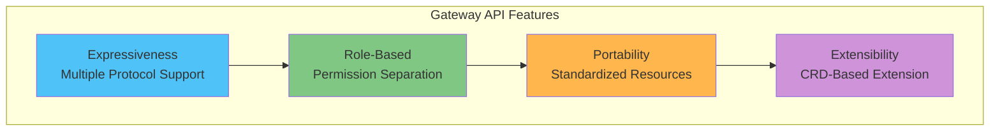
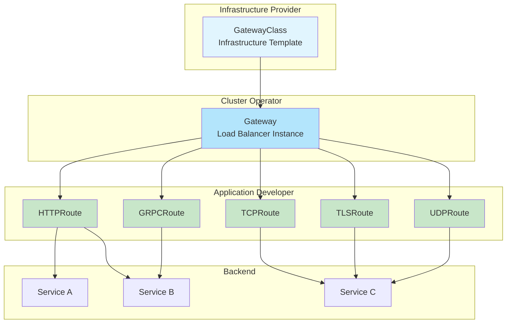

# Kubernetes Gateway API

> **対応バージョン**: Gateway API v1.2+
> **最終更新**: July 3, 2026

## 概要

Gateway API は Kubernetes 向けの次世代 Ingress API であり、既存の Ingress API の制約を克服し、より表現力豊かで拡張可能なネットワークルーティング機能を提供するよう設計されています。SIG-Network によって開発され、Istio、Cilium、Envoy Gateway など、さまざまな実装でサポートされています。

### Ingress API の制約

| 問題 | 説明 |
|---------|-------------|
| **表現力の制限** | HTTP ルーティング以外の TCP/UDP/gRPC のサポートが不十分 |
| **ロール分離の欠如** | インフラ管理者とアプリケーション開発者の権限を分離することが困難 |
| **Annotation の乱用** | 実装固有の機能が Annotation で扱われるため、ポータビリティが低下 |
| **拡張性の制限** | 新しいプロトコルや機能の追加が困難 |
| **クロス Namespace** | Namespace をまたぐ複雑なルーティング |

### Gateway API の利点



## リソースモデル

Gateway API は階層型のリソースモデルを使用します。



### ロール分離

| ロール | 管理するリソース | 責務 |
|------|------------------|----------------|
| **インフラストラクチャプロバイダー** | GatewayClass | 基本的なインフラストラクチャ設定を定義 |
| **クラスターオペレーター** | Gateway, ReferenceGrant | Load Balancer のプロビジョニング、権限管理 |
| **アプリケーション開発者** | HTTPRoute、GRPCRoute など | アプリケーションのルーティングルールを定義 |

## GatewayClass

GatewayClass は、Gateway を作成するときに使用する Controller と設定を定義します。

```yaml
apiVersion: gateway.networking.k8s.io/v1
kind: GatewayClass
metadata:
  name: istio
spec:
  # Controller that handles this GatewayClass
  controllerName: istio.io/gateway-controller

  # Controller-specific parameters (optional)
  parametersRef:
    group: ""
    kind: ConfigMap
    name: istio-gateway-config
    namespace: istio-system

  # Description
  description: "Istio Gateway Controller for production workloads"
```

### 実装別 GatewayClass

```yaml
# Istio
apiVersion: gateway.networking.k8s.io/v1
kind: GatewayClass
metadata:
  name: istio
spec:
  controllerName: istio.io/gateway-controller
---
# Cilium
apiVersion: gateway.networking.k8s.io/v1
kind: GatewayClass
metadata:
  name: cilium
spec:
  controllerName: io.cilium/gateway-controller
---
# AWS Gateway API Controller
apiVersion: gateway.networking.k8s.io/v1
kind: GatewayClass
metadata:
  name: amazon-vpc-lattice
spec:
  controllerName: application-networking.k8s.aws/gateway-api-controller
---
# Envoy Gateway
apiVersion: gateway.networking.k8s.io/v1
kind: GatewayClass
metadata:
  name: envoy-gateway
spec:
  controllerName: gateway.envoyproxy.io/gatewayclass-controller
---
# Contour
apiVersion: gateway.networking.k8s.io/v1
kind: GatewayClass
metadata:
  name: contour
spec:
  controllerName: projectcontour.io/gateway-controller
---
# NGINX Gateway Fabric
apiVersion: gateway.networking.k8s.io/v1
kind: GatewayClass
metadata:
  name: nginx
spec:
  controllerName: gateway.nginx.org/nginx-gateway-controller
```

## Gateway

Gateway は実際の Load Balancer インスタンスを定義します。

### 基本的な Gateway 設定

```yaml
apiVersion: gateway.networking.k8s.io/v1
kind: Gateway
metadata:
  name: production-gateway
  namespace: gateway-system
spec:
  # GatewayClass to use
  gatewayClassName: istio

  # Listener configuration
  listeners:
    # HTTP listener
    - name: http
      protocol: HTTP
      port: 80
      # Allow Routes from all namespaces
      allowedRoutes:
        namespaces:
          from: All

    # HTTPS listener
    - name: https
      protocol: HTTPS
      port: 443
      tls:
        mode: Terminate
        certificateRefs:
          - kind: Secret
            name: tls-cert
            namespace: gateway-system
      allowedRoutes:
        namespaces:
          from: Selector
          selector:
            matchLabels:
              gateway-access: "true"

    # Host-specific listener
    - name: api
      protocol: HTTPS
      port: 443
      hostname: "api.example.com"
      tls:
        mode: Terminate
        certificateRefs:
          - kind: Secret
            name: api-tls-cert
      allowedRoutes:
        namespaces:
          from: Same

  # Address configuration (optional)
  addresses:
    - type: IPAddress
      value: "192.168.1.100"
```

### 高度な Gateway 設定

```yaml
apiVersion: gateway.networking.k8s.io/v1
kind: Gateway
metadata:
  name: multi-protocol-gateway
  namespace: gateway-system
  annotations:
    # Implementation-specific annotation
    networking.istio.io/service-type: LoadBalancer
spec:
  gatewayClassName: istio

  listeners:
    # For HTTP -> HTTPS redirect
    - name: http-redirect
      protocol: HTTP
      port: 80
      allowedRoutes:
        namespaces:
          from: All

    # HTTPS wildcard
    - name: https-wildcard
      protocol: HTTPS
      port: 443
      hostname: "*.example.com"
      tls:
        mode: Terminate
        certificateRefs:
          - kind: Secret
            name: wildcard-cert
      allowedRoutes:
        namespaces:
          from: All
        kinds:
          - kind: HTTPRoute

    # gRPC dedicated
    - name: grpc
      protocol: HTTPS
      port: 443
      hostname: "grpc.example.com"
      tls:
        mode: Terminate
        certificateRefs:
          - kind: Secret
            name: grpc-cert
      allowedRoutes:
        kinds:
          - kind: GRPCRoute

    # TCP passthrough
    - name: tcp-passthrough
      protocol: TLS
      port: 8443
      tls:
        mode: Passthrough
      allowedRoutes:
        kinds:
          - kind: TLSRoute

    # TCP
    - name: tcp
      protocol: TCP
      port: 9000
      allowedRoutes:
        kinds:
          - kind: TCPRoute
```

### TLS モード

| モード | 説明 | ユースケース |
|------|-------------|----------|
| **Terminate** | Gateway で TLS を終端 | 標準 HTTPS |
| **Passthrough** | TLS をバックエンドに渡す | エンドツーエンド暗号化 |

```yaml
# TLS Terminate example
listeners:
  - name: https
    protocol: HTTPS
    port: 443
    tls:
      mode: Terminate
      certificateRefs:
        - kind: Secret
          name: server-cert
---
# TLS Passthrough example
listeners:
  - name: tls-passthrough
    protocol: TLS
    port: 443
    tls:
      mode: Passthrough
```

## HTTPRoute

HTTPRoute は HTTP/HTTPS トラフィックのルーティングルールを定義します。

### 基本的な HTTPRoute

```yaml
apiVersion: gateway.networking.k8s.io/v1
kind: HTTPRoute
metadata:
  name: basic-route
  namespace: production
spec:
  # Gateway to attach to
  parentRefs:
    - name: production-gateway
      namespace: gateway-system
      sectionName: https  # Target specific listener

  # Host matching
  hostnames:
    - "api.example.com"
    - "www.example.com"

  # Routing rules
  rules:
    - matches:
        - path:
            type: PathPrefix
            value: /api/v1
      backendRefs:
        - name: api-v1-service
          port: 80

    - matches:
        - path:
            type: PathPrefix
            value: /api/v2
      backendRefs:
        - name: api-v2-service
          port: 80

    # Default path
    - backendRefs:
        - name: default-service
          port: 80
```

### 高度なマッチングルール

```yaml
apiVersion: gateway.networking.k8s.io/v1
kind: HTTPRoute
metadata:
  name: advanced-matching
  namespace: production
spec:
  parentRefs:
    - name: production-gateway
      namespace: gateway-system

  hostnames:
    - "api.example.com"

  rules:
    # Exact path matching
    - matches:
        - path:
            type: Exact
            value: /health
      backendRefs:
        - name: health-service
          port: 80

    # Regex path matching (implementation dependent)
    - matches:
        - path:
            type: RegularExpression
            value: "/users/[0-9]+"
      backendRefs:
        - name: user-service
          port: 80

    # Header-based routing
    - matches:
        - headers:
            - name: X-Version
              value: "v2"
      backendRefs:
        - name: api-v2-service
          port: 80

    # Query parameter based
    - matches:
        - queryParams:
            - name: debug
              value: "true"
      backendRefs:
        - name: debug-service
          port: 80

    # HTTP method based
    - matches:
        - method: POST
          path:
            type: PathPrefix
            value: /api/data
      backendRefs:
        - name: write-service
          port: 80

    - matches:
        - method: GET
          path:
            type: PathPrefix
            value: /api/data
      backendRefs:
        - name: read-service
          port: 80

    # Combined conditions (AND)
    - matches:
        - path:
            type: PathPrefix
            value: /admin
          headers:
            - name: X-Admin-Token
              type: Exact
              value: "secret-token"
      backendRefs:
        - name: admin-service
          port: 80

    # Multiple conditions (OR)
    - matches:
        - path:
            type: PathPrefix
            value: /api
        - path:
            type: PathPrefix
            value: /v1
      backendRefs:
        - name: api-service
          port: 80
```

### フィルター

フィルターを使用すると、リクエストとレスポンスを変更できます。

```yaml
apiVersion: gateway.networking.k8s.io/v1
kind: HTTPRoute
metadata:
  name: filtered-route
  namespace: production
spec:
  parentRefs:
    - name: production-gateway
      namespace: gateway-system

  rules:
    # Request header modification
    - matches:
        - path:
            type: PathPrefix
            value: /api
      filters:
        - type: RequestHeaderModifier
          requestHeaderModifier:
            add:
              - name: X-Request-ID
                value: "generated-id"
            set:
              - name: X-Forwarded-Proto
                value: "https"
            remove:
              - X-Internal-Header
      backendRefs:
        - name: api-service
          port: 80

    # Response header modification
    - matches:
        - path:
            type: PathPrefix
            value: /public
      filters:
        - type: ResponseHeaderModifier
          responseHeaderModifier:
            add:
              - name: Cache-Control
                value: "public, max-age=3600"
            set:
              - name: X-Content-Type-Options
                value: "nosniff"
      backendRefs:
        - name: public-service
          port: 80

    # URL rewrite
    - matches:
        - path:
            type: PathPrefix
            value: /old-api
      filters:
        - type: URLRewrite
          urlRewrite:
            path:
              type: ReplacePrefixMatch
              replacePrefixMatch: /new-api
            hostname: "new-api.example.com"
      backendRefs:
        - name: new-api-service
          port: 80

    # Redirect
    - matches:
        - path:
            type: PathPrefix
            value: /legacy
      filters:
        - type: RequestRedirect
          requestRedirect:
            scheme: https
            hostname: "new.example.com"
            port: 443
            statusCode: 301
            path:
              type: ReplacePrefixMatch
              replacePrefixMatch: /modern

    # Mirroring
    - matches:
        - path:
            type: PathPrefix
            value: /api
      filters:
        - type: RequestMirror
          requestMirror:
            backendRef:
              name: shadow-service
              port: 80
      backendRefs:
        - name: main-service
          port: 80
```

### トラフィック分割（重み付け）

```yaml
apiVersion: gateway.networking.k8s.io/v1
kind: HTTPRoute
metadata:
  name: canary-route
  namespace: production
spec:
  parentRefs:
    - name: production-gateway
      namespace: gateway-system

  hostnames:
    - "app.example.com"

  rules:
    - matches:
        - path:
            type: PathPrefix
            value: /
      backendRefs:
        # 90% traffic to stable version
        - name: app-stable
          port: 80
          weight: 90

        # 10% traffic to canary version
        - name: app-canary
          port: 80
          weight: 10
```

### タイムアウトとリトライ

```yaml
apiVersion: gateway.networking.k8s.io/v1
kind: HTTPRoute
metadata:
  name: resilient-route
  namespace: production
spec:
  parentRefs:
    - name: production-gateway
      namespace: gateway-system

  rules:
    - matches:
        - path:
            type: PathPrefix
            value: /api
      # Timeout configuration (implementation dependent)
      timeouts:
        request: "30s"
        backendRequest: "25s"
      backendRefs:
        - name: api-service
          port: 80
```

## GRPCRoute

GRPCRoute は gRPC トラフィックのルーティングルールを定義します。

```yaml
apiVersion: gateway.networking.k8s.io/v1
kind: GRPCRoute
metadata:
  name: grpc-route
  namespace: production
spec:
  parentRefs:
    - name: production-gateway
      namespace: gateway-system
      sectionName: grpc

  hostnames:
    - "grpc.example.com"

  rules:
    # Service-based routing
    - matches:
        - method:
            service: "myapp.UserService"
      backendRefs:
        - name: user-grpc-service
          port: 50051

    - matches:
        - method:
            service: "myapp.OrderService"
            method: "CreateOrder"
      backendRefs:
        - name: order-grpc-service
          port: 50052

    # Header-based routing
    - matches:
        - headers:
            - name: x-environment
              value: "staging"
      backendRefs:
        - name: staging-grpc-service
          port: 50051

    # Default routing
    - backendRefs:
        - name: default-grpc-service
          port: 50051
```

## TCPRoute

TCPRoute は TCP トラフィックのルーティングを定義します。

```yaml
apiVersion: gateway.networking.k8s.io/v1alpha2
kind: TCPRoute
metadata:
  name: database-route
  namespace: production
spec:
  parentRefs:
    - name: production-gateway
      namespace: gateway-system
      sectionName: tcp

  rules:
    - backendRefs:
        - name: database-service
          port: 5432
---
# Multi-backend TCP routing
apiVersion: gateway.networking.k8s.io/v1alpha2
kind: TCPRoute
metadata:
  name: tcp-loadbalance
  namespace: production
spec:
  parentRefs:
    - name: production-gateway
      namespace: gateway-system
      sectionName: tcp

  rules:
    - backendRefs:
        - name: tcp-backend-1
          port: 9000
          weight: 50
        - name: tcp-backend-2
          port: 9000
          weight: 50
```

## TLSRoute

TLSRoute は TLS パススルートラフィックのルーティングを定義します。

```yaml
apiVersion: gateway.networking.k8s.io/v1alpha2
kind: TLSRoute
metadata:
  name: tls-passthrough-route
  namespace: production
spec:
  parentRefs:
    - name: production-gateway
      namespace: gateway-system
      sectionName: tcp-passthrough

  hostnames:
    - "secure.example.com"

  rules:
    - backendRefs:
        - name: secure-backend
          port: 8443
```

## UDPRoute

UDPRoute は UDP トラフィックのルーティングを定義します。

```yaml
apiVersion: gateway.networking.k8s.io/v1alpha2
kind: UDPRoute
metadata:
  name: dns-route
  namespace: production
spec:
  parentRefs:
    - name: production-gateway
      namespace: gateway-system
      sectionName: udp

  rules:
    - backendRefs:
        - name: dns-service
          port: 53
```

## ReferenceGrant

ReferenceGrant はクロス Namespace 参照を許可します。

```yaml
# Allow Routes from other namespaces to reference Services in this namespace
apiVersion: gateway.networking.k8s.io/v1beta1
kind: ReferenceGrant
metadata:
  name: allow-routes-to-backend
  namespace: backend-services
spec:
  from:
    # HTTPRoute from production namespace
    - group: gateway.networking.k8s.io
      kind: HTTPRoute
      namespace: production
    # HTTPRoute from staging namespace too
    - group: gateway.networking.k8s.io
      kind: HTTPRoute
      namespace: staging
  to:
    # Can reference Services in this namespace
    - group: ""
      kind: Service
---
# Allow Gateway to reference Secrets (TLS certificates) from another namespace
apiVersion: gateway.networking.k8s.io/v1beta1
kind: ReferenceGrant
metadata:
  name: allow-gateway-to-secrets
  namespace: cert-management
spec:
  from:
    - group: gateway.networking.k8s.io
      kind: Gateway
      namespace: gateway-system
  to:
    - group: ""
      kind: Secret
```

## 実装の比較

### 主な実装

| 実装 | Controller | 機能 |
|----------------|------------|----------|
| **Istio** | istio.io/gateway-controller | Service Mesh 統合、高度なトラフィック管理 |
| **Cilium** | io.cilium/gateway-controller | eBPF ベース、高パフォーマンス |
| **Envoy Gateway** | gateway.envoyproxy.io/gatewayclass-controller | Envoy ベース、標準準拠 |
| **AWS Gateway API Controller** | application-networking.k8s.aws/gateway-api-controller | VPC Lattice 統合 |
| **Contour** | projectcontour.io/gateway-controller | Envoy ベース、シンプルな設定 |
| **NGINX Gateway Fabric** | gateway.nginx.org/nginx-gateway-controller | NGINX ベース |
| **Traefik** | traefik.io/gateway-controller | 動的設定 |

### 機能サポート状況

| 機能 | Istio | Cilium | Envoy GW | AWS | Contour |
|---------|-------|--------|----------|-----|---------|
| HTTPRoute | はい | はい | はい | はい | はい |
| GRPCRoute | はい | はい | はい | 一部 | はい |
| TCPRoute | はい | はい | はい | いいえ | はい |
| TLSRoute | はい | はい | はい | いいえ | はい |
| UDPRoute | はい | はい | 一部 | いいえ | いいえ |
| ReferenceGrant | はい | はい | はい | はい | はい |
| トラフィック分割 | はい | はい | はい | はい | はい |
| ヘッダー変更 | はい | はい | はい | 一部 | はい |
| URL Rewrite | はい | はい | はい | 一部 | はい |
| ミラーリング | はい | 一部 | はい | いいえ | はい |

## AWS Load Balancer Controller Gateway API サポート（v3.0 GA）

AWS Load Balancer Controller v3.0.0（2026 年 1 月）以降、Gateway API サポートは GA に到達し、GatewayClass/Gateway/HTTPRoute のロール分離モデルを通じて ALB/NLB を宣言的に管理できるようになりました。

- **背景**: NGINX Ingress Controller のサポートが 2026 年 3 月に終了することに伴い、AWS は LBC v3.0 + Gateway API をネイティブな代替手段として位置付けています。
- **後方互換性**: 既存の Ingress/Service リソースは引き続き完全にサポートされます。即時の切り替えは不要で、段階的に移行できます。
- **利点**: ヘッダー/クエリベースのルーティング、重み付けされたトラフィック分散（Blue/Green、Canary）、TCP/UDP/gRPC をカバーするマルチプロトコル設計。
- **アップグレード時の注意**: Helm で `enableCertManager=true` を指定してインストールしている場合、アップグレード前に `keepTLSSecret=false` を設定してください（v3.0.0 以降では自動的に処理されます）。

### v3.4.0 移行ツール（2026 年 6 月）

既存の ALB ベース Ingress をダウンタイムなしで Gateway API に移行するためのツールが追加されました。

- **Ingress から Gateway への移行ツール**: 既存の ALB と並行して新しい Gateway API リソースを作成し、ダウンタイムゼロでの移行を可能にします
- **lbc-migrate CLI**: 既存の Ingress Annotation、ルーティングルール、IngressGroups を Gateway API リソースに自動変換します。`--from-cluster` オプションはクラスターを直接分析します
- **Migration Console**: 移行前に変換後の設定を検証するための Web UI

> **注意**: Gateway API と NLB の組み合わせにおける動作が変更されました。複数の TCP/UDP/TLS Route が 1 つの Listener にアタッチされている場合、最も古い Route のみがトラフィックを受信します。アップグレード前に L4 Route の設定を確認してください。

（共通ソース: [AWS Load Balancer Controller Releases](https://github.com/kubernetes-sigs/aws-load-balancer-controller/releases)）

## Ingress から Gateway API への移行

### 段階的な移行ガイド

#### ステップ 1: 既存の Ingress を分析する

```yaml
# Existing Ingress
apiVersion: networking.k8s.io/v1
kind: Ingress
metadata:
  name: my-ingress
  annotations:
    kubernetes.io/ingress.class: "nginx"
    nginx.ingress.kubernetes.io/rewrite-target: /
    nginx.ingress.kubernetes.io/ssl-redirect: "true"
spec:
  tls:
    - hosts:
        - api.example.com
      secretName: api-tls
  rules:
    - host: api.example.com
      http:
        paths:
          - path: /api/v1
            pathType: Prefix
            backend:
              service:
                name: api-v1
                port:
                  number: 80
          - path: /api/v2
            pathType: Prefix
            backend:
              service:
                name: api-v2
                port:
                  number: 80
```

#### ステップ 2: Gateway と GatewayClass を作成する

```yaml
# GatewayClass (Infrastructure Admin)
apiVersion: gateway.networking.k8s.io/v1
kind: GatewayClass
metadata:
  name: production
spec:
  controllerName: istio.io/gateway-controller
---
# Gateway (Cluster Operator)
apiVersion: gateway.networking.k8s.io/v1
kind: Gateway
metadata:
  name: production-gateway
  namespace: gateway-system
spec:
  gatewayClassName: production
  listeners:
    - name: http
      protocol: HTTP
      port: 80
      allowedRoutes:
        namespaces:
          from: All
    - name: https
      protocol: HTTPS
      port: 443
      tls:
        mode: Terminate
        certificateRefs:
          - kind: Secret
            name: api-tls
            namespace: gateway-system
      allowedRoutes:
        namespaces:
          from: All
```

#### ステップ 3: HTTPRoute を作成する

```yaml
# HTTPRoute (Application Developer)
apiVersion: gateway.networking.k8s.io/v1
kind: HTTPRoute
metadata:
  name: api-route
  namespace: default
spec:
  parentRefs:
    - name: production-gateway
      namespace: gateway-system

  hostnames:
    - "api.example.com"

  rules:
    # HTTP -> HTTPS redirect
    - matches:
        - path:
            type: PathPrefix
            value: /
      filters:
        - type: RequestRedirect
          requestRedirect:
            scheme: https
            statusCode: 301

---
# HTTPRoute for HTTPS
apiVersion: gateway.networking.k8s.io/v1
kind: HTTPRoute
metadata:
  name: api-route-https
  namespace: default
spec:
  parentRefs:
    - name: production-gateway
      namespace: gateway-system
      sectionName: https

  hostnames:
    - "api.example.com"

  rules:
    - matches:
        - path:
            type: PathPrefix
            value: /api/v1
      filters:
        - type: URLRewrite
          urlRewrite:
            path:
              type: ReplacePrefixMatch
              replacePrefixMatch: /
      backendRefs:
        - name: api-v1
          port: 80

    - matches:
        - path:
            type: PathPrefix
            value: /api/v2
      filters:
        - type: URLRewrite
          urlRewrite:
            path:
              type: ReplacePrefixMatch
              replacePrefixMatch: /
      backendRefs:
        - name: api-v2
          port: 80
```

#### ステップ 4: 段階的に移行する

```yaml
# Gradual transition via traffic splitting
apiVersion: gateway.networking.k8s.io/v1
kind: HTTPRoute
metadata:
  name: gradual-migration
spec:
  parentRefs:
    - name: production-gateway
      namespace: gateway-system

  rules:
    - backendRefs:
        # Existing service (gradually decrease)
        - name: legacy-service
          port: 80
          weight: 90
        # New service (gradually increase)
        - name: new-service
          port: 80
          weight: 10
```

### 移行チェックリスト

- [ ] 既存の Ingress Annotation を分析する
- [ ] 実装を選択して GatewayClass を作成する
- [ ] Gateway リソースを作成して Listener を設定する
- [ ] ルーティングルールを HTTPRoute に変換する
- [ ] ReferenceGrant でクロス Namespace アクセスを設定する
- [ ] TLS 証明書を移行する
- [ ] トラフィック分割を使用して段階的に移行する
- [ ] モニタリングとロギングを設定する
- [ ] 既存の Ingress リソースを削除する

## EKS パターン

### AWS Gateway API Controller（VPC Lattice）

```yaml
# GatewayClass
apiVersion: gateway.networking.k8s.io/v1
kind: GatewayClass
metadata:
  name: amazon-vpc-lattice
spec:
  controllerName: application-networking.k8s.aws/gateway-api-controller
---
# Gateway (maps to VPC Lattice Service Network)
apiVersion: gateway.networking.k8s.io/v1
kind: Gateway
metadata:
  name: lattice-gateway
  namespace: default
spec:
  gatewayClassName: amazon-vpc-lattice
  listeners:
    - name: http
      protocol: HTTP
      port: 80
      allowedRoutes:
        namespaces:
          from: All
---
# HTTPRoute (maps to VPC Lattice Service)
apiVersion: gateway.networking.k8s.io/v1
kind: HTTPRoute
metadata:
  name: lattice-route
spec:
  parentRefs:
    - name: lattice-gateway
  rules:
    - backendRefs:
        - name: my-service
          port: 80
```

### ALB Controller との併用

```yaml
# Istio Gateway API + ALB Ingress combination
apiVersion: gateway.networking.k8s.io/v1
kind: Gateway
metadata:
  name: internal-gateway
  namespace: istio-system
  annotations:
    # Internal Gateway
    networking.istio.io/service-type: ClusterIP
spec:
  gatewayClassName: istio
  listeners:
    - name: http
      protocol: HTTP
      port: 80
      allowedRoutes:
        namespaces:
          from: All
---
# ALB receives external traffic and forwards to Gateway
apiVersion: networking.k8s.io/v1
kind: Ingress
metadata:
  name: alb-to-gateway
  annotations:
    alb.ingress.kubernetes.io/scheme: internet-facing
    alb.ingress.kubernetes.io/target-type: ip
spec:
  ingressClassName: alb
  rules:
    - host: "*.example.com"
      http:
        paths:
          - path: /
            pathType: Prefix
            backend:
              service:
                name: internal-gateway
                port:
                  number: 80
```

## API チャネルと成熟度

Gateway API はさまざまな成熟度レベルの機能を提供します。

### チャネル分類

| チャネル | 成熟度 | リソース |
|---------|----------|-----------|
| **Standard** | GA | GatewayClass、Gateway、HTTPRoute、ReferenceGrant |
| **Experimental** | Beta/Alpha | GRPCRoute、TCPRoute、TLSRoute、UDPRoute |

### バージョンと互換性

```yaml
# Standard channel (stable)
apiVersion: gateway.networking.k8s.io/v1
kind: HTTPRoute

# Experimental channel
apiVersion: gateway.networking.k8s.io/v1alpha2
kind: TCPRoute
```

## Ingress API との比較

| 機能 | Ingress | Gateway API |
|---------|---------|-------------|
| **ロール分離** | いいえ | はい（3 層） |
| **HTTP ルーティング** | はい | はい |
| **TCP/UDP** | いいえ | はい |
| **gRPC** | Annotation 経由 | ネイティブ |
| **TLS パススルー** | 実装に依存 | はい |
| **トラフィック分割** | Annotation 経由 | ネイティブ |
| **ヘッダーベースのルーティング** | Annotation 経由 | ネイティブ |
| **クロス Namespace** | 制限あり | ReferenceGrant |
| **ポータビリティ** | Annotation に依存 | 標準化済み |
| **拡張性** | いいえ | CRD |

## ベストプラクティス

### 1. ロール分離に従う

```yaml
# Infrastructure team: Manage GatewayClass
# Platform team: Manage Gateway
# App team: Manage HTTPRoute
```

### 2. 最小権限の ReferenceGrant

```yaml
# Explicitly allow only required namespaces
apiVersion: gateway.networking.k8s.io/v1beta1
kind: ReferenceGrant
metadata:
  name: minimal-access
  namespace: backend
spec:
  from:
    - group: gateway.networking.k8s.io
      kind: HTTPRoute
      namespace: frontend  # Specific namespace only
  to:
    - group: ""
      kind: Service
      name: specific-service  # Specific service only
```

### 3. Gateway の分離

```yaml
# Separate Gateway by environment
# production-gateway, staging-gateway

# Separate Gateway by protocol
# http-gateway, grpc-gateway
```

### 4. モニタリング設定

```yaml
# Prometheus metrics collection (varies by implementation)
# - Request count, latency, error rate
# - Backend status
# - TLS certificate expiry
```

---

## 参考資料

- [Gateway API 公式ドキュメント](https://gateway-api.sigs.k8s.io/)
- [Gateway API GitHub](https://github.com/kubernetes-sigs/gateway-api)
- [Istio Gateway API サポート](https://istio.io/latest/docs/tasks/traffic-management/ingress/gateway-api/)
- [Cilium Gateway API](https://docs.cilium.io/en/stable/network/servicemesh/gateway-api/)
- [AWS Gateway API Controller](https://www.gateway-api-controller.eks.aws.dev/)
- [Envoy Gateway](https://gateway.envoyproxy.io/)
