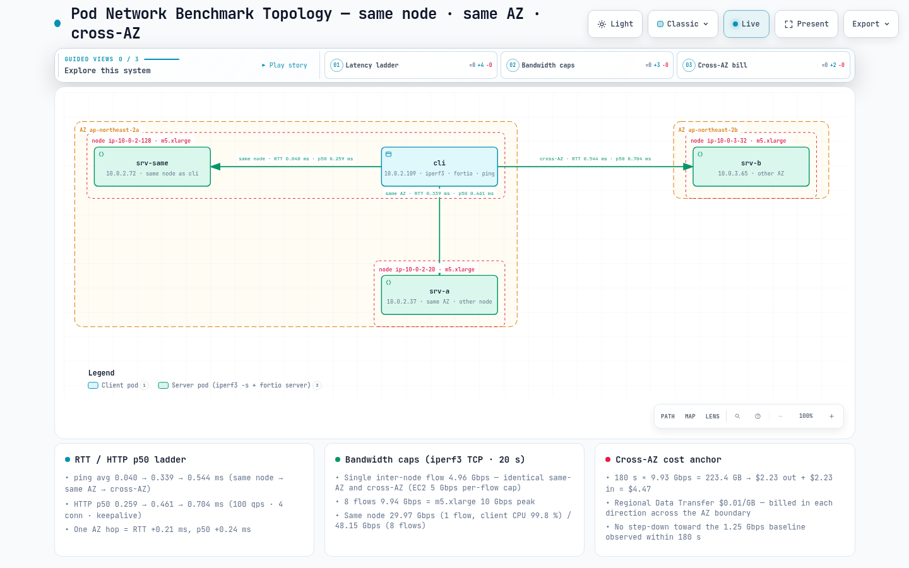

# Pod ネットワークベンチマーク — 同一ノード、同一 AZ、クロス AZ、DNS ndots

> **サポート対象バージョン**: Kubernetes 1.36 (Amazon EKS)、Amazon VPC CNI v1.21.1、kube-proxy iptables モード
> **最終更新**: September 2, 2026

EKS 上の 2 つの Pod が同じノード、同じ AZ 内の別ノード、または異なる AZ に配置された場合、実際には何が変わるのでしょうか。この問いには 2 つの誤解がつきまといます。1 つ目は、AZ をまたぐと「遅くなり帯域幅も減る」というものです。本測定では AZ 境界が変えたのは**レイテンシと料金**であり、帯域幅はまったく変わりませんでした。2 つ目は DNS です。すべての EKS Pod が受け取る `ndots:5` と 4 項目の search リストにより、5 個未満のドットを持つ任意の名前の外部ルックアップは、気付かないうちに 2 件ではなく 10 件の DNS クエリになります。このページでは、「再現方法」のフィクスチャを使用して 2026 年 9 月 2 日に `fsi-demo-cluster`（ソウル）で測定した RTT、HTTP/gRPC レイテンシ、iperf3 スループット、リージョン内データ転送料、DNS クエリ数をまとめます。すべての数値は Pod IP から Pod IP（ClusterIP なし）です。理由は「注意事項」で説明します。



[🔍 インタラクティブ図を表示](https://www.atomai.click/kubernetes-docs/archmaps/en-networking-06-pod-network-benchmark-0.html)

## TL;DR — 測定結果

1. **RTT の段階差**: 同一ノード **0.040 ms** → 同一 AZ **0.339 ms** → クロス AZ **0.544 ms**（ping、200 プローブの平均）。1 回の AZ ホップは +0.21 ms、同一ノード比では +0.50 ms です。
2. **HTTP p50 / p99**（fortio、100 qps、4 接続、keepalive、60 s）: 0.259 / 0.350 ms → 0.461 / 0.667 ms → 0.704 / 0.812 ms。アプリケーションから見ても同じ段階差です。
3. **帯域幅**: 1 TCP フローは、AZ 内でも AZ をまたいでも **4.96 Gbps** で頭打ちになります（EC2 の 5 Gbps 単一フロー制限）。8 フローでは m5.xlarge の 10 Gbps ピークである **9.94 Gbps** に達します。**AZ をまたいでもスループットは低下しません。**
4. **同一ノードの Pod 間**: 単一フローで **29.97 Gbps**（CPU 制約。クライアントは 1 コアの 99.8 % を使用）、8 フローで **48.15 Gbps**。トラフィックは veth ペアを通過し、NIC には到達しません。
5. **料金**: AZ 間をラインレートで 3 分間転送 = **223.4 GB** = リージョン内データ転送の約 **$4.47**（各方向 $0.01/GB）。180 s 以内では 1.25 Gbps ベースラインへのバーストクレジット枯渇は観測されませんでした。
6. **DNS**: デフォルトの `ndots:5` で、glibc Pod が `sts.ap-northeast-2.amazonaws.com` を 1 回解決すると **10 クエリ**（8 件は NXDOMAIN）、ウォーム時の中央値は **3.78 ms**。末尾ドットで **2 クエリ**（A+AAAA）/ 0.80 ms、`ndots:1` で 2 クエリ / 0.54 ms になります。
7. **新規接続ではリクエスト当たり RTT が 1 回余分にかかる**: keepalive を無効にすると p50 は 0.259 → 0.664、0.461 → 1.079、0.704 → **1.517 ms**。AZ 間ではリクエストごとのレイテンシが 2 倍超になります。

## テスト環境

| 項目 | 値 |
|---|---|
| Cluster | Amazon EKS `fsi-demo-cluster`、ap-northeast-2（ソウル）、control plane `v1.36.2-eks-bca9cf6`、使用した 2 AZ（2a、2b） |
| Nodes | このテスト用に Karpenter `system` NodePool が新規起動した **3 × m5.xlarge** — 2a のクライアントノード、2a のサーバーノード、2b のサーバーノード。4 vCPU、Intel Xeon Platinum 8175M @ 2.50GHz |
| Node OS | Amazon Linux 2023.12.20260817、kernel `6.18.41-94.142.amzn2023.x86_64`、containerd 2.2.5、kubelet v1.36.3-eks-cb19647 |
| CNI | Amazon VPC CNI `v1.21.1-eksbuild.8`（+ network-policy-agent v1.3.4）。`ENABLE_PREFIX_DELEGATION=false`、`ENABLE_POD_ENI=false`、`AWS_VPC_K8S_CNI_EXTERNALSNAT=false`、`NETWORK_POLICY_ENFORCING_MODE=standard`、`WARM_ENI_TARGET=1`、`WARM_IP_TARGET=3` |
| kube-proxy | `v1.35.3-eksbuild.5`、`mode: "iptables"` |
| CoreDNS | `v1.14.2-eksbuild.4`、2 レプリカ — AZ ごとに 1 台（`10.0.2.106` / 2a、`10.0.3.14` / 2b）。Service `kube-dns` ClusterIP `172.20.0.10`。Corefile `kubernetes cluster.local … { pods insecure }`、`forward . /etc/resolv.conf`、`cache 30`、`loadbalance`。**NodeLocal DNSCache なし**、`autopath` plugin なし |
| Pod resolv.conf（デフォルト） | `search bench-net.svc.cluster.local svc.cluster.local cluster.local ap-northeast-2.compute.internal` / `nameserver 172.20.0.10` / `options ndots:5` |
| Pod NIC | eth0 MTU **9001**（jumbo frame）、TCP congestion control `cubic`、iperf3 `tcp_mss_default: 8949` |
| EC2 network spec | m5.xlarge「Up to 10 Gigabit」— ベースライン **1.25 Gbps**、ピーク **10 Gbps**、4 vCPU（比較: m5.large はベースライン 0.75 Gbps、ピーク 10 Gbps、2 vCPU）。`aws ec2 describe-instance-types` で検証。ENA 必須 |
| Pricing | usagetype `APN2-DataTransfer-Regional-Bytes`、「Regional Data Transfer - in/out/between AZs or when using public IP or Elastic IP addresses」、**$0.01/GB**（`aws pricing get-products --region us-east-1`、2026-09 に照会） |
| Tools | `nicolaka/netshoot:v0.14` — iperf **3.19**、fortio **1.69.5**、iputils ping 20250605、tcpdump 4.99.5。DNS client `python:3.12-slim`（Debian 13、**glibc 2.41**、Python 3.12.14） |
| テスト時間帯 | 2026-09-02 07:58–08:40 UTC（最初の Pod は 07:58:22Z、DNS Pod は 08:16:24Z） |

「Up to」はバースト可能なネットワークを意味します。インスタンスは network I/O credit を持つ間はピーク帯域幅を使用でき、使い切るとベースラインに向けてスロットリングされます（AWS EC2 User Guide、「Amazon EC2 instance network bandwidth」）。Measurement 2 の持続実行は、この制限が 180 s 以内には発生しなかったことだけを示します（ベースラインへの低下は観測されず、それ以上の時間は試験していません）。

実行時のフィクスチャ配置:

| Pod | IP | Node | Zone | 役割 / requests |
|---|---|---|---|---|
| `cli` | 10.0.2.109 | ip-10-0-2-128 (nodeclaim `system-76r87`) | ap-northeast-2a | client; 2500m / 1Gi |
| `srv-same` | 10.0.2.72 | ip-10-0-2-128 — `cli` と同じ node（必須 podAffinity） | ap-northeast-2a | server; 200m / 256Mi |
| `srv-a` | 10.0.2.37 | ip-10-0-2-20 (nodeclaim `system-ksrbg`, `cli` への podAntiAffinity) | ap-northeast-2a | server; 2800m / 1Gi |
| `srv-b` | 10.0.3.65 | ip-10-0-3-32 (nodeclaim `system-svdvk`) | ap-northeast-2b | server; 2500m / 1Gi |
| `dns-default` | 10.0.2.5 | ip-10-0-2-20 (`srv-a` への podAffinity) | ap-northeast-2a | glibc resolver、デフォルト `ndots:5` |
| `dns-ndots1` | 10.0.2.143 | ip-10-0-2-20 | ap-northeast-2a | glibc resolver、`dnsConfig.options ndots=1` |

サーバー Pod は `sh -c "iperf3 -s -p 5201 & exec fortio server -http-port 8080 -grpc-port 8079 -tcp-port 8078"` を実行し、すべての bench Pod には `karpenter.sh/do-not-disrupt: "true"` が付与されています。`srv-a` は最初 m5.large / 1500m として要求しましたが、Karpenter は `no instance type has enough resources` と報告しました。DaemonSet overhead が m5.large の 1930m allocatable のうち 821m を使用するため、m5.xlarge / 2800m に変更しました。

### フィクスチャマニフェスト

長い英語コメントヘッダーだけを削除しました。`nodeSelector`、`affinity`、`requests`、`command`、`annotations` は実行した内容そのままです。フィクスチャは Pod IP のみを使用するため Service object はありません（理由は「注意事項」を参照）。

```yaml
apiVersion: v1
kind: Namespace
metadata:
  name: bench-net
  labels:
    bench: net
---
# client — fresh m5.xlarge in ap-northeast-2a
apiVersion: v1
kind: Pod
metadata:
  name: cli
  namespace: bench-net
  labels: { app: cli, role: client }
  annotations: { karpenter.sh/do-not-disrupt: "true" }
spec:
  nodeSelector:
    topology.kubernetes.io/zone: ap-northeast-2a
    node.kubernetes.io/instance-type: m5.xlarge
    karpenter.sh/nodepool: system
  terminationGracePeriodSeconds: 5
  containers:
    - name: netshoot
      image: nicolaka/netshoot:v0.14
      command: ["sleep", "infinity"]
      resources:
        requests: { cpu: "2500m", memory: "1Gi" }
---
# same-node — co-located with cli through required podAffinity
apiVersion: v1
kind: Pod
metadata:
  name: srv-same
  namespace: bench-net
  labels: { app: srv-same, role: server, zone: a }
  annotations: { karpenter.sh/do-not-disrupt: "true" }
spec:
  affinity:
    podAffinity:
      requiredDuringSchedulingIgnoredDuringExecution:
        - labelSelector: { matchLabels: { app: cli } }
          topologyKey: kubernetes.io/hostname
  terminationGracePeriodSeconds: 5
  containers:
    - name: netshoot
      image: nicolaka/netshoot:v0.14
      command: ["sh", "-c", "iperf3 -s -p 5201 & exec fortio server -http-port 8080 -grpc-port 8079 -tcp-port 8078"]
      ports: [{ containerPort: 8080 }, { containerPort: 5201 }]
      resources:
        requests: { cpu: "200m", memory: "256Mi" }
---
# same-AZ — same AZ as cli, different node (podAntiAffinity). m5.large did not fit because of DaemonSet overhead, hence m5.xlarge
apiVersion: v1
kind: Pod
metadata:
  name: srv-a
  namespace: bench-net
  labels: { app: srv-a, role: server, zone: a }
  annotations: { karpenter.sh/do-not-disrupt: "true" }
spec:
  nodeSelector:
    topology.kubernetes.io/zone: ap-northeast-2a
    node.kubernetes.io/instance-type: m5.xlarge
    karpenter.sh/nodepool: system
  affinity:
    podAntiAffinity:
      requiredDuringSchedulingIgnoredDuringExecution:
        - labelSelector: { matchLabels: { app: cli } }
          topologyKey: kubernetes.io/hostname
  terminationGracePeriodSeconds: 5
  containers:
    - name: netshoot
      image: nicolaka/netshoot:v0.14
      command: ["sh", "-c", "iperf3 -s -p 5201 & exec fortio server -http-port 8080 -grpc-port 8079 -tcp-port 8078"]
      ports: [{ containerPort: 8080 }, { containerPort: 5201 }]
      resources:
        requests: { cpu: "2800m", memory: "1Gi" }
---
# cross-AZ — fresh m5.xlarge in ap-northeast-2b
apiVersion: v1
kind: Pod
metadata:
  name: srv-b
  namespace: bench-net
  labels: { app: srv-b, role: server, zone: b }
  annotations: { karpenter.sh/do-not-disrupt: "true" }
spec:
  nodeSelector:
    topology.kubernetes.io/zone: ap-northeast-2b
    node.kubernetes.io/instance-type: m5.xlarge
    karpenter.sh/nodepool: system
  terminationGracePeriodSeconds: 5
  containers:
    - name: netshoot
      image: nicolaka/netshoot:v0.14
      command: ["sh", "-c", "iperf3 -s -p 5201 & exec fortio server -http-port 8080 -grpc-port 8079 -tcp-port 8078"]
      ports: [{ containerPort: 8080 }, { containerPort: 5201 }]
      resources:
        requests: { cpu: "2500m", memory: "1Gi" }
```

2 つの DNS Pod は `srv-a` と同じ node に配置しました。`app` container は glibc（`python:3.12-slim`、Debian 13、glibc 2.41）です。このページは glibc resolver を測定しており、他の resolver（musl/alpine）の結果は測定していません。`sniffer`（netshoot）は Pod の network namespace を共有するため、その tcpdump は `app` が送信するすべての query を確認できます。2 Pod の違いは `dnsConfig` だけです。

```yaml
apiVersion: v1
kind: Pod
metadata:
  name: dns-default          # the second Pod is name: dns-ndots1 plus the dnsConfig block below
  namespace: bench-net
  labels: { app: dns-default, role: dns }
  annotations: { karpenter.sh/do-not-disrupt: "true" }
spec:
  affinity:
    podAffinity:
      requiredDuringSchedulingIgnoredDuringExecution:
        - labelSelector: { matchLabels: { app: srv-a } }
          topologyKey: kubernetes.io/hostname
  # present only in dns-ndots1:
  # dnsConfig:
  #   options:
  #     - name: ndots
  #       value: "1"
  terminationGracePeriodSeconds: 5
  containers:
    - name: app
      image: python:3.12-slim
      command: ["sleep", "infinity"]
      resources: { requests: { cpu: "50m", memory: "64Mi" } }
    - name: sniffer
      image: nicolaka/netshoot:v0.14
      command: ["sleep", "infinity"]
      resources: { requests: { cpu: "50m", memory: "64Mi" } }
```

## Measurement 1 — RTT と HTTP レイテンシ: 同一 node → 同一 AZ → クロス AZ

まず ICMP でネットワークパスそのものを測定（`ping -c 200 -i 0.05 -q`）し、その後 fortio により同じ 3 パスを HTTP/1.1 と gRPC request として測定しました。単一のコールド `curl` request の connect / total time は参考として掲載しています。

| パス | RTT min / **avg** / max / mdev (ms) | Loss | curl、コールド request 1 回: connect / total |
|---|---|---|---|
| 同一 node → 10.0.2.72 | 0.021 / **0.040** / 0.089 / 0.007 | 0/200 | 0.194 ms / 0.497 ms |
| 同一 AZ → 10.0.2.37 | 0.300 / **0.339** / 0.450 / 0.017 | 0/200 | 0.497 ms / 2.333 ms |
| クロス AZ → 10.0.3.65 | 0.504 / **0.544** / 0.625 / 0.015 | 0/200 | 0.694 ms / 4.038 ms |

差分: 同一 AZ − 同一 node = +0.30 ms、クロス AZ − 同一 AZ = **+0.21 ms**、クロス AZ − 同一 node = +0.50 ms。3 パスはすべて非常に安定しており、mdev は 0.017 ms 以下です。curl の「total」はプロセス起動を含む 1 回のコールド実行なので参考値としてのみ扱い、レイテンシは以下の fortio table から読み取ってください。

### HTTP/1.1 — 100 qps、4 connections、keepalive、60 s（6,000 requests）、ms

| パス | avg | **p50** | p90 | p99 | p99.9 | max | min |
|---|---|---|---|---|---|---|---|
| 同一 node | 0.260 | **0.259** | 0.299 | 0.350 | 1.267 | 2.080 | 0.111 |
| 同一 AZ | 0.468 | **0.461** | 0.560 | 0.667 | 0.783 | 2.823 | 0.336 |
| クロス AZ | 0.706 | **0.704** | 0.782 | 0.812 | 1.150 | 4.581 | 0.551 |

### gRPC ping — 100 qps、4 connections、30 s（3,000 requests）、ms

| パス | avg | **p50** | p90 | p99 | p99.9 | max | min |
|---|---|---|---|---|---|---|---|
| 同一 node | 0.410 | **0.397** | 0.449 | 0.869 | 1.187 | 1.314 | 0.241 |
| 同一 AZ | 0.601 | **0.592** | 0.687 | 0.889 | 1.052 | 1.105 | 0.448 |
| クロス AZ | 0.878 | **0.865** | 0.967 | 1.209 | 2.582 | 2.826 | 0.692 |

response body は約 75 bytes（fortio echo、空 payload）で、すべての実行は 0 errors（200 / SERVING）で完了しました。

**読み方。** HTTP p50 は ping average に 0.12–0.22 ms を足した値です（0.259 − 0.040 ≈ 0.22、0.461 − 0.339 ≈ 0.12、0.704 − 0.544 ≈ 0.16）。残りは client と server の user-space stack です。AZ hop の p50 コストは **+0.24 ms**（0.461 → 0.704）で、ping の +0.21 ms と同程度、node hop（+0.20 ms、0.259 → 0.461）にも近い値です。つまり「同一 node → 別 node」と「同一 AZ → 別 AZ」はどちらも約 0.2 ms の一定した段差です。gRPC ping p50 は各パスで HTTP/1.1 より約 0.13–0.16 ms 高くなります（0.397 / 0.592 / 0.865 対 0.259 / 0.461 / 0.704）。これは fortio ping における HTTP/2 framing と protobuf によるものです。最も差が出るのは tail です。HTTP p99 は 0.350 → 0.667 → 0.812 ms、gRPC p99.9 は 1.187 → 1.052 → **2.582 ms** となり、2 ms を超えるのはクロス AZ パスだけです。

> **比較点。** この repository の [Istio sidecar と ambient の測定](../service-mesh/istio/comparison/03-sidecar-vs-ambient.md)では、1 つの sidecar が p50 に **+1.29 ms** を追加します。ここでの AZ hop は +0.21–0.24 ms で、**1 回の mesh hop は 1 回の AZ hop より大きなコストです。** 遅い request を「別 AZ」のせいにする前に、そのパスの proxy 数を数えてください。

### 新規接続のコスト — keepalive=false、100 qps、4 connections、30 s（3,000 requests）、ms

すべての request が新しい TCP connection を開く（fortio `-keepalive=false`）場合、レイテンシはどうなるでしょうか。

| パス | avg | **p50** | p90 | p99 | p99.9 | max | min | keepalive p50 比 |
|---|---|---|---|---|---|---|---|---|
| 同一 node | 0.672 | **0.664** | 0.782 | 0.957 | 1.253 | 1.306 | 0.364 | **+0.405 ms** |
| 同一 AZ | 1.066 | **1.079** | 1.185 | 1.369 | 1.582 | 1.795 | 0.769 | **+0.618 ms** |
| クロス AZ | 1.530 | **1.517** | 1.678 | 1.796 | 1.981 | 2.009 | 1.300 | **+0.813 ms** |

新しい connection 1 回のコストは、おおむね **1 RTT（TCP handshake）と約 0.3 ms の socket setup / teardown** です。パスの RTT が大きいほど上乗せも増えます。AZ 間では 1 request の p50 が 0.704 から 1.517 ms、すなわち **2 倍超**になります。Connection pooling（HTTP keepalive、gRPC channel reuse、database connection pool）は性能チューニングではありません。AZ をまたぐ call に必要な前提条件です（connection-per-request client と同様、各新規 connection は TIME_WAIT socket も残します。ここでは未測定）。

### 固定 connection pool の最大 qps — レイテンシはスループット（closed loop、16 connections、20 s）

`-qps 0`（unlimited、closed loop）では、16 connection が維持できる最大 request rate によって、レイテンシ差がスループット差になります。

| パス | Requests | **達成 qps** | avg ms | p50 | p90 | p99 | p99.9 | max |
|---|---|---|---|---|---|---|---|---|
| 同一 node | 899,827 | **44,991** | 0.355 | 0.249 | 0.733 | 1.695 | 3.389 | 13.593 |
| 同一 AZ | 770,156 | **38,507** | 0.415 | 0.396 | 0.537 | 0.728 | 1.147 | 4.502 |
| クロス AZ | 512,060 | **25,602** | 0.624 | 0.597 | 0.770 | 0.949 | 1.293 | 4.725 |

Little の法則（導出: throughput = concurrency ÷ latency）はほぼ正確に成立します。16 ÷ 0.000355 s = 45,070（測定 44,991）、16 ÷ 0.000415 = 38,554（38,507）、16 ÷ 0.000624 = 25,641（25,602）。固定サイズの pool では、AZ hop の +0.2 ms によって**達成可能な throughput が 34 % 減少**します（38.5k → 25.6k qps）。request/response Service では、別 AZ を高価にするのは帯域幅ではなくこのレイテンシです。同一 node の p99/max が同一 AZ より悪いこともネットワーク原因ではありません。45k qps では client と server が 1 node の 4 vCPU を共有し、CPU を競合します。

## Measurement 2 — Throughput: 5 Gbps 単一フロー上限と 10 Gbps インスタンス上限

iperf3 3.19、TCP、1 実行 20 s、`-J`、client は `cli`。CPU column は iperf3 自身の process ごとの数値で、100 % = 1 vCPU です。

| パス | Flows (-P) | Send Gbps | Recv Gbps | Retransmits | Bytes sent | Client CPU | Server CPU | Sender TCP mean RTT (stream 1) | max snd_cwnd |
|---|---|---|---|---|---|---|---|---|---|
| 同一 node (cli→srv-same) | 1 | **29.97** | 29.97 | 13 | 74,921,541,632 | **99.8 %** | 80.9 % | 34 µs | 1,861,392 B |
| 同一 node | 8 | **48.15** | 48.08 | 14,567 | 120,375,083,008 | 179.0 % | 186.9 % | 201 µs / 767 µs (streams 1, 2) | 5,888,442 B |
| 同一 AZ (cli→srv-a, 2a→2a) | 1 | **4.96** | 4.96 | 4 | 12,411,731,968 | 19.5 % | 15.4 % | **5,641 µs** | 4,349,214 B |
| 同一 AZ | 8 | **9.94** | 9.93 | 5,874 | 24,846,139,392 | 36.3 % | 159.3 % | 2,720 µs / 1,626 µs | 1,163,370 B |
| クロス AZ (cli→srv-b, 2a→2b) | 1 | **4.96** | 4.96 | 2 | 12,411,994,112 | 20.0 % | 22.5 % | **5,420 µs** | 4,304,469 B |
| クロス AZ | 8 | **9.94** | 9.93 | 5,979 | 24,845,090,816 | 36.7 % | 138.2 % | 3,671 µs / 3,237 µs | 1,226,013 B |

ここで読み取るべき点は 4 つです。

1. **同一 node は memory-copy speed です。** 単一 flow で 29.97 Gbps のとき、client iperf3 は 1 core の 99.8 % を使用し、8 flow では 48.15 Gbps になりました。veth pair 上の packet は NIC や ENA shaper を通過しないため、これはこの instance の CPU 数値であり、他の instance family では異なります。
2. **node 間の単一 TCP flow は 4.96 Gbps で停止します。これは同一 AZ とクロス AZ で小数第 2 位まで同じです。** AWS は cluster placement group 外の単一 flow を 5 Gbps に制限すると文書化しており（「Amazon EC2 instance network bandwidth」）、ここに現れているのはその上限です。flow は 1 core の約 20 % を使用するため、CPU は bottleneck ではありません。
3. **8 flow では m5.xlarge の 10 Gbps peak と等しい 9.94 Gbps** となり、これも両パスで同一です。**AZ 境界をまたいでも帯域幅は下がりません。** retransmit は instance ceiling 到達時にのみ現れます（8 flow では 5,874 / 5,979、1 flow では 2–13）。これは ENA allowance shaping が上限で packet を drop することと整合する**間接的な signal**です。この実行では ENA `*_allowance_exceeded` counter は収集しませんでした（注意事項）。
4. **flow が飽和すると、その flow に乗るすべての request は待たされます。** 単一 flow を上限に固定すると、sender の TCP RTT は idle ping RTT の 0.34 ms（同一 AZ）/ 0.54 ms（クロス AZ）から、約 4.3 MB の congestion window で **5.6 ms** / **5.4 ms** に増加しました。この遅延は shaper 内の queueing であり、bulk transfer と同じ TCP connection に multiplex された request/response exchange は約 5 ms を失います。

MSS 8949 は 9001-byte MTU（jumbo frame）に由来し、bytes-sent column は次節のコスト計算の基礎です。

> **要点:** 1 つの gRPC stream、1 つの Kafka replica fetcher、1 回の volume copy のいずれでも、異なる node 上の 2 Pod 間で「1 connection」は運ぶデータに関係なく約 5 Gbps を超えません。instance の 10 Gbps を使用するには work を parallel connection（`num.replica.fetchers`、multipart upload、parallel rsync など）に分割する必要があります。逆に「1 AZ 内に置けば帯域幅が 2 倍になる」という期待は、この測定では裏付けられません。

### 3 分間の持続実行と burst credits

「Up to 10 Gigabit」の baseline は 1.25 Gbps です。credit を使い切ると instance は peak から baseline に近づくはずなので、4-flow cross-AZ run を 10 s 間隔で 180 s 観察しました（`iperf3 -c 10.0.3.65 -p 5201 -t 180 -P 4 -i 10 -J`）。

| 項目 | 値 |
|---|---|
| 10 s interval ごとの Gbps（18 intervals） | 9.94、9.93 ×12、9.92、9.93 ×4 — **min 9.92、max 9.94** |
| Total sent | 223,376,179,200 B = 180.0 s（9.93 Gbps）で **223.4 GB** |
| Retransmits | 44,842（≈ 249/s。10 s interval 当たり 2,273–2,669） |
| CPU | client 30.7 %（system 30.1 %）、server 54.2 %（system 52.2 %） |

**180 s 以内に 1.25 Gbps baseline へ低下することは観測されませんでした。** これは burst credit が存在しないことを意味しません。AWS は「Up to」instance で、より長い持続 transfer は baseline へスロットリングされる場合があると文書化しています。このページでは 180 s 超を測定していないため、この実行ではいつ、あるいは新規 node でその時点に達するかは分かりません。m5.xlarge で数時間の backup、rebalance、replay を計画するなら、1.25 Gbps baseline（他の size にはそれぞれの baseline）を見込んで、10 Gbps は bonus とみなしてください。

## Measurement 3 — 実際のクロス AZ コストは料金

Measurement 1 と 2 は、AZ hop が +0.2 ms のレイテンシを追加し、帯域幅に影響しないことを示しました。では AZ 間の実際の違いはどこにあるのでしょうか。請求書です。

同一 region 内では、AWS は AZ crossing の各側で $0.01/GB を課金します。送信 AZ の「out」と受信 AZ の「in」です（EC2 On-Demand pricing page、「Data Transfer within the same AWS Region」）。この account の Pricing API item は `APN2-DataTransfer-Regional-Bytes`、「Regional Data Transfer - in/out/between AZs or when using public IP or Elastic IP addresses」、**$0.0100000000 USD/GB** です。一方向の bulk transfer では、送信 AZ に「out」$0.01/GB、受信 AZ に「in」$0.01/GB が課金されるため、1 account 内では実質的に **AZ boundary を越える 1 GB 当たり $0.02** です（導出: $0.01 × 2）。

| シナリオ | AZ boundary を越える Bytes | コスト（導出: GB × $0.01 × 2） |
|---|---|---|
| このページの 180 s sustained run（測定値） | 223.4 GB | 223.4 × $0.01 = **$2.23/方向、合計 $4.47** |
| Measurement 2 の全 cross-AZ transfer（測定値: 12.41 + 24.85 + 223.38 GB） | 260.6 GB | ≈ $2.61/方向、**合計 ≈ $5.21**（fortio と ping traffic は 0.2 GB 未満のため除外） |
| 30 日間、平均 1 Gbps の AZ 間転送（**仮定**） | 0.125 GB/s × 86,400 s × 30 days = 324,000 GB ≈ **324 TB** | 324,000 × $0.02 ≈ **$6,480 / month** |
| leader ingest 100 MiB/s の 3 AZ に分散した RF3 StatefulSet（**仮定**、replication traffic のみ） | 他 AZ の 2 follower → 2 × 100 MiB/s = 209,715,200 B/s × 2,592,000 s ≈ 543,600 GB ≈ **544 TB / month** | 543,600 × $0.02 ≈ **$10,870 / month** |

下 2 行は測定ではなく、この unit price に基づく**見積もり**です。producer/consumer traffic と AZ placement は無視しています。重要なのは規模です。3 node の benchmark は 3 分で $4.47 を費やし、その rate を終日継続すると月額数千ドルになります。帯域幅は減衰せずに boundary を越えますが、すべての byte には価格札が付きます。

**operator がすべきこと。**

- **traffic を AZ 内に保つ。** `Service.spec.trafficDistribution: PreferClose` は Kubernetes 1.31 で beta、1.33 で GA（Kubernetes docs、「Traffic Distribution」）で、kube-proxy に同じ zone の endpoint を優先させます。**この実行では測定していません**。Service を作成できなかったためです（注意事項）。したがって、このページに効果の数値はありません。
- **stateful workload を zone に合わせる。** replication fan-out が大きい StatefulSet（Kafka RF3、distributed database）は、上の 4 行目のように replication bytes の大部分を AZ 間に送信します。zone-level placement と AZ failover design は [Zonal Cluster Operations guide](../ops/15-zonal-operations-guide.md)で説明しています。
- **bulk transfer の方向と量を把握する。** backup、rebalance、replay がどの AZ からどの AZ へ、どれだけ流れるかを記録し、「in」と「out」が同じ account の別 line item として課金されることを覚えておいてください。

## Measurement 4 — DNS: ndots:5 による query amplification


[🔍 インタラクティブ図を表示](https://www.atomai.click/kubernetes-docs/archmaps/en-networking-06-pod-network-benchmark-1.html)

EKS Pod の `/etc/resolv.conf` には 4 つの search domain（`bench-net.svc.cluster.local svc.cluster.local cluster.local ap-northeast-2.compute.internal`）と `options ndots:5` があります。glibc resolver は `ndots` 未満の dot を持つ名前を、**まず各 search suffix と結合して試行**し、各 candidate に A と AAAA を並列送信します（`single-request` はデフォルトで off）。したがって 3 dot の `sts.ap-northeast-2.amazonaws.com` は absolute name を問い合わせる前に、4 candidate すべての NXDOMAIN を取得します。方法: `dns-default` / `dns-ndots1` の `app` container で、コールドの `socket.getaddrinfo(name, 80, AF_UNSPEC, SOCK_STREAM)` を 1 回実行し、`sniffer` sidecar の tcpdump（`-i eth0 -nn udp port 53`）でその 1 回の resolution の DNS packet を capture して count します。続いて同じ name を 20 回解決し、process 内で timing します。これが warm latency です。

### 1 resolution の送信 query と warm latency（20 repeats）、ms

| Pod / ndots | Name (dots) | Queries sent | NXDOMAIN answers | warm min | **median** | p90 | max |
|---|---|---|---|---|---|---|---|
| default / 5 | `kubernetes.default` (1) | 4 | 2 | 0.87 | **1.71** | 1.97 | 2.61 |
| default / 5 | `kubernetes.default.svc.cluster.local` (4) | **10** | 8 | 1.53 | **3.63** | 4.45 | 6.41 |
| default / 5 | `kubernetes.default.svc.cluster.local.` (trailing dot) | 2 | 0 | 0.33 | **0.46** | 1.09 | 1.58 |
| default / 5 | `sts.ap-northeast-2.amazonaws.com` (3) | **10** | 8 | 3.08 | **3.78** | 4.66 | 4.84 |
| default / 5 | `sts.ap-northeast-2.amazonaws.com.` (trailing dot) | 2 | 0 | 0.42 | **0.80** | 1.25 | 2.17 |
| default / 5 | `www.amazon.com` (2) | **10** | 8 | 2.51 | **3.46** | 3.74 | 5.86 |
| ndots1 / 1 | `kubernetes.default` (1) | **6** | 4 | 1.16 | **2.04** | 2.80 | 4.54 |
| ndots1 / 1 | `kubernetes.default.svc.cluster.local` (4) | 2 | 0 | 0.35 | **0.97** | 1.08 | 1.35 |
| ndots1 / 1 | `kubernetes.default.svc.cluster.local.` | 2 | 0 | 0.34 | **0.40** | 0.97 | 1.17 |
| ndots1 / 1 | `sts.ap-northeast-2.amazonaws.com` (3) | 2 | 0 | 0.45 | **0.54** | 1.22 | 1.42 |
| ndots1 / 1 | `sts.ap-northeast-2.amazonaws.com.` | 2 | 0 | 0.47 | **0.75** | 1.20 | 1.30 |
| ndots1 / 1 | `www.amazon.com` (2) | 2 | 0 | 0.63 | **0.90** | 1.27 | 2.74 |

コールドの初回 resolution（glibc NSS initialization を含む。参考値のみ）は次のとおりです: default / `sts` 6.22 ms、default / `sts.` 2.87 ms、default / `www.amazon.com` 9.58 ms、default / `kubernetes.default.svc.cluster.local` 7.40 ms、ndots1 / `kubernetes.default` 10.52 ms、ndots1 / `sts` 2.84 ms。

**読み方。** デフォルトの `ndots:5` では、2 つの外部 name（`sts.…`、`www.amazon.com`）と、意外にも**末尾 dot のない cluster FQDN**（`kubernetes.default.svc.cluster.local`: 4 dots、5 未満）はすべて **10 queries、8 NXDOMAIN、median 3.5–3.8 ms** です。同じ name に dot を 1 個追加すると（`….com.`）、2 queries / 0.46–0.80 ms になります。すなわち **query は 5 分の 1、warm median は `sts` で 3.78 から 0.80 ms、cluster FQDN で 3.63 から 0.46 ms に低下**します。short name `kubernetes.default` は 2 番目の candidate（`svc.cluster.local`）で一致して停止するため、4 queries / 1.71 ms です。CoreDNS の `cache 30` は NXDOMAIN も最大 30 s cache するため、warm state で高コストなのは upstream lookup ではなく、**5 回の sequential Pod↔CoreDNS round trip を待つこと**です。

### 実際の walk — `sts.ap-northeast-2.amazonaws.com` のコールド resolution 1 回（ndots:5、tcpdump、first packet からの ms）

| t (ms) | 172.20.0.10 に送信した candidate（A + AAAA を並列） | Answer |
|---|---|---|
| 0.00 | `sts.ap-northeast-2.amazonaws.com.bench-net.svc.cluster.local.` | NXDomain（authoritative、CoreDNS kubernetes plugin）、0.92 / 1.14 |
| 1.21 | `sts.ap-northeast-2.amazonaws.com.svc.cluster.local.` | NXDomain、2.01 / 2.26 |
| 2.32 | `sts.ap-northeast-2.amazonaws.com.cluster.local.` | NXDomain、3.15 / 3.41 |
| 3.47 | `sts.ap-northeast-2.amazonaws.com.ap-northeast-2.compute.internal.` | NXDomain（VPC resolver へ forwarded — non-authoritative）、3.68 / 3.93 |
| 3.99 | `sts.ap-northeast-2.amazonaws.com.` | **A 10.0.3.84、A 10.0.2.129**、4.37（AAAA: no data） |

10 queries、8 NXDOMAIN、5 sequential round trips、end to end 4.37 ms。useful answer は最後の 0.38 ms で到着します。各 candidate の Pod→CoreDNS→Pod round trip は 0.8–1.1 ms で、CoreDNS processing time と Measurement 1 の RTT ladder を含みます。`172.20.0.10` は iptables random selection により 2 つの CoreDNS Pod に分散され、その一方は別 AZ にあります。したがって**全 DNS query のおよそ半分が AZ boundary をまたぎます。** `sts.ap-northeast-2.amazonaws.com` が 2 private IP（10.0.2.x / 10.0.3.x）に resolve されるのは、この VPC に AZ ごと 1 ENI の STS interface endpoint があるためです。末尾 dot のない `kubernetes.default.svc.cluster.local` も同じ path を walk します。その `.ap-northeast-2.compute.internal` candidate は CoreDNS が upstream に forward するため 2.2 ms かかり、walk 全体はコールドで 5.6 ms、末尾 dot ありでは 0.4–0.5 ms でした。

### `ndots:1` の動作と副作用

- **外部 name**: 10 → **2 queries**、median 3.5–3.8 → **0.5–0.9 ms**（約 4–7 倍高速、query は 5 分の 1）。
- **short cluster name は悪化します。** `kubernetes.default`（1 dot、`ndots 1` 以上）はまず absolute name `kubernetes.default.` として試されます。CoreDNS にはその zone がないため、**VPC resolver に forward**されます（1.6 ms 後に NXDomain）。続いて `bench-net.svc.cluster.local` を walk（NXDOMAIN）し、最後に `svc.cluster.local` から `172.20.0.1` を取得します。つまり 6 queries、4 NXDOMAIN、median 2.04 ms で、ndots:5 の 1.71 ms より遅くなります。cluster-internal name も upstream resolver に漏れます。`ndots:1` を使うなら、in-cluster Service は FQDN（`name.namespace.svc.cluster.local`）で指定してください。
- **末尾 dot は ndots に関係なく機能します** — すべての場合で 2 queries、0.4–0.8 ms です。

### Amplification の算術（導出）

1 request ごとに 1 external name を resolve する application は、`ndots:5` で 2 件ではなく 10 件の DNS query を送信し、1 resolution 当たり **約 +3 ms** を費やします（導出: `sts` は 3.78 − 0.80 = 2.98 ms、末尾 dot なし FQDN は 3.63 − 0.46 = 3.17 ms）。cluster 全体で 1,000 resolutions/s と仮定すると、CoreDNS は 2,000 ではなく **10,000** queries/s を受け、その 8,000 件は NXDOMAIN です。2 つの CoreDNS replica の load の 5 分の 4 は「存在しない」を返すために使われ、その packet の約半分も Regional Data Transfer rate で AZ boundary をまたぎます（volume は小さいもののゼロではありません）。

> **要点 — 修正方法は 4 つです。** (1) configuration 内の external endpoint に**末尾 dot**を付ける（`sts.ap-northeast-2.amazonaws.com.`）— code change なしで直ちに 2 queries。 (2) external call が多い Pod に `dnsConfig: {options: [{name: ndots, value: "1"}]}` を指定する。ただし cluster name は FQDN で指定します。(3) **NodeLocal DNSCache** — この cluster にはありません。これがあれば Pod↔CoreDNS round trip（半分は cross-AZ）は node-local cache hit になります（未測定）。(4) CoreDNS `autopath` plugin は Pod に代わって server-side で search path を walk します。この Corefile にはありませんでした（未測定）。

## 再現方法

1. 上記の manifest を `bench-net.yaml` として保存して apply し、placement が意図どおりか確認します。Pod IP は実行ごとに異なるため、`-o wide` から読み取り、以下の command に置き換えてください。

   ```bash
   kubectl apply -f bench-net.yaml
   kubectl -n bench-net get pods -o wide   # cli and srv-same on one node (2a), srv-a on another 2a node, srv-b in 2b
   kubectl -n bench-net exec -it cli -- bash
   ```

2. **RTT** — path ごとに 50 ms 間隔で 200 probes:

   ```bash
   ping -c 200 -i 0.05 -q 10.0.2.72   # same-node
   ping -c 200 -i 0.05 -q 10.0.2.37   # same-AZ
   ping -c 200 -i 0.05 -q 10.0.3.65   # cross-AZ
   curl -s -o /dev/null -w 'connect=%{time_connect} total=%{time_total}\n' http://10.0.3.65:8080/   # one cold request, for reference
   ```

3. **Throughput** — iperf3、20 s、1 flow と 8 flows、JSON output。sustained run は cross-AZ、180 s / 4 flows / 10 s intervals です:

   ```bash
   for SRV in 10.0.2.72 10.0.2.37 10.0.3.65; do
     iperf3 -c $SRV -p 5201 -t 20 -P 1 -J > t1-$SRV-P1.json
     iperf3 -c $SRV -p 5201 -t 20 -P 8 -J > t1-$SRV-P8.json
   done
   iperf3 -c 10.0.3.65 -p 5201 -t 180 -P 4 -i 10 -J > t1-b-sustained180-P4.json
   ```

   table の column は JSON の `end.sum_sent.bits_per_second`、`retransmits`、`end.cpu_utilization_percent.host_total` / `remote_total`、および stream ごとの `sender.mean_rtt` と `max_snd_cwnd` から取得します。

4. **Request latency** — fortio。すべての run に `-quiet -r 0.00001 -json -` を指定します:

   ```bash
   SRV=10.0.3.65   # repeat per path
   fortio load -quiet -r 0.00001 -json - -qps 100 -c 4 -t 60s http://$SRV:8080/                    # HTTP keepalive
   fortio load -quiet -r 0.00001 -json - -qps 100 -c 4 -t 30s -keepalive=false http://$SRV:8080/   # new connection per request
   fortio load -quiet -r 0.00001 -json - -qps 0 -c 16 -t 20s http://$SRV:8080/                     # qps 0 = unlimited, closed loop
   fortio load -quiet -r 0.00001 -json - -grpc -ping -qps 100 -c 4 -t 30s $SRV:8079                # gRPC ping
   ```

   **`-r 0.00001` を外さないでください。** fortio の default histogram resolution は `-r 0.001`、すなわち 1 ms bucket です。このページのすべての latency は 1 ms 未満なので、default ではすべての request が最初の bucket に入り、p50/p99 はその 1 bucket 内の linear interpolation になります。つまり 1 ms 未満なら p50 = 0.5 ms です。最初の T2 run でまさにこれが発生しました。その percentile は破棄しました（average は有効）。上の table は 10 µs resolution での再実行です。fortio で sub-millisecond latency を測定する人は一度これに遭遇します。

5. **DNS** — `bench-dns.yaml` の 2 Pod を deploy します。1 terminal で `sniffer` sidecar による capture を行い、別 terminal で `app` container が name をコールド 1 回、ウォーム 20 回 resolve します:

   ```bash
   kubectl apply -f bench-dns.yaml
   kubectl -n bench-net exec dns-default -c app -- cat /etc/resolv.conf        # confirm 4 search domains + ndots:5
   kubectl -n bench-net exec dns-ndots1  -c app -- grep ndots /etc/resolv.conf  # options ndots:1
   # terminal 1 — every DNS packet this Pod sends or receives
   kubectl -n bench-net exec dns-default -c sniffer -- tcpdump -i eth0 -nn udp port 53
   # terminal 2 — one cold resolution (count queries and NXDOMAIN in the capture above) + 20 warm timings
   kubectl -n bench-net exec dns-default -c app -- python3 - <<'PY'
   import socket, statistics, time
   name = "sts.ap-northeast-2.amazonaws.com"       # trailing-dot variant: name + "."
   def one():
       t = time.perf_counter()
       socket.getaddrinfo(name, 80, socket.AF_UNSPEC, socket.SOCK_STREAM)
       return (time.perf_counter() - t) * 1000
   print("cold ms", round(one(), 2))
   xs = sorted(one() for _ in range(20))
   print("warm min/median/p90/max", round(xs[0], 2), round(statistics.median(xs), 2), round(xs[int(len(xs)*0.9)-1], 2), round(xs[-1], 2))
   PY
   ```

   table 下 6 行については `dns-ndots1` で同じ手順を繰り返します。table は glibc resolver（`python:3.12-slim`）を測定しています。他の resolver（musl/alpine）は測定していないため、これらの数値を再現するには glibc image を使用してください。

6. 完了後は namespace を削除します — `kubectl delete ns bench-net`。Karpenter が空の node を削除します。

## 注意事項

- **node は新規でしたが、完全に単独ではありませんでした。** このテスト用に Karpenter が 3 台の m5.xlarge node を起動した直後、consolidation により他 namespace の小さな Pod がいくつか移動しました（`cli` node に 1 個、`srv-b` node に 3 個。benchmark traffic とは無関係な小規模 internal Service と controller）。実行中は idle または low-traffic で、load は最大 180 s の burst に限定しました。`cli` node は CPU *requested* が 3901m / 3920m（99 %）でしたが、これは actual utilisation を示すものではありません。
- **単一実行（各 cell n = 1、1 日）。** variance を推定する repeat は行っていません。数値は SLA ではなく order-of-magnitude の基準として扱い、結論は ratio と pattern（RTT ladder、5 Gbps flow cap、10 Gbps instance cap、10 対 2 queries）に基づかせてください。
- **ClusterIP（kube-proxy iptables hop）と `trafficDistribution: PreferClose` は測定できませんでした。** cluster 内の Service に対するすべての `kubectl apply` は `Internal error occurred: failed calling webhook "mservice.elbv2.k8s.aws": … no endpoints available for service "aws-load-balancer-webhook-service"` により拒否されました。read-only diagnosis: `aws-load-balancer-controller` は数週間 CrashLoopBackOff であり、その背後にある `failurePolicy: Fail` webhook には ready endpoint が 0 個でした。controller が復旧するまで cluster 内のどこにも Service を作成できません。benchmark のために webhook を bypass せず、fixture は Pod IP のみを使います。symptom → diagnosis → fix は [Troubleshooting Playbook、entry 11「No Service can be created: failed calling webhook」](../ops/16-troubleshooting-playbook.md#11-no-service-can-be-created-failed-calling-webhook)に記載しています。
- **ENA allowance counter は収集していません。** `ethtool -S eth0 | grep allowance_exceeded`（`bw_in_allowance_exceeded`、`bw_out_allowance_exceeded`、`pps_allowance_exceeded`、`conntrack_allowance_exceeded`、`linklocal_allowance_exceeded`）には node 上の hostNetwork Pod が必要であり、ここでは実行しませんでした。retransmit count は間接的な signal です。
- **burst-credit exhaustion は 180 s 以内に観測されなかっただけです。** 「Up to」instance ではより長い sustained transfer が baseline（1.25 Gbps）に向けて throttle される場合があります。180 s 超は試験していません。
- **DNS latency には CoreDNS cache effect が含まれます。** コールド初回 resolution と 20 回の warm repeat は異なります（`cache 30` は NXDOMAIN も cache します）。external name は VPC resolver を通過します。warm value 間の比較は有効ですが、absolute value は cache state に依存します。
- **同一 node の iperf3 は 1 client core（99.8 %）に制約されます。** 29.97 / 48.15 Gbps はこの instance family の CPU 数値であり、他では異なります。
- **他の CNI mode とは比較していません。** Prefix delegation は off、Security Groups for Pods は off、network policy enforcing mode は `standard` です（eBPF agent は存在しますが、namespace に policy はありません）。設定を変更した場合に何が変わるかは、このページの範囲外です。

## 関連資料

- [Amazon VPC CNI](./01-vpc-cni.md) — この測定の下にある data plane: Pod が VPC IP を直接受け取り、prefix delegation、ENI/IP warming
- [Zonal Cluster Operations](../ops/15-zonal-operations-guide.md) — Measurement 3 の料金を減らす zone-aligned placement と AZ failover design
- [Troubleshooting Playbook、entry 11 — No Service can be created: failed calling webhook](../ops/16-troubleshooting-playbook.md#11-no-service-can-be-created-failed-calling-webhook) — この benchmark から ClusterIP を除外した outage
- [Sidecar vs Ambient Mode Selection Guide](../service-mesh/istio/comparison/03-sidecar-vs-ambient.md) — sidecar hop の +1.29 ms p50 と、ここで測定した +0.21 ms AZ hop を比較
- [EBS gp2 vs gp3 Measured Benchmark](../storage/01-ebs-gp2-gp3-benchmark.md) — 同じ cluster の storage path を測定
- [Kafka on EKS Measured Benchmark](../data-on-eks/kafka/09-kafka-benchmark.md) — RF3 replication traffic がこのページの 5 Gbps flow cap と cross-AZ pricing にどう関わるか
- [Guidebook Roadmap — measured-benchmark series](../roadmap.md)
- [Quiz: Pod Network Benchmark](../quizzes/networking/06-pod-network-benchmark-quiz.md)
