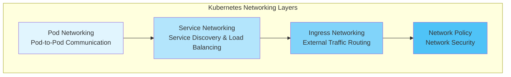
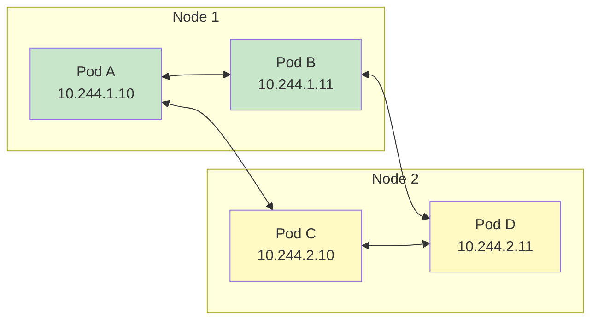
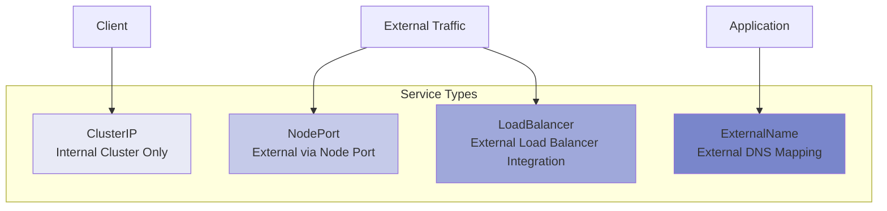
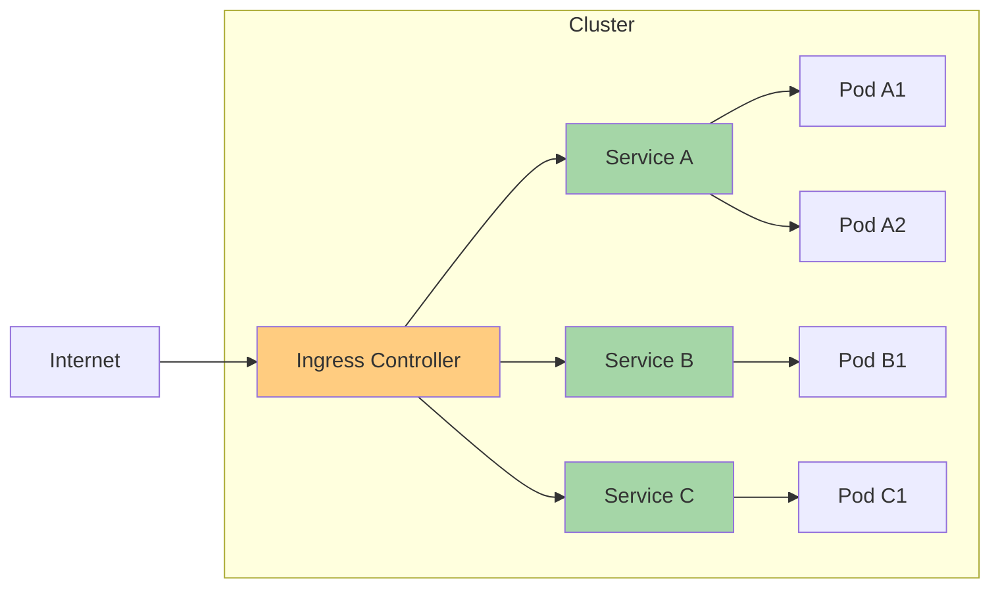
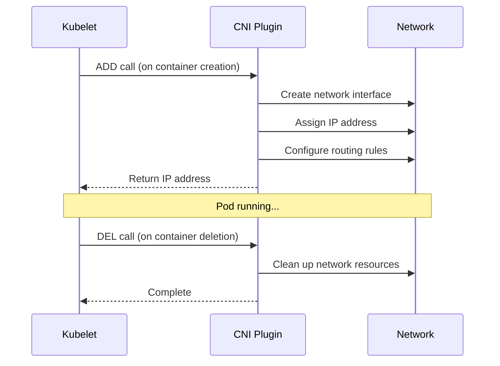
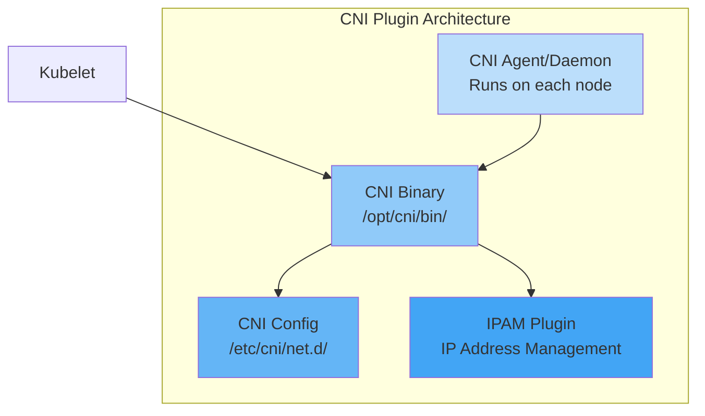
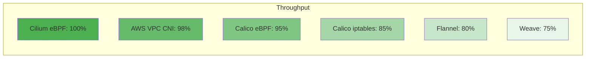
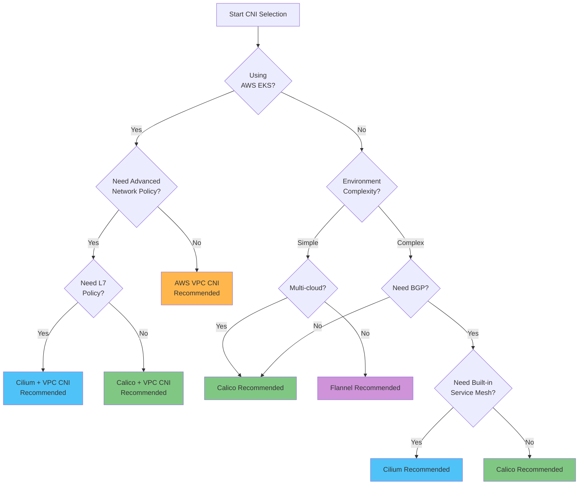
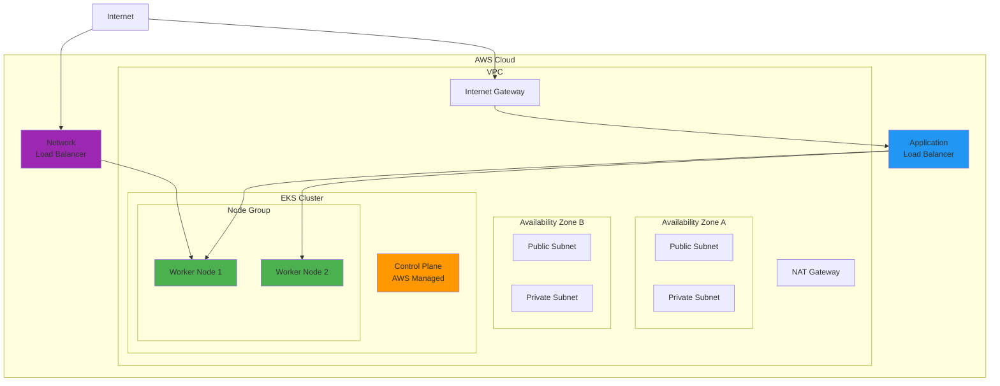
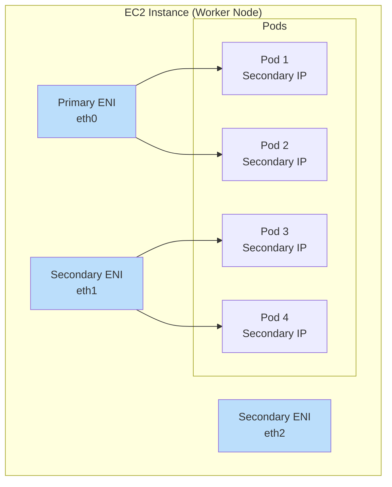

# Kubernetes ネットワーキング

> **最終更新**: February 22, 2026

## 概要

Kubernetes ネットワーキングは、コンテナ化されたアプリケーション間の通信を可能にする中核的なインフラストラクチャ層です。このセクションでは、基本的な Kubernetes ネットワーキングの概念から、高度な CNI (Container Network Interface) ソリューション、AWS EKS 環境でのネットワーキングパターンまでを扱います。

## Kubernetes ネットワーキングモデル

Kubernetes は、次のネットワーク要件に基づいて設計されています。

1. **すべての Pod は NAT なしで他のすべての Pod と通信できる**
2. **すべての Node は NAT なしで各 Pod と通信できる**
3. **Pod 自身が認識する IP と、他者から認識される IP は同じである**



### Pod ネットワーキング

Pod ネットワーキングは Kubernetes ネットワーキングの最も基本的な層です。各 Pod には一意の IP アドレスがあり、クラスター内の他のすべての Pod と直接通信できます。



#### Pod ネットワーキングの実装方式

| 方式 | 説明 | CNI の例 |
|--------|-------------|-------------|
| **オーバーレイネットワーク** | 既存ネットワーク上に構築される仮想ネットワーク | Flannel (VXLAN), Calico (IPIP), Weave Net |
| **アンダーレイネットワーク** | 物理ネットワーク上での直接ルーティング | AWS VPC CNI, Calico (BGP), Cilium (Native Routing) |
| **ハイブリッド** | 環境に応じてオーバーレイ/アンダーレイを選択 | Cilium, Calico |

### Service ネットワーキング

Service は、Pod のセットに対して安定したネットワークエンドポイントを提供します。



#### Service タイプの特性

```yaml
# ClusterIP Service Example
apiVersion: v1
kind: Service
metadata:
  name: my-service
  namespace: default
spec:
  type: ClusterIP
  selector:
    app: my-app
  ports:
    - protocol: TCP
      port: 80
      targetPort: 8080
---
# NodePort Service Example
apiVersion: v1
kind: Service
metadata:
  name: my-nodeport-service
spec:
  type: NodePort
  selector:
    app: my-app
  ports:
    - protocol: TCP
      port: 80
      targetPort: 8080
      nodePort: 30080  # Range: 30000-32767
---
# LoadBalancer Service Example
apiVersion: v1
kind: Service
metadata:
  name: my-loadbalancer-service
  annotations:
    service.beta.kubernetes.io/aws-load-balancer-type: "nlb"
spec:
  type: LoadBalancer
  selector:
    app: my-app
  ports:
    - protocol: TCP
      port: 443
      targetPort: 8443
```

### Ingress ネットワーキング

Ingress は、HTTP/HTTPS トラフィックをクラスター内部の Service にルーティングするルールを定義します。



```yaml
# Ingress Example
apiVersion: networking.k8s.io/v1
kind: Ingress
metadata:
  name: my-ingress
  annotations:
    kubernetes.io/ingress.class: "alb"
    alb.ingress.kubernetes.io/scheme: "internet-facing"
spec:
  rules:
    - host: api.example.com
      http:
        paths:
          - path: /v1
            pathType: Prefix
            backend:
              service:
                name: api-v1
                port:
                  number: 80
          - path: /v2
            pathType: Prefix
            backend:
              service:
                name: api-v2
                port:
                  number: 80
    - host: web.example.com
      http:
        paths:
          - path: /
            pathType: Prefix
            backend:
              service:
                name: web-frontend
                port:
                  number: 80
```

## CNI (Container Network Interface)

CNI は、コンテナネットワーク接続のための標準インターフェースです。Kubernetes は CNI プラグインを通じて Pod ネットワーキングを実装します。

### CNI の仕組み



### CNI プラグインのコンポーネント



## CNI 比較マトリクス

### 主な CNI ソリューションの比較

| 機能 | Cilium | Calico | Flannel | AWS VPC CNI | Weave Net |
|---------|--------|--------|---------|-------------|-----------|
| **中核技術** | eBPF | iptables/eBPF | VXLAN/host-gw | AWS ENI | VXLAN |
| **Network Policy** | 高度 (L3-L7) | 高度 (L3-L4) | なし | 基本 (L3-L4) | 基本 |
| **暗号化** | WireGuard/IPsec | WireGuard/IPsec | なし | なし | 組み込み |
| **Service Mesh** | 組み込み | なし | なし | なし | なし |
| **可観測性** | Hubble | 限定的 | なし | なし | なし |
| **BGP サポート** | はい | はい | いいえ | いいえ | いいえ |
| **マルチクラスター** | ClusterMesh | Federation | いいえ | いいえ | はい |
| **Windows サポート** | ベータ | はい | はい | はい | はい |
| **パフォーマンス** | 優秀 | 非常に良い | 良い | 優秀 | 良い |
| **複雑さ** | 中～高 | 中 | 低 | 低 | 低 |
| **コミュニティ** | 活発 | 非常に活発 | 活発 | AWS サポート | 中程度 |

### 詳細な機能比較

#### ネットワーキングモード

| CNI | オーバーレイ | ネイティブルーティング | BGP | 直接ルーティング |
|-----|---------|----------------|-----|----------------|
| **Cilium** | VXLAN, Geneve | はい | はい | はい |
| **Calico** | VXLAN, IPIP | はい | はい | はい |
| **Flannel** | VXLAN | host-gw | いいえ | いいえ |
| **AWS VPC CNI** | いいえ | VPC ネイティブ | いいえ | はい |
| **Weave Net** | VXLAN | いいえ | いいえ | いいえ |

#### Network Policy 機能

| 機能 | Cilium | Calico | AWS VPC CNI |
|---------|--------|--------|-------------|
| **Ingress Policy** | はい | はい | はい |
| **Egress Policy** | はい | はい | はい |
| **L7 Policy (HTTP)** | はい | いいえ | いいえ |
| **DNS ベースの Policy** | はい | はい | いいえ |
| **FQDN Policy** | はい | はい | いいえ |
| **Host Policy** | はい | はい | いいえ |
| **Global Policy** | はい | はい | いいえ |
| **Policy Tiers** | はい | はい | いいえ |

#### パフォーマンスベンチマーク（相対比較）



## CNI 選定ガイド

### 判断フローチャート



### ユースケース別の推奨 CNI

#### 1. AWS EKS 本番環境

**推奨: AWS VPC CNI + Calico (Network Policy)**

```yaml
# eksctl cluster configuration example
apiVersion: eksctl.io/v1alpha5
kind: ClusterConfig
metadata:
  name: production-cluster
  region: ap-northeast-2
vpc:
  cidr: "10.0.0.0/16"
addons:
  - name: vpc-cni
    version: latest
    configurationValues: |
      enableNetworkPolicy: "true"
  - name: coredns
  - name: kube-proxy
```

#### 2. 高度なセキュリティ要件

**推奨: Cilium**

- L7 Network Policy のサポート
- DNS ベースの Policy
- プロセス/ファイルレベルのセキュリティ Policy
- 暗号化通信 (WireGuard)

#### 3. オンプレミス/ベアメタル環境

**推奨: Calico (BGP モード)**

- 既存ネットワークインフラストラクチャとの統合
- ToR スイッチとの BGP ピアリング
- 高パフォーマンス（オーバーレイなし）

#### 4. 開発/テスト環境

**推奨: Flannel**

- シンプルなインストールと設定
- 低いリソース使用量
- 基本機能として十分

#### 5. Service Mesh 統合環境

**推奨: Cilium (Sidecar なしの Service Mesh)**

- Istio/Envoy を置き換え可能
- mTLS、トラフィック管理
- 低オーバーヘッド

## EKS ネットワーキングの基礎

### EKS のデフォルトネットワーキングアーキテクチャ



### VPC CNI の仕組み

AWS VPC CNI は、各 Pod に実際の VPC IP アドレスを割り当てます。



#### ENI と IP の上限

| インスタンスタイプ | 最大 ENI 数 | ENI あたりの IPv4 | 最大 Pod 数（推奨） |
|---------------|----------|--------------|------------------------|
| t3.medium | 3 | 6 | 17 |
| t3.large | 3 | 12 | 35 |
| m5.large | 3 | 10 | 29 |
| m5.xlarge | 4 | 15 | 58 |
| m5.2xlarge | 4 | 15 | 58 |
| c5.4xlarge | 8 | 30 | 234 |

### EKS ネットワーキングの考慮事項

#### IP アドレス管理

```yaml
# VPC CNI Configuration - IP Prefix Delegation
apiVersion: v1
kind: ConfigMap
metadata:
  name: amazon-vpc-cni
  namespace: kube-system
data:
  enable-prefix-delegation: "true"
  warm-prefix-target: "1"
  minimum-ip-target: "5"
  warm-ip-target: "2"
```

#### カスタムネットワーキング

```yaml
# ENIConfig for Custom Subnets
apiVersion: crd.k8s.amazonaws.com/v1alpha1
kind: ENIConfig
metadata:
  name: us-east-1a
spec:
  securityGroups:
    - sg-0123456789abcdef0
  subnet: subnet-0123456789abcdef0
---
apiVersion: crd.k8s.amazonaws.com/v1alpha1
kind: ENIConfig
metadata:
  name: us-east-1b
spec:
  securityGroups:
    - sg-0123456789abcdef0
  subnet: subnet-fedcba9876543210f
```

## ネットワーキングのサブページ

このセクションでは、以下のトピックを詳しく扱います。

### [VPC CNI](01-vpc-cni.md)
デフォルトの EKS CNI。ネイティブ VPC ネットワーキングのため、各 Pod に VPC IP を割り当てます。

### [Cilium Deep Dive](cilium/README.md)
高パフォーマンスな eBPF ベースの CNI ソリューション。L7 Network Policy、Service Mesh、可観測性 (Hubble) などの高度な機能を提供します。

### [Calico Deep Dive](calico/README.md)
最も広く使用されている CNI の 1 つです。強力な Network Policy、BGP サポート、エンタープライズ機能を備えています。導入、アーキテクチャ、ネットワーキングモード、BGP の詳細、Network Policy、eBPF、高度なトピック、EKS 統合、運用ガイドを扱います。

### [VPC Lattice](02-vpc-lattice.md)
AWS マネージドのアプリケーションネットワーキングサービス。VPC 間およびアカウント間のサービス間通信を実現します。

### [AWS Load Balancer Controller](03-aws-lb-controller.md)
Kubernetes Service と Ingress を AWS ELB (ALB/NLB) に統合します。

### [Gateway API](04-gateway-api.md)
次世代の Kubernetes Ingress API。標準化されたリソースモデルとロールベースの設定を提供します。

## ネットワークのトラブルシューティング

### 一般的な問題と解決策

#### Pod 間通信の失敗

```bash
# 1. Check Pod IPs
kubectl get pods -o wide

# 2. Test network connectivity
kubectl exec -it <pod-name> -- ping <target-pod-ip>

# 3. Test DNS resolution
kubectl exec -it <pod-name> -- nslookup <service-name>

# 4. Check CNI logs
kubectl logs -n kube-system -l k8s-app=aws-node
kubectl logs -n kube-system -l k8s-app=cilium
```

#### Service に到達できない

```bash
# 1. Check Service status
kubectl get svc <service-name> -o yaml

# 2. Check Endpoints
kubectl get endpoints <service-name>

# 3. Check kube-proxy logs
kubectl logs -n kube-system -l k8s-app=kube-proxy
```

#### Network Policy のデバッグ

```bash
# For Cilium
kubectl exec -n kube-system -it <cilium-pod> -- cilium policy get
kubectl exec -n kube-system -it <cilium-pod> -- cilium endpoint list

# For Calico
kubectl get networkpolicy -A
kubectl get globalnetworkpolicy
calicoctl get policy -o yaml
```

### ネットワークパフォーマンステスト

```yaml
# Network performance test using iperf3
apiVersion: v1
kind: Pod
metadata:
  name: iperf-server
  labels:
    app: iperf-server
spec:
  containers:
  - name: iperf
    image: networkstatic/iperf3
    command: ["iperf3", "-s"]
    ports:
    - containerPort: 5201
---
apiVersion: v1
kind: Pod
metadata:
  name: iperf-client
spec:
  containers:
  - name: iperf
    image: networkstatic/iperf3
    command: ["sleep", "infinity"]
```

```bash
# Run the test
kubectl exec -it iperf-client -- iperf3 -c <iperf-server-ip> -t 30
```

## ベストプラクティス

### 1. IP アドレス計画

- 十分な大きさの CIDR ブロックを設計する
- Pod ネットワークを Service ネットワークから分離する
- 将来の拡張を考慮してサブネットを設計する

### 2. Network Policy の適用

- デフォルト拒否 Policy（ゼロトラスト）を適用する
- 必要なトラフィックのみを明示的に許可する
- Namespace を分離する

```yaml
# Default deny policy example
apiVersion: networking.k8s.io/v1
kind: NetworkPolicy
metadata:
  name: default-deny-all
  namespace: production
spec:
  podSelector: {}
  policyTypes:
    - Ingress
    - Egress
```

### 3. パフォーマンス最適化

- 適切な CNI を選択する（ワークロードに合わせる）
- MTU の最適化
- カーネルパラメータのチューニング

### 4. セキュリティ強化

- 暗号化通信 (WireGuard, IPsec)
- mTLS を適用する
- 定期的なセキュリティ監査

### 5. 可観測性の確保

- ネットワークメトリクスを収集する
- フローログを有効化する
- 分散トレーシングを実装する

## 次のステップ

1. [VPC CNI](01-vpc-cni.md) - デフォルトの EKS CNI
2. [Cilium Deep Dive](cilium/README.md) - eBPF ベースのネットワーキング
3. [Calico Deep Dive](calico/README.md) - エンタープライズ CNI
4. [VPC Lattice](02-vpc-lattice.md) - AWS マネージドネットワーキング
5. [AWS Load Balancer Controller](03-aws-lb-controller.md) - ELB 統合
6. [Gateway API](04-gateway-api.md) - 次世代 Ingress

---

## 参考資料

- [Kubernetes Networking Model](https://kubernetes.io/docs/concepts/cluster-administration/networking/)
- [CNI Specification](https://github.com/containernetworking/cni/blob/master/SPEC.md)
- [AWS VPC CNI Documentation](https://docs.aws.amazon.com/eks/latest/userguide/pod-networking.html)
- [Network Policy Guide](https://kubernetes.io/docs/concepts/services-networking/network-policies/)
