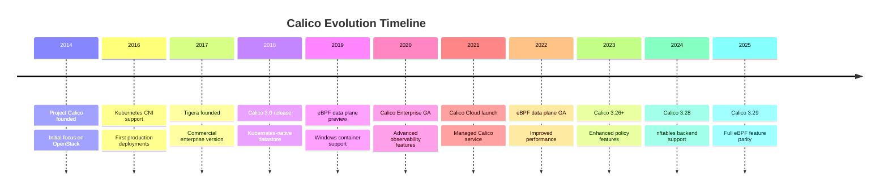
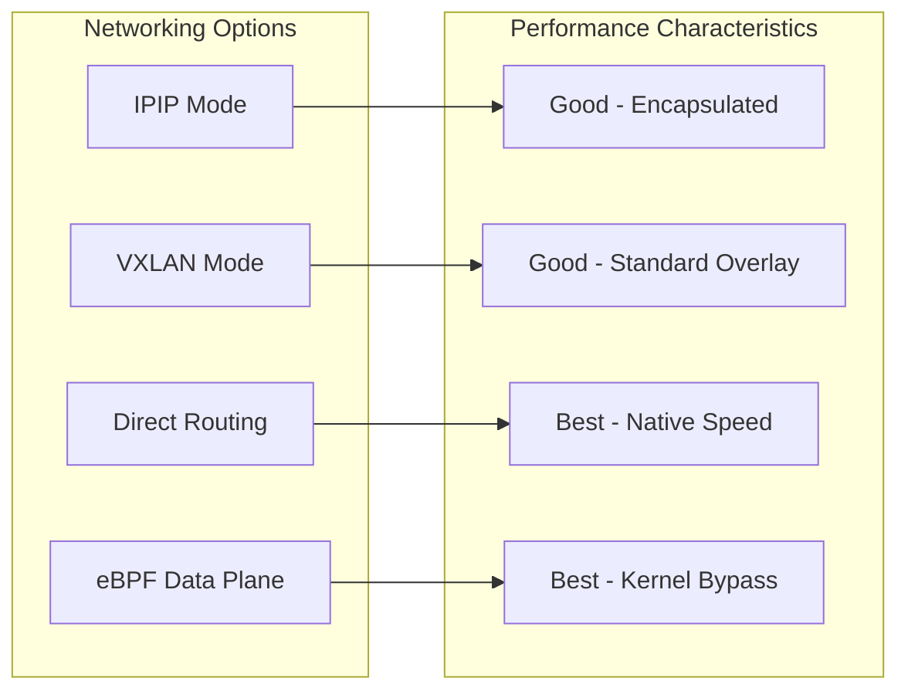
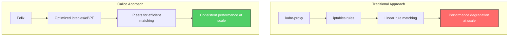
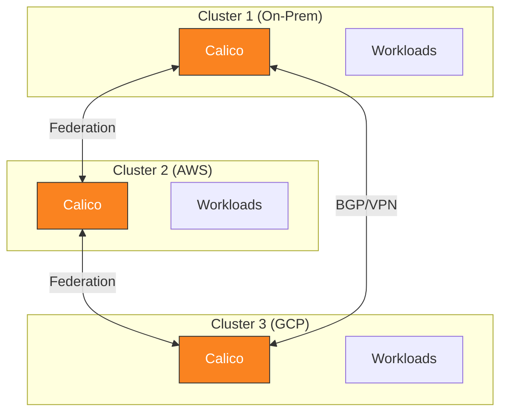

# パート 1: Calico の概要

> **サポート対象バージョン**: Calico v3.29+ / Kubernetes 1.28+
> **最終更新**: February 22, 2026

## ラボ環境のセットアップ

このドキュメントの例に沿って進めるには、以下のツールと環境が必要です。

### 必要なツール

| ツール | バージョン | 用途 |
|------|---------|------|
| kubectl | v1.28+ | Kubernetes クラスター管理 |
| calicoctl | v3.29+ | Calico リソース管理 |
| Helm | v3.12+ | パッケージ管理（任意） |
| kind/minikube | 最新 | ローカル Kubernetes クラスター |

### calicoctl のインストール

```bash
# Download calicoctl binary
curl -L https://github.com/projectcalico/calico/releases/download/v3.29.0/calicoctl-linux-amd64 -o calicoctl
chmod +x calicoctl
sudo mv calicoctl /usr/local/bin/

# Verify installation
calicoctl version

# Configure datastore access (Kubernetes API)
export DATASTORE_TYPE=kubernetes
export KUBECONFIG=~/.kube/config
```

### kind を使用したローカルクラスターのセットアップ

```bash
# Create kind cluster configuration
cat <<EOF > kind-calico.yaml
kind: Cluster
apiVersion: kind.x-k8s.io/v1alpha4
networking:
  disableDefaultCNI: true
  podSubnet: 192.168.0.0/16
nodes:
- role: control-plane
- role: worker
- role: worker
EOF

# Create the cluster
kind create cluster --config kind-calico.yaml --name calico-lab

# Install Calico
kubectl create -f https://raw.githubusercontent.com/projectcalico/calico/v3.29.0/manifests/tigera-operator.yaml
kubectl create -f https://raw.githubusercontent.com/projectcalico/calico/v3.29.0/manifests/custom-resources.yaml

# Wait for Calico to be ready
kubectl wait --for=condition=Ready pods -l k8s-app=calico-node -n calico-system --timeout=300s
```

### インストールの確認

```bash
# Check all Calico components
kubectl get pods -n calico-system

# Expected output:
# NAME                                       READY   STATUS    RESTARTS   AGE
# calico-kube-controllers-xxxxxxxxx-xxxxx    1/1     Running   0          2m
# calico-node-xxxxx                          1/1     Running   0          2m
# calico-node-yyyyy                          1/1     Running   0          2m
# calico-typha-xxxxxxxxx-xxxxx               1/1     Running   0          2m
# csi-node-driver-xxxxx                      2/2     Running   0          2m

# Check node status
calicoctl node status

# Check IP pools
calicoctl get ippools -o wide
```

## Calico とは？

Calico は、クラウドネイティブなワークロード向けに設計されたオープンソースのネットワーキングおよびネットワークセキュリティソリューションです。Kubernetes、仮想マシン、ベアメタルのワークロードに対し、高いスケーラビリティを備えたネットワーキングおよびネットワークポリシーソリューションを提供します。

### プロジェクトの歴史: Project Calico から Tigera へ



| 年 | マイルストーン | 意義 |
|------|-----------|--------------|
| 2014 | Project Calico 設立 | OpenStack 向けネットワーキングとして開始 |
| 2016 | Kubernetes CNI サポート | コンテナオーケストレーションへ拡大 |
| 2017 | Tigera 設立 | 商用サポートとエンタープライズ機能 |
| 2018 | Calico 3.0 | Kubernetes ネイティブなデータストアのサポート |
| 2019 | Windows サポート | エンタープライズでの採用が加速 |
| 2020 | Calico Enterprise GA | 完全なエンタープライズ機能セット |
| 2021 | Calico Cloud | SaaS 提供を開始 |
| 2022 | eBPF データプレーン GA | モダンなデータプレーンの選択肢 |
| 2024 | nftables バックエンド | 次世代 Linux ファイアウォールのサポート |
| 2025 | Calico 3.29 | eBPF 機能の完全な同等性 |

## 主な機能

Calico は、Kubernetes ネットワーキングの有力な選択肢となる 5 つの中核機能を提供します。

### 1. 高性能ネットワーキング

Calico は、さまざまな環境向けに最適化された複数のネットワーキングモードを提供します。



**主なパフォーマンス機能:**
- ネイティブ Linux ネットワーキングスタックとの統合
- オーバーヘッドを削減する任意の eBPF データプレーン
- 最適なパス選択のための BGP ベースルーティング
- ダイレクトルーティングモードにおける最小限のカプセル化オーバーヘッド

### 2. ネットワークポリシーの適用

Calico は Kubernetes NetworkPolicy API を実装し、強力な追加機能によってこれを拡張します。

```yaml
# Standard Kubernetes NetworkPolicy (supported by Calico)
apiVersion: networking.k8s.io/v1
kind: NetworkPolicy
metadata:
  name: default-deny-ingress
  namespace: production
spec:
  podSelector: {}
  policyTypes:
  - Ingress
---
# Calico-specific GlobalNetworkPolicy
apiVersion: projectcalico.org/v3
kind: GlobalNetworkPolicy
metadata:
  name: security-baseline
spec:
  selector: all()
  types:
  - Ingress
  - Egress
  ingress:
  - action: Allow
    source:
      selector: trusted == 'true'
  egress:
  - action: Allow
    destination:
      nets:
      - 10.0.0.0/8
```

**ポリシー機能:**
- ラベルベースの Pod 選択
- Namespace の分離
- CIDR ベースのルール
- プロトコルおよびポートフィルタリング
- グローバルポリシー（クラスター全体）
- 順序付きポリシーティア（Enterprise）
- FQDN ベースの Egress ポリシー

### 3. 柔軟な IP アドレス管理（IPAM）

Calico の IPAM システムは、クラスター全体で IP アドレスを効率的に割り当てます。

```yaml
apiVersion: projectcalico.org/v3
kind: IPPool
metadata:
  name: default-ipv4-pool
spec:
  cidr: 192.168.0.0/16
  blockSize: 26              # 64 IPs per block
  ipipMode: Always
  vxlanMode: Never
  natOutgoing: true
  nodeSelector: all()
```

**IPAM の機能:**
- ブロックベースの割り当て（デフォルト: /26 ブロック）
- 異なるワークロードタイプ向けの複数の IP プール
- Node 固有の IP プール割り当て
- IPv4 および IPv6 デュアルスタックのサポート
- IP の自動回収

### 4. BGP ベースルーティング

Calico のネイティブ BGP サポートにより、既存のネットワークインフラストラクチャとのシームレスな統合が可能になります。

```yaml
apiVersion: projectcalico.org/v3
kind: BGPConfiguration
metadata:
  name: default
spec:
  logSeverityScreen: Info
  nodeToNodeMeshEnabled: true
  asNumber: 64512
---
apiVersion: projectcalico.org/v3
kind: BGPPeer
metadata:
  name: rack-tor-switch
spec:
  peerIP: 10.0.0.1
  asNumber: 64513
  nodeSelector: rack == 'rack-1'
```

**BGP の機能:**
- Node 間のフルメッシュ（自動設定）
- 外部ルーター（ToR スイッチ、ファイアウォール）とのピアリング
- 大規模クラスター向けのルートリフレクターサポート
- AS パスのプリペンドおよびコミュニティ
- グレースフルリスタートのサポート

### 5. クロスプラットフォームサポート

Calico は多様な環境で一貫して動作します。

| プラットフォーム | サポートレベル | 注記 |
|----------|---------------|-------|
| AWS EKS | 完全 | ネイティブ VPC 統合を利用可能 |
| Azure AKS | 完全 | Azure CNI + Calico ポリシーの選択肢 |
| Google GKE | 完全 | Calico をベースとする Dataplane V2 |
| On-Premises | 完全 | 物理ネットワークとの BGP 統合 |
| OpenStack | 完全 | オリジナルプラットフォームのサポート |
| Windows | 完全 | Windows Server 2019/2022 |
| Bare Metal | 完全 | ダイレクトルーティングを推奨 |

## Calico と従来のネットワーキング

### 従来の Kubernetes ネットワーキングにおける課題



### 比較表

| 観点 | 従来（kube-proxy） | Calico |
|--------|-------------------------|--------|
| **ルールの構成** | 線形の iptables チェーン | IP セット + 最適化されたチェーン |
| **スケールの影響** | O(n) のルール走査 | O(1) の IP セット検索 |
| **ポリシーサポート** | なし（別途 CNI が必要） | ネイティブ、拡張機能 |
| **ルーティング** | Service レベルのみ | 完全な L3 ルーティング |
| **可視性** | 限定的 | フローログ、メトリクス |
| **BGP** | 非対応 | ネイティブサポート |
| **データプレーンの選択肢** | iptables のみ | iptables、nftables、eBPF |

### 大規模環境でのパフォーマンス

```
Cluster Size: 1000 nodes, 50,000 pods

Traditional iptables (kube-proxy):
- Rules: ~150,000 iptables rules
- Latency: 2-5ms added per connection
- Memory: ~500MB per node

Calico (optimized):
- Rules: ~5,000 rules + IP sets
- Latency: <0.5ms added per connection
- Memory: ~150MB per node
```

## ユースケース

### 1. オンプレミスデータセンター

Calico は、既存のネットワークインフラストラクチャとの BGP 統合が必要なオンプレミスデプロイメントで優れた性能を発揮します。

```yaml
# BGP peering with data center ToR switches
apiVersion: projectcalico.org/v3
kind: BGPPeer
metadata:
  name: datacenter-tor
spec:
  peerIP: 10.1.0.1
  asNumber: 65001
  password:
    secretKeyRef:
      name: bgp-secrets
      key: tor-password
```

**利点:**
- オーバーレイのオーバーヘッドなし
- 既存ルーティングとの直接統合
- ハードウェアロードバランサーとの互換性
- VM とコンテナにまたがる一貫したセキュリティポリシー

### 2. クラウドデプロイメント（AWS、GCP、Azure）

Calico は、クラウドプロバイダーのネットワーキングに加えて、強化されたセキュリティおよびポリシー機能を提供します。

```yaml
# EKS deployment with VXLAN
apiVersion: operator.tigera.io/v1
kind: Installation
metadata:
  name: default
spec:
  kubernetesProvider: EKS
  cni:
    type: Calico
  calicoNetwork:
    bgp: Disabled
    ipPools:
    - cidr: 10.244.0.0/16
      encapsulation: VXLAN
```

**利点:**
- クラウド VPC の制約内で動作
- クラウドネイティブな選択肢を超える強化されたネットワークポリシー
- マルチクラウドにわたる一貫したポリシーモデル
- クラウドセキュリティグループとの統合

### 3. ハイブリッドおよびマルチクラスター

Calico Federation により、複数のクラスターにまたがるポリシーとルーティングが可能になります。



**利点:**
- クラスター全体にわたる統合ポリシー管理
- クラスター間の Service ディスカバリー
- 一貫したセキュリティ体制
- 段階的な移行のサポート

### 4. コンプライアンス重視の環境

Calico Enterprise は、規制産業向けの高度な機能を提供します。

- **監査ログ**: ポリシー変更と適用の完全な記録
- **コンプライアンスレポート**: PCI-DSS、SOC 2、HIPAA 向けの事前構築済みレポート
- **暗号化**: WireGuard ベースの Node 間暗号化
- **脅威防御**: DDoS 防御と異常検知

## プロジェクトガバナンスとコミュニティ

### オープンソースガバナンス

Calico は、Cloud Native Computing Foundation（CNCF）エコシステムでホストされているオープンソースプロジェクトです。

- **ライセンス**: Apache 2.0
- **ガバナンス**: Tigera を主なメンテナーとするオープンコミュニティ
- **コントリビューション**: GitHub を通じたコミュニティコントリビューションを歓迎
- **リリース**: 定期的なリリースサイクル（おおよそ四半期ごと）

### コミュニティリソース

| リソース | URL |
|----------|-----|
| GitHub | https://github.com/projectcalico/calico |
| ドキュメント | https://docs.tigera.io/calico/latest/ |
| Slack | https://calicousers.slack.com |
| コミュニティミーティング | 隔週、誰でも参加可能 |
| Stack Overflow | タグ: `project-calico` |

### ヘルプの入手

```bash
# Join the Calico Slack community
# Visit: https://slack.projectcalico.org

# File issues on GitHub
# https://github.com/projectcalico/calico/issues

# Check the FAQ
# https://docs.tigera.io/calico/latest/reference/faq
```

## まとめ

Calico は、以下を備えた Kubernetes 向けの成熟した、実運用で実証済みのネットワーキングソリューションを提供します。

1. **実証済みの安定性**: 数千の組織が本番環境で使用
2. **柔軟なアーキテクチャ**: 複数のデータプレーンの選択肢（iptables、nftables、eBPF）
3. **包括的なポリシー**: Kubernetes NetworkPolicy に加え、拡張された Calico ポリシー
4. **ネイティブ BGP**: オンプレミスおよびハイブリッドデプロイメントのファーストクラスサポート
5. **クロスプラットフォーム**: クラウド、オンプレミス、ハイブリッド全体で一貫した体験

次のセクションでは、これらのコンポーネントがどのように連携するかを理解するために、Calico のアーキテクチャを詳しく説明します。

[次へ: パート 2 - Calico アーキテクチャの詳細](02-architecture.md)

[Calico 概要に戻る](README.md)

## クイズ

この章で学んだ内容を確認するには、[概要クイズ](../../quizzes/networking/calico/01-introduction-quiz.md)に挑戦してください。
