# パート 2: アーキテクチャ

> **対応バージョン**: Calico v3.29+ / Kubernetes 1.28+ **最終更新**: February 23, 2026

## 概要

このセクションでは、Calico のアーキテクチャを詳細に解説します。各コンポーネントの動作と相互作用を理解することは、本番環境における Calico の効果的なデプロイ、トラブルシューティング、最適化に不可欠です。

## アーキテクチャ全体図

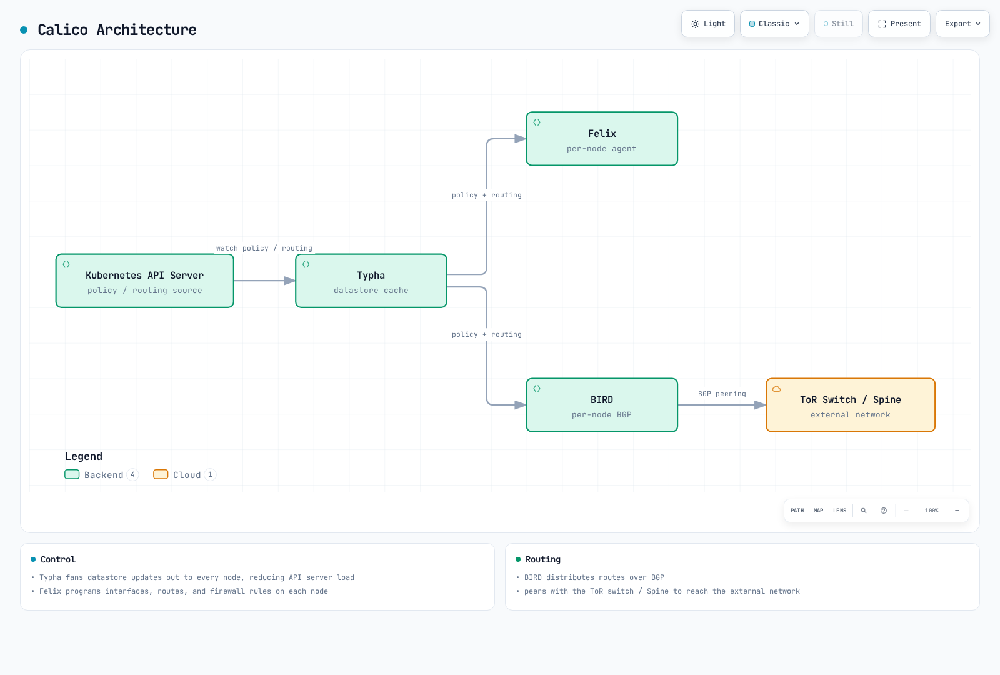

[🔍 インタラクティブな図を表示](https://www.atomai.click/kubernetes-docs/archmaps/en-networking-calico-02-architecture-0.html)

## Felix: Calico エージェント

Felix は、クラスター内のすべてのノードで実行される主要な Calico エージェントです。必要な接続性とネットワークポリシーの適用を提供するため、ホスト上のルートおよび ACL（Access Control List）をプログラムします。

### Felix の責務

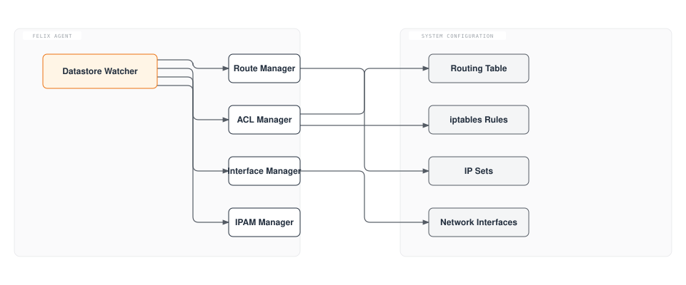

### コア機能

1. **ルートのプログラミング**: Pod CIDR ブロックのルートを管理
2. **ACL の適用**: ネットワークポリシー用の iptables/nftables/eBPF ルールをプログラム
3. **インターフェース管理**: ワークロードエンドポイントのインターフェースを設定
4. **ヘルスレポート**: ノードおよびエンドポイントの正常性を datastore に報告
5. **IPAM の連携**: ローカルワークロードの IP アドレス割り当てを管理

### Felix のデータプレーンオプション

Felix は複数のデータプレーンバックエンドをサポートしています。

| データプレーン | 説明                   | 最適な用途                             |
| ------------ | ---------------------- | -------------------------------------- |
| **iptables** | 従来の Linux ファイアウォール | 互換性、成熟したデプロイメント                 |
| **nftables** | 最新の Linux ファイアウォール | 新しいカーネル、より優れたパフォーマンス         |
| **eBPF**     | カーネル内でプログラム可能     | 最大のパフォーマンス、kube-proxy の置き換え |

### FelixConfiguration リソース

```yaml
apiVersion: projectcalico.org/v3
kind: FelixConfiguration
metadata:
  name: default
spec:
  # Logging configuration
  logSeverityScreen: Info
  logSeverityFile: Warning
  logFilePath: /var/log/calico/felix.log

  # Data plane selection
  bpfEnabled: false                    # Set true for eBPF data plane
  bpfDataIfacePattern: ^((en|wl|eth).*|bond[0-9]+)$
  bpfConnectTimeLoadBalancingEnabled: true
  bpfExternalServiceMode: Tunnel

  # iptables configuration
  iptablesBackend: Auto               # Auto, Legacy, NFT
  iptablesRefreshInterval: 90s
  iptablesPostWriteCheckIntervalSecs: 1
  iptablesLockFilePath: /run/xtables.lock
  iptablesLockTimeoutSecs: 0
  iptablesLockProbeIntervalMillis: 50

  # Performance tuning
  ipipMTU: 1440
  vxlanMTU: 1410
  wireguardMTU: 1420

  # Health and metrics
  healthEnabled: true
  healthPort: 9099
  prometheusMetricsEnabled: true
  prometheusMetricsPort: 9091
  prometheusGoMetricsEnabled: true
  prometheusProcessMetricsEnabled: true

  # Policy configuration
  defaultEndpointToHostAction: Drop
  failsafeInboundHostPorts:
    - protocol: TCP
      port: 22
    - protocol: UDP
      port: 68
  failsafeOutboundHostPorts:
    - protocol: UDP
      port: 53
    - protocol: UDP
      port: 67

  # Interface configuration
  interfacePrefix: cali
  chainInsertMode: Insert

  # Reporting
  reportingIntervalSecs: 30
  reportingTTLSecs: 90
```

### Felix の iptables ルール構造

Felix は効率的な処理のため、iptables ルールをチェーンに編成します。

```
                         ┌─────────────────────────────────────────┐
                         │              FORWARD Chain              │
                         └─────────────────┬───────────────────────┘
                                           │
                         ┌─────────────────▼───────────────────────┐
                         │          cali-FORWARD (Calico)          │
                         └─────────────────┬───────────────────────┘
                                           │
              ┌────────────────────────────┼────────────────────────────┐
              │                            │                            │
┌─────────────▼─────────────┐ ┌────────────▼────────────┐ ┌─────────────▼─────────────┐
│   cali-from-wl-dispatch   │ │   cali-to-wl-dispatch   │ │    cali-from-host-ep     │
│  (from workload traffic)  │ │  (to workload traffic)  │ │   (from host endpoints)   │
└─────────────┬─────────────┘ └────────────┬────────────┘ └─────────────┬─────────────┘
              │                            │                            │
┌─────────────▼─────────────┐ ┌────────────▼────────────┐ ┌─────────────▼─────────────┐
│    cali-fw-caliXXXXXX     │ │    cali-tw-caliXXXXXX   │ │    Per-endpoint policy    │
│    (per-endpoint rules)   │ │   (per-endpoint rules)  │ │          chains           │
└───────────────────────────┘ └─────────────────────────┘ └───────────────────────────┘
```

### Felix のデータフロー

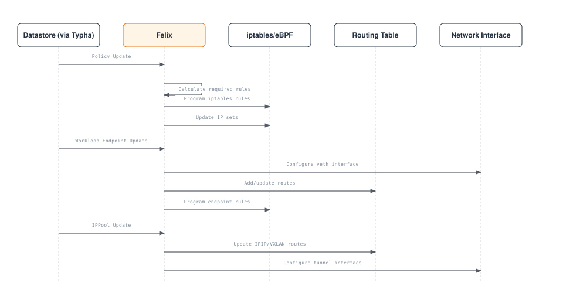

## BIRD: BGP ルーティングデーモン

BIRD（BIRD Internet Routing Daemon）は、ノード間でルートを配布するために Calico が使用する BGP デーモンです。

### Calico アーキテクチャにおける BIRD

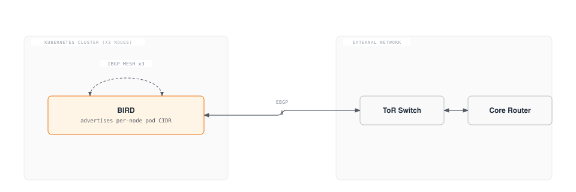

### BGP セッションタイプ

| セッションタイプ           | ユースケース                  | 設定                     |
| --------------------- | --------------------------- | ---------------------- |
| **Node-to-Node Mesh** | 小規模クラスターのデフォルト     | 自動、フルメッシュ          |
| **Route Reflector**   | 大規模クラスター（100+ ノード） | 専用の RR ノード          |
| **External Peering**  | オンプレミス統合              | 手動による BGP ピア設定 |

### BGP 設定例

#### Node-to-Node Mesh（デフォルト）

```yaml
apiVersion: projectcalico.org/v3
kind: BGPConfiguration
metadata:
  name: default
spec:
  logSeverityScreen: Info
  nodeToNodeMeshEnabled: true
  asNumber: 64512
```

#### Route Reflector の設定

```yaml
# Disable node-to-node mesh
apiVersion: projectcalico.org/v3
kind: BGPConfiguration
metadata:
  name: default
spec:
  nodeToNodeMeshEnabled: false
  asNumber: 64512
---
# Configure route reflector nodes
apiVersion: projectcalico.org/v3
kind: Node
metadata:
  name: node-rr-1
  labels:
    route-reflector: "true"
spec:
  bgp:
    routeReflectorClusterID: 224.0.0.1
---
# Configure BGP peer to route reflector
apiVersion: projectcalico.org/v3
kind: BGPPeer
metadata:
  name: peer-to-rr
spec:
  nodeSelector: "!has(route-reflector)"
  peerSelector: route-reflector == "true"
```

#### 外部 BGP ピアリング

```yaml
apiVersion: projectcalico.org/v3
kind: BGPPeer
metadata:
  name: tor-switch-peer
spec:
  peerIP: 10.0.0.1
  asNumber: 65001
  nodeSelector: rack == 'rack-1'
  password:
    secretKeyRef:
      name: bgp-passwords
      key: tor-password
  sourceAddress: UseNodeIP
  keepOriginalNextHop: false
```

### ルート伝播プロセス

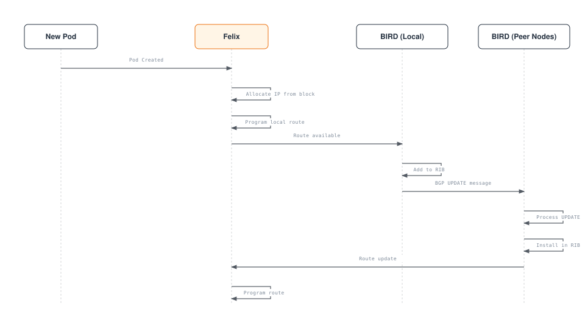

### BIRD ステータスコマンド

```bash
# Access BIRD CLI on a Calico node
kubectl exec -n calico-system calico-node-xxxxx -c calico-node -- birdcl

# Show BGP protocol status
birdcl> show protocols
name     proto    table    state  since       info
kernel1  Kernel   master   up     2024-01-01
device1  Device   master   up     2024-01-01
direct1  Direct   master   up     2024-01-01
Mesh_10_0_1_10  BGP  master  up   2024-01-01  Established
Mesh_10_0_1_11  BGP  master  up   2024-01-01  Established

# Show BGP routes
birdcl> show route protocol Mesh_10_0_1_10
192.168.1.0/26     via 10.0.1.10 on eth0 [Mesh_10_0_1_10 2024-01-01] * (100/0) [i]
192.168.1.64/26    via 10.0.1.10 on eth0 [Mesh_10_0_1_10 2024-01-01] * (100/0) [i]

# Show route details
birdcl> show route 192.168.1.0/26 all
```

## confd: 設定管理

confd は、Calico datastore を監視し、BIRD 設定ファイルを生成する軽量な設定管理ツールです。

### confd のワークフロー

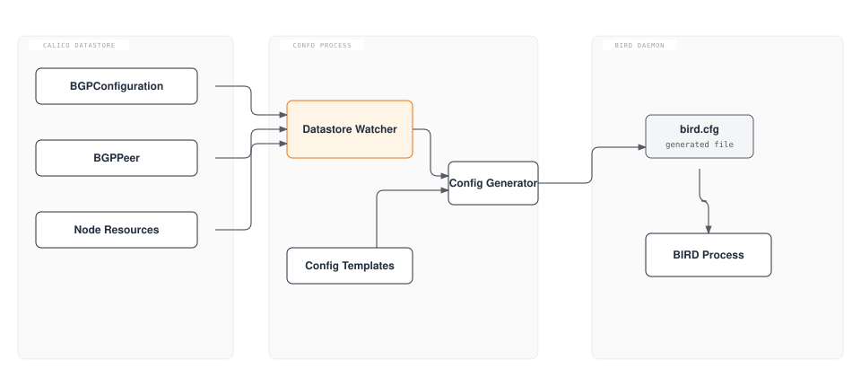

### confd のテンプレート処理

confd は Go テンプレートを使用して BIRD 設定を生成します。

```
# Template: /etc/calico/confd/templates/bird.cfg.template
# Output: /etc/calico/confd/config/bird.cfg

router id {{.NodeIP}};

protocol kernel {
    learn;
    persist;
    scan time 2;
    import all;
    export {{if .ExportKernel}}all{{else}}none{{end}};
}

protocol device {
    scan time 2;
}

{{range .BGPPeers}}
protocol bgp {{.Name}} {
    local as {{$.LocalAS}};
    neighbor {{.PeerIP}} as {{.PeerAS}};
    import all;
    export {{if .ExportFilter}}filter {{.ExportFilter}}{{else}}all{{end}};
    {{if .Password}}password "{{.Password}}";{{end}}
    graceful restart;
}
{{end}}
```

## Typha: スケーリングコンポーネント

Typha は Kubernetes API server と Felix エージェントの間に配置される fan-out プロキシです。datastore の更新をキャッシュして配布することで、API server の負荷を軽減します。

### Typha が必要な理由

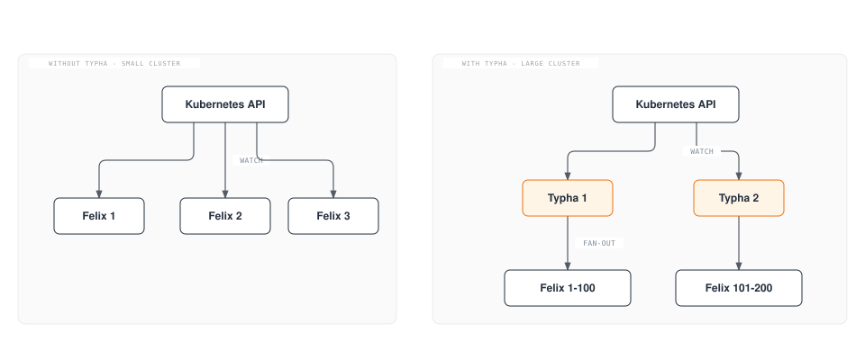

### Typha のスケーリング計算

推奨される Typha レプリカ数は、クラスターのサイズによって異なります。

```
Typha Replicas = max(3, ceil(Nodes / 200))

Examples:
- 50 nodes:   3 Typha replicas (minimum)
- 200 nodes:  3 Typha replicas
- 500 nodes:  3 Typha replicas
- 1000 nodes: 5 Typha replicas
- 2000 nodes: 10 Typha replicas
```

### Typha Deployment 設定

```yaml
apiVersion: apps/v1
kind: Deployment
metadata:
  name: calico-typha
  namespace: calico-system
spec:
  replicas: 3
  revisionHistoryLimit: 2
  selector:
    matchLabels:
      k8s-app: calico-typha
  strategy:
    type: RollingUpdate
    rollingUpdate:
      maxSurge: 1
      maxUnavailable: 1
  template:
    metadata:
      labels:
        k8s-app: calico-typha
    spec:
      nodeSelector:
        kubernetes.io/os: linux
      tolerations:
      - key: CriticalAddonsOnly
        operator: Exists
      priorityClassName: system-cluster-critical
      serviceAccountName: calico-typha
      containers:
      - name: calico-typha
        image: calico/typha:v3.29.0
        ports:
        - containerPort: 5473
          name: calico-typha
          protocol: TCP
        env:
        - name: TYPHA_LOGSEVERITYSCREEN
          value: "info"
        - name: TYPHA_LOGFILEPATH
          value: "none"
        - name: TYPHA_LOGSEVERITYSYS
          value: "none"
        - name: TYPHA_CONNECTIONREBALANCINGMODE
          value: "kubernetes"
        - name: TYPHA_DATASTORETYPE
          value: "kubernetes"
        - name: TYPHA_HEALTHENABLED
          value: "true"
        - name: TYPHA_PROMETHEUSMETRICSENABLED
          value: "true"
        - name: TYPHA_PROMETHEUSMETRICSPORT
          value: "9093"
        livenessProbe:
          httpGet:
            path: /liveness
            port: 9098
          periodSeconds: 30
          initialDelaySeconds: 30
        readinessProbe:
          httpGet:
            path: /readiness
            port: 9098
          periodSeconds: 10
        resources:
          requests:
            cpu: 100m
            memory: 128Mi
          limits:
            cpu: 1000m
            memory: 512Mi
---
apiVersion: v1
kind: Service
metadata:
  name: calico-typha
  namespace: calico-system
spec:
  ports:
  - port: 5473
    protocol: TCP
    targetPort: calico-typha
    name: calico-typha
  selector:
    k8s-app: calico-typha
```

### Typha の fan-out アーキテクチャ

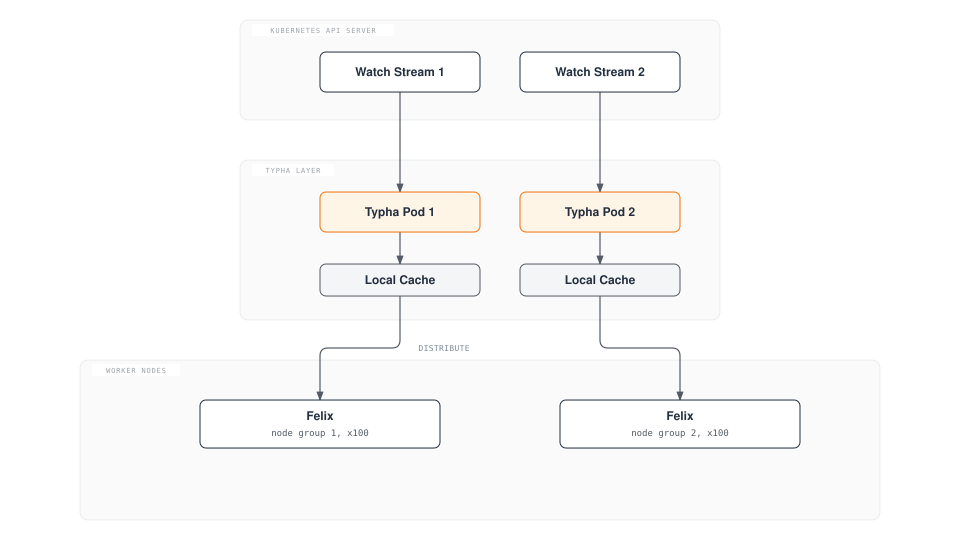

## kube-controllers: Kubernetes 統合

calico-kube-controllers Pod は、Kubernetes リソースを Calico datastore と同期する一連のコントローラーを実行します。

### コントローラーの概要

| コントローラー                      | 目的                                              |
| ------------------------------- | ------------------------------------------------- |
| **Node Controller**             | Kubernetes ノードを Calico ノードリソースと同期する |
| **Policy Controller**           | Kubernetes NetworkPolicy を Calico ポリシーと同期する |
| **Namespace Controller**        | プロファイル管理のため Namespace ラベルを同期する     |
| **ServiceAccount Controller**   | RBAC のため ServiceAccount ラベルを同期する             |
| **WorkloadEndpoint Controller** | 古いワークロードエンドポイントをクリーンアップする                |

### コントローラーの調整ループ

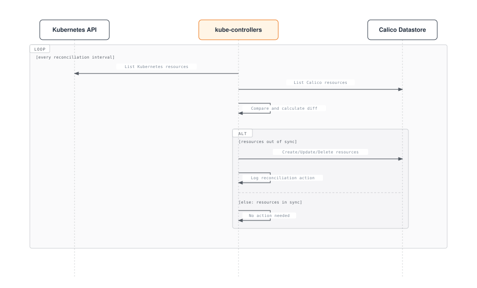

### kube-controllers 設定

```yaml
apiVersion: v1
kind: ConfigMap
metadata:
  name: calico-kube-controllers-config
  namespace: calico-system
data:
  config: |
    {
      "logSeverityScreen": "info",
      "healthEnabled": true,
      "prometheusPort": 9094,
      "controllers": {
        "node": {
          "hostEndpoint": {
            "autoCreate": "Disabled"
          },
          "syncLabels": "Enabled",
          "leakGracePeriod": "15m"
        },
        "policy": {
          "reconcilerPeriod": "5m"
        },
        "workloadEndpoint": {
          "reconcilerPeriod": "5m"
        },
        "namespace": {
          "reconcilerPeriod": "5m"
        },
        "serviceAccount": {
          "reconcilerPeriod": "5m"
        }
      }
    }
```

## Datastore オプション

Calico は、設定と状態を保存するための 2 つの datastore バックエンドをサポートします。

### Kubernetes API Datastore（推奨）

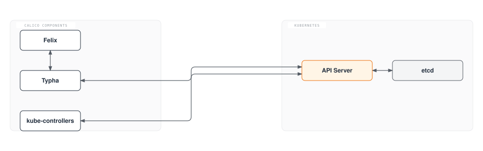

**利点:**

* 管理する個別の etcd クラスターが不要
* アクセス制御に Kubernetes RBAC を使用
* よりシンプルな運用モデル
* 任意の Kubernetes ディストリビューションで動作

### etcd Datastore（レガシー）

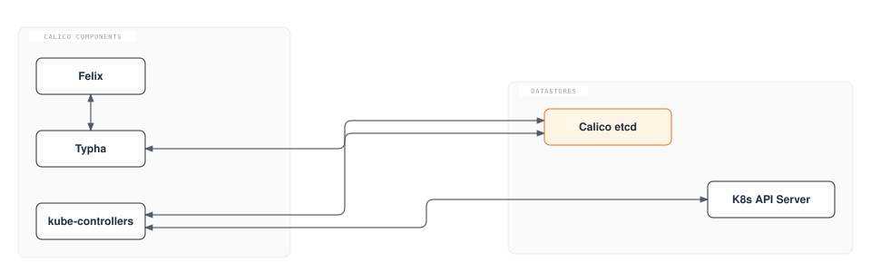

**利点:**

* Kubernetes API server から分離される
* Kubernetes 以外のワークロード（VM、ベアメタル）にも使用可能
* 非常に大規模なクラスター向けの歴史的な選択肢

### Datastore の比較

| 機能                       | Kubernetes API       | etcd                   |
| -------------------------- | ----------------- | ------------------ |
| **運用の複雑さ** | 低い             | 高い             |
| **スケーラビリティ**            | 良好（Typha 使用時） | 優れている          |
| **非 K8s ワークロード**      | 制限あり           | 完全サポート       |
| **バックアップ/リストア**         | K8s 経由           | 個別のツール       |
| **アクセス制御**         | K8s RBAC          | etcd 認証          |
| **推奨**         | デフォルトの選択    | 特殊なケースのみ |

## コンポーネント相互作用のシーケンス

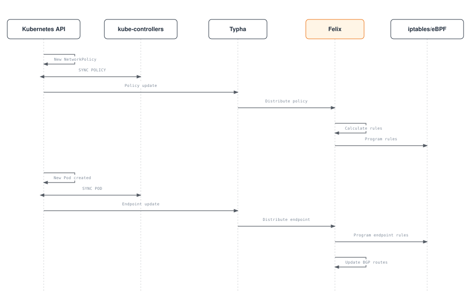

## パケットフロー分析

### Ingress パケットフロー（Pod 間、同一ノード）

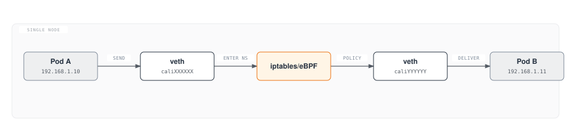

### Egress パケットフロー（Pod 間、IPIP を使用する異なるノード）

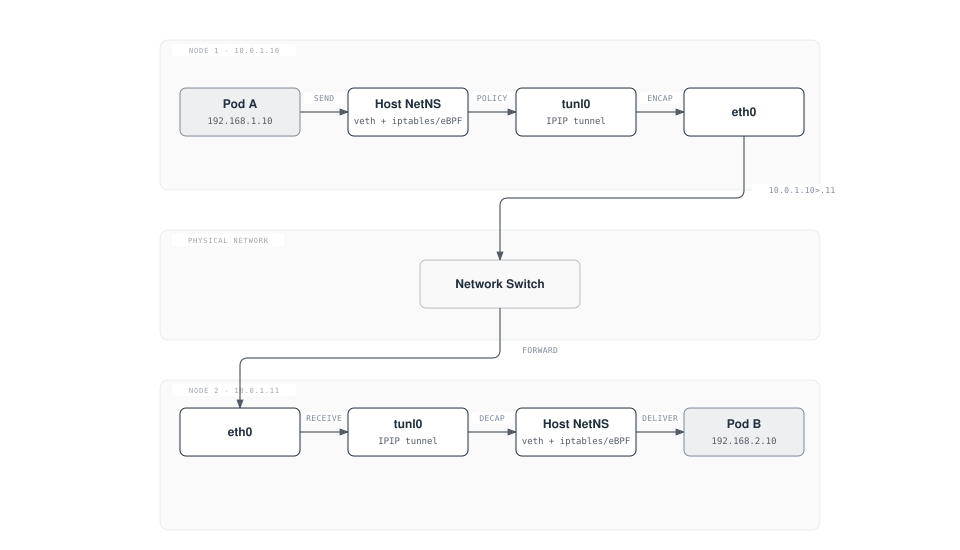

### パケット構造の比較

```
Original Pod-to-Pod Packet:
┌─────────────────────────────────────────────────────────────┐
│ Ethernet │   IP Header    │   TCP/UDP   │     Payload      │
│  Header  │ Src: 192.168.1.10 │   Header    │                  │
│          │ Dst: 192.168.2.10 │             │                  │
└─────────────────────────────────────────────────────────────┘

IPIP Encapsulated Packet:
┌───────────────────────────────────────────────────────────────────────────────┐
│ Ethernet │   Outer IP     │   Inner IP     │   TCP/UDP   │     Payload      │
│  Header  │ Src: 10.0.1.10 │ Src: 192.168.1.10 │   Header    │                  │
│          │ Dst: 10.0.1.11 │ Dst: 192.168.2.10 │             │                  │
│          │ Proto: 4 (IPIP)│                │             │                  │
└───────────────────────────────────────────────────────────────────────────────┘
```

## まとめ

Calico のアーキテクチャは、スケーラビリティ、パフォーマンス、運用の簡潔さを考慮して設計されています。

1. **Felix**: すべてのノードで動作し、ルートと ACL をプログラムする主力エージェント
2. **BIRD**: BGP 経由でルートを配布し、ネイティブなルーティング統合を実現
3. **confd**: datastore と BIRD 設定の橋渡しを担う
4. **Typha**: API server の負荷を軽減することでシステムをスケールさせる
5. **kube-controllers**: Kubernetes と Calico の同期を維持する
6. **Datastore**: 設定ストレージ用の Kubernetes API（推奨）または etcd

これらのコンポーネントとその相互作用を理解することは、以下に不可欠です。

* 接続性に関する問題のトラブルシューティング
* 大規模環境でのパフォーマンス最適化
* キャパシティとアーキテクチャの計画
* 既存のネットワークインフラストラクチャとの統合

[前へ: パート 1 - Calico の概要](01-introduction.md)

[次へ: パート 3 - ネットワーキングモード](03-networking-modes.md)

[Calico 概要に戻る](./README.md)

## クイズ

この章で学んだ内容を確認するには、[アーキテクチャクイズ](../../quizzes/networking/calico/02-architecture-quiz.md)に挑戦してください。
