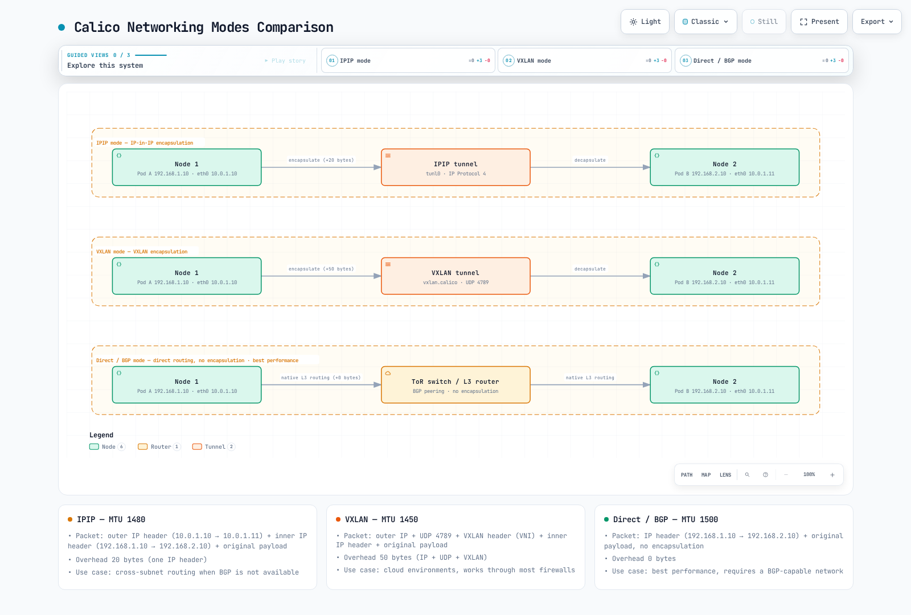

# パート 3: ネットワーキングモード

> **対応バージョン**: Calico v3.29+ / Kubernetes 1.28+ **最終更新**: February 23, 2026

## 概要

Calico は、さまざまなインフラストラクチャ要件、パフォーマンスニーズ、運用上の制約に対応するため、複数のネットワーキングモードをサポートしています。このセクションでは、各ネットワーキングモードを詳しく解説し、環境に最適なモードを選択して構成できるようにします。

## ネットワーキングモードの概要



[🔍 インタラクティブ図を表示](https://www.atomai.click/kubernetes-docs/archmaps/en-networking-calico-03-networking-modes-7.html)

## IPIP モード

IP-in-IP (IPIP) は Calico のデフォルトのカプセル化モードです。サブネット間通信のために、元の IP パケットを別の IP パケットでラップします。

### IPIP パケット構造

```
Standard IP Packet (1500 bytes MTU):
┌──────────────────────────────────────────────────────────────────┐
│ Ethernet │    IP Header (20B)    │  TCP/UDP  │     Payload      │
│   (14B)  │ Src: 192.168.1.10     │   (20B)   │   (up to 1460B)  │
│          │ Dst: 192.168.2.10     │           │                   │
└──────────────────────────────────────────────────────────────────┘

IPIP Encapsulated Packet (1500 bytes outer MTU):
┌───────────────────────────────────────────────────────────────────────────────┐
│ Ethernet │  Outer IP (20B)   │  Inner IP (20B)   │ TCP/UDP │    Payload     │
│   (14B)  │ Src: 10.0.1.10    │ Src: 192.168.1.10 │  (20B)  │ (up to 1440B)  │
│          │ Dst: 10.0.1.11    │ Dst: 192.168.2.10 │         │                │
│          │ Proto: 4 (IPIP)   │                   │         │                │
└───────────────────────────────────────────────────────────────────────────────┘
                                ▲
                                │
                         20 bytes overhead
                         Effective MTU: 1480
```

### IPIP モードのオプション

| モード            | 説明                               | ユースケース                                   |
| --------------- | ----------------------------------------- | ------------------------------------------ |
| **Always**      | すべての Pod 間トラフィックをカプセル化する    | クラウド環境、シンプルなセットアップ           |
| **CrossSubnet** | サブネット間のトラフィックのみをカプセル化する | ハイブリッド環境、最適化されたパフォーマンス |
| **Never**       | IPIP を無効化する（Direct ルーティングで使用）   | BGP を使用するオンプレミス環境                       |

### IPIP CrossSubnet モード

CrossSubnet は、L3 境界を越えるトラフィックのみをカプセル化する最適化です:


### IPIP IPPool 構成

```yaml
apiVersion: projectcalico.org/v3
kind: IPPool
metadata:
  name: default-ipv4-ippool
spec:
  cidr: 192.168.0.0/16
  blockSize: 26                    # /26 = 64 IPs per block
  ipipMode: Always                 # Options: Always, CrossSubnet, Never
  vxlanMode: Never
  natOutgoing: true
  nodeSelector: all()
---
# CrossSubnet mode for optimized performance
apiVersion: projectcalico.org/v3
kind: IPPool
metadata:
  name: crosssubnet-ippool
spec:
  cidr: 10.244.0.0/16
  blockSize: 26
  ipipMode: CrossSubnet
  vxlanMode: Never
  natOutgoing: true
  nodeSelector: all()
```

### IPIP トンネルインターフェイス

```bash
# View IPIP tunnel interface on a node
ip link show tunl0

# Expected output:
# tunl0@NONE: <NOARP,UP,LOWER_UP> mtu 1480 qdisc noqueue state UNKNOWN mode DEFAULT group default qlen 1000
#     link/ipip 0.0.0.0 brd 0.0.0.0

# View IPIP routes
ip route | grep tunl0

# Expected output:
# 192.168.2.0/26 via 10.0.1.11 dev tunl0 proto bird onlink
# 192.168.3.0/26 via 10.0.1.12 dev tunl0 proto bird onlink
```

### IPIP パケットフロー図


## VXLAN モード

VXLAN (Virtual Extensible LAN) は、Layer 2 フレームを UDP パケットにカプセル化する業界標準のオーバーレイプロトコルです。

### VXLAN パケット構造

```
VXLAN Encapsulated Packet:
┌─────────────────────────────────────────────────────────────────────────────────────────┐
│ Outer    │ Outer IP (20B)   │  UDP (8B)  │ VXLAN  │ Inner    │ Inner IP │ TCP/ │ Pay- │
│ Ethernet │ Src: 10.0.1.10   │ Src: rand  │ Header │ Ethernet │  (20B)   │ UDP  │ load │
│  (14B)   │ Dst: 10.0.1.11   │ Dst: 4789  │  (8B)  │  (14B)   │          │(20B) │      │
└─────────────────────────────────────────────────────────────────────────────────────────┘
                                                      ▲
                                                      │
                                               50 bytes overhead
                                               Effective MTU: 1450
```

### VXLAN コンポーネント

| コンポーネント             | 説明                                      |
| --------------------- | ------------------------------------------------ |
| **VTEP**              | VXLAN Tunnel Endpoint - カプセル化/デカプセル化ポイント        |
| **VNI**               | VXLAN Network Identifier (Calico は固定 VNI を使用) |
| **UDP Port**          | 4789 (IANA 割り当て)                             |
| **Multicast/Unicast** | Calico は既知のピア VTEP との unicast を使用        |

### VXLAN IPPool 構成

```yaml
apiVersion: projectcalico.org/v3
kind: IPPool
metadata:
  name: vxlan-ippool
spec:
  cidr: 10.244.0.0/16
  blockSize: 26
  ipipMode: Never
  vxlanMode: Always                # Options: Always, CrossSubnet, Never
  natOutgoing: true
  nodeSelector: all()
---
# VXLAN CrossSubnet mode
apiVersion: projectcalico.org/v3
kind: IPPool
metadata:
  name: vxlan-crosssubnet-ippool
spec:
  cidr: 10.245.0.0/16
  blockSize: 26
  ipipMode: Never
  vxlanMode: CrossSubnet
  natOutgoing: true
  nodeSelector: all()
```

### VXLAN インターフェイス構成

```bash
# View VXLAN interface
ip link show vxlan.calico

# Expected output:
# vxlan.calico: <BROADCAST,MULTICAST,UP,LOWER_UP> mtu 1450 qdisc noqueue state UNKNOWN mode DEFAULT group default
#     link/ether 66:5b:5c:5d:5e:5f brd ff:ff:ff:ff:ff:ff

# View VXLAN FDB (Forwarding Database)
bridge fdb show dev vxlan.calico

# Expected output:
# 66:a1:a2:a3:a4:a5 dst 10.0.1.11 self permanent
# 66:b1:b2:b3:b4:b5 dst 10.0.1.12 self permanent

# View VXLAN routes
ip route | grep vxlan

# Expected output:
# 10.244.1.0/26 via 10.244.1.0 dev vxlan.calico onlink
# 10.244.2.0/26 via 10.244.2.0 dev vxlan.calico onlink
```

### VXLAN パケットフロー


## Direct/非カプセル化モード

Direct ルーティングモードは、カプセル化を使用せずネイティブ IP ルーティングを使用するため、可能な限り最高のパフォーマンスを提供します。

### Direct モードの要件

| 要件           | 説明                                    |
| --------------------- | ---------------------------------------------- |
| **L2 隣接性**      | Node は同じ L2 ネットワーク上にある必要があります、または       |
| **BGP ルーティング**       | 外部ルーターは BGP 経由で Pod ルートを学習する必要があります |
| **ルート伝播** | 物理ネットワークは Pod CIDR をルーティングする必要があります          |

### Direct モードのトポロジー


### Direct モードの IPPool 構成

```yaml
apiVersion: projectcalico.org/v3
kind: IPPool
metadata:
  name: direct-routing-pool
spec:
  cidr: 192.168.0.0/16
  blockSize: 26
  ipipMode: Never                  # Disable IPIP
  vxlanMode: Never                 # Disable VXLAN
  natOutgoing: true
  nodeSelector: all()
```

### Direct モードの BGP 構成

```yaml
# Global BGP configuration
apiVersion: projectcalico.org/v3
kind: BGPConfiguration
metadata:
  name: default
spec:
  logSeverityScreen: Info
  nodeToNodeMeshEnabled: true      # Full mesh for small clusters
  asNumber: 64512
---
# Peer with ToR switches
apiVersion: projectcalico.org/v3
kind: BGPPeer
metadata:
  name: rack1-tor
spec:
  peerIP: 10.0.1.1
  asNumber: 65001
  nodeSelector: rack == 'rack1'
---
apiVersion: projectcalico.org/v3
kind: BGPPeer
metadata:
  name: rack2-tor
spec:
  peerIP: 10.0.2.1
  asNumber: 65001
  nodeSelector: rack == 'rack2'
```

### Direct モードのルート

```bash
# View routes on a node in direct mode
ip route

# Expected output (no tunnel interfaces):
# default via 10.0.1.1 dev eth0
# 10.0.1.0/24 dev eth0 proto kernel scope link src 10.0.1.10
# 192.168.1.0/26 dev cali123456 scope link           # Local pods
# 192.168.1.64/26 via 10.0.1.11 dev eth0 proto bird  # Node 2 pods
# 192.168.2.0/26 via 10.0.1.1 dev eth0 proto bird    # Rack 2 via ToR
# 192.168.2.64/26 via 10.0.1.1 dev eth0 proto bird   # Rack 2 via ToR
```

## モード比較

### IPIP vs VXLAN vs Direct

| 機能               | IPIP                | VXLAN                | Direct       |
| --------------------- | ------------------- | -------------------- | ------------ |
| **プロトコル**          | IP Protocol 4       | UDP Port 4789        | ネイティブ IP    |
| **オーバーヘッド**          | 20 バイト            | 50 バイト             | 0 バイト      |
| **MTU**               | 1480                | 1450                 | 1500         |
| **ファイアウォール互換性** | IP proto 4 が必要な場合がある | UDP パススルー     | ネイティブ       |
| **ハードウェアオフロード**  | 制限あり             | より優れたサポート       | 完全サポート |
| **L2 要件**    | いいえ                  | いいえ                   | はい（または BGP） |
| **Multicast**         | 不要          | 不要（unicast） | 不要   |
| **パフォーマンス**       | 良好                | 良好                 | 最高         |
| **複雑性**        | 低                   | 低                  | 中       |

### パフォーマンスベンチマーク比較

```
Test Environment:
- Nodes: 3x c5.xlarge (AWS)
- Network: 10 Gbps
- Tool: iperf3 TCP, 60 second test

Results (TCP throughput, single stream):

┌─────────────────────────────────────────────────────────────┐
│                    Throughput (Gbps)                        │
├─────────────────────────────────────────────────────────────┤
│ Direct Mode      ████████████████████████████████  9.41     │
│ IPIP Mode        ███████████████████████████████   9.12     │
│ VXLAN Mode       ██████████████████████████████    8.89     │
└─────────────────────────────────────────────────────────────┘

Latency (microseconds, p99):

┌─────────────────────────────────────────────────────────────┐
│                    Latency (μs)                             │
├─────────────────────────────────────────────────────────────┤
│ Direct Mode      ████                              45       │
│ IPIP Mode        █████                             52       │
│ VXLAN Mode       ██████                            61       │
└─────────────────────────────────────────────────────────────┘

CPU Usage (% per Gbps):

┌─────────────────────────────────────────────────────────────┐
│                    CPU (% per Gbps)                         │
├─────────────────────────────────────────────────────────────┤
│ Direct Mode      ███                               2.1      │
│ IPIP Mode        ████                              2.8      │
│ VXLAN Mode       █████                             3.4      │
└─────────────────────────────────────────────────────────────┘
```

### パケットフロー比較


## クラウドプロバイダー互換性

| プロバイダー        | IPIP | VXLAN | Direct           | 推奨               |
| --------------- | ---- | ----- | ---------------- | ------------------------- |
| **AWS EC2**     | はい  | はい   | VPC ルーティングあり | VXLAN または IPIP CrossSubnet |
| **AWS EKS**     | はい  | はい   | 制限あり          | VXLAN（デフォルト）           |
| **Azure**       | はい  | はい   | UDR あり         | VXLAN                     |
| **GCP**         | はい  | はい   | VPC ルートあり  | IPIP CrossSubnet          |
| **オンプレミス** | はい  | はい   | はい（BGP）        | Direct（BGP 使用）         |
| **ベアメタル**  | はい  | はい   | はい              | Direct（BGP 使用）         |
| **OpenStack**   | はい  | はい   | はい              | neutron 構成に依存 |

### AWS 固有の構成

```yaml
# For AWS EC2/EKS with VXLAN
apiVersion: operator.tigera.io/v1
kind: Installation
metadata:
  name: default
spec:
  kubernetesProvider: EKS
  cni:
    type: Calico
  calicoNetwork:
    bgp: Disabled                  # AWS VPC doesn't support BGP
    ipPools:
    - cidr: 10.244.0.0/16
      encapsulation: VXLAN
      natOutgoing: Enabled
      nodeSelector: all()
```

### BGP を使用するオンプレミス

```yaml
# For on-premises with BGP peering
apiVersion: operator.tigera.io/v1
kind: Installation
metadata:
  name: default
spec:
  kubernetesProvider: ""
  cni:
    type: Calico
  calicoNetwork:
    bgp: Enabled
    ipPools:
    - cidr: 192.168.0.0/16
      encapsulation: None          # Direct routing
      natOutgoing: Enabled
      nodeSelector: all()
```

## モード移行ガイド

### IPIP から VXLAN への移行

```bash
# Step 1: Create new VXLAN IPPool
cat <<EOF | kubectl apply -f -
apiVersion: projectcalico.org/v3
kind: IPPool
metadata:
  name: vxlan-pool
spec:
  cidr: 10.245.0.0/16
  blockSize: 26
  ipipMode: Never
  vxlanMode: Always
  natOutgoing: true
  nodeSelector: all()
EOF

# Step 2: Disable old IPIP pool (prevents new allocations)
calicoctl patch ippool default-ipv4-ippool -p '{"spec": {"disabled": true}}'

# Step 3: Rolling restart workloads to get new IPs
kubectl rollout restart deployment -n <namespace>

# Step 4: After all pods migrated, delete old pool
calicoctl delete ippool default-ipv4-ippool
```

### オーバーレイから Direct への移行

```yaml
# Step 1: Ensure BGP is configured
apiVersion: projectcalico.org/v3
kind: BGPConfiguration
metadata:
  name: default
spec:
  nodeToNodeMeshEnabled: true
  asNumber: 64512
---
# Step 2: Configure BGP peers (for external routing)
apiVersion: projectcalico.org/v3
kind: BGPPeer
metadata:
  name: tor-peer
spec:
  peerIP: 10.0.0.1
  asNumber: 65001
---
# Step 3: Create direct mode IPPool
apiVersion: projectcalico.org/v3
kind: IPPool
metadata:
  name: direct-pool
spec:
  cidr: 192.168.0.0/16
  ipipMode: Never
  vxlanMode: Never
  natOutgoing: true
```

## MTU 最適化ガイド

### モード別 MTU 計算

| モード             | ベース MTU | オーバーヘッド | 有効 MTU | 構成        |
| ---------------- | -------- | -------- | ------------- | -------------------- |
| Direct           | 1500     | 0        | 1500          | 変更不要     |
| IPIP             | 1500     | 20       | 1480          | `ipipMTU: 1480`      |
| VXLAN            | 1500     | 50       | 1450          | `vxlanMTU: 1450`     |
| WireGuard        | 1500     | 60       | 1440          | `wireguardMTU: 1440` |
| IPIP + WireGuard | 1500     | 80       | 1420          | 合計オーバーヘッド    |

### MTU 構成

```yaml
apiVersion: projectcalico.org/v3
kind: FelixConfiguration
metadata:
  name: default
spec:
  # Auto-detect MTU (recommended)
  mtuIfacePattern: ^((en|wl|eth).*|bond[0-9]+)$

  # Or set explicit values
  ipipMTU: 1480
  vxlanMTU: 1450
  wireguardMTU: 1440
```

### ジャンボフレーム構成

```yaml
# For networks supporting jumbo frames (MTU 9000)
apiVersion: projectcalico.org/v3
kind: FelixConfiguration
metadata:
  name: default
spec:
  ipipMTU: 8980              # 9000 - 20 (IPIP overhead)
  vxlanMTU: 8950             # 9000 - 50 (VXLAN overhead)
```

### MTU の検証

```bash
# Check interface MTU
ip link show | grep mtu

# Test path MTU
ping -M do -s 1472 <destination-pod-ip>   # For 1500 MTU
ping -M do -s 1452 <destination-pod-ip>   # For IPIP (1480 MTU)
ping -M do -s 1422 <destination-pod-ip>   # For VXLAN (1450 MTU)

# Check for MTU issues in tcpdump
tcpdump -i eth0 'icmp[icmptype] == 3 and icmp[icmpcode] == 4'
```

## 決定フローチャート


## まとめ

最適な Calico パフォーマンスを得るには、適切なネットワーキングモードを選択することが重要です:

1. **IPIP モード**: クラウド環境向けのデフォルトの選択肢で、構成が簡単です
2. **VXLAN モード**: より優れたファイアウォール互換性を備えた標準オーバーレイプロトコルです
3. **Direct モード**: BGP インフラストラクチャを備えたオンプレミス環境で最大のパフォーマンスを発揮します

主な考慮事項:

* **クラウドデプロイメント**: VXLAN または IPIP CrossSubnet を使用します
* **BGP を使用するオンプレミス**: 最高のパフォーマンスには Direct モードを使用します
* **混在環境**: IPIP または VXLAN CrossSubnet が適切なバランスを提供します
* **パフォーマンスが重要**: 適切な BGP 構成で Direct モードを使用します

[前へ: パート 2 - Calico アーキテクチャの詳細](02-architecture.md)

[Calico 概要に戻る](./README.md)

## クイズ

この章で学んだ内容をテストするには、[ネットワーキングモードクイズ](../../quizzes/networking/calico/03-networking-modes-quiz.md)に挑戦してください。
