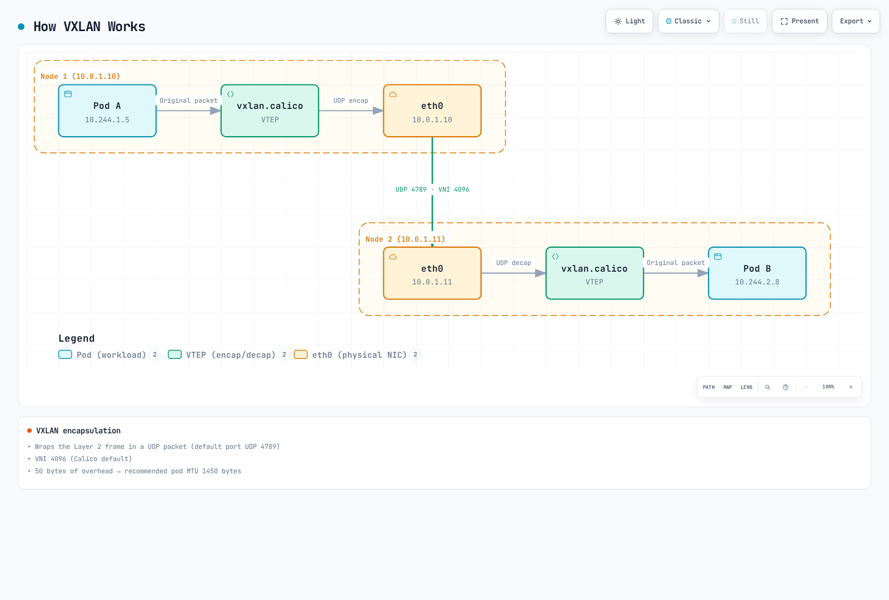
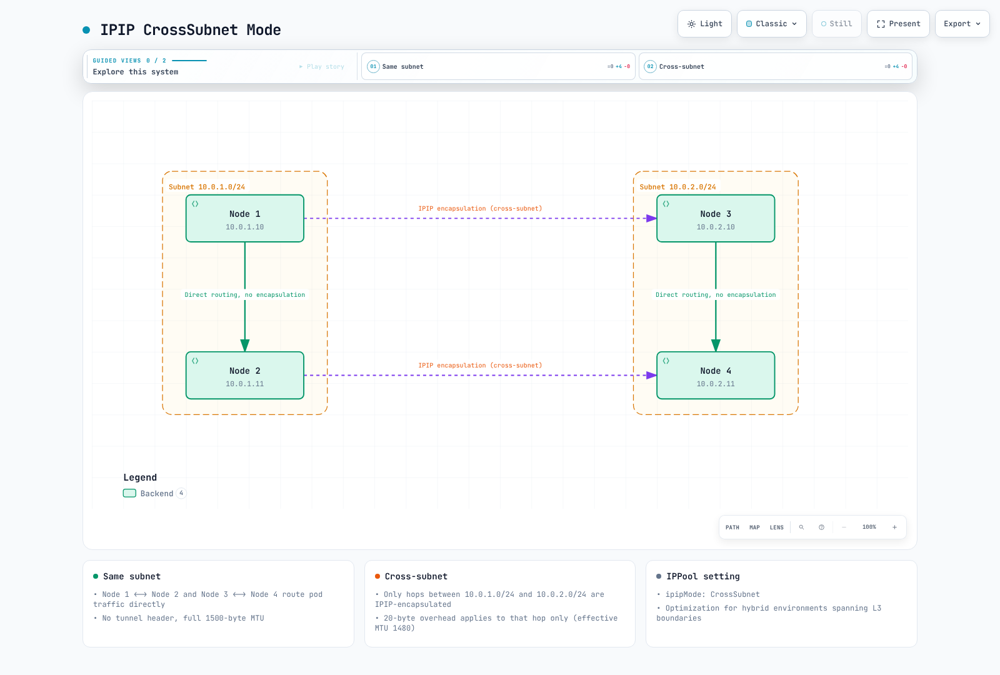

# 第3部: ネットワーキングモード

> **レビュー基準**: Calico Open Source 3.32.2 / operator 1.42.6。Kubernetes 1.34–1.36がCalico 3.32のテスト済み範囲です。
> **最終更新**: September 12, 2026。以下の過去のベンチマーク値は、新たな測定値ではなく未検証の報告として保持しています。

## 対象範囲とモード選択

この章はCalicoが担当するLinux PodネットワーキングとIPAMを扱います。EKSのポリシー専用モードではAmazon VPC CNIがPodネットワークを引き続き担当し、Calico IPPoolを作成してもオーバーレイへ切り替わりません。例は代替設計であり、一緒に適用したり、入門演習で作成済みのプールの上に適用したりするマニフェストではありません。監査ではクラスター移行やネットワークベンチマークを行っていません。

| 選択肢 | 意味 | 重要な境界 |
|---|---|---|
| IPIP | IPv4-in-IPv4、IPプロトコル4 | Calico IPIPはIPv4専用。アンダーレイで許可が必要 |
| VXLAN | 内側のEthernetをUDPで搬送。Calicoのデフォルトポートは4789 | 外側IPv4とIPv6ではオーバーヘッドが異なる。ポート/VNIは設定可能 |
| 直接 / 非カプセル化 | PodネットワークのオーバーレイなしにPod IPパケットをルーティング | アンダーレイと復路でPodアドレスへのルーティングが必要 |
| CrossSubnet | IPIPまたはVXLANの設定 | 該当ノードアドレスが異なる設定済みサブネットにある場合のみノード間通信をカプセル化 |

`Always`は設定プール内アドレスへの該当ノード間通信を対象とし、同一ノード通信に物理トンネルは不要です。`Never`はそのカプセル化を無効にし、すべてのネットワークを無効にするものではありません。CrossSubnetはAZ、リージョン、WANリンクの検出器ではありません。同一AZの2サブネットでもカプセル化が必要な場合があります。Calicoが使うノードアドレスとサブネットマスクを確認してください。

デフォルトはインストール/プロバイダーとデータプレーンに依存します。「全クラウドでIPIPがデフォルト」という普遍的規則も、Directが常に最速という保証もありません。[オーバーレイガイド](https://docs.tigera.io/calico/latest/networking/configuring/vxlan-ipip)が対応ルーティング経路を説明します。

### ルーティングとカプセル化は別の選択

デフォルトではFelixがVXLANプールの経路を、confd/BIRDがIPIPと非カプセル化プールのクラスター経路を設定します。Calico 3.32は非VXLAN経路にも`Installation.spec.calicoNetwork.clusterRoutingMode: Felix`をサポートします。対応する低レベル設定はFelixの`programClusterRoutes: Enabled`とBGPの`programClusterRoutes: Disabled`です。Operator管理ならOperator設定を使用します。外部BGP広告には引き続きBGPが必要です。静的経路や適切なルーティングファブリックでもアンダーレイ到達性を提供できるため、すべての非カプセル化設計でBGPや同一L2隣接が必須ではありません。

## パケット構造とオーバーヘッド

以下は**アンダーレイのIP MTU**を使用します。外側EthernetヘッダーはこのIP MTUに含まれません。IPv4オプションや追加の内側VLANタグがない前提です。TCPオプションや他のカプセル化により、ペイロードはさらに減る場合があります。

```text
Direct: outer Ethernet | Pod IP | TCP or UDP | payload
IPIP:   outer Ethernet | outer IPv4 | Pod IPv4 | TCP or UDP | payload
VXLAN:  outer Ethernet | outer IP | UDP | VXLAN | inner Ethernet | Pod IP | TCP or UDP | payload
```

| トランスポート | Pod IPパケットに加わるオーバーヘッド | アンダーレイIP MTUが1500の場合のPod IP MTU |
|---|---|---|
| Direct、他のトンネルなし | 0 | 1500 |
| IPIP、外側IPv4 | 20 | 1480 |
| VXLAN、外側IPv4 | 20 + 8 + 8 + 14 = 50 | 1450 |
| VXLAN、外側IPv6 | 40 + 8 + 8 + 14 = 70 | 1430 |
| WireGuard、外側IPv4 | 60 | 1440 |
| WireGuard、外側IPv6 | 80 | 1420 |

VXLANのMTUオーバーヘッド内の14バイトは**内側Ethernetヘッダー**で、外側ではありません。通常のTCPは最低20バイト、UDPは8バイトのヘッダーを持ちます。この前提では1500バイトのIPv4 IPパケットに、最大1460バイトのTCPペイロードか1472バイトのUDPペイロードを格納できます。元の共通ラベル「TCP/UDP = 20バイト」は誤りでした。

IPIPのプロトコル番号は4であり、TCP/UDPポート4ではありません。Calicoの通常のVXLAN VNIは4096、デフォルトUDPポートは4789ですが、どちらも設定可能です。他の現行VXLAN実装は8472を使う場合があり、古いソフトウェアに限りません。[IP-in-IP](https://www.rfc-editor.org/rfc/rfc2003)と[VXLAN](https://www.rfc-editor.org/rfc/rfc7348)を参照してください。

### パケット経路の図解


[🔍 インタラクティブな図を見る](https://www.atomai.click/kubernetes-docs/archmaps/en-networking-calico-03-networking-modes-2.html)

「Felix」の列はFelixが設定するカーネルのルーティング/ポリシーを表し、パケットはFelixデーモンを通りません。これはIPv4ノード間経路であり、同一ノード通信でも暗号化の仕組みでもありません。



[🔍 インタラクティブな図を見る](https://www.atomai.click/kubernetes-docs/archmaps/en-networking-calico-03-networking-modes-3.html)

4789とVNI 4096は図のデフォルト値です。50バイトのオーバーヘッドと1450 MTUは、示したヘッダー前提の外側IPv4・1500バイト経路に適用され、すべてのネットワークやアドレスファミリーには当てはまりません。

### CrossSubnetの例

ノードアドレスが10.0.1.10/24と10.0.1.11/24なら、同一サブネット経路は非カプセル化にできます。10.0.2.20/24のピアにはCrossSubnet設計でカプセル化が必要です。したがって、クラウドのサブネット名が正しく見えても、ノードマスクが誤っていれば結果が変わります。CrossSubnetはVPC間/リージョン間接続を確立せず、暗号化も提供しません。



[🔍 インタラクティブな図を見る](https://www.atomai.click/kubernetes-docs/archmaps/en-networking-calico-03-networking-modes-1.html)

この選択はサブネットアドレス/マスクで決まります。図の1500/1480はIPv4・1500バイトのアンダーレイを前提とします。ワークロードは取り得る経路全体の最小MTUを使うべきです。同一サブネットのフローだからといって、インターフェースMTUが動的に増えるわけではありません。

### ノード診断

読み取り専用の以下のコマンドは、通常のアプリケーションPodではなく、許可された**Linuxノードのネットワーク名前空間**で実行します。インターフェースは有効なモードに応じてのみ存在します。表示値は実際のインストールに依存します。

```bash
ip link show tunl0
ip link show vxlan.calico
bridge fdb show dev vxlan.calico
ip route show
```

典型的なローカルPod経路は`10.244.1.5/32 dev cali…`のようなホスト経路です。/24や/26全体を1つのPodのvethへルーティングしないでください。集約ブロックは代わりにblackhole経路と、より具体的なPod経路を持つ場合があります。リモートブロックはトンネルまたは次ホップのノード/ルーターを使え、経路プロトコルラベルはBIRDとFelixのどちらが設定するかに依存します。


[🔍 インタラクティブな図を見る](https://www.atomai.click/kubernetes-docs/archmaps/en-networking-calico-03-networking-modes-5.html)

これらはIPv4・1500バイトのアンダーレイの例です。図はパケットの包み方を比較し、実測速度や同一のコントロールプレーン動作を比較するものではありません。ワークロードMTUの選択では、他のカプセル化やService経路も含める必要があります。

## 所有者を通じたプール設定

`kubectl …projectcalico.org`の例は入門で使う集約Calico API（または適切なネイティブv3設定）を前提とします。なければ論理Calicoリソースには対応calicoctlを使います。OperatorコマンドはOperatorインストールにのみ適用します。プール範囲はServiceやノード/アンダーレイ範囲とも競合してはいけません。

設定所有者は1つにします。`Installation.spec.calicoNetwork.ipPools`内のプールはOperatorが調整するため、競合するIPPoolオブジェクトを適用せず、所有者を通じてその期待リストを編集します。単独プールはCalico IPPool APIを使います。どちらも、まず実際のクラスターPod CIDR、非重複、IPAMタイプ、既存割り当てを確認してください。

```bash
kubectl get installation.operator.tigera.io default -o yaml
kubectl get ippools.projectcalico.org -o yaml
calicoctl ipam show --show-blocks
```

Operator所有プールでは、これは既存`ipPools`リストの**エントリ断片**です。他エントリとInstallationフィールドを保持します。入門演習の割り当て済み/16プールの上に作成しないでください。

```yaml
- name: mode-demo-pool
  cidr: 10.244.0.0/16
  blockSize: 26
  encapsulation: VXLAN
  natOutgoing: Enabled
  nodeSelector: all()
```

単独の新規計画プールの同等IPv4リソースは以下です。Operatorエントリの代替であり、重複プールの追加ではありません。CIDRは実クラスターに合い、既存プールと衝突しないようにすべき例です。

```yaml
apiVersion: projectcalico.org/v3
kind: IPPool
metadata:
  name: mode-demo-pool
spec:
  cidr: 10.244.0.0/16
  blockSize: 26
  ipipMode: Never
  vxlanMode: Always
  natOutgoing: true
  nodeSelector: all()
```

同じCIDRの複数リソースでなく、1行を選択します。

| IPv4設計 | IPPool `ipipMode` | IPPool `vxlanMode` | Operator `encapsulation` |
|---|---|---|---|
| IPIP Always | Always | Never | IPIP |
| IPIP CrossSubnet | CrossSubnet | Never | IPIPCrossSubnet |
| VXLAN Always | Never | Always | VXLAN |
| VXLAN CrossSubnet | Never | CrossSubnet | VXLANCrossSubnet |
| Direct | Never | Never | None |

1つのプールでIPIPとVXLANを両方有効にはできません。`encapsulation`はOperatorのプールフィールドで、単独IPPoolのフィールド名ではありません。通常の集約APIインストールでは重複プール作成は拒否されます。ネイティブv3 CRD（技術プレビュー）では重複検証が非同期で、作成したプールにDisabled条件が付く場合があります。作成成功は割り当て可能の証明ではありません。

Calico 3.32のInstallationスキーマは、コントローラー検証とプラットフォーム制約の下で最大25エントリのプールリストを許可します。IPv4プールが必ず1つという旧例を、現在の普遍的上限として使わないでください。

### 外部BGPを使う直接ルーティング

外部BGPを使う設計では、オーバーレイを外す前に実際のピアと復路を設定します。ピア宣言だけでは物理ルーターは設定されず、経路の受理も証明されません。この別トポロジー例は、BGP無効のVXLAN演習への追加ではありません。

```yaml
apiVersion: projectcalico.org/v3
kind: BGPPeer
metadata:
  name: example-rack-tor
spec:
  peerIP: 192.0.2.1
  asNumber: 65001
  nodeSelector: rack == 'rack1'
```

文書用アドレスとAS番号を置き換え、対象ノードにラベルを付け、ラックごとに経路フィルター/ASループ処理を検証します。`natOutgoing: false`が適切なのは、復路と必要な外部NATを設計済みの場合だけです。BGP単体でプライベートPodアドレスがインターネットでルーティング可能になるわけではありません。メッシュ/RR変更には[BGP移行ガイダンス](02-architecture.md)と[BGP詳解](04-bgp-deep-dive.md)を参照してください。


[🔍 インタラクティブな図を見る](https://www.atomai.click/kubernetes-docs/archmaps/en-networking-calico-03-networking-modes-4.html)

これはBGPベース設計の例で、全Direct設計にBGPを要求するものではありません。1500はそのパスMTUを利用でき、他のトンネルがない前提です。eBPF Serviceの引き渡しや暗号化で、ワークロードMTUがさらに小さくなる場合があります。

## NATとプール選択

`natOutgoing: true`では、通常Calicoは宛先が**すべてのCalico IPPoolの外側**にある場合に、そのプールの送信元アドレスにSNATします。単なる「クラスターを出るか」の判定ではありません。無効プールでもNATしない宛先範囲を示す場合があり、削除でNAT動作が変わります。追加Felix設定でホストIPを除外することもできます。NATはNetworkPolicyの許可を与えません。[送信NAT](https://docs.tigera.io/calico/latest/networking/configuring/workloads-outside-cluster)を参照してください。

### トポロジーに基づく自動割り当て

これは/16クラスター範囲内の、互いに重複しない2つの/18プールを使う別の計画例です。割り当て済みの親/16プールと共存させてはいけません。例を適合させるためだけに使用中の親プールを削除しないでください。

```yaml
apiVersion: projectcalico.org/v3
kind: IPPool
metadata:
  name: zone-a-pool
spec:
  cidr: 10.244.0.0/18
  ipipMode: Never
  vxlanMode: CrossSubnet
  natOutgoing: true
  nodeSelector: topology.kubernetes.io/zone == 'ap-northeast-2a'
---
apiVersion: projectcalico.org/v3
kind: IPPool
metadata:
  name: zone-b-pool
spec:
  cidr: 10.244.64.0/18
  ipipMode: Never
  vxlanMode: CrossSubnet
  natOutgoing: true
  nodeSelector: topology.kubernetes.io/zone == 'ap-northeast-2b'
```

自動割り当てでは、対象全ノードが適格プールに一致することを確認します。セレクターはPodをスケジュールしません。上のゾーンラベルは割り当てプールを選び、CrossSubnetは引き続きノードアドレス/マスクでカプセル化を判断します。

### 名前空間またはPodからの明示的プール要求

要求前に適切なプールを作成して確認してください。この断片は名前空間の既存所有者を通じてアノテーションを追加し、名前空間全体の置換ではありません。Podアノテーションは名前空間アノテーションより優先され、名前空間アノテーションはCNIプール設定より優先されます。

```yaml
metadata:
  annotations:
    cni.projectcalico.org/ipv4pools: '["production-pool"]'
```

`production-pool`は十分なアドレスがある既存の有効プールでなければなりません。`assignmentMode: Manual`で自動選択から除外しつつ明示要求を許可できます。**プールセレクターもこのアノテーションもセキュリティ境界ではありません。** リリース済み[IPAM実装](https://github.com/projectcalico/calico/blob/v3.32.2/libcalico-go/lib/ipam/ipam.go)は、有効なプールが明示要求された場合、ノード/名前空間のプールセレクターを意図的に無視します。アドレス範囲に信頼上の意味がある場合、プールを要求できる主体を制御してください。既存Podはアドレスを保持し、アノテーション変更で再採番されません。

## クラウドとプラットフォームの境界

| 環境 | ガイダンス |
|---|---|
| 自己管理AWS EC2 | 選択モードのIPプロトコル4またはVXLAN UDP到達性、経路、送信元/送信先チェック、復路を確認 |
| Amazon VPC CNIを使うEKS | デフォルトPodネットワークはVPC CNIで、Calico VXLANではない。ポリシー専用Calicoはこれらのプールを所有しない |
| 完全CalicoネットワークのEKS | Calico CNI/IPAMを使う別の計画されたインストール。[公式EKS手順](https://docs.tigera.io/calico/latest/getting-started/kubernetes/managed-public-cloud/eks)を使用 |
| Calico所有ネットワークのAzure | CalicoオーバーレイガイドはIPIP未対応の場所でVXLANをサポート。UDR設定は未対応IPIPカプセル化を解決しない |
| AKS | 汎用Calicoオーバーレイを前提にせず、具体的にサポートされたAzure CNI/ポリシー統合を使用 |
| GCE / GKE | 自己管理GCEルーティングはマネージドGKEと異なる。[GKE Dataplane V2はCiliumを使用](https://cloud.google.com/kubernetes-engine/docs/concepts/dataplane-v2) |
| オンプレミス | Direct、静的/BGPルーティング、オーバーレイの選択はアンダーレイ到達性に依存。普遍的な最速の選択肢はない |
| OpenStack Neutron統合 | 引用したCalicoオーバーレイガイドはこの統合を除外。プラットフォーム手順なしにKubernetesオーバーレイのガイダンスをコピーしない |

この章はEKS Auto ModeやFargate向けのカスタムCNI手順を提供しません。VXLAN例でのBGP無効化は、その構成では不要という意味で、AWSにBGP対応サービスがないという意味ではありません。WindowsにもCalico IPIPやVXLAN CrossSubnet非対応などの別の制限があります。

## MTUの設定と検証

暗号化とService経路を含め、ワークロードが取り得る経路全体の最小利用可能MTUを使用します。[Calico MTUガイド](https://docs.tigera.io/calico/latest/networking/configuring/mtu)は自動検出とOperator/マニフェストの所有権を説明します。`mtuIfacePattern`は検出で考慮するインターフェースを選び、有効/無効スイッチではなく、エンドツーエンドのパスMTUの証明でもありません。

**IPIPとWireGuardのオーバーヘッドを無条件に加算しないでください。** 通常のCalico混在デプロイでは、有効ピア間はWireGuard、他の経路はIPIP/VXLANを使います。該当する最小MTUを選択します。実際に1500バイトの経路なら、IPv4 WireGuardとIPIPは`min(1440, 1480) = 1440`であり、`1500 − 60 − 20 = 1420`ではありません。外側IPv6のWireGuardには別途80バイトのオーバーヘッドがあります。

AKSにはWireGuardの文書化された例外があります。インターフェースが1500でも基盤経路が1400の場合があり、IPv4 WireGuardで1340、IPv6で1320となります。eBPF NodePort経路もVXLANを使うため、非カプセル化Podプールだけで1500バイトのワークロードMTUを意味するわけではありません。

Operatorインストールでは、**この特定のIPv4 VXLAN経路に1450が適切と判断した後**、既存の期待状態へマージします。


```bash
kubectl patch installation.operator.tigera.io default --type merge   -p '{"spec":{"calicoNetwork":{"mtu":1450}}}'
```

マニフェスト管理では、文書化された設定は`calico-config.data.veth_mtu`です。ConfigMapを更新し、手順に従ってCalicoノードDaemonSetをロールアウトします。Operator所有Deploymentにマニフェスト手順を適用しないでください。**更新したワークロードMTUは新しいワークロードに適用されます。** calico-node再起動だけではアプリケーションPodは再作成されず、MTU変更も証明されません。

| アンダーレイIP MTUの例 | IPIP IPv4 | VXLAN IPv4 | VXLAN IPv6 | WireGuard IPv4 | WireGuard IPv6 |
|---|---|---|---|---|---|
| 9000 | 8980 | 8950 | 8930 | 8940 | 8920 |
| 9001、AWS経路が実際にサポートする場合 | 8981 | 8951 | 8931 | 8941 | 8921 |

ジャンボ対応は経路全体で成立する必要があり、インターフェース設定だけでは不十分です。ワークロード経路の検証では、ノードだけでなく診断ワークロードから確認してください。

以下の制限付き確認は、iputilsと必要権限を持つ承認済みLinux診断Podを前提とします。実際のPod名/アドレスを設定してください。以下のペイロードサイズは**IPv4 ICMP**の例で、IPv4の20バイトとICMPの8バイトを加算します。IPv6では計算が異なり、プローブ成功は全ECMP経路の安全を証明しません。

```bash
CHECK_NS=calico-demo
CHECK_POD=diagnostic-client
CHECK_TARGET=diagnostic-server
DEST_IPV4=$(kubectl -n "$CHECK_NS" get pod "$CHECK_TARGET" -o jsonpath='{.status.podIP}')
case "$DEST_IPV4" in
  ""|*:*) echo "Select a ready target Pod with an IPv4 address" >&2; exit 1 ;;
esac
kubectl -n "$CHECK_NS" exec "$CHECK_POD" -- ip link show eth0
kubectl -n "$CHECK_NS" exec "$CHECK_POD" -- ping -4 -c 3 -W 2 -M do -s 1472 "$DEST_IPV4"
kubectl -n "$CHECK_NS" exec "$CHECK_POD" -- ping -4 -c 3 -W 2 -M do -s 1452 "$DEST_IPV4"
kubectl -n "$CHECK_NS" exec "$CHECK_POD" -- ping -4 -c 3 -W 2 -M do -s 1422 "$DEST_IPV4"
```

3つのペイロードはIPパケットサイズ1500、1480、1450をテストします。失敗はMTUだけでなくポリシー/ICMPフィルタリングも反映し得ます。パケットキャプチャでは適切な権限でIPv4のfragmentation-neededとIPv6のPacket Too Bigメッセージを調べてください。元のIPv4専用フィルターはIPv6をカバーしませんでした。

## 意図的なモード変更とアドレス移行

カプセル化変更はPod CIDRやブロックサイズの変更とは異なります。Calicoはカプセル化設定変更をサポートしますが、進行中の接続が中断される場合があります。保守変更前にアンダーレイ権限、経路、実際のMTU、データプレーン対応、復旧を検証します。汎用移行手順として全ノードや名前空間内の全Deploymentを再起動しないでください。

Operator管理プールは既存の期待Installationリストで`encapsulation`を変更し、他プール/設定をすべて保持します。**単独IPv4 IPPoolに限り**、以下のモードのみの例はCIDRと割り当て設定を保持し、2つのカプセル化フィールドを同時に変更します。

```bash
POOL_NAME=mode-demo-pool
kubectl get ippool.projectcalico.org "$POOL_NAME" -o yaml > pool-before.yaml
kubectl patch ippool.projectcalico.org "$POOL_NAME" --type merge   -p '{"spec":{"ipipMode":"Never","vxlanMode":"Always"}}'
```

無中断を保証するものではありません。計画したDirectからIPIP CrossSubnetへの移行が適切なら、フィールド対は`ipipMode: CrossSubnet` / `vxlanMode: Never`です。変更にプールCIDR置換は不要です。検証済みMTU/アドレス計画に必要な場合だけ、選択したアプリケーションワークロードを、それぞれのロールアウトと準備状態戦略で再作成します。[PodDisruptionBudget](https://kubernetes.io/docs/concepts/workloads/pods/disruptions/)はDeploymentコントローラーのローリング更新を制限しません。

### 別のIPPool/CIDR移行

[プール移行手順](https://docs.tigera.io/calico/latest/networking/ipam/migrate-pools)は、CalicoがIPAMを担当し、オーケストレーター/ネットワーク設計がサポートする場合のみ使用します。

1. 既存プール、Kubernetes/kube-proxyのクラスターCIDR、明示プール要求、全割り当てを棚卸しします。クラスターCIDR外の新プールはNATを変えたり通信を壊したりする場合があります。旧例の10.245/16が入門の10.244/16クラスターと自動的に互換になるわけではありません。
2. 所有者を通じて確認済みの非重複プールを追加し、旧プールを撤回する前に新しい割り当てをテストします。旧ワークロードのため既存プールを保持します。
3. 適切な所有者を通じて旧プールへの新規割り当てを停止します。単独プールの`spec.disabled: true`はIPAMから除外します。Operatorの`nodeSelector: "!all()"`は**自動選択**を無効にしますが、旧プールへの明示要求はセレクターを迂回するため、それらも削除します。
4. 選択したワークロードを管理されたバッチで移行し、アドレス、MTU、経路、ポリシー、アプリケーション準備状態を確認します。Pod再作成はアプリケーションを中断し、IPを変える場合があり、新プールはシームレスなロールバックを保証しません。
5. 該当するトンネルやLoadBalancer用途も含め、残る割り当てと依存関係を把握してから旧プールを廃止します。Pod一覧だけでは不十分です。所有者から削除する際はNAT/ルーティングへの影響も考慮します。

有用な読み取り専用確認は次のとおりです。


```bash
kubectl get ippools.projectcalico.org -o yaml
calicoctl ipam show --show-blocks
calicoctl ipam show --show-borrowed
kubectl get pods --all-namespaces -o wide
```

プールのブロックサイズは別の移行事項です。チュートリアルのマニフェストを置き換えることで、既存プールの不変な割り当て構造を変更しないでください。「モード即時適用のため」にcalico-nodeを再起動する旧コピー例は、ワークロードMTUやアプリケーション復旧を証明していませんでした。

## 過去のベンチマーク報告 — 出所未検証

以前の英語と韓国語ページは異なる数値を含み、生の結果、完全なソフトウェアバージョン、配置、再現可能な実行環境を提供していませんでした。両記録を以下に保持しますが、1つの実験や検証済み性能保証として扱えません。この監査では再実行していません。

### 記録A: 以前の英語ページ

報告環境: **AWS上の3 × c5.xlarge**、記載上10 Gbpsネットワーク、iperf3 TCP、**1ストリームで60秒間**。配置グループ、Calico/カーネルバージョン、レイテンシー収集方法は提供されていません。

| 報告メトリクス | Direct | IPIP | VXLAN |
|---|---|---|---|
| スループット、Gbps | 9.41 | 9.12 | 8.89 |
| p99レイテンシー、µs | 45 | 52 | 61 |
| CPU、Gbpsあたり% | 2.1 | 2.8 | 3.4 |

AWSは、指定例外を除き、クラスター配置グループ外で通常5 Gbpsの単一フロー制限を文書化しています。したがって9 Gbps超という報告値を新デプロイの予測に使うには、欠けた配置/経路条件が必要です。「最大10 Gbps」も持続ベースライン帯域を示しません。[EC2帯域幅](https://docs.aws.amazon.com/AWSEC2/latest/UserGuide/ec2-instance-network-bandwidth.html)を参照してください。

### 記録B: 以前の韓国語ページ

| 報告メトリクス | Direct | IPIP | VXLAN | 記載された方法 |
|---|---|---|---|---|
| スループット、Gbps | 9.8 | 9.2 | 8.5 | iperf3、MTU 1500 |
| レイテンシー、µs（統計不明） | 35 | 42 | 55 | netperf TCP_RR |
| CPU使用率 | 低 | 中 | 中〜高 | 10 Gbps時 |
| PPS、毎秒百万パケット | 1.8 | 1.5 | 1.2 | 64バイトパケット |

ハードウェア、サンプル数、「64バイト」の正確な解釈は提供されていません。netperfのTCP_RRテストは通常**毎秒トランザクション数**を報告します。明示的に根拠を示した逆数から平均リクエスト/レスポンス周期時間を推定できますが、p99や独立した片方向ネットワークレイテンシーではありません。報告されたマイクロ秒値の生出力/変換が欠けています。

ヘッダーサイズだけではどのモードが速いか決まりません。NICオフロード、カーネル/データプレーン、パケットサイズ、CPU、経路、接続再利用、投入負荷で結果は変わります。未検証の履歴として保持し、それでモードを順位付けせず対象環境を測定してください。

### 新しい実験のための制限付きクライアントプローブ

対応するiperf3/netperfバージョン、稼働中のサーバーリスナー、必要なポリシー権限を持つ専用テストPodを準備します。コマンドはクライアントプローブだけで、どちらの記録の完全再現でもありません。バージョン、ノード/AZ配置、MTU、リクエスト/レスポンスサイズ、生出力、繰り返し実行を記録します。この例では選択したサーバーがIPv4アドレスを持つことを確認してください。

```bash
set -euo pipefail
BENCH_NS=calico-demo
CLIENT_POD=benchmark-client
SERVER_POD=benchmark-server
SERVER_IP=$(kubectl -n "$BENCH_NS" get pod "$SERVER_POD" -o jsonpath='{.status.podIP}')
: "${SERVER_IP:?Server Pod has no address}"
case "$SERVER_IP" in
  *:*) echo "This example requires an IPv4 server Pod" >&2; exit 1 ;;
esac
kubectl -n "$BENCH_NS" get pods "$CLIENT_POD" "$SERVER_POD" -o wide
kubectl -n "$BENCH_NS" exec "$CLIENT_POD" --   iperf3 -c "$SERVER_IP" -t 30 -P 4 -J > iperf3-result.json
kubectl -n "$BENCH_NS" exec "$CLIENT_POD" --   netperf -H "$SERVER_IP" -t TCP_RR -l 60 > netperf-result.txt
```

iperf3例は4ストリームを使うため、記録Aの単一ストリーム方式とは異なります。[netperfマニュアル](https://github.com/HewlettPackard/netperf/blob/master/doc/netperf.txt)が報告単位とオプションのレイテンシー出力を定義します。テスト負荷を分離し、終了後は所有するテストサーバー/リソースだけを停止してください。出典のないグラフを再現するために本番ネットワークモードを変更しないでください。

[Calicoの概要](README.md) · [アーキテクチャ](02-architecture.md) · [次: BGP詳解](04-bgp-deep-dive.md) · [ネットワーキングモードクイズ](../../quizzes/networking/calico/03-networking-modes-quiz.md)
