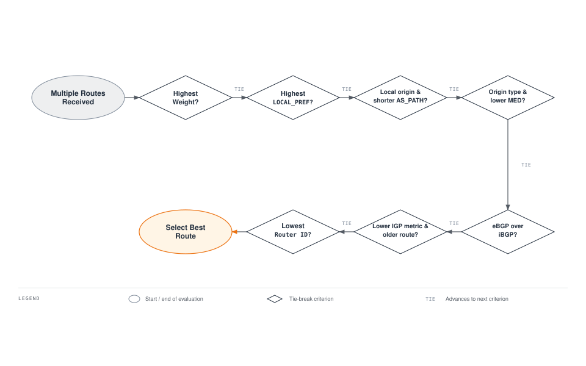
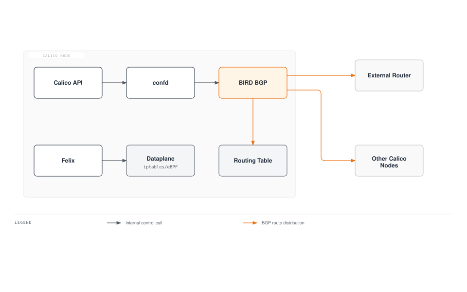
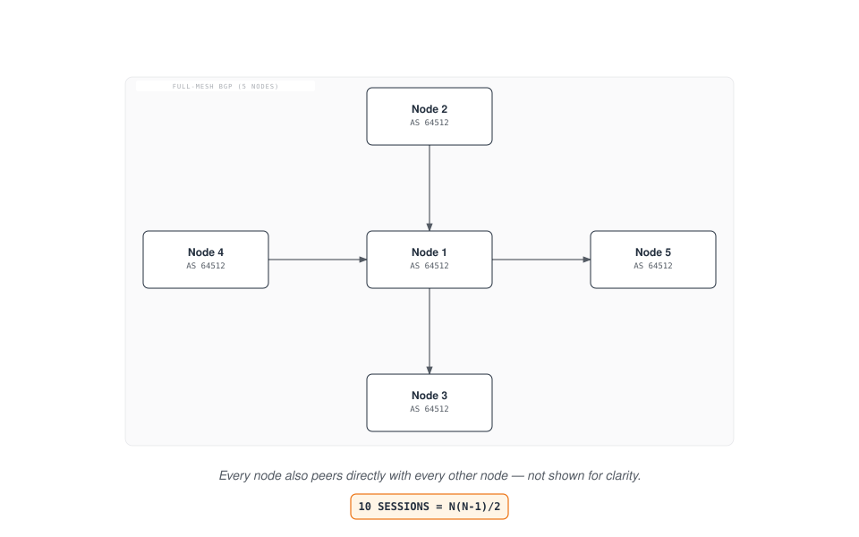
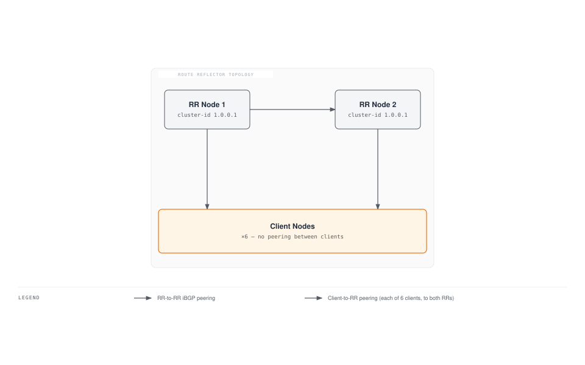
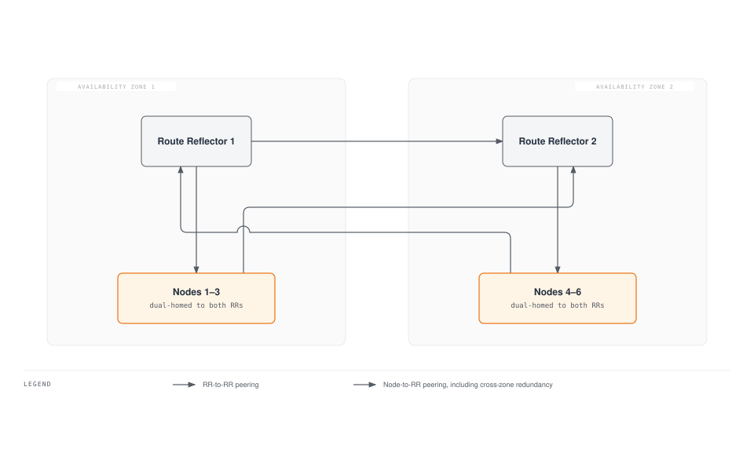
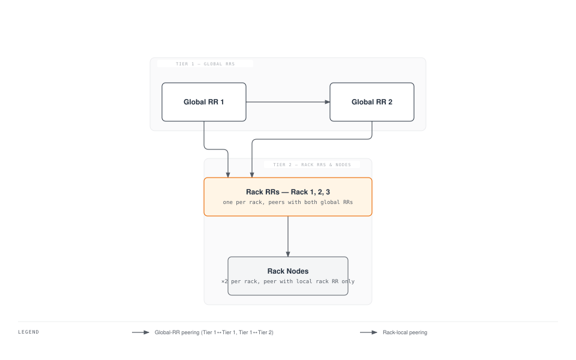
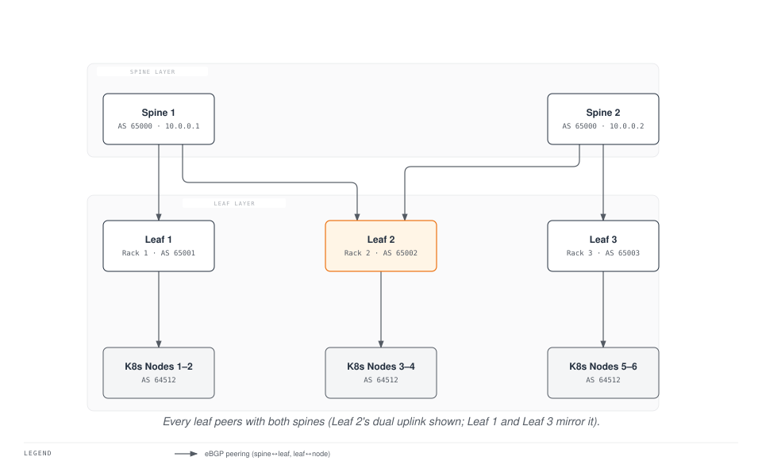
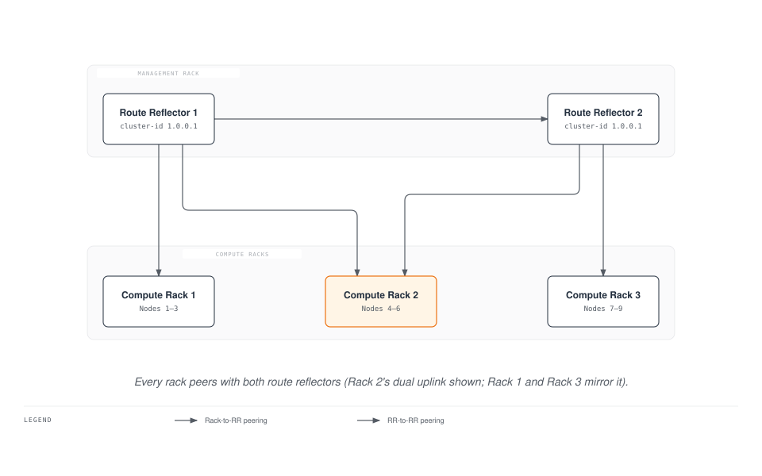
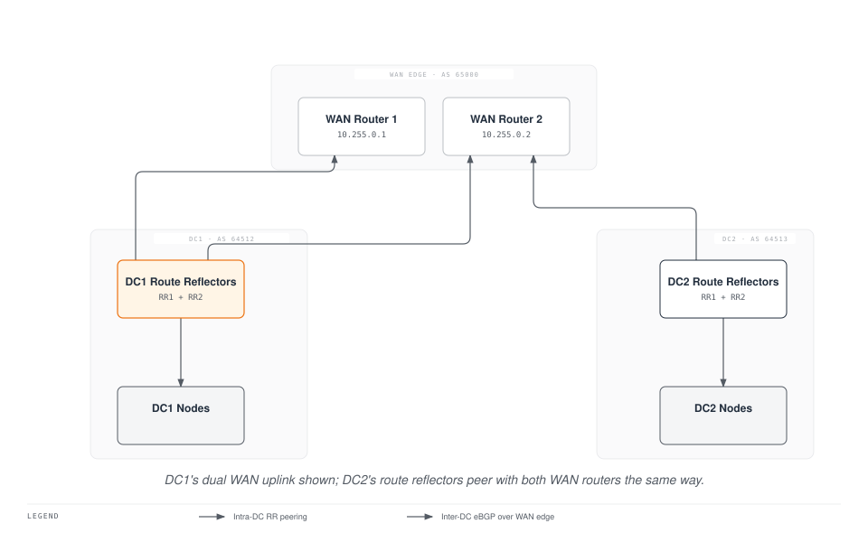

# Part 4: BGP 詳細解説

> **対応バージョン**: Calico v3.29+ / Kubernetes 1.28+ **最終更新**: February 23, 2026

## はじめに

Border Gateway Protocol（BGP）はインターネットを支えるルーティングプロトコルであり、Calico はこれを活用して Kubernetes クラスター向けに高い拡張性と標準ベースのネットワーキングを提供します。トラフィックをカプセル化するオーバーレイネットワークとは異なり、Calico の BGP ベースのネットワーキングはネイティブ IP ルーティングを可能にし、優れたパフォーマンスと既存のネットワークインフラストラクチャとのシームレスな統合を実現します。

この詳細解説では、BGP の基礎、Calico の BGP アーキテクチャオプション、設定リソース、およびエンタープライズ環境向けの高度なデプロイメントパターンを取り上げます。

***

## BGP の基礎

### BGP とは？

BGP（Border Gateway Protocol）は、自律システム間でルーティング情報を交換するために設計されたパスベクタールーティングプロトコルです。Calico では、BGP がクラスターのノード間、および必要に応じて外部ネットワークインフラストラクチャへ Pod IP ルートを配布します。

### BGP の主要な概念

| 概念                    | 説明                                                                   |
| ----------------------- | ---------------------------------------------------------------------- |
| **自律システム（AS）** | 単一の管理ドメイン下にある IP ネットワークの集合                        |
| **AS 番号（ASN）**     | AS の一意の識別子（16 ビット: 1-65534、32 ビット: 1-4294967294）        |
| **iBGP**                | 内部 BGP - 同じ AS 内のルーター間のセッション                          |
| **eBGP**                | 外部 BGP - 異なる AS にあるルーター間のセッション                      |
| **NLRI**                | Network Layer Reachability Information - 広告されるルート              |
| **BGP Speaker**         | BGP に参加するルーターまたはソフトウェア                               |

### プライベート AS 番号の範囲

組織内での内部利用のため、IANA は次のプライベート ASN 範囲を予約しています。

```
16-bit Private ASN Range: 64512 - 65534
32-bit Private ASN Range: 4200000000 - 4294967294
```

Calico は通常、クラスター内部の BGP に `64512-65534` の範囲の ASN を使用します。

### BGP ルート選択プロセス

BGP Speaker が同一宛先への複数のルートを受信すると、次の基準を（順番に）使用して最適なルートを選択します。



### iBGP と eBGP の動作

| 属性                    | iBGP                               | eBGP                                   |
| ----------------------- | ---------------------------------- | -------------------------------------- |
| AS\_PATH の変更        | 変更されない                       | ローカル AS を追加する                  |
| Next-hop                | デフォルトでは変更されない         | ピアリングアドレスに変更される         |
| デフォルト TTL          | 255                                | 1（隣接していない場合はマルチホップが必要） |
| ルート広告              | eBGP ピアにのみ送信（スプリットホライズン） | すべてのピアに送信                     |
| Administrative Distance | 200                                | 20                                     |

***

## Calico BGP アーキテクチャ


[🔍 インタラクティブ図を表示](https://www.atomai.click/kubernetes-docs/archmaps/en-networking-calico-04-bgp-deep-dive-9.html)

### BIRD: Calico の BGP 実装

Calico は BGP 実装として BIRD（BIRD Internet Routing Daemon）を使用します。BIRD は各ノード上の `calico-node` DaemonSet の一部として実行されます。



### BGP トポロジーのオプション

Calico は主に 2 種類の BGP トポロジーをサポートします。

1. **ノード間メッシュ（フルメッシュ）** - デフォルト設定
2. **Route Reflector** - 大規模クラスターで推奨

***

## フルメッシュトポロジー

### フルメッシュの仕組み

デフォルトのフルメッシュ設定では、すべての Calico ノードがクラスター内の他のすべてのノードと BGP ピアリングセッションを確立します。



### セッション数の計算式

フルメッシュトポロジーの BGP セッション数は二次関数的に増加します。

```
Sessions = N × (N - 1) / 2

Examples:
- 10 nodes:   10 × 9 / 2 = 45 sessions
- 50 nodes:   50 × 49 / 2 = 1,225 sessions
- 100 nodes:  100 × 99 / 2 = 4,950 sessions
- 500 nodes:  500 × 499 / 2 = 124,750 sessions
```

### フルメッシュのスケーリング上の制限

| クラスターサイズ | BGP セッション | ノードあたりのメモリ | CPU への影響 | 推奨事項       |
| ---------------- | -------------- | -------------------- | ------------ | -------------- |
| < 50 ノード      | < 1,225        | \~50 MB             | 最小限       | フルメッシュで可 |
| 50-100 ノード    | 1,225-4,950    | \~100 MB            | 低           | RR を検討      |
| 100-200 ノード   | 4,950-19,900   | \~200 MB            | 中           | RR を使用      |
| > 200 ノード     | > 19,900       | > 400 MB             | 高           | RR が必須      |

### ノード間メッシュの有効化/無効化

現在の状態を確認します。

```bash
calicoctl get bgpconfiguration default -o yaml
```

ノード間メッシュを無効にします（Route Reflector 使用時）。

```yaml
apiVersion: projectcalico.org/v3
kind: BGPConfiguration
metadata:
  name: default
spec:
  nodeToNodeMeshEnabled: false
  asNumber: 64512
```

***

## Route Reflector トポロジー

### Route Reflector の概念

Route Reflector（RR）は、一部のノードが他のノードにルートをリフレクトできるようにすることで、iBGP のスケーラビリティ問題を解決します。これにより、フルメッシュは不要になります。



### Route Reflector の主要な属性

| 属性                 | 説明                                                         |
| -------------------- | ------------------------------------------------------------ |
| **Cluster ID**       | 同じクライアントにサービスを提供する RR のセットを識別する   |
| **Originator ID**    | ルーティングループを防止する（発信元の router ID に設定）    |
| **Route Reflection** | RR はクライアントから学習したルートを他のクライアントへ再広告する |

### Route Reflector 使用時のセッション数

2 つの Route Reflector と N 個のクライアントノードの場合:

```
Sessions = 2 × N + 1 (RR-to-RR peering)

Examples:
- 100 nodes: 2 × 100 + 1 = 201 sessions (vs 4,950 in full-mesh)
- 500 nodes: 2 × 500 + 1 = 1,001 sessions (vs 124,750 in full-mesh)
```

### Route Reflector ノードの設定

**ステップ 1: Route Reflector として指定したノードにラベルを付与する**

```bash
kubectl label node rr-node-1 calico-route-reflector=true
kubectl label node rr-node-2 calico-route-reflector=true
```

**ステップ 2: Route Reflector の Cluster ID を設定する**

```yaml
apiVersion: projectcalico.org/v3
kind: Node
metadata:
  name: rr-node-1
  labels:
    calico-route-reflector: "true"
spec:
  bgp:
    ipv4Address: 10.0.1.10/24
    routeReflectorClusterID: 1.0.0.1
---
apiVersion: projectcalico.org/v3
kind: Node
metadata:
  name: rr-node-2
  labels:
    calico-route-reflector: "true"
spec:
  bgp:
    ipv4Address: 10.0.1.11/24
    routeReflectorClusterID: 1.0.0.1
```

**ステップ 3: ノード間メッシュを無効にする**

```yaml
apiVersion: projectcalico.org/v3
kind: BGPConfiguration
metadata:
  name: default
spec:
  nodeToNodeMeshEnabled: false
  asNumber: 64512
```

**ステップ 4: Route Reflector への BGP ピアリングを設定する**

```yaml
# Peering from non-RR nodes to RR nodes
apiVersion: projectcalico.org/v3
kind: BGPPeer
metadata:
  name: peer-to-route-reflectors
spec:
  nodeSelector: "!has(calico-route-reflector)"
  peerSelector: has(calico-route-reflector)
---
# Peering between RR nodes
apiVersion: projectcalico.org/v3
kind: BGPPeer
metadata:
  name: route-reflector-mesh
spec:
  nodeSelector: has(calico-route-reflector)
  peerSelector: has(calico-route-reflector)
```

### Route Reflector の冗長化パターン

**パターン 1: デュアル Route Reflector（小規模/中規模クラスター）**



**パターン 2: 階層型 Route Reflector（大規模クラスター）**



***

## BGPPeer リソース

`BGPPeer` リソースは、Calico ノードと外部 BGP Speaker 間の BGP ピアリング関係を定義します。

### BGPPeer のスコープタイプ

| タイプ               | 説明                         | ユースケース             |
| -------------------- | ---------------------------- | ------------------------ |
| **グローバル**       | すべてのノードに適用される   | 外部ルーターとのピアリング |
| **ノード固有**       | nodeSelector を使用する      | ラックローカルのピアリング |
| **ノードごと**       | 正確なノードを指定する       | 特別な設定               |

### グローバル BGPPeer の例

すべてのノードを外部 ToR スイッチとピアリングします。

```yaml
apiVersion: projectcalico.org/v3
kind: BGPPeer
metadata:
  name: peer-to-tor-switches
spec:
  peerIP: 10.0.0.1
  asNumber: 65001
  # No nodeSelector means all nodes peer with this address
```

### ノード固有 BGPPeer の例

特定ラックのノードをローカル ToR スイッチとピアリングします。

```yaml
apiVersion: projectcalico.org/v3
kind: BGPPeer
metadata:
  name: rack1-tor-peer
spec:
  nodeSelector: rack == 'rack1'
  peerIP: 10.0.1.1
  asNumber: 65001
---
apiVersion: projectcalico.org/v3
kind: BGPPeer
metadata:
  name: rack2-tor-peer
spec:
  nodeSelector: rack == 'rack2'
  peerIP: 10.0.2.1
  asNumber: 65002
```

### peerSelector を使用した BGPPeer

`peerSelector` を使用して、Calico ノードをピアとして動的に選択します。

```yaml
apiVersion: projectcalico.org/v3
kind: BGPPeer
metadata:
  name: client-to-rr-peering
spec:
  nodeSelector: "!has(route-reflector)"
  peerSelector: has(route-reflector)
```

### 高度な BGPPeer 設定

```yaml
apiVersion: projectcalico.org/v3
kind: BGPPeer
metadata:
  name: advanced-peer
spec:
  node: specific-node-name
  peerIP: 192.168.1.1
  asNumber: 65100

  # Authentication
  password:
    secretKeyRef:
      name: bgp-secrets
      key: peer-password

  # Timers (seconds)
  keepAliveTime: 30
  holdTime: 90

  # Source address for BGP session
  sourceAddress: 10.0.0.5

  # Maximum number of hops for eBGP multihop
  numAllowedLocalASNumbers: 2

  # TTL security (GTSM)
  ttlSecurity: 1

  # Filters
  filters:
    - action: Accept
      matchOperator: In
      cidr: 10.0.0.0/8
```

***

## BGPConfiguration リソース

`BGPConfiguration` リソースは、クラスター全体の BGP 設定を定義します。

### 基本的な BGPConfiguration

```yaml
apiVersion: projectcalico.org/v3
kind: BGPConfiguration
metadata:
  name: default
spec:
  # Cluster AS number
  asNumber: 64512

  # Node-to-node mesh (disable for Route Reflectors)
  nodeToNodeMeshEnabled: false

  # Log level for BIRD
  logSeverityScreen: Info
```

### Service IP の広告

Calico は Kubernetes Service IP を BGP 経由で広告でき、外部クライアントがサービスに直接到達できるようにします。

```yaml
apiVersion: projectcalico.org/v3
kind: BGPConfiguration
metadata:
  name: default
spec:
  asNumber: 64512
  nodeToNodeMeshEnabled: false

  # Advertise Service ClusterIPs
  serviceClusterIPs:
    - cidr: 10.96.0.0/12

  # Advertise Service ExternalIPs
  serviceExternalIPs:
    - cidr: 203.0.113.0/24

  # Advertise Service LoadBalancerIPs
  serviceLoadBalancerIPs:
    - cidr: 198.51.100.0/24
```

### BGP Community の設定

BGP Community を使用すると、外部ルーターでポリシーベースルーティングを行うためにルートへタグを付けることができます。

```yaml
apiVersion: projectcalico.org/v3
kind: BGPConfiguration
metadata:
  name: default
spec:
  asNumber: 64512

  # Community tagging for pod networks
  prefixAdvertisements:
    - cidr: 10.244.0.0/16
      communities:
        - "64512:100"  # Standard community
        - "64512:200"
    - cidr: 10.96.0.0/12
      communities:
        - "64512:300"  # Service IPs community

  # Named communities (referenced in other configs)
  communities:
    - name: pod-networks
      value: "64512:100"
    - name: service-networks
      value: "64512:300"
    - name: no-export
      value: "65535:65281"  # Well-known NO_EXPORT
```

### ノード固有の AS 番号

複雑なトポロジーでは、ノードごとに異なる AS 番号を割り当てることができます。

```yaml
apiVersion: projectcalico.org/v3
kind: Node
metadata:
  name: border-node-1
spec:
  bgp:
    ipv4Address: 10.0.1.10/24
    asNumber: 65001  # Override cluster default
```

***

## Service IP の広告

### 広告のタイプ

| タイプ               | 説明                     | ユースケース                 |
| -------------------- | ------------------------ | ---------------------------- |
| **ClusterIP**        | 内部 Service IP          | 内部ロードバランシング       |
| **ExternalIP**       | ユーザー割り当ての外部 IP | 外部からの直接アクセス       |
| **LoadBalancerIP**   | クラウドプロバイダーが割り当て | クラウド統合                 |

### ExternalIP 広告の例

```yaml
# BGPConfiguration for ExternalIP advertisement
apiVersion: projectcalico.org/v3
kind: BGPConfiguration
metadata:
  name: default
spec:
  serviceExternalIPs:
    - cidr: 203.0.113.0/24

---
# Service with ExternalIP
apiVersion: v1
kind: Service
metadata:
  name: my-external-service
spec:
  type: ClusterIP
  externalIPs:
    - 203.0.113.10
  selector:
    app: my-app
  ports:
    - port: 80
      targetPort: 8080
```

### LoadBalancer IP の広告

クラウドプロバイダー統合がないベアメタルクラスター向け:

```yaml
apiVersion: projectcalico.org/v3
kind: BGPConfiguration
metadata:
  name: default
spec:
  serviceLoadBalancerIPs:
    - cidr: 198.51.100.0/24

---
apiVersion: v1
kind: Service
metadata:
  name: my-lb-service
  annotations:
    metallb.universe.tf/loadBalancerIPs: 198.51.100.50
spec:
  type: LoadBalancer
  selector:
    app: my-app
  ports:
    - port: 443
      targetPort: 8443
```

### 選択的な Service 広告

アノテーションを使用して、広告する Service を制御します。

```yaml
apiVersion: v1
kind: Service
metadata:
  name: internal-only-service
  annotations:
    # Prevent BGP advertisement
    projectcalico.org/bgp-advertise: "false"
spec:
  type: LoadBalancer
  ...
```

***

## 物理ネットワークとの統合

### ToR スイッチ設定の例

**Cisco NX-OS 設定:**

```
! Configure BGP
router bgp 65001
  router-id 10.0.1.1

  ! Peer with Kubernetes nodes in rack
  neighbor 10.0.1.0/24 remote-as 64512

  address-family ipv4 unicast
    ! Accept pod network routes
    network 10.244.0.0/16
    ! Redistribute connected for node networks
    redistribute connected route-map KUBERNETES-NODES

    ! Route map for prefix filtering
    neighbor 10.0.1.0/24 route-map ACCEPT-K8S-ROUTES in
    neighbor 10.0.1.0/24 route-map DENY-ALL out

! Route map definitions
route-map ACCEPT-K8S-ROUTES permit 10
  match ip address prefix-list K8S-POD-NETS

ip prefix-list K8S-POD-NETS seq 10 permit 10.244.0.0/16 le 26
ip prefix-list K8S-POD-NETS seq 20 permit 10.96.0.0/12 le 32
```

**Arista EOS 設定:**

```
! Configure BGP
router bgp 65001
  router-id 10.0.1.1

  ! Peer group for Kubernetes nodes
  neighbor K8S-NODES peer group
  neighbor K8S-NODES remote-as 64512
  neighbor K8S-NODES maximum-routes 10000
  neighbor K8S-NODES password 7 <encrypted>

  ! Dynamic neighbors from subnet
  bgp listen range 10.0.1.0/24 peer-group K8S-NODES

  address-family ipv4
    neighbor K8S-NODES activate
    neighbor K8S-NODES prefix-list K8S-PODS-IN in
    neighbor K8S-NODES prefix-list DENY-ALL out

! Prefix lists
ip prefix-list K8S-PODS-IN seq 10 permit 10.244.0.0/16 le 26
ip prefix-list K8S-PODS-IN seq 20 permit 10.96.0.0/12 le 32
ip prefix-list DENY-ALL seq 10 deny 0.0.0.0/0 le 32
```

**Juniper Junos 設定:**

```
protocols {
    bgp {
        group K8S-NODES {
            type external;
            peer-as 64512;
            local-as 65001;

            multipath multiple-as;

            import K8S-IMPORT;
            export DENY-ALL;

            allow 10.0.1.0/24;

            authentication-key "$9$encrypted";
        }
    }
}

policy-options {
    prefix-list K8S-POD-NETS {
        10.244.0.0/16;
    }
    prefix-list K8S-SVC-NETS {
        10.96.0.0/12;
    }
    policy-statement K8S-IMPORT {
        term accept-pods {
            from {
                prefix-list K8S-POD-NETS;
                prefix-length-range /26-/26;
            }
            then accept;
        }
        term accept-services {
            from {
                prefix-list K8S-SVC-NETS;
            }
            then accept;
        }
        term reject-all {
            then reject;
        }
    }
    policy-statement DENY-ALL {
        then reject;
    }
}
```

### Spine-Leaf アーキテクチャとの統合



Spine-Leaf 向けの Calico 設定:

```yaml
# Disable node-to-node mesh
apiVersion: projectcalico.org/v3
kind: BGPConfiguration
metadata:
  name: default
spec:
  nodeToNodeMeshEnabled: false
  asNumber: 64512

---
# Peer nodes with their local leaf switch
apiVersion: projectcalico.org/v3
kind: BGPPeer
metadata:
  name: rack1-leaf-peer
spec:
  nodeSelector: topology.kubernetes.io/zone == 'rack1'
  peerIP: 10.0.1.1
  asNumber: 65001

---
apiVersion: projectcalico.org/v3
kind: BGPPeer
metadata:
  name: rack2-leaf-peer
spec:
  nodeSelector: topology.kubernetes.io/zone == 'rack2'
  peerIP: 10.0.2.1
  asNumber: 65002

---
apiVersion: projectcalico.org/v3
kind: BGPPeer
metadata:
  name: rack3-leaf-peer
spec:
  nodeSelector: topology.kubernetes.io/zone == 'rack3'
  peerIP: 10.0.3.1
  asNumber: 65003
```

***

## BGP Community タグ付け戦略

### Community 設計パターン

| Community     | 意味             | アクション                       |
| ------------- | ---------------- | -------------------------------- |
| `64512:100`   | Pod ネットワーク | 受け入れ、通常ルーティング       |
| `64512:200`   | Service IP       | 受け入れ、特別なポリシーを適用可能 |
| `64512:300`   | インフラストラクチャ | 高優先度ルーティング             |
| `65535:65281` | NO\_EXPORT      | AS 外部へ広告しない              |
| `65535:65282` | NO\_ADVERTISE   | どのピアにも広告しない           |

### Community ベースのトラフィックエンジニアリング

```yaml
apiVersion: projectcalico.org/v3
kind: BGPConfiguration
metadata:
  name: default
spec:
  asNumber: 64512

  communities:
    - name: production
      value: "64512:100"
    - name: staging
      value: "64512:200"
    - name: local-only
      value: "65535:65281"  # NO_EXPORT

  prefixAdvertisements:
    # Production pod networks - advertise everywhere
    - cidr: 10.244.0.0/17
      communities:
        - production

    # Staging pod networks - keep local
    - cidr: 10.244.128.0/17
      communities:
        - staging
        - local-only

    # Service IPs
    - cidr: 10.96.0.0/12
      communities:
        - production
```

***

## BGP セキュリティ

### MD5 認証

MD5 認証で BGP セッションを保護します。

```yaml
# Create secret for BGP password
apiVersion: v1
kind: Secret
metadata:
  name: bgp-auth
  namespace: kube-system
type: Opaque
stringData:
  bgp-password: "SuperSecretPassword123!"

---
# Reference in BGPPeer
apiVersion: projectcalico.org/v3
kind: BGPPeer
metadata:
  name: secure-peer
spec:
  peerIP: 10.0.1.1
  asNumber: 65001
  password:
    secretKeyRef:
      name: bgp-auth
      key: bgp-password
```

### プレフィックスフィルタリング

受け入れ/広告するプレフィックスを制限します。

```yaml
apiVersion: projectcalico.org/v3
kind: BGPFilter
metadata:
  name: allow-pod-nets-only
spec:
  exportV4:
    - action: Accept
      matchOperator: In
      cidr: 10.244.0.0/16
      prefixLength: "24-28"
    - action: Reject
      matchOperator: In
      cidr: 0.0.0.0/0

  importV4:
    - action: Accept
      matchOperator: In
      cidr: 10.0.0.0/8
    - action: Reject
      matchOperator: In
      cidr: 0.0.0.0/0

---
apiVersion: projectcalico.org/v3
kind: BGPPeer
metadata:
  name: filtered-peer
spec:
  peerIP: 10.0.1.1
  asNumber: 65001
  filters:
    - allow-pod-nets-only
```

### GTSM（TTL セキュリティ）

Generalized TTL Security Mechanism は、スプーフィングされた BGP パケットを防止します。

```yaml
apiVersion: projectcalico.org/v3
kind: BGPPeer
metadata:
  name: gtsm-enabled-peer
spec:
  peerIP: 10.0.1.1
  asNumber: 65001
  ttlSecurity: 1  # Expect TTL of 254 or higher
```

***

## パフォーマンスチューニング

### BGP タイマー設定

```yaml
apiVersion: projectcalico.org/v3
kind: BGPPeer
metadata:
  name: tuned-peer
spec:
  peerIP: 10.0.1.1
  asNumber: 65001

  # Keepalive interval (default: 60s)
  keepAliveTime: 20

  # Hold time (default: 180s, must be 3x keepalive)
  holdTime: 60
```

### ルート集約

Pod CIDR を集約して、広告するルート数を削減します。

```yaml
apiVersion: projectcalico.org/v3
kind: BGPConfiguration
metadata:
  name: default
spec:
  asNumber: 64512

  # Aggregate individual /26 pod CIDRs into /16
  prefixAdvertisements:
    - cidr: 10.244.0.0/16
      communities:
        - "64512:100"
```

### グレースフルリスタート

BIRD の再起動中にトラフィックの中断を最小限に抑えるため、BGP Graceful Restart を有効にします。

```yaml
apiVersion: projectcalico.org/v3
kind: BGPConfiguration
metadata:
  name: default
spec:
  asNumber: 64512

  # Enable graceful restart (BIRD default is enabled)
  # Stale route time in seconds
  nodeMeshMaxRestartTime: 120
```

***

## BGP のデバッグ

### birdcl コマンド

calico-node Pod から BIRD コマンドラインインターフェイスにアクセスします。

```bash
# Enter calico-node pod
kubectl exec -it -n kube-system calico-node-xxxxx -c calico-node -- /bin/sh

# Show BGP protocol status
birdcl -s /var/run/calico/bird.ctl show protocols all

# Show BGP neighbors
birdcl -s /var/run/calico/bird.ctl show protocols all bgp*

# Show routing table
birdcl -s /var/run/calico/bird.ctl show route

# Show routes to specific prefix
birdcl -s /var/run/calico/bird.ctl show route for 10.244.1.0/24

# Show route export to specific peer
birdcl -s /var/run/calico/bird.ctl show route export Mesh_10_0_1_11

# Show BGP neighbor details
birdcl -s /var/run/calico/bird.ctl show protocols all Mesh_10_0_1_11
```

### 一般的な BGP の問題と解決策

| 問題                     | 症状                           | 解決策                                  |
| ------------------------ | ------------------------------ | --------------------------------------- |
| セッションが Active のまま | ルートを学習しない             | ファイアウォール（TCP 179）、AS 番号を確認 |
| ルートが伝播しない       | ラック間で Pod に到達できない  | ノード間メッシュまたは RR 設定を確認    |
| ルートフラッピング       | 断続的な接続性                 | BGP タイマー、ネットワークの安定性を確認 |
| セッションのリセット     | Established->Active が頻繁に発生 | MTU、MD5 パスワードを確認               |

### 診断コマンド

```bash
# Check Calico node status
calicoctl node status

# List all BGP peers
calicoctl get bgppeers -o wide

# Check BGP configuration
calicoctl get bgpconfiguration default -o yaml

# View BIRD logs
kubectl logs -n kube-system calico-node-xxxxx -c calico-node | grep -i bird

# Check IP routes on node
ip route show | grep bird
```

***

## 複数ラックおよび複数データセンターの設計

### Route Reflector を使用した複数ラック



### 複数データセンターの BGP 設計



複数データセンター向けの設定:

```yaml
# DC1 Configuration
apiVersion: projectcalico.org/v3
kind: BGPConfiguration
metadata:
  name: default
spec:
  asNumber: 64512
  nodeToNodeMeshEnabled: false

  communities:
    - name: dc1-origin
      value: "64512:1"

---
# Peer DC1 RRs with WAN routers
apiVersion: projectcalico.org/v3
kind: BGPPeer
metadata:
  name: dc1-to-wan
spec:
  nodeSelector: has(route-reflector)
  peerIP: 10.255.0.1  # WAN Router
  asNumber: 65000
```

***

## ベストプラクティスの要約

### 設計に関する推奨事項

1. **クラスターサイズ < 50 ノード**: フルメッシュで問題ありません
2. **クラスターサイズ 50-200 ノード**: 2～3 台の Route Reflector をデプロイします
3. **クラスターサイズ > 200 ノード**: 階層型 Route Reflector をデプロイします
4. **複数ラック**: ラックを考慮した Route Reflector 配置を使用します
5. **複数データセンター**: DC ごとに別の AS を使用し、DC 間で eBGP を使用します

### セキュリティに関する推奨事項

1. 外部ピアには常に MD5 認証を有効にします
2. ルートインジェクションを防ぐためにプレフィックスフィルタリングを実装します
3. サポートされている場合は GTSM（TTL セキュリティ）を使用します
4. ピアごとに受け入れる最大ルート数を制限します
5. BGP セッションの異常を監視します

### 運用に関する推奨事項

1. BGP トポロジー向けにノードへ一貫してラベルを付けます
2. AS 番号の割り当て方式を文書化します
3. BGP の監視とアラートを実装します
4. フェイルオーバーシナリオを定期的にテストします
5. ピア間で BGP タイマーの整合性を保ちます

***

## 参考資料

* [Calico BGP ドキュメント](https://docs.tigera.io/calico/latest/networking/configuring/bgp)
* [BIRD Internet Routing Daemon](https://bird.network.cz/)
* [RFC 4271 - BGP-4](https://tools.ietf.org/html/rfc4271)
* [RFC 4456 - BGP Route Reflection](https://tools.ietf.org/html/rfc4456)
* [RFC 5765 - BGP 向け GTSM](https://tools.ietf.org/html/rfc5082)
