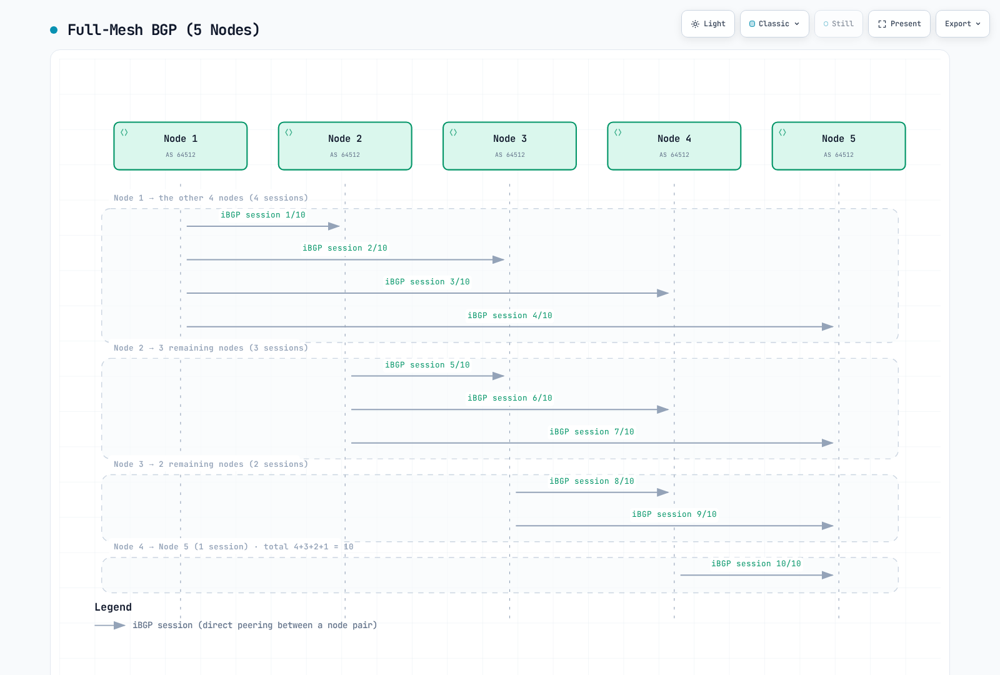
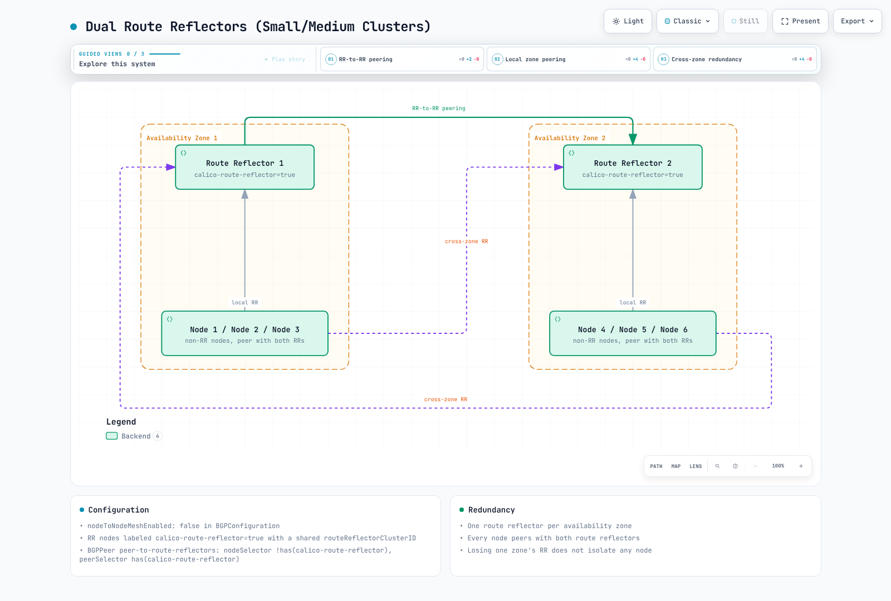
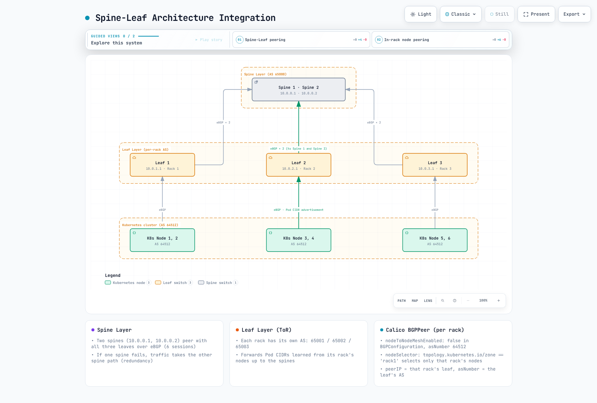
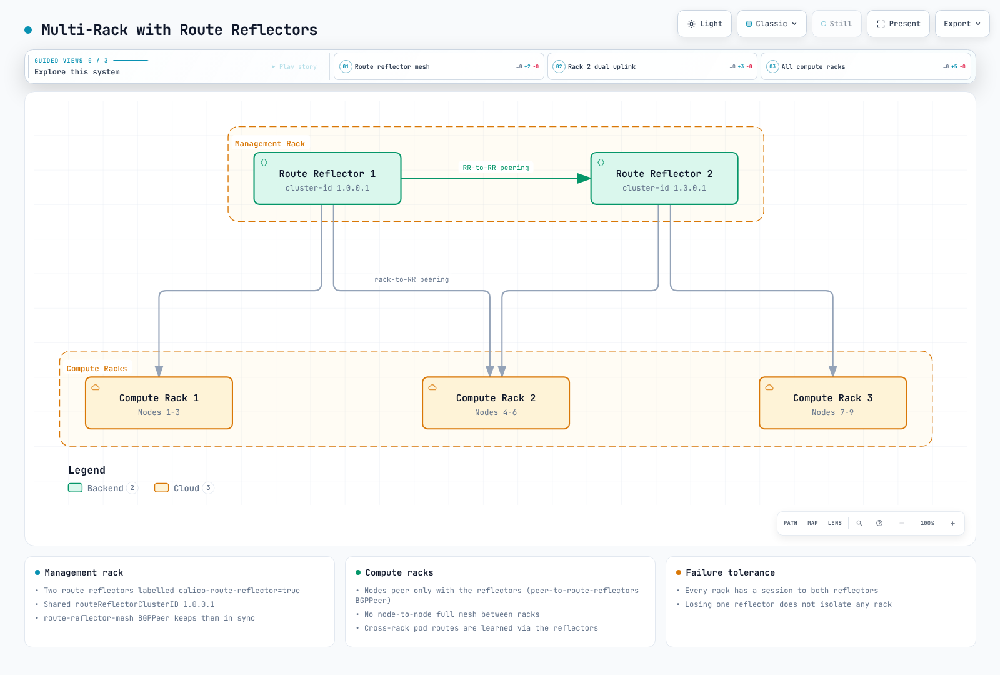

# 第4部: BGP詳解

> **レビュー基準**: Calico 3.32.2。Calico 3.32はKubernetes 1.34–1.36でテストされています。**最終更新**: September 12, 2026。
>
> 設定例は、BGPを有効にし、標準Calico APIサーバー（`projectcalico.org/v3`）をインストールしたLinux Calicoクラスターを前提とします。別々のトポロジーの選択肢であり、順番に適用する1つのマニフェストではありません。Operator/GitOpsによる所有権を維持し、意図したフィールドを既存設定にマージします。API前提条件は[インストールガイド](01-introduction.md)、BGPなしのルーティング代替手段は[ネットワーキングモードガイド](03-networking-modes.md)で扱います。ルーターアドレス、ASN、CIDRは管理下のネットワークと一致する必要があります。このレビューでは実ファブリックやクラスターのフェイルオーバーをテストしていません。

## はじめに

Border Gateway Protocol（BGP）は到達可能性情報を交換します。CalicoはBGPでワークロード経路を配布し、既存のルーティングファブリックと統合できます。BGPはコントロールプレーンのプロトコルです。非カプセル化ルーティングやIP-in-IPと併用でき、それ自体が性能向上を保証するものではありません。Calico 3.32はBGPなしのFelix管理クラスター経路もサポートします。外部BGP広告には引き続きBGPスピーカーが必要です。

この詳解では、BGPの基礎、CalicoのBGPアーキテクチャの選択肢、設定リソース、企業環境向けの高度なデプロイパターンを扱います。

***

## BGPの基礎

### BGPとは

BGP（Border Gateway Protocol）は自律システム間でルーティング情報を交換するためのパスベクトル型ルーティングプロトコルです。Calicoでは、Pod IP経路をクラスターノード間、必要に応じて外部ネットワークインフラへ配布します。

### BGPの主要概念

| 概念 | 説明 |
| -------------------------- | -------------------------------------------------------------------- |
| **自律システム（AS）** | 単一管理ドメイン下のIPネットワークの集合 |
| **AS番号（ASN）** | 16ビットまたは32ビットの識別子。割り当てでは特殊/予約範囲を除外 |
| **iBGP** | 内部BGP。同一AS内のルーター間セッション |
| **eBGP** | 外部BGP。異なるASのルーター間セッション |
| **NLRI** | Network Layer Reachability Information。広告される経路 |
| **BGPスピーカー** | BGPに参加するルーターまたはソフトウェア |

### プライベートAS番号の範囲

組織内での使用向けに、IANAは以下のプライベートASN範囲を予約しています。

```
16-bit Private ASN Range: 64512 - 65534
32-bit Private ASN Range: 4200000000 - 4294967294
```

CalicoのデフォルトクラスターASNは`64512`です。プライベートASNは、経路がグローバルインターネットに達する前にASパスから除去する必要があります。識別子であり、本質的にルーティング不能なIPアドレスではありません。他の特殊範囲には文書用ASNの`64496–64511`と`65536–65551`、`23456`（AS_TRANS）があります。それ以外の整数をすべて割り当て済みパブリックASNと見なさず、[IANAレジストリ](https://www.iana.org/assignments/as-numbers/as-numbers.xhtml)を確認してください。

### BGP経路選択の処理

実際の実装とルーティングポリシーを比較してください。Ciscoの`Weight`や管理距離20/200は普遍的なBGP特性でもCalico BIRDのデフォルトでもありません。

Calico 3.32.2はBIRDフォークを`v0.3.3-211-g9111ec3c`に固定します。比較可能な適格BGP経路について、選択関数は高いLOCAL_PREF、短いAS_PATH（有効時）、低いORIGIN、該当する隣接ASポリシー下の低いMED、iBGPよりeBGP、低いIGPメトリックを確認します。残る同順位はrouter/ORIGINATOR_ID、CLUSTER_LIST長、ピアIPで判定し、任意の古い経路優先設定で同順位の決定方法が変わります。抑制、次ホップ到達性、古い経路の扱い、BIRD経路優先度も重要です。普遍的な11段階の手順ではありません。

Calico 3.32は経路優先度をLOCAL_PREFとカーネルメトリックに変換します。そのため、ローカルからエクスポートする全経路が上流BIRDのデフォルトLOCAL_PREF 100を保持すると想定しないでください。

### iBGPとeBGPの動作

| 属性 | iBGP | eBGP |
| --- | --- | --- |
| ASの関係 | 同一AS | 異なるAS |
| AS_PATH | 通常は保持 | 通常はローカルASを先頭に追加 |
| 経路伝播 | iBGPで学習した経路は通常、別のiBGPピアへ送らない。RRは例外 | エクスポートはポリシーとループ防止に依存 |
| 次ホップ | 多くの場合保持。到達可能である必要がある | 多くの場合変更。`nextHopMode`とトポロジーが影響 |
| TTLと管理距離 | 実装/設定に依存 | 実装/設定に依存 |

ローカル生成経路やeBGPで学習した経路はiBGPピアへ送信できます。Calicoが生成する外部ピア設定はBIRD multihopを使います。一般的な「eBGP TTL 1」表から診断しないでください。生成設定とネゴシエートされたセッション状態を調べます。

***

## CalicoのBGPアーキテクチャ

### BIRD: CalicoのBGP実装

BGP有効時、Calicoは`calico-node`内でBIRDフォークを実行し、confdが設定をレンダリングします。BGP無効のデプロイにBIRDは不要です。選択モードに応じて、BIRDとFelixの両方がルーティングの責務を持ちます。


[🔍 インタラクティブな図を見る](https://www.atomai.click/kubernetes-docs/archmaps/en-networking-calico-04-bgp-deep-dive-1.html)

> 境界は概略です。Calico APIサーバーは独立コンポーネントで、各calico-node Pod内のプロセスではありません。Felixはローカルワークロード経路と、選択したモードではクラスター経路も管理します。BIRDは有効な場合のみ存在します。

### BGPトポロジーの選択肢

一般的な内部BGPトポロジーには次があります。

1. **ノード間メッシュ（フルメッシュ）** - デフォルト構成
2. **ルートリフレクター** - 大規模クラスター向けに推奨

***

## フルメッシュトポロジー

### フルメッシュの動作

BGPとデフォルトのノードメッシュが有効な場合、参加する非RRノードは相互にピア接続します。ルートリフレクターに指定したノードは自動メッシュから除外されます。



[🔍 インタラクティブな図を見る](https://www.atomai.click/kubernetes-docs/archmaps/en-networking-calico-04-bgp-deep-dive-3.html)

> 矢印は双方向セッションを数えており、片方向通信ではありません。対象アドレスファミリーについて、組ごとに1セッションを数えます。

### セッション数の計算式

フルメッシュトポロジーのBGPセッション数は二次関数的に増加します。

```
Sessions = N × (N - 1) / 2

Examples:
- 10 nodes:   10 × 9 / 2 = 45 sessions
- 50 nodes:   50 × 49 / 2 = 1,225 sessions
- 100 nodes:  100 × 99 / 2 = 4,950 sessions
- 500 nodes:  500 × 499 / 2 = 124,750 sessions
```

### フルメッシュのスケーリングと移行

計算式は、数えるアドレスファミリーでノードの組ごとに1セッションを前提とします。各ノードは`N−1`ピアを持ちます。CPUとメモリは経路数、更新頻度、ポリシー、ハードウェア、収束目標に依存します。以前のノードあたりメモリ表や固定の50/200ノード制限は実測容量制限ではありませんでした。

既存設定を確認します。

```bash
kubectl get bgpconfiguration.projectcalico.org default -o yaml
```

`default`リソースがない場合、デフォルト値が使われている可能性があります。自動メッシュを無効にする前に、代替RRまたはファブリックセッションを準備・検証します。下の移行順序に従ってください。RRラベルを作成するだけでは機能する代替経路にはなりません。

***

## ルートリフレクタートポロジー

### ルートリフレクターの概念

ルートリフレクター（RR）は、一部のノードが他ノードへ経路を反射できるようにしてiBGPの拡張性問題を解決します。これによりフルメッシュが不要になります。


[🔍 インタラクティブな図を見る](https://www.atomai.click/kubernetes-docs/archmaps/en-networking-calico-04-bgp-deep-dive-4.html)

> 図は6クライアントと2 RR、計13セッションです。図の2N+1式でNはクライアント数、フルメッシュのNは総ノード数です。自動メッシュは明示的な代替トポロジーを検証した後にのみ無効にします。

### ルートリフレクターの主な属性

| 属性 | 説明 |
| -------------------- | ------------------------------------------------------------- |
| **Cluster ID** | 同じクライアントを担当するRR群を識別 |
| **Originator ID** | ルーティングループを防止（発信元のルーターIDを設定） |
| **経路反射** | RRがクライアントから学習した経路を他クライアントへ再広告 |

### ルートリフレクター使用時のセッション数

総ノード数を`T`、リフレクター数を`R`、クライアント数を`C=T−R`とします。全クライアントが全RRと接続し、RR同士も接続する場合は次のようになります。

```text
RR sessions = C×R + R×(R−1)/2
T=100, R=2: 98×2 + 1 = 197 (full mesh of the same 100 nodes: 4,950)
T=500, R=2: 498×2 + 1 = 997 (full mesh of the same 500 nodes: 124,750)
```

「100ノード」が100クライアントと追加の2 RRを意味するなら201セッションですが、そのトポロジーは102ノードです。2つの意味を混同してはいけません。

### ルートリフレクターノードの設定

移行には準備済みでワークロードのないRRノードを使います。クラスターID設定は即座にそのノードを自動メッシュから外すため、稼働中ノードをその場で変更すると接続が中断する場合があります。このKubernetesデータストア例は既存ノードIPと他フィールドを保持します。

**1. 準備したRRノードにラベルとアノテーションを設定**

```bash
kubectl label node rr-node-1 rr-node-2 route-reflector=true
kubectl annotate node rr-node-1 rr-node-2   projectcalico.org/RouteReflectorClusterID=244.0.0.1
```

共有IDはこの冗長RRクラスターを識別し、Kubernetesクラスターを識別しません。他のRRクラスター/階層レベルには意図的なID設計が必要です。

**2. 明示的なピアリングを作成**

```yaml
apiVersion: projectcalico.org/v3
kind: BGPPeer
metadata:
  name: peer-to-rr
spec:
  nodeSelector: "!has(route-reflector)"
  peerSelector: "has(route-reflector)"
---
apiVersion: projectcalico.org/v3
kind: BGPPeer
metadata:
  name: rr-mesh
spec:
  nodeSelector: "has(route-reflector)"
  peerSelector: "has(route-reflector)"
```

`peerSelector`はCalicoノードを選び、`reversePeering: Manual`を選ばない限り逆方向ピアリングは自動です。任意の外部ルーターを検出するものではありません。

**3. 旧経路を削除する前に検証**

両RRとクライアントのEstablishedセッション、想定する広告/受信ワークロードプレフィックス、次ホップ到達性、代表的なノード間通信を確認します。計画したいずれかのRR喪失でも転送が継続することを確認してください。この移行中、通常のクライアントメッシュセッションは残しておけます。

**4. 確認後にのみ自動メッシュを無効化**

所有する`BGPConfiguration/default`マニフェストを更新し、ASN、コミュニティ、他設定を保持します。既存リソースへの同等マージパッチは次のとおりです。

```bash
kubectl patch bgpconfiguration.projectcalico.org default --type=merge   -p '{"spec":{"nodeToNodeMeshEnabled":false}}'
```

`default`がなければ、同じ確認後にインストールの設定所有者を通じて作成します。変更後に経路と通信を再確認し、元のトポロジーへのロールバック計画を保持します。

### ルートリフレクターの冗長化パターン

**パターン1: 2つのルートリフレクター（小/中規模クラスター）**



[🔍 インタラクティブな図を見る](https://www.atomai.click/kubernetes-docs/archmaps/en-networking-calico-04-bgp-deep-dive-11.html)

> 転送路、転送機能、残存容量が正常なら、RRを1つ失っても生存クライアントに冗長な経路配布経路を提供します。障害ゾーン内のワークロードを維持するものではありません。

**パターン2: 階層型ルートリフレクター**

ラックレベルRRをグローバルRRに接続して、ノードあたりのセッション数を減らせます。総セッション数はクライアント数とラック数に応じて増えます。グローバルRRが冗長でもラックあたりRRが1つなら障害点として残ります。階層採用前に各層の冗長性、クラスターID、反射ルール、到達性、収束を評価してください。

***

## BGPPeerリソース

`BGPPeer`リソースはCalicoノードと外部BGPスピーカー間のピアリング関係を定義します。

### BGPPeerのスコープタイプ

| タイプ | 説明 | 用途 |
| ----------------- | -------------------- | ----------------------- |
| **グローバル** | 全ノードに適用 | 外部ルーターとのピアリング |
| **ノード選択** | nodeSelectorを使用 | ラック内ピアリング |
| **ノードごと** | 特定ノードを指定 | 特殊な構成 |

### グローバルBGPPeerの例

全ノードを外部ToRスイッチと接続します。

```yaml
apiVersion: projectcalico.org/v3
kind: BGPPeer
metadata:
  name: peer-to-tor-switches
spec:
  peerIP: 10.0.0.1
  asNumber: 65001
  # No nodeSelector means all nodes peer with this address
```

### ノードを選択するBGPPeerの例

特定ラックのノードをローカルToRスイッチと接続します。

```yaml
apiVersion: projectcalico.org/v3
kind: BGPPeer
metadata:
  name: rack1-tor-peer
spec:
  nodeSelector: rack == 'rack1'
  peerIP: 10.0.1.1
  asNumber: 65001
---
apiVersion: projectcalico.org/v3
kind: BGPPeer
metadata:
  name: rack2-tor-peer
spec:
  nodeSelector: rack == 'rack2'
  peerIP: 10.0.2.1
  asNumber: 65002
```

### peerSelectorを使うBGPPeer

`peerSelector`でCalicoノードをピアとして動的に選択します。

```yaml
apiVersion: projectcalico.org/v3
kind: BGPPeer
metadata:
  name: client-to-rr-peering
spec:
  nodeSelector: "!has(route-reflector)"
  peerSelector: has(route-reflector)
```

### 高度なBGPPeer設定

先に参照するSecretと、セキュリティセクションの`tor-policy` BGPFilterを作成します。この例は、GTSMと認証設定が一致した直接接続ピアを前提とします。

```yaml
apiVersion: projectcalico.org/v3
kind: BGPPeer
metadata:
  name: advanced-peer
spec:
  node: specific-node-name
  peerIP: 192.168.1.1
  asNumber: 65100
  password:
    secretKeyRef:
      name: bgp-secrets
      key: datacenter-password
  keepaliveTime: 30s
  maxRestartTime: 120s
  sourceAddress: UseNodeIP
  nextHopMode: Auto
  ttlSecurity: 1
  filters:
    - tor-policy
```

| フィールド | Calico 3.32.2での意味 |
| --- | --- |
| `keepaliveTime` | 期間文字列。小文字の`a`が重要。リリースCRDとレンダラーで確認済み。 |
| `maxRestartTime` | 隣接ルーターに広告するグレースフルリスタート時間。接続再試行間隔ではない。 |
| `sourceAddress` | `UseNodeIP`または`None`。リテラルの送信元IPは受け入れない。 |
| `filters` | 既存`BGPFilter`リソースの名前。埋め込みルールオブジェクトではない。 |
| `ttlSecurity` | エッジ数で表すGTSM経路長。`1`は直接接続ピアを意味する。 |
| `numAllowedLocalASNumbers` | 受信AS_PATH内のローカルASN出現許容数。ループ防止を緩和し、マルチホップ設定ではない。ルーティング設計に必要な場合以外は未設定にする。 |

現在の`BGPPeer` APIに`holdTime`、`keepAliveTime`、`restartTime`フィールドはありません。`nextHopMode`は`Auto`、`Self`、`Keep`です。旧`keepOriginalNextHop`フィールドは削除ではなく非推奨です。

***

## BGPConfigurationリソース

`BGPConfiguration`リソースはクラスター全体のBGP設定を定義します。

### 基本的なBGPConfiguration

```yaml
apiVersion: projectcalico.org/v3
kind: BGPConfiguration
metadata:
  name: default
spec:
  # Cluster AS number
  asNumber: 64512

  # Set topology separately after validating its peerings.
  # Log level for BIRD
  logSeverityScreen: Info
```

### Service IPの広告

Calicoは既存Service IPを許可されたルーティングネットワークへ広告できます。広告はIPを割り当てず、クラウドロードバランサーを作らず、到達可能な復路も保証しません。以下のCIDRは例です。必要範囲だけを既存設定にマージし、他設定を保持します。

```yaml
apiVersion: projectcalico.org/v3
kind: BGPConfiguration
metadata:
  name: default
spec:
  asNumber: 64512

  # Advertise Service ClusterIPs
  serviceClusterIPs:
    - cidr: 10.96.0.0/12

  # Advertise Service ExternalIPs
  serviceExternalIPs:
    - cidr: 203.0.113.0/24

  # Advertise Service LoadBalancerIPs
  serviceLoadBalancerIPs:
    - cidr: 198.51.100.0/24
```

### BGPコミュニティ設定

`prefixAdvertisements`は、現在のレンダラーではPod経路も含む一致した既存経路にコミュニティを追加します。指定プレフィックスを生成したり、全Podブロックをそのプレフィックスに集約したりは**しません**。名前付きコミュニティは参照時にのみ効力を持ち、名前や任意値だけでルーティングポリシーを実装するものではありません。

```yaml
apiVersion: projectcalico.org/v3
kind: BGPConfiguration
metadata:
  name: default
spec:
  asNumber: 64512

  # Community tagging for pod networks
  prefixAdvertisements:
    - cidr: 10.244.0.0/16
      communities:
        - "64512:100"  # Standard community
        - "64512:200"
    - cidr: 10.96.0.0/12
      communities:
        - "64512:300"  # Service IPs community

  # Named aliases, referenced by prefixAdvertisements in this configuration
  communities:
    - name: pod-networks
      value: "64512:100"
    - name: service-networks
      value: "64512:300"
    - name: no-export
      value: "65535:65281"  # Well-known NO_EXPORT
```

### ノード固有のAS番号

Kubernetesデータストアでは既存ノードにアノテーションを付け、アドレスや他フィールドを保持します。ASN変更は影響するピアリングをリセットするため、両端とルーティングトポロジーを調整してください。

```bash
kubectl annotate node border-node-1 projectcalico.org/ASNumber=65001
```

既存アノテーションは現在値を確認してから設定所有者を通じて更新します。他データストアではCalico Node APIを使用します。架空アドレスを含む部分例で既存Nodeを置き換えないでください。

***

## Service IPの広告

### 広告タイプと転送

| タイプ | アドレス所有者と前提条件 |
| --- | --- |
| ClusterIP | Kubernetesが割り当てる。Service CIDRの広告はサービスネットワークへの経路を公開する。 |
| ExternalIP | 運用者が割り当てたアドレスをすでに所有し、ルーティングしている必要がある。`spec.externalIPs`はKubernetes 1.36から非推奨だが、既存サポートの削除ではない。 |
| LoadBalancer IP | 互換コントローラーが割り当てる。Calico自身が所有VIPを割り当てるか、明示的に選んだアロケーターと連携できる。クラウドLBホスト名はIPプレフィックスではない。 |

デフォルトの集約動作では、ClusterモードServiceは設定した集約広告を使い、LocalモードServiceは準備済みローカルエンドポイントがあるノードからホスト経路（`/32`または`/128`）を使います。明示的なホストプレフィックス範囲とCalico 3.32の`serviceLoadBalancerAggregation`設定で広告経路が変わる場合があります。Serviceタイプだけから推測せず、実際のRIB/エクスポートを調べます。エンドポイント、Serviceデータプレーン、上流ECMP、復路を検証してください。Pod IPAMブロック広告とは別です。

### CalicoネイティブのLoadBalancer IPAM

Calico 3.32は`calico-kube-controllers`にLoadBalancerコントローラーを含みます。`allowedUses: [LoadBalancer]`付きIPPoolが必要で、標準Podプールは自動的にそのアドレスを提供しません。コントローラーが有効か確認してください。この単独ベアメタル例は、既存`calico-demo`名前空間と、指定ポートを提供する準備済み`app=my-app`エンドポイントも前提とします。文書用範囲を所有するルーティング可能な範囲に置き換えます。

```yaml
apiVersion: projectcalico.org/v3
kind: IPPool
metadata:
  name: service-lb-pool
spec:
  cidr: 198.51.100.0/24
  allowedUses:
    - LoadBalancer
  assignmentMode: Automatic
---
apiVersion: projectcalico.org/v3
kind: BGPConfiguration
metadata:
  name: default
spec:
  serviceLoadBalancerIPs:
    - cidr: 198.51.100.0/24
---
apiVersion: v1
kind: Service
metadata:
  name: my-lb-service
  namespace: calico-demo
  annotations:
    projectcalico.org/loadBalancerIPs: '["198.51.100.50"]'
spec:
  type: LoadBalancer
  loadBalancerClass: calico
  externalTrafficPolicy: Local
  selector:
    app: my-app
  ports:
    - port: 443
      targetPort: 8443
```

明示的な`projectcalico.org/loadBalancerIPs`要求は、適格プールに属し利用可能でなければなりません。割り当て失敗時に他アドレスへフォールバックしません。割り当てとBGP広告は別です。変更前にコントローラーの`assignIPs`モードを確認してください。`RequestedServicesOnly`は既存のアノテーションなしServiceの割り当てを解除する場合があります。既存プールとコントローラーの所有権を維持します。

MetalLBは代替アロケーターで、現在の要求IPアノテーションは`metallb.io/loadBalancerIPs`です。同一VIPに競合するアロケーター/スピーカーを動かさず、割り当てとBGPスピーカーの所有権を意図的に選択してください。AWS管理のロードバランサーアドレスをローカル所有プールとして広告しないでください。

### 選択的なService広告

`projectcalico.org/bgp-advertise`というCalico Serviceの広告除外アノテーションは文書化されていません。`BGPConfiguration`で広告範囲を選び、必要に応じてピア固有のBGPFilterを適用します。対応ノードラベル`node.kubernetes.io/exclude-from-external-load-balancers=true`はノードを除外し、Serviceごとの除外ではありません。

1つの`/32`を拒否しても、それを覆うService集約経路が広告されたままならIPは到達不能になりません。内部限定にするServiceは、広告範囲がカバーしないことを確認し、アクセス制御も独立して適用してください。経路フィルタリングは認可境界ではありません。

***

## 物理ネットワークとの統合

### ToRルーティングポリシーとベンダー対応

ルーターのASN、ノード隣接関係、アドレスファミリー、認証、インポート/エクスポートポリシー、到達可能な次ホップを1つの設計として設定します。ノードが既存アンダーレイのデフォルト経路を使うか、BGPでデフォルトを受け取るかを決めます。`network`は一致する既存経路を生成し、隣接ルーターからの経路を受け入れるコマンドではありません。広範な`redistribute connected`は無関係なネットワークを漏らす可能性があります。

| プラットフォーム | 必要な調整 |
| --- | --- |
| Cisco IOS XE / NX-OS | 正確なプラットフォーム/リリースの構文を使用。IOS XE動的隣接はピアグループと`bgp listen range`を使用。IOSとNX-OSのコマンド階層を混在させない。参照する全route mapとprefix listを定義する。 |
| Arista EOS | デプロイ済みリリースのピアグループ、アドレスファミリー、シークレット、インポート/エクスポートポリシー設定を使用。以前の未検証EOSコマンドブロックは実行可能な手順ではない。 |
| Junos | 通常のprefix-list一致は完全一致。より具体的な経路を対象にする場合は明示的なroute-filter一致タイプを使用。 |

例えば次の**Junosポリシー断片**を、ToRの対象ノード向けBGPグループのインポートポリシーとして接続すると、計画したPod `/26`–`/32`経路とLoadBalancer `/32`経路を受け入れ、残りを拒否します。

```text
policy-options {
    policy-statement K8S-IMPORT {
        term approved {
            from {
                route-filter 10.244.0.0/16 prefix-length-range /26-/32;
                route-filter 198.51.100.0/24 prefix-length-range /32-/32;
            }
            then accept;
        }
        term reject-rest {
            then reject;
        }
    }
}
```

Podの最小長は`/26` IPAMブロックを前提とします。実際のプールと経路一覧に合わせてください。借用アドレスや一部の移動経路には`/32`が必要なため、`le 26`は一般的に安全なPodフィルターではありません。この断片は隣接関係を作成せず、デフォルト経路を広告しません。ベンダー機器設定やフェイルオーバーはここで実行時テストしていません。デプロイ前に正確なルーターリリースでエクスポートポリシー、制限、次ホップ動作を完成させ、検証してください。

### スパイン・リーフ構成との統合



[🔍 インタラクティブな図を見る](https://www.atomai.click/kubernetes-docs/archmaps/en-networking-calico-04-bgp-deep-dive-5.html)

> グループ化されたボックスは複数セッションをまとめています。共有ノードASNには明示的なASループ/オーバーライド設計が必要です。スパイン2台だけではリーフやノード上り接続の冗長性は得られません。アドレスとASNは例示トポロジーとして使い、完全なデプロイ可能設定とは見なさないでください。

スパイン・リーフ設計のCalicoピア断片を以下に示します。先にノードラベル、直接/再帰的な次ホップ到達性、エクスポートポリシー、復路を確認します。ラックをまたぐノードでASN 64512を再利用すると、受信ノードのASNがAS_PATHにあるため経路が拒否される場合があります。一意ASNか、意図的に検証したファブリックのASオーバーライド/ループポリシーを設計してください。`numAllowedLocalASNumbers`を無条件に増やして回避しないでください。メッシュセッションの削除前に代替経路を検証します。

```yaml
# Final topology alternative: establish fabric peerings before removing mesh.
apiVersion: projectcalico.org/v3
kind: BGPConfiguration
metadata:
  name: default
spec:
  asNumber: 64512

---
# Peer nodes with their local leaf switch
apiVersion: projectcalico.org/v3
kind: BGPPeer
metadata:
  name: rack1-leaf-peer
spec:
  nodeSelector: topology.kubernetes.io/zone == 'rack1'
  peerIP: 10.0.1.1
  asNumber: 65001

---
apiVersion: projectcalico.org/v3
kind: BGPPeer
metadata:
  name: rack2-leaf-peer
spec:
  nodeSelector: topology.kubernetes.io/zone == 'rack2'
  peerIP: 10.0.2.1
  asNumber: 65002

---
apiVersion: projectcalico.org/v3
kind: BGPPeer
metadata:
  name: rack3-leaf-peer
spec:
  nodeSelector: topology.kubernetes.io/zone == 'rack3'
  peerIP: 10.0.3.1
  asNumber: 65003
```

***

## BGPコミュニティのタグ付け戦略

### コミュニティ設計パターン

以下のプライベート値はルーターポリシーが必要なローカル規約であり、組み込み優先度制御ではありません。標準コミュニティは2つの16ビット値、ラージコミュニティは3つの32ビット値を含み、4バイトASNを標準コミュニティに押し込めずに表せます。

| コミュニティ | 意味 | アクション |
| ------------- | -------------- | -------------------------------- |
| `64512:100` | Podネットワーク | 受け入れ、通常ルーティング |
| `64512:200` | Service IP | 受け入れ、特別ポリシーを適用する場合あり |
| `64512:300` | インフラ | 高優先度ルーティング |
| `65535:65281` | NO\_EXPORT | ASコンフェデレーション境界の外に広告しない（コンフェデレーションなしならAS外） |
| `65535:65282` | NO\_ADVERTISE | どのピアにも広告しない |

### コミュニティに基づくトラフィックエンジニアリング

```yaml
apiVersion: projectcalico.org/v3
kind: BGPConfiguration
metadata:
  name: default
spec:
  asNumber: 64512

  communities:
    - name: production
      value: "64512:100"
    - name: staging
      value: "64512:200"
    - name: local-only
      value: "65535:65281"  # NO_EXPORT

  prefixAdvertisements:
    # Tag existing production routes; actual propagation follows routing policy
    - cidr: 10.244.0.0/17
      communities:
        - production

    # Add NO_EXPORT to existing staging routes
    - cidr: 10.244.128.0/17
      communities:
        - staging
        - local-only

    # Service IPs
    - cidr: 10.96.0.0/12
      communities:
        - production
```

***

## BGPセキュリティ

### MD5認証

CalicoはBGPにTCP MD5署名オプションをサポートします。シークレットを共有するピアの通信を認証しますが、暗号化や認証済みピアが送る経路の正当性検証はしません。

シークレット管理手順で、`calico-node`が動作する名前空間（このOperatorインストールでは`calico-system`、マニフェストでは`kube-system`の場合あり）に`bgp-secrets`を用意します。例には`datacenter-password`キーが必要です。`mesh-password`やラック固有/リーフ固有キーを参照する他の例には、それらのキーも必要です。対応ルーターに一致する認証情報を設定し、CalicoサービスアカウントがSecretを読めることを確認します。

```yaml
apiVersion: projectcalico.org/v3
kind: BGPPeer
metadata:
  name: secure-peer
spec:
  peerIP: 192.168.1.1
  asNumber: 65100
  password:
    secretKeyRef:
      name: bgp-secrets
      key: datacenter-password
```

### プレフィックスフィルタリング

ルールは順番に評価され、最初の一致が即実行されます。未一致経路はデフォルトで**Accept**されるため、許可リストには最後に無条件Rejectが必要です。`Equal 0.0.0.0/0`はデフォルト経路だけに、`In 0.0.0.0/0`は全IPv4経路に一致し、`NotIn 0.0.0.0/0`は何にも一致しません。

以下の外部ピア例は、インポートではデフォルト経路と計画したアンダーレイ`10.0.0.0/16`だけを受け入れます。エクスポートでは実際のPod `/26`–`/32`経路とLoadBalancer `/32`経路を許可します。CIDRと長さを実際の経路一覧に合わせてください。この外部ポリシーをRR/クライアントセッションへ無差別に付けないでください。

```yaml
apiVersion: projectcalico.org/v3
kind: BGPFilter
metadata:
  name: tor-policy
spec:
  importV4:
    - action: Accept
      matchOperator: Equal
      cidr: 0.0.0.0/0
    - action: Accept
      matchOperator: In
      cidr: 10.0.0.0/16
    - action: Reject
  exportV4:
    - action: Accept
      matchOperator: In
      cidr: 10.244.0.0/16
      prefixLength:
        min: 26
        max: 32
      operations:
        - addCommunity:
            value: "64512:100"
    - action: Accept
      matchOperator: In
      cidr: 198.51.100.0/24
      prefixLength:
        min: 32
        max: 32
    - action: Reject
---
apiVersion: projectcalico.org/v3
kind: BGPPeer
metadata:
  name: filtered-peer
spec:
  peerIP: 192.168.1.1
  asNumber: 65100
  filters:
    - tor-policy
```

`prefixLength`は`min`と`max`を持つオブジェクトで、範囲文字列ではありません。Calico 3.32は`addCommunity`など受理経路への操作もサポートします。明示的エクスポートAcceptは、組み込みCalicoエクスポート/集約/`prefixAdvertisements`処理の前に戻ります。そのためRIB内のより具体的な経路をエクスポートする場合があり、この例ではルール内で直接Podタグを追加します。ファブリックに適用する前に`show route export`を確認してください。BGPFilterは存在しない経路を作成しません。

### GTSM（TTLセキュリティ）

GTSMは想定経路しきい値より低いTTLで届くパケットを拒否します。経路外からのなりすましへの露出を減らしますが、ピアを認証せず、同一リンク上の攻撃者も防ぎません。両端を整合するよう設定します。

```yaml
apiVersion: projectcalico.org/v3
kind: BGPPeer
metadata:
  name: gtsm-enabled-peer
spec:
  peerIP: 192.168.1.1
  asNumber: 65100
  ttlSecurity: 1
```

固定したBIRD実装では、GTSMはTTL 255で送信し、最小受信TTLを`256−hops`にします。そのため`ttlSecurity: 1`には254でなく255が必要で、2エッジでは最低254が必要です。有効化前に実際の経路を確認してください。AS_PATH内のローカルASN許容数とは無関係です。

***

## 性能調整

### BGPタイマー設定

```yaml
apiVersion: projectcalico.org/v3
kind: BGPPeer
metadata:
  name: tuned-peer
spec:
  peerIP: 192.168.1.1
  asNumber: 65100
  keepaliveTime: 20s
  maxRestartTime: 120s
```

固定したBIRDフォークはデフォルトで240秒のHold Timeを提案し、隣接ルーターとの間で小さい方の値を合意します。keepalive間隔未設定なら、合意したHold Timeの3分の1を使います。明示的な`keepaliveTime`は間隔を上書きしますが、Hold Timeを自動的にその3倍へ変えるわけでは**ありません**。実際に合意されたタイマーを調べ、それに合う間隔を選んでください。

`BGPPeer`は`holdTime`を公開しません。以前の60/180、10/30、3/9という推奨は、検証済みCalicoデフォルトや障害検出保証ではありませんでした。BIRD単体のBFD機能は、対応Calico BFD CRDや設定フィールドがあることを意味しません。架空フィールドを追加せず、別のBFD統合は正確な対応デプロイでテストしてください。

### 経路集約

Calicoは通常、ローカルIPAMアドレスを割り当て済みブロックに集約します。現在のBIRD集約テンプレートは、高優先度のより具体的な経路も許可します。借用や移動にはホスト経路が必要な場合があります。`prefixAdvertisements`は一致する既存経路にタグを付けるだけで、全`/26`を生成された`/16`に変えません。

大きなIPAMブロックは、ブロック経路数の削減と割り当て粒度/アドレス利用効率のトレードオフです。既存IPPoolの`blockSize`は不変です。新プールが必要なら[ネットワーキングモード](03-networking-modes.md)のプール移行手順を使います。既存デフォルトプールに新ブロックサイズを適用したり、対象全宛先に到達できないルーターからそれらを覆う集約経路を広告したりしないでください。

### グレースフルリスタート

CalicoのBIRDテンプレートはGraceful Restartを有効にします。効果には合意された機能と動作し続ける転送経路が必要で、そうでなければ保持した古い経路がトラフィックをブラックホール化する場合があります。無中断の更新は保証しません。

明示的ピアでは`BGPPeer.maxRestartTime`が広告する再起動時間を設定します。以下の設定は**自動ノードメッシュ**セッション向けで、すべての明示的ピア向けではありません。

```yaml
apiVersion: projectcalico.org/v3
kind: BGPConfiguration
metadata:
  name: default
spec:
  nodeMeshMaxRestartTime: 120s
```

これは期間文字列で、整数や有効化スイッチではありません。既存設定所有者を通じて変更し、実際のピア機能と復旧動作を検証します。

***

## BGPのデバッグ

### 正しいノードからBIRDを調べる

実際のノードとインストール名前空間を選びます。読み取り専用の以下のコマンドは、運用者のシェルからIPv4 BIRD制御ソケットに対して実行します。IPv6には`birdcl6`と`/var/run/calico/bird6.ctl`を使います。BGP無効のインストールでは、どちらのデーモンも不要です。

```bash
CALICO_NAMESPACE=calico-system
CALICO_NODE=worker-1
CALICO_POD="$(kubectl -n "$CALICO_NAMESPACE" get pods -l k8s-app=calico-node \
  --field-selector "spec.nodeName=$CALICO_NODE" -o jsonpath='{.items[0].metadata.name}')"
test -n "$CALICO_POD"
kubectl -n "$CALICO_NAMESPACE" exec "$CALICO_POD" -c calico-node -- \
  birdcl -s /var/run/calico/bird.ctl show protocols all
kubectl -n "$CALICO_NAMESPACE" exec "$CALICO_POD" -c calico-node -- \
  birdcl -s /var/run/calico/bird.ctl show route
```

```bash
CALICO_BGP_PROTOCOL=Global_192_168_1_1
kubectl -n "$CALICO_NAMESPACE" exec "$CALICO_POD" -c calico-node -- \
  birdcl -s /var/run/calico/bird.ctl show protocols all "$CALICO_BGP_PROTOCOL"
kubectl -n "$CALICO_NAMESPACE" exec "$CALICO_POD" -c calico-node -- \
  birdcl -s /var/run/calico/bird.ctl show route export "$CALICO_BGP_PROTOCOL"
kubectl -n "$CALICO_NAMESPACE" exec "$CALICO_POD" -c calico-node -- \
  birdcl -s /var/run/calico/bird.ctl show route protocol "$CALICO_BGP_PROTOCOL"
kubectl -n "$CALICO_NAMESPACE" exec "$CALICO_POD" -c calico-node -- \
  birdcl -s /var/run/calico/bird.ctl 'show route where net ~ [10.244.0.0/16+]'
```

```bash
kubectl get bgpconfiguration.projectcalico.org default -o yaml
kubectl get bgppeers.projectcalico.org -o wide
kubectl get bgpfilters.projectcalico.org -o yaml
kubectl -n "$CALICO_NAMESPACE" logs "$CALICO_POD" -c calico-node --tail=200
```

`CALICO_BGP_PROTOCOL`を`show protocols`が返す名前に置き換えます。実際の名前には`Mesh_…`、`Global_…`、`Node_…`があり、普遍的な`bgp*`プレフィックスではありません。ローカルシェルに展開されないよう経路式を引用符で囲みます。`show protocols all`には非BGPプロトコルも含まれます。

コンテナログに起動やconfdエラーが出る場合がありますが、一致する標準出力行がないだけでBIRDが正常とは証明できません。BIRDのログ送信先とセッション状態を確認します。`calicoctl node status`はノード環境が必要なノードローカル診断で、ワークステーションのkubeconfigだけでは不十分です。同様に`ip route`も対象ノード/ネットワーク名前空間で調べる必要があります。

| 症状 | 確認項目 |
| --- | --- |
| セッションがActiveのまま | ピアアドレス/ASN、TCPリスナーとファイアウォール、送信元アドレス、MD5/GTSMの一致、転送路到達性 |
| Establishedだが有用な経路がない | インポート/エクスポートフィルター、RRの役割、エンドポイント/IPAM状態、次ホップ到達性、ASループによる拒否 |
| フラッピングやリセット | 転送路の損失、MTU、認証、合意タイマー、コントローラー変更 |
| 経路はあるが通信失敗 | 実際のカーネル/FIB経路、復路、Service転送、アクセス方針、それを覆う集約経路 |

BGPがEstablishedであるだけでは、ワークロード接続性は証明されません。

***

## 複数ラックと複数データセンターの設計

### ルートリフレクターを使う複数ラック構成



[🔍 インタラクティブな図を見る](https://www.atomai.click/kubernetes-docs/archmaps/en-networking-calico-04-bgp-deep-dive-7.html)

> 生存RRが経路配布を維持できるのは転送路と容量が利用可能な場合だけです。両RRが1つの管理ラックにあると同じラック障害リスクを共有するため、ラックレベルの耐障害性には障害ドメインを分離します。

### 複数データセンターのBGP設計


[🔍 インタラクティブな図を見る](https://www.atomai.click/kubernetes-docs/archmaps/en-networking-calico-04-bgp-deep-dive-8.html)

> WANグループは別途設定が必要な中継をまとめています。見えるリンクだけでエンドツーエンド到達性は成立しません。DC1の発信元タグ付けにも、本文のprefixAdvertisements参照が必要です。

DC1が所有するワークロードCIDRを`10.244.0.0/16`とし、ローカルRRトポロジーが動作済みという前提の設定断片を示します。名前付きコミュニティは、`prefixAdvertisements`からも参照して一致経路にタグを付ける必要があります。DC2には独自の非重複CIDR、ASN、ピア定義、WANには明示的な中継/復路ルーティングとポリシーが必要です。完全な2 DCデプロイではありません。

```yaml
# DC1 Configuration
apiVersion: projectcalico.org/v3
kind: BGPConfiguration
metadata:
  name: default
spec:
  asNumber: 64512

  communities:
    - name: dc1-origin
      value: "64512:1"
  prefixAdvertisements:
    - cidr: 10.244.0.0/16
      communities:
        - dc1-origin

---
# Peer DC1 RRs with WAN routers
apiVersion: projectcalico.org/v3
kind: BGPPeer
metadata:
  name: dc1-to-wan
spec:
  nodeSelector: has(route-reflector)
  peerIP: 10.255.0.1  # WAN Router
  asNumber: 65000
```

***

## ベストプラクティスのまとめ

### 設計の推奨事項

1. 実測経路数、変更頻度、収束目標でフルメッシュとRRデプロイの規模を決めます。
2. 冗長RRを障害ドメイン間で分離し、残存容量と転送路を検証します。
3. ラックを考慮したラベルと、文書化されたASN、CIDR、次ホップ計画を使います。
4. 反射/ループ規則と各層の冗長性を理解した場合のみ階層を追加します。
5. 複数データセンターを単なる2つのBGPPeerでなく、完全なルーティングとセキュリティ設計として扱います。

### セキュリティの推奨事項

1. 外部ピアでは常にMD5認証を有効化
2. 経路注入を防ぐプレフィックスフィルタリングを実装
3. 対応する場合にGTSM（TTLセキュリティ）を使用
4. 外部ルーターでサポートされるプレフィックス上限を設定。架空のCalico BGPPeer制限フィールドを作らない。
5. BGPセッションの異常を監視

### 運用の推奨事項

1. BGPトポロジー用のノードラベルを一貫させる
2. AS番号割り当て方式を文書化
3. BGP監視とアラートを実装
4. フェイルオーバーシナリオを定期的にテスト
5. 合意タイマーを調べて復旧をテスト。keepaliveを短くしてもHold Timeが短くなる保証はない。

***

## 参考資料

* [Calico BGPドキュメント](https://docs.tigera.io/calico/latest/networking/configuring/bgp)
* [BIRD Internet Routing Daemon](https://bird.network.cz/)
* [RFC 4271 - BGP-4](https://www.rfc-editor.org/rfc/rfc4271)
* [RFC 4456 - BGP経路反射](https://www.rfc-editor.org/rfc/rfc4456)
* [RFC 5082 - GTSM](https://www.rfc-editor.org/rfc/rfc5082)

* [Calico BGPPeer API](https://docs.tigera.io/calico/latest/reference/resources/bgppeer)
* [Calico BGPConfiguration API](https://docs.tigera.io/calico/latest/reference/resources/bgpconfig)
* [Calico BGPFilter API](https://docs.tigera.io/calico/latest/reference/resources/bgpfilter)
* [Service IPの広告](https://docs.tigera.io/calico/latest/networking/configuring/advertise-service-ips)
* [Calico LoadBalancer IPAM](https://docs.tigera.io/calico/latest/networking/ipam/service-loadbalancer)
* [Calico 3.32.2のBIRD設定処理](https://github.com/projectcalico/calico/blob/v3.32.2/confd/pkg/backends/calico/bgp_processor.go)
* [Calico 3.32.2のBIRDテンプレート](https://github.com/projectcalico/calico/blob/v3.32.2/confd/etc/calico/confd/templates/bird.cfg.template)
* [固定版BIRDの最適経路実装](https://github.com/projectcalico/bird/blob/9111ec3c3ff3e769727a5940d3d829a0be8b5201/proto/bgp/attrs.c)
* [固定版BIRDのタイマーとGTSM](https://github.com/projectcalico/bird/blob/9111ec3c3ff3e769727a5940d3d829a0be8b5201/proto/bgp/bgp.c)
* [Cisco IOS XEの動的隣接](https://www.cisco.com/c/en/us/td/docs/routers/ios/config/17-x/ip-routing/b-ip-routing/m_irg-bgp-dynamic-neighbors.html)
* [Junos route-filterの一致タイプ](https://www.juniper.net/documentation/en_US/junos/topics/usage-guidelines/policy-configuring-route-lists-for-use-in-routing-policy-match-conditions.html)
* [Kubernetes Service APIとexternalIPsの非推奨化](https://kubernetes.io/docs/concepts/services-networking/service/)
* [Calico 3.32.2のService経路生成](https://github.com/projectcalico/calico/blob/v3.32.2/confd/pkg/backends/calico/routes.go)
