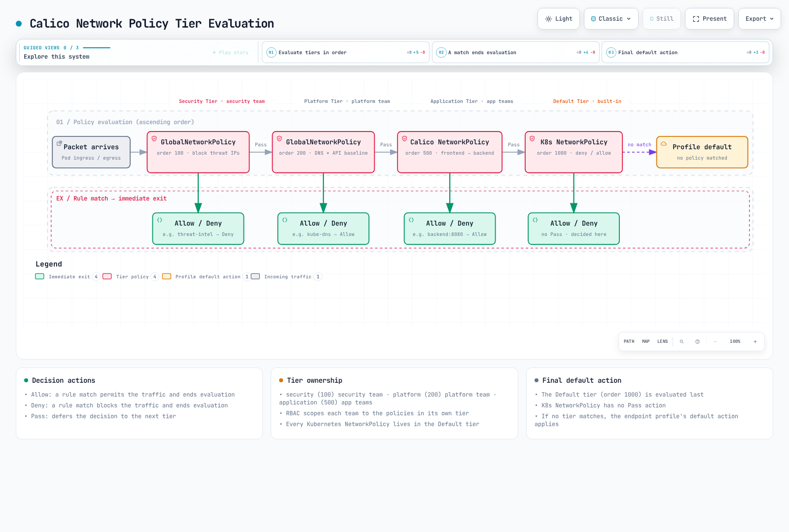

# パート 5: Network Policy

> **対応バージョン**: Calico v3.29+ / Kubernetes 1.28+ **最終更新**: February 23, 2026

## はじめに

Network Policy は Kubernetes セキュリティの基本要素であり、Pod、namespace、外部 endpoint 間のトラフィックフローを制御します。Kubernetes は基本的な NetworkPolicy API を提供しますが、Calico は Global Policy、階層化された Policy 評価、DNS ベースのルール、Layer 7 フィルタリングなどの強力な機能でこれを拡張します。

この詳細解説では、Kubernetes 標準 Policy と Calico の拡張機能の両方を取り上げ、エンタープライズのセキュリティ要件に対応するパターンと例を紹介します。

***

## Kubernetes 標準 NetworkPolicy

### NetworkPolicy の基礎

Kubernetes NetworkPolicy は namespace スコープのリソースであり、label、namespace、IP block に基づいて Pod への、および Pod からのトラフィックを制御します。


### 基本的な NetworkPolicy 構造

```yaml
apiVersion: networking.k8s.io/v1
kind: NetworkPolicy
metadata:
  name: example-policy
  namespace: default
spec:
  # Which pods this policy applies to
  podSelector:
    matchLabels:
      app: web

  # Policy types: Ingress, Egress, or both
  policyTypes:
    - Ingress
    - Egress

  # Ingress rules (who can connect TO these pods)
  ingress:
    - from:
        - podSelector:
            matchLabels:
              app: frontend
        - namespaceSelector:
            matchLabels:
              purpose: monitoring
        - ipBlock:
            cidr: 10.0.0.0/8
            except:
              - 10.0.1.0/24
      ports:
        - protocol: TCP
          port: 8080

  # Egress rules (where these pods can connect TO)
  egress:
    - to:
        - podSelector:
            matchLabels:
              app: database
      ports:
        - protocol: TCP
          port: 5432
```

### Kubernetes NetworkPolicy の制限事項

| 制限事項            | 説明                         | Calico の解決策          |
| --------------------- | ----------------------------------- | ------------------------ |
| Namespace スコープのみ | クラスター全体の Policy を作成できない | GlobalNetworkPolicy      |
| Policy の順序付けなし    | すべての Policy が同等に評価される      | 階層化 Policy          |
| Deny ルールなし         | Allow のみ（暗黙的な Deny）          | 明示的な Deny action    |
| 限定的な L4 フィルタリング  | 基本的な port/protocol のみ            | Port 範囲、名前付き port |
| L7 フィルタリングなし       | HTTP method でフィルタリングできない       | HTTP match ルール         |
| FQDN サポートなし       | domain name を使用できない             | DNS Policy               |
| Pod 中心のみ      | node を保護できない                | Host endpoint           |

***

## Calico NetworkPolicy 拡張機能

### 拡張 Protocol サポート

Calico は TCP と UDP 以外の追加 Protocol をサポートします。

```yaml
apiVersion: projectcalico.org/v3
kind: NetworkPolicy
metadata:
  name: extended-protocols
  namespace: default
spec:
  selector: app == 'network-tools'

  ingress:
    # ICMP ping
    - action: Allow
      protocol: ICMP
      icmp:
        type: 8  # Echo Request
        code: 0

    # ICMPv6
    - action: Allow
      protocol: ICMPv6
      icmp:
        type: 128  # Echo Request

    # SCTP
    - action: Allow
      protocol: SCTP
      destination:
        ports:
          - 3868  # Diameter

    # UDP with port range
    - action: Allow
      protocol: UDP
      destination:
        ports:
          - 5000:6000  # Port range
```

### Port 範囲と名前付き Port

```yaml
apiVersion: projectcalico.org/v3
kind: NetworkPolicy
metadata:
  name: port-examples
  namespace: default
spec:
  selector: app == 'multi-port-app'

  ingress:
    # Port range
    - action: Allow
      protocol: TCP
      destination:
        ports:
          - 8080:8090

    # Named ports (from pod spec)
    - action: Allow
      protocol: TCP
      destination:
        ports:
          - http      # References containerPort name
          - metrics   # References containerPort name

    # Mix of specific ports and ranges
    - action: Allow
      protocol: TCP
      destination:
        ports:
          - 22
          - 80
          - 443
          - 3000:3100
```

### 強化された Selector 構文

Calico は Kubernetes よりも表現力の高い selector 構文を使用します。

```yaml
apiVersion: projectcalico.org/v3
kind: NetworkPolicy
metadata:
  name: selector-examples
  namespace: production
spec:
  # Label equality
  selector: app == 'web'

  ingress:
    # Set membership
    - action: Allow
      source:
        selector: app in {'frontend', 'api-gateway', 'monitoring'}

    # Negation
    - action: Allow
      source:
        selector: app != 'untrusted'

    # Label existence
    - action: Allow
      source:
        selector: has(security-cleared)

    # Combining conditions (AND)
    - action: Allow
      source:
        selector: app == 'backend' && tier == 'internal'

    # Complex expression (OR via multiple rules)
    - action: Allow
      source:
        selector: (app == 'frontend') || (app == 'api')

    # Namespace selector
    - action: Allow
      source:
        namespaceSelector: environment == 'production'
        selector: app == 'authorized-client'
```

***

## GlobalNetworkPolicy

GlobalNetworkPolicy はすべての namespace に適用され、クラスター全体のセキュリティルールに最適です。

### GlobalNetworkPolicy の構造

```yaml
apiVersion: projectcalico.org/v3
kind: GlobalNetworkPolicy
metadata:
  name: cluster-wide-deny-egress
spec:
  # Applies to all pods (empty selector)
  selector: all()

  # Order determines priority (lower = higher priority)
  order: 1000

  types:
    - Egress

  egress:
    # Block access to metadata service
    - action: Deny
      destination:
        nets:
          - 169.254.169.254/32

    # Block access to internal DNS except kube-dns
    - action: Deny
      protocol: UDP
      destination:
        ports:
          - 53
        notSelector: k8s-app == 'kube-dns'
```

### 一般的な GlobalNetworkPolicy パターン

**すべてのトラフィックをデフォルトで Deny:**

```yaml
apiVersion: projectcalico.org/v3
kind: GlobalNetworkPolicy
metadata:
  name: default-deny-all
spec:
  selector: all()
  order: 10000  # Lowest priority
  types:
    - Ingress
    - Egress

  # Empty rules = deny all
  ingress: []
  egress: []
```

**必須 Service を Allow:**

```yaml
apiVersion: projectcalico.org/v3
kind: GlobalNetworkPolicy
metadata:
  name: allow-essential-services
spec:
  selector: all()
  order: 100
  types:
    - Egress

  egress:
    # Allow DNS
    - action: Allow
      protocol: UDP
      destination:
        selector: k8s-app == 'kube-dns'
        ports:
          - 53

    # Allow Kubernetes API
    - action: Allow
      protocol: TCP
      destination:
        nets:
          - 10.96.0.1/32  # ClusterIP of kubernetes service
        ports:
          - 443
```

**機密性の高い Namespace をブロック:**

```yaml
apiVersion: projectcalico.org/v3
kind: GlobalNetworkPolicy
metadata:
  name: protect-kube-system
spec:
  namespaceSelector: kubernetes.io/metadata.name == 'kube-system'
  order: 50
  types:
    - Ingress

  ingress:
    # Only allow from pods with explicit access
    - action: Allow
      source:
        selector: has(kube-system-access)

    # Allow from kube-system itself
    - action: Allow
      source:
        namespaceSelector: kubernetes.io/metadata.name == 'kube-system'

    # Deny everything else (implicit)
```

***

## NetworkSet と GlobalNetworkSet

NetworkSet は Policy 間で再利用するための IP address をグループ化します。

### NetworkSet（Namespace スコープ）

```yaml
apiVersion: projectcalico.org/v3
kind: NetworkSet
metadata:
  name: corporate-networks
  namespace: default
  labels:
    network-type: corporate
spec:
  nets:
    - 10.0.0.0/8
    - 172.16.0.0/12
    - 192.168.0.0/16

---
# Reference in policy
apiVersion: projectcalico.org/v3
kind: NetworkPolicy
metadata:
  name: allow-corporate
  namespace: default
spec:
  selector: app == 'internal-app'

  ingress:
    - action: Allow
      source:
        selector: network-type == 'corporate'  # References NetworkSet by label
```

### GlobalNetworkSet（クラスター スコープ）

```yaml
apiVersion: projectcalico.org/v3
kind: GlobalNetworkSet
metadata:
  name: external-trusted-ips
  labels:
    network-group: external-trusted
spec:
  nets:
    - 203.0.113.0/24     # Partner network
    - 198.51.100.0/24    # CDN network
    - 192.0.2.50/32      # Specific trusted IP

---
apiVersion: projectcalico.org/v3
kind: GlobalNetworkSet
metadata:
  name: blocked-countries
  labels:
    network-group: blocked
spec:
  nets:
    # Country IP ranges to block
    - 1.2.3.0/24
    - 5.6.7.0/24

---
# Reference in GlobalNetworkPolicy
apiVersion: projectcalico.org/v3
kind: GlobalNetworkPolicy
metadata:
  name: external-access-control
spec:
  selector: has(external-facing)
  order: 200
  types:
    - Ingress

  ingress:
    # Allow trusted external
    - action: Allow
      source:
        selector: network-group == 'external-trusted'

    # Block known bad actors
    - action: Deny
      source:
        selector: network-group == 'blocked'
```

***

## 階層化 Policy



[🔍 インタラクティブな図を表示](https://www.atomai.click/kubernetes-docs/archmaps/en-networking-calico-05-network-policy-2.html)

Tier は階層的な Policy 評価を提供し、platform、security、application team 間の関心の分離を実現します。

### Policy 評価順序


### Tier の作成

```yaml
# Security team tier (highest priority)
apiVersion: projectcalico.org/v3
kind: Tier
metadata:
  name: security
spec:
  order: 100

---
# Platform team tier
apiVersion: projectcalico.org/v3
kind: Tier
metadata:
  name: platform
spec:
  order: 200

---
# Application team tier
apiVersion: projectcalico.org/v3
kind: Tier
metadata:
  name: application
spec:
  order: 500

---
# Default tier (lowest priority, auto-created)
# order: 1000
```

### 階層化 Policy の例

```yaml
# Security tier: Block known threats
apiVersion: projectcalico.org/v3
kind: GlobalNetworkPolicy
metadata:
  name: security.block-threats
spec:
  tier: security
  order: 100
  selector: all()
  types:
    - Ingress
    - Egress

  ingress:
    - action: Deny
      source:
        selector: network-group == 'threat-intel'

  egress:
    - action: Deny
      destination:
        selector: network-group == 'malware-c2'

    # Pass to next tier for further evaluation
    - action: Pass

---
# Platform tier: Enforce baseline connectivity
apiVersion: projectcalico.org/v3
kind: GlobalNetworkPolicy
metadata:
  name: platform.baseline
spec:
  tier: platform
  order: 100
  selector: all()
  types:
    - Egress

  egress:
    # Allow DNS
    - action: Allow
      protocol: UDP
      destination:
        selector: k8s-app == 'kube-dns'
        ports:
          - 53

    # Allow Kubernetes API
    - action: Allow
      protocol: TCP
      destination:
        services:
          name: kubernetes
          namespace: default

    # Pass to application tier
    - action: Pass

---
# Application tier: Team-specific policies
apiVersion: projectcalico.org/v3
kind: NetworkPolicy
metadata:
  name: application.frontend-rules
  namespace: production
spec:
  tier: application
  order: 100
  selector: app == 'frontend'
  types:
    - Ingress
    - Egress

  ingress:
    - action: Allow
      source:
        selector: app == 'ingress-nginx'

  egress:
    - action: Allow
      destination:
        selector: app == 'backend'
        ports:
          - 8080
```

### Tier RBAC 統合

```yaml
# ClusterRole for security team
apiVersion: rbac.authorization.k8s.io/v1
kind: ClusterRole
metadata:
  name: security-team-policy-admin
rules:
  - apiGroups: ["projectcalico.org"]
    resources: ["globalnetworkpolicies", "tiers"]
    verbs: ["*"]
    # Can only manage policies in security tier
    resourceNames: ["security.*"]

---
# ClusterRole for application teams
apiVersion: rbac.authorization.k8s.io/v1
kind: ClusterRole
metadata:
  name: app-team-policy-admin
rules:
  - apiGroups: ["projectcalico.org"]
    resources: ["networkpolicies"]
    verbs: ["*"]
  - apiGroups: ["projectcalico.org"]
    resources: ["tiers"]
    verbs: ["get", "list"]
    resourceNames: ["application"]
```

***

## FQDN ベースの Egress Policy

Calico は domain name に基づいて Egress トラフィックをフィルタリングできます。これは外部 Service へのアクセス制御に役立ちます。

### DNS Policy の設定

まず、Felix で DNS Policy を有効にします。

```yaml
apiVersion: projectcalico.org/v3
kind: FelixConfiguration
metadata:
  name: default
spec:
  dnsTrustedServers:
    - k8s-service:kube-system/kube-dns
  policySyncPathPrefix: /var/run/nodeagent
```

### FQDN Egress ルール

```yaml
apiVersion: projectcalico.org/v3
kind: GlobalNetworkPolicy
metadata:
  name: allow-specific-domains
spec:
  selector: app == 'external-api-client'
  order: 500
  types:
    - Egress

  egress:
    # Allow specific domains
    - action: Allow
      destination:
        domains:
          - api.github.com
          - "*.amazonaws.com"
          - registry.npmjs.org
      protocol: TCP
      destination:
        ports:
          - 443

    # Allow Google APIs
    - action: Allow
      destination:
        domains:
          - "*.googleapis.com"
          - "*.google.com"
      protocol: TCP
      destination:
        ports:
          - 443

    # Deny all other external
    - action: Deny
      destination:
        notNets:
          - 10.0.0.0/8
          - 172.16.0.0/12
          - 192.168.0.0/16
```

### Wildcard Domain パターン

```yaml
apiVersion: projectcalico.org/v3
kind: GlobalNetworkPolicy
metadata:
  name: dns-wildcards
spec:
  selector: all()
  egress:
    # Single wildcard - matches any subdomain
    - action: Allow
      destination:
        domains:
          - "*.example.com"     # Matches api.example.com, www.example.com

    # Does NOT match
    # example.com (no subdomain)
    # deep.sub.example.com (multiple levels)
```

***

## HTTP Method フィルタリング（Layer 7）

Calico Enterprise と Calico Cloud は HTTP トラフィック向けの Layer 7 Policy をサポートします。

### HTTP Match ルール

```yaml
apiVersion: projectcalico.org/v3
kind: GlobalNetworkPolicy
metadata:
  name: l7-http-policy
spec:
  selector: app == 'api-server'
  order: 300
  types:
    - Ingress

  ingress:
    # Allow only GET and HEAD for read-only clients
    - action: Allow
      source:
        selector: role == 'reader'
      http:
        methods:
          - GET
          - HEAD
        paths:
          - prefix: /api/v1/

    # Allow full access for admin clients
    - action: Allow
      source:
        selector: role == 'admin'
      http:
        methods:
          - GET
          - POST
          - PUT
          - DELETE
          - PATCH

    # Allow health checks
    - action: Allow
      http:
        methods:
          - GET
        paths:
          - exact: /health
          - exact: /ready
```

### Path ベースのフィルタリング

```yaml
apiVersion: projectcalico.org/v3
kind: NetworkPolicy
metadata:
  name: path-based-policy
  namespace: production
spec:
  selector: app == 'web-app'

  ingress:
    # Public endpoints
    - action: Allow
      http:
        paths:
          - prefix: /public/
          - exact: /

    # Admin endpoints - restricted
    - action: Allow
      source:
        selector: role == 'admin'
      http:
        paths:
          - prefix: /admin/

    # API endpoints - authenticated only
    - action: Allow
      source:
        selector: has(api-access)
      http:
        paths:
          - prefix: /api/
```

***

## Host Endpoint 保護

Host endpoint は Pod だけでなく、node 自体への、および node 自体からのトラフィックを保護します。

### Host Endpoint の有効化

```yaml
apiVersion: projectcalico.org/v3
kind: FelixConfiguration
metadata:
  name: default
spec:
  defaultEndpointToHostAction: Drop  # or Accept, Return
```

### Host Endpoint の定義

```yaml
apiVersion: projectcalico.org/v3
kind: HostEndpoint
metadata:
  name: node1-eth0
  labels:
    host: node1
    interface: external
spec:
  interfaceName: eth0
  node: node1
  expectedIPs:
    - 10.0.1.10

---
# Policy for host endpoints
apiVersion: projectcalico.org/v3
kind: GlobalNetworkPolicy
metadata:
  name: host-ssh-policy
spec:
  selector: interface == 'external'
  order: 100
  types:
    - Ingress

  ingress:
    # Allow SSH from bastion
    - action: Allow
      protocol: TCP
      source:
        nets:
          - 10.0.0.100/32  # Bastion IP
      destination:
        ports:
          - 22

    # Allow kubelet API from control plane
    - action: Allow
      protocol: TCP
      source:
        selector: has(control-plane)
      destination:
        ports:
          - 10250

    # Allow node exporter metrics
    - action: Allow
      protocol: TCP
      source:
        namespaceSelector: kubernetes.io/metadata.name == 'monitoring'
        selector: app == 'prometheus'
      destination:
        ports:
          - 9100
```

### Auto Host Endpoint

すべての node に対する Host endpoint を自動的に作成します。

```yaml
apiVersion: projectcalico.org/v3
kind: FelixConfiguration
metadata:
  name: default
spec:
  defaultEndpointToHostAction: Drop

---
apiVersion: operator.tigera.io/v1
kind: Installation
metadata:
  name: default
spec:
  calicoNetwork:
    hostPorts: Enabled  # Creates auto host endpoints
```

***

## DoNotTrack と PreDNAT Policy

### DoNotTrack Policy

DoNotTrack Policy は connection tracking をバイパスするため、高スループットのシナリオに役立ちます。

```yaml
apiVersion: projectcalico.org/v3
kind: GlobalNetworkPolicy
metadata:
  name: high-throughput-no-track
spec:
  selector: app == 'load-balancer'
  order: 10
  types:
    - Ingress
    - Egress

  doNotTrack: true
  applyOnForward: true

  ingress:
    - action: Allow
      protocol: TCP
      destination:
        ports:
          - 80
          - 443

  egress:
    - action: Allow
```

### PreDNAT Policy

PreDNAT Policy は destination NAT の前に適用され、NodePort アクセスの制御に役立ちます。

```yaml
apiVersion: projectcalico.org/v3
kind: GlobalNetworkPolicy
metadata:
  name: restrict-nodeport-access
spec:
  selector: has(kubernetes.io/os)  # Applies to host endpoints
  order: 100
  types:
    - Ingress

  preDNAT: true
  applyOnForward: true

  ingress:
    # Allow NodePort access only from trusted networks
    - action: Allow
      protocol: TCP
      source:
        nets:
          - 10.0.0.0/8
      destination:
        ports:
          - 30000:32767  # NodePort range

    # Deny NodePort from everywhere else
    - action: Deny
      protocol: TCP
      destination:
        ports:
          - 30000:32767
```

***

## Policy のデバッグ

### calicoctl の使用

```bash
# List all policies
calicoctl get networkpolicy -A
calicoctl get globalnetworkpolicy

# Get policy details
calicoctl get networkpolicy my-policy -n default -o yaml

# Describe endpoints affected by a policy
calicoctl get workloadendpoint -o wide

# Check policy selectors
calicoctl get networkpolicy -o yaml | grep -A5 selector
```

### iptables ルールの確認

```bash
# View Calico chains
iptables -L -n -v | grep -i cali

# View filter table
iptables -t filter -L -n -v

# View NAT table
iptables -t nat -L -n -v

# Count packets by rule
iptables -L cali-fw-xxxxx -n -v

# Watch traffic in real-time
watch -n 1 'iptables -L cali-fw-xxxxx -n -v'
```

### Felix ログ

```bash
# View Felix logs
kubectl logs -n kube-system -l k8s-app=calico-node -c calico-node | grep -i policy

# Increase log verbosity
calicoctl patch felixconfiguration default -p '{"spec":{"logSeverityScreen":"Debug"}}'

# Check policy sync status
kubectl exec -n kube-system calico-node-xxxxx -c calico-node -- calico-node -felix-ready
```

### Policy 評価フローのデバッグ

```bash
# Get workload endpoint details
calicoctl get workloadendpoint -n default --selector='app==web' -o yaml

# Check which policies apply
calicoctl get networkpolicy -A -o yaml | grep -B20 "app.*web"

# Test connectivity
kubectl exec -it test-pod -- nc -zv target-pod 8080
```

***

## 一般的な Policy パターン ライブラリ

### Microservices パターン

```yaml
# Frontend -> Backend -> Database
---
apiVersion: projectcalico.org/v3
kind: NetworkPolicy
metadata:
  name: frontend-policy
  namespace: production
spec:
  selector: app == 'frontend'
  types:
    - Ingress
    - Egress

  ingress:
    - action: Allow
      source:
        selector: app == 'ingress-nginx'

  egress:
    - action: Allow
      destination:
        selector: app == 'backend'
        ports:
          - 8080

---
apiVersion: projectcalico.org/v3
kind: NetworkPolicy
metadata:
  name: backend-policy
  namespace: production
spec:
  selector: app == 'backend'
  types:
    - Ingress
    - Egress

  ingress:
    - action: Allow
      source:
        selector: app == 'frontend'
        ports:
          - 8080

  egress:
    - action: Allow
      destination:
        selector: app == 'database'
        ports:
          - 5432

---
apiVersion: projectcalico.org/v3
kind: NetworkPolicy
metadata:
  name: database-policy
  namespace: production
spec:
  selector: app == 'database'
  types:
    - Ingress

  ingress:
    - action: Allow
      source:
        selector: app == 'backend'
        ports:
          - 5432
```

### Multi-Tenant 分離

```yaml
# Each tenant namespace is fully isolated
apiVersion: projectcalico.org/v3
kind: GlobalNetworkPolicy
metadata:
  name: tenant-isolation
spec:
  namespaceSelector: has(tenant)
  order: 500
  types:
    - Ingress
    - Egress

  ingress:
    # Allow same-tenant traffic
    - action: Allow
      source:
        namespaceSelector: tenant == "$(namespace.tenant)"

  egress:
    # Allow same-tenant traffic
    - action: Allow
      destination:
        namespaceSelector: tenant == "$(namespace.tenant)"

    # Allow DNS
    - action: Allow
      protocol: UDP
      destination:
        selector: k8s-app == 'kube-dns'
        ports:
          - 53
```

### Zero Trust パターン

```yaml
# Default deny everything
apiVersion: projectcalico.org/v3
kind: GlobalNetworkPolicy
metadata:
  name: zero-trust-default-deny
spec:
  selector: all()
  order: 10000
  types:
    - Ingress
    - Egress
  ingress: []
  egress: []

---
# Explicit allow for each service
apiVersion: projectcalico.org/v3
kind: NetworkPolicy
metadata:
  name: zero-trust-api-server
  namespace: production
spec:
  selector: app == 'api-server'
  order: 100
  types:
    - Ingress
    - Egress

  ingress:
    - action: Allow
      source:
        selector: app == 'api-gateway'
        namespaceSelector: kubernetes.io/metadata.name == 'production'
      destination:
        ports:
          - 8080

  egress:
    - action: Allow
      destination:
        selector: app == 'database'
        namespaceSelector: kubernetes.io/metadata.name == 'production'
        ports:
          - 5432

    # Allow DNS
    - action: Allow
      protocol: UDP
      destination:
        namespaceSelector: kubernetes.io/metadata.name == 'kube-system'
        selector: k8s-app == 'kube-dns'
        ports:
          - 53
```

### Egress 制御パターン

```yaml
# Control outbound internet access
apiVersion: projectcalico.org/v3
kind: GlobalNetworkPolicy
metadata:
  name: egress-internet-control
spec:
  selector: has(internet-access)
  order: 300
  types:
    - Egress

  egress:
    # Allow approved external services
    - action: Allow
      destination:
        domains:
          - "*.amazonaws.com"
          - api.github.com
          - registry.npmjs.org
      protocol: TCP
      destination:
        ports:
          - 443

    # Allow internal traffic
    - action: Allow
      destination:
        nets:
          - 10.0.0.0/8
          - 172.16.0.0/12
          - 192.168.0.0/16

---
# Block internet for unlabeled pods
apiVersion: projectcalico.org/v3
kind: GlobalNetworkPolicy
metadata:
  name: egress-internet-deny
spec:
  selector: "!has(internet-access)"
  order: 400
  types:
    - Egress

  egress:
    # Allow internal only
    - action: Allow
      destination:
        nets:
          - 10.0.0.0/8
          - 172.16.0.0/12
          - 192.168.0.0/16

    # Deny external
    - action: Deny
```

### Namespace 分離パターン

```yaml
# Isolate namespaces by default
apiVersion: projectcalico.org/v3
kind: GlobalNetworkPolicy
metadata:
  name: namespace-isolation
spec:
  namespaceSelector: has(kubernetes.io/metadata.name)
  order: 800
  types:
    - Ingress

  ingress:
    # Allow same namespace
    - action: Allow
      source:
        namespaceSelector: kubernetes.io/metadata.name == "$(namespace.name)"

    # Allow monitoring namespace
    - action: Allow
      source:
        namespaceSelector: kubernetes.io/metadata.name == 'monitoring'
        selector: app in {'prometheus', 'grafana'}

    # Allow ingress namespace
    - action: Allow
      source:
        namespaceSelector: kubernetes.io/metadata.name == 'ingress-nginx'
```

***

## Policy のパフォーマンスへの影響

### パフォーマンスに関する考慮事項

| 要因              | 影響                  | 緩和策                              |
| ------------------- | ----------------------- | --------------------------------------- |
| Policy の数  | 線形的なルール評価  | 階層化 Policy を使用し、selector を最適化 |
| Selector の複雑さ | 一致判定時間の増加 | 単純な label 一致を使用                |
| IP set のサイズ         | メモリ使用量            | IP 範囲を集約する                     |
| Log の頻度       | CPU とストレージ         | 大量トラフィックには sampling を使用            |
| Connection tracking | stateful 接続のメモリ     | stateless 接続には DoNotTrack を使用                |

### 最適化のヒント

1. **階層化 Policy を使用する**: 最初に Deny ルールを評価する
2. **Selector の複雑さを最小化する**: set operation より equality を優先する
3. **IP 範囲を集約する**: 個別の IP ではなく CIDR block を使用する
4. **GlobalNetworkSet を使用する**: Policy 間で IP group を再利用する
5. **Policy caching を有効にする**: 最近の Calico version ではデフォルト

### Policy パフォーマンスのベンチマーク

```bash
# Measure rule evaluation time
kubectl exec -n kube-system calico-node-xxxxx -c calico-node -- \
  calico-node -felix-ready

# Check dataplane programming time
kubectl logs -n kube-system -l k8s-app=calico-node -c calico-node | \
  grep "Policy sync"

# Monitor iptables rule count
iptables -L -n | wc -l
```

***

## ベストプラクティスの要約

### 設計原則

1. **デフォルト Deny から始める**: 必要なトラフィックを Allow list に登録する
2. **最小権限を使用する**: 必要な port と protocol のみを Allow する
3. **Policy をレイヤー化する**: Security -> Platform -> Application
4. **一貫して label を付ける**: Policy targeting には標準 label を使用する
5. **Policy を文書化する**: 意図を説明する comment を含める

### 運用上の推奨事項

1. **最初に staging でテストする**: production の前に Policy を検証する
2. **audit mode を使用する**: 新しい Policy を強制する前に Log を記録する
3. **Policy hit count を監視する**: 未使用のルールを特定する
4. **定期的に Policy をレビューする**: 古いルールを削除する
5. **Policy deployment を自動化する**: Policy 管理に GitOps を使用する

### セキュリティの推奨事項

1. **metadata Service をブロックする**: SSRF attack を防止する
2. **Egress を制御する**: 承認済み destination への外部アクセスを制限する
3. **control plane を保護する**: kube-system へのアクセスを制限する
4. **logging を有効にする**: deny された接続を監査する
5. **FQDN Policy を使用する**: 名前によって外部 Service へのアクセスを制御する

***

## 参考資料

* [Calico Network Policy ドキュメント](https://docs.tigera.io/calico/latest/network-policy/)
* [Kubernetes Network Policy](https://kubernetes.io/docs/concepts/services-networking/network-policies/)
* [Calico Policy チュートリアル](https://docs.tigera.io/calico/latest/network-policy/get-started/calico-policy/calico-policy-tutorial)
* [Tigera Policy ベストプラクティス](https://docs.tigera.io/calico/latest/network-policy/policy-best-practices)
