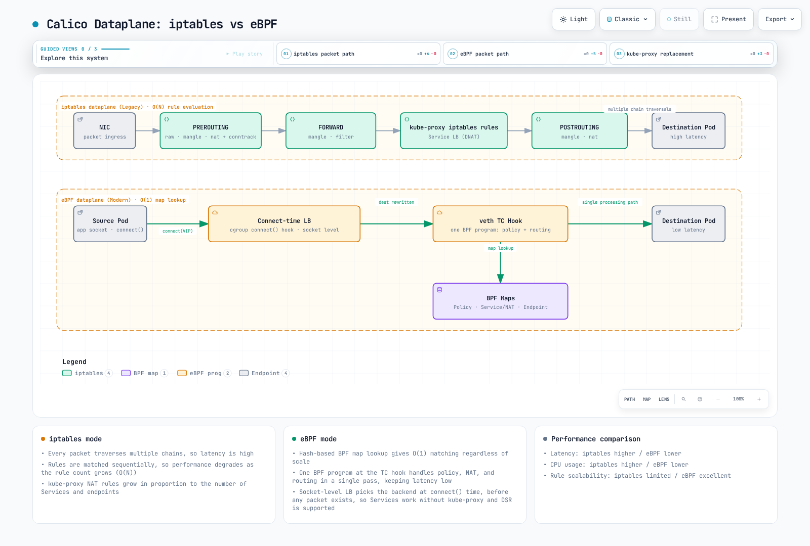

# Part 6: eBPF Dataplane

> **対応バージョン**: Calico v3.29+ / Kubernetes 1.28+ **最終更新**: February 23, 2026

## はじめに

Calico の eBPF dataplane は Kubernetes ネットワーキングにおける重要な進化であり、従来の iptables ベースのパケット処理を最新の eBPF プログラムに置き換えます。このアプローチにより、大幅なパフォーマンス向上、レイテンシー削減、そして強化された可観測性機能が実現します。

この詳細解説では、ネットワーキングの観点から eBPF の基礎、Calico の eBPF アーキテクチャ、移行戦略、パフォーマンス最適化手法を扱います。

***

## eBPF の基礎

### eBPF とは？

eBPF（extended Berkeley Packet Filter）は、カーネルのソースコードを変更したりカーネルモジュールをロードしたりすることなく、Linux カーネル内でサンドボックス化されたプログラムを実行できる革新的な技術です。


### ネットワーキングにおける主要な eBPF の概念

| 概念      | 説明                              | Calico での用途                       |
| ------------ | ---------------------------------------- | ----------------------------------- |
| **プログラム** | カーネルフックで実行されるバイトコード        | パケットフィルタリング、ルーティング           |
| **マップ**     | プログラム間で共有されるキー・バリューストア | ルートテーブル、ポリシールール          |
| **フック**    | カーネル内のアタッチポイント              | XDP、TC、ソケット                     |
| **ヘルパー**  | eBPF から呼び出せるカーネル関数      | パケット操作、マップ操作 |
| **BTF**      | マップ/プログラムの型情報       | デバッグ情報、CO-RE                   |

### eBPF と iptables の比較

| 観点               | iptables                  | eBPF              |
| -------------------- | ------------------------- | ----------------- |
| **アーキテクチャ**     | 逐次的なルールチェーン    | 直接実行  |
| **複雑性**       | O(n) ルール照合        | O(1) マップ検索   |
| **カーネル境界の通過** | パケットごとに複数回       | 最小限           |
| **プログラム可能性**  | 固定されたルールタイプ          | 柔軟なプログラム |
| **可観測性**    | 限定的なカウンター          | 豊富なメトリクス      |
| **CPU 効率**   | より高い割り込みオーバーヘッド | より低いオーバーヘッド    |

***

## Calico eBPF アーキテクチャ



[🔍 インタラクティブな図を表示](https://www.atomai.click/kubernetes-docs/archmaps/en-networking-calico-06-ebpf-dataplane-9.html)

### アーキテクチャの比較


### Calico における eBPF プログラムのタイプ

Calico は異なる機能のために複数の eBPF プログラムタイプを使用します。


### TC（Traffic Control）プログラム

TC プログラムは Calico の主要な dataplane フックです。

```
Ingress TC Program Functions:
├── Policy enforcement (allow/deny)
├── Connection tracking lookup
├── Service load balancing (DNAT)
├── Tunnel decapsulation
└── Metrics collection

Egress TC Program Functions:
├── Policy enforcement (egress rules)
├── SNAT for masquerade
├── Tunnel encapsulation
└── DSR return path handling
```

### XDP（eXpress Data Path）プログラム

XDP は最も早いパケット処理フックを提供します。


### ソケットプログラム

Service mesh 統合のためのソケットレベル eBPF:

```yaml
# sockops: Intercept socket operations
- connect() -> Redirect to local sidecar
- accept() -> Apply connection policies
- close() -> Cleanup connection state

# sk_msg: Process socket data
- sendmsg() -> Apply L7 policy
- recvmsg() -> Inspect response
```

***

## BPF マップ構造

### Calico で使用されるマップタイプ

| マップタイプ          | 目的              | 使用例         |
| ----------------- | -------------------- | ------------------- |
| **Hash Map**      | キー・バリュー検索     | Connection tracking |
| **LRU Hash**      | 自動退避キャッシュ  | NAT テーブル           |
| **Array**         | 固定サイズのインデックス   | Endpoint 設定     |
| **LPM Trie**      | 最長プレフィックス一致 | ルート検索        |
| **Per-CPU Array** | スケーラブルなカウンター    | 統計情報          |

### ルートマップ構造

```c
// Simplified route map entry
struct calico_route_key {
    __be32 prefix;
    __u32 prefix_len;
};

struct calico_route_value {
    __u32 flags;          // LOCAL, REMOTE, HOST, etc.
    __be32 next_hop;      // Next hop IP
    __u32 ifindex;        // Interface index
    __u8 mac[6];          // Destination MAC
};
```

### Connection Tracking マップ

```c
// Connection tracking key
struct calico_ct_key {
    __be32 src_ip;
    __be32 dst_ip;
    __be16 src_port;
    __be16 dst_port;
    __u8 protocol;
};

// Connection tracking value
struct calico_ct_value {
    __u64 created;        // Timestamp
    __u64 last_seen;      // Last packet
    __be32 orig_dst;      // Pre-DNAT destination
    __be16 orig_port;     // Pre-DNAT port
    __u32 flags;          // Connection state
};
```

### ポリシーマップ構造

```c
// Policy rule entry
struct calico_policy_key {
    __u32 policy_id;
    __u32 rule_index;
};

struct calico_policy_value {
    __u32 action;         // ALLOW, DENY, PASS
    __u32 flags;
    __be32 src_net;
    __be32 src_mask;
    __be32 dst_net;
    __be32 dst_mask;
    __be16 port_start;
    __be16 port_end;
};
```

***

## Direct Server Return（DSR）

### DSR の概要

DSR は応答トラフィックがロードバランサーをバイパスできるようにし、レイテンシーとロードバランサーのリソース消費を削減します。


### Calico の DSR モード

| モード         | 説明              | ユースケース                  |
| ------------ | ------------------------ | ------------------------- |
| **無効** | すべてのトラフィックが LB を通過   | デフォルト、すべての環境 |
| **IPIP**     | IPIP トンネル経由の応答 | サブネット間              |
| **DSR**      | 直接応答          | 同一 L2 ネットワーク           |

### DSR の有効化

```yaml
apiVersion: projectcalico.org/v3
kind: FelixConfiguration
metadata:
  name: default
spec:
  bpfEnabled: true
  bpfExternalServiceMode: DSR
```

### DSR の要件

* サーバーとクライアントが同一の L2 ネットワークにあること、または
* サブネット間では IPIP/VXLAN カプセル化を使用すること
* 外部クライアント IP がサーバーからルーティング可能であること
* ingress パスに SNAT がないこと

***

## Connect-Time Load Balancing

### 従来方式と Connect-Time LB の比較


### Connect-Time LB の利点

| 観点                  | パケット単位          | Connect-Time          |
| ----------------------- | ------------------- | --------------------- |
| **NAT オーバーヘッド**        | すべてのパケット        | 接続設定時のみ |
| **Connection tracking** | 必要            | 最小限               |
| **レイテンシー**             | 高い（NAT 検索） | 低い（直接）        |
| **CPU 使用量**           | 高い              | 低い                 |

### Connect-Time LB の仕組み

```c
// Simplified connect-time LB logic
int bpf_connect4(struct bpf_sock_addr *ctx) {
    // Check if destination is a Service IP
    struct lb_backend *backend = lookup_service(ctx->user_ip4, ctx->user_port);

    if (backend) {
        // Rewrite destination to backend pod
        ctx->user_ip4 = backend->pod_ip;
        ctx->user_port = backend->pod_port;
    }

    return 1; // Allow connection
}
```

***

## XDP アクセラレーション

### XDP 処理レベル


### XDP モード

| モード        | 場所      | パフォーマンス | 要件   |
| ----------- | ------------- | ----------- | -------------- |
| **Offload** | NIC ハードウェア  | 最速     | SmartNIC       |
| **Native**  | NIC ドライバー    | 高速        | ドライバーサポート |
| **Generic** | ネットワークスタック | ベースライン    | 任意の NIC        |

### Calico で XDP を有効にする

```yaml
apiVersion: projectcalico.org/v3
kind: FelixConfiguration
metadata:
  name: default
spec:
  bpfEnabled: true

  # XDP mode: Disabled, Enabled, Offload
  xdpEnabled: Enabled

  # Interfaces for XDP
  # Uses same detection as BPF dataplane interface
```

### Calico における XDP のユースケース

1. **DDoS 保護**: NIC で悪意のあるトラフィックをドロップ
2. **ブロックリスト適用**: ブロックされた IP を早期に拒否
3. **レート制限**: スタック処理前のパケットレート制限
4. **メトリクス収集**: ワイヤスピードでのパケットカウント

***

## eBPF モードの要件

### カーネル要件

| 要件      | 最低バージョン | 注記                     |
| ---------------- | --------------- | ------------------------- |
| **Linux Kernel** | 5.3+            | 5.8+ を推奨          |
| **BTF サポート**  | 必須        | `CONFIG_DEBUG_INFO_BTF=y` |
| **BPF Syscall**  | 必須        | `CONFIG_BPF_SYSCALL=y`    |
| **BPF JIT**      | 必須        | `CONFIG_BPF_JIT=y`        |

### カーネルサポートの確認

```bash
# Check kernel version
uname -r

# Check BTF support
ls /sys/kernel/btf/vmlinux

# Check BPF support
cat /boot/config-$(uname -r) | grep -E "CONFIG_BPF|CONFIG_DEBUG_INFO_BTF"

# Required output:
# CONFIG_BPF=y
# CONFIG_BPF_SYSCALL=y
# CONFIG_BPF_JIT=y
# CONFIG_DEBUG_INFO_BTF=y
```

### ディストリビューションのサポート

| ディストリビューション      | eBPF 対応 | 注記                        |
| ----------------- | ---------- | ---------------------------- |
| Ubuntu 20.04+     | はい        | Kernel 5.4+                  |
| Ubuntu 22.04+     | はい        | Kernel 5.15+（推奨）   |
| RHEL/CentOS 8.2+  | はい        | バックポート付き Kernel 4.18+  |
| Amazon Linux 2    | 一部    | Kernel のアップグレードが必要な場合あり      |
| Amazon Linux 2023 | はい        | Kernel 6.1+                  |
| Bottlerocket      | はい        | コンテナ専用に構築 |

### Calico バージョンの要件

```yaml
# Minimum Calico versions for eBPF features
eBPF dataplane basic:     v3.13.0
Connect-time LB:          v3.16.0
XDP acceleration:         v3.18.0
Dual-stack eBPF:         v3.20.0
Host-networked pods:      v3.13.0 (with limitations)
```

### Node の設定

```yaml
apiVersion: projectcalico.org/v3
kind: FelixConfiguration
metadata:
  name: default
spec:
  # Enable eBPF dataplane
  bpfEnabled: true

  # Data interface detection
  # Auto-detect: first interface with default route
  # Or specify pattern: "eth*"
  bpfDataIfacePattern: "^((en|eth|wl)[opsx].*|(eth|wlan|eno)[0-9].*)"

  # External service mode: Tunnel or DSR
  bpfExternalServiceMode: Tunnel

  # Log level for BPF programs
  bpfLogLevel: Info

  # Kube-proxy replacement
  bpfKubeProxyIptablesCleanupEnabled: true

  # Connection tracking
  bpfConnectTimeLoadBalancingEnabled: true
```

***

## iptables から eBPF への移行

### 移行前チェックリスト

```bash
# 1. Verify kernel requirements
uname -r  # Should be 5.3+
ls /sys/kernel/btf/vmlinux  # BTF must exist

# 2. Check Calico version
kubectl get deployment -n kube-system calico-kube-controllers -o jsonpath='{.spec.template.spec.containers[0].image}'
# Should be v3.13.0+

# 3. Verify CNI plugin
kubectl get ds -n kube-system calico-node -o jsonpath='{.spec.template.spec.containers[0].env}' | grep -i cni

# 4. Check existing networking mode
calicoctl get felixconfiguration default -o yaml | grep -i bpf

# 5. Verify no conflicting CNI
ls /etc/cni/net.d/
```

### 移行手順

**ステップ 1: FelixConfiguration を更新（dry-run）**

```yaml
# Save current configuration
kubectl get felixconfiguration default -o yaml > felix-backup.yaml

# Create eBPF configuration
apiVersion: projectcalico.org/v3
kind: FelixConfiguration
metadata:
  name: default
spec:
  bpfEnabled: false  # Not enabled yet
  bpfLogLevel: Debug  # For troubleshooting
  bpfDataIfacePattern: "^((en|eth|wl)[opsx].*|(eth|wlan|eno)[0-9].*)"
  bpfExternalServiceMode: Tunnel
  bpfKubeProxyIptablesCleanupEnabled: false  # Don't cleanup yet
```

**ステップ 2: kube-proxy を無効化（Calico を代替として使用する場合）**

```bash
# Option A: Scale down kube-proxy
kubectl -n kube-system patch daemonset kube-proxy -p '{"spec":{"template":{"spec":{"nodeSelector":{"non-calico":"true"}}}}}'

# Option B: Add calico node selector to skip kube-proxy nodes
# Only if running both temporarily
```

**ステップ 3: テスト Node で eBPF を有効化**

```bash
# Label test node
kubectl label node test-node-1 calico-ebpf=enabled

# Apply node-specific config
calicoctl apply -f - <<EOF
apiVersion: projectcalico.org/v3
kind: FelixConfiguration
metadata:
  name: node.test-node-1
spec:
  bpfEnabled: true
EOF
```

**ステップ 4: テスト Node を検証**

```bash
# Check BPF programs loaded
kubectl exec -n kube-system calico-node-xxxxx -c calico-node -- \
  bpftool prog list

# Verify connectivity
kubectl run test-pod --image=busybox --restart=Never --overrides='{"spec":{"nodeName":"test-node-1"}}' -- sleep 3600
kubectl exec test-pod -- wget -O- http://kubernetes.default.svc

# Check logs
kubectl logs -n kube-system -l k8s-app=calico-node -c calico-node | grep -i bpf
```

**ステップ 5: すべての Node にロールアウト**

```yaml
apiVersion: projectcalico.org/v3
kind: FelixConfiguration
metadata:
  name: default
spec:
  bpfEnabled: true
  bpfLogLevel: Info
  bpfDataIfacePattern: "^((en|eth|wl)[opsx].*|(eth|wlan|eno)[0-9].*)"
  bpfExternalServiceMode: Tunnel
  bpfKubeProxyIptablesCleanupEnabled: true
  bpfConnectTimeLoadBalancingEnabled: true
```

**ステップ 6: iptables ルールをクリーンアップ**

```bash
# After confirming eBPF is working
calicoctl patch felixconfiguration default -p '{"spec":{"bpfKubeProxyIptablesCleanupEnabled":true}}'

# Verify iptables rules are minimal
iptables -L -n | wc -l  # Should be significantly reduced
```

### ロールバック手順

```bash
# Disable eBPF
calicoctl patch felixconfiguration default -p '{"spec":{"bpfEnabled":false}}'

# Restore kube-proxy if disabled
kubectl -n kube-system patch daemonset kube-proxy -p '{"spec":{"template":{"spec":{"nodeSelector":null}}}}'

# Wait for calico-node restart
kubectl rollout status ds/calico-node -n kube-system

# Verify iptables rules restored
iptables -L -n -v
```

***

## パフォーマンスベンチマーク

### レイテンシーの比較

| シナリオ                | iptables | eBPF  | 改善率 |
| ----------------------- | -------- | ----- | ----------- |
| Pod 間（同一 Node）  | 45 μs    | 25 μs | 44%         |
| Pod 間（異なる Node） | 120 μs   | 80 μs | 33%         |
| Service（ClusterIP）     | 150 μs   | 60 μs | 60%         |
| Service（NodePort）      | 180 μs   | 70 μs | 61%         |

### スループットの比較

| シナリオ            | iptables | eBPF    | 改善率 |
| ------------------- | -------- | ------- | ----------- |
| TCP 単一ストリーム   | 15 Gbps  | 23 Gbps | 53%         |
| TCP 複数ストリーム    | 35 Gbps  | 48 Gbps | 37%         |
| UDP 単一ストリーム   | 8 Gbps   | 18 Gbps | 125%        |
| 小さいパケット（64B） | 2M pps   | 5M pps  | 150%        |

### CPU 効率

```
Connection rate test (connections/sec):

iptables dataplane:
├── 1000 rules: 50,000 conn/s
├── 5000 rules: 35,000 conn/s
└── 10000 rules: 20,000 conn/s

eBPF dataplane:
├── 1000 rules: 120,000 conn/s
├── 5000 rules: 115,000 conn/s
└── 10000 rules: 110,000 conn/s

Note: eBPF performance remains nearly constant regardless of rule count
```

### 独自ベンチマークの実行

```bash
# Install netperf
apt-get install netperf

# Pod-to-Pod latency (TCP_RR)
kubectl exec client-pod -- netperf -H server-pod-ip -t TCP_RR -l 30

# Throughput (TCP_STREAM)
kubectl exec client-pod -- netperf -H server-pod-ip -t TCP_STREAM -l 30

# Service latency
kubectl exec client-pod -- netperf -H service-cluster-ip -t TCP_RR -l 30

# Compare with iperf3
kubectl exec client-pod -- iperf3 -c server-pod-ip -t 30
```

***

## eBPF のデバッグ

### bpftool コマンド

```bash
# List loaded BPF programs
bpftool prog list

# Show program details
bpftool prog show id 123

# Dump program instructions
bpftool prog dump xlated id 123

# List BPF maps
bpftool map list

# Dump map contents
bpftool map dump id 456

# Show map entries
bpftool map lookup id 456 key 0x0a 0x00 0x01 0x0a
```

### TC フィルターの調査

```bash
# Show TC filters on interface
tc filter show dev eth0 ingress
tc filter show dev eth0 egress

# Show BPF program attached to TC
tc filter show dev eth0 ingress | grep bpf

# Detailed filter info
tc -s filter show dev eth0 ingress
```

### Calico BPF のデバッグ

```bash
# Enable debug logging
calicoctl patch felixconfiguration default -p '{"spec":{"bpfLogLevel":"Debug"}}'

# View BPF debug logs
kubectl logs -n kube-system -l k8s-app=calico-node -c calico-node | grep -i "bpf\|ebpf"

# Check BPF map contents via calico-node
kubectl exec -n kube-system calico-node-xxxxx -c calico-node -- \
  calico-bpf conntrack dump

# Show routes in BPF map
kubectl exec -n kube-system calico-node-xxxxx -c calico-node -- \
  calico-bpf routes dump

# Show NAT entries
kubectl exec -n kube-system calico-node-xxxxx -c calico-node -- \
  calico-bpf nat dump
```

### 一般的なデバッグシナリオ

**接続性の問題:**

```bash
# Check if BPF programs are loaded
bpftool prog list | grep calico

# Verify route is in BPF map
kubectl exec -n kube-system calico-node-xxxxx -c calico-node -- \
  calico-bpf routes dump | grep "10.244.1.5"

# Check conntrack entries
kubectl exec -n kube-system calico-node-xxxxx -c calico-node -- \
  calico-bpf conntrack dump | grep "10.244.1.5"

# Verify policy is allowing traffic
kubectl exec -n kube-system calico-node-xxxxx -c calico-node -- \
  calico-bpf policy dump
```

**Service Load Balancing の問題:**

```bash
# Check service backends in NAT map
kubectl exec -n kube-system calico-node-xxxxx -c calico-node -- \
  calico-bpf nat dump | grep "10.96.0.1"

# Verify frontend entry exists
kubectl exec -n kube-system calico-node-xxxxx -c calico-node -- \
  calico-bpf nat frontend list
```

***

## 制限事項と既知の問題

### 現在の制限事項

| 制限事項              | 説明            | 回避策                      |
| ----------------------- | ---------------------- | ------------------------------- |
| **Host-networked pods** | ポリシーサポートが限定的 | Host Pod には iptables を使用      |
| **IPv6**                | 部分的なサポート        | dual-stack モードを使用             |
| **Wireguard**           | eBPF とは併用不可          | IPsec を使用するか暗号化を無効化 |
| **Service topology**    | サポートが限定的        | 標準の kube-proxy を使用         |
| **Windows nodes**       | 非対応          | iptables dataplane を使用          |

### 既知の問題

```yaml
# Issue: BPF program fails to load
# Cause: Kernel too old or BTF missing
# Solution: Upgrade kernel or enable BTF

# Issue: Services not accessible
# Cause: kube-proxy and Calico BPF conflict
# Solution: Fully disable kube-proxy

# Issue: NodePort not working
# Cause: DSR mode with non-routable client IPs
# Solution: Use Tunnel mode instead of DSR

# Issue: High memory usage
# Cause: Large conntrack table
# Solution: Tune conntrack limits
```

### 問題の確認

```bash
# Check for BPF verifier errors
dmesg | grep -i "bpf\|verifier"

# Check Felix logs for BPF errors
kubectl logs -n kube-system -l k8s-app=calico-node -c calico-node | grep -i error

# Verify BPF map limits
cat /proc/sys/kernel/bpf_map_max_entries
```

***

## Kube-proxy の置き換え

### Kube-proxy の完全な置き換え

Calico eBPF は Service load balancing において kube-proxy を完全に置き換えられます。

```yaml
apiVersion: projectcalico.org/v3
kind: FelixConfiguration
metadata:
  name: default
spec:
  bpfEnabled: true
  bpfKubeProxyIptablesCleanupEnabled: true
  bpfKubeProxyMinSyncPeriod: 1s

  # Disable kube-proxy IPVS/iptables cleanup
  # (Calico will manage service rules)
```

### kube-proxy を無効化する

```bash
# Method 1: Scale to zero
kubectl -n kube-system scale deployment kube-proxy --replicas=0

# Method 2: Delete DaemonSet
kubectl -n kube-system delete ds kube-proxy

# Method 3: Prevent scheduling (reversible)
kubectl -n kube-system patch ds kube-proxy -p '{"spec":{"template":{"spec":{"nodeSelector":{"non-calico":"true"}}}}}'
```

### 置き換えの検証

```bash
# Check no kube-proxy rules in iptables
iptables -t nat -L KUBE-SERVICES 2>/dev/null | wc -l
# Should be 0 or minimal

# Verify Calico is handling services
kubectl exec -n kube-system calico-node-xxxxx -c calico-node -- \
  calico-bpf nat frontend list

# Test service connectivity
kubectl run test --image=busybox --rm -it -- wget -O- http://kubernetes.default.svc
```

### Service 機能の比較

| 機能         | kube-proxy（iptables） | kube-proxy（IPVS） | Calico eBPF |
| --------------- | --------------------- | ----------------- | ----------- |
| ClusterIP       | はい                   | はい               | はい         |
| NodePort        | はい                   | はい               | はい         |
| LoadBalancer    | はい                   | はい               | はい         |
| ExternalIPs     | はい                   | はい               | はい         |
| SessionAffinity | はい                   | はい               | はい         |
| Topology        | はい                   | はい               | 限定的     |
| ProxyMode       | iptables              | IPVS              | eBPF        |

***

## ベストプラクティス

### Deployment の推奨事項

1. eBPF を有効化する前に**カーネル要件を確認**する
2. まず**非本番**クラスターでテストする
3. Node selector を使用して**段階的に有効化**する
4. ロールアウト中に**パフォーマンスを監視**する
5. **ロールバック計画を準備**しておく

### 設定のベストプラクティス

```yaml
apiVersion: projectcalico.org/v3
kind: FelixConfiguration
metadata:
  name: default
spec:
  # Production settings
  bpfEnabled: true
  bpfLogLevel: Warn  # Reduce logging in production

  # Interface detection
  bpfDataIfacePattern: "^((en|eth)[0-9]+)"

  # Service mode based on topology
  bpfExternalServiceMode: Tunnel  # Safe default

  # Connection tracking
  bpfConnectTimeLoadBalancingEnabled: true

  # Cleanup legacy rules
  bpfKubeProxyIptablesCleanupEnabled: true
```

### eBPF Dataplane の監視

```yaml
# Prometheus metrics to monitor
calico_bpf_num_maps                    # Number of BPF maps
calico_bpf_map_size_bytes              # Size of each map
calico_bpf_conntrack_entries           # Active connections
calico_bpf_nat_frontend_entries        # Service frontends
calico_bpf_nat_backend_entries         # Service backends
felix_bpf_dataplane_apply_time_seconds # Dataplane sync time
```

***

## まとめ

Calico の eBPF dataplane は Kubernetes ネットワーキングにおける重要な進歩です。

| 利点           | 影響                      |
| ----------------- | --------------------------- |
| **パフォーマンス**   | 最大 60% のレイテンシー削減 |
| **スケーラビリティ**   | O(n) に対して O(1) のルール検索    |
| **効率**    | CPU 使用量の削減             |
| **可観測性** | 豊富な BPF ベースのメトリクス      |
| **シンプルさ**    | kube-proxy を置き換え         |

### eBPF Dataplane を使用する場合

* 高スループットのワークロード
* レイテンシーに敏感なアプリケーション
* 多数の Service を持つ大規模クラスター
* 詳細な可観測性を必要とする環境
* Linux kernel 5.3+ が利用可能

### iptables を継続して使用する場合

* Windows Node のサポートが必要
* 古い kernel バージョン
* Wireguard 暗号化が必要
* 複雑な Service topology の要件
* 実績のある技術を必要とするリスク回避的な環境

***

## 参考資料

* [Calico eBPF ドキュメント](https://docs.tigera.io/calico/latest/operations/ebpf/)
* [Linux eBPF ドキュメント](https://ebpf.io/what-is-ebpf/)
* [BPF と XDP リファレンスガイド](https://docs.cilium.io/en/stable/bpf/)
* [Calico eBPF 移行ガイド](https://docs.tigera.io/calico/latest/operations/ebpf/enabling-ebpf)
* [bpftool マニュアル](https://man7.org/linux/man-pages/man8/bpftool.8.html)
