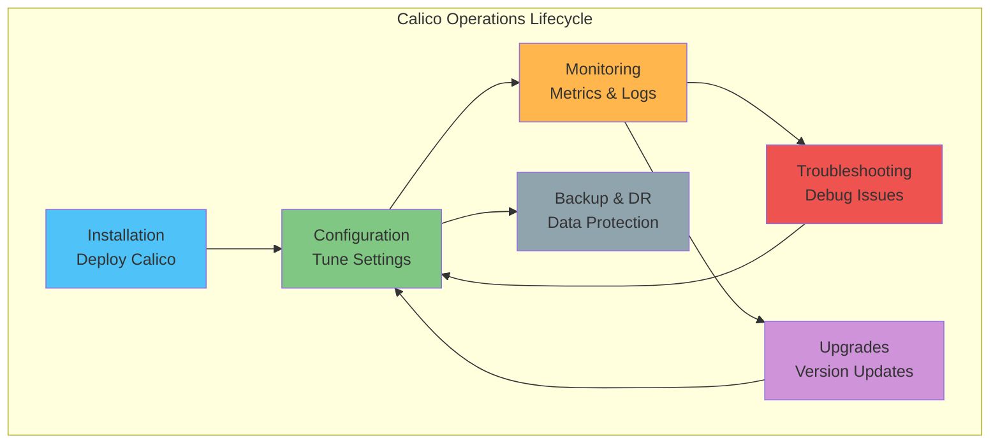

# パート9: Calico 運用ガイド

> **サポート対象バージョン**: Calico v3.29+ / Kubernetes 1.28+
> **最終更新**: February 22, 2026

## 概要

この章では、Calico デプロイメント向けの包括的な運用ガイダンスを提供します。インストール、監視、トラブルシューティング、アップグレード、および本番環境のベストプラクティスを扱います。



## インストールガイド

### 方法1: Operator インストール（推奨）

Tigera Operator は、本番環境で推奨されるインストール方法です。

```bash
# Download and install the Tigera Operator
kubectl create -f https://raw.githubusercontent.com/projectcalico/calico/v3.29.0/manifests/tigera-operator.yaml

# Wait for operator to be ready
kubectl wait --for=condition=Available deployment/tigera-operator \
  -n tigera-operator --timeout=120s
```

```yaml
# Installation resource - production configuration
apiVersion: operator.tigera.io/v1
kind: Installation
metadata:
  name: default
spec:
  # Variant: Calico, TigeraSecureEnterprise
  variant: Calico

  # Registry (for air-gapped environments)
  # registry: my-registry.example.com
  # imagePath: calico
  # imagePrefix: ""

  calicoNetwork:
    # BGP configuration
    bgp: Enabled

    # IP pools
    ipPools:
      - cidr: 10.244.0.0/16
        blockSize: 26
        encapsulation: VXLANCrossSubnet
        natOutgoing: Enabled
        nodeSelector: all()

    # MTU auto-detection
    mtu: 0  # 0 = auto-detect

    # Node address auto-detection
    nodeAddressAutodetectionV4:
      kubernetes: NodeInternalIP

    # Linux dataplane
    linuxDataplane: Iptables  # or BPF

  # Component resources
  componentResources:
    - componentName: Node
      resourceRequirements:
        requests:
          cpu: 200m
          memory: 256Mi
        limits:
          cpu: 1000m
          memory: 512Mi

    - componentName: Typha
      resourceRequirements:
        requests:
          cpu: 100m
          memory: 128Mi
        limits:
          cpu: 500m
          memory: 256Mi

    - componentName: KubeControllers
      resourceRequirements:
        requests:
          cpu: 50m
          memory: 64Mi
        limits:
          cpu: 200m
          memory: 128Mi

  # Node update strategy
  nodeUpdateStrategy:
    rollingUpdate:
      maxUnavailable: 1
    type: RollingUpdate

  # Typha deployment
  typhaDeployment:
    spec:
      minReadySeconds: 10
      template:
        spec:
          tolerations:
            - key: CriticalAddonsOnly
              operator: Exists
          affinity:
            podAntiAffinity:
              requiredDuringSchedulingIgnoredDuringExecution:
                - labelSelector:
                    matchLabels:
                      k8s-app: calico-typha
                  topologyKey: kubernetes.io/hostname
---
# API Server (optional, for calicoctl access)
apiVersion: operator.tigera.io/v1
kind: APIServer
metadata:
  name: default
spec: {}
```

```bash
# Apply installation
kubectl apply -f installation.yaml

# Verify installation status
kubectl get tigerastatus
watch kubectl get pods -n calico-system
```

### 方法2: Manifest インストール

よりシンプルなデプロイメント、または特定のカスタマイズが必要な場合:

```bash
# Download Calico manifest
curl -O https://raw.githubusercontent.com/projectcalico/calico/v3.29.0/manifests/calico.yaml

# Customize the manifest
# Edit CALICO_IPV4POOL_CIDR to match your pod CIDR
sed -i 's/192.168.0.0\/16/10.244.0.0\/16/g' calico.yaml

# Apply manifest
kubectl apply -f calico.yaml

# Verify installation
kubectl get pods -n kube-system -l k8s-app=calico-node
kubectl get pods -n kube-system -l k8s-app=calico-kube-controllers
```

### 方法3: Helm インストール

```bash
# Add Helm repository
helm repo add projectcalico https://docs.tigera.io/calico/charts
helm repo update

# Install with custom values
helm install calico projectcalico/tigera-operator \
  --namespace tigera-operator \
  --create-namespace \
  --version v3.29.0 \
  -f values.yaml
```

```yaml
# values.yaml - Production configuration
installation:
  calicoNetwork:
    bgp: Enabled
    ipPools:
      - cidr: 10.244.0.0/16
        blockSize: 26
        encapsulation: VXLANCrossSubnet
        natOutgoing: Enabled
    nodeAddressAutodetectionV4:
      kubernetes: NodeInternalIP
    linuxDataplane: Iptables

  componentResources:
    - componentName: Node
      resourceRequirements:
        requests:
          cpu: 200m
          memory: 256Mi
        limits:
          cpu: 1000m
          memory: 512Mi

typhaDeployment:
  replicas: 3
  resources:
    requests:
      cpu: 100m
      memory: 128Mi
    limits:
      cpu: 500m
      memory: 256Mi

# Prometheus metrics
monitoring:
  enabled: true

# Custom annotations
podAnnotations:
  prometheus.io/scrape: "true"
  prometheus.io/port: "9091"
```

## calicoctl コマンドリファレンス

### インストール

```bash
# Linux (x86_64)
curl -L https://github.com/projectcalico/calico/releases/download/v3.29.0/calicoctl-linux-amd64 -o calicoctl
chmod +x calicoctl
sudo mv calicoctl /usr/local/bin/

# Linux (ARM64)
curl -L https://github.com/projectcalico/calico/releases/download/v3.29.0/calicoctl-linux-arm64 -o calicoctl

# macOS (Intel)
curl -L https://github.com/projectcalico/calico/releases/download/v3.29.0/calicoctl-darwin-amd64 -o calicoctl

# macOS (Apple Silicon)
curl -L https://github.com/projectcalico/calico/releases/download/v3.29.0/calicoctl-darwin-arm64 -o calicoctl

# Windows
Invoke-WebRequest -Uri "https://github.com/projectcalico/calico/releases/download/v3.29.0/calicoctl-windows-amd64.exe" -OutFile "calicoctl.exe"

# Configuration (Kubernetes datastore)
export DATASTORE_TYPE=kubernetes
export KUBECONFIG=~/.kube/config
```

### Node コマンド

```bash
# View node status (BGP peering, routes)
calicoctl node status

# List all Calico nodes
calicoctl get nodes -o wide

# Get specific node details
calicoctl get node node-1 -o yaml

# Check node health
calicoctl node diags

# Run node diagnostics and save to file
calicoctl node diags --output-dir=/tmp/calico-diags
```

### IPAM コマンド

```bash
# Show IPAM summary
calicoctl ipam show

# Show detailed block allocation
calicoctl ipam show --show-blocks

# Show configuration
calicoctl ipam show --show-configuration

# Check for IPAM issues
calicoctl ipam check

# Release a specific IP
calicoctl ipam release --ip=10.244.1.5

# Release all IPs for a specific handle
calicoctl ipam release --handle=k8s-pod-network.abc123

# Split IPAM blocks (advanced)
calicoctl ipam split --cidr=10.244.0.0/26
```

### Policy コマンド

```bash
# List all network policies
calicoctl get networkpolicy -A

# List policies in specific namespace
calicoctl get networkpolicy -n production

# List global network policies
calicoctl get globalnetworkpolicy

# Get policy details
calicoctl get networkpolicy my-policy -n production -o yaml

# Apply policy from file
calicoctl apply -f policy.yaml

# Delete policy
calicoctl delete networkpolicy my-policy -n production

# List policy tiers
calicoctl get tier

# List network sets
calicoctl get networkset -A
calicoctl get globalnetworkset
```

### リソースコマンド

```bash
# List all Calico resources
calicoctl get all

# Get IP pools
calicoctl get ippool -o wide

# Get BGP configuration
calicoctl get bgpconfig default -o yaml

# Get BGP peers
calicoctl get bgppeer -o wide

# Get workload endpoints
calicoctl get workloadendpoint -A

# Get host endpoints
calicoctl get hostendpoint

# Get Felix configuration
calicoctl get felixconfig default -o yaml

# Create/Update resource
calicoctl apply -f resource.yaml

# Create resource (fail if exists)
calicoctl create -f resource.yaml

# Replace resource
calicoctl replace -f resource.yaml

# Patch resource
calicoctl patch felixconfiguration default -p '{"spec":{"logSeverityScreen":"Warning"}}'

# Delete resource
calicoctl delete -f resource.yaml

# Export all resources (backup)
calicoctl get all -o yaml > calico-backup.yaml
```

## Prometheus メトリクス

### Felix メトリクス

Felix はデフォルトでポート 9091 にメトリクスを公開します。

```yaml
# Enable Prometheus metrics in FelixConfiguration
apiVersion: projectcalico.org/v3
kind: FelixConfiguration
metadata:
  name: default
spec:
  prometheusMetricsEnabled: true
  prometheusMetricsPort: 9091
  prometheusGoMetricsEnabled: true
  prometheusProcessMetricsEnabled: true
```

**主要な Felix メトリクス:**

| メトリクス | 説明 |
|--------|-------------|
| `felix_active_local_endpoints` | このホスト上のアクティブな Endpoint 数 |
| `felix_active_local_policies` | アクティブな Policy 数 |
| `felix_active_local_selectors` | アクティブな Selector 数 |
| `felix_iptables_save_time_seconds` | iptables ルールの保存にかかる時間 |
| `felix_iptables_restore_time_seconds` | iptables ルールの復元にかかる時間 |
| `felix_int_dataplane_apply_time_seconds` | dataplane 更新の適用にかかる時間 |
| `felix_route_table_list_seconds` | ルーティングテーブルの一覧取得にかかる時間 |
| `felix_ipset_calls` | ipset 操作数 |
| `felix_log_errors_total` | ログに記録されたエラーの総数 |

### BIRD メトリクス

BGP が有効な場合、BIRD（BGP デーモン）のメトリクスを利用できます:

| メトリクス | 説明 |
|--------|-------------|
| `bird_protocol_up` | BGP プロトコルが稼働中かどうか |
| `bird_protocol_prefix_import_count` | インポートされたプレフィックス数 |
| `bird_protocol_prefix_export_count` | エクスポートされたプレフィックス数 |

### Typha メトリクス

Typha はポート 9093 にメトリクスを公開します:

| メトリクス | 説明 |
|--------|-------------|
| `typha_connections_active` | アクティブなクライアント接続数 |
| `typha_connections_streaming` | ストリーミング接続数 |
| `typha_cache_size` | キャッシュ内のアイテム数 |
| `typha_snapshots_generated_total` | 生成された Snapshot の総数 |
| `typha_updates_received_total` | datastore から受信した更新数 |

### ServiceMonitor 設定

```yaml
# ServiceMonitor for Prometheus Operator
apiVersion: monitoring.coreos.com/v1
kind: ServiceMonitor
metadata:
  name: calico-felix
  namespace: monitoring
  labels:
    app: calico-felix
spec:
  selector:
    matchLabels:
      k8s-app: calico-node
  namespaceSelector:
    matchNames:
      - calico-system
  endpoints:
    - port: felix-metrics
      interval: 30s
      path: /metrics
---
apiVersion: monitoring.coreos.com/v1
kind: ServiceMonitor
metadata:
  name: calico-typha
  namespace: monitoring
  labels:
    app: calico-typha
spec:
  selector:
    matchLabels:
      k8s-app: calico-typha
  namespaceSelector:
    matchNames:
      - calico-system
  endpoints:
    - port: typha-metrics
      interval: 30s
      path: /metrics
```

```yaml
# Service for metrics (if not automatically created)
apiVersion: v1
kind: Service
metadata:
  name: calico-node-metrics
  namespace: calico-system
  labels:
    k8s-app: calico-node
spec:
  selector:
    k8s-app: calico-node
  ports:
    - name: felix-metrics
      port: 9091
      targetPort: 9091
---
apiVersion: v1
kind: Service
metadata:
  name: calico-typha-metrics
  namespace: calico-system
  labels:
    k8s-app: calico-typha
spec:
  selector:
    k8s-app: calico-typha
  ports:
    - name: typha-metrics
      port: 9093
      targetPort: 9093
```

## Grafana ダッシュボード

### ダッシュボード JSON テンプレート

```json
{
  "title": "Calico Monitoring",
  "uid": "calico-monitoring",
  "panels": [
    {
      "title": "Active Endpoints per Node",
      "type": "graph",
      "targets": [
        {
          "expr": "felix_active_local_endpoints",
          "legendFormat": "{{instance}}"
        }
      ]
    },
    {
      "title": "Policy Count",
      "type": "stat",
      "targets": [
        {
          "expr": "sum(felix_active_local_policies)"
        }
      ]
    },
    {
      "title": "iptables Apply Time",
      "type": "graph",
      "targets": [
        {
          "expr": "rate(felix_iptables_restore_time_seconds_sum[5m]) / rate(felix_iptables_restore_time_seconds_count[5m])",
          "legendFormat": "{{instance}}"
        }
      ]
    },
    {
      "title": "Typha Connections",
      "type": "graph",
      "targets": [
        {
          "expr": "typha_connections_active",
          "legendFormat": "{{instance}}"
        }
      ]
    },
    {
      "title": "BGP Peers Status",
      "type": "stat",
      "targets": [
        {
          "expr": "sum(bird_protocol_up{protocol_type=\"BGP\"})"
        }
      ]
    },
    {
      "title": "Felix Errors",
      "type": "graph",
      "targets": [
        {
          "expr": "rate(felix_log_errors_total[5m])",
          "legendFormat": "{{instance}}"
        }
      ]
    }
  ]
}
```

## アラートルール

```yaml
# PrometheusRule for Calico alerts
apiVersion: monitoring.coreos.com/v1
kind: PrometheusRule
metadata:
  name: calico-alerts
  namespace: monitoring
  labels:
    prometheus: k8s
    role: alert-rules
spec:
  groups:
    - name: calico.rules
      rules:
        # Felix not ready
        - alert: CalicoFelixNotReady
          expr: felix_active_local_endpoints == 0
          for: 5m
          labels:
            severity: warning
          annotations:
            summary: "Calico Felix has no endpoints on {{ $labels.instance }}"
            description: "Felix on {{ $labels.instance }} reports 0 endpoints for more than 5 minutes"

        # Felix errors
        - alert: CalicoFelixErrors
          expr: rate(felix_log_errors_total[5m]) > 0.1
          for: 10m
          labels:
            severity: warning
          annotations:
            summary: "Calico Felix is logging errors on {{ $labels.instance }}"
            description: "Felix error rate is {{ $value }} errors/sec"

        # iptables slow
        - alert: CalicoIptablesSlow
          expr: |
            rate(felix_iptables_restore_time_seconds_sum[5m])
            / rate(felix_iptables_restore_time_seconds_count[5m]) > 1
          for: 15m
          labels:
            severity: warning
          annotations:
            summary: "Calico iptables restore is slow on {{ $labels.instance }}"
            description: "Average iptables restore time is {{ $value }}s"

        # Typha connection issues
        - alert: CalicoTyphaConnectionsDrop
          expr: |
            (typha_connections_active - typha_connections_active offset 5m)
            / typha_connections_active offset 5m < -0.2
          for: 5m
          labels:
            severity: warning
          annotations:
            summary: "Calico Typha connections dropping on {{ $labels.instance }}"
            description: "Typha connections dropped by more than 20%"

        # BGP peer down
        - alert: CalicoBGPPeerDown
          expr: bird_protocol_up{protocol_type="BGP"} == 0
          for: 5m
          labels:
            severity: critical
          annotations:
            summary: "Calico BGP peer is down on {{ $labels.instance }}"
            description: "BGP peer {{ $labels.protocol_name }} is down"

        # IPAM exhaustion warning
        - alert: CalicoIPAMExhaustion
          expr: |
            sum(felix_ipam_blocks_used) / sum(felix_ipam_blocks_total) > 0.8
          for: 30m
          labels:
            severity: warning
          annotations:
            summary: "Calico IPAM is running low on IP blocks"
            description: "IPAM usage is at {{ $value | humanizePercentage }}"

        # Dataplane programming latency
        - alert: CalicoDataplaneLatency
          expr: |
            histogram_quantile(0.99, rate(felix_int_dataplane_apply_time_seconds_bucket[5m])) > 5
          for: 15m
          labels:
            severity: warning
          annotations:
            summary: "Calico dataplane programming is slow"
            description: "P99 dataplane apply time is {{ $value }}s"

        # Node not reporting
        - alert: CalicoNodeNotReporting
          expr: |
            up{job="calico-node"} == 0
          for: 10m
          labels:
            severity: critical
          annotations:
            summary: "Calico node {{ $labels.instance }} is not reporting"
            description: "Calico node has been down for more than 10 minutes"
```

## ログ分析パターン

### Felix ログ

```bash
# View Felix logs
kubectl logs -n calico-system -l k8s-app=calico-node -c calico-node

# Filter by log level
kubectl logs -n calico-system -l k8s-app=calico-node -c calico-node | grep -E "ERROR|WARN"

# Follow logs in real-time
kubectl logs -n calico-system -l k8s-app=calico-node -c calico-node -f

# Common log patterns to watch for:
# "Failed to connect to Typha" - Typha connectivity issues
# "dataplane: Apply failed" - Dataplane programming errors
# "Route table list failed" - Routing issues
# "ipset save failed" - ipset errors
```

### ログ分析コマンド

```bash
# Count errors by type
kubectl logs -n calico-system -l k8s-app=calico-node -c calico-node --since=1h | \
  grep ERROR | awk '{print $NF}' | sort | uniq -c | sort -rn

# Check for policy sync issues
kubectl logs -n calico-system -l k8s-app=calico-node -c calico-node | \
  grep -i "policy" | grep -E "ERROR|failed"

# Check BGP/BIRD logs
kubectl exec -n calico-system $(kubectl get pods -n calico-system -l k8s-app=calico-node -o name | head -1) \
  -c calico-node -- cat /var/log/calico/bird/current

# Check for connection tracking issues
kubectl logs -n calico-system -l k8s-app=calico-node -c calico-node | \
  grep -i "conntrack"
```

## トラブルシューティング

### Pod IP の問題

```bash
# Symptom: Pod stuck in ContainerCreating, no IP assigned

# 1. Check IPAM status
calicoctl ipam show
calicoctl ipam show --show-blocks

# 2. Check for IP exhaustion
calicoctl ipam check

# 3. Check IP pool configuration
calicoctl get ippool -o yaml

# 4. Check if node has block affinity
calicoctl get blockaffinity -o yaml | grep -A5 "$(hostname)"

# 5. Check calico-node logs
kubectl logs -n calico-system -l k8s-app=calico-node -c calico-node | grep -i ipam

# 6. Release orphaned IPs
calicoctl ipam release --ip=<orphaned-ip>

# 7. Restart calico-node on affected node
kubectl delete pod -n calico-system -l k8s-app=calico-node --field-selector spec.nodeName=<node-name>
```

### 通信障害

```bash
# Symptom: Pods cannot communicate with each other

# 1. Check endpoints
calicoctl get workloadendpoint -A

# 2. Verify routes on source node
kubectl exec -n calico-system $(kubectl get pods -n calico-system -l k8s-app=calico-node -o name | head -1) \
  -- ip route show

# 3. Check if encapsulation is working
kubectl exec -n calico-system $(kubectl get pods -n calico-system -l k8s-app=calico-node -o name | head -1) \
  -- ip link show | grep -E "tunl0|vxlan"

# 4. Test connectivity with network tools
kubectl run test-pod --image=nicolaka/netshoot --rm -it -- \
  ping <destination-pod-ip>

# 5. Check MTU issues
kubectl exec -n calico-system $(kubectl get pods -n calico-system -l k8s-app=calico-node -o name | head -1) \
  -- ip link show | grep mtu

# 6. Verify BGP peering (if using BGP)
calicoctl node status
```

### Policy の問題

```bash
# Symptom: Network policy not working as expected

# 1. List all policies affecting a pod
calicoctl get networkpolicy -n <namespace> -o yaml
calicoctl get globalnetworkpolicy -o yaml

# 2. Check workload endpoint for the pod
POD_NAME=<pod-name>
NAMESPACE=<namespace>
calicoctl get workloadendpoint -n $NAMESPACE -o yaml | grep -A20 $POD_NAME

# 3. Check policy order/tiers
calicoctl get tier -o yaml
calicoctl get networkpolicy -n $NAMESPACE -o yaml | grep -E "tier:|order:"

# 4. Enable Felix debug logging temporarily
calicoctl patch felixconfiguration default -p '{"spec":{"logSeverityScreen":"Debug"}}'

# 5. Check Felix logs for policy decisions
kubectl logs -n calico-system -l k8s-app=calico-node -c calico-node | \
  grep -i "policy" | tail -100

# 6. Verify labels on pods
kubectl get pod $POD_NAME -n $NAMESPACE --show-labels

# 7. Reset to normal logging
calicoctl patch felixconfiguration default -p '{"spec":{"logSeverityScreen":"Info"}}'
```

### BGP 障害

```bash
# Symptom: BGP peering not establishing

# 1. Check node status
calicoctl node status

# 2. Check BGP configuration
calicoctl get bgpconfig default -o yaml
calicoctl get bgppeer -o yaml

# 3. Check BIRD logs
kubectl exec -n calico-system $(kubectl get pods -n calico-system -l k8s-app=calico-node -o name | head -1) \
  -c calico-node -- birdcl show protocols

kubectl exec -n calico-system $(kubectl get pods -n calico-system -l k8s-app=calico-node -o name | head -1) \
  -c calico-node -- birdcl show route

# 4. Check for network connectivity to BGP peer
kubectl exec -n calico-system $(kubectl get pods -n calico-system -l k8s-app=calico-node -o name | head -1) \
  -- nc -zv <peer-ip> 179

# 5. Verify ASN configuration
calicoctl get node -o yaml | grep -A5 bgp

# 6. Check firewall rules (port 179)
kubectl exec -n calico-system $(kubectl get pods -n calico-system -l k8s-app=calico-node -o name | head -1) \
  -- iptables -L -n | grep 179
```

## ヘルスチェックの自動化

```yaml
# Health check script as ConfigMap
apiVersion: v1
kind: ConfigMap
metadata:
  name: calico-health-check
  namespace: calico-system
data:
  health-check.sh: |
    #!/bin/bash
    set -e

    echo "=== Calico Health Check ==="
    echo "Time: $(date)"
    echo

    echo "--- Node Status ---"
    calicoctl node status
    echo

    echo "--- IPAM Status ---"
    calicoctl ipam show
    echo

    echo "--- Component Pods ---"
    kubectl get pods -n calico-system -o wide
    echo

    echo "--- Recent Errors ---"
    kubectl logs -n calico-system -l k8s-app=calico-node -c calico-node --since=1h 2>/dev/null | \
      grep -E "ERROR|WARN" | tail -20 || echo "No recent errors"
    echo

    echo "--- BGP Peers ---"
    calicoctl get bgppeer -o wide 2>/dev/null || echo "No BGP peers configured"
    echo

    echo "=== Health Check Complete ==="
---
# CronJob to run health checks
apiVersion: batch/v1
kind: CronJob
metadata:
  name: calico-health-check
  namespace: calico-system
spec:
  schedule: "*/15 * * * *"  # Every 15 minutes
  jobTemplate:
    spec:
      template:
        spec:
          serviceAccountName: calico-node
          containers:
            - name: health-check
              image: calico/ctl:v3.29.0
              command: ["/bin/bash", "/scripts/health-check.sh"]
              volumeMounts:
                - name: scripts
                  mountPath: /scripts
          volumes:
            - name: scripts
              configMap:
                name: calico-health-check
          restartPolicy: OnFailure
```

## バージョンアップグレード手順

### アップグレード前チェックリスト

```bash
# 1. Check current version
calicoctl version
kubectl get deployment -n calico-system calico-typha -o jsonpath='{.spec.template.spec.containers[0].image}'

# 2. Review release notes
# https://docs.tigera.io/calico/latest/release-notes/

# 3. Check cluster health
calicoctl node status
kubectl get pods -n calico-system

# 4. Backup current configuration
calicoctl get all -o yaml > calico-backup-$(date +%Y%m%d).yaml
kubectl get installation default -o yaml > installation-backup.yaml

# 5. Check Kubernetes version compatibility
kubectl version --short
```

### アップグレード手順（Operator）

```bash
# 1. Update the operator
kubectl apply -f https://raw.githubusercontent.com/projectcalico/calico/v3.29.0/manifests/tigera-operator.yaml

# 2. Wait for operator to update
kubectl rollout status deployment/tigera-operator -n tigera-operator

# 3. The operator will automatically upgrade Calico components
# Monitor the upgrade
watch kubectl get pods -n calico-system

# 4. Verify upgrade
calicoctl version
kubectl get tigerastatus

# 5. Test connectivity
kubectl run test-pod --image=busybox --rm -it -- wget -qO- http://<test-service>
```

### アップグレード手順（Helm）

```bash
# 1. Update Helm repo
helm repo update

# 2. Check available versions
helm search repo projectcalico/tigera-operator --versions

# 3. Upgrade
helm upgrade calico projectcalico/tigera-operator \
  --namespace tigera-operator \
  --version v3.29.0 \
  -f values.yaml

# 4. Monitor upgrade
kubectl rollout status deployment/calico-typha -n calico-system
kubectl rollout status daemonset/calico-node -n calico-system

# 5. Verify
calicoctl version
```

### ロールバック手順

```bash
# Helm rollback
helm rollback calico 1 -n tigera-operator

# Or restore from backup
kubectl apply -f calico-backup-$(date +%Y%m%d).yaml
```

## バックアップと災害復旧

### バックアップ戦略

```bash
#!/bin/bash
# calico-backup.sh

BACKUP_DIR="/backup/calico/$(date +%Y%m%d-%H%M%S)"
mkdir -p $BACKUP_DIR

echo "Backing up Calico configuration..."

# Export all Calico resources
calicoctl get nodes -o yaml > $BACKUP_DIR/nodes.yaml
calicoctl get ippool -o yaml > $BACKUP_DIR/ippools.yaml
calicoctl get bgpconfig -o yaml > $BACKUP_DIR/bgpconfig.yaml
calicoctl get bgppeer -o yaml > $BACKUP_DIR/bgppeers.yaml
calicoctl get networkpolicy -A -o yaml > $BACKUP_DIR/networkpolicies.yaml
calicoctl get globalnetworkpolicy -o yaml > $BACKUP_DIR/globalnetworkpolicies.yaml
calicoctl get networkset -A -o yaml > $BACKUP_DIR/networksets.yaml
calicoctl get globalnetworkset -o yaml > $BACKUP_DIR/globalnetworksets.yaml
calicoctl get felixconfig -o yaml > $BACKUP_DIR/felixconfig.yaml
calicoctl get tier -o yaml > $BACKUP_DIR/tiers.yaml

# Export Kubernetes resources
kubectl get installation default -o yaml > $BACKUP_DIR/installation.yaml

echo "Backup complete: $BACKUP_DIR"
ls -la $BACKUP_DIR
```

### 復元手順

```bash
#!/bin/bash
# calico-restore.sh

BACKUP_DIR=$1

if [ -z "$BACKUP_DIR" ]; then
    echo "Usage: $0 <backup-directory>"
    exit 1
fi

echo "Restoring Calico configuration from $BACKUP_DIR..."

# Restore in order of dependency
calicoctl apply -f $BACKUP_DIR/ippools.yaml
calicoctl apply -f $BACKUP_DIR/bgpconfig.yaml
calicoctl apply -f $BACKUP_DIR/bgppeers.yaml
calicoctl apply -f $BACKUP_DIR/tiers.yaml
calicoctl apply -f $BACKUP_DIR/globalnetworksets.yaml
calicoctl apply -f $BACKUP_DIR/networksets.yaml
calicoctl apply -f $BACKUP_DIR/globalnetworkpolicies.yaml
calicoctl apply -f $BACKUP_DIR/networkpolicies.yaml
calicoctl apply -f $BACKUP_DIR/felixconfig.yaml

echo "Restore complete"
```

## ベストプラクティス

### セキュリティ強化

```yaml
# 1. Default deny policy
apiVersion: projectcalico.org/v3
kind: GlobalNetworkPolicy
metadata:
  name: default-deny
spec:
  selector: all()
  types:
    - Ingress
    - Egress
---
# 2. Allow only essential traffic
apiVersion: projectcalico.org/v3
kind: GlobalNetworkPolicy
metadata:
  name: allow-essential
spec:
  selector: all()
  order: 100
  egress:
    # DNS
    - action: Allow
      protocol: UDP
      destination:
        selector: k8s-app == 'kube-dns'
        ports: [53]
    - action: Allow
      protocol: TCP
      destination:
        selector: k8s-app == 'kube-dns'
        ports: [53]
    # Kubernetes API
    - action: Allow
      protocol: TCP
      destination:
        nets: ["10.96.0.1/32"]
        ports: [443]
---
# 3. Protect system namespaces
apiVersion: projectcalico.org/v3
kind: GlobalNetworkPolicy
metadata:
  name: protect-system-namespaces
spec:
  selector: "projectcalico.org/namespace in {'kube-system', 'calico-system'}"
  order: 50
  ingress:
    - action: Allow
      source:
        selector: "projectcalico.org/namespace in {'kube-system', 'calico-system', 'monitoring'}"
    - action: Deny
  types:
    - Ingress
```

### 可観測性

```yaml
# Enable comprehensive observability
apiVersion: projectcalico.org/v3
kind: FelixConfiguration
metadata:
  name: default
spec:
  # Prometheus metrics
  prometheusMetricsEnabled: true
  prometheusMetricsPort: 9091
  prometheusGoMetricsEnabled: true
  prometheusProcessMetricsEnabled: true

  # Flow logs
  flowLogsFlushInterval: "15s"
  flowLogsFileEnabled: true
  flowLogsFileDirectory: "/var/log/calico/flowlogs"
  flowLogsFileMaxFiles: 5
  flowLogsFileMaxFileSizeMb: 100
  flowLogsFileAggregationKindForAllowed: 1
  flowLogsFileAggregationKindForDenied: 0

  # DNS logs
  dnsLogsFlushInterval: "15s"
  dnsLogsFileEnabled: true

  # Logging
  logSeverityScreen: Info
  logSeverityFile: Info
```

### パフォーマンス

```yaml
# Performance-optimized configuration
apiVersion: projectcalico.org/v3
kind: FelixConfiguration
metadata:
  name: default
spec:
  # Use eBPF if available
  bpfEnabled: true
  bpfDataIfacePattern: "^(en.*|eth.*|bond.*)"

  # Optimize refresh intervals
  routeRefreshInterval: "90s"
  iptablesRefreshInterval: "90s"
  ipSetsRefreshInterval: "90s"

  # Batch updates
  iptablesPostWriteCheckIntervalSecs: 5

  # Connection tracking (for eBPF)
  bpfMapSizeConntrack: 512000

  # Reduce logging overhead in production
  logSeverityScreen: Warning
  logSeverityFile: Warning
```

### リソース管理

```yaml
# Resource allocation guidelines
apiVersion: operator.tigera.io/v1
kind: Installation
metadata:
  name: default
spec:
  componentResources:
    # calico-node (per node)
    - componentName: Node
      resourceRequirements:
        requests:
          cpu: 200m
          memory: 256Mi
        limits:
          cpu: 1000m
          memory: 512Mi

    # Typha (cluster-wide)
    - componentName: Typha
      resourceRequirements:
        requests:
          cpu: 200m
          memory: 256Mi
        limits:
          cpu: 1000m
          memory: 512Mi

    # kube-controllers
    - componentName: KubeControllers
      resourceRequirements:
        requests:
          cpu: 50m
          memory: 64Mi
        limits:
          cpu: 200m
          memory: 128Mi
```

---

## 参考資料

- [Calico インストールガイド](https://docs.tigera.io/calico/latest/getting-started/)
- [calicoctl リファレンス](https://docs.tigera.io/calico/latest/reference/calicoctl/)
- [Calico メトリクス](https://docs.tigera.io/calico/latest/operations/monitor/prometheus)
- [トラブルシューティングガイド](https://docs.tigera.io/calico/latest/operations/troubleshoot/)
- [アップグレードガイド](https://docs.tigera.io/calico/latest/operations/upgrading/)

## クイズ

この章で学んだ内容を確認するには、[運用クイズ](../../quizzes/networking/calico/09-operations-quiz.md)に挑戦してください。
