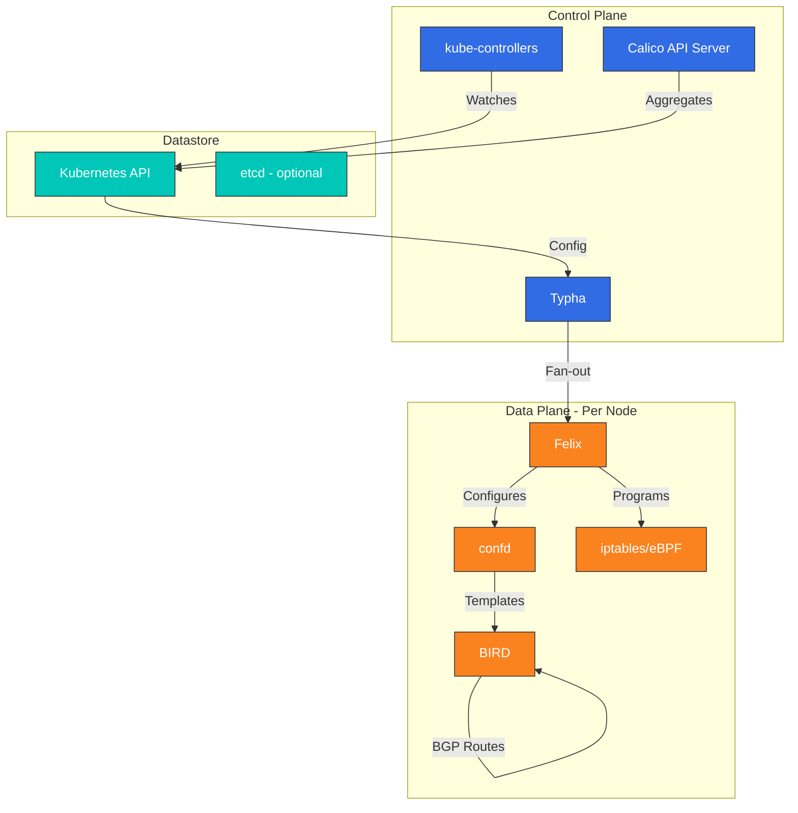
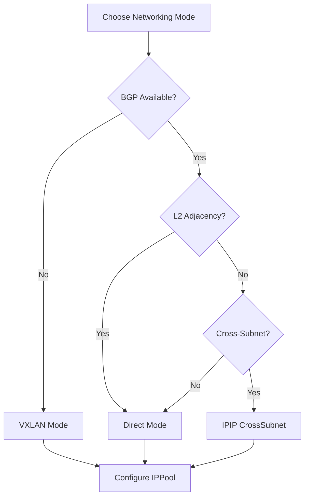

# Calico 詳解: エンタープライズグレードの Kubernetes ネットワーキング

> **対応バージョン**: Calico v3.29+ / Kubernetes 1.28+
> **最終更新**: July 27, 2026

## 概要

このセクションでは、Calico の中核となる概念と技術を包括的に理解します。Calico のアーキテクチャ、ネットワーキングモード、ネットワークポリシー、セキュリティ機能、およびクラウドプロバイダーとの統合を詳しく解説します。

## Calico とは？

Calico は、コンテナ、仮想マシン、およびネイティブなホストベースのワークロード向けのオープンソースのネットワーキングおよびネットワークセキュリティソリューションです。Tigera によって当初開発された Calico は、最も広く導入されている Kubernetes CNI プラグインの 1 つとなっており、その安定性、パフォーマンス、堅牢なネットワークポリシー機能により、世界中のエンタープライズから信頼されています。

### 2026年7月の更新: Kubernetes 上の VM 向け Calico

2026年7月21日、Tigera は **Calico for VMs on Kubernetes** をリリースしました。これは、単一の Kubernetes ネイティブなコントロールプレーンで、仮想マシンとコンテナの両方にネットワーキングおよびネットワークセキュリティを提供する eBPF ベースのプラットフォームです。VMware/NSX の移行を対象としており、Kubernetes に移行した VM は IP アドレスを維持し、L2 ブリッジ拡張を介して既存の VLAN にとどまることができ、隣接するコンテナと同じ Calico ネットワークポリシー、マイクロセグメンテーション（ポリシー階層およびステージドポリシーを含む）、ルーティング、ロードバランシング、フロー可視性を継承します。詳細は[プレスリリース](https://www.storagenewsletter.com/2026/07/21/tigera-launches-calico-unified-platform-3-23-the-definitive-vmware-migration-solution-with-one-network-and-one-security-model-for-every-vm-and-container-on-kubernetes/)を参照してください。

### 主な利点

1. **実績のある成熟度**: 2016年以降、数千の組織で本番環境に利用
2. **柔軟なデータプレーン**: iptables、nftables、または eBPF データプレーンから選択可能
3. **ネイティブ BGP サポート**: オンプレミスおよびハイブリッドデプロイメントのための一級 BGP 統合
4. **包括的なネットワークポリシー**: Kubernetes NetworkPolicy に加え、拡張された Calico ポリシーを提供
5. **Windows サポート**: Windows コンテナネットワーキングを完全にサポート
6. **エンタープライズ機能**: Tigera Calico Enterprise は可観測性、コンプライアンス、脅威防御を追加
7. **クラウドネイティブ統合**: AWS、GCP、Azure、およびオンプレミスインフラストラクチャとシームレスに統合

### Calico を選ぶ理由

- **大規模環境での実証済み**: 数十億件のトランザクションを処理する企業の本番ワークロードを支えます
- **運用のシンプルさ**: 導入と設定が容易です
- **強力なコミュニティ**: 豊富なドキュメントを備えた活発なオープンソースコミュニティ
- **ベンダーの柔軟性**: あらゆる Kubernetes ディストリビューションで一貫して動作
- **コンプライアンス対応**: 監査ログおよびポリシー適用の組み込み機能

## バージョンのハイライト: Calico v3.29

Calico v3.29 は、ネットワーキング、セキュリティ、可観測性全体にわたり大幅な改善を提供します。

### ネットワーキングの強化
- **eBPF データプレーン GA**: 完全な機能同等性を備えた本番対応 eBPF データプレーン
- **BGP パフォーマンスの改善**: ルート収束を最適化し、メモリフットプリントを削減
- **VXLAN の強化**: 自動 MTU 検出による、より優れたクロスサブネットルーティング
- **IPv6 デュアルスタック**: デュアルスタックネットワーキング環境を完全にサポート

### セキュリティの改善
- **DNS ポリシーの強化**: よりきめ細かな FQDN ベースのネットワークポリシー
- **ポリシーの推奨**: 観測されたトラフィックに基づく AI 支援ポリシー生成
- **暗号化オプション**: ノード間暗号化のための簡素化された WireGuard 設定

### 運用機能
- **Calico API Server**: Calico リソース向けのネイティブ Kubernetes API 集約
- **診断の改善**: 強化されたトラブルシューティングツールとヘルスチェック
- **リソース最適化**: CPU とメモリ消費量を削減

## CNI の比較

| 機能 | Calico | Cilium |
|---------|--------|--------|
| **中核技術** | iptables/eBPF | eBPF |
| **成熟度** | 非常に高い (2016+) | 高い (2017+) |
| **ネットワークポリシー** | L3-L4 (L7 Enterprise) | L3-L7 |
| **サービスメッシュ** | 別途 (Enterprise) | 組み込み |
| **BGP サポート** | 強力 (ネイティブ) | サポート済み |
| **可観測性** | 基本 (Enterprise: 高度) | Hubble (強力) |
| **Windows サポート** | 完全 | ベータ |
| **eBPF データプレーン** | 任意 | 必須 |
| **学習曲線** | 中程度 | より急 |
| **リソース使用量** | 低い | 高い |
| **kube-proxy 置換** | はい (eBPF モード) | はい |
| **マルチクラスター** | Federation | Cluster Mesh |

## アーキテクチャの概要

Calico のアーキテクチャは、ネットワーキングとネットワークセキュリティを提供するために連携する、いくつかの主要コンポーネントで構成されます。



### 主要コンポーネント

| コンポーネント | 役割 | 実行場所 |
|-----------|------|---------|
| **Felix** | 各ホストでルートと ACL をプログラム | すべてのノード |
| **BIRD** | ルート配布のための BGP デーモン | すべてのノード |
| **confd** | データストアを監視し、BIRD 設定を生成 | すべてのノード |
| **Typha** | API server の負荷を軽減するキャッシュプロキシ | 専用 Pod |
| **kube-controllers** | Kubernetes リソースを Calico と同期 | コントロールプレーン |
| **Calico API Server** | Kubernetes API 集約レイヤー | コントロールプレーン |

## ネットワーキングモード

Calico は、さまざまなインフラストラクチャ要件に合わせて複数のネットワーキングモードをサポートしています。

### 1. IPIP モード (デフォルト)
- クロスサブネットトラフィックのための IP-in-IP カプセル化
- MTU: 1480 bytes
- 最適な用途: クラウド環境、シンプルなセットアップ

### 2. VXLAN モード
- VXLAN カプセル化 (UDP ポート 4789)
- MTU: 1450 bytes
- 最適な用途: 標準オーバーレイプロトコルを必要とする環境

### 3. ダイレクト/非カプセル化モード
- カプセル化なし、ネイティブルーティング
- MTU: 1500 bytes (フル)
- 最適な用途: BGP を使用するオンプレミス、パフォーマンスが重要なワークロード

### モード選択ガイド



## Amazon EKS との統合

Calico は Amazon EKS とシームレスに統合し、強化されたネットワークポリシー機能を提供します。

### EKS へのクイックインストール

```bash
# Install Calico operator
kubectl create -f https://raw.githubusercontent.com/projectcalico/calico/v3.29.0/manifests/tigera-operator.yaml

# Configure Calico for EKS (VXLAN mode)
cat <<EOF | kubectl apply -f -
apiVersion: operator.tigera.io/v1
kind: Installation
metadata:
  name: default
spec:
  kubernetesProvider: EKS
  cni:
    type: Calico
  calicoNetwork:
    bgp: Disabled
    ipPools:
    - blockSize: 26
      cidr: 10.244.0.0/16
      encapsulation: VXLAN
      natOutgoing: Enabled
      nodeSelector: all()
EOF

# Verify installation
kubectl get pods -n calico-system
```

### VPC CNI + Calico Policy を使用する EKS

ネットワーキングに AWS VPC CNI を使用し、高度なネットワークポリシーが必要な EKS 環境の場合:

```bash
# Install Calico for network policy only
kubectl apply -f https://raw.githubusercontent.com/aws/amazon-vpc-cni-k8s/master/config/master/calico-operator.yaml
kubectl apply -f https://raw.githubusercontent.com/aws/amazon-vpc-cni-k8s/master/config/master/calico-crs.yaml
```

## インストール方法

### 方法 1: Tigera Operator (推奨)

```bash
# Install the operator
kubectl create -f https://raw.githubusercontent.com/projectcalico/calico/v3.29.0/manifests/tigera-operator.yaml

# Install Calico with custom configuration
cat <<EOF | kubectl apply -f -
apiVersion: operator.tigera.io/v1
kind: Installation
metadata:
  name: default
spec:
  calicoNetwork:
    ipPools:
    - blockSize: 26
      cidr: 192.168.0.0/16
      encapsulation: IPIP
      natOutgoing: Enabled
      nodeSelector: all()
EOF
```

### 方法 2: Helm インストール

```bash
# Add Calico Helm repository
helm repo add projectcalico https://docs.tigera.io/calico/charts
helm repo update

# Install Calico
helm install calico projectcalico/tigera-operator \
  --version v3.29.0 \
  --namespace tigera-operator \
  --create-namespace \
  --set installation.kubernetesProvider=EKS
```

### 方法 3: Manifest ベースのインストール

```bash
# For clusters with 50 nodes or less
kubectl apply -f https://raw.githubusercontent.com/projectcalico/calico/v3.29.0/manifests/calico.yaml

# For larger clusters (enables Typha)
kubectl apply -f https://raw.githubusercontent.com/projectcalico/calico/v3.29.0/manifests/calico-typha.yaml
```

## ネットワークポリシーの例

### 基本的な Kubernetes NetworkPolicy

```yaml
apiVersion: networking.k8s.io/v1
kind: NetworkPolicy
metadata:
  name: allow-frontend-to-backend
  namespace: production
spec:
  podSelector:
    matchLabels:
      app: backend
  policyTypes:
  - Ingress
  ingress:
  - from:
    - podSelector:
        matchLabels:
          app: frontend
    ports:
    - protocol: TCP
      port: 8080
```

### Calico GlobalNetworkPolicy

```yaml
apiVersion: projectcalico.org/v3
kind: GlobalNetworkPolicy
metadata:
  name: deny-all-egress-except-dns
spec:
  selector: all()
  types:
  - Egress
  egress:
  - action: Allow
    protocol: UDP
    destination:
      ports:
      - 53
  - action: Allow
    protocol: TCP
    destination:
      ports:
      - 53
  - action: Deny
```

### FQDN を使用する Calico NetworkPolicy

```yaml
apiVersion: projectcalico.org/v3
kind: NetworkPolicy
metadata:
  name: allow-external-api
  namespace: production
spec:
  selector: app == 'web'
  types:
  - Egress
  egress:
  - action: Allow
    protocol: TCP
    destination:
      domains:
      - "api.example.com"
      - "*.amazonaws.com"
      ports:
      - 443
```

## モニタリングと可観測性

### Prometheus メトリクス

Calico は Prometheus を介してメトリクスを公開します。監視すべき主なメトリクス:

```yaml
# Felix metrics endpoint configuration
apiVersion: projectcalico.org/v3
kind: FelixConfiguration
metadata:
  name: default
spec:
  prometheusMetricsEnabled: true
  prometheusMetricsPort: 9091
```

### 主なメトリクス

| メトリクス | 説明 |
|--------|-------------|
| `felix_active_local_endpoints` | ノード上のアクティブなエンドポイント数 |
| `felix_iptables_rules` | プログラムされた iptables ルール数 |
| `felix_ipsets_calico` | 維持される IP セット数 |
| `felix_int_dataplane_failures` | データプレーンのプログラミング失敗 |
| `felix_cluster_num_hosts` | クラスター内のホスト総数 |

### ヘルスチェックエンドポイント

```bash
# Check Felix health
curl -s http://localhost:9099/liveness
curl -s http://localhost:9099/readiness

# Check Typha health
curl -s http://localhost:9098/liveness
```

## トラブルシューティング クイックリファレンス

### 一般的なコマンド

```bash
# Check Calico system status
kubectl get pods -n calico-system

# View Calico node status
kubectl get nodes -o custom-columns=NAME:.metadata.name,CALICO:.status.conditions[*].type

# Check IP pools
kubectl get ippools -o wide

# View network policies
kubectl get networkpolicies -A
kubectl get globalnetworkpolicies

# Felix logs
kubectl logs -n calico-system -l k8s-app=calico-node -c calico-node

# BIRD status (BGP)
kubectl exec -n calico-system calico-node-xxxxx -c calico-node -- birdcl show protocols
```

### よくある問題と解決策

| 問題 | 診断 | 解決策 |
|-------|-----------|----------|
| Pod が ContainerCreating で停止する | Felix ログで IPAM エラーを確認 | IPPool 設定を確認 |
| ノード間接続に失敗する | カプセル化モードを確認 | IPIP/VXLAN が有効であることを確認 |
| ネットワークポリシーが適用されない | ポリシーの順序とセレクターを確認 | `calicoctl` でポリシーを検証 |
| Felix の CPU 使用率が高い | iptables ルールが多すぎる | eBPF データプレーンを検討 |

## 詳解の目次

**[パート 1: Calico の紹介](01-introduction.md)**
- Calico とは何か、およびプロジェクトの歴史
- ラボ環境のセットアップ
- 中核機能の概要
- ユースケースとデプロイメントシナリオ
- コミュニティとガバナンス

**[パート 2: Calico アーキテクチャ詳解](02-architecture.md)**
- コンポーネントアーキテクチャの概要
- Felix: Calico Agent
- BIRD: BGP ルーティングデーモン
- confd: 設定管理
- Typha: スケーリングコンポーネント
- kube-controllers: Kubernetes 統合
- データストアのオプション
- パケットフロー分析

**[パート 3: ネットワーキングモード](03-networking-modes.md)**
- IPIP カプセル化モード
- VXLAN カプセル化モード
- ダイレクト/非カプセル化モード
- モードの比較と選択
- パフォーマンスベンチマーク
- クラウドプロバイダーの互換性
- MTU 最適化

## 選択ガイド: Calico vs Cilium

### Calico を選ぶ場合:
- 本番環境で実績のある安定性と成熟度が必要
- Windows コンテナのサポートが必要
- 既存のネットワークインフラストラクチャとの BGP 統合が重要
- 高度な機能より運用のシンプルさを重視する
- リソース効率が優先事項
- iptables ベースのネットワーキングにすでに精通している

### Cilium を選ぶ場合:
- 高度な L7 ネットワークポリシーが必要
- 組み込みのサービスメッシュ機能が求められる
- Hubble による深い可観測性が重要
- 最先端の eBPF 機能を活用したい
- Cluster Mesh を使用したマルチクラスター接続が必要

### ハイブリッドアプローチ
一部の組織では両方を使用します:
- 安定性を必要とする本番ワークロードには Calico
- 新機能を検証する開発/ステージング環境には Cilium

## 参考資料

- [Calico 公式ドキュメント](https://docs.tigera.io/calico/latest/about/)
- [Calico GitHub リポジトリ](https://github.com/projectcalico/calico)
- [Tigera Calico Enterprise](https://www.tigera.io/tigera-products/calico-enterprise/)
- [Calico ネットワークポリシーガイド](https://docs.tigera.io/calico/latest/network-policy/)
- [Amazon EKS と Calico の統合](https://docs.aws.amazon.com/eks/latest/userguide/calico.html)
- [calicoctl リファレンス](https://docs.tigera.io/calico/latest/reference/calicoctl/)
- [Calico eBPF データプレーン](https://docs.tigera.io/calico/latest/operations/ebpf/)

## クイズ

このセクションで学んだ内容を確認するには、[Calico 詳解クイズ](../../quizzes/networking/calico/01-introduction-quiz.md)に挑戦してください。
