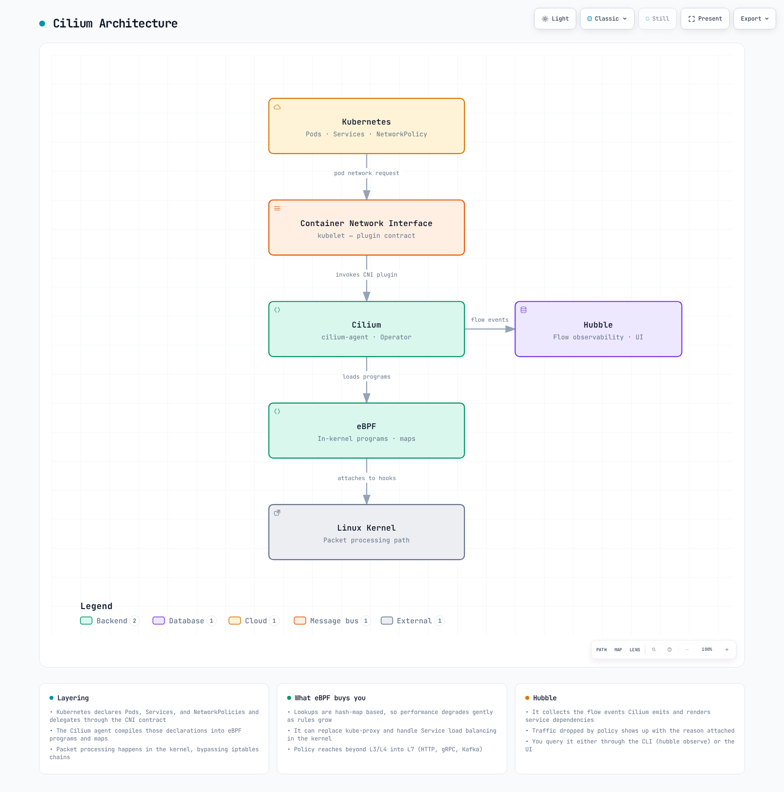

# パート 1: はじめに

> **対応バージョン**: Cilium 1.18 **最終更新**: February 23, 2026

## Lab 環境のセットアップ

このドキュメントの例に沿って進めるには、以下のツールと環境が必要です。

### 必要なツール

* kubectl v1.33 以降
* Helm v3.12 以降
* 動作する Kubernetes クラスタ（EKS、minikube、kind など）
* Linux kernel 4.19 以降（eBPF 機能のサポート用）

### Cilium のインストール

```bash
# Install Cilium CLI
curl -L --remote-name-all https://github.com/cilium/cilium-cli/releases/latest/download/cilium-linux-amd64.tar.gz
sudo tar xzvfC cilium-linux-amd64.tar.gz /usr/local/bin
rm cilium-linux-amd64.tar.gz

# Install Cilium
cilium install --version 1.18.0

# Check installation status
cilium status
```

## Cilium とは？

Cilium は、Linux kernel の強力な eBPF 技術を活用して、コンテナ化されたアプリケーションにネットワーキング、セキュリティ、オブザーバビリティを提供するオープンソースソフトウェアです。Kubernetes、Docker、Mesos などのコンテナオーケストレーションプラットフォームに、ネットワーキング、セキュリティ、オブザーバビリティを提供するよう設計されています。

### 主な機能:

* **eBPF ベース**: kernel 内のプログラマブルなデータパスを通じて、高性能なネットワーキングとセキュリティ機能を提供
* **API 対応ネットワーキング**: L3-L7 レイヤーで API 対応の Network Policy をサポート
* **Kubernetes 統合**: Kubernetes CNI（Container Network Interface）実装を提供
* **分散ロードバランシング**: Service 間通信に効率的な分散ロードバランシングを提供
* **ネットワーク可視性**: Hubble によるネットワークフローの監視とトラブルシューティング
* **マルチクラスタサポート**: クラスタ間ネットワーキングとセキュリティポリシーをサポート
* **Kubernetes 互換性**: Kubernetes 1.32 以降のバージョンと完全互換
* **強化された BGP サポート**: Cilium 1.18 の改善された BGP コントロールプレーンによる、より柔軟なルーティング設定
* **強化されたオブザーバビリティ**: 改善されたメトリクスとトレーシング機能による、より深いインサイト

### Cilium アーキテクチャ



[🔍 インタラクティブ図を表示](https://www.atomai.click/kubernetes-docs/archmaps/en-networking-cilium-01-introduction-0.html)

## コンテナネットワーキングの基礎

コンテナネットワーキングは、コンテナ化されたアプリケーション同士、および外部との通信を可能にするメカニズムを提供します。

### コンテナネットワーキングモデル:

1. **Host Network**: コンテナがホストのネットワーク名前空間を共有
2. **Bridge Network**: コンテナがホスト内の仮想ブリッジに接続
3. **Overlay Network**: 複数のホストにまたがって仮想ネットワークを作成
4. **Underlay Network**: 物理ネットワークインフラストラクチャを直接利用

### コンテナネットワーキングの課題:

* **スケーラビリティ**: 数千のコンテナと Service をサポート
* **パフォーマンス**: レイテンシを最小化し、スループットを最大化
* **セキュリティ**: マイクロサービス間の通信を保護
* **オブザーバビリティ**: ネットワークフローの監視とトラブルシューティング
* **ポータビリティ**: さまざまな環境で一貫したネットワーキング体験を提供

## CNI（Container Network Interface）の理解

> **重要な概念**: CNI（Container Network Interface）は、コンテナランタイムとネットワークプラグイン間の標準インターフェースを定義する CNCF プロジェクトです。

### CNI の主要コンポーネント:

* **プラグインアーキテクチャ**: さまざまなネットワーキングソリューションとの統合を可能にするモジュール設計
* **ネットワーク設定**: JSON 形式で定義されるネットワーク設定
* **IPAM（IP Address Management）**: IP アドレスの割り当てと管理
* **標準 API**: コンテナの追加・削除時にネットワークをセットアップするための標準 API

### 主要な CNI プラグインの比較:

| 機能                      | Cilium                    | Calico         | Flannel        | AWS VPC CNI            |
| ---------------------------- | ------------------------- | -------------- | -------------- | ---------------------- |
| **基盤技術**          | eBPF                      | iptables/IPVS  | VXLAN/host-gw  | AWS ENI                |
| **Network Policy**           | L3-L7                     | L3-L4          | 限定的        | AWS Security Groups    |
| **暗号化**               | IPsec/WireGuard           | IPsec          | なし           | なし                   |
| **オブザーバビリティ**            | Hubble                    | Flow Logs      | 限定的        | VPC Flow Logs          |
| **Service Mesh**             | 組み込み                  | Istio が必要 | Istio が必要 | Istio/AppMesh が必要 |
| **パフォーマンス**              | 非常に高い                 | 高い           | 中程度         | 高い                   |
| **IPAM**                     | Cluster Pool, CRD         | IPAM Plugin    | Host Subnet    | AWS IPAM               |
| **Kubernetes 互換性** | 1.32+                     | 1.29+          | 1.28+          | 1.29+                  |
| **BGP サポート**              | 強化された制御（v1.18+） | 限定的        | なし           | VPC Routing            |

* **Weave Net**: マルチホストのコンテナネットワーキング
* **AWS VPC CNI**: AWS VPC との直接統合

## Cilium の差別化機能

Cilium は、ほかの CNI ソリューションと比較して、いくつかの独自の利点を提供します。

### 技術的な差別化:

* **eBPF の活用**: kernel 内のプログラマブルなデータパスによる高いパフォーマンスと柔軟性
* **API 対応ネットワーキング**: L7 レイヤーまでの Network Policy をサポート
* **XDP（eXpress Data Path）**: パケット処理パフォーマンスの最適化
* **Kube-proxy の置き換え**: より効率的な Service ロードバランシング
* **Hubble 統合**: 強力なネットワークオブザーバビリティツール
* **最新 Kubernetes 互換性**: Kubernetes 1.32 以降のバージョンと完全互換

### ユースケース別の利点:

* **マイクロサービスアーキテクチャ**: きめ細かな Network Policy とオブザーバビリティ
* **マルチクラスタデプロイメント**: クラスタ間のシームレスなネットワーキング
* **セキュリティ重視の環境**: 強力なネットワークセキュリティポリシー
* **高パフォーマンス要件**: 最適化されたデータパス
* **Service Mesh 統合**: Istio のような Service Mesh との統合

## Lab: Cilium のインストールと基本設定

```bash
# Install Cilium CLI on Kubernetes cluster
curl -L --remote-name-all https://github.com/cilium/cilium-cli/releases/latest/download/cilium-linux-amd64.tar.gz
sudo tar xzvfC cilium-linux-amd64.tar.gz /usr/local/bin
rm cilium-linux-amd64.tar.gz

# Install Cilium
cilium install --version 1.18.0

# Check installation status
cilium status

# Connectivity test
cilium connectivity test
```

### 基本 Network Policy の適用:

```yaml
apiVersion: "cilium.io/v2"
kind: CiliumNetworkPolicy
metadata:
  name: "allow-frontend-backend"
spec:
  endpointSelector:
    matchLabels:
      app: backend
  ingress:
  - fromEndpoints:
    - matchLabels:
        app: frontend
    toPorts:
    - ports:
      - port: "8080"
        protocol: TCP
```

[メインページに戻る](./README.md)

## クイズ

この章で学んだ内容を確認するには、[トピッククイズ](../../quizzes/networking/cilium/01-introduction-quiz.md)に挑戦してください。
