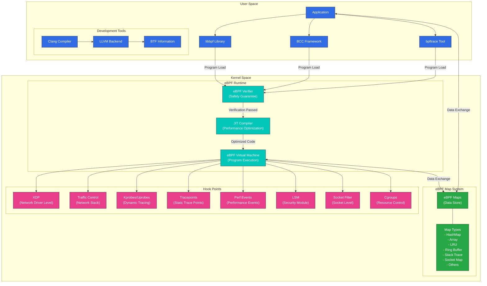
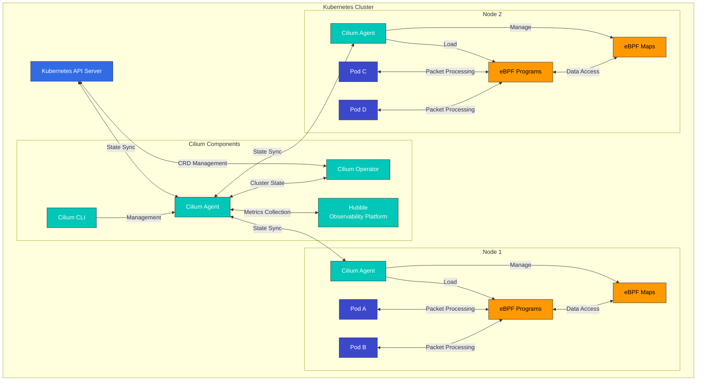

# eBPFテクノロジーの詳細

> **サポート対象バージョン**: Linux kernel 4.19+
> **最終更新**: February 22, 2026

## ラボ環境のセットアップ

このドキュメントの例を実行するには、次のツールと環境が必要です。

### 必要なツール
- Linux kernel 4.19以降（5.10+を推奨）
- bpftool、libbpf-dev、clang、llvm
- bcc（BPF Compiler Collection）

### 環境のセットアップ

```bash
# Install required packages on Ubuntu/Debian systems
sudo apt-get update
sudo apt-get install -y build-essential clang llvm libelf-dev libbpf-dev bpftool linux-tools-common linux-tools-generic

# Install BCC
sudo apt-get install -y bpfcc-tools python3-bpfcc

# Check kernel version
uname -r

# Check eBPF feature support
bpftool feature
```

## eBPFテクノロジーの概要と歴史的背景

eBPF（extended Berkeley Packet Filter）は、Linux kernel内でプログラムを安全に実行できる革新的なテクノロジーです。このテクノロジーは、kernelコードを変更せずにkernelの動作を拡張および観測する強力なメカニズムを提供します。現代のクラウドネイティブ環境において、eBPFはネットワーキング、セキュリティ、モニタリング、パフォーマンス分析に革新的な変化をもたらしました。

### BPFからeBPFへ: 進化の歴史

#### 初期BPFの誕生と制限（1992-2013）
1992年、UC BerkeleyのSteven McCanneとVan Jacobsonは、Berkeley Packet Filter（BPF）を紹介する「The BSD Packet Filter: A New Architecture for User-level Packet Capture」という論文を発表しました。このテクノロジーは、ネットワークパケットフィルタリングへの革新的なアプローチを示しました。

BPFは次の中核概念を導入しました。
- **Kernel内仮想マシン**: kernel内でユーザー定義コードを安全に実行
- **レジスタベース設計**: スタックベースよりも効率的な実行モデル
- **安全性の保証**: 無限ループの防止とメモリアクセスの制限
- **パケットフィルタリングの最適化**: 不要なパケットコピーを防止

初期のBPFは主にtcpdumpのようなネットワーク監視ツールで使用され、次の制限がありました。
- 制限された命令セット（32-bitレジスタは2個のみ）
- 制限されたプログラムサイズ（最大4096命令）
- 制限された機能（主にパケットフィルタリングに使用）
- User spaceとの限定的な連携
- 最新のCPUアーキテクチャを活用できない

こうした制限にもかかわらず、BPFは20年以上にわたってLinux kernelの重要な一部であり続けました。

#### eBPFの誕生と初期開発（2013-2016）
2013年、PLUMgridのAlexei Starovoitovは、既存のBPFの制限を克服するためにextended BPF（eBPF）を提案しました。この提案は、最新のプロセッサアーキテクチャに適合するようBPFを完全に再設計することを目指しました。

eBPFの初期設計目標には次が含まれていました。
- 64-bitアーキテクチャのサポート
- より多くのレジスタ（10 → 現在は11）
- より大きなスタックスペース（512 bytes）
- mapを介した状態の保存とUser spaceとの通信
- さまざまなイベントにアタッチできる汎用機能

主な開発段階:
- **2014年5月（Linux kernel 3.15）**: 初期eBPFインフラストラクチャをLinux kernelに統合
  - 新しいeBPF命令セットを導入
  - classic BPF（cBPF）からeBPFへの変換レイヤーを追加
  - 初期eBPF mapタイプ（hash、array）を導入

- **2014年12月（Linux kernel 3.18）**: eBPF JIT（Just-In-Time）compilerを導入
  - x86_64アーキテクチャ向けJITコンパイルをサポート
  - 実行パフォーマンスを大幅に改善
  - プログラムチェーン用のtail call機能を追加

- **2015年6月（Linux kernel 4.1）**: eBPF map機能を拡張
  - User spaceとKernel space間のデータ共有メカニズムを強化
  - 新しいmapタイプ（LRU hash、stack trace）を追加
  - eBPFプログラムをkprobeにアタッチする機能を追加

- **2016年1月（Linux kernel 4.4）**: XDP（eXpress Data Path）を導入
  - ネットワークドライバレベルでの高性能なパケット処理を実現
  - パケットがkernelネットワークスタックに入る前に処理
  - 毎秒数百万パケットを処理可能なパフォーマンス

- **2016年7月（Linux kernel 4.7）**: 追加eBPFプログラムタイプを導入
  - Traffic Control（TC）プログラムをサポート
  - socketフィルタリング機能を強化
  - Helper functionを拡張

この期間に、eBPFは単純なパケットフィルタリングツールから汎用的なkernelプログラミングインフラストラクチャへと進化し、ネットワーキングを超えたさまざまな用途に拡大しました。

#### 最新eBPFエコシステムの成長と革新（2017年-現在）
2017年以降、eBPFはクラウドネイティブコンピューティングの中核テクノロジーとして確立され、さまざまなプロジェクトや企業がこのテクノロジーを採用しています。

##### 主なプロジェクトと技術開発:

- **2017年**:
  - **Ciliumプロジェクト開始**: コンテナネットワーキングとセキュリティにeBPFを活用した最初の主要プロジェクト
  - **BCC（BPF Compiler Collection）**: eBPFプログラム開発向け高水準ツールコレクションの登場
  - **Linux kernel 4.10-4.14**: cgroup、socket、tracepointプログラムタイプを追加

- **2018年**:
  - **Linux kernel 4.18**: BTF（BPF Type Format）を導入し、CO-RE（Compile Once – Run Everywhere）サポートの基盤を構築
  - **bpftrace**: DTraceスタイルの高水準トレーシング言語が登場
  - **Facebook Katran**: eBPFベースのL4 load balancerをオープンソース化

- **2019年**:
  - **Linux kernel 5.0-5.3**: BPF-to-BPF function callをサポートし、raw tracepointプログラムを追加
  - **Falco**: eBPFベースのランタイムセキュリティ監視ツールとして人気が拡大
  - **Hubble**: Ciliumベースのネットワーク可観測性ツールが登場

- **2020年**:
  - **Linux kernel 5.5-5.10**: BPF link抽象化、グローバル変数、スリープ機能、ループサポート
  - **libbpf**: User spaceライブラリが成熟
  - **eBPF Foundation設立**: テクノロジー発展のための公式組織を形成
  - **Isovalent（Cilium開発元）のSeries A投資**: 商用eBPFソリューションが登場

- **2021年**:
  - **Linux kernel 5.11-5.15**: メモリ割り当て機能、timerサポート、dynamic pointerを追加
  - **Kubernetes統合の強化**: Service Mesh、ネットワーキング、セキュリティ領域での採用を拡大
  - **商用製品のリリース**: 複数企業がeBPFベースの製品をリリース

- **2022年-現在**:
  - **Linux kernel 6.0+**: 機能拡張と最適化を継続
  - **クラウドネイティブテクノロジーとしての標準化**: CNCFプロジェクトとの統合を拡大
  - **eBPF Summit**: 専門カンファレンスとコミュニティが成長
  - **主要クラウドプロバイダーによる採用**: AWS、GCP、AzureがeBPFテクノロジーを活用

##### 現在のeBPF適用領域:

1. **ネットワーキング**:
   - コンテナネットワーキング（Cilium、Calico）
   - Load balancing（Katran、Cilium）
   - パケットフィルタリングとfirewall（bpfilter）
   - ネットワークアクセラレーション（XDPベースのソリューション）

2. **セキュリティ**:
   - ランタイムセキュリティ監視（Falco、Tracee）
   - 侵入検知システム（Tetragon）
   - System callフィルタリング（seccomp-bpf）
   - 権限管理（LSM BPF）

3. **可観測性**:
   - システム監視とトレーシング（bpftrace、BCC）
   - パフォーマンス分析（BPF Performance Tools）
   - 分散トレーシング（Hubble）
   - metrics収集（eBPF Exporter）

4. **Service Mesh**:
   - SidecarなしのService Mesh（Cilium Service Mesh）
   - L7 proxyとload balancing
   - トラフィック管理とルーティング

5. **ストレージ**:
   - Block I/Oトレーシングと最適化
   - File system監視
   - Cacheパフォーマンス分析

### eBPFの技術的進化: Kernelバージョン別の主な機能

eBPFの技術的進歩は複数のLinux kernelバージョンを通じて段階的に進み、各バージョンで重要な機能が追加されました。以下の表は、kernelバージョン別の主要なeBPF機能追加を示します。

| Kernel Version | 年 | 追加された主なeBPF機能 | 技術的意義 |
|---------------|------|-------------------------|----------------------|
| 3.15 | 2014 | 初期eBPFインフラストラクチャを導入 | 新しい命令セット、レジスタの拡張 |
| 3.18 | 2014 | JIT compilerを追加 | 実行パフォーマンスを大幅に改善 |
| 4.1 | 2015 | eBPF map機能、User space API | 状態保存とデータ共有が可能 |
| 4.4 | 2016 | XDP（eXpress Data Path）を導入 | 超高速パケット処理が可能 |
| 4.7 | 2016 | 追加プログラムタイプ、tail callサポート | プログラムチェーンとスケーラビリティを改善 |
| 4.10 | 2017 | Socketおよびcgroupプログラム | ネットワークsocket制御、コンテナサポート |
| 4.14 | 2017 | XDP offload、より多くのHelper function | ハードウェアアクセラレーションをサポート |
| 4.18 | 2018 | BTF（BPF Type Format）を導入 | CO-REサポートの基盤 |
| 5.0 | 2019 | BPF-to-BPF function callをサポート | モジュール化とコード再利用が可能 |
| 5.5 | 2020 | BPF link抽象化、グローバル変数 | プログラム管理を改善 |
| 5.8 | 2020 | ループサポート（bounded loops） | プログラミングの柔軟性を強化 |
| 5.10 | 2020 | スリープ機能 | 非同期プログラミングが可能 |
| 5.13 | 2021 | メモリ割り当て機能 | 動的メモリ管理が可能 |
| 5.15 | 2021 | Timerサポート | 時間ベースのイベント処理 |
| 6.0+ | 2022+ | 機能拡張と最適化を継続 | 完全なプログラミング環境へ進化 |

これらの開発により、eBPFは単純なパケットフィルタから完全なプログラミング環境へと進化し、現在ではLinux kernelにおける最も重要なテクノロジーの一つとなっています。特に、CO-RE（Compile Once – Run Everywhere）機能の導入により、eBPFプログラムの可搬性が大幅に改善され、同じプログラムを再コンパイルせずにさまざまなkernelバージョンで実行できるようになりました。

### eBPFと従来のKernel Module: パラダイムシフト

eBPFは、従来のKernel Moduleと比べて、Linux kernelを拡張する根本的に異なるアプローチを提供します。これらの違いを理解することは、eBPFの革新性を把握するうえで重要です。

| 特性 | eBPF | Kernel Module |
|---------------|------|---------------|
| **安全性** | verifierにより安全性を保証、kernel crashは不可能 | Kernel panicの可能性があり、システム全体の安定性に影響 |
| **デプロイ** | 実行時に動的ロード、バイナリ互換性を維持 | kernelバージョンごとに再コンパイルが必要、互換性の問題が発生する可能性 |
| **アップグレード** | kernel再起動なしでリアルタイム更新が可能 | ほとんどの場合で再起動が必要、サービスを中断 |
| **パフォーマンス** | JITコンパイルにより最適化、ネイティブに近いパフォーマンス | ネイティブパフォーマンス、kernelへ直接アクセス |
| **開発の複雑さ** | 制限された環境、特殊ツールが必要、デバッグが困難 | 完全なkernel APIアクセス、標準デバッグツールを利用可能 |
| **権限モデル** | 制限付き権限、sandbox環境 | 完全なkernel権限、無制限のアクセス |
| **可搬性** | CO-RE（Compile Once – Run Everywhere）をサポート | kernelバージョンごとに再コンパイルが必要 |
| **デプロイ範囲** | 本番環境に安全にデプロイ可能 | 主にベンダー提供のKernel Moduleに限定 |

eBPFの最大の革新は、その安全性と動的ロード機能です。従来のKernel Moduleはkernel内部で制限なく実行され、バグはシステム全体を不安定にする可能性があります。一方、eBPFプログラムは、メモリアクセス、無限ループ、kernel crashの可能性を徹底的に検査するkernelのverifierを通過した場合にのみロードできます。

## Kernel内部のeBPFアーキテクチャの詳細分析

> **重要な概念**: eBPFはLinux kernel内のsandbox化された仮想マシンとして動作し、kernelコードを変更せずにkernelの動作を拡張できます。

eBPFは単なるテクノロジーではなく、kernel内部の仮想マシンからUser spaceライブラリまで、さまざまなコンポーネントで構成される完全なテクノロジースタックです。このアーキテクチャを理解することは、eBPFの強力さと柔軟性を把握するうえで不可欠です。

### eBPFアーキテクチャの詳細図



### eBPFアーキテクチャコンポーネントの詳細説明

#### 1. User Spaceコンポーネント

**開発ツールとライブラリ**:
- **Clang/LLVM**: CまたはRustからeBPF bytecodeへeBPFプログラムをコンパイル
- **libbpf**: 低水準eBPF操作ライブラリ、kernelと直接連携
- **BCC（BPF Compiler Collection）**: PythonおよびLua bindingを提供する高水準ライブラリ
- **bpftrace**: DTraceに似た構文を持つeBPFベースのトレーシング言語

**CO-RE（Compile Once – Run Everywhere）**:
- BTF（BPF Type Format）を使用してkernelバージョン間の可搬性を提供
- 再コンパイルなしで同じeBPFプログラムをさまざまなkernelバージョンで実行
- struct relocation機能によりkernel構造の変更に対応

#### 2. Kernel Spaceコンポーネント

**eBPF Runtime**:
- **eBPF Verifier**: プログラムの安全性を保証する中核コンポーネント
  - 無限ループの防止
  - 有効なメモリアクセスのみを許可
  - Kernel安定性の保証
  - 権限チェック

- **JIT（Just-In-Time）Compiler**:
  - eBPF bytecodeをネイティブマシンコードへ変換
  - アーキテクチャ固有の最適化（x86_64、ARM64、RISC-Vなど）
  - 実行パフォーマンスを大幅に改善

- **eBPF Virtual Machine**:
  - 11個のレジスタ
  - 512-byteスタック
  - Helper functionを介したkernel関数へのアクセス
  - プログラムチェーン用のtail callサポート

**eBPF Map System**:
- Key-value storeとして実装されたデータ構造
- Kernel spaceとUser space間のデータ共有
- さまざまなmapタイプをサポート:
  - **BPF_MAP_TYPE_HASH**: 汎用hash table
  - **BPF_MAP_TYPE_ARRAY**: 固定サイズarray
  - **BPF_MAP_TYPE_LRU_HASH**: 最近使用した項目を追跡
  - **BPF_MAP_TYPE_RINGBUF**: 高性能ring buffer
  - **BPF_MAP_TYPE_STACK_TRACE**: Stack traceストレージ
  - **BPF_MAP_TYPE_SOCKHASH**: Socket参照ストレージ
  - **BPF_MAP_TYPE_DEVMAP**: ネットワークデバイス参照
  - **BPF_MAP_TYPE_PROG_ARRAY**: eBPFプログラム参照

**Hook Point**:

eBPFプログラムは、hook pointと呼ばれるkernel内のさまざまなポイントにアタッチできます。各hook pointでは、特定のイベントまたは操作が発生したときにeBPFプログラムを実行できます。主なhook pointは次のとおりです。

- **XDP（eXpress Data Path）**:
  - ネットワークドライバレベルでのパケット処理
  - NICからのパケットをkernelに入る前に処理
  - 最高性能のパケット処理ポイント（毎秒数千万パケットを処理可能）
  - 可能なアクション: パケットdrop、pass、redirect、modify
  - ユースケース: DDoS防御、パケットフィルタリング、load balancing
  - ハードウェアoffloadをサポート（特定のNIC）

- **Traffic Control（TC）**:
  - ネットワークスタックのトラフィック制御レイヤー
  - Ingress/egressのキューポイント
  - XDPより多くのコンテキストを提供
  - パケットheaderとpayloadの変更が可能
  - ユースケース: Network policy、NAT、パケット変換
  - Ingressとegressの両方をサポート

- **Socket Filter**:
  - Socketレベルでのパケットフィルタリング
  - 特定のsocketにプログラムをアタッチ
  - User spaceアプリケーションのsocket操作を制御
  - ユースケース: アプリケーションごとのパケットフィルタリング、socketレベルの統計
  - Socket作成時、binding時、接続時に適用可能

- **Kprobes/Uprobes**:
  - Kernel/User space関数の動的トレーシング
  - 関数のentry/return時に実行
  - 任意のkernel関数をhook可能
  - ユースケース: パフォーマンス分析、デバッグ、セキュリティ監視
  - 動的に追加/削除可能
  - Overheadがある（本番環境では注意が必要）

- **Tracepoints**:
  - Kernel内で静的に定義されたtrace point
  - 安定したABIを提供（kernelバージョン間の互換性）
  - 主要なkernelイベントのトレーシングをサポート
  - ユースケース: System callトレーシング、block I/O監視、ネットワークイベントトレーシング
  - Kprobesより低いoverhead

- **Perf Events**:
  - パフォーマンス監視イベント
  - CPUパフォーマンスカウンターへのアクセス
  - ハードウェア/ソフトウェアイベントの監視
  - ユースケース: CPU使用率分析、cache miss追跡、branch prediction failure監視
  - 高精度なパフォーマンス測定が可能

- **LSM（Linux Security Module）**:
  - セキュリティポリシーの適用
  - System callのセキュリティチェック
  - 権限検証とアクセス制御
  - ユースケース: コンテナセキュリティ、権限昇格検知、fileアクセス制御
  - Kernel 5.7+でサポート

- **Cgroups**:
  - コンテナリソース制御
  - コンテナごとのポリシー適用
  - リソース使用量の制限と監視
  - ユースケース: コンテナNetwork policy、リソース制限、分離
  - コンテナオーケストレーション環境で重要

### eBPFプログラムライフサイクルの詳細分析

eBPFプログラムは、開発から実行まで複数の段階を経ます。このプロセスを理解することで、eBPFの仕組みと制約が明確になります。

1. **開発段階**:
   - C、Rustなどの高水準言語でプログラムを記述
   - Kernel headerとeBPF Helper functionを使用
   - BTF情報を活用（CO-REサポート用）
   - Sectionを定義（`SEC()` macroを使用）
   - Licenseを指定（GPL互換が必要）

2. **コンパイル段階**:
   - Clang/LLVMを使用してeBPF bytecodeへコンパイル
   - `-target bpf`オプションでeBPF targetを指定
   - BTFとデバッグ情報を生成
   - ELF file formatで出力

3. **ロード段階**:
   - `bpf()` system callを通じてプログラムをkernelへロード
   - libbpfまたはBCCライブラリがこのプロセスを処理
   - アタッチするプログラムタイプとhookを指定
   - 必要なmapを作成

4. **検証段階**:
   - Kernel内verifierがプログラムの安全性をチェック
   - Control flow graph（CFG）分析
   - メモリアクセスの検証
   - 無限ループの防止
   - 権限チェック
   - 失敗時に詳細なエラーメッセージを提供

5. **JITコンパイル段階**:
   - Bytecodeをhostアーキテクチャ向けネイティブコードへ変換
   - アーキテクチャ固有の最適化を適用
   - 実行パフォーマンスを改善
   - ほとんどのアーキテクチャでサポート（x86_64、ARM64、RISC-Vなど）

6. **アタッチ段階**:
   - プログラムを特定のkernelイベント（hook）にアタッチ
   - 必要なmapを作成して初期化
   - プログラムmetadataを設定
   - File descriptorを管理

7. **実行段階**:
   - イベント発生時にプログラムを実行
   - Contextデータにアクセス
   - 判断に従ってパケット/イベントを処理
   - Helper functionを呼び出し

8. **データ交換段階**:
   - eBPF mapを通じてデータを保存および取得
   - User spaceアプリケーションと通信
   - パフォーマンスmetrics、状態情報などを共有
   - イベント通知（perf event buffer、ring bufferなど）

9. **更新/アンロード段階**:
   - 必要に応じてプログラムを動的に更新
   - 使用完了後にプログラムをアンロード
   - 関連リソースをクリーンアップ
   - Mapデータを維持または削除

### eBPFプログラムタイプと特性

eBPFプログラムは、アタッチするhook pointに応じてさまざまなタイプに分類されます。各プログラムタイプには、固有のcontextと機能があります。

1. **XDP（eXpress Data Path）プログラム**:
   - プログラムタイプ: `BPF_PROG_TYPE_XDP`
   - Context: ネットワークパケットデータ、interface情報
   - Return value: `XDP_DROP`、`XDP_PASS`、`XDP_TX`、`XDP_REDIRECT`など
   - 特性: 最高性能のパケット処理、driver/ハードウェアレベルで実行

2. **Traffic Control（TC）プログラム**:
   - プログラムタイプ: `BPF_PROG_TYPE_SCHED_CLS`、`BPF_PROG_TYPE_SCHED_ACT`
   - Context: ネットワークパケットデータ、scheduling情報
   - Return value: `TC_ACT_OK`、`TC_ACT_SHOT`、`TC_ACT_REDIRECT`など
   - 特性: パケット分類と操作、ingress/egressをサポート

3. **Socket Filterプログラム**:
   - プログラムタイプ: `BPF_PROG_TYPE_SOCKET_FILTER`
   - Context: Socket bufferデータ
   - Return value: 0（パケットdrop）またはパケット長（パケット許可）
   - 特性: Socketレベルのパケットフィルタリング、tcpdumpと同様の機能

4. **kprobe/uprobeプログラム**:
   - プログラムタイプ: `BPF_PROG_TYPE_KPROBE`、`BPF_PROG_TYPE_UPROBE`
   - Context: 関数引数、レジスタ値
   - Return value: Integer（意味なし）
   - 特性: 動的関数トレーシング、デバッグとprofiling

5. **tracepointプログラム**:
   - プログラムタイプ: `BPF_PROG_TYPE_TRACEPOINT`
   - Context: Tracepoint定義struct
   - Return value: Integer（意味なし）
   - 特性: 安定したkernel trace point、バージョン互換性

6. **perf Eventプログラム**:
   - プログラムタイプ: `BPF_PROG_TYPE_PERF_EVENT`
   - Context: パフォーマンスイベントデータ
   - Return value: Integer（意味なし）
   - 特性: ハードウェア/ソフトウェアパフォーマンスイベント監視

7. **cgroupプログラム**:
   - プログラムタイプ: `BPF_PROG_TYPE_CGROUP_SKB`、`BPF_PROG_TYPE_CGROUP_SOCK`など
   - Context: cgroup情報、socket/パケットデータ
   - Return value: 0（拒否）または1（許可）
   - 特性: コンテナごとのNetwork policy、リソース制御

8. **LSM（Linux Security Module）プログラム**:
   - プログラムタイプ: `BPF_PROG_TYPE_LSM`
   - Context: セキュリティ関連の操作情報
   - Return value: 0（許可）またはエラーコード（拒否）
   - 特性: セキュリティポリシー適用、権限チェック

9. **Socket Operationsプログラム**:
   - プログラムタイプ: `BPF_PROG_TYPE_SOCK_OPS`
   - Context: Socket操作情報
   - Return value: Integer（意味なし）
   - 特性: TCP接続制御、socket option設定

10. **fentry/fexitプログラム**:
    - プログラムタイプ: `BPF_PROG_TYPE_TRACING`
    - Context: 関数引数、return value
    - Return value: Integer（意味なし）
    - 特性: 低overheadの関数トレーシング、kprobeより効率的

### シンプルなeBPFプログラムの例と解説

以下は、System callの実行をトレースするシンプルなeBPFプログラムの例です。

```c
// hello_world.c
#include <linux/bpf.h>
#include <bpf/bpf_helpers.h>

// Program section definition - this program executes on execve system call entry
SEC("tracepoint/syscalls/sys_enter_execve")
int hello_execve(void *ctx) {
    // Print simple message
    char msg[] = "Hello, eBPF!";
    bpf_trace_printk(msg, sizeof(msg));
    return 0;
}

// License definition (GPL compatible required)
char LICENSE[] SEC("license") = "GPL";
```

**コードの解説**:
1. **Header file**: 必要なeBPF関連headerをinclude
2. **Section定義**: `SEC()` macroでプログラムタイプとアタッチポイントを指定
3. **プログラム関数**: `execve` System call実行時に呼び出される関数
4. **Context parameter**: イベント関連データを保持
5. **Helper functionの使用**: `bpf_trace_printk()`でデバッグメッセージを出力
6. **Licenseの指定**: GPL互換licenseが必要（kernel symbolアクセス用）

**コンパイルと実行**:
```bash
# Compile
clang -O2 -target bpf -c hello_world.c -o hello_world.o

# Load and run
bpftool prog load hello_world.o /sys/fs/bpf/hello_world

# Check output
cat /sys/kernel/debug/tracing/trace_pipe
```

**実行結果**:
```
<...>-1234  [001] d... 123456.789012: bpf_trace_printk: Hello, eBPF!
<...>-5678  [002] d... 123456.789102: bpf_trace_printk: Hello, eBPF!
```

このシンプルな例は、eBPFの基本概念を示しています。実際のアプリケーションでは、より複雑なロジックとmapを使用してデータを収集および分析できます。

### eBPF Map: データ共有と状態保存の中核

eBPF mapは、eBPFプログラムとUser spaceアプリケーションの間でデータを共有するためのkey-value storeです。これらのmapは、eBPFプログラムが状態を維持し、User spaceと通信するための中核メカニズムです。

#### eBPF Mapの基本概念

eBPF mapには次の特性があります。

- **永続ストレージ**: プログラムが再ロードされてもデータは保持される
- **さまざまなデータ構造**: Hash table、array、queue、stackを含むさまざまな形式をサポート
- **並行性サポート**: 複数CPUからの並行アクセスが可能
- **サイズ制限**: 作成時に最大サイズを指定する必要がある
- **柔軟なKey/Value形式**: さまざまなデータタイプを保存可能
- **双方向アクセス**: Kernel spaceとUser spaceの両方からアクセス可能

#### 主なMapタイプとユースケース

1. **Hash Map（BPF_MAP_TYPE_HASH）**:
   - 汎用key-value store
   - O(1)の時間計算量のlookupパフォーマンス
   - 動的サイズ管理（max entriesで制限）
   - ユースケース: Connection tracking、session情報ストレージ、counter
   - コード例:
     ```c
     struct bpf_map_def SEC("maps") connection_map = {
         .type = BPF_MAP_TYPE_HASH,
         .key_size = sizeof(struct connection_key),
         .value_size = sizeof(struct connection_info),
         .max_entries = 1024,
     };
     ```

2. **Array Map（BPF_MAP_TYPE_ARRAY）**:
   - Indexベースの固定サイズarray
   - 非常に高速なlookupパフォーマンス
   - すべてのentryを事前割り当て
   - ユースケース: グローバル設定、統計、高速lookupが必要なデータ
   - コード例:
     ```c
     struct bpf_map_def SEC("maps") config_array = {
         .type = BPF_MAP_TYPE_ARRAY,
         .key_size = sizeof(u32),
         .value_size = sizeof(struct config),
         .max_entries = 1,
     };
     ```

3. **LRU Hash Map（BPF_MAP_TYPE_LRU_HASH）**:
   - 最も最近使用されていない項目を追跡するHash map
   - Max entriesを超えた場合に最も古いentryを自動削除
   - Cache実装に適している
   - ユースケース: Connection cache、route cache
   - コード例:
     ```c
     struct bpf_map_def SEC("maps") connection_cache = {
         .type = BPF_MAP_TYPE_LRU_HASH,
         .key_size = sizeof(struct connection_key),
         .value_size = sizeof(struct connection_info),
         .max_entries = 10000,
     };
     ```

4. **Ring Buffer（BPF_MAP_TYPE_RINGBUF）**:
   - Producer-consumer modelを持つ高性能buffer
   - Single producer、single consumerをサポート
   - イベントベースの通知をサポート
   - ユースケース: Log収集、イベント配信、高性能データストリーミング
   - コード例:
     ```c
     struct bpf_map_def SEC("maps") events = {
         .type = BPF_MAP_TYPE_RINGBUF,
         .max_entries = 256 * 1024, // 256 KB
     };
     ```

5. **Perf Event Array（BPF_MAP_TYPE_PERF_EVENT_ARRAY）**:
   - パフォーマンスイベントデータの転送
   - KernelからUser spaceへのイベント配信
   - ユースケース: Trace event、パフォーマンスデータ収集
   - コード例:
     ```c
     struct bpf_map_def SEC("maps") perf_events = {
         .type = BPF_MAP_TYPE_PERF_EVENT_ARRAY,
         .key_size = sizeof(int),
         .value_size = sizeof(u32),
         .max_entries = 128,
     };
     ```

6. **Program Array（BPF_MAP_TYPE_PROG_ARRAY）**:
   - 他のeBPFプログラムへの参照を保存
   - Tail call実装に使用
   - プログラムチェーンが可能
   - ユースケース: 複雑な処理ロジックのモジュール化、条件付き実行
   - コード例:
     ```c
     struct bpf_map_def SEC("maps") jump_table = {
         .type = BPF_MAP_TYPE_PROG_ARRAY,
         .key_size = sizeof(u32),
         .value_size = sizeof(u32),
         .max_entries = 10,
     };
     ```

7. **Per-CPU Maps（BPF_MAP_TYPE_PERCPU_HASH/ARRAY）**:
   - CPUごとの独立したデータストレージ
   - 並行性の問題なく高性能アクセス
   - ユースケース: 高性能counter、CPUごとの統計
   - コード例:
     ```c
     struct bpf_map_def SEC("maps") cpu_stats = {
         .type = BPF_MAP_TYPE_PERCPU_ARRAY,
         .key_size = sizeof(u32),
         .value_size = sizeof(struct stats),
         .max_entries = 1,
     };
     ```

8. **Socket Map（BPF_MAP_TYPE_SOCKMAP）**:
   - Socket参照ストレージ
   - Socket-to-socket redirectをサポート
   - ユースケース: Socketアクセラレーション、proxy実装
   - コード例:
     ```c
     struct bpf_map_def SEC("maps") socket_map = {
         .type = BPF_MAP_TYPE_SOCKMAP,
         .key_size = sizeof(u32),
         .value_size = sizeof(u32),
         .max_entries = 1024,
     };
     ```

#### eBPF Map操作の例

以下は、eBPFプログラムでmapを使用するシンプルな例です。

```c
#include <linux/bpf.h>
#include <bpf/bpf_helpers.h>

// Map definition
struct bpf_map_def SEC("maps") counter_map = {
    .type = BPF_MAP_TYPE_ARRAY,
    .key_size = sizeof(u32),
    .value_size = sizeof(u64),
    .max_entries = 1,
};

SEC("tracepoint/syscalls/sys_enter_execve")
int count_execve(void *ctx) {
    u32 key = 0;
    u64 *value, init_val = 1;

    // Lookup value from map
    value = bpf_map_lookup_elem(&counter_map, &key);
    if (value) {
        // Increment if value exists
        __sync_fetch_and_add(value, 1);
    } else {
        // Initialize if value doesn't exist
        bpf_map_update_elem(&counter_map, &key, &init_val, BPF_ANY);
    }

    return 0;
}

char LICENSE[] SEC("license") = "GPL";
```

User spaceからmapにアクセスします。

```c
#include <bpf/bpf.h>
#include <stdio.h>

int main() {
    // Open map file descriptor
    int map_fd = bpf_obj_get("/sys/fs/bpf/counter_map");
    if (map_fd < 0) {
        perror("Failed to open map");
        return 1;
    }

    // Lookup value from map
    u32 key = 0;
    u64 value;
    if (bpf_map_lookup_elem(map_fd, &key, &value) == 0) {
        printf("execve count: %llu\n", value);
    } else {
        perror("Failed to lookup value");
    }

    return 0;
}
```

## CiliumにおけるeBPFの活用: コンテナネットワーキングの革新

Ciliumは、eBPFを活用してコンテナネットワーキング、load balancing、Network policy、可視性を実装するオープンソースプロジェクトです。Kubernetesのようなコンテナオーケストレーションプラットフォーム向けに、ネットワーキングおよびセキュリティ機能を提供します。

### CiliumアーキテクチャとeBPFの役割

Ciliumは次のコンポーネントで構成され、eBPFはそれぞれで重要な役割を果たします。



#### 主なコンポーネント:

1. **Cilium Agent**:
   - 各nodeで実行されるDaemon
   - eBPFプログラムのコンパイルとロード
   - Endpoint管理とポリシー適用
   - ネットワークトポロジー検出
   - 状態監視とmetrics収集

2. **Cilium Operator**:
   - Cluster全体のリソース管理
   - CRD（Custom Resource Definition）処理
   - Node間の調整
   - Clusterスコープ機能の管理

3. **eBPFプログラム**:
   - XDPおよびTC hookにアタッチされるDatapathプログラム
   - Socketレベルのload balancingプログラム
   - Connection trackingプログラム
   - Network policy適用プログラム

4. **eBPF Map**:
   - Endpoint情報ストレージ
   - ポリシールールストレージ
   - Connection tracking状態管理
   - Load balancing Service情報

5. **Hubble**:
   - eBPFベースのネットワーク可観測性プラットフォーム
   - ネットワークflow監視
   - セキュリティ可視性
   - パフォーマンス分析とトラブルシューティング

### CiliumのeBPF Datapathの詳細分析

CiliumのDatapathはeBPFプログラムを通じて実装され、ネットワークスタックを通過するパケットを複数のポイントで処理します。

1. **パケット受信（XDP/TC Ingress）**:
   - ネットワークinterfaceでパケットを受信
   - XDPまたはTC hookでパケットをintercept
   - 初期フィルタリングとDDOS防御
   - パケットタイプの分類（local/forwarding/host）

2. **Identity検証**:
   - パケットのsource/destination IPおよびportを分析
   - Kubernetes endpointを識別
   - Service backendを検証
   - Context情報を収集

3. **ポリシー適用**:
   - Network policyルールをチェック
   - L3/L4ポリシーを適用（IP/portベース）
   - L7ポリシーを適用（HTTP/gRPC/DNSなど）
   - ポリシーの判断に基づきallow/deny

4. **Connection Tracking**:
   - 接続状態を追跡および管理
   - Stateful firewall機能
   - NAT状態を維持
   - Connection timeoutを管理

5. **NATとLoad Balancing**:
   - 必要に応じてアドレス変換
   - Service load balancing（consistent hashing、session affinity）
   - DSR（Direct Server Return）をサポート
   - Health checkベースのendpoint選択

6. **パケット転送**:
   - パケットをdestination endpointに転送
   - Overlayまたはnative routing
   - パケットのencapsulation/decapsulation（必要な場合）
   - パケット変換と最適化

7. **モニタリングと可視性**:
   - Flow情報を収集
   - Metricsを更新
   - Eventを生成
   - デバッグ情報を記録

### Ciliumの主要eBPFプログラムの詳細説明

Ciliumは、コンテナネットワーキング機能を実装するためにさまざまなeBPFプログラムを使用します。

1. **bpf_lxc.c**: Endpoint間通信の処理
   - コンテナnetwork namespaceとhost間の通信を処理
   - ポリシー適用とConnection tracking
   - Endpointの識別とルーティング
   - 主な関数: `handle_xgress`、`__tail_handle_ipv{4,6}`

2. **bpf_overlay.c**: Overlayネットワークの処理
   - VXLAN/Geneve encapsulationとdecapsulation
   - Node間パケットルーティング
   - Tunnel key管理
   - 主な関数: `from_overlay`、`to_overlay`

3. **bpf_host.c**: Hostネットワーキングの処理
   - Hostネットワークスタックとコンテナ間の通信
   - Host firewall機能
   - HostベースのService処理
   - 主な関数: `handle_netdev`、`handle_from_host`

4. **bpf_xdp.c**: XDPベースのパケット処理
   - 早期パケットフィルタリング
   - DDoS防御
   - 高性能なパケットdropとredirect
   - 主な関数: `cilium_xdp_entry`

5. **bpf_sock.c**: Socketレベルのload balancing
   - Socket作成時のload balancing
   - Connection trackingのbypass
   - 高性能なServiceアクセス
   - 主な関数: `sock4_load_balancer`、`sock6_load_balancer`

6. **bpf_lb.c**: Service load balancing
   - Kubernetes Service実装
   - Backend選択とNAT
   - Session affinityをサポート
   - 主な関数: `lb{4,6}_service`

7. **bpf_network.c**: Network policy適用
   - L3/L4ポリシー適用
   - ポリシー判断のcache
   - ポリシー統計を収集
   - 主な関数: `policy_can_access`、`policy_apply_verdict`

### CiliumのeBPF Map使用法

Ciliumは、状態を保存してデータを共有するためにさまざまなeBPF mapを使用します。

1. **endpoints_map**: Endpoint情報ストレージ
   - Key: Endpoint ID
   - Value: Endpoint metadata（IP、security ID、interfaceなど）
   - 目的: パケットルーティング、ポリシー適用

2. **connection_map**: Connection tracking情報
   - Key: Connection tuple（src IP/port、dst IP/port、protocol）
   - Value: Connection状態、timestamp、統計
   - 目的: Stateful firewall、NAT追跡

3. **policy_map**: Network policyルール
   - Key: Policy identifier
   - Value: Policy rule（allow/deny、port、protocolなど）
   - 目的: Network policy適用

4. **lb_map**: Load balancing Service情報
   - Key: Service address（virtual IP:port）
   - Value: Backend list、選択アルゴリズム、状態
   - 目的: Service load balancing

5. **tunnel_map**: Overlayネットワーク情報
   - Key: Remote node IP
   - Value: Tunnel endpoint情報
   - 目的: Node間パケットルーティング

6. **metrics_map**: パフォーマンスmetrics収集
   - Key: Metric type
   - Value: Counter、gaugeなど
   - 目的: モニタリングとデバッグ

### CiliumのeBPFベース機能

Ciliumは、eBPFを使用して次の高度なネットワーキングおよびセキュリティ機能を提供します。

1. **Kubernetes Network Policies**:
   - Namespace、Pod、Serviceレベルのポリシー
   - L3/L4/L7ポリシーをサポート
   - CIDRベースのフィルタリング
   - Cluster内/外通信の制御

2. **透過的暗号化**:
   - WireGuardまたはIPsecベースのNode間暗号化
   - Zero configurationセットアップ
   - パフォーマンス最適化された実装
   - 自動key管理

3. **Service Mesh機能**:
   - L7 proxy統合
   - HTTP、gRPC、Kafka protocolを認識
   - Headerベースのルーティング
   - SidecarなしのService Mesh

4. **Load Balancing**:
   - Consistent hashingアルゴリズム
   - Session affinity
   - Microservice load balancing
   - DSR（Direct Server Return）をサポート

5. **可観測性とモニタリング**:
   - ネットワークflow可視性
   - Service dependency map
   - パフォーマンスbottleneckの識別
   - セキュリティevent検出

6. **帯域幅管理**:
   - Endpointごとの帯域幅制限
   - トラフィックの優先順位付け
   - Congestion control
   - Quality of Service（QoS）保証

7. **Multi-clusterネットワーキング**:
   - Cluster間接続性
   - Global Service routing
   - 一貫したポリシー適用
   - Federationをサポート

## ラボ: eBPFプログラムの開発とデバッグ

このセクションでは、eBPFプログラムの開発とデバッグを実践します。基本的なeBPFプログラムから始め、CiliumのeBPF機能を探ります。

### 1. 基本的なeBPFプログラム開発

#### 1.1 System Callトレーシングプログラム

以下は、`execve` System callをトレースするシンプルなeBPFプログラムです。

```c
// hello_ebpf.c
#include <linux/bpf.h>
#include <bpf/bpf_helpers.h>

// Specify tracepoint for program execution
SEC("tracepoint/syscalls/sys_enter_execve")
int hello_execve(void *ctx) {
    // Output debug message
    char msg[] = "Hello, eBPF! Process executed.";
    bpf_trace_printk(msg, sizeof(msg));
    return 0;
}

// Specify GPL compatible license (required)
char LICENSE[] SEC("license") = "GPL";
```

#### 1.2 コンパイルとロード

```bash
# Verify required packages are installed
sudo apt-get update
sudo apt-get install -y clang llvm libelf-dev libbpf-dev bpftool

# Compile
clang -O2 -target bpf -c hello_ebpf.c -o hello_ebpf.o

# Load program
sudo bpftool prog load hello_ebpf.o /sys/fs/bpf/hello_execve

# Check output
sudo cat /sys/kernel/debug/tracing/trace_pipe
```

実行結果:
```
<...>-1234  [001] d... 123456.789012: bpf_trace_printk: Hello, eBPF! Process executed.
<...>-5678  [002] d... 123456.789102: bpf_trace_printk: Hello, eBPF! Process executed.
```

#### 1.3 プログラム情報の確認

```bash
# List loaded eBPF programs
sudo bpftool prog list

# Check specific program details
sudo bpftool prog show id 123

# Dump program bytecode
sudo bpftool prog dump xlated id 123
```

### 2. Mapを使用する高度なeBPFプログラム

#### 2.1 プロセス実行カウンタープログラム

以下は、mapを使用してプロセス実行回数を追跡するプログラムです。

```c
// process_counter.c
#include <linux/bpf.h>
#include <bpf/bpf_helpers.h>
#include <linux/sched.h>

// Struct to store process name
struct process_key {
    char comm[16];
};

// Map definition
struct {
    __uint(type, BPF_MAP_TYPE_HASH);
    __uint(max_entries, 1024);
    __type(key, struct process_key);
    __type(value, u64);
} process_map SEC(".maps");

SEC("tracepoint/syscalls/sys_enter_execve")
int count_execve(void *ctx) {
    struct process_key key = {};
    u64 *count, zero = 1;

    // Get current process name
    bpf_get_current_comm(&key.comm, sizeof(key.comm));

    // Lookup counter from map
    count = bpf_map_lookup_elem(&process_map, &key);
    if (count) {
        // Increment counter
        __sync_fetch_and_add(count, 1);
    } else {
        // Add new entry
        bpf_map_update_elem(&process_map, &key, &zero, BPF_ANY);
    }

    return 0;
}

char LICENSE[] SEC("license") = "GPL";
```

#### 2.2 User spaceアプリケーション

Mapデータを読み取るUser spaceプログラム:

```c
// process_reader.c
#include <stdio.h>
#include <stdlib.h>
#include <bpf/libbpf.h>
#include <bpf/bpf.h>
#include <unistd.h>

struct process_key {
    char comm[16];
};

int main() {
    // Open map file descriptor
    int map_fd = bpf_obj_get("/sys/fs/bpf/process_map");
    if (map_fd < 0) {
        perror("Failed to open map");
        return 1;
    }

    // Iterate through map entries
    struct process_key key, next_key;
    u64 value;

    while (bpf_map_get_next_key(map_fd, &key, &next_key) == 0) {
        if (bpf_map_lookup_elem(map_fd, &next_key, &value) == 0) {
            printf("Process: %-16s Count: %llu\n", next_key.comm, value);
        }
        key = next_key;
    }

    return 0;
}
```

#### 2.3 コンパイルと実行

```bash
# Compile eBPF program
clang -O2 -target bpf -c process_counter.c -o process_counter.o

# Compile user-space program
gcc -o process_reader process_reader.c -lbpf

# Load eBPF program
sudo bpftool prog load process_counter.o /sys/fs/bpf/process_counter map name process_map /sys/fs/bpf/process_map

# Check map pin
ls -la /sys/fs/bpf/

# Run some commands to increment counters
ls -la
echo "Hello"
find . -name "*.c"

# Check results
sudo ./process_reader
```

### 3. Cilium eBPFプログラムの探索とデバッグ

CiliumはさまざまなeBPFプログラムとmapを使用します。それらを探索およびデバッグする方法を学びましょう。

#### 3.1 Cilium eBPF Mapの確認

```bash
# List Cilium eBPF maps
cilium bpf maps list

# Check specific map contents
cilium bpf maps get cilium_policy_00001

# Check endpoint information
cilium endpoint list

# Check eBPF programs for specific endpoint
cilium bpf endpoint list -e 1234
```

#### 3.2 Cilium Network Policyのデバッグ

```bash
# Check network policy status
cilium policy get

# Check policy for specific endpoint
cilium endpoint get 1234 -o json | jq '.policy'

# Enable policy tracing
cilium policy trace --src-k8s-pod default:app-frontend --dst-k8s-pod default:app-backend -p TCP --dport 80

# Enable policy debug mode
cilium config Debug=true
```

#### 3.3 Cilium Service Load Balancingの確認

```bash
# List services
cilium service list

# Check service backends
cilium service get 1

# Check load balancer map
cilium bpf lb list

# Check backend status for specific service
cilium bpf lb maglev list
```

#### 3.4 Ciliumネットワークflowの監視

```bash
# Enable network flow monitoring
cilium monitor

# Monitor flows for specific endpoint only
cilium monitor --related-to 1234

# Monitor dropped packets only
cilium monitor --type drop

# Monitor L7 protocol flows
cilium monitor --type l7
```

#### 3.5 Hubbleによる高度な可観測性

```bash
# Check Hubble status
cilium status | grep Hubble

# Access Hubble UI
kubectl port-forward -n kube-system svc/hubble-ui 12000:80

# Observe flows for specific namespace
hubble observe --namespace default

# Observe HTTP requests
hubble observe --protocol http

# Generate service dependency map
hubble observe --output json | jq
```

### 4. パフォーマンス分析と最適化

#### 4.1 eBPFプログラムのパフォーマンス分析

```bash
# Measure eBPF program execution time
bpftool prog profile name hello_execve

# Measure specific map lookup performance
bpftool map dump name process_map -p

# Trace kernel function calls
bpftrace -e 'kprobe:bpf_prog_run { @start[arg0] = nsecs; } kretprobe:bpf_prog_run /@start[arg0]/ { @runtime_ns[arg0] = nsecs - @start[arg0]; delete(@start[arg0]); }'
```

#### 4.2 Ciliumパフォーマンスの最適化

```bash
# Check Cilium datapath optimization settings
cilium config | grep -E 'EnableAutoDirectRouting|EnableBPFMasquerade|EnableIPv4Masquerade'

# Check XDP acceleration status
cilium status | grep XDP

# Check native routing mode
cilium status | grep Routing

# Check performance metrics
cilium metrics list
```

### 5. トラブルシューティングのヒント

#### 5.1 eBPFプログラム検証エラーのデバッグ

```bash
# Check verifier logs
sudo cat /sys/kernel/debug/tracing/trace_pipe | grep "bpf_verifier"

# Enable detailed logs during program load
sudo bpftool prog load hello_ebpf.o /sys/fs/bpf/hello_execve -d

# Check kernel logs
dmesg | grep bpf
```

#### 5.2 Ciliumのトラブルシューティング

```bash
# Check Cilium status
cilium status --verbose

# Check Cilium agent logs
kubectl logs -n kube-system -l k8s-app=cilium

# Check endpoint status
cilium endpoint list | grep "not-ready"

# Check health status
cilium status --all-health

# Connectivity test
cilium connectivity test
```

#### 5.3 一般的なトラブルシューティング方法

1. **eBPFプログラムがロードされない**:
   - Kernelバージョンを確認（4.19+が必要）
   - 必要な権限を確認（CAP_BPF、CAP_SYS_ADMIN）
   - Verifierエラーメッセージを確認

2. **Mapアクセスエラー**:
   - Map pathと権限を確認
   - Mapタイプとkey/valueサイズを確認
   - File descriptorの制限を確認

3. **Ciliumネットワーク接続の問題**:
   - Endpoint状態を確認
   - ポリシールールを確認
   - Routing tableを確認
   - CNI設定を確認

4. **パフォーマンスの問題**:
   - eBPFプログラムの複雑さを確認
   - Mapサイズとlookupパターンを最適化
   - JIT compilerが有効か確認
   - ハードウェアoffloadの可能性を検討

[メインページに戻る](README.md)

## クイズ

この章で学んだ内容を確認するには、[トピッククイズ](../../quizzes/networking/cilium/02-ebpf-quiz.md)に挑戦してください。
