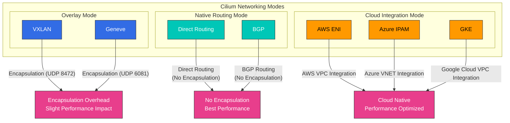
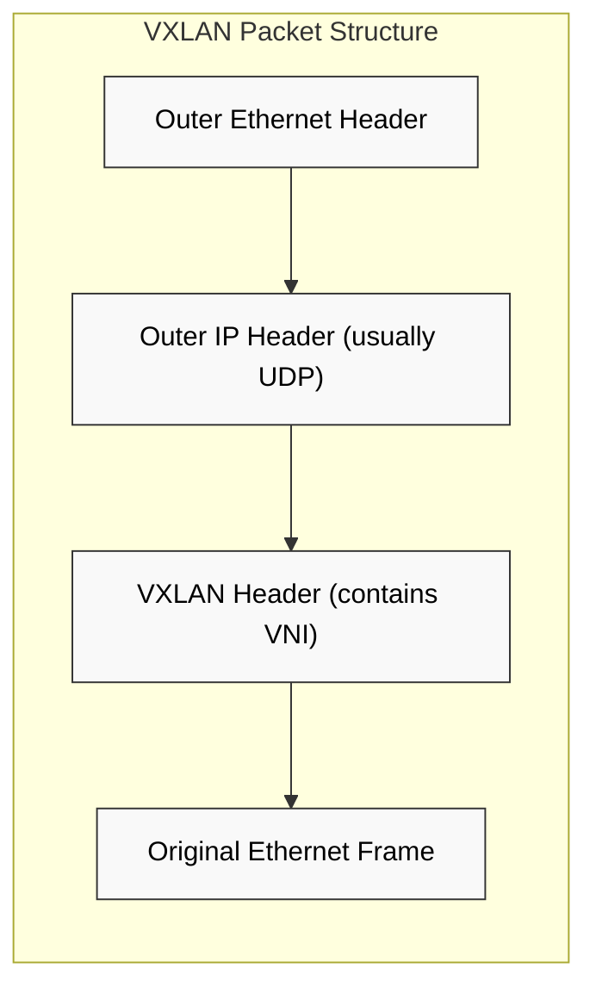
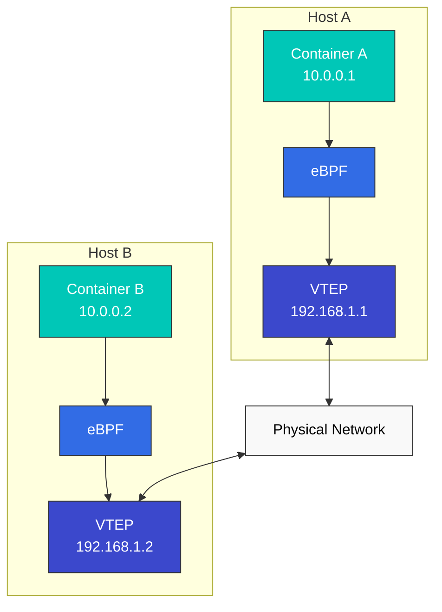

# ネットワーキングモデルと VXLAN

> **対応バージョン**: Cilium 1.18
> **最終更新**: February 22, 2026

## ラボ環境のセットアップ

このドキュメントの例を実行するには、以下のツールと環境が必要です。

### 必要なツール
- kubectl v1.31 以降
- 動作する Kubernetes クラスタ（EKS、minikube、kind など）
- Cilium CLI
- tcpdump、wireshark（ネットワークパケット解析用）

### ネットワーク解析ツールのインストール

```bash
# Install tcpdump
sudo apt-get update
sudo apt-get install -y tcpdump

# Cilium network packet capture
kubectl exec -n kube-system -it $(kubectl get pods -n kube-system -l k8s-app=cilium -o jsonpath='{.items[0].metadata.name}') -- cilium monitor -v

# VXLAN traffic analysis
sudo tcpdump -i any udp port 8472 -vv
```

## コンテナネットワーキングモデルの比較

コンテナネットワーキングモデルは、コンテナ同士の通信方法を定義します。各モデルには、パフォーマンス、スケーラビリティ、セキュリティ、実装の複雑さの観点で長所と短所があります。

### 主なネットワーキングモデル:

1. **Host Network Model**:
   - コンテナがホストのネットワーク名前空間を共有する
   - 最高のパフォーマンスを実現するが、ポート競合の可能性がある
   - セキュリティ分離が限定的

2. **Bridge Network Model**:
   - コンテナはホスト内の仮想ブリッジを介して接続する
   - 同一ホスト上のコンテナ間通信で効率的
   - ホスト間通信には追加の仕組みが必要

3. **Overlay Network Model**:
   - 物理ネットワークの上に仮想ネットワークを構築する
   - ホスト間通信にカプセル化を使用する
   - 柔軟性がある一方で、わずかなパフォーマンスオーバーヘッドがある

4. **Underlay Network Model**:
   - 物理ネットワークインフラストラクチャを直接利用する
   - 最小限のオーバーヘッドで最高のパフォーマンスを実現する
   - 物理ネットワーク設定に依存する

### ネットワーキングモデルの比較:

| モデル | パフォーマンス | スケーラビリティ | セキュリティ | 実装の複雑さ | ユースケース |
|-------|-------------|-------------|----------|---------------------------|-----------|
| Host | 非常に高い | 低い | 低い | 低い | 高パフォーマンスのワークロード、単一コンテナ |
| Bridge | 高い | 中程度 | 中程度 | 中程度 | 単一ホストのデプロイメント |
| Overlay | 中程度 | 高い | 高い | 高い | 複数ホストのクラスタ |
| Underlay | 高い | 中程度 | 中程度 | 非常に高い | パフォーマンス重視の本番環境 |

### Cilium ネットワーキングモード



## VXLAN テクノロジーの詳細

> **重要な概念**: VXLAN（Virtual Extensible LAN）は、Layer 3 ネットワーク上に Layer 2 ネットワークをオーバーレイするネットワーク仮想化技術です。

VXLAN は、Layer 3 ネットワーク上に Layer 2 ネットワークをオーバーレイするネットワーク仮想化技術です。クラウド環境でネットワークセグメント数を拡張し、マルチテナント環境をサポートするために広く使用されています。

### VXLAN の基本概念:

- **VXLAN Segment**: VXLAN Network Identifier（VNI）によって識別される論理 L2 セグメント
- **VXLAN Tunnel Endpoint (VTEP)**: VXLAN パケットのカプセル化とデカプセル化を担う
- **VNI (VXLAN Network Identifier)**: 最大 16,777,216（2^24）の一意なネットワークセグメントをサポート
- **Encapsulation**: 元の L2 フレームを UDP パケットにカプセル化する

### VXLAN パケット構造:

```
+-------------------------------+
| Outer Ethernet Header         |
+-------------------------------+
| Outer IP Header (usually IPv4)|
+-------------------------------+
| Outer UDP Header (port 8472)  |
+-------------------------------+
| VXLAN Header (contains VNI)   |
+-------------------------------+
| Original Ethernet Frame       |
| (Inner Ethernet Header +      |
|  Payload)                     |
+-------------------------------+
```

### Cilium VXLAN 設定例

```yaml
apiVersion: v1
kind: ConfigMap
metadata:
  name: cilium-config
  namespace: kube-system
data:
  tunnel: "vxlan"
  enable-ipv4: "true"
  enable-ipv6: "false"
  ipv4-range: "10.0.0.0/16"
  ipv4-service-range: "10.96.0.0/12"
```

この設定は、VXLAN トンネリングを使用してクラスタ内の Pod 間通信を設定するよう Cilium に指示します。各ノードは VTEP として動作し、Pod トラフィックを VXLAN パケットにカプセル化して他のノードへ送信します。



### VXLAN の仕組み:

1. **Encapsulation**: 送信元 VTEP が元の L2 フレームを VXLAN ヘッダーでカプセル化する
2. **Transmission**: カプセル化されたパケットが IP ネットワークを介して宛先 VTEP に送信される
3. **Decapsulation**: 宛先 VTEP が VXLAN ヘッダーを取り除き、元の L2 フレームを抽出する
4. **Delivery**: 元の L2 フレームが宛先エンドポイントに配信される

### VXLAN とその他の Overlay テクノロジーの比較:

| テクノロジー | カプセル化 | 最大ネットワーク数 | ポート | 利点 | 欠点 |
|------------|---------------|--------------|------|------------|---------------|
| VXLAN | L2 over UDP | 16,777,216 (2^24) | 4789 | 広くサポートされ、大規模なスケーラビリティ | オーバーヘッド（50 バイト） |
| GENEVE | 可変長ヘッダー | 16,777,216 (2^24) | 6081 | 拡張可能なメタデータ | 比較的新しく、サポートが限定的 |
| GRE | IP over IP | 無制限 | IP Protocol 47 | 低いオーバーヘッド | ファイアウォール通過の問題 |
| NVGRE | L2 over GRE | 16,777,216 (2^24) | IP Protocol 47 | Microsoft 環境との統合 | ハードウェアオフロードが限定的 |

## Cilium の Overlay ネットワーキング

Cilium はデフォルトで VXLAN を使用して Overlay ネットワーキングを実装しますが、Geneve などの他のカプセル化プロトコルもサポートしています。Cilium の Overlay ネットワーキングは eBPF を活用して最適化されたデータパスを提供します。

### Cilium Overlay ネットワークアーキテクチャ:



### Cilium Overlay ネットワーキングの仕組み:

1. **Packet Generation**: Container A が Container B にパケットを送信する
2. **eBPF Processing**: eBPF プログラムがパケットをインターセプトし、ポリシーを適用する
3. **VTEP Identification**: 宛先コンテナの VTEP を特定する
4. **Encapsulation**: パケットを VXLAN ヘッダーでカプセル化する
5. **Transmission**: カプセル化されたパケットを物理ネットワークを介して宛先ホストに送信する
6. **Decapsulation**: 宛先ホストで VXLAN ヘッダーを取り除く
7. **eBPF Processing**: 宛先ホスト上の eBPF プログラムがパケットを処理する
8. **Delivery**: パケットを宛先コンテナに配信する

### Cilium Overlay ネットワークの最適化:

- **Direct Path**: 可能な場合に直接ルーティングを使用する
- **DSR (Direct Server Return)**: ロードバランスされたレスポンスの最適化
- **Connection Tracking Bypass**: 既知の接続ではコネクショントラッキングをバイパスする
- **XDP Integration**: 早期パケット処理のために XDP を活用する
- **Header Push/Pop Optimization**: 効率的なヘッダー処理

### Cilium Overlay ネットワーク設定:

```yaml
# cilium-config.yaml
apiVersion: v1
kind: ConfigMap
metadata:
  name: cilium-config
  namespace: kube-system
data:
  # Enable overlay mode
  tunnel: "vxlan"

  # VXLAN port setting (default: 8472)
  tunnel-port: "8472"

  # MTU setting
  mtu: "1450"

  # Auto direct node routes
  auto-direct-node-routes: "true"
```

## パフォーマンス最適化手法

Cilium は、ネットワークレイテンシを最小化し、スループットを最大化するためのさまざまなパフォーマンス最適化手法を提供します。

### ネットワークモードの最適化:

1. **Direct Routing Mode**:
   - Overlay カプセル化なしで直接ルーティングを使用する
   - カプセル化オーバーヘッドを取り除くことでパフォーマンスを向上させる
   - ホスト間でルーティング可能なネットワークが必要

2. **Hybrid Mode**:
   - 可能な場合は直接ルーティングを使用し、それ以外では Overlay を使用する
   - 柔軟性とパフォーマンスのバランス

3. **Native Routing Mode**:
   - 既存のネットワークインフラストラクチャと統合する
   - BGP などのルーティングプロトコルを活用する

### データパスの最適化:

1. **XDP Utilization**:
   - ネットワークスタックの早期段階でパケットを処理する
   - 不要なパケットを早期に破棄することでパフォーマンスを向上させる

2. **eBPF Map Optimization**:
   - 効率的な Map 構造とサイズの調整
   - LRU（Least Recently Used）Map によるメモリ使用量の最適化

3. **Connection Tracking Optimization**:
   - コネクショントラッキングテーブルのサイズ調整
   - 既知の接続に対するコネクショントラッキングのバイパス

4. **Socket-based Load Balancing**:
   - ソケットレベルでのロードバランシング
   - パケット処理オーバーヘッドの削減

### システムレベルの最適化:

1. **CPU Affinity**:
   - ネットワーク処理を特定の CPU コアにバインドする
   - キャッシュ局所性の向上とコンテキストスイッチングの削減

2. **NUMA Awareness**:
   - NUMA（Non-Uniform Memory Access）トポロジーの認識
   - ローカルメモリアクセスの最適化

3. **Interrupt Tuning**:
   - ネットワーク割り込み処理の最適化
   - 割り込みの集約と分散

4. **Huge Pages**:
   - メモリ管理オーバーヘッドの削減
   - TLB（Translation Lookaside Buffer）ミスの削減

## ルーティングメカニズム

Cilium は、Encapsulation と Native-Routing という 2 つの主要なルーティングメカニズムをサポートしています。

### 1. Encapsulation

Encapsulation は、元のパケットを別のパケットでラップして送信する方法です。Cilium は VXLAN や Geneve などのカプセル化プロトコルをサポートしています。

**仕組み**:
1. 送信元ノードでパケットが生成される。
2. Cilium が元のパケットをカプセル化ヘッダーでラップしてカプセル化する。
3. カプセル化されたパケットが物理ネットワークを介して宛先ノードに送信される。
4. 宛先ノードで、Cilium がパケットをデカプセル化して元のパケットを抽出する。
5. 抽出されたパケットが宛先コンテナに配信される。

**利点**:
- 既存のネットワークインフラストラクチャとの互換性
- ネットワークトポロジーからの独立性
- マルチクラスタ環境における IP 競合の防止

**欠点**:
- カプセル化オーバーヘッドによるパフォーマンスへの影響
- MTU サイズの縮小
- 追加の CPU 使用量

### 2. Native-Routing

Native routing は、カプセル化なしで直接ルーティングを使用する方法です。このモードでは、基盤となるネットワークインフラストラクチャが Pod IP アドレスをルーティングできる必要があります。

**仕組み**:
1. 各ノードが、そのノードで実行されている Pod の CIDR ブロックをアドバタイズする。
2. 各 Pod CIDR ブロックを対応するノードにルーティングするよう、ルーティングテーブルが設定される。
3. パケットはカプセル化なしで宛先ノードに直接ルーティングされる。

**利点**:
- カプセル化オーバーヘッドがない
- ネットワークパフォーマンスの向上
- CPU 使用量の低減

**欠点**:
- 基盤となるネットワークインフラストラクチャへの依存
- ネットワークトポロジーの制約
- IP アドレス管理の複雑さ

## クラウドプロバイダー固有のネットワーキング

Cilium は、さまざまなクラウドプロバイダーのネットワーキング機能と統合します。

### 1. AWS ENI (Elastic Network Interface)

AWS ENI モードでは、Cilium は AWS Elastic Network Interfaces を使用して Pod にネイティブ VPC IP アドレスを割り当てます。

**主な機能**:
- Pod へのネイティブ VPC IP アドレス割り当て
- Overlay ネットワークを使用しない VPC ネイティブネットワーキング
- AWS security group および network policy との統合
- ネットワークパフォーマンスの向上

### 2. Google Cloud ネットワーキング

Google Kubernetes Engine（GKE）では、Cilium は Google Cloud のネットワーキング機能と統合します。

**主な機能**:
- GCP VPC ネイティブ IP アドレス割り当て
- GCP firewall rules との統合
- GKE ネットワーキングの最適化

## ラボ: Cilium ネットワーキングモードの設定とパフォーマンステスト

### さまざまなネットワーキングモードの設定:

```bash
# VXLAN overlay mode configuration
cilium install --config tunnel=vxlan

# Geneve overlay mode configuration
cilium install --config tunnel=geneve

# Direct routing mode configuration
cilium install --config tunnel=disabled --config auto-direct-node-routes=true

# Hybrid mode configuration
cilium install --config tunnel=vxlan --config auto-direct-node-routes=true
```

### ネットワークパフォーマンステスト:

```bash
# Deploy test pods
kubectl apply -f https://raw.githubusercontent.com/cilium/cilium/master/examples/kubernetes/connectivity-check/connectivity-check.yaml

# Latency test
kubectl exec -it pod/netperf-client -- netperf -H netperf-server -t TCP_RR

# Throughput test
kubectl exec -it pod/netperf-client -- netperf -H netperf-server -t TCP_STREAM

# Connection establishment speed test
kubectl exec -it pod/netperf-client -- netperf -H netperf-server -t TCP_CRR
```

[メインページに戻る](README.md)

## クイズ

この章で学んだ内容を確認するには、[トピッククイズ](../../quizzes/networking/cilium/03-networking-quiz.md)に挑戦してください。
