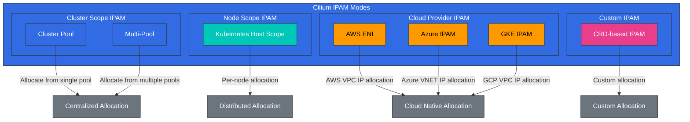

# IPAM と Network Policy

> **対応バージョン**: Cilium 1.18
> **最終更新**: February 23, 2026

## Lab 環境のセットアップ

このドキュメントの例に沿って進めるには、次のツールと環境が必要です。

### 必要なツール
- kubectl v1.31 以降
- 動作する Kubernetes cluster（EKS、minikube、kind など）
- Cilium CLI

### IPAM と Network Policy Lab のセットアップ

```bash
# Check Cilium status
cilium status --wait

# Check current IPAM configuration
kubectl -n kube-system get configmap cilium-config -o yaml | grep -E 'ipam|allocator'

# Create namespace for network policy testing
kubectl create namespace policy-test

# Deploy test application
kubectl -n policy-test apply -f https://raw.githubusercontent.com/cilium/cilium/v1.14/examples/minikube/http-sw-app.yaml
```

## IP Address Management（IPAM）戦略

> **重要な概念**: IPAM（IP Address Management）は、IP address の割り当て、追跡、管理を担うシステムです。

IPAM は、IP address の割り当て、追跡、管理を担うシステムです。Cilium は、さまざまな環境や要件に柔軟に対応できる複数の IPAM mode をサポートします。

### Cilium IPAM アーキテクチャ



### Cilium IPAM mode:

1. **Cluster Pool**:
   - デフォルトの IPAM mode
   - cluster 全体にわたる集中型の IP address 割り当て
   - 単一または複数の IP pool を設定可能
   - シンプルで使いやすい

2. **Kubernetes Host Scope**:
   - 各 node に IP address range を割り当てる
   - node は自身の range から IP address を割り当てる
   - 中央での調整は不要
   - node 間の IP conflict を防止する

3. **CRD-based IPAM**:
   - CiliumIPPool custom resource による IP pool 定義
   - 特定の namespace または Pod に IP pool を割り当てる
   - きめ細かな IP address 管理
   - 動的な IP pool 管理

4. **AWS ENI (Elastic Network Interface)**:
   - AWS VPC ENI との統合
   - Pod にネイティブ VPC IP address を割り当てる
   - overlay network を使用しない VPC ネイティブネットワーキング
   - AWS 環境向けに最適化

5. **Azure IPAM**:
   - Azure VNET との統合
   - Pod にネイティブ VNET IP address を割り当てる
   - Azure 環境向けに最適化

### IPAM コンポーネント:

- **IP Pool**: 割り当て可能な IP address の範囲
- **IP Allocation**: Endpoint への IP address の割り当て
- **IP Release**: 未使用の IP address の再利用
- **IP Conflict Detection**: IP address conflict の防止
- **IP Reservation**: 特定の目的のための IP address の予約

### IPAM の考慮事項:

- **Address Space Size**: 必要な IP address の数
- **Network Segmentation**: subnet と CIDR block の設計
- **Scalability**: 将来の成長を考慮すること

### IPAM 設定例

Cluster Pool IPAM 設定:
```yaml
apiVersion: v1
kind: ConfigMap
metadata:
  name: cilium-config
  namespace: kube-system
data:
  ipam: "cluster-pool"
  cluster-pool-ipv4-cidr: "10.0.0.0/16"
  cluster-pool-ipv4-mask-size: "24"
  enable-ipv4: "true"
  enable-ipv6: "false"
```

AWS ENI IPAM 設定:
```yaml
apiVersion: v1
kind: ConfigMap
metadata:
  name: cilium-config
  namespace: kube-system
data:
  ipam: "eni"
  enable-ipv4: "true"
  enable-ipv6: "false"
  eni-tags: "{\"cluster\": \"eks-cluster\"}"
  ec2-api-endpoint: "ec2.us-west-2.amazonaws.com"
```
- **Cloud Integration**: cloud provider networking との統合
- **IPv4 vs IPv6**: single stack または dual stack の設定

## Kubernetes と Cilium IPAM の統合

Cilium は Kubernetes と緊密に統合され、Pod と Service の IP address を割り当てて管理します。

### Kubernetes IPAM 統合フロー:

1. **Pod Creation**: Kubernetes が Pod 作成を要求する
2. **CNI Call**: kubelet が Cilium CNI plugin を呼び出す
3. **IP Allocation Request**: Cilium が IPAM module に IP address を要求する
4. **IP Allocation**: IPAM が利用可能な IP address を割り当てる
5. **Network Setup**: Cilium が Pod の network namespace を設定する
6. **State Storage**: IP allocation 情報を保存する
7. **Pod Start**: 設定済み network で Pod が起動する

### Cilium Cluster Pool 設定:

```yaml
# cilium-config.yaml
apiVersion: v1
kind: ConfigMap
metadata:
  name: cilium-config
  namespace: kube-system
data:
  # Cluster pool IPAM mode
  ipam: "cluster-pool"

  # IPv4 CIDR range
  cluster-pool-ipv4-cidr: "10.0.0.0/8"
  cluster-pool-ipv4-mask-size: "24"

  # IPv6 CIDR range (optional)
  cluster-pool-ipv6-cidr: "fd00::/104"
  cluster-pool-ipv6-mask-size: "120"

  # Enable dual stack
  enable-ipv4: "true"
  enable-ipv6: "true"
```

### CRD-based IPAM の例:

```yaml
# cilium-ippool.yaml
apiVersion: "cilium.io/v2alpha1"
kind: CiliumIPPool
metadata:
  name: "production-pool"
spec:
  ipv4:
    cidr: "10.10.0.0/16"
    blockSize: 27  # 32 IP address blocks
  selector:
    matchLabels:
      environment: production
```

### AWS ENI IPAM 設定:

```yaml
# cilium-aws-config.yaml
apiVersion: v1
kind: ConfigMap
metadata:
  name: cilium-config
  namespace: kube-system
data:
  # AWS ENI IPAM mode
  ipam: "eni"

  # AWS ENI configuration
  enable-endpoint-routes: "true"
  auto-create-cilium-node-resource: "true"

  # ENI tags (optional)
  eni-tags: "{\"team\": \"platform\"}"

  # Prefix delegation (optional)
  enable-prefix-delegation: "true"
  eni-prefix-delegation-enabled: "true"
```

## IPAM mode の詳細

### 1. Cluster Scope - デフォルト mode

Cluster Scope IPAM は Cilium のデフォルト IPAM mode であり、cluster 全体にわたって IP address を集中管理で割り当てます。

**主な機能**:
- 集中型の IP address 割り当て
- cluster 全体で IP address の一意性を保証
- 単一または複数の IP pool を設定可能
- シンプルで使いやすい

**仕組み**:
1. Cilium agent が cluster 全体の IP pool から IP address を割り当てます。
2. 割り当てられた IP address は Kubernetes CRD に保存されます。
3. IP address の割り当て情報は cluster 内のすべての node で共有されます。

### 2. Kubernetes Host Scope

Kubernetes Host Scope IPAM は各 node に IP address range を割り当て、node は自身の range から IP address を割り当てます。

**主な機能**:
- node 単位の IP address range 割り当て
- 中央での調整は不要
- node 間の IP conflict を防止
- scalability の向上

**仕組み**:
1. Kubernetes が各 node に PodCIDR を割り当てます。
2. Cilium が node の PodCIDR から IP address を割り当てます。
3. 各 node は自身の IP address range を独立して管理します。

### 3. Multi-Pool - Beta

Multi-Pool IPAM では、複数の IP pool を定義し、特定の workload に特定の pool を割り当てることができます。

**主な機能**:
- 複数の IP pool を定義および管理
- namespace、Pod、または node ごとに IP pool を割り当て
- きめ細かな IP address 管理
- 多様な network 要件をサポート

**仕組み**:
1. CiliumIPPool CRD を使用して複数の IP pool を定義します。
2. selector を使用して、特定の workload に特定の pool を割り当てます。
3. Cilium は定義された rule に従って、適切な pool から IP address を割り当てます。

### 4. Azure IPAM

Azure IPAM は Azure VNET と統合し、Pod にネイティブ VNET IP address を割り当てます。

**主な機能**:
- Azure VNET ネイティブ IP address の割り当て
- Azure network security group との統合
- Azure networking の最適化

### 5. Azure Delegated IPAM

Azure Delegated IPAM は、IP address 管理を Azure CNI に委譲する mode です。

**主な機能**:
- Azure CNI との統合
- Azure 管理の IP address 割り当て
- Azure networking 機能を活用

### 6. CRD-based IPAM

CRD-based IPAM は Kubernetes CRD を使用して IP address の割り当てを管理します。

**主な機能**:
- Kubernetes CRD による IP address 管理
- 宣言的な IP address 割り当て
- Kubernetes ネイティブ workflow との統合

**仕組み**:
1. IP address pool 情報は CiliumNode CRD に保存されます。
2. Cilium agent が CRD から IP address の割り当て情報を読み取ります。
3. IP address の割り当て状態は CRD で更新されます。

## CiliumNode CR を使用した node ごとの PodCIDR の照会

Cilium の `cluster-pool` IPAM mode では、各 node の Pod CIDR 割り当て情報は **CiliumNode CR** に記録されます。この CR は、static route 設定、IPAM debugging、network troubleshooting の信頼できる情報源として機能します。

> **注記**: Kubernetes Node object の `spec.podCIDR` は、CiliumNode CR の `spec.ipam.podCIDRs` と異なる場合があります。Cilium 環境では、常に CiliumNode CR を信頼できる情報源として使用してください。

### CiliumNode CR の構造（主要フィールド）

```yaml
apiVersion: cilium.io/v2
kind: CiliumNode
metadata:
  name: hybrid-node-001
spec:
  addresses:
  - ip: 10.80.1.10        # Node IP (used as next hop for static routes)
    type: InternalIP
  ipam:
    podCIDRs:
    - 10.85.0.0/25         # Pod CIDR allocated to this node
```

- **`spec.addresses[].ip`**: node の実際の IP address。static route を設定する際の next hop として使用されます。
- **`spec.ipam.podCIDRs`**: Cilium Operator がこの node に割り当てた Pod CIDR のリスト。

### 照会コマンド

```bash
# List all CiliumNodes
kubectl get ciliumnodes

# Query node IP and PodCIDR in table format
kubectl get ciliumnodes -o custom-columns='\
NAME:.metadata.name,\
NODE_IP:.spec.addresses[0].ip,\
POD_CIDR:.spec.ipam.podCIDRs[0]'
```

出力例:

```
NAME                NODE_IP       POD_CIDR
hybrid-node-001     10.80.1.10    10.85.0.0/25
hybrid-node-002     10.80.1.11    10.85.0.128/25
hybrid-node-003     10.80.1.12    10.85.1.0/25
```

### Script での使用方法

```bash
# Extract routing table information using jq
kubectl get ciliumnodes -o json | jq -r \
  '.items[] | "\(.metadata.name)\t\(.spec.addresses[0].ip)\t\(.spec.ipam.podCIDRs[0])"'

# Auto-generate static route commands (useful for EKS Hybrid Nodes, etc.)
kubectl get ciliumnodes -o json | jq -r \
  '.items[] | "ip route add \(.spec.ipam.podCIDRs[0]) via \(.spec.addresses[0].ip)"'
```

> **ユースケース**: この情報は、EKS Hybrid Nodes 環境で BGP を使用せずに static route を設定するために使用されます。詳細は、[EKS Hybrid Nodes - Network Configuration](../../eks-hybrid-nodes/02-network-configuration.md) を参照してください。

## Network Policy の設計と実装

Cilium Network Policy は、L3-L7 layer で microservice 間の通信を制御する強力なメカニズムを提供します。これらの policy は Kubernetes NetworkPolicy API を拡張し、よりきめ細かな制御を可能にします。

### Network Policy の基本概念:

- **Endpoint Selector**: policy を適用する Endpoint を定義
- **Ingress Rules**: 受信 traffic を制御
- **Egress Rules**: 送信 traffic を制御
- **L3/L4 Policy**: IP address と port に基づく filtering
- **L7 Policy**: application layer protocol を認識する filtering

### L3/L4 Network Policy の例:

```yaml
# l3-l4-policy.yaml
apiVersion: "cilium.io/v2"
kind: CiliumNetworkPolicy
metadata:
  name: "l3-l4-policy"
spec:
  endpointSelector:
    matchLabels:
      app: backend
  ingress:
  - fromEndpoints:
    - matchLabels:
        app: frontend
    toPorts:
    - ports:
      - port: "8080"
        protocol: TCP
  egress:
  - toEndpoints:
    - matchLabels:
        app: database
    toPorts:
    - ports:
      - port: "3306"
        protocol: TCP
```

### L7 HTTP Policy の例:

```yaml
# l7-http-policy.yaml
apiVersion: "cilium.io/v2"
kind: CiliumNetworkPolicy
metadata:
  name: "l7-http-policy"
spec:
  endpointSelector:
    matchLabels:
      app: backend
  ingress:
  - fromEndpoints:
    - matchLabels:
        app: frontend
    toPorts:
    - ports:
      - port: "8080"
        protocol: TCP
      rules:
        http:
        - method: "GET"
          path: "/api/v1/users"
        - method: "POST"
          path: "/api/v1/users"
          headers:
          - "Content-Type: application/json"
```

### L7 Kafka Policy の例:

```yaml
# l7-kafka-policy.yaml
apiVersion: "cilium.io/v2"
kind: CiliumNetworkPolicy
metadata:
  name: "l7-kafka-policy"
spec:
  endpointSelector:
    matchLabels:
      app: kafka-broker
  ingress:
  - fromEndpoints:
    - matchLabels:
        app: kafka-client
    toPorts:
    - ports:
      - port: "9092"
        protocol: TCP
      rules:
        kafka:
        - apiKey: "Produce"
          topic: "allowed-topic-1"
        - apiKey: "Fetch"
          topic: "allowed-topic-1"
        - apiKey: "CreateTopics"
          topic: "allowed-topic-.*"
          apiVersions: ["0", "1"]
```

### DNS-based Policy の例:

```yaml
# dns-policy.yaml
apiVersion: "cilium.io/v2"
kind: CiliumNetworkPolicy
metadata:
  name: "dns-policy"
spec:
  endpointSelector:
    matchLabels:
      app: client
  egress:
  - toEndpoints:
    - matchLabels:
        "k8s:io.kubernetes.pod.namespace": kube-system
        "k8s:k8s-app": kube-dns
    toPorts:
    - ports:
      - port: "53"
        protocol: UDP
      - port: "53"
        protocol: TCP
  - toFQDNs:
    - matchName: "api.example.com"
    - matchPattern: "*.googleapis.com"
    toPorts:
    - ports:
      - port: "443"
        protocol: TCP
```

### Network Policy のベストプラクティス:

1. **Default Deny Policy を適用する**:
   - 明示的に許可されていないすべての traffic を block する
   - least privilege principle を適用する

2. **段階的なアプローチ**:
   - observation mode で開始して影響を評価する
   - policy を段階的に適用して強化する

3. **label ベースの selector を使用する**:
   - IP address ではなく label ベースの selector を使用する
   - 動的な環境で柔軟性を提供する

4. **Policy の階層化**:
   - 基本 policy と特定の policy を組み合わせる
   - 関心の分離と保守性を確保する

5. **Policy のテストと検証**:
   - policy 適用前にテストする
   - 継続的な policy の検証と monitoring を行う

## Multi-cluster シナリオ

Cilium は、複数の Kubernetes cluster にまたがる networking と security のための強力な機能を提供します。これにより、cross-cluster Service 通信、Network Policy の適用、load balancing が可能になります。

### Multi-cluster 接続モデル:

1. **Global Services**:
   - 複数の cluster にわたって Service を公開する
   - cross-cluster load balancing
   - 自動 failover と high availability

2. **Cluster Mesh**:
   - cluster 間の直接接続
   - cross-cluster Network Policy
   - 統合された observability

3. **Remote Nodes**:
   - remote cluster の node を local として表示する
   - cluster 間の透過的な通信
   - 単一 network namespace のシミュレーション

### Cilium Cluster Mesh アーキテクチャ:

```
+-------------------+        +-------------------+
| Cluster A         |        | Cluster B         |
|                   |        |                   |
| +---------------+ |        | +---------------+ |
| | Service A     | |        | | Service B     | |
| | (Global)      | |        | | (Global)      | |
| +-------+-------+ |        | +-------+-------+ |
|         |         |        |         |         |
|     +---v---+     |        |     +---v---+     |
|     | eBPF  |     |        |     | eBPF  |     |
|     +---+---+     |        |     +---+---+     |
|         |         |        |         |         |
| +-------v-------+ |        | +-------v-------+ |
| | Cilium        | |<------>| | Cilium        | |
| | Clustermesh   | |        | | Clustermesh   | |
| +---------------+ |        | +---------------+ |
|                   |        |                   |
+-------------------+        +-------------------+
```

### Cilium Cluster Mesh のセットアップ:

```bash
# Enable Cluster Mesh on Cluster A
cilium clustermesh enable --context cluster-a

# Enable Cluster Mesh on Cluster B
cilium clustermesh enable --context cluster-b

# Connect clusters
cilium clustermesh connect --context cluster-a --destination-context cluster-b

# Check status
cilium clustermesh status --context cluster-a
```

### Global Service の定義:

```yaml
# global-service.yaml
apiVersion: v1
kind: Service
metadata:
  name: global-service
  annotations:
    io.cilium/global-service: "true"
spec:
  selector:
    app: global-app
  ports:
  - port: 80
    targetPort: 8080
  type: ClusterIP
```

### Cross-cluster Network Policy:

```yaml
# cross-cluster-policy.yaml
apiVersion: "cilium.io/v2"
kind: CiliumNetworkPolicy
metadata:
  name: "cross-cluster-policy"
spec:
  endpointSelector:
    matchLabels:
      app: backend
  ingress:
  - fromEndpoints:
    - matchLabels:
        app: frontend
        io.kubernetes.pod.namespace: frontend-ns
        io.cilium.k8s.policy.cluster: cluster-a
    toPorts:
    - ports:
      - port: "8080"
        protocol: TCP
```

[メインページに戻る](README.md)

## クイズ

この章で学んだ内容を確認するには、[トピッククイズ](../../quizzes/networking/cilium/04-ipam-policy-quiz.md) に挑戦してください。
