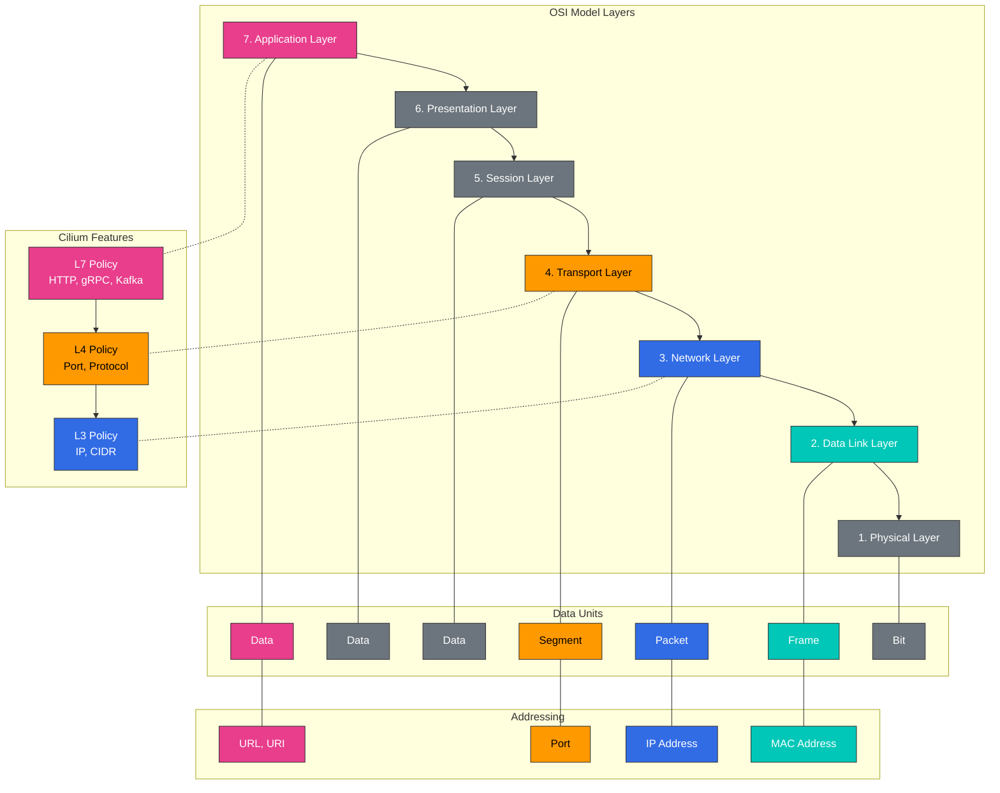

# L2-L7 ネットワーキングとロードバランシング

> **サポート対象バージョン**: Cilium 1.18
> **最終更新**: February 22, 2026

## ラボ環境のセットアップ

このドキュメントの例に沿って進めるには、以下のツールと環境が必要です。

### 必要なツール
- kubectl v1.31 以降
- 動作する Kubernetes クラスター（EKS、minikube、kind など）
- Cilium CLI
- curl、jq（API テスト用）

### L7 Policy テスト環境のセットアップ

```bash
# Create test namespace
kubectl create namespace l7-test

# Deploy sample application
kubectl -n l7-test apply -f https://raw.githubusercontent.com/cilium/cilium/v1.14/examples/kubernetes/l7-policy/l7-application.yaml

# Verify deployment
kubectl -n l7-test get pods,svc

# Deploy test client
kubectl -n l7-test run client --image=curlimages/curl --restart=Never -- sleep 3600

# Basic connectivity test
kubectl -n l7-test exec client -- curl -s app1-service/public
```

## OSI モデルのレイヤー（L2、L3、L4、L7）を理解する

> **重要な概念**: OSI（Open Systems Interconnection）モデルは、ネットワーク通信を 7 つの抽象化レイヤーに分類する概念モデルです。

OSI モデルは、ネットワーク通信を 7 つの抽象化レイヤーに分類する概念モデルです。Cilium は、これらのさまざまなレイヤーでネットワーキングとセキュリティ機能を提供します。

### OSI モデルのレイヤー図



### OSI モデルのレイヤー:

1. **物理レイヤー（L1）**:
   - ビット伝送のための物理媒体
   - 電気的、機械的、機能的特性を定義
   - 例: ケーブル、スイッチ、リピーター

2. **データリンクレイヤー（L2）**:
   - 物理アドレッシング（MAC アドレス）
   - フレーム形式とフロー制御
   - 例: Ethernet、スイッチ、ブリッジ

3. **ネットワークレイヤー（L3）**:
   - 論理アドレッシング（IP アドレス）
   - パケットルーティングと転送
   - 例: IP、ルーター、ICMP

4. **トランスポートレイヤー（L4）**:
   - エンドツーエンド接続と信頼性
   - Port ベースのアドレッシング
   - 例: TCP、UDP、Port

5. **セッションレイヤー（L5）**:
   - セッションの確立、管理、終了
   - ダイアログ制御と同期
   - 例: NetBIOS、RPC

6. **プレゼンテーションレイヤー（L6）**:
   - データ形式の変換と暗号化
   - データ圧縮とエンコーディング
   - 例: SSL/TLS、JPEG、ASCII

7. **アプリケーションレイヤー（L7）**:
   - ユーザーインターフェースとアプリケーションサービス
   - プロトコルと API
   - 例: HTTP、DNS、FTP、gRPC

### 各レイヤーの主な特性:

| レイヤー | アドレッシング | 単位 | デバイス/プロトコル | Cilium 機能 |
|-------|------------|------|-----------------|----------------|
| L2 | MAC アドレス | フレーム | スイッチ、ブリッジ | ARP 処理、MAC フィルタリング |
| L3 | IP アドレス | パケット | ルーター、IP | IP ルーティング、CIDR ベースの Policy |
| L4 | Port | セグメント | TCP、UDP | Port ベースのフィルタリング、接続追跡 |
| L7 | URL、Method | メッセージ | HTTP、gRPC、Kafka | API 対応フィルタリング、header ベースのルーティング |

### L7 Policy の例

以下は、HTTP Method とパスに基づいてトラフィックをフィルタリングする Cilium L7 Policy の例です。

```yaml
apiVersion: cilium.io/v2
kind: CiliumNetworkPolicy
metadata:
  name: l7-policy
  namespace: l7-test
spec:
  endpointSelector:
    matchLabels:
      app: app1
  ingress:
  - fromEndpoints:
    - matchLabels:
        app: client
    toPorts:
    - ports:
      - port: "80"
        protocol: TCP
      rules:
        http:
        - method: "GET"
          path: "/public"
        - method: "POST"
          path: "/api/v1"
          headers:
          - "X-Auth-Token: ^[a-zA-Z0-9]{32}$"
```

この Policy は以下を許可します:
1. `/public` パスへの GET リクエスト
2. `/api/v1` パスへの POST リクエスト（有効な X-Auth-Token header を含む）

その他すべてのリクエストはブロックされます。
| L7 | URI、Method | メッセージ | HTTP、gRPC、Kafka | API 対応フィルタリング、header 検査 |

## Cilium のレイヤー固有機能

Cilium は L2 から L7 までのさまざまなネットワークレイヤーで機能を提供し、包括的なネットワーキングおよびセキュリティソリューションを実現します。

### L2（データリンクレイヤー）機能:

- **ARP 処理**: Address Resolution Protocol の処理
- **MAC アドレスフィルタリング**: MAC アドレスベースのフィルタリング
- **VLAN タギング**: Virtual LAN タグの処理
- **ブリッジモード**: L2 ブリッジモードのサポート
- **プロミスキャスモード**: すべてのトラフィックをキャプチャ

### L3（ネットワークレイヤー）機能:

- **IP ルーティング**: IP パケットのルーティング
- **CIDR ベースの Policy**: IP アドレス範囲ベースのフィルタリング
- **IP フラグメンテーション**: IP パケットフラグメントの処理
- **ICMP 処理**: ICMP メッセージの処理
- **マルチキャスト**: IP マルチキャストのサポート

### L4（トランスポートレイヤー）機能:

- **Port ベースのフィルタリング**: TCP/UDP Port ベースのフィルタリング
- **接続追跡**: 接続状態の追跡
- **TCP Option 処理**: TCP Option とフラグの処理
- **Socket ベースのロードバランシング**: Socket レベルのロードバランシング
- **セッションアフィニティ**: 永続的なセッションの維持

### L7（アプリケーションレイヤー）機能:

- **HTTP フィルタリング**: HTTP Method、パス、header ベースのフィルタリング
- **gRPC フィルタリング**: gRPC Method とメタデータベースのフィルタリング
- **Kafka フィルタリング**: Kafka トピックと操作ベースのフィルタリング
- **DNS フィルタリング**: DNS クエリとレスポンスベースのフィルタリング
- **TLS インスペクション**: TLS 証明書と SNI ベースのフィルタリング

### クロスレイヤー統合:

Cilium はさまざまなレイヤーにわたる機能を統合し、包括的なネットワーキングおよびセキュリティソリューションを提供します:

- **L3/L4 + L7 Policy**: IP/Port ベースのフィルタリングとアプリケーションレイヤーフィルタリングを組み合わせる
- **マルチプロトコルサポート**: HTTP、gRPC、Kafka などのさまざまなプロトコルをサポート
- **階層型 Policy 適用**: さまざまなレイヤーで Policy を適用
- **統合 Observability**: 全レイヤーにわたるトラフィックの監視と可視化

## Service Mesh 統合

Cilium は Istio などの Service Mesh と統合し、マイクロサービスアーキテクチャ向けに強力なネットワーキング、セキュリティ、Observability ソリューションを提供します。

### Cilium-Istio 統合アーキテクチャ:

```
+-------------------+
| Service Mesh      |
| Control Plane     |
| (Istio Pilot)     |
+--------+----------+
         |
         v
+-------------------+
| Envoy Proxy       |
| (Sidecar)         |
+--------+----------+
         |
         v
+-------------------+
| Cilium eBPF       |
| (Data Plane)      |
+-------------------+
```

### Cilium-Istio 統合の利点:

1. **パフォーマンスの向上**:
   - Envoy Sidecar のバイパスによるレイテンシー削減
   - eBPF ベースの最適化されたデータパス

2. **セキュリティの強化**:
   - Kernel レベルの Policy 適用
   - L3-L7 セキュリティ Policy の統合

3. **Observability の向上**:
   - 統合された監視とトレーシング
   - ネットワークフローの可視性

4. **運用の簡素化**:
   - 一貫したネットワーキングおよびセキュリティモデル
   - 冗長な機能の排除

### Cilium-Istio のセットアップ:

```bash
# Cilium installation (with Istio integration enabled)
cilium install --config enable-envoy-config=true --config enable-l7-proxy=true

# Istio installation
istioctl install --set profile=default

# Enable Istio sidecar auto-injection
kubectl label namespace default istio-injection=enabled

# Verify Cilium-Istio integration
cilium status --verbose
```

### Istio Virtual Service と Cilium Policy の組み合わせ:

```yaml
# istio-virtual-service.yaml
apiVersion: networking.istio.io/v1alpha3
kind: VirtualService
metadata:
  name: reviews-route
spec:
  hosts:
  - reviews
  http:
  - match:
    - headers:
        end-user:
          exact: jason
    route:
    - destination:
        host: reviews
        subset: v2
  - route:
    - destination:
        host: reviews
        subset: v1
---
# cilium-l7-policy.yaml
apiVersion: "cilium.io/v2"
kind: CiliumNetworkPolicy
metadata:
  name: "reviews-policy"
spec:
  endpointSelector:
    matchLabels:
      app: reviews
  ingress:
  - fromEndpoints:
    - matchLabels:
        app: productpage
    toPorts:
    - ports:
      - port: "9080"
        protocol: TCP
      rules:
        http:
        - method: "GET"
          path: "/reviews/.*"
```

## ロードバランシングアーキテクチャ

Cilium は eBPF を活用して、効率的かつスケーラブルなロードバランシングソリューションを提供します。これは Kubernetes Service の kube-proxy 置き換えとして動作できます。

### Cilium ロードバランシングモード:

1. **DSR（Direct Server Return）モード**:
   - レスポンストラフィックはロードバランサーをバイパスして直接クライアントへ送信される
   - ロードバランサーのボトルネックを排除
   - 大きなレスポンスの処理に最適化

2. **SNAT（Source Network Address Translation）モード**:
   - 送信元 IP アドレスをロードバランサーの IP に変換
   - クライアント IP を保持する必要がない場合に有用
   - 既存の kube-proxy と同様の動作

3. **ハイブリッドモード**:
   - 状況に応じて DSR または SNAT モードを使用
   - 柔軟性とパフォーマンスのバランス

### Cilium ロードバランシングコンポーネント:

- **Service Map**: Service IP:Port からバックエンド Pod へのマッピング
- **Backend Map**: バックエンド Pod 情報の保存
- **Reverse NAT Map**: 接続追跡とレスポンス処理
- **Socket LB**: Socket レベルでのロードバランシング
- **XDP Acceleration**: 早期パケット処理の高速化

### Cilium と kube-proxy の比較:

| 機能 | Cilium | kube-proxy |
|---------|--------|------------|
| 実装 | eBPF | iptables/IPVS |
| パフォーマンス | 高 | 中/低 |
| スケーラビリティ | 高 | 中 |
| 接続追跡 | 任意 | 常に有効 |
| DSR サポート | ネイティブサポート | 限定的（IPVS モードのみ） |
| Socket レベル LB | サポート | 非サポート |
| L7 認識 | サポート | 非サポート |
| Observability | 高 | 限定的 |

### Cilium ロードバランシング設定:

```yaml
# cilium-config.yaml
apiVersion: v1
kind: ConfigMap
metadata:
  name: cilium-config
  namespace: kube-system
data:
  # Enable kube-proxy replacement
  kube-proxy-replacement: "strict"

  # Enable DSR mode
  enable-dsr: "true"

  # External service load balancing
  enable-external-ips: "true"

  # NodePort acceleration
  enable-node-port: "true"

  # XDP acceleration
  enable-xdp-acceleration: "true"
```

## マスカレーディング

マスカレーディングは、外部ネットワークと通信する際に、内部ネットワークの IP アドレスを別の IP アドレスに変換するプロセスです。Cilium はさまざまなマスカレーディング設定と実装モードをサポートしています。

### 1. マスカレーディング設定

Cilium では、マスカレーディングは以下の目的で使用されます:
- クラスター内部 IP アドレスを外部ネットワークから隠す
- クラスター外部の Service へのアクセスを提供する
- Network Address Translation（NAT）を実装する

**設定オプション**:
- `enable-ipv4-masquerade`: IPv4 マスカレーディングの有効化/無効化
- `enable-ipv6-masquerade`: IPv6 マスカレーディングの有効化/無効化
- `masquerade-all`: すべてのトラフィックでマスカレーディングを有効化
- `masquerade-interfaces`: マスカレーディングを適用するインターフェースを指定

**設定例**:
```yaml
# cilium-masquerade-config.yaml
apiVersion: v1
kind: ConfigMap
metadata:
  name: cilium-config
  namespace: kube-system
data:
  enable-ipv4-masquerade: "true"
  enable-ipv6-masquerade: "false"
  masquerade-all: "false"
  ipv4-native-routing-cidr: "10.0.0.0/8"
```

### 2. 実装モード

Cilium は、iptables ベースと eBPF ベースの 2 つのマスカレーディング実装モードをサポートしています。

**iptables ベースのマスカレーディング**:
- 従来の iptables ルールを使用してマスカレーディングを実装
- すべての Linux ディストリビューションと互換性あり
- 大規模環境ではパフォーマンスの制約あり

**eBPF ベースのマスカレーディング**:
- eBPF プログラムを使用してマスカレーディングを実装
- パフォーマンスとスケーラビリティを向上
- 最近の Linux Kernel が必要

**設定例**:
```yaml
# cilium-ebpf-masquerade-config.yaml
apiVersion: v1
kind: ConfigMap
metadata:
  name: cilium-config
  namespace: kube-system
data:
  enable-ipv4-masquerade: "true"
  enable-bpf-masquerade: "true"  # Enable eBPF-based masquerading
```

## IPv4 フラグメント処理

IPv4 フラグメントは、MTU（Maximum Transmission Unit）を超えるために複数の小さなパケットに分割された IP パケットです。Cilium は IPv4 フラグメントを処理するためのさまざまなメカニズムを提供します。

### 1. フラグメント処理メカニズム

Cilium は以下の IPv4 フラグメント処理メカニズムをサポートしています:
- **フラグメント追跡**: フラグメントを追跡して再構築
- **フラグメントマッチング**: 最初のフラグメントに基づく Policy の決定
- **LPM（Longest Prefix Match）ベースのルーティング**: フラグメントの効率的なルーティング

### 2. フラグメント関連設定

Cilium は IPv4 フラグメント処理用のさまざまな設定オプションを提供します:
- `enable-ipv4-fragment-tracking`: IPv4 フラグメント追跡の有効化/無効化
- `fragment-tracking-timeout`: フラグメント追跡タイムアウトを設定
- `max-fragments-per-flow`: フローあたりの最大フラグメント数を設定

**設定例**:
```yaml
# cilium-fragment-config.yaml
apiVersion: v1
kind: ConfigMap
metadata:
  name: cilium-config
  namespace: kube-system
data:
  enable-ipv4-fragment-tracking: "true"
  fragment-tracking-timeout: "60"  # in seconds
  max-fragments-per-flow: "10"
```

### 3. フラグメント処理に関する考慮事項

IPv4 フラグメント処理時の考慮事項:
- **パフォーマンスへの影響**: フラグメントの追跡と再構築は追加リソースを消費します。
- **セキュリティへの影響**: フラグメントはセキュリティ Policy をバイパスするために使用される可能性があります。
- **MTU の最適化**: フラグメンテーションを防ぐために MTU を最適化することが推奨されます。
- **Path MTU Discovery**: フラグメンテーションを防ぐために PMTUD を有効化できます。

**ベストプラクティス**:
- 可能な場合は、フラグメンテーションを防ぐために MTU を一貫して設定します。
- オーバーレイネットワークを使用する場合は、カプセル化のオーバーヘッドを考慮して MTU を調整します。
- フラグメントベースの攻撃を防ぐためにフラグメント追跡を有効化します。
- ネットワーク Policy ではフラグメント処理を考慮します。

## ラボ: ロードバランシングとマスカレーディングの設定

### 1. kube-proxy 置き換えモードの設定:

```bash
# Enable kube-proxy replacement mode
cilium install --config kube-proxy-replacement=strict

# Check status
cilium status --verbose
```

### 2. DSR モードの設定:

```bash
# Enable DSR mode
cilium install --config enable-dsr=true

# Create service
kubectl create deployment echo --image=cilium/json-mock
kubectl expose deployment echo --port=8080 --target-port=80

# Test service
kubectl run client --rm -it --image=busybox -- wget -O- echo:8080
```

### 3. マスカレーディングの設定:

```bash
# Enable eBPF-based masquerading
cilium install --config enable-ipv4-masquerade=true --config enable-bpf-masquerade=true

# Test external service access
kubectl run client --rm -it --image=busybox -- wget -O- google.com
```

### 4. IPv4 フラグメント処理の設定:

```bash
# Enable fragment tracking
cilium install --config enable-ipv4-fragment-tracking=true

# MTU setting
cilium install --config mtu=1450
```

[メインページに戻る](README.md)

## クイズ

この章で学んだ内容を確認するには、[トピッククイズ](../../quizzes/networking/cilium/05-l2-l7-networking-quiz.md)に挑戦してください。
