# セキュリティと可視性

> **サポート対象バージョン**: Cilium 1.18
> **最終更新**: February 22, 2026

## ラボ環境のセットアップ

このドキュメントの例を実行するには、以下のツールと環境が必要です。

### 必要なツール
- kubectl v1.31 以降
- 動作する Kubernetes クラスター（EKS、minikube、kind など）
- Cilium CLI
- Hubble CLI

### Hubble のインストールとセットアップ

```bash
# Enable Hubble
cilium hubble enable --ui

# Install Hubble CLI
export HUBBLE_VERSION=$(curl -s https://raw.githubusercontent.com/cilium/hubble/master/stable.txt)
curl -L --remote-name-all https://github.com/cilium/hubble/releases/download/$HUBBLE_VERSION/hubble-linux-amd64.tar.gz
tar xzvfC hubble-linux-amd64.tar.gz /usr/local/bin
rm hubble-linux-amd64.tar.gz

# Set up Hubble port forwarding
cilium hubble port-forward &

# Verify Hubble connection
hubble status
```

## Cilium のセキュリティ機能

Cilium は eBPF を活用して、コンテナ化環境向けの強力なセキュリティ機能を提供します。これらの機能により、ネットワーク層からアプリケーション層まで包括的なセキュリティを実現します。

### Cilium セキュリティアーキテクチャ

```mermaid
flowchart TD
    subgraph "Cilium Security Layers"
        direction TB

        subgraph "Network Security"
            L3L4[L3/L4 Policy]
            Encrypt[Encryption]
            Segment[Microsegmentation]
        end

        subgraph "Application Security"
            L7[L7 Policy]
            API[API-aware Filtering]
            Identity[Identity-based Policy]
        end

        subgraph "Threat Detection"
            Hubble[Hubble Observability]
            Intrusion[Intrusion Detection]
            Anomaly[Anomaly Detection]
        end

        subgraph "Runtime Security"
            Process[Process Monitoring]
            Syscall[System Call Filtering]
            Container[Container Security]
        end
    end

    Traffic[Traffic] --> L3L4
    L3L4 --> Encrypt
    Encrypt --> Segment
    Segment --> L7
    L7 --> API
    API --> Identity

    L3L4 & L7 & API --> Hubble
    Hubble --> Intrusion & Anomaly

    Identity --> Process & Syscall & Container

    classDef network fill:#326CE5,stroke:#333,stroke-width:1px,color:white;
    classDef app fill:#00C7B7,stroke:#333,stroke-width:1px,color:white;
    classDef threat fill:#FF9900,stroke:#333,stroke-width:1px,color:black;
    classDef runtime fill:#E83E8C,stroke:#333,stroke-width:1px,color:white;
    classDef traffic fill:#6c757d,stroke:#333,stroke-width:1px,color:white;

    class L3L4,Encrypt,Segment network;
    class L7,API,Identity app;
    class Hubble,Intrusion,Anomaly threat;
    class Process,Syscall,Container runtime;
    class Traffic traffic;
```



### ネットワークセキュリティ機能:

1. **マイクロセグメンテーション**:
   - きめ細かなネットワークポリシーによりラテラルムーブメントを防止
   - 最小権限の原則を適用
   - Service 間通信を制限

2. **暗号化**:
   - ノード間の IPsec または WireGuard 暗号化
   - 転送中データの保護
   - 透過的な暗号化の実装

3. **脅威検知**:
   - 異常なネットワークアクティビティの検知
   - 既知の攻撃パターンの識別
   - リアルタイムのアラートと対応

4. **DNS セキュリティ**:
   - DNS ベースのネットワークポリシー
   - 悪意のあるドメインのブロック
   - DNS リクエストの監視

### アプリケーションセキュリティ機能:

1. **API 認識セキュリティ**:
   - HTTP メソッド、パス、ヘッダーベースのフィルタリング
   - gRPC メソッドおよびメタデータベースのフィルタリング
   - Kafka トピックおよび操作ベースのフィルタリング

2. **Identity ベースのセキュリティ**:
   - Service identity ベースのポリシー
   - 相互 TLS（mTLS）統合
   - SPIFFE/SPIRE 統合

3. **ランタイムセキュリティ**:
   - プロセスおよびシステムコールの監視
   - コンテナエスケープの検知
   - 権限昇格の防止

### セキュリティポリシーの例:

```yaml
# comprehensive-security-policy.yaml
apiVersion: "cilium.io/v2"
kind: CiliumNetworkPolicy
metadata:
  name: "comprehensive-security"
  namespace: app
spec:
  endpointSelector:
    matchLabels:
      app: backend
  ingress:
  - fromEndpoints:
    - matchLabels:
        app: frontend
    toPorts:
    - ports:
      - port: "8080"
        protocol: TCP
      rules:
        http:
        - method: "GET"
          path: "/api/v1/data"
  egress:
  - toEndpoints:
    - matchLabels:
        app: database
    toPorts:
    - ports:
      - port: "3306"
        protocol: TCP
  - toFQDNs:
    - matchName: "api.example.com"
    toPorts:
    - ports:
      - port: "443"
        protocol: TCP
```

## Hubble によるネットワーク可視性

> **重要な概念**: Hubble は、eBPF を活用してネットワークフローをリアルタイムで監視・分析する Cilium の可観測性レイヤーです。

Hubble は、eBPF を活用してネットワークフローをリアルタイムで監視・分析する Cilium の可観測性レイヤーです。ネットワークのトラブルシューティング、セキュリティ監視、パフォーマンス分析など、さまざまな目的に使用できます。

```yaml
apiVersion: "cilium.io/v2"
kind: CiliumNetworkPolicy
metadata:
  name: "comprehensive-security"
spec:
  endpointSelector:
    matchLabels:
      app: secure-app
  ingress:
  - fromEndpoints:
    - matchLabels:
        app: authorized-client
        io.kubernetes.pod.namespace: default
    toPorts:
    - ports:
      - port: "8443"
        protocol: TCP
      rules:
        http:
        - method: "GET"
          path: "/api/v1/secure"
          headers:
          - "Authorization: Bearer [a-zA-Z0-9\\.]*"
  egress:
  - toEndpoints:
    - matchLabels:
        k8s:app: kube-dns
        k8s:io.kubernetes.pod.namespace: kube-system
    toPorts:
    - ports:
      - port: "53"
        protocol: UDP
  - toFQDNs:
    - matchName: "api.internal.secure"
    toPorts:
    - ports:
      - port: "443"
        protocol: TCP
  - toCIDR:
    - 10.0.0.0/8
    toPorts:
    - ports:
      - port: "5432"
        protocol: TCP
```

### 暗号化の設定:

```yaml
# encryption-config.yaml
apiVersion: v1
kind: ConfigMap
metadata:
  name: cilium-config
  namespace: kube-system
data:
  # Enable IPsec encryption
  enable-ipsec: "true"
  ipsec-key-file: /etc/ipsec/keys

  # Or enable WireGuard encryption
  enable-wireguard: "true"

  # Encryption node selection
  encrypt-node: "true"

  # Encryption interface
  encrypt-interface: "eth0"
```

## ネットワークの可視性と監視

Cilium は、Hubble を通じてコンテナ化環境で包括的なネットワーク可視性と監視機能を提供します。これにより、ネットワークフローのリアルタイムな観測とトラブルシューティングが可能になります。

### Hubble アーキテクチャ:

```
+-------------------+        +-------------------+
| Hubble UI         |        | Grafana           |
+--------+----------+        +--------+----------+
         |                            |
         v                            v
+-------------------+        +-------------------+
| Hubble Relay      |        | Prometheus        |
+--------+----------+        +--------+----------+
         |                            |
         v                            v
+-------------------+        +-------------------+
| Hubble            |<-------| Cilium            |
+-------------------+        +-------------------+
         |                            |
         v                            v
+-------------------+        +-------------------+
| eBPF Maps         |        | Kernel            |
+-------------------+        +-------------------+
```

### Hubble コンポーネント:

1. **Hubble Server**:
   - Cilium agent と統合
   - eBPF マップからネットワークフローデータを収集
   - ローカル API エンドポイントを提供

2. **Hubble Relay**:
   - 複数の Hubble Server からデータを集約
   - クラスター全体の可視性を提供
   - gRPC API エンドポイントを提供

3. **Hubble UI**:
   - ネットワークフローの可視化
   - Service 依存関係マップ
   - インタラクティブなクエリインターフェイス

4. **Hubble CLI**:
   - コマンドラインインターフェイス
   - ネットワークフローのクエリとフィルタリング
   - トラブルシューティングツール

### Hubble のインストール:

```bash
# Enable Hubble
cilium hubble enable --ui

# Check Hubble status
cilium hubble status

# Hubble UI port forwarding
cilium hubble ui

# Install Hubble CLI
curl -L --remote-name-all https://github.com/cilium/hubble/releases/latest/download/hubble-linux-amd64.tar.gz
sudo tar xzvfC hubble-linux-amd64.tar.gz /usr/local/bin
```

### Hubble CLI の使用例:

```bash
# Observe all network flows
hubble observe

# Filter flows for a specific namespace
hubble observe --namespace default

# Filter HTTP requests
hubble observe --protocol http

# Filter dropped packets
hubble observe --verdict DROPPED

# Filter communication between specific pods
hubble observe --pod app1/pod-1 --to-pod app2/pod-2

# Filter traffic to a specific service
hubble observe --to-service kube-system/kube-dns

# Output in JSON format
hubble observe -o json
```

## Hubble のアーキテクチャと使用方法

Hubble は、コンテナネットワークを深く可視化する Cilium の eBPF ベースの可観測性レイヤーです。Hubble は、ネットワークフロー、アプリケーションプロトコル、セキュリティイベントなどに関するリアルタイムの情報を提供します。

### Hubble データフロー:

1. **データ収集**:
   - eBPF プログラムがネットワークイベントをキャプチャ
   - パケットメタデータを抽出
   - コネクショントラッキング情報を収集

2. **データ処理**:
   - フローレコードを生成
   - L7 プロトコルの解析
   - メトリクスの集約

3. **データストレージ**:
   - リングバッファへの一時保存
   - オプションの永続ストレージをサポート
   - メトリクスのエクスポート

4. **データクエリ**:
   - リアルタイムのフロー観測
   - フィルタリングと集約
   - 可視化と分析

### Hubble メトリクス:

Hubble は、ネットワークパフォーマンスとセキュリティ状態を監視するためのさまざまなメトリクスを収集します。

- **TCP/IP メトリクス**: 接続数、再送、RTT
- **HTTP メトリクス**: リクエスト数、レスポンスコード、レイテンシー
- **DNS メトリクス**: クエリ数、レスポンスコード、レイテンシー
- **セキュリティメトリクス**: ポリシー決定、ドロップされたパケット、セキュリティイベント
- **Service メトリクス**: Service 間通信、ロードバランシングの決定

### Prometheus 統合:

Hubble は Prometheus と統合して、ネットワークメトリクスを収集・監視します。

```yaml
# prometheus-config.yaml
apiVersion: v1
kind: ConfigMap
metadata:
  name: prometheus-config
  namespace: monitoring
data:
  prometheus.yml: |
    global:
      scrape_interval: 15s
    scrape_configs:
      - job_name: 'cilium-hubble'
        static_configs:
          - targets: ['hubble-metrics.cilium.io:9091']
        metrics_path: '/metrics'
```

### Grafana ダッシュボード:

Hubble は Grafana と統合して、ネットワークメトリクスを可視化します。

1. **ネットワーク概要ダッシュボード**:
   - ネットワークトラフィック総量
   - プロトコル分布
   - 通信量の多いエンドポイント

2. **Service マップダッシュボード**:
   - Service 依存関係の可視化
   - 通信パターンの分析
   - Service 状態の監視

3. **セキュリティダッシュボード**:
   - ポリシー決定の可視化
   - ドロップされたパケットの分析
   - セキュリティイベントの追跡

4. **HTTP ダッシュボード**:
   - エンドポイント別のリクエスト量
   - レスポンスコードの分布
   - レイテンシーの分布

## リアルタイム脅威検知

Cilium と Hubble は eBPF を活用して、リアルタイムの脅威検知機能を提供します。これにより、ネットワークベースの攻撃を検知して対応できます。

### 検知可能な脅威の種類:

1. **ネットワークスキャン**:
   - ポートスキャンの検知
   - Service 列挙の試行
   - ブルートフォース攻撃

2. **異常なトラフィックパターン**:
   - 急激なトラフィック増加
   - 異常なプロトコル使用
   - 異常な接続パターン

3. **ポリシー違反**:
   - 未許可の Service 間通信
   - 未許可の外部接続
   - 未許可のプロトコル使用

4. **既知の攻撃パターン**:
   - SQL インジェクションの試行
   - XSS（クロスサイトスクリプティング）の試行
   - コマンドインジェクションの試行

### 脅威検知の設定:

```yaml
# threat-detection-config.yaml
apiVersion: v1
kind: ConfigMap
metadata:
  name: cilium-config
  namespace: kube-system
data:
  # Enable threat detection
  enable-threat-detection: "true"

  # Enable anomaly detection
  enable-anomaly-detection: "true"

  # Alert configuration
  alert-to-slack: "true"
  slack-webhook-url: "https://hooks.slack.com/services/..."

  # Logging configuration
  log-level: "info"
  enable-flow-logs: "true"
```

### 脅威対応の自動化:

Cilium は、検知された脅威に対する自動対応を設定できます。

1. **自動ブロック**:
   - 悪意のある IP アドレスのブロック
   - 異常な Pod の隔離
   - 悪意のあるドメインのブロック

2. **レート制限**:
   - 過剰なリクエストの制限
   - 接続数の制限
   - 帯域幅の制限

3. **アラートとロギング**:
   - Slack、PagerDuty などへのアラート
   - 集中ログシステムへのログ転送
   - Security Information and Event Management（SIEM）統合

### 脅威検知の監視:

```bash
# Monitor dropped packets
hubble observe --verdict DROPPED

# Monitor policy violations
hubble observe --verdict POLICY_DENIED

# Monitor HTTP errors
hubble observe --protocol http --http-status 4.. --http-status 5..

# Monitor traffic from specific IP
hubble observe --ip 10.0.0.1

# Set up real-time threat alerts
hubble observe --verdict DROPPED --output json | jq -c 'select(.verdict.reason == "Policy denied")' | webhook-forwarder
```

## ラボ: Hubble のインストールと使用

### 1. Hubble のインストールと設定:

```bash
# Enable Hubble
cilium hubble enable --ui

# Check Hubble status
cilium hubble status

# Access Hubble UI
cilium hubble ui
```

### 2. ネットワークポリシーの適用と監視:

```bash
# Apply default deny policy
kubectl apply -f - <<EOF
apiVersion: "cilium.io/v2"
kind: CiliumNetworkPolicy
metadata:
  name: "deny-all"
spec:
  endpointSelector: {}
  ingress:
  - {}
  egress:
  - toEndpoints:
    - matchLabels:
        k8s:app: kube-dns
        k8s:io.kubernetes.pod.namespace: kube-system
    toPorts:
    - ports:
      - port: "53"
        protocol: UDP
EOF

# Monitor policy violations
hubble observe --verdict DROPPED
```

### 3. Service 依存関係マップの作成:

```bash
# Deploy test application
kubectl apply -f https://raw.githubusercontent.com/cilium/cilium/master/examples/minikube/http-sw-app.yaml

# Generate traffic
kubectl exec -ti deployment/xwing -- curl -s -XPOST deathstar.default.svc.cluster.local/v1/request-landing

# View service map
cilium hubble ui
```

### 4. セキュリティイベントの監視:

```bash
# Monitor security events
hubble observe --type drop --output json

# Monitor security events for specific pod
hubble observe --pod app=deathstar --verdict DROPPED

# Security event statistics
hubble observe --verdict DROPPED --output json | jq -c '.verdict.reason' | sort | uniq -c
```

[メインページに戻る](README.md)

## クイズ

この章で学んだ内容を確認するには、[トピッククイズ](../../quizzes/networking/cilium/06-security-visibility-quiz.md)に挑戦してください。
