# 高度なトピックと実際の事例

> **対応バージョン**: Cilium 1.18
> **最終更新**: February 22, 2026

## ラボ環境のセットアップ

このドキュメントの例を実行するには、以下のツールと環境が必要です。

### 必要なツール
- kubectl v1.31 以降
- 動作する Kubernetes クラスタ（EKS、minikube、kind など）
- Cilium CLI
- Helm v3.10 以降
- システム監視ツール（sysstat、htop、bpftool）

### パフォーマンステスト環境のセットアップ

```bash
# Create performance testing namespace
kubectl create namespace perf-test

# Deploy test application
kubectl -n perf-test apply -f - <<EOF
apiVersion: apps/v1
kind: Deployment
metadata:
  name: load-generator
  namespace: perf-test
spec:
  replicas: 2
  selector:
    matchLabels:
      app: load-generator
  template:
    metadata:
      labels:
        app: load-generator
    spec:
      containers:
      - name: wrk
        image: skandyla/wrk
        command: ["sleep", "infinity"]
EOF

# Monitor system status
kubectl -n kube-system exec -it $(kubectl -n kube-system get pods -l k8s-app=cilium -o jsonpath='{.items[0].metadata.name}') -- cilium status --verbose
```

## パフォーマンスチューニングとトラブルシューティング

> **重要な概念**: Cilium のパフォーマンスを最適化するには、カーネルパラメータ、eBPF map サイズ、リソース割り当て、ネットワーキングモードを適切に調整する必要があります。

本番環境で Cilium を効果的に運用するには、パフォーマンスを最適化し、一般的な問題を解決する方法を理解することが重要です。

### パフォーマンスチューニングのアーキテクチャ

```mermaid
flowchart TD
    subgraph "Cilium Performance Tuning Areas"
        direction TB

        subgraph "Kernel Parameters"
            TCP[TCP Parameters]
            Conntrack[Connection Tracking]
            ARP[ARP Cache]
            Memory[Memory Management]
        end

        subgraph "eBPF Maps"
            CTMap[Connection Tracking Map]
            NATMap[NAT Map]
            PolicyMap[Policy Map]
            EndpointMap[Endpoint Map]
        end

        subgraph "Resource Allocation"
            CPULimit[CPU Limits]
            MemLimit[Memory Limits]
            PodPriority[Pod Priority]
            NodeAffinity[Node Affinity]
        end

        subgraph "Networking Mode"
            DirectRouting[Direct Routing]
            Overlay[Overlay]
            KubeProxy[kube-proxy Replacement]
            XDP[XDP Acceleration]
        end
    end

    Performance[Performance Optimization] --> TCP & Conntrack & ARP & Memory
    Performance --> CTMap & NATMap & PolicyMap & EndpointMap
    Performance --> CPULimit & MemLimit & PodPriority & NodeAffinity
    Performance --> DirectRouting & Overlay & KubeProxy & XDP

    classDef kernel fill:#326CE5,stroke:#333,stroke-width:1px,color:white;
    classDef ebpf fill:#00C7B7,stroke:#333,stroke-width:1px,color:white;
    classDef resource fill:#FF9900,stroke:#333,stroke-width:1px,color:black;
    classDef network fill:#E83E8C,stroke:#333,stroke-width:1px,color:white;
    classDef perf fill:#6c757d,stroke:#333,stroke-width:1px,color:white;

    class TCP,Conntrack,ARP,Memory kernel;
    class CTMap,NATMap,PolicyMap,EndpointMap ebpf;
    class CPULimit,MemLimit,PodPriority,NodeAffinity resource;
    class DirectRouting,Overlay,KubeProxy,XDP network;
    class Performance perf;
```



### パフォーマンスチューニングの領域:

1. **カーネルパラメータのチューニング**:
   - `net.core.somaxconn`: TCP 接続キューのサイズ
   - `net.ipv4.tcp_max_syn_backlog`: SYN backlog のサイズ
   - `net.ipv4.neigh.default.gc_thresh`: ARP キャッシュのサイズ
   - `net.netfilter.nf_conntrack_max`: コネクション追跡テーブルのサイズ

2. **eBPF Map のチューニング**:
   - コネクション追跡 map のサイズ
   - NAT map のサイズ
   - Endpoint map のサイズ
   - Policy map のサイズ

3. **リソース割り当て**:
   - Cilium agent の CPU request と limit
   - Cilium agent のメモリ request と limit
   - Hubble コンポーネントのリソース割り当て
   - Node のリソース割り当て

4. **ネットワーキングモードの選択**:
   - Direct routing と overlay
   - 暗号化の有効化/無効化
   - kube-proxy replacement モード
   - XDP アクセラレーション

### パフォーマンスチューニング設定例:

```yaml
# performance-tuning.yaml
apiVersion: v1
kind: ConfigMap
metadata:
  name: cilium-config
  namespace: kube-system
data:
  # eBPF map size adjustment
  bpf-map-dynamic-size-ratio: "0.0025"
  bpf-ct-global-any-max: "262144"
  bpf-nat-global-max: "131072"

  # Proxy configuration
  proxy-max-memory-percentage: "30"
  proxy-max-threads: "8"

  # Networking mode
  tunnel: "disabled"
  enable-ipv4: "true"
  enable-ipv6: "false"
  auto-direct-node-routes: "true"

  # kube-proxy replacement
  kube-proxy-replacement: "strict"
  enable-node-port: "true"
  node-port-algorithm: "maglev"

  # XDP acceleration
  enable-xdp: "true"
```

### 一般的なトラブルシューティングのシナリオ:

| 問題 | 症状 | 診断コマンド | 解決策 |
|-------|----------|---------------------|------------|
| コネクション追跡 map が満杯 | 接続の失敗、パケット損失 | `cilium bpf ct list global` | コネクション追跡 map のサイズを増やす |
| メモリ不足 | OOM kill、再起動 | `kubectl top pods -n kube-system` | メモリ limit を増やす |
| Policy 適用の失敗 | 予期しない接続ブロック | `cilium policy get` | Policy のデバッグ、ログの確認 |
| Node 間通信の問題 | Pod 間接続の失敗 | `cilium connectivity test` | ルーティングテーブル、firewall ルールを確認 |

### 一般的な問題と解決策:

1. **接続の問題**:
   - 症状: Pod 間接続の失敗
   - 診断: `cilium status`、`cilium endpoint list`、`cilium bpf tunnel list`
   - 解決策: NetworkPolicy を確認し、Endpoint の状態とルーティングテーブルを検証する

2. **Policy 適用の問題**:
   - 症状: NetworkPolicy が期待どおりに動作しない
   - 診断: `cilium policy get`、`cilium endpoint get <id>`、`hubble observe`
   - 解決策: Policy の構文を検証し、label と Policy の優先順位を確認する

3. **パフォーマンスの問題**:
   - 症状: 高レイテンシ、低スループット
   - 診断: `cilium bpf metrics list`、`cilium monitor`、システムリソースの監視
   - 解決策: リソース割り当てを増やし、map サイズを調整し、カーネルパラメータをチューニングする

4. **アップグレードの問題**:
   - 症状: アップグレード後の機能喪失またはエラー
   - 診断: `cilium status`、ログの確認、バージョン互換性のチェック
   - 解決策: 段階的なアップグレード、設定の移行、ロールバック計画

### トラブルシューティングコマンド:

```bash
# Check Cilium status
cilium status --verbose

# Check endpoint status
cilium endpoint list
cilium endpoint get <id>

# Check policies
cilium policy get
cilium policy selectors

# Check eBPF maps
cilium bpf metrics list
cilium bpf tunnel list
cilium bpf lb list

# Monitor network flows
cilium monitor
hubble observe --verdict DROPPED

# Check logs
kubectl logs -n kube-system -l k8s-app=cilium
kubectl logs -n kube-system -l k8s-app=hubble-relay
```

## 大規模デプロイ戦略

大規模な Kubernetes クラスタに Cilium を効果的にデプロイして管理するための戦略は、安定性、パフォーマンス、運用効率を確保するうえで重要です。

### 大規模デプロイに関する考慮事項:

1. **クラスタ規模の計画**:
   - Node 数と密度
   - Pod 数と密度
   - Service 数と密度
   - NetworkPolicy 数と複雑さ

2. **リソース割り当て**:
   - Cilium agent の CPU およびメモリ要件
   - Hubble コンポーネントのリソース要件
   - Node のリソース要件
   - ストレージ要件

3. **ネットワーキングアーキテクチャ**:
   - Direct routing と overlay
   - クラスタ間接続性
   - 外部 Service の統合
   - Load balancing 戦略

4. **運用戦略**:
   - 監視とアラート
   - バックアップとリカバリ
   - アップグレード戦略
   - インシデント対応計画

### 大規模デプロイのアーキテクチャ:

```
+-------------------+        +-------------------+
| Management        |        | Workload          |
| Cluster           |        | Cluster           |
|                   |        |                   |
| +---------------+ |        | +---------------+ |
| | Cilium        | |        | | Cilium        | |
| | Operator      | |        | | Agent         | |
| +---------------+ |        | +---------------+ |
|                   |        |                   |
| +---------------+ |        | +---------------+ |
| | Hubble        | |        | | Hubble        | |
| | Centralized   | |        | | Distributed   | |
| +---------------+ |        | +---------------+ |
|                   |        |                   |
| +---------------+ |        | +---------------+ |
| | Monitoring    | |        | | Workload      | |
| | Dashboard     | |        | | Pods          | |
| +---------------+ |        | +---------------+ |
|                   |        |                   |
+-------------------+        +-------------------+
```

### 大規模デプロイのベストプラクティス:

1. **段階的なロールアウト**:
   - canary deployment を使用する
   - Blue/green deployment 戦略
   - ロールバック計画を準備する
   - 変更を検証する

2. **自動化**:
   - GitOps ワークフローを実装する
   - CI/CD pipeline との統合
   - 自動テストと検証
   - 設定管理の自動化

3. **監視とアラート**:
   - 包括的なメトリクス収集
   - 多段階のアラート戦略
   - Dashboard と可視化
   - ログの集約と分析

4. **災害復旧**:
   - 定期的なバックアップ
   - 文書化された復旧手順
   - 災害復旧訓練
   - マルチゾーン/リージョン戦略

### 大規模デプロイ設定例:

```yaml
# large-scale-cilium.yaml
apiVersion: v1
kind: ConfigMap
metadata:
  name: cilium-config
  namespace: kube-system
data:
  # Large cluster optimization
  cluster-name: "prod-cluster"
  cluster-id: "1"

  # Resource optimization
  preallocate-bpf-maps: "true"
  bpf-map-dynamic-size-ratio: "0.005"

  # Scalability optimization
  enable-endpoint-slice: "true"
  enable-local-node-route: "false"
  auto-direct-node-routes: "true"

  # Operational optimization
  enable-ipv4: "true"
  enable-ipv6: "false"
  enable-ipv4-masquerade: "true"
  enable-bpf-masquerade: "true"

  # Monitoring optimization
  monitor-aggregation: "medium"
  hubble-export-file-max-size-mb: "100"
  hubble-export-file-max-backups: "5"
```

## 実際のユースケーススタディ

さまざまな業界と環境で Cilium がどのように使用されているかを、実際の導入事例と得られた教訓とともに見ていきましょう。

### 事例 1: 大規模 E コマースプラットフォーム

**背景**:
- 数千の microservice
- 数百の Kubernetes Node
- 毎秒数百万リクエスト
- 厳格なセキュリティ要件

**課題**:
- microservice 間通信の保護
- 大規模な NetworkPolicy の管理
- 高スループットと低レイテンシの要件
- 複雑な Service 依存関係

**Cilium の実装**:
- kube-proxy を eBPF ベースの Load balancing に置き換え
- L7 Policy で microservice を保護
- Hubble によるネットワーク可視性
- Cluster Mesh によるマルチクラスタ接続性

**結果**:
- ネットワークレイテンシを 30% 削減
- スループットを 40% 向上
- セキュリティインシデントを 80% 削減
- 運用オーバーヘッドを 50% 削減

### 事例 2: 金融サービス機関

**背景**:
- 厳格な規制コンプライアンス要件
- 機密性の高い金融データの処理
- ハイブリッドクラウド環境
- ゼロトラストセキュリティモデル

**課題**:
- きめ細かなアクセス制御
- 暗号化通信
- 監査およびコンプライアンスレポート
- マルチクラウド接続性

**Cilium の実装**:
- 厳格な L3-L7 NetworkPolicy
- WireGuard 暗号化による Node 間通信の保護
- Hubble による包括的な監査ログ
- Cluster Mesh によるマルチクラウド接続性

**結果**:
- コンプライアンス監査の通過時間を 70% 削減
- セキュリティ設定エラーを 90% 削減
- ネットワークトラブルシューティング時間を 60% 削減
- マルチクラウド接続性のセットアップ時間を 80% 削減

### 事例 3: 通信サービスプロバイダー

**背景**:
- 5G Network Function Virtualization (NFV)
- エッジコンピューティングのデプロイ
- 高パフォーマンス要件
- 大規模な分散環境

**課題**:
- 超低レイテンシネットワーキング
- 大規模なスケーラビリティ
- エッジロケーション間の接続性
- リソース制約のある環境

**Cilium の実装**:
- XDP アクセラレーションによる高パフォーマンスのパケット処理
- 最適化されたデータパスによるレイテンシの最小化
- Cluster Mesh によるエッジロケーションの接続性
- eBPF ベースの Load balancing によるリソース効率の向上

**結果**:
- パケット処理レイテンシを 50% 削減
- 単一 Node で毎秒 1,000 万パケットを処理
- エッジロケーション接続性のセットアップ時間を 75% 削減
- コンピューティングリソース使用量を 40% 削減

## 今後のロードマップと開発の方向性

Cilium は継続的に進化しており、今後のロードマップには新機能、パフォーマンス改善、ユースケースの拡大が含まれています。

### 技術開発の方向性:

1. **eBPF 技術の進展**:
   - CO-RE (Compile Once, Run Everywhere) サポートの拡大
   - BTF (BPF Type Format) 活用の強化
   - 新しい eBPF 機能および helper の活用
   - カーネルバージョン互換性の向上

2. **ネットワーキング機能の強化**:
   - マルチクラスタネットワーキングの改善
   - ハイブリッドおよびマルチクラウド接続性の強化
   - IPv6 サポートの強化
   - 新しい overlay プロトコルのサポート

3. **セキュリティ機能の強化**:
   - 高度な脅威検出と防止
   - ゼロトラストネットワーキングサポートの拡大
   - Runtime security の統合
   - コンプライアンスの自動化

4. **可観測性の強化**:
   - 分散トレーシングの統合
   - 機械学習ベースの異常検出
   - 高度な可視化と分析
   - 長期的なデータストレージと分析

### エコシステム統合:

1. **Service Mesh 統合**:
   - Istio、Linkerd などとの統合強化
   - Sidecarless Service Mesh のサポート
   - 統合 Policy 管理
   - 統合可観測性

2. **クラウドプロバイダー統合**:
   - AWS、Azure、GCP とのネイティブ統合の強化
   - Cloud native networking の最適化
   - クラウドセキュリティサービスの統合
   - クラウド可観測性の統合

3. **アプリケーションフレームワーク統合**:
   - Kubernetes 統合の強化
   - Serverless プラットフォームのサポート
   - データベースおよびメッセージングシステムの統合
   - CI/CD pipeline の統合

### ユースケースの拡大:

1. **エッジコンピューティング**:
   - リソース制約のある環境の最適化
   - エッジ・クラウド接続性
   - ローカルデータ処理とフィルタリング
   - エッジセキュリティ

2. **5G と通信**:
   - Network Function Virtualization (NFV) のサポート
   - User Plane Function (UPF) の最適化
   - Mobile Edge Computing (MEC) の統合
   - Network slicing のサポート

3. **IoT と組み込みシステム**:
   - 軽量 agent
   - 制限されたリソース環境のサポート
   - デバイス・クラウド接続性
   - IoT セキュリティ

4. **AI/ML ワークロード**:
   - GPU ネットワーキングの最適化
   - 分散トレーニングのサポート
   - Model serving の最適化
   - データ pipeline のセキュリティ

### コミュニティとエコシステム:

1. **オープンソースコラボレーション**:
   - CNCF プロジェクトとのコラボレーション強化
   - コミュニティ貢献の拡大
   - 教育および認定プログラム
   - ユーザーグループとイベント

2. **商用サポート**:
   - エンタープライズグレードのサポートオプション
   - マネージドサービスの提供
   - コンサルティングおよびプロフェッショナルサービス
   - トレーニングと認定

3. **標準化の取り組み**:
   - eBPF 標準化への参加
   - ネットワーキングおよびセキュリティ標準への貢献
   - 相互運用性の向上
   - 業界ベストプラクティスの定義

## Cilium 1.18 の新機能

Cilium 1.18 では、ネットワーキング、セキュリティ、可観測性の領域で重要な改善が導入されています。

### BGP Control Plane の改善

Cilium 1.18 では BGP control plane が大幅に改善され、より柔軟でスケーラブルなルーティング設定を提供します。

```yaml
apiVersion: cilium.io/v2alpha1
kind: CiliumBGPPeeringPolicy
metadata:
  name: bgp-peering-policy
spec:
  virtualRouters:
  - localASN: 64512
    exportPodCIDR: true
    neighbors:
    - peerAddress: "192.168.1.1/32"
      peerASN: 64513
      connectRetryTimeSeconds: 120
      holdTimeSeconds: 90
      keepAliveTimeSeconds: 30
```

**主な改善点**:
- よりきめ細かな BGP peer 設定
- ルートフィルタリングオプションの強化
- Multi-hop BGP サポートの改善
- BGP Graceful Restart のサポート

### ネットワーク可観測性の強化

Hubble の新機能により、より深いネットワークインサイトを得られます。

**新しいメトリクス**:
- 詳細なレイテンシメトリクス
- Drop reason 分析の強化
- DNS query 追跡の改善
- TCP 接続状態の追跡

**リアルタイムフロー分析**:
```bash
# Enhanced Hubble queries
hubble observe --protocol tcp --verdict DROPPED --since 1h
hubble observe --dns --type A --from-label app=frontend
hubble observe --http-status 5xx --from-namespace production
```

### パフォーマンス最適化

Cilium 1.18 では、大規模クラスタにおけるパフォーマンスが大幅に改善されています。

**メモリ最適化**:
- eBPF map のメモリ使用量を 20% 削減
- コネクション追跡の最適化によるメモリ効率の向上
- より効率的な Endpoint 管理

**CPU 最適化**:
- eBPF プログラム実行速度を 15% 向上
- NetworkPolicy 評価パフォーマンスの改善
- より高速な Service Load balancing

### セキュリティ強化

**NetworkPolicy の改善**:
```yaml
apiVersion: "cilium.io/v2"
kind: CiliumNetworkPolicy
metadata:
  name: enhanced-l7-policy
spec:
  endpointSelector:
    matchLabels:
      app: backend
  ingress:
  - fromEndpoints:
    - matchLabels:
        app: frontend
    toPorts:
    - ports:
      - port: "8080"
        protocol: TCP
      rules:
        http:
        - method: "GET|POST"
          path: "/api/v1/.*"
          headers:
          - "X-API-Version: 1.0"
```

**暗号化の改善**:
- WireGuard 暗号化パフォーマンスを 30% 向上
- IPsec 暗号スイートの拡大
- より高速なキーのローテーション

### マルチクラスタネットワーキングの改善

Cilium 1.18 では、マルチクラスタシナリオにおけるパフォーマンスと安定性が改善されています。

**ClusterMesh の改善**:
- より高速なクラスタ間 Service discovery
- 障害復旧メカニズムの強化
- より優れた Load balancing アルゴリズム
- クラスタ間 NetworkPolicy 伝播の改善

### Kubernetes 1.32 のサポート

Cilium 1.18 は Kubernetes 1.32 の新機能を完全にサポートしています。

- Gateway API v1.0 のサポート
- 拡張された Service API のサポート
- 新しい Kubernetes ネットワーキング機能の統合

## まとめと次のステップ

この 1 週間の詳細なコースを通じて、Cilium のコアコンセプト、アーキテクチャ、機能、実際のユースケースを包括的に学びました。これで、Cilium を使用してコンテナ化された環境におけるネットワーキング、セキュリティ、可観測性の課題を解決するための知識とツールを得られました。

### 主な学習ポイント:

- Cilium の基本コンセプトとアーキテクチャ
- eBPF 技術と Cilium での使用方法
- ネットワーキングモデルと VXLAN 技術
- IPAM と NetworkPolicy
- L2-L7 ネットワーキングと Load balancing
- セキュリティと可視性の機能
- パフォーマンスチューニングとトラブルシューティング
- 大規模デプロイ戦略
- 実際のユースケースと今後の開発の方向性

### 次のステップ:

1. **実践と実験**:
   - テスト環境に Cilium をインストールして設定する
   - さまざまなネットワーキングモードと機能を試す
   - NetworkPolicy を設計してテストする
   - Hubble でネットワーク可視性を調査する

2. **知識の拡大**:
   - eBPF 技術を深く学ぶ
   - Kubernetes ネットワーキングのコンセプトを強化する
   - ネットワークセキュリティのベストプラクティスを学ぶ
   - Cloud native networking パターンを調査する

3. **コミュニティへの参加**:
   - Cilium GitHub リポジトリをフォローする
   - Cilium Slack channel に参加する
   - コミュニティイベントや webinar に参加する
   - バグレポートまたは機能リクエストを提出する

4. **本番導入の計画**:
   - 要件と目標を定義する
   - アーキテクチャを設計して検証する
   - 段階的な実装計画を策定する
   - 監視および運用戦略を策定する

### 追加リソース:

- [Cilium 公式ドキュメント](https://docs.cilium.io/)
- [Cilium GitHub リポジトリ](https://github.com/cilium/cilium)
- [eBPF.io](https://ebpf.io/)
- [CNCF Web サイト](https://www.cncf.io/)
- [Kubernetes ネットワーキングドキュメント](https://kubernetes.io/docs/concepts/cluster-administration/networking/)

このコースが、Cilium と Cloud native networking への理解を深める助けになれば幸いです。Cilium は継続的に進化しているため、最新の開発状況とベストプラクティスを学び続けることが重要です。

[メインページに戻る](README.md)

## クイズ

この章で学んだ内容を確認するには、[トピッククイズ](../../quizzes/networking/cilium/07-advanced-topics-quiz.md)に挑戦してください。
