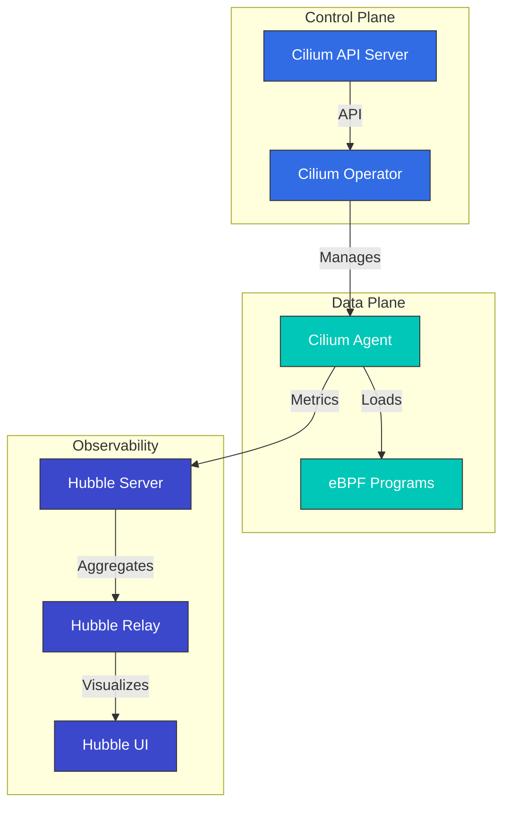

# Cilium Deep Dive: Cloud Native Networkingの未来

## 概要

このセクションでは、Ciliumのコアコンセプトとテクノロジーを包括的に理解します。Ciliumのアーキテクチャ、eBPFテクノロジー、ネットワーキングモデル、セキュリティ機能などを詳しく学びます。

> **対応バージョン**: Cilium 1.17, 1.18
> **Kubernetes互換性**: 1.32 以降
> **最終更新**: July 27, 2026

### 2026年7月アップデート: パッチリリースとNetworkPolicyのセキュリティ問題

2026年7月16日、Cilium 1.19.6、1.18.12、1.17.18のパッチリリースが公開されました。Gateway APIアクセスログの設定（`CiliumGatewayClassConfig`の`spec.telemetry.accessLogs`）の新規サポートに加え、agentの再起動/アップグレード中に確立済み接続が一時的に切断される可能性があるリグレッション、および`service.cilium.io/affinity: "none"`アノテーションがトラフィックのブラックホールを引き起こすClusterMeshのバグが修正されています。

また、**CVE-2026-56743**のセキュリティ問題にも注意してください。デフォルト以外の`clusterName`を使用するCilium 1.19.0-1.19.4では、`ipBlock`ルールのみ（Pod/namespaceセレクターなし）を使用するKubernetes NetworkPolicyが、同じnamespace内の他のworkloadからのトラフィックを意図せず許可する可能性がありました。1.19.5以降にアップグレードしてください。詳細は[セキュリティアドバイザリ](https://github.com/cilium/cilium/security/advisories/GHSA-fm8w-2m5w-9j7r)を参照してください。

2026年7月21日、[Cilium 1.20.0-rc.1](https://github.com/cilium/cilium/releases/tag/v1.20.0-rc.1)が公開されました。これは7月14日のrc.0に続く、次期1.20マイナーリリースの2番目のリリース候補です。GA前に1.20の機能をテストしたい場合は、quay.ioでRCイメージを利用できます。

## Cilium 1.18の主な改善

Cilium 1.18では、以下の主要な機能改善と新機能が提供されます。

### ネットワーキングの改善
- **BGP Control Planeの強化**: より柔軟でスケーラブルなBGP設定
- **マルチクラスター・ルーティングの改善**: クラスター間通信パフォーマンスの最適化
- **Service Mesh統合の強化**: Envoy proxyとの統合を改善

### セキュリティの強化
- **Network Policyの強化**: よりきめ細かなポリシー制御とパフォーマンスの改善
- **暗号化オプションの改善**: WireGuardおよびIPsec暗号化パフォーマンスの最適化

### 可観測性の改善
- **Hubbleの改善**: より豊富なメトリクスとトレース情報
- **Prometheus統合の強化**: 新しいメトリクスとダッシュボード
- **Flow Loggingの改善**: より詳細なネットワークフロー情報

### パフォーマンスの最適化
- **eBPF Programの最適化**: より高速なパケット処理
- **メモリ使用量の改善**: 大規模クラスターでのリソース効率を向上
- **CPU使用率の最適化**: オーバーヘッドを削減

## はじめに

Ciliumは、Kubernetes、Docker、MesosなどのLinuxコンテナ管理プラットフォーム向けのオープンソースのネットワーキング、セキュリティ、可観測性ソリューションです。CiliumはeBPF（extended Berkeley Packet Filter）テクノロジーに基づいており、従来のLinuxネットワーキングアプローチよりも強力で効率的なネットワーキングおよびセキュリティ機能を提供します。

### eBPFとは

eBPFは、Linux kernel内でサンドボックス化された仮想マシンのように動作するテクノロジーです。kernelコードを変更せずに、kernel内でプログラムを安全に実行できます。これにより、ネットワークパケット処理、system call監視、パフォーマンス分析などのさまざまなタスクを効率的に実行できます。

eBPFの主な特徴:
- kernel spaceでの実行による高パフォーマンス
- JIT（Just-In-Time）コンパイルによるネイティブパフォーマンス
- 安全な実行環境（verifierによるプログラム検証）
- 動的なロードとアンロードが可能

### Ciliumの主な利点

1. **高パフォーマンスネットワーキング**: eBPFを使用した効率的なパケット処理
2. **きめ細かなNetwork Policy**: L3-L7レベルのNetwork Policyをサポート
3. **透過的な暗号化**: node間の透過的なIPsecまたはWireGuard暗号化
4. **Load Balancing**: XDP（eXpress Data Path）ベースの高パフォーマンスLoad Balancing
5. **可観測性**: Hubbleによるネットワークフローの可視化
6. **Service Mesh**: 既存のsidecarなしでのL7トラフィック管理
7. **マルチクラスターネットワーキング**: クラスター間の透過的な接続性
8. **BGPサポート**: 外部ネットワークとの統合

### 既存CNIとの比較

| 機能 | Cilium | Calico | Flannel | AWS VPC CNI |
|---------|--------|--------|---------|-------------|
| ネットワークモデル | eBPF | iptables/IPVS | VXLAN/host-gw | AWS ENI |
| Network Policy | L3-L7 | L3-L4 | 限定的 | AWS Security Groups |
| 暗号化 | IPsec/WireGuard | IPsec | なし | なし |
| 可観測性 | Hubble | Flow Logs | 限定的 | VPC Flow Logs |
| Service Mesh | 組み込み | Istioが必要 | Istioが必要 | Istio/AppMeshが必要 |
| パフォーマンス | 非常に高い | 高い | 中程度 | 高い |
| マルチクラスター | 組み込み | 限定的 | なし | Transit Gatewayが必要 |

## アーキテクチャ

Ciliumは、eBPFをベースとするdata planeとKubernetesと統合されたcontrol planeで構成されています。



### 主要コンポーネント

1. **Cilium Agent**: 各nodeで実行され、eBPF Programをロードおよび管理
2. **Cilium Operator**: クラスターレベルのリソースと操作を管理
3. **eBPF Programs**: パケット処理とポリシー適用のためにkernelへロード
4. **Hubble**: ネットワークフロー監視と可観測性を提供
5. **Cilium CLI**: CiliumおよびHubble管理用のコマンドラインツール

### ネットワーキングモデル

Ciliumは複数のネットワーキングモードをサポートしています:

1. **Direct Routing**: node間の直接ルーティング（BGPまたはstatic routing）
2. **Tunneling**: VXLANまたはGeneve tunnelによるoverlay networking
3. **AWS ENI**: Amazon EKS上でElastic Network Interface（ENI）を利用
4. **Azure IPAM**: Azure AKS上でAzure IPAMを利用

### パケットフロー

Ciliumでパケットが処理される流れ:

1. パケットがネットワークインターフェイスに到着
2. eBPF XDP Programが初期処理を実行（DDoS防御、Load Balancing）
3. eBPF TC（Traffic Control）ProgramがNetwork Policyを適用
4. パケットがコンテナのnetwork namespaceに配送
5. レスポンスパケットは同様の経路で処理

## Amazon EKSとの統合

Amazon EKSでCiliumを使用する主な方法は2つあります:

1. **Amazon EKS Add-onとしてインストール**: Amazon EKSはCiliumをマネージドAdd-onとして提供します。
2. **手動インストール**: Helm chartを使用して直接インストールします。

### Amazon EKS Add-onとしてインストール

```bash
# Install Cilium add-on
aws eks create-addon \
  --cluster-name my-cluster \
  --addon-name cilium \
  --addon-version v1.17.0-eksbuild.1 \
  --service-account-role-arn arn:aws:iam::123456789012:role/AmazonEKSCiliumAddonRole

# Check add-on status
aws eks describe-addon \
  --cluster-name my-cluster \
  --addon-name cilium
```

### Helmを使用した手動インストール

```bash
# Add Cilium Helm repository
helm repo add cilium https://helm.cilium.io/

# Update Helm repository
helm repo update

# Install Cilium
helm install cilium cilium/cilium \
  --version 1.17.0 \
  --namespace kube-system \
  --set eni.enabled=true \
  --set ipam.mode=eni \
  --set egressMasqueradeInterfaces=eth0 \
  --set tunnel=disabled
```

### EKS固有の設定オプション

EKSでCiliumを使用する際に検討すべき主な設定オプション:

1. **ENI Mode**: AWS Elastic Network Interfaceを使用してネイティブAWSネットワーキングのパフォーマンスを活用
2. **IPAM Mode**: AWS VPC IPアドレス管理との統合
3. **Encryption**: node間トラフィックの暗号化（WireGuardまたはIPsec）
4. **NodeLocal DNSCache**: DNSパフォーマンスの改善
5. **Hubble**: ネットワーク可観測性を有効化

### ENI Modeの設定

```yaml
apiVersion: v1
kind: ConfigMap
metadata:
  name: cilium-config
  namespace: kube-system
data:
  enable-endpoint-routes: "true"
  auto-create-cilium-node-resource: "true"
  ipam: "eni"
  eni-tags: "{\"Owner\": \"Cilium\"}"
  tunnel: "disabled"
  enable-ipv4: "true"
  enable-ipv6: "false"
  egress-masquerade-interfaces: "eth0"
```

### EKS ClusterへのCiliumのインストール

#### 既存のEKS ClusterへのCiliumのインストール

```bash
# Remove AWS CNI
kubectl delete daemonset -n kube-system aws-node

# Install Cilium
cilium install --set eni.enabled=true \
  --set ipam.mode=eni \
  --set egressMasqueradeInterfaces=eth0 \
  --set tunnel=disabled
```

#### Cilium CNIを使用する新しいEKS Clusterの作成

```bash
eksctl create cluster --name cilium-cluster \
  --without-nodegroup

eksctl create nodegroup --cluster cilium-cluster \
  --node-ami-family AmazonLinux2 \
  --node-type m5.large \
  --nodes 3 \
  --max-pods-per-node 110

# Install Cilium
cilium install --set eni.enabled=true \
  --set ipam.mode=eni \
  --set egressMasqueradeInterfaces=eth0 \
  --set tunnel=disabled
```

### EKS Clusterの相互接続

Cilium Cluster Meshを使用したEKS Clusterの相互接続:

```bash
# On cluster 1
cilium clustermesh enable --service-type LoadBalancer

# On cluster 2
cilium clustermesh enable --service-type LoadBalancer

# Connect clusters
cilium clustermesh connect --context cluster1 --destination-context cluster2
```

## インストールと設定

### 前提条件

- Kubernetes cluster（v1.16以降）
- Linux kernel 4.9以降（推奨: 5.4以降）
- kubectlが設定済み
- Helm（任意）

### Cilium CLIのインストール

```bash
curl -L --remote-name-all https://github.com/cilium/cilium-cli/releases/latest/download/cilium-linux-amd64.tar.gz
sudo tar xzvfC cilium-linux-amd64.tar.gz /usr/local/bin
rm cilium-linux-amd64.tar.gz
```

### 設定オプション

#### ネットワーキングモードの設定

Direct routing mode:
```bash
cilium install --set tunnel=disabled --set autoDirectNodeRoutes=true
```

VXLAN mode:
```bash
cilium install --set tunnel=vxlan
```

#### kube-proxy置換の設定

完全置換モード:
```bash
cilium install --set kubeProxyReplacement=strict
```

#### 暗号化の設定

WireGuard暗号化:
```bash
cilium install --set encryption.enabled=true --set encryption.type=wireguard
```

IPsec暗号化:
```bash
cilium install --set encryption.enabled=true --set encryption.type=ipsec
```

## Network Policy

CiliumはKubernetes NetworkPolicy APIを拡張し、L3-L7レベルのきめ細かなNetwork Policyを提供します。

### 基本的なNetwork Policy

```yaml
apiVersion: networking.k8s.io/v1
kind: NetworkPolicy
metadata:
  name: allow-frontend-to-backend
  namespace: app
spec:
  podSelector:
    matchLabels:
      app: backend
  ingress:
  - from:
    - podSelector:
        matchLabels:
          app: frontend
    ports:
    - port: 8080
      protocol: TCP
```

### Cilium Network Policy

```yaml
apiVersion: cilium.io/v2
kind: CiliumNetworkPolicy
metadata:
  name: allow-specific-http-methods
  namespace: app
spec:
  endpointSelector:
    matchLabels:
      app: backend
  ingress:
  - fromEndpoints:
    - matchLabels:
        app: frontend
    toPorts:
    - ports:
      - port: "8080"
        protocol: TCP
      rules:
        http:
        - method: "GET"
          path: "/api/v1/products"
```

### FQDNベースのポリシー

```yaml
apiVersion: cilium.io/v2
kind: CiliumNetworkPolicy
metadata:
  name: allow-specific-domains
  namespace: app
spec:
  endpointSelector:
    matchLabels:
      app: web
  egress:
  - toFQDNs:
    - matchName: "api.example.com"
    - matchPattern: "*.amazonaws.com"
    toPorts:
    - ports:
      - port: "443"
        protocol: TCP
```

## Hubbleによる可観測性

HubbleはCiliumの可観測性レイヤーであり、eBPFを通じて収集されたネットワークフローデータの可視化と分析を可能にします。

### Hubbleのインストール

```bash
cilium hubble enable --ui
```

### ネットワークフローの観測

```bash
# Observe all flows
hubble observe

# Observe flows in specific namespace
hubble observe --namespace app

# Observe HTTP requests
hubble observe --protocol http

# Observe flows between pods with specific labels
hubble observe --from-label app=frontend --to-label app=backend

# Observe failed connections
hubble observe --verdict DROPPED
```

### Prometheus統合

```bash
cilium hubble enable --metrics="{dns:query;ignoreAAAA,drop:sourceContext=pod;destinationContext=pod,tcp,flow,icmp,http}"
```

## Ciliumのテスト

```bash
# Basic connectivity test
cilium connectivity test

# Run specific test
cilium connectivity test --test=client-to-echo-service

# Network performance test
cilium connectivity test --test=performance
```

## ベストプラクティス

### パフォーマンスの最適化

1. **Kernel Versionの最適化**: Linux kernel 5.4以降を使用
2. **BBR Congestion Controlを有効化**: ネットワークスループットを改善
3. **XDP Accelerationを有効化**: パケット処理パフォーマンスを改善
4. **MTUの最適化**: ネットワーク環境に適したMTUを設定

```bash
cilium install --set bpf.preallocateMaps=true \
  --set bpf.masquerade=true \
  --set devices=eth0 \
  --set loadBalancer.acceleration=native \
  --set loadBalancer.mode=dsr
```

### セキュリティ強化

1. **Default Deny Policyを適用**: 明示的に許可されたトラフィックのみを許可
2. **暗号化を有効化**: node間トラフィックを暗号化
3. **最小権限の原則を適用**: 必要な通信のみを許可するようポリシーを設計

### 可観測性の向上

```bash
cilium hubble enable --metrics="{dns,drop,tcp,flow,http}"
```

## トラブルシューティング

### 接続性の問題

```bash
# Check Cilium status
cilium status

# Check endpoint status
cilium endpoint list

# Review network policies
kubectl get cnp,ccnp -A

# Analyze flows
hubble observe --verdict DROPPED
```

### パフォーマンスの問題

```bash
# Check eBPF map status
cilium bpf maps list

# Monitor system resources
cilium metrics list
```

### デバッグツール

```bash
# Check status
cilium status --verbose

# Collect environment information
cilium sysdump

# Cilium agent logs
kubectl logs -n kube-system -l k8s-app=cilium
```

## Deep Dive目次

**[Ciliumの紹介と基本コンセプト](01-introduction.md)**
- Ciliumの概要と歴史
- コンテナネットワーキングの基礎
- CNI（Container Network Interface）の理解
- Ciliumの差別化機能

**[eBPFテクノロジーのDeep Dive](02-ebpf.md)**
- eBPFテクノロジーと歴史の紹介
- eBPFがkernel内部で動作する仕組み
- eBPF Programの種類とMap
- CiliumにおけるeBPFの活用

**[ネットワーキングモデルとVXLAN](03-networking.md)**
- コンテナネットワーキングモデルの比較
- VXLANテクノロジーのDeep Dive
- CiliumのOverlay Networking
- パフォーマンス最適化の手法
- ルーティングメカニズム（Encapsulation vs Native-Routing）
- Cloud Provider Networking（AWS ENI、Google Cloud）

**[IPAMとNetwork Policy](04-ipam-policy.md)**
- IPアドレス管理（IPAM）戦略
- KubernetesとCilium IPAMの統合
- Network Policyの設計と実装
- マルチクラスターのシナリオ
- IPAM ModeのDeep Dive（Cluster Scope、Kubernetes Host Scope、Multi-Pool）
- Cloud Provider IPAM（Azure IPAM、AWS ENI、GKE）
- CRDベースのIPAM

**[L2-L7 NetworkingとLoad Balancing](05-l2-l7-networking.md)**
- OSI Modelレイヤー（L2、L3、L4、L7）の理解
- Ciliumのレイヤー固有機能
- Service Mesh統合
- Load Balancingアーキテクチャ
- Masqueradingの設定と実装モード
- IPv4 Fragmentの処理

**[セキュリティと可視性](06-security-visibility.md)**
- Ciliumのセキュリティ機能
- ネットワークの可視性と監視
- Hubbleアーキテクチャと使用方法
- リアルタイム脅威検出

**[高度なトピックと実際の事例](07-advanced-topics.md)**
- パフォーマンスチューニングとトラブルシューティング
- 大規模デプロイ戦略
- 実際のユースケーススタディ
- 将来のロードマップと開発の方向性

## 追加リソース

- [ネットワーキングコンセプトのDeep Dive](networking-concepts.md)
- [用語集と略語](glossary.md)

## 参考資料

- [Cilium公式ドキュメント](https://docs.cilium.io/)
- [Cilium GitHub Repository](https://github.com/cilium/cilium)
- [eBPFドキュメント](https://ebpf.io/)
- [Hubbleドキュメント](https://github.com/cilium/hubble)
- [Cilium Network Policy Editor](https://editor.cilium.io/)
- [AWS EKS Workshop - Cilium](https://www.eksworkshop.com/beginner/115_cilium/)

## クイズ

このセクションで学んだ内容を確認するには、[Cilium Deep Diveクイズ](../../quizzes/networking/cilium/01-introduction-quiz.md)に挑戦してください。
