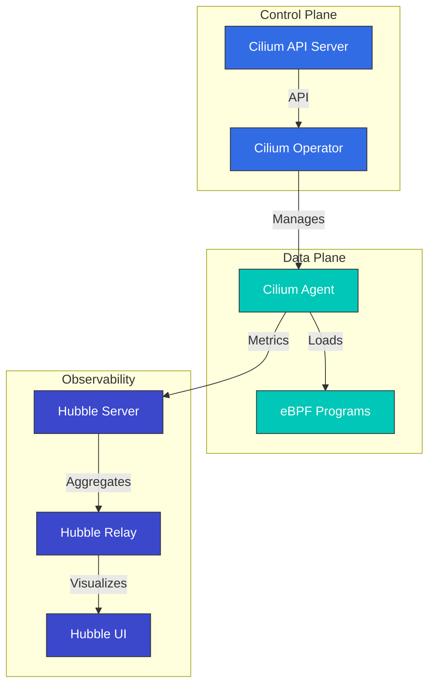

# Cilium 詳細解説: Cloud Native Networking の未来

## 概要

このセクションでは、Cilium のコアコンセプトとテクノロジーを包括的に解説します。Cilium のアーキテクチャ、eBPF テクノロジー、ネットワーキングモデル、セキュリティ機能などを詳しく見ていきます。

> **サポート対象バージョン**: Cilium 1.17, 1.18
> **Kubernetes 互換性**: 1.32 以上
> **最終更新**: February 23, 2026

## Cilium 1.18 の主な改善点

Cilium 1.18 では、次の主要な機能改善と新機能が提供されます。

### ネットワーキングの改善
- **強化された BGP Control Plane**: より柔軟でスケーラブルな BGP 設定
- **改善された Multi-cluster Routing**: クラスター間通信パフォーマンスの最適化
- **強化された Service Mesh 統合**: Envoy proxy との統合を改善

### セキュリティの強化
- **強化された Network Policy**: よりきめ細かなポリシー制御とパフォーマンスの向上
- **改善された暗号化オプション**: WireGuard および IPsec の暗号化パフォーマンスを最適化

### 可観測性の改善
- **Hubble の改善**: より豊富なメトリクスとトレーシング情報
- **強化された Prometheus 統合**: 新しいメトリクスとダッシュボード
- **改善されたフローロギング**: より詳細なネットワークフロー情報

### パフォーマンスの最適化
- **eBPF Program の最適化**: より高速なパケット処理
- **メモリ使用量の改善**: 大規模クラスターでのリソース効率を向上
- **CPU 使用量の最適化**: オーバーヘッドを削減

## はじめに

Cilium は、Kubernetes、Docker、Mesos などの Linux コンテナ管理プラットフォーム向けのオープンソースのネットワーキング、セキュリティ、および可観測性ソリューションです。Cilium は eBPF（extended Berkeley Packet Filter）テクノロジーをベースとしており、従来の Linux ネットワーキング手法よりも強力で効率的なネットワーキングおよびセキュリティ機能を提供します。

### eBPF とは

eBPF は、Linux kernel 内でサンドボックス化された仮想マシンのように動作するテクノロジーであり、kernel コードを変更せずにプログラムを安全に kernel 内で実行できます。これにより、ネットワークパケット処理、system call の監視、パフォーマンス分析などのさまざまなタスクを効率的に実行できます。

eBPF の主な特性:
- kernel space での実行による高パフォーマンス
- JIT（Just-In-Time）コンパイルによるネイティブパフォーマンス
- 安全な実行環境（verifier によるプログラム検証）
- 動的なロードとアンロードが可能

### Cilium の主なメリット

1. **高パフォーマンスネットワーキング**: eBPF を使用した効率的なパケット処理
2. **きめ細かな Network Policy**: L3-L7 レベルの Network Policy をサポート
3. **透過的な暗号化**: ノード間での透過的な IPsec または WireGuard 暗号化
4. **Load Balancing**: XDP（eXpress Data Path）ベースの高パフォーマンス Load Balancing
5. **可観測性**: Hubble によるネットワークフローの可視化
6. **Service Mesh**: 既存の sidecar を使わない L7 トラフィック管理
7. **Multi-Cluster Networking**: クラスター間の透過的な接続性
8. **BGP サポート**: 外部ネットワークとの統合

### 既存 CNI との比較

| 機能 | Cilium | Calico | Flannel | AWS VPC CNI |
|---------|--------|--------|---------|-------------|
| ネットワークモデル | eBPF | iptables/IPVS | VXLAN/host-gw | AWS ENI |
| Network Policy | L3-L7 | L3-L4 | 制限あり | AWS Security Groups |
| 暗号化 | IPsec/WireGuard | IPsec | なし | なし |
| 可観測性 | Hubble | Flow Logs | 制限あり | VPC Flow Logs |
| Service Mesh | 組み込み | Istio が必要 | Istio が必要 | Istio/AppMesh が必要 |
| パフォーマンス | 非常に高い | 高い | 中程度 | 高い |
| Multi-Cluster | 組み込み | 制限あり | なし | Transit Gateway が必要 |

## アーキテクチャ

Cilium は、eBPF ベースの data plane と Kubernetes に統合された control plane で構成されます。



### 主なコンポーネント

1. **Cilium Agent**: 各ノードで実行され、eBPF Program をロードして管理します
2. **Cilium Operator**: クラスターレベルのリソースと操作を管理します
3. **eBPF Programs**: パケット処理とポリシー適用のために kernel にロードされます
4. **Hubble**: ネットワークフローの監視と可観測性を提供します
5. **Cilium CLI**: Cilium と Hubble 管理のためのコマンドラインツール

### ネットワーキングモデル

Cilium は複数のネットワーキングモードをサポートします。

1. **Direct Routing**: ノード間の直接ルーティング（BGP または static routing）
2. **Tunneling**: VXLAN または Geneve tunnel を使用した overlay networking
3. **AWS ENI**: Amazon EKS で Elastic Network Interface（ENI）を使用
4. **Azure IPAM**: Azure AKS で Azure IPAM を使用

### パケットフロー

Cilium でパケットが処理される流れ:

1. パケットがネットワークインターフェイスに到着
2. eBPF XDP Program が初期処理を実行（DDoS 防御、Load Balancing）
3. eBPF TC（Traffic Control）Program が Network Policy を適用
4. パケットがコンテナの network namespace に配信
5. 応答パケットは同様の経路で処理

## Amazon EKS との統合

Amazon EKS で Cilium を使用する主な方法は 2 つあります。

1. **Amazon EKS Add-on としてインストール**: Amazon EKS は Cilium をマネージド Add-on として提供します。
2. **手動インストール**: Helm chart を使用して直接インストールします。

### Amazon EKS Add-on としてインストール

```bash
# Install Cilium add-on
aws eks create-addon \
  --cluster-name my-cluster \
  --addon-name cilium \
  --addon-version v1.17.0-eksbuild.1 \
  --service-account-role-arn arn:aws:iam::123456789012:role/AmazonEKSCiliumAddonRole

# Check add-on status
aws eks describe-addon \
  --cluster-name my-cluster \
  --addon-name cilium
```

### Helm を使用した手動インストール

```bash
# Add Cilium Helm repository
helm repo add cilium https://helm.cilium.io/

# Update Helm repository
helm repo update

# Install Cilium
helm install cilium cilium/cilium \
  --version 1.17.0 \
  --namespace kube-system \
  --set eni.enabled=true \
  --set ipam.mode=eni \
  --set egressMasqueradeInterfaces=eth0 \
  --set tunnel=disabled
```

### EKS 固有の設定オプション

EKS で Cilium を使用する際に考慮すべき主な設定オプション:

1. **ENI Mode**: AWS Elastic Network Interface を使用してネイティブ AWS ネットワーキングパフォーマンスを活用
2. **IPAM Mode**: AWS VPC IP address management との統合
3. **Encryption**: ノード間トラフィックの暗号化（WireGuard または IPsec）
4. **NodeLocal DNSCache**: DNS パフォーマンスの向上
5. **Hubble**: ネットワーク可観測性を有効化

### ENI Mode の設定

```yaml
apiVersion: v1
kind: ConfigMap
metadata:
  name: cilium-config
  namespace: kube-system
data:
  enable-endpoint-routes: "true"
  auto-create-cilium-node-resource: "true"
  ipam: "eni"
  eni-tags: "{\"Owner\": \"Cilium\"}"
  tunnel: "disabled"
  enable-ipv4: "true"
  enable-ipv6: "false"
  egress-masquerade-interfaces: "eth0"
```

### EKS Cluster への Cilium のインストール

#### 既存の EKS Cluster への Cilium のインストール

```bash
# Remove AWS CNI
kubectl delete daemonset -n kube-system aws-node

# Install Cilium
cilium install --set eni.enabled=true \
  --set ipam.mode=eni \
  --set egressMasqueradeInterfaces=eth0 \
  --set tunnel=disabled
```

#### Cilium CNI を使用した新しい EKS Cluster の作成

```bash
eksctl create cluster --name cilium-cluster \
  --without-nodegroup

eksctl create nodegroup --cluster cilium-cluster \
  --node-ami-family AmazonLinux2 \
  --node-type m5.large \
  --nodes 3 \
  --max-pods-per-node 110

# Install Cilium
cilium install --set eni.enabled=true \
  --set ipam.mode=eni \
  --set egressMasqueradeInterfaces=eth0 \
  --set tunnel=disabled
```

### EKS Cluster の相互接続

Cilium Cluster Mesh を使用した EKS Cluster の相互接続:

```bash
# On cluster 1
cilium clustermesh enable --service-type LoadBalancer

# On cluster 2
cilium clustermesh enable --service-type LoadBalancer

# Connect clusters
cilium clustermesh connect --context cluster1 --destination-context cluster2
```

## インストールと設定

### 前提条件

- Kubernetes cluster（v1.16 以上）
- Linux kernel 4.9 以上（推奨: 5.4 以上）
- 設定済みの kubectl
- Helm（任意）

### Cilium CLI のインストール

```bash
curl -L --remote-name-all https://github.com/cilium/cilium-cli/releases/latest/download/cilium-linux-amd64.tar.gz
sudo tar xzvfC cilium-linux-amd64.tar.gz /usr/local/bin
rm cilium-linux-amd64.tar.gz
```

### 設定オプション

#### ネットワーキングモードの設定

Direct routing モード:
```bash
cilium install --set tunnel=disabled --set autoDirectNodeRoutes=true
```

VXLAN モード:
```bash
cilium install --set tunnel=vxlan
```

#### kube-proxy replacement の設定

完全置換モード:
```bash
cilium install --set kubeProxyReplacement=strict
```

#### 暗号化の設定

WireGuard 暗号化:
```bash
cilium install --set encryption.enabled=true --set encryption.type=wireguard
```

IPsec 暗号化:
```bash
cilium install --set encryption.enabled=true --set encryption.type=ipsec
```

## Network Policy

Cilium は Kubernetes NetworkPolicy API を拡張し、L3-L7 レベルでのきめ細かな Network Policy を提供します。

### 基本的な Network Policy

```yaml
apiVersion: networking.k8s.io/v1
kind: NetworkPolicy
metadata:
  name: allow-frontend-to-backend
  namespace: app
spec:
  podSelector:
    matchLabels:
      app: backend
  ingress:
  - from:
    - podSelector:
        matchLabels:
          app: frontend
    ports:
    - port: 8080
      protocol: TCP
```

### Cilium Network Policy

```yaml
apiVersion: cilium.io/v2
kind: CiliumNetworkPolicy
metadata:
  name: allow-specific-http-methods
  namespace: app
spec:
  endpointSelector:
    matchLabels:
      app: backend
  ingress:
  - fromEndpoints:
    - matchLabels:
        app: frontend
    toPorts:
    - ports:
      - port: "8080"
        protocol: TCP
      rules:
        http:
        - method: "GET"
          path: "/api/v1/products"
```

### FQDN ベースのポリシー

```yaml
apiVersion: cilium.io/v2
kind: CiliumNetworkPolicy
metadata:
  name: allow-specific-domains
  namespace: app
spec:
  endpointSelector:
    matchLabels:
      app: web
  egress:
  - toFQDNs:
    - matchName: "api.example.com"
    - matchPattern: "*.amazonaws.com"
    toPorts:
    - ports:
      - port: "443"
        protocol: TCP
```

## Hubble による可観測性

Hubble は Cilium の可観測性レイヤーであり、eBPF を通じて収集されたネットワークフローデータの可視化と分析を可能にします。

### Hubble のインストール

```bash
cilium hubble enable --ui
```

### ネットワークフローの監視

```bash
# Observe all flows
hubble observe

# Observe flows in specific namespace
hubble observe --namespace app

# Observe HTTP requests
hubble observe --protocol http

# Observe flows between pods with specific labels
hubble observe --from-label app=frontend --to-label app=backend

# Observe failed connections
hubble observe --verdict DROPPED
```

### Prometheus 統合

```bash
cilium hubble enable --metrics="{dns:query;ignoreAAAA,drop:sourceContext=pod;destinationContext=pod,tcp,flow,icmp,http}"
```

## Cilium のテスト

```bash
# Basic connectivity test
cilium connectivity test

# Run specific test
cilium connectivity test --test=client-to-echo-service

# Network performance test
cilium connectivity test --test=performance
```

## ベストプラクティス

### パフォーマンスの最適化

1. **Kernel Version の最適化**: Linux kernel 5.4 以上を使用
2. **BBR Congestion Control を有効化**: ネットワークスループットを改善
3. **XDP Acceleration を有効化**: パケット処理パフォーマンスを改善
4. **MTU の最適化**: ネットワーク環境に適した MTU を設定

```bash
cilium install --set bpf.preallocateMaps=true \
  --set bpf.masquerade=true \
  --set devices=eth0 \
  --set loadBalancer.acceleration=native \
  --set loadBalancer.mode=dsr
```

### セキュリティ強化

1. **Default Deny Policy を適用**: 明示的に許可されたトラフィックのみを許可
2. **Encryption を有効化**: ノード間トラフィックを暗号化
3. **最小権限の原則を適用**: 必要な通信のみを許可するポリシーを設計

### 可観測性の向上

```bash
cilium hubble enable --metrics="{dns,drop,tcp,flow,http}"
```

## トラブルシューティング

### 接続の問題

```bash
# Check Cilium status
cilium status

# Check endpoint status
cilium endpoint list

# Review network policies
kubectl get cnp,ccnp -A

# Analyze flows
hubble observe --verdict DROPPED
```

### パフォーマンスの問題

```bash
# Check eBPF map status
cilium bpf maps list

# Monitor system resources
cilium metrics list
```

### デバッグツール

```bash
# Check status
cilium status --verbose

# Collect environment information
cilium sysdump

# Cilium agent logs
kubectl logs -n kube-system -l k8s-app=cilium
```

## 詳細解説の目次

**[Cilium の紹介と基本コンセプト](01-introduction.md)**
- Cilium の概要と歴史
- コンテナネットワーキングの基本
- CNI（Container Network Interface）の理解
- Cilium の差別化機能

**[eBPF テクノロジーの詳細解説](02-ebpf.md)**
- eBPF テクノロジーの紹介と歴史
- kernel 内での eBPF の動作
- eBPF Program の種類と Map
- Cilium での eBPF の活用

**[ネットワーキングモデルと VXLAN](03-networking.md)**
- コンテナネットワーキングモデルの比較
- VXLAN テクノロジーの詳細解説
- Cilium の Overlay Networking
- パフォーマンス最適化の手法
- ルーティングメカニズム（Encapsulation vs Native-Routing）
- Cloud Provider Networking（AWS ENI、Google Cloud）

**[IPAM と Network Policy](04-ipam-policy.md)**
- IP Address Management（IPAM）の戦略
- Kubernetes と Cilium IPAM の統合
- Network Policy の設計と実装
- Multi-Cluster シナリオ
- IPAM Mode の詳細解説（Cluster Scope、Kubernetes Host Scope、Multi-Pool）
- Cloud Provider IPAM（Azure IPAM、AWS ENI、GKE）
- CRD ベースの IPAM

**[L2-L7 Networking と Load Balancing](05-l2-l7-networking.md)**
- OSI Model レイヤー（L2、L3、L4、L7）の理解
- Cilium のレイヤー固有機能
- Service Mesh 統合
- Load Balancing アーキテクチャ
- Masquerading の設定と実装モード
- IPv4 Fragment の処理

**[セキュリティと可視性](06-security-visibility.md)**
- Cilium のセキュリティ機能
- ネットワークの可視性と監視
- Hubble のアーキテクチャと使用方法
- リアルタイム脅威検出

**[高度なトピックと実際の事例](07-advanced-topics.md)**
- パフォーマンスチューニングとトラブルシューティング
- 大規模デプロイ戦略
- 実際のユースケーススタディ
- 今後のロードマップと開発の方向性

## 追加リソース

- [ネットワーキングコンセプトの詳細解説](networking-concepts.md)
- [用語集と略語](glossary.md)

## 参考資料

- [Cilium 公式ドキュメント](https://docs.cilium.io/)
- [Cilium GitHub リポジトリ](https://github.com/cilium/cilium)
- [eBPF ドキュメント](https://ebpf.io/)
- [Hubble ドキュメント](https://github.com/cilium/hubble)
- [Cilium Network Policy Editor](https://editor.cilium.io/)
- [AWS EKS Workshop - Cilium](https://www.eksworkshop.com/beginner/115_cilium/)

## クイズ

このセクションで学んだ内容を確認するには、[Cilium 詳細解説クイズ](../../quizzes/networking/cilium/01-introduction-quiz.md)に挑戦してください。
