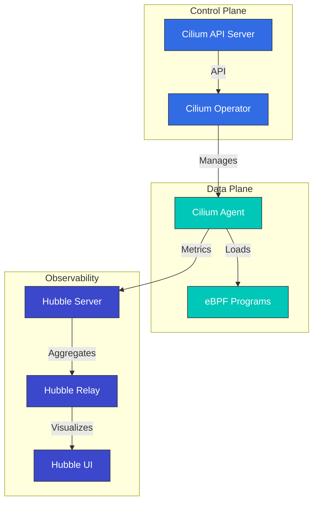

# Cilium ディープダイブ：クラウドネイティブネットワーキングの未来

## 概要

このセクションでは、Cilium のコアコンセプトとテクノロジーを包括的に理解します。Cilium のアーキテクチャ、eBPF テクノロジー、ネットワーキングモデル、セキュリティ機能などを深く掘り下げます。

> **対応バージョン**: Cilium 1.17, 1.18
> **Kubernetes 互換性**: 1.32 以降
> **最終更新**: August 24, 2026

### 2026年7月の更新：パッチリリースと NetworkPolicy のセキュリティ問題

2026年7月16日、Cilium 1.19.6、1.18.12、1.17.18 のパッチリリースが公開されました。`CiliumGatewayClassConfig` の Gateway API アクセスログ（`spec.telemetry.accessLogs`）を設定する新しいサポートとともに、Agent の再起動／アップグレード中に確立済み接続が一時的に切断される可能性のあったリグレッション、および `service.cilium.io/affinity: "none"` アノテーションがトラフィックのブラックホールを引き起こしていた ClusterMesh のバグを修正しています。

また、**CVE-2026-56743** のセキュリティ問題にも注意してください。デフォルト以外の `clusterName` を使用する Cilium 1.19.0-1.19.4 では、`ipBlock` ルールのみ（Pod／Namespace セレクターなし）を使用する Kubernetes NetworkPolicy によって、同じ Namespace 内の他のワークロードからのトラフィックが意図せず許可される可能性がありました。1.19.5 以降にアップグレードしてください。詳細は[セキュリティアドバイザリ](https://github.com/cilium/cilium/security/advisories/GHSA-fm8w-2m5w-9j7r)を参照してください。

2026年7月21日、2026年7月14日の rc.0 に続き、次期 1.20 マイナーリリースの2番目のリリース候補である [Cilium 1.20.0-rc.1](https://github.com/cilium/cilium/releases/tag/v1.20.0-rc.1) が公開されました。

### 2026年8月の更新：Cilium 1.20.0 GA

2026年7月29日、[Cilium 1.20.0](https://github.com/cilium/cilium/releases/tag/v1.20.0) がリリースされました。1,100人以上のコントリビューターによる 2,660 件超の新規コミットが含まれます。主な内容は以下のとおりです。

- **Gateway API v1.6.1**: 新たに GA となった TCPRoute／UDPRoute のサポート、バックエンドへの TLS 用 `BackendTLSPolicy`、委譲されたリスナー管理用の ListenerSets、`ExternalAuth` フィルター（GEP-1494）、ネイティブ CORS サポート
- **ネットワーキング**: フォークなしで eBPF データパスを拡張するためのデータパスプラグイン、自動 netkit 選択（`bpf.datapathMode=auto`）、デュアルスタッククラスター向け IPv6 egress gateway IP
- **IPAM**: AWS ENI IPAM 向け IPv6（Beta）、および cluster-pool から multi-pool IPAM へのインプレース移行
- **Services/ClusterMesh**: `PreferSameZone`／`PreferSameNode` トラフィック分散、`service.cilium.io/weight` アノテーションによる重み付け Maglev バックエンド、安定版 Multi-Cluster Services（MCS）API サポート
- **セキュリティ**: Admin／Baseline ティアを持つ Kubernetes ClusterNetworkPolicy（KCNP）サポート、内部 CA または SPIRE を介した ztunnel アイデンティティ、新しい `cluster-mesh` ポリシーエンティティ
- **パフォーマンス**: `cilium-cni` バイナリを約 77 MB から 16 MB に縮小、大規模クラスター向けの集約ロードバランサー状態と最適化された BPF policy-map エンコーディング

レガシー Mutual Authentication、Envoy Go 拡張、Kafka 対応ポリシー、`cilium.io/v2alpha1` の `CiliumNodeConfig` API、libnetwork 統合、またはカスタム CNI 設定を使用している場合は、アップグレード時に対応してください。詳細は[アップグレードガイド](https://docs.cilium.io/en/v1.20/operations/upgrade/#upgrade-notes)を参照してください。次のサイクルの最初のプレリリースである 1.21.0-pre.0 は、8月3日に続いて公開されました。

### 2026年8月の更新：1.20.1 / 1.19.7 / 1.18.13 パッチリリース

2026年8月18日、メンテナンス対象の3系統に対する協調パッチリリースが行われました。1.20 系統の最初のパッチである [1.20.1](https://github.com/cilium/cilium/releases/tag/v1.20.1) には Cluster Mesh ドキュメントの刷新と 1.20.0 以降のバックポートされたバグ修正が含まれます。[1.19.7](https://github.com/cilium/cilium/releases/tag/v1.19.7) はホストファイアウォールにおける VRRP および IGMP プロトコルのサポートをバックポートし、[1.18.13](https://github.com/cilium/cilium/releases/tag/v1.18.13) は Envoy リソース（リスナー、ネットワークポリシーなど）の増分同期を追加して、CPU 負荷とポリシー更新レイテンシーを低減します。使用中の系統の最新パッチへ更新することを推奨します。

## Cilium 1.18 の主な改善点

Cilium 1.18 では、以下の主要な機能改善と新機能が提供されます。

### ネットワーキングの改善
- **強化された BGP Control Plane**: より柔軟でスケーラブルな BGP 設定
- **改善されたマルチクラスター ルーティング**: クラスター間通信パフォーマンスの最適化
- **強化された Service Mesh 統合**: Envoy Proxy との統合を改善

### セキュリティの強化
- **強化されたネットワークポリシー**: より細かなポリシー制御とパフォーマンスの改善
- **改善された暗号化オプション**: WireGuard および IPsec の暗号化パフォーマンスを最適化

### 可観測性の改善
- **Hubble の改善**: より豊富なメトリクスとトレーシング情報
- **強化された Prometheus 統合**: 新しいメトリクスとダッシュボード
- **改善されたフローログ**: より詳細なネットワークフロー情報

### パフォーマンスの最適化
- **eBPF プログラムの最適化**: より高速なパケット処理
- **メモリ使用量の改善**: 大規模クラスターでのリソース効率を向上
- **CPU 使用量の最適化**: オーバーヘッドを削減

## はじめに

Cilium は、Kubernetes、Docker、Mesos などの Linux コンテナ管理プラットフォーム向けのオープンソースのネットワーキング、セキュリティ、可観測性ソリューションです。Cilium は eBPF（extended Berkeley Packet Filter）テクノロジーを基盤とし、従来の Linux ネットワーキング手法よりも強力で効率的なネットワーキングおよびセキュリティ機能を提供します。

### eBPF とは？

eBPF は Linux カーネル内でサンドボックス化された仮想マシンのように機能するテクノロジーであり、カーネルコードを変更せずにプログラムを安全にカーネル内で実行できます。これにより、ネットワークパケット処理、システムコール監視、パフォーマンス分析など、さまざまなタスクを効率的に実行できます。

eBPF の主な特性：
- カーネル空間での実行による高パフォーマンス
- JIT（Just-In-Time）コンパイルによるネイティブパフォーマンス
- 安全な実行環境（verifier によるプログラム検証）
- 動的なロードおよびアンロードが可能

### Cilium の主な利点

1. **高パフォーマンスネットワーキング**: eBPF を使用した効率的なパケット処理
2. **きめ細かなネットワークポリシー**: L3-L7 レベルのネットワークポリシーをサポート
3. **透過的な暗号化**: Node 間の透過的な IPsec または WireGuard 暗号化
4. **ロードバランシング**: XDP（eXpress Data Path）ベースの高パフォーマンスなロードバランシング
5. **可観測性**: Hubble によるネットワークフローの可視化
6. **Service Mesh**: 既存のサイドカーなしで L7 トラフィック管理
7. **マルチクラスター ネットワーキング**: クラスター間の透過的な接続性
8. **BGP サポート**: 外部ネットワークとの統合

### 既存の CNI との比較

| 機能 | Cilium | Calico | Flannel | AWS VPC CNI |
|---------|--------|--------|---------|-------------|
| ネットワークモデル | eBPF | iptables/IPVS | VXLAN/host-gw | AWS ENI |
| ネットワークポリシー | L3-L7 | L3-L4 | 限定的 | AWS Security Groups |
| 暗号化 | IPsec/WireGuard | IPsec | なし | なし |
| 可観測性 | Hubble | Flow Logs | 限定的 | VPC Flow Logs |
| Service Mesh | 組み込み | Istio が必要 | Istio が必要 | Istio/AppMesh が必要 |
| パフォーマンス | 非常に高い | 高い | 中程度 | 高い |
| マルチクラスター | 組み込み | 限定的 | なし | Transit Gateway が必要 |

## アーキテクチャ

Cilium は、eBPF を基盤とするデータプレーンと Kubernetes と統合されたコントロールプレーンで構成されています。



### 主なコンポーネント

1. **Cilium Agent**: 各 Node で実行され、eBPF プログラムをロードおよび管理
2. **Cilium Operator**: クラスターレベルのリソースと操作を管理
3. **eBPF プログラム**: パケット処理とポリシー適用のためにカーネルへロード
4. **Hubble**: ネットワークフローの監視と可観測性を提供
5. **Cilium CLI**: Cilium と Hubble を管理するコマンドラインツール

### ネットワーキングモデル

Cilium は複数のネットワーキングモードをサポートします。

1. **Direct Routing**: Node 間の直接ルーティング（BGP または静的ルーティング）
2. **Tunneling**: VXLAN または Geneve トンネルによるオーバーレイネットワーキング
3. **AWS ENI**: Amazon EKS 上の Elastic Network Interface（ENI）を活用
4. **Azure IPAM**: Azure AKS 上の Azure IPAM を活用

### パケットフロー

Cilium でパケットが処理される仕組み：

1. パケットがネットワークインターフェイスに到着
2. eBPF XDP プログラムが初期処理を実行（DDoS 防御、ロードバランシング）
3. eBPF TC（Traffic Control）プログラムがネットワークポリシーを適用
4. パケットがコンテナのネットワーク Namespace に配信
5. 応答パケットは同様の経路で処理

## Amazon EKS との統合

Amazon EKS で Cilium を使用する主な方法は2つあります。

1. **Amazon EKS Add-on としてインストール**: Amazon EKS が Cilium をマネージド Add-on として提供します。
2. **手動インストール**: Helm chart を使用して直接インストールします。

### Amazon EKS Add-on としてインストール

```bash
# Install Cilium add-on
aws eks create-addon \
  --cluster-name my-cluster \
  --addon-name cilium \
  --addon-version v1.17.0-eksbuild.1 \
  --service-account-role-arn arn:aws:iam::123456789012:role/AmazonEKSCiliumAddonRole

# Check add-on status
aws eks describe-addon \
  --cluster-name my-cluster \
  --addon-name cilium
```

### Helm を使用した手動インストール

```bash
# Add Cilium Helm repository
helm repo add cilium https://helm.cilium.io/

# Update Helm repository
helm repo update

# Install Cilium
helm install cilium cilium/cilium \
  --version 1.17.0 \
  --namespace kube-system \
  --set eni.enabled=true \
  --set ipam.mode=eni \
  --set egressMasqueradeInterfaces=eth0 \
  --set tunnel=disabled
```

### EKS 固有の設定オプション

EKS で Cilium を使用する際に検討すべき主な設定オプション：

1. **ENI モード**: AWS Elastic Network Interface を使用してネイティブ AWS ネットワーキングパフォーマンスを活用
2. **IPAM モード**: AWS VPC IP アドレス管理との統合
3. **暗号化**: Node 間トラフィックの暗号化（WireGuard または IPsec）
4. **NodeLocal DNSCache**: DNS パフォーマンスの改善
5. **Hubble**: ネットワーク可観測性を有効化

### ENI モードの設定

```yaml
apiVersion: v1
kind: ConfigMap
metadata:
  name: cilium-config
  namespace: kube-system
data:
  enable-endpoint-routes: "true"
  auto-create-cilium-node-resource: "true"
  ipam: "eni"
  eni-tags: "{\"Owner\": \"Cilium\"}"
  tunnel: "disabled"
  enable-ipv4: "true"
  enable-ipv6: "false"
  egress-masquerade-interfaces: "eth0"
```

### EKS クラスターへの Cilium のインストール

#### 既存の EKS クラスターへの Cilium のインストール

```bash
# Remove AWS CNI
kubectl delete daemonset -n kube-system aws-node

# Install Cilium
cilium install --set eni.enabled=true \
  --set ipam.mode=eni \
  --set egressMasqueradeInterfaces=eth0 \
  --set tunnel=disabled
```

#### Cilium CNI を使用する新しい EKS クラスターの作成

```bash
eksctl create cluster --name cilium-cluster \
  --without-nodegroup

eksctl create nodegroup --cluster cilium-cluster \
  --node-ami-family AmazonLinux2 \
  --node-type m5.large \
  --nodes 3 \
  --max-pods-per-node 110

# Install Cilium
cilium install --set eni.enabled=true \
  --set ipam.mode=eni \
  --set egressMasqueradeInterfaces=eth0 \
  --set tunnel=disabled
```

### EKS クラスターの相互接続

Cilium Cluster Mesh を使用した EKS クラスターの相互接続：

```bash
# On cluster 1
cilium clustermesh enable --service-type LoadBalancer

# On cluster 2
cilium clustermesh enable --service-type LoadBalancer

# Connect clusters
cilium clustermesh connect --context cluster1 --destination-context cluster2
```

## インストールと設定

### 前提条件

- Kubernetes クラスター（v1.16 以降）
- Linux カーネル 4.9 以降（推奨：5.4 以降）
- kubectl が設定済み
- Helm（任意）

### Cilium CLI のインストール

```bash
curl -L --remote-name-all https://github.com/cilium/cilium-cli/releases/latest/download/cilium-linux-amd64.tar.gz
sudo tar xzvfC cilium-linux-amd64.tar.gz /usr/local/bin
rm cilium-linux-amd64.tar.gz
```

### 設定オプション

#### ネットワーキングモードの設定

Direct routing モード：
```bash
cilium install --set tunnel=disabled --set autoDirectNodeRoutes=true
```

VXLAN モード：
```bash
cilium install --set tunnel=vxlan
```

#### kube-proxy 置換の設定

完全置換モード：
```bash
cilium install --set kubeProxyReplacement=strict
```

#### 暗号化の設定

WireGuard 暗号化：
```bash
cilium install --set encryption.enabled=true --set encryption.type=wireguard
```

IPsec 暗号化：
```bash
cilium install --set encryption.enabled=true --set encryption.type=ipsec
```

## ネットワークポリシー

Cilium は Kubernetes NetworkPolicy API を拡張し、L3-L7 レベルのきめ細かなネットワークポリシーを提供します。

### 基本的なネットワークポリシー

```yaml
apiVersion: networking.k8s.io/v1
kind: NetworkPolicy
metadata:
  name: allow-frontend-to-backend
  namespace: app
spec:
  podSelector:
    matchLabels:
      app: backend
  ingress:
  - from:
    - podSelector:
        matchLabels:
          app: frontend
    ports:
    - port: 8080
      protocol: TCP
```

### Cilium ネットワークポリシー

```yaml
apiVersion: cilium.io/v2
kind: CiliumNetworkPolicy
metadata:
  name: allow-specific-http-methods
  namespace: app
spec:
  endpointSelector:
    matchLabels:
      app: backend
  ingress:
  - fromEndpoints:
    - matchLabels:
        app: frontend
    toPorts:
    - ports:
      - port: "8080"
        protocol: TCP
      rules:
        http:
        - method: "GET"
          path: "/api/v1/products"
```

### FQDN ベースのポリシー

```yaml
apiVersion: cilium.io/v2
kind: CiliumNetworkPolicy
metadata:
  name: allow-specific-domains
  namespace: app
spec:
  endpointSelector:
    matchLabels:
      app: web
  egress:
  - toFQDNs:
    - matchName: "api.example.com"
    - matchPattern: "*.amazonaws.com"
    toPorts:
    - ports:
      - port: "443"
        protocol: TCP
```

## Hubble による可観測性

Hubble は Cilium の可観測性レイヤーであり、eBPF を通じて収集したネットワークフローデータの可視化と分析を可能にします。

### Hubble のインストール

```bash
cilium hubble enable --ui
```

### ネットワークフローの観測

```bash
# Observe all flows
hubble observe

# Observe flows in specific namespace
hubble observe --namespace app

# Observe HTTP requests
hubble observe --protocol http

# Observe flows between pods with specific labels
hubble observe --from-label app=frontend --to-label app=backend

# Observe failed connections
hubble observe --verdict DROPPED
```

### Prometheus 統合

```bash
cilium hubble enable --metrics="{dns:query;ignoreAAAA,drop:sourceContext=pod;destinationContext=pod,tcp,flow,icmp,http}"
```

## Cilium のテスト

```bash
# Basic connectivity test
cilium connectivity test

# Run specific test
cilium connectivity test --test=client-to-echo-service

# Network performance test
cilium connectivity test --test=performance
```

## ベストプラクティス

### パフォーマンスの最適化

1. **カーネルバージョンの最適化**: Linux カーネル 5.4 以降を使用
2. **BBR 輻輳制御を有効化**: ネットワークスループットを改善
3. **XDP アクセラレーションを有効化**: パケット処理パフォーマンスを改善
4. **MTU の最適化**: ネットワーク環境に適した MTU を設定

```bash
cilium install --set bpf.preallocateMaps=true \
  --set bpf.masquerade=true \
  --set devices=eth0 \
  --set loadBalancer.acceleration=native \
  --set loadBalancer.mode=dsr
```

### セキュリティの強化

1. **デフォルト拒否ポリシーを適用**: 明示的に許可されたトラフィックのみを許可
2. **暗号化を有効化**: Node 間トラフィックを暗号化
3. **最小権限の原則を適用**: 必要な通信のみを許可するポリシーを設計

### 可観測性の向上

```bash
cilium hubble enable --metrics="{dns,drop,tcp,flow,http}"
```

## トラブルシューティング

### 接続性の問題

```bash
# Check Cilium status
cilium status

# Check endpoint status
cilium endpoint list

# Review network policies
kubectl get cnp,ccnp -A

# Analyze flows
hubble observe --verdict DROPPED
```

### パフォーマンスの問題

```bash
# Check eBPF map status
cilium bpf maps list

# Monitor system resources
cilium metrics list
```

### デバッグツール

```bash
# Check status
cilium status --verbose

# Collect environment information
cilium sysdump

# Cilium agent logs
kubectl logs -n kube-system -l k8s-app=cilium
```

## ディープダイブ目次

**[Cilium の紹介と基本コンセプト](01-introduction.md)**
- Cilium の概要と歴史
- コンテナネットワーキングの基礎
- CNI（Container Network Interface）の理解
- Cilium の差別化機能

**[eBPF テクノロジーのディープダイブ](02-ebpf.md)**
- eBPF テクノロジーの紹介と歴史
- カーネル内部での eBPF の仕組み
- eBPF プログラムの種類とマップ
- Cilium での eBPF の活用

**[ネットワーキングモデルと VXLAN](03-networking.md)**
- コンテナネットワーキングモデルの比較
- VXLAN テクノロジーのディープダイブ
- Cilium のオーバーレイネットワーキング
- パフォーマンス最適化手法
- ルーティングメカニズム（Encapsulation と Native-Routing）
- クラウドプロバイダーネットワーキング（AWS ENI、Google Cloud）

**[IPAM とネットワークポリシー](04-ipam-policy.md)**
- IP アドレス管理（IPAM）戦略
- Kubernetes と Cilium IPAM の統合
- ネットワークポリシーの設計と実装
- マルチクラスターのシナリオ
- IPAM モードのディープダイブ（Cluster Scope、Kubernetes Host Scope、Multi-Pool）
- クラウドプロバイダー IPAM（Azure IPAM、AWS ENI、GKE）
- CRD ベースの IPAM

**[L2-L7 ネットワーキングとロードバランシング](05-l2-l7-networking.md)**
- OSI モデルのレイヤー（L2、L3、L4、L7）の理解
- Cilium のレイヤー固有機能
- Service Mesh 統合
- ロードバランシングアーキテクチャ
- マスカレード設定と実装モード
- IPv4 フラグメント処理

**[セキュリティと可視性](06-security-visibility.md)**
- Cilium のセキュリティ機能
- ネットワークの可視性とモニタリング
- Hubble のアーキテクチャと使用方法
- リアルタイムの脅威検出

**[高度なトピックと実際のケース](07-advanced-topics.md)**
- パフォーマンスチューニングとトラブルシューティング
- 大規模デプロイメント戦略
- 実際のユースケーススタディ
- 今後のロードマップと開発の方向性

## 追加リソース

- [ネットワーキングコンセプトのディープダイブ](networking-concepts.md)
- [用語集と略語](glossary.md)

## 参考資料

- [Cilium 公式ドキュメント](https://docs.cilium.io/)
- [Cilium GitHub リポジトリ](https://github.com/cilium/cilium)
- [eBPF ドキュメント](https://ebpf.io/)
- [Hubble ドキュメント](https://github.com/cilium/hubble)
- [Cilium Network Policy Editor](https://editor.cilium.io/)
- [AWS EKS Workshop - Cilium](https://www.eksworkshop.com/beginner/115_cilium/)

## クイズ

このセクションで学んだ内容を確認するには、[Cilium ディープダイブクイズ](../../quizzes/networking/cilium/01-introduction-quiz.md)に挑戦してください。
