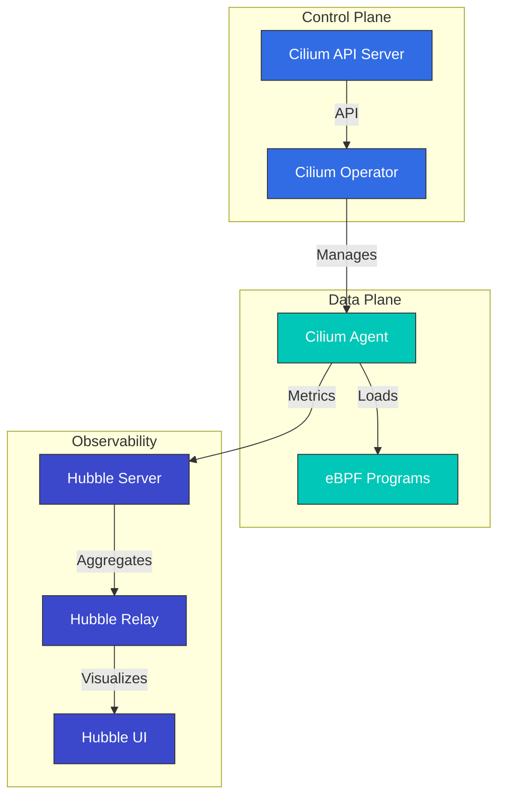

# Cilium 詳説: Cloud Native Networking の未来

## 概要

このセクションでは、Cilium のコアコンセプトと技術について包括的に理解します。Cilium のアーキテクチャ、eBPF 技術、ネットワーキングモデル、セキュリティ機能などを深く掘り下げます。

> **サポート対象バージョン**: Cilium 1.17, 1.18
> **Kubernetes 互換性**: 1.32 以降
> **最終更新**: August 10, 2026

### 2026 年 7 月の更新: パッチリリースと NetworkPolicy セキュリティ問題

2026 年 7 月 16 日、Cilium 1.19.6、1.18.12、1.17.18 のパッチリリースが公開されました。`CiliumGatewayClassConfig` の `spec.telemetry.accessLogs` による Gateway API アクセスログ設定の新規サポートとともに、agent の再起動・アップグレード中に確立済み接続が短時間切断される可能性があるリグレッション、および `service.cilium.io/affinity: "none"` アノテーションによってトラフィックブラックホールが発生する ClusterMesh のバグが修正されています。

また、**CVE-2026-56743** セキュリティ問題にも注意してください。デフォルト以外の `clusterName` を使用する Cilium 1.19.0-1.19.4 では、`ipBlock` ルールのみ（Pod/namespace セレクターなし）を使用する Kubernetes NetworkPolicy が、同じ namespace 内の他の workload からのトラフィックを意図せず許可する可能性があります。1.19.5 以降にアップグレードしてください。詳細は[セキュリティアドバイザリ](https://github.com/cilium/cilium/security/advisories/GHSA-fm8w-2m5w-9j7r)を参照してください。

2026 年 7 月 21 日、次期 1.20 マイナーリリースの 2 番目のリリース候補である [Cilium 1.20.0-rc.1](https://github.com/cilium/cilium/releases/tag/v1.20.0-rc.1) が公開されました。rc.0 は 7 月 14 日に公開されています。

### 2026 年 8 月の更新: Cilium 1.20.0 GA

2026 年 7 月 29 日、[Cilium 1.20.0](https://github.com/cilium/cilium/releases/tag/v1.20.0) がリリースされました。1,100 人以上のコントリビューターによる 2,660 件を超える新規コミットが含まれます。主な内容は次のとおりです。

- **Gateway API v1.6.1**: 新たに GA となった TCPRoute/UDPRoute、バックエンドへの TLS 向け `BackendTLSPolicy`、委譲リスナー管理用の ListenerSets、`ExternalAuth` フィルター（GEP-1494）、ネイティブ CORS サポート
- **ネットワーキング**: fork なしで eBPF datapath を拡張するための datapath プラグイン、自動 netkit 選択（`bpf.datapathMode=auto`）、dual-stack cluster 向け IPv6 egress gateway IP
- **IPAM**: AWS ENI IPAM 向け IPv6（Beta）、cluster-pool から multi-pool IPAM へのインプレース移行
- **Services/ClusterMesh**: `PreferSameZone`/`PreferSameNode` トラフィック分散、`service.cilium.io/weight` アノテーションによる重み付き Maglev バックエンド、安定版 Multi-Cluster Services（MCS）API サポート
- **セキュリティ**: Admin/Baseline ティアを備えた Kubernetes ClusterNetworkPolicy（KCNP）サポート、内部 CA または SPIRE による ztunnel identity、新しい `cluster-mesh` policy entity
- **パフォーマンス**: `cilium-cni` バイナリを約 77 MB から 16 MB に縮小し、大規模 cluster 向けに集約 load-balancer state と最適化された BPF policy-map encoding を追加

レガシー Mutual Authentication、Envoy Go extensions、Kafka-aware policies、`cilium.io/v2alpha1` `CiliumNodeConfig` API、libnetwork integration、またはカスタム CNI 設定を使用している場合は、アップグレード中に対応してください。詳細は[アップグレードガイド](https://docs.cilium.io/en/v1.20/operations/upgrade/#upgrade-notes)を参照してください。次のサイクルの最初のプレリリースである 1.21.0-pre.0 は 8 月 3 日に続いて公開されました。

## Cilium 1.18 の主な改善点

Cilium 1.18 では、次の主要な機能改善と新機能が提供されます。

### ネットワーキングの改善
- **強化された BGP Control Plane**: より柔軟でスケーラブルな BGP 設定
- **改善された Multi-cluster Routing**: cluster 間通信パフォーマンスの最適化
- **強化された Service Mesh 統合**: Envoy proxy との統合を改善

### セキュリティ強化
- **強化された Network Policies**: よりきめ細かい policy 制御とパフォーマンス改善
- **改善された暗号化オプション**: WireGuard および IPsec の暗号化パフォーマンスを最適化

### Observability の改善
- **Hubble の改善**: より豊富な metrics と tracing 情報
- **強化された Prometheus 統合**: 新しい metrics と dashboards
- **改善された Flow Logging**: より詳細な network flow 情報

### パフォーマンス最適化
- **eBPF Program の最適化**: より高速な packet 処理
- **メモリ使用量の改善**: 大規模 cluster での resource 効率を向上
- **CPU 使用量の最適化**: overhead を削減

## はじめに

Cilium は、Kubernetes、Docker、Mesos などの Linux コンテナ管理プラットフォーム向けのオープンソースのネットワーキング、セキュリティ、Observability ソリューションです。Cilium は eBPF（extended Berkeley Packet Filter）技術をベースとしており、従来の Linux ネットワーキングアプローチよりも強力かつ効率的なネットワーキングおよびセキュリティ機能を提供します。

### eBPF とは

eBPF は Linux kernel 内でサンドボックス化された仮想マシンのように機能する技術で、kernel コードを変更せずに kernel 内でプログラムを安全に実行できます。これにより、network packet 処理、system call monitoring、パフォーマンス分析などのさまざまなタスクを効率的に実行できます。

eBPF の主な特性:
- kernel space 実行による高パフォーマンス
- JIT（Just-In-Time）コンパイルによるネイティブパフォーマンス
- 安全な実行環境（verifier によるプログラム検証）
- 動的なロードとアンロードが可能

### Cilium の主な利点

1. **高パフォーマンスネットワーキング**: eBPF を使用した効率的な packet 処理
2. **きめ細かな Network Policies**: L3-L7 レベルの network policy をサポート
3. **透過的暗号化**: node 間での透過的な IPsec または WireGuard 暗号化
4. **Load Balancing**: XDP（eXpress Data Path）ベースの高パフォーマンス load balancing
5. **Observability**: Hubble による network flow の可視化
6. **Service Mesh**: 既存の sidecar なしで L7 traffic を管理
7. **Multi-Cluster Networking**: cluster 間の透過的な接続性
8. **BGP サポート**: 外部 network との統合

### 既存の CNI との比較

| Feature | Cilium | Calico | Flannel | AWS VPC CNI |
|---------|--------|--------|---------|-------------|
| Network Model | eBPF | iptables/IPVS | VXLAN/host-gw | AWS ENI |
| Network Policies | L3-L7 | L3-L4 | Limited | AWS Security Groups |
| Encryption | IPsec/WireGuard | IPsec | None | None |
| Observability | Hubble | Flow Logs | Limited | VPC Flow Logs |
| Service Mesh | Built-in | Requires Istio | Requires Istio | Requires Istio/AppMesh |
| Performance | Very High | High | Medium | High |
| Multi-Cluster | Built-in | Limited | None | Requires Transit Gateway |

## アーキテクチャ

Cilium は、eBPF をベースとする data plane と Kubernetes と統合された control plane で構成されます。



### 主要コンポーネント

1. **Cilium Agent**: 各 node で実行され、eBPF program をロードおよび管理
2. **Cilium Operator**: cluster レベルの resource と operation を管理
3. **eBPF Programs**: packet 処理および policy enforcement のために kernel にロード
4. **Hubble**: network flow monitoring と Observability を提供
5. **Cilium CLI**: Cilium と Hubble を管理する command-line tool

### ネットワーキングモデル

Cilium は複数のネットワーキングモードをサポートします。

1. **Direct Routing**: node 間の直接ルーティング（BGP または static routing）
2. **Tunneling**: VXLAN または Geneve tunnel を使用した overlay networking
3. **AWS ENI**: Amazon EKS で Elastic Network Interface（ENI）を利用
4. **Azure IPAM**: Azure AKS で Azure IPAM を利用

### Packet Flow

Cilium で packet が処理される流れ:

1. packet が network interface に到着
2. eBPF XDP program が初期処理（DDoS defense、load balancing）を実行
3. eBPF TC（Traffic Control）program が network policy を適用
4. packet が container network namespace に配信される
5. response packet は同様の経路で処理される

## Amazon EKS との統合

Amazon EKS で Cilium を使用するには、主に次の 2 つの方法があります。

1. **Amazon EKS Add-on としてインストール**: Amazon EKS が Cilium を managed add-on として提供します。
2. **手動インストール**: Helm chart を使用して直接インストールします。

### Amazon EKS Add-on としてのインストール

```bash
# Install Cilium add-on
aws eks create-addon \
  --cluster-name my-cluster \
  --addon-name cilium \
  --addon-version v1.17.0-eksbuild.1 \
  --service-account-role-arn arn:aws:iam::123456789012:role/AmazonEKSCiliumAddonRole

# Check add-on status
aws eks describe-addon \
  --cluster-name my-cluster \
  --addon-name cilium
```

### Helm による手動インストール

```bash
# Add Cilium Helm repository
helm repo add cilium https://helm.cilium.io/

# Update Helm repository
helm repo update

# Install Cilium
helm install cilium cilium/cilium \
  --version 1.17.0 \
  --namespace kube-system \
  --set eni.enabled=true \
  --set ipam.mode=eni \
  --set egressMasqueradeInterfaces=eth0 \
  --set tunnel=disabled
```

### EKS 固有の設定オプション

EKS で Cilium を使用する際に検討すべき主な設定オプション:

1. **ENI Mode**: AWS Elastic Network Interface を使用してネイティブ AWS ネットワーキングパフォーマンスを活用
2. **IPAM Mode**: AWS VPC IP address management との統合
3. **Encryption**: node 間 traffic の暗号化（WireGuard または IPsec）
4. **NodeLocal DNSCache**: DNS パフォーマンスの改善
5. **Hubble**: network Observability を有効化

### ENI Mode 設定

```yaml
apiVersion: v1
kind: ConfigMap
metadata:
  name: cilium-config
  namespace: kube-system
data:
  enable-endpoint-routes: "true"
  auto-create-cilium-node-resource: "true"
  ipam: "eni"
  eni-tags: "{\"Owner\": \"Cilium\"}"
  tunnel: "disabled"
  enable-ipv4: "true"
  enable-ipv6: "false"
  egress-masquerade-interfaces: "eth0"
```

### EKS Cluster への Cilium のインストール

#### 既存の EKS Cluster への Cilium のインストール

```bash
# Remove AWS CNI
kubectl delete daemonset -n kube-system aws-node

# Install Cilium
cilium install --set eni.enabled=true \
  --set ipam.mode=eni \
  --set egressMasqueradeInterfaces=eth0 \
  --set tunnel=disabled
```

#### Cilium CNI を使用する新しい EKS Cluster の作成

```bash
eksctl create cluster --name cilium-cluster \
  --without-nodegroup

eksctl create nodegroup --cluster cilium-cluster \
  --node-ami-family AmazonLinux2 \
  --node-type m5.large \
  --nodes 3 \
  --max-pods-per-node 110

# Install Cilium
cilium install --set eni.enabled=true \
  --set ipam.mode=eni \
  --set egressMasqueradeInterfaces=eth0 \
  --set tunnel=disabled
```

### EKS Cluster の相互接続

Cilium Cluster Mesh を使用した EKS cluster の相互接続:

```bash
# On cluster 1
cilium clustermesh enable --service-type LoadBalancer

# On cluster 2
cilium clustermesh enable --service-type LoadBalancer

# Connect clusters
cilium clustermesh connect --context cluster1 --destination-context cluster2
```

## インストールと設定

### 前提条件

- Kubernetes cluster（v1.16 以降）
- Linux kernel 4.9 以降（推奨: 5.4 以降）
- kubectl が設定済み
- Helm（任意）

### Cilium CLI のインストール

```bash
curl -L --remote-name-all https://github.com/cilium/cilium-cli/releases/latest/download/cilium-linux-amd64.tar.gz
sudo tar xzvfC cilium-linux-amd64.tar.gz /usr/local/bin
rm cilium-linux-amd64.tar.gz
```

### 設定オプション

#### ネットワーキングモード設定

直接ルーティングモード:
```bash
cilium install --set tunnel=disabled --set autoDirectNodeRoutes=true
```

VXLAN モード:
```bash
cilium install --set tunnel=vxlan
```

#### kube-proxy replacement 設定

完全置換モード:
```bash
cilium install --set kubeProxyReplacement=strict
```

#### 暗号化設定

WireGuard 暗号化:
```bash
cilium install --set encryption.enabled=true --set encryption.type=wireguard
```

IPsec 暗号化:
```bash
cilium install --set encryption.enabled=true --set encryption.type=ipsec
```

## Network Policies

Cilium は Kubernetes NetworkPolicy API を拡張し、L3-L7 レベルできめ細かな network policy を提供します。

### 基本的な Network Policy

```yaml
apiVersion: networking.k8s.io/v1
kind: NetworkPolicy
metadata:
  name: allow-frontend-to-backend
  namespace: app
spec:
  podSelector:
    matchLabels:
      app: backend
  ingress:
  - from:
    - podSelector:
        matchLabels:
          app: frontend
    ports:
    - port: 8080
      protocol: TCP
```

### Cilium Network Policy

```yaml
apiVersion: cilium.io/v2
kind: CiliumNetworkPolicy
metadata:
  name: allow-specific-http-methods
  namespace: app
spec:
  endpointSelector:
    matchLabels:
      app: backend
  ingress:
  - fromEndpoints:
    - matchLabels:
        app: frontend
    toPorts:
    - ports:
      - port: "8080"
        protocol: TCP
      rules:
        http:
        - method: "GET"
          path: "/api/v1/products"
```

### FQDN ベースの Policy

```yaml
apiVersion: cilium.io/v2
kind: CiliumNetworkPolicy
metadata:
  name: allow-specific-domains
  namespace: app
spec:
  endpointSelector:
    matchLabels:
      app: web
  egress:
  - toFQDNs:
    - matchName: "api.example.com"
    - matchPattern: "*.amazonaws.com"
    toPorts:
    - ports:
      - port: "443"
        protocol: TCP
```

## Hubble による Observability

Hubble は Cilium の Observability layer であり、eBPF を通じて収集した network flow data の可視化と分析を可能にします。

### Hubble のインストール

```bash
cilium hubble enable --ui
```

### Network Flow の観測

```bash
# Observe all flows
hubble observe

# Observe flows in specific namespace
hubble observe --namespace app

# Observe HTTP requests
hubble observe --protocol http

# Observe flows between pods with specific labels
hubble observe --from-label app=frontend --to-label app=backend

# Observe failed connections
hubble observe --verdict DROPPED
```

### Prometheus 統合

```bash
cilium hubble enable --metrics="{dns:query;ignoreAAAA,drop:sourceContext=pod;destinationContext=pod,tcp,flow,icmp,http}"
```

## Cilium のテスト

```bash
# Basic connectivity test
cilium connectivity test

# Run specific test
cilium connectivity test --test=client-to-echo-service

# Network performance test
cilium connectivity test --test=performance
```

## ベストプラクティス

### パフォーマンス最適化

1. **Kernel Version の最適化**: Linux kernel 5.4 以降を使用
2. **BBR Congestion Control を有効化**: network throughput を改善
3. **XDP Acceleration を有効化**: packet 処理パフォーマンスを改善
4. **MTU の最適化**: network environment に適した MTU を設定

```bash
cilium install --set bpf.preallocateMaps=true \
  --set bpf.masquerade=true \
  --set devices=eth0 \
  --set loadBalancer.acceleration=native \
  --set loadBalancer.mode=dsr
```

### セキュリティ強化

1. **Default Deny Policy を適用**: 明示的に許可された traffic のみを許可
2. **Encryption を有効化**: node 間 traffic を暗号化
3. **最小権限の原則を適用**: 必要な通信のみを許可する policy を設計

### Observability の改善

```bash
cilium hubble enable --metrics="{dns,drop,tcp,flow,http}"
```

## トラブルシューティング

### Connectivity の問題

```bash
# Check Cilium status
cilium status

# Check endpoint status
cilium endpoint list

# Review network policies
kubectl get cnp,ccnp -A

# Analyze flows
hubble observe --verdict DROPPED
```

### パフォーマンスの問題

```bash
# Check eBPF map status
cilium bpf maps list

# Monitor system resources
cilium metrics list
```

### Debugging Tools

```bash
# Check status
cilium status --verbose

# Collect environment information
cilium sysdump

# Cilium agent logs
kubectl logs -n kube-system -l k8s-app=cilium
```

## 詳説の目次

**[Cilium の概要と基本コンセプト](01-introduction.md)**
- Cilium の概要と歴史
- Container Networking の基礎
- CNI（Container Network Interface）の理解
- Cilium の差別化機能

**[eBPF 技術の詳細](02-ebpf.md)**
- eBPF 技術の概要と歴史
- kernel 内部での eBPF の動作
- eBPF Program Types と Maps
- Cilium での eBPF の活用

**[ネットワーキングモデルと VXLAN](03-networking.md)**
- Container Networking Models の比較
- VXLAN 技術の詳細
- Cilium の Overlay Networking
- パフォーマンス最適化手法
- Routing Mechanisms（Encapsulation vs Native-Routing）
- Cloud Provider Networking（AWS ENI、Google Cloud）

**[IPAM と Network Policies](04-ipam-policy.md)**
- IP Address Management（IPAM）戦略
- Kubernetes と Cilium IPAM の統合
- Network Policy の設計と実装
- Multi-Cluster シナリオ
- IPAM Mode の詳細（Cluster Scope、Kubernetes Host Scope、Multi-Pool）
- Cloud Provider IPAM（Azure IPAM、AWS ENI、GKE）
- CRD ベースの IPAM

**[L2-L7 Networking と Load Balancing](05-l2-l7-networking.md)**
- OSI Model Layers（L2、L3、L4、L7）の理解
- Cilium の Layer 固有機能
- Service Mesh 統合
- Load Balancing アーキテクチャ
- Masquerading の設定と実装モード
- IPv4 Fragment 処理

**[セキュリティと可視性](06-security-visibility.md)**
- Cilium のセキュリティ機能
- Network Visibility と Monitoring
- Hubble のアーキテクチャと使用方法
- Real-time Threat Detection

**[高度なトピックと実例](07-advanced-topics.md)**
- パフォーマンスチューニングとトラブルシューティング
- 大規模 Deployment 戦略
- 実際の Use Case 研究
- 将来の Roadmap と開発方向

## 追加リソース

- [ネットワーキングコンセプトの詳細](networking-concepts.md)
- [用語集と略語](glossary.md)

## 参考資料

- [Cilium 公式ドキュメント](https://docs.cilium.io/)
- [Cilium GitHub Repository](https://github.com/cilium/cilium)
- [eBPF ドキュメント](https://ebpf.io/)
- [Hubble ドキュメント](https://github.com/cilium/hubble)
- [Cilium Network Policy Editor](https://editor.cilium.io/)
- [AWS EKS Workshop - Cilium](https://www.eksworkshop.com/beginner/115_cilium/)

## クイズ

このセクションで学んだ内容を確認するには、[Cilium 詳説クイズ](../../quizzes/networking/cilium/01-introduction-quiz.md)に挑戦してください。
